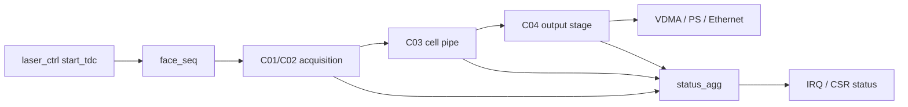

# C05 Top Sequencer / Status 분석 계획 v001

- 생성 시간: `2026-05-01 04:31:06 +09:00`
- 최종 수정 시간: `2026-05-01 04:35:07 +09:00`
- 기준 문서: `Doc/TDC-GPX-Datasheet.pdf`
- 입력 인계 문서: `Doc/cluster_analysis/C04_Output_Stage/C04_Output_Stage_260501043106_C05_Handoff_v001.md`
- Cluster: `C05_Top_Sequencer_Status`

> Lineage Note - 2026-05-01 04:40:33 +09:00  
> 이 v001 문서는 기능적으로 top-level sequencing/status 분석 계획을 담고 있으나, 초기 `cluster_analysis_communication_plan_20260429_v001.md` 기준으로는 `C06_Control_Status_Integration`에 해당한다. 정식 승계 문서는 `Doc/cluster_analysis/C06_Control_Status_Integration/C06_Control_Status_Integration_260501044033_Plan_v001.md`이다. 반영 위치는 `1. C06 목적`, `2. 분석 대상과 제외 범위`, `7. Timing / Latency / Throughput / Pipeline / II 분석 계획`, `8. 검증 계획`이다. 이 v001 문서는 삭제하지 않고 superseded 문맥 추적용으로 보존한다.
- 대상 RTL: `tdc_gpx_top.vhd`, `tdc_gpx_face_seq.vhd`, `tdc_gpx_status_agg.vhd`, downstream AXI4-Stream system contract

---

## 1. C05 목표

C05의 목적은 C01~C04에서 닫은 데이터 처리 파이프라인을 top-level 운용 개념으로 연결하는 것이다.

핵심 질문은 다음이다.

```text
start_tdc가 들어온 뒤
face_seq가 packet/face/shot을 어떻게 열고,
C01~C04가 데이터를 어떻게 drain하고,
status/IRQ가 어떤 fault와 진행 상태를 사용자에게 알려주며,
다음 start_tdc를 언제 받아도 되는가?
```

C04에서 polygon mirror budget을 반영했기 때문에 C05에서는 해당 예산이 실제 top-level sequence와 downstream ready 조건에서도 유지되는지 확인한다.

---

## 2. 분석 범위

| 범위 | 포함 여부 | 이유 |
|---|---|---|
| `tdc_gpx_face_seq.vhd` | 포함 | `shot_start`, `packet_start`, `face_start`, `face_closing`, `frame_done_both` 제어 |
| `tdc_gpx_status_agg.vhd` | 포함 | 상태/에러/timestamp aggregation |
| `tdc_gpx_top.vhd` | 포함 | C01~C04, face_seq, status_agg 연결과 외부 포트 계약 |
| C04 final AXIS ready/backpressure | 포함 | polygon budget의 II=1 가정 검증 |
| VDMA/PS/Ethernet 8us reserve | 포함 | 사용자 운용 budget의 핵심 가정 |
| C01~C04 내부 재분석 | 제외 | 이미 Cluster별로 분석/검증 완료. 단, C05 계약 확인에 필요한 line ref만 사용 |
| Quiet/M-mode, Continuous Measurement | 제외 | 프로젝트 범위는 I-Mode single |
| 16-bit bus mode, 250MHz retiming | 제외 | 이전 규칙에 따라 후속 generation 검토 |

---

## 3. 입력 계약

C05는 C04에서 다음 계약을 수락한다.

| 계약 ID | 내용 | C05 검증 방향 |
|---|---|---|
| H-C04C05-01 | output width는 32/64/128만 지원 | top generic과 downstream width 일치 확인 |
| H-C04C05-02 | rising/falling final stream은 별도 lane | VDMA channel mapping과 frame sync 확인 |
| H-C04C05-03 | `tuser(0)`는 SOF | VDMA/SW packet boundary 해석 확인 |
| H-C04C05-04 | `Hit[16]`은 최종 stream에서 제거 | SW parser와 문서 계약 확인 |
| H-C04C05-05 | `max_hits_cfg`는 face/shot 시작 전 설정 | face_seq/CSR snapshot 타이밍 검토 |
| H-C04C05-06 | polygon budget은 8us reserve 가정 기반 | reserve sweep과 worst-case 검토 |
| H-C04C05-07 | C04 timing PASS는 output ready 유지 조건 | backpressure negative test 필요 |
| H-C04C05-08 | C04 fault/status는 사용자 추적 가능해야 함 | status bit map, IRQ, sticky clear 검증 |

---

## 4. 분석 절차

### 4.1 구조/상태머신 분석

대상:

- `tdc_gpx_top.vhd:853` 이후 `u_face_seq`
- `tdc_gpx_face_seq.vhd:31` 이후 entity/architecture
- `tdc_gpx_status_agg.vhd:32` 이후 entity/architecture

산출:

- face/shot 상태머신 관계도
- `start_tdc -> packet_start -> face_start -> shot_start_gated -> C01~C04 drain -> frame_done_both` timing block diagram
- `face_closing`이 다음 shot 수락을 막는지에 대한 논리 검토

### 4.2 Data Flow / Control Flow 통합



확인할 점:

| 항목 | 질문 |
|---|---|
| shot accept | C04가 drain 중일 때 새 `start_tdc`가 들어오면 drop/deferral/overrun 중 무엇인가? |
| face close | `s_face_closing`이 output drain 상태와 실제로 일치하는가? |
| frame done | rising/falling 양 lane이 모두 닫혀야 다음 face/shot이 안전한가? |
| status | 어떤 fault가 sticky이고 어떤 fault가 pulse인가? |
| IRQ | 사용자 SW가 fault와 정상 완료를 구분할 수 있는가? |

### 4.3 Timing / Latency / Throughput / Pipeline / II

규칙에 따라 C05도 매 결과에 아래 분석을 포함한다.

| Metric | C05에서의 의미 |
|---|---|
| Latency | `start_tdc`부터 최종 AXIS frame 완료 및 status 반영까지 |
| Throughput | polygon point rate 13.888889us 조건에서 유지 가능한 frame/shot 처리량 |
| Pipeline | face_seq, C01~C04, status/IRQ, downstream ready의 stage 관계 |
| II | 연속 `start_tdc` 간 최소 간격과 backpressure 발생 시 증가량 |

Timing diagram 필수 포함:

```text
T0  start_tdc
T1  shot_start_gated / packet_start
T2  GPX stop_tdc / raw drain 완료
T3  C04 final AXIS first beat
T4  C04 final AXIS tlast
T5  frame_done_both/status update
T6  next start_tdc 허용
```

### 4.4 검증 계획

| 검증 ID | 목적 | 예상 방법 |
|---|---|---|
| VB-C05-01 | 정상 I-Mode single 연속 shot | top-level TB 또는 기존 통합 TB 확장 |
| VB-C05-02 | `i_m_axis_tready` stall 시 face_seq 보호 | ready low 삽입 negative test |
| VB-C05-03 | rising/falling lane 중 한쪽 지연 | frame_done_both와 face_closing 확인 |
| VB-C05-04 | polygon budget reserve sweep | 8us 기준, +/- margin 분석 |
| VB-C05-05 | status sticky/clear | CSR read/write helper는 `px_utility_pkg.vhd` 사용 |
| VB-C05-06 | IRQ 정상/에러 분리 | `o_irq`, `o_irq_pipe` pulse/level 확인 |
| VB-C05-07 | `max_hits_cfg` 변경 시점 | face/shot 시작 전/중/후 변경 효과 확인 |
| VB-C05-08 | 32/64/128 width downstream ready | width별 frame count/tlast/SOF 확인 |

---

## 5. 예상 finding 후보

분석 전 가설이며, 확정 finding은 코드와 TB 근거로만 등록한다.

| 후보 ID | 내용 | 이유 |
|---|---|---|
| F-C05-01 | `face_seq` 조합 gating이 규칙의 2-depth 제한과 충돌할 수 있음 | `s_packet_start_comb`가 여러 조건을 직접 결합 |
| F-C05-02 | C04 output ready stall이 polygon budget을 무너뜨릴 수 있음 | C04 timing은 ready high 기준으로 산출 |
| F-C05-03 | status bit가 너무 많아 SW 추적성이 떨어질 수 있음 | `tdc_gpx_top.vhd:962` 이후 status assignment가 매우 큼 |
| F-C05-04 | `g_STREAM_CLK_MODE` 계약이 top-level에서 완전히 닫혔는지 확인 필요 | async/sync 모드가 downstream system과 연결됨 |
| F-C05-05 | `frame_done_both`와 다음 shot 허용 조건이 타이밍상 1clk 지연을 만들 수 있음 | face_seq가 registered closure를 사용 |

---

## 6. C05 완료 조건

C05는 다음 조건을 만족하면 완료로 본다.

1. `start_tdc` 기반 top-level 운용 timing diagram이 작성된다.
2. `face_seq` 상태머신과 C04 drain/ready 관계가 설명된다.
3. status/IRQ map이 사용자 추적 가능한 형태로 정리된다.
4. polygon budget 13.888889us / reserve 8us 조건이 top-level에서 다시 검증된다.
5. 32/64/128 width별 latency, throughput, pipeline, II가 문서와 PPT로 정리된다.
6. 필요 시 TB가 작성되고 Vivado xsim으로 PASS/FAIL이 기록된다.
7. C05 결과가 다음 Cluster 또는 최종 통합 판단으로 handoff된다.

---

## 7. 다음 작업

첫 번째 C05 작업은 `tdc_gpx_face_seq.vhd` 상태머신과 `tdc_gpx_top.vhd`의 C04 drain/status 연결을 코드 line 근거로 분석하는 것이다.

산출 예정:

- `C05_Top_Sequencer_Status_<YYMMDDHHMMSS>_Analysis_v001.md`
- `C05_Top_Sequencer_Status_<YYMMDDHHMMSS>_Analysis_v001.pptx`
- 필요 시 `tb_tdc_gpx_c05_*` 검증 TB
