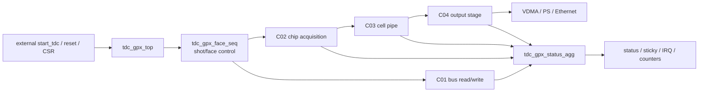
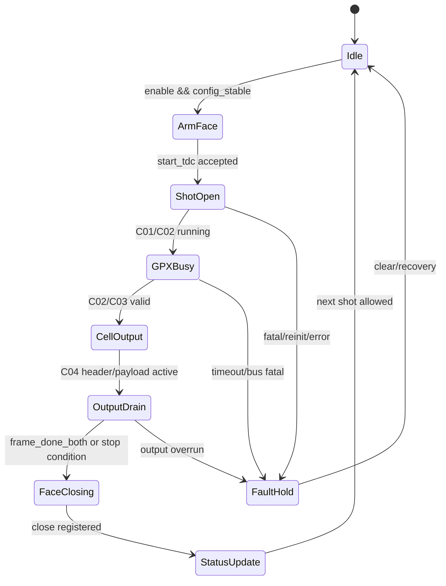
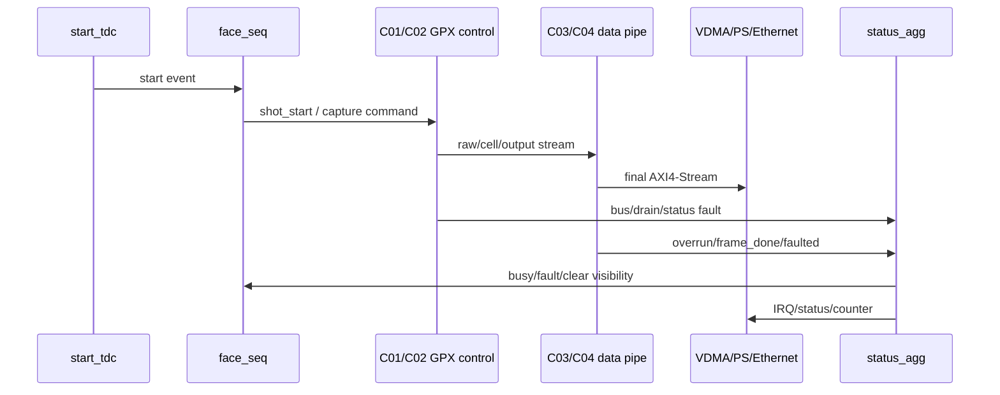

# C06 Control/Status Integration Plan v001

- 작성 시간: `2026-05-01 04:40:33 +09:00`
- 최종 수정 시간: `2026-05-01 04:40:33 +09:00`
- 절대 기준 문서: `Doc/TDC-GPX-Datasheet.pdf`
- 기준 소통 문서: `Doc/cluster_analysis/cluster_analysis_communication_plan_20260429_v001.md`
- 선행 인계 문서: `Doc/cluster_analysis/C04_Output_Stage/C04_Output_Stage_260501044033_C06_Handoff_v002.md`
- Supersedes: `Doc/cluster_analysis/C05_Top_Sequencer_Status/C05_Top_Sequencer_Status_260501043106_Plan_v001.md`

---

## 1. C06 목적

C06은 C01~C04에서 닫은 데이터 경로를 top-level 운용 제어와 status/IRQ 계약으로 통합하는 Cluster다. 초기 소통 계획의 `C06_Control_Status_Integration`에 해당하며, 이전에 잘못 명명된 `C05_Top_Sequencer_Status` 문서는 이 문서로 승계한다.

핵심 질문:

1. `start_tdc`가 들어온 뒤 face/shot sequence가 어떤 조건으로 열리고 닫히는가?
2. C04 output drain이 끝나기 전 다음 shot이 들어오면 drop, defer, overrun 중 무엇으로 처리되는가?
3. C01~C04 fault가 status bit, sticky bit, IRQ, counter로 사용자가 추적 가능한 형태인가?
4. 32/64/128 output width와 `max_hits_cfg` 정책이 top-level에서 face/shot 시작 전에 안정적으로 적용되는가?
5. polygon mirror 운용 budget의 `8us reserve`와 output ready high 가정이 system 계약으로 닫히는가?

---

## 2. 분석 대상과 제외 범위

| 구분 | 대상 | 근거 |
|---|---|---|
| Top integration | `tdc_gpx_top.vhd` | `tdc_gpx_top.vhd:16-17`, `tdc_gpx_top.vhd:853`, `tdc_gpx_top.vhd:917`, `tdc_gpx_top.vhd:962` 이후 status assignment |
| Face/shot sequencer | `tdc_gpx_face_seq.vhd` | `tdc_gpx_face_seq.vhd:31`, `tdc_gpx_face_seq.vhd:59`, `tdc_gpx_face_seq.vhd:75-93` |
| Status aggregation | `tdc_gpx_status_agg.vhd` | `tdc_gpx_status_agg.vhd:32`, `tdc_gpx_status_agg.vhd:94`, `tdc_gpx_status_agg.vhd:161-179` |
| Config/CSR 영향 | `tdc_gpx_config_ctrl.vhd`, CSR 관련 파일 | C06에서 `max_hits_cfg`, width, enable, clear semantic의 적용 시점 확인 |
| Downstream 계약 | VDMA/PS/Ethernet 가정 | C04 polygon budget의 `8us reserve` 검증 항목 |

제외 범위:

- GPX physical bus timing 재분석은 C01 결과를 따른다.
- chip acquisition drain 내부 상세 구현은 C02 결과를 따른다.
- cell build 내부 hit packing은 C03 결과를 따른다.
- output serialization 내부 상세는 C04 결과를 따른다.
- Quiet/M-mode full sequence는 현재 프로젝트 운용 범위가 아니다. I-Mode single만 기준으로 한다.

---

## 3. C06 경계

C06은 데이터 beat의 내부 payload를 다시 설계하지 않는다. 대신 해당 데이터가 안전한 sequence와 status 계약 아래에서 언제 시작되고, 언제 종료되며, 언제 다음 transaction을 허용할 수 있는지 닫는다.

---

## 4. Datasheet 기준 확인 항목

Datasheet는 계속 최상위 판단 기준이다. C06에서 Datasheet와 직접 연결되는 항목은 다음과 같다.

| Datasheet 관점 | C06 적용 질문 | 산출물 |
|---|---|---|
| I-Mode single measurement | 현재 face/shot sequence가 I-Mode single만을 가정하고 있는지 | 운용 state relation diagram |
| GPX read/status timing | lower cluster에서 올린 fault/status가 top-level에서 손실되지 않는지 | status propagation table |
| IFIFO/interrupt/status semantics | empty/full/interrupt 의미가 user-visible status와 일치하는지 | status bit map |
| timing prohibition | 금지 조건이 발생하면 다음 shot을 막거나 fault로 드러나는지 | negative test list |

Datasheet page/table 번호는 C06 상세 분석 v001에서 PDF 직접 확인 후 문서에 page 단위로 추가한다. 이 Plan 문서는 분석 절차와 인계 계약을 정의한다.

---

## 5. 상태머신 관계도 초안

검토 포인트:

- `face_closing`은 조합망이 아니라 registered boundary인지 확인한다.
- `frame_done_both`가 rising/falling 두 lane 완료를 정확히 의미하는지 확인한다.
- 다음 `start_tdc` 허용 조건은 `OutputDrain` 완료 및 status update와 충돌하지 않아야 한다.

---

## 6. Data Flow와 Control Flow 분리

C06 문서는 data beat와 control/status beat를 혼동하지 않도록 다음 두 경로를 분리해서 설명한다.

| 경로 | 내용 | C06 판단 |
|---|---|---|
| Data flow | C01 read -> C02 raw -> C03 cell -> C04 AXIS -> VDMA | 이미 C01~C04에서 개별 검증됨. C06은 end-to-end boundary와 backpressure를 검토한다. |
| Control/status flow | start_tdc -> face_seq -> busy/closing/status/IRQ -> SW | C06의 주 분석 대상이다. |

---

## 7. Timing / Latency / Throughput / Pipeline / II 분석 계획

### 7.1 기준 marker

| Marker | 의미 | clock/domain |
|---|---|---|
| T0 | external `start_tdc` 또는 shot request accepted | top/control clock |
| T1 | `face_seq`가 shot을 수락하고 lower cluster를 enable | top/control clock |
| T2 | GPX stop/read/drain 완료가 C02/C03로 전달 | C01/C02 관련 clock |
| T3 | C04 final AXIS first beat | stream clock |
| T4 | C04 final AXIS `tlast` | stream clock |
| T5 | `frame_done_both`와 status update가 top에 반영 | top/control clock |
| T6 | 다음 `start_tdc` 허용 | top/control clock |

### 7.2 분석 항목

| Metric | 분석 방법 | 필요 검증 |
|---|---|---|
| Latency | T0->T6을 control, acquisition, output, status 구간으로 분해 | timing block diagram, xsim marker log |
| Throughput | point interval 13.888889us 기준 한 shot/frame 완료 가능성 계산 | C04 polygon 결과 + C06 gating |
| Pipeline | face_seq, C01/C02, C03, C04, status_agg stage 구분 | registered boundary 확인 |
| II | 다음 `start_tdc`를 받을 수 있는 최소 간격 산출 | backpressure/stall 포함 negative test |

### 7.3 C04 인계값 반영

| Width | C04 기준 cfg=7 유지 가능 거리 | C06에서 추가 확인할 것 |
|---:|---:|---|
| 32 | 710m까지 | output ready stall이 있으면 거리 margin 재계산 |
| 64 | 780m까지 | VDMA/PS parser가 64bit layout을 정확히 해석하는지 |
| 128 | 810m까지 | 128bit system path의 tready/CDC/VDMA 계약 확인 |

---

## 8. 검증 계획

| ID | 검증 항목 | 목적 |
|---|---|---|
| VB-C06-01 | I-Mode single start/finish 정상 sequence | C06 기본 운용 close |
| VB-C06-02 | C04 drain 중 next start_tdc 입력 | defer/drop/overrun 정책 확인 |
| VB-C06-03 | rising lane만 완료, falling lane 지연 | `frame_done_both`와 `face_closing` 확인 |
| VB-C06-04 | output `tready` stall | C04 II=1 가정 붕괴 시 status/overrun 확인 |
| VB-C06-05 | status sticky clear | SW가 fault 원인을 추적하고 clear 가능한지 확인 |
| VB-C06-06 | `max_hits_cfg` face/shot 시작 전 snapshot | width 이득이 적용되는 시점 확인 |
| VB-C06-07 | 32/64/128 width top generic sweep | system-visible 계약 확인 |
| VB-C06-08 | reset/soft_reset/force_reinit | recovery sequence 확인 |
| VB-C06-09 | IRQ pulse/level 정책 | SW interrupt 처리 의미 확인 |
| VB-C06-10 | polygon budget with backpressure | 8us reserve와 실제 top-level stall 결합 검토 |

검증 TB가 AXI4-Lite CSR를 쓰고 읽는 경우, 반드시 `px_utility_pkg.vhd`의 `px_axi_lite_writer`/`px_axi_lite_reader`를 사용한다.

---

## 9. 코드 리뷰 초점

| 항목 | 리뷰 기준 |
|---|---|
| registered boundary | module 경계 출력, status fan-out, handshake 경로가 FF/register로 닫히는지 |
| combinational depth | 조합논리는 최대 2-depth 규칙을 만족하는지 |
| naming | prefix/postfix 규칙을 새로 만드는 코드와 문서 finding에 반영하는지 |
| CDC | async status/start/reset/stream 경계가 명시적 synchronizer/FIFO를 통과하는지 |
| status semantics | sticky/counter/clear/IRQ 의미가 SW 관점에서 추적 가능한지 |
| Datasheet alignment | Datasheet 금지 조건/상태 의미와 RTL 운용 정책이 충돌하지 않는지 |

---

## 10. 산출물 계획

| 산출물 | 파일명 예정 | 내용 |
|---|---|---|
| C06 분석 v001 | `C06_Control_Status_Integration_<timestamp>_Analysis_v001.md/.pptx` | scope, data/control flow, state relation, timing/pipeline/II |
| C06 code review v001 | `C06_Control_Status_Integration_<timestamp>_Code_Review_v001.md` | findings, risk, 수정안 |
| C06 verification v001 | `C06_Control_Status_Integration_<timestamp>_Verify_v001.md/.pptx` | xsim 결과와 closure 판단 |
| C06 handoff | `C06_Control_Status_Integration_<timestamp>_C07_Handoff_v001.md/.pptx` | 다음 단계가 필요할 경우 계약 인계 |

---

## 11. 사용자 확인 필요

현재 C06 진입 전 사용자가 이미 결정한 운용 정책:

- Quiet/M-mode 운용 없음.
- I-Mode single 측정만 진행.
- 최종 VDMA stream에서 `Hit[16]`은 버림.
- output width는 32/64/128만 검토하며 256bit는 반영하지 않음.
- Vivado/xsim 경로는 `C:\AMDDesignTools\2025.2.1\Vivado`.
- RTL은 합성 가능한 VHDL로 작성.

C06 분석 중 사용자 확인이 필요한 후보:

1. 다음 `start_tdc`가 C04 drain 중 들어왔을 때 정책: defer 우선인지, overrun flag 우선인지.
2. VDMA/PS/Ethernet reserve `8us`를 고정 정책으로 둘지, 거리/width/cfg별 sweep 대상으로 둘지.
3. IRQ는 pulse 기반인지 level/sticky 기반인지.

---

## 12. v001 승계 기록

| 이전 문서 | 승계 판단 | 이 문서 반영 위치 |
|---|---|---|
| `C05_Top_Sequencer_Status_260501043106_Plan_v001.md` | 기능적으로 C06 계획이므로 superseded | 전체 문서, 특히 `1. C06 목적`, `2. 분석 대상과 제외 범위` |
| `C04_Output_Stage_260501043106_C05_Handoff_v001.md` | C04 기술 결론은 유지, 다음 Cluster 명칭만 정정 | `선행 인계 문서`, `7. Timing...`, `8. 검증 계획` |

---

## 13. C06 시작 판정

판정: C06 분석 시작 가능.

단, 첫 실제 분석 문서는 `tdc_gpx_top.vhd`, `tdc_gpx_face_seq.vhd`, `tdc_gpx_status_agg.vhd`의 line 근거를 다시 확정하고, Datasheet page/table 근거를 추가한 뒤 state relation diagram과 timing block diagram을 작성해야 한다.
