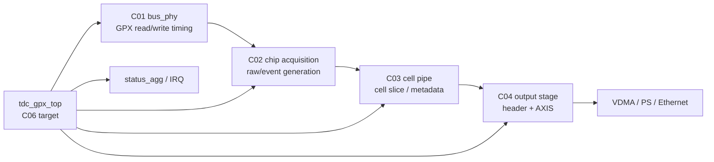
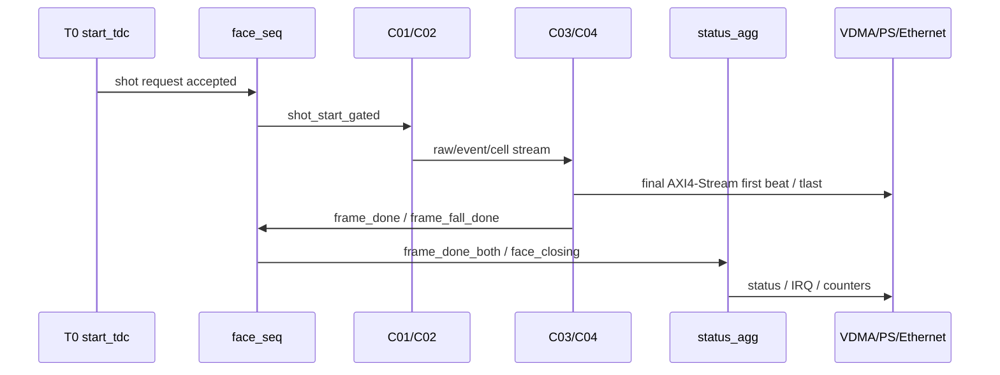

# C06 Progress / Module Completeness Check v001

- 작성 시간: `2026-05-11 15:56:27 +09:00`
- 최종 수정 시간: `2026-05-11 15:56:27 +09:00`
- 절대 기준 문서: `Doc/TDC-GPX-Datasheet.pdf`
- 기준 계획: `Doc/cluster_analysis/cluster_analysis_communication_plan_20260429_v001.md`
- 최신 운영 규칙: `Doc/cluster_analysis/cluster_analysis_260501010717_operating_protocol_v011.md`
- 기준 인계 문서: `Doc/cluster_analysis/C04_Output_Stage/C04_Output_Stage_260501044033_C06_Handoff_v002.md`
- 기준 계획 문서: `Doc/cluster_analysis/C06_Control_Status_Integration/C06_Control_Status_Integration_260501044033_Plan_v001.md`
- 기준 커밋: `ff93944 docs: correct C04 handoff to C06`

---

## 1. 요약 판단

판정: 데이터 파이프라인은 C01~C04 기준으로 상당히 닫혔고, 현재 프로젝트는 `C06_Control_Status_Integration` 진입 직후 상태다.

모듈 완성도를 한 문장으로 정리하면 다음과 같다.

> GPX IC read부터 C04 final AXI4-Stream 생성까지의 data path는 검증 근거가 충분하지만, `start_tdc` 수락 조건, C04 drain 중 다음 shot 처리, status/IRQ 의미, downstream backpressure를 포함한 top-level 운용 closure는 아직 C06에서 닫아야 한다.

현재 판단 수치:

| 구분 | 판단 | 근거 |
|---|---:|---|
| Cluster 진행률 | 약 80% | 초기 계획상 C01~C04 완료, C05 기능은 C04에 흡수, C06 계획 완료/분석 전 |
| Data path 완성도 | 약 90% | C01~C04 closure와 width/polygon 검증 존재 |
| Control/status 완성도 | 약 55% | RTL 구현은 존재하지만 C06 검증 matrix VB-C06-01..10이 아직 미실행 |
| 전체 모듈 운용 완성도 | 약 75% | 시스템 운용 조건이 C06에서 닫히기 전이므로 최종 완료로 보기는 어려움 |

위 수치는 합성 리포트나 STA 기반 수치가 아니라, 현재 문서/RTL/xsim 근거 기반의 engineering readiness 추정이다.

---

## 2. 계획 대비 진행 상황

초기 `cluster_analysis_communication_plan_20260429_v001.md` 기준 진행 상황은 다음과 같다.

| 계획 Cluster | 실제 진행 상태 | 판정 |
|---|---|---|
| `C01_GPX_Bus_Read` | C01 분석, 코드 보완, 회귀/negative evidence package 완료 | Close |
| `C02_Chip_Acquisition` | C02 drain, expected/fire-count, AXIS width, CTL21 timing 계약 완료 | Close |
| `C03_Raw_Decode_Event` / cell pipe 범위 | 현재 문서상 `C03_Cell_Pipe`로 수행. Hit[16] metadata 보존 및 stale-ready/abort 보완 완료 | Close |
| `C04_Cell_Build` / output 전 단계 | 실제 흐름에서 C03/C04로 재배치됨. cell build 결과는 C03에서 닫고 output serialization은 C04에서 닫음 | Close |
| `C05_Face_Output` | 실제로 `C04_Output_Stage`에서 수행됨. C04->C06 v002에서 numbering 정정 | Close, numbering superseded |
| `C06_Control_Status_Integration` | Plan v001 생성 완료. 분석/검증/수정은 아직 시작 전 | Open |

정정 사항:

- `C05_Top_Sequencer_Status` 명칭은 초기 계획 번호와 맞지 않아 superseded 처리되었다.
- 실제 다음 Cluster 폴더는 `Doc/cluster_analysis/C06_Control_Status_Integration`이다.
- C06 이후 별도 Cluster가 필요한지는 C06 closure 후 결정한다.

---

## 3. Cluster별 Closure 점검

### 3.1 C01 GPX Bus Read

| 항목 | 상태 | 근거 |
|---|---|---|
| Datasheet 기반 bus timing 검토 | Close | `C01_GPX_Bus_Read_20260429_v009.md` |
| 코드 보완 및 회귀 | Close | `C01_GPX_Bus_Read_Code_Verify_20260429_v005.md` |
| positive regression | PASS | `C01_GPX_Bus_Read_Code_Verify_20260429_v005.md:180-198`, `:209` |
| negative evidence | PASS | `C01_GPX_Bus_Read_Code_Verify_20260429_v005.md:229-234`, `:436-438` |
| C02 진입 판단 | 가능 | `C01_GPX_Bus_Read_Code_Verify_20260429_v005.md:378-382` |

C01은 운영 정합성 + 기능 PASS + evidence package가 닫힌 상태로 판단한다.

### 3.2 C02 Chip Acquisition

| 항목 | 상태 | 근거 |
|---|---|---|
| I-Mode single 범위 확정 | Close | `C02_Chip_Acquisition_260501021013_C03_Handoff_v001.md:23-24` |
| `CTL21.max_hits_cfg` 적용 시점 | Close | `C02_Chip_Acquisition_260501021013_C03_Handoff_v001.md:25-27`, `:56-59` |
| 32/64/128 width top 통합 | PASS | `xsim_top_int_width32.log:92`, `xsim_top_int_width64.log:92`, `xsim_top_int_width128.log:92` |
| width/max_hits matrix | PASS | `xsim_width_timing_matrix.log:30-110` |
| C03 진입 판단 | 가능 | `C02_Chip_Acquisition_260501021013_C03_Handoff_v001.md:13-17`, `:141` |

C02는 C03에 넘길 event/data/control 계약을 닫은 상태다. 단, 17-bit full preservation은 현재 generation에서는 C03/C04 정책으로 이관되었다.

### 3.3 C03 Cell Pipe

| 항목 | 상태 | 근거 |
|---|---|---|
| Hit[16] metadata 분리 | Close | `C03_Cell_Pipe_260501030046_C04_Handoff_v002.md:34`, `:49-56` |
| stale-ready beat loss 보완 | Close | `C03_Cell_Pipe_260501030046_C04_Handoff_v002.md:35` |
| per-slope abort stale hold 보완 | Close | `C03_Cell_Pipe_260501030046_C04_Handoff_v002.md:36` |
| TB 부족 보완 | Close | `C03_Cell_Pipe_260501030046_C04_Handoff_v002.md:37` |
| C04 진입 판단 | 가능 | `C03_Cell_Pipe_260501030046_C04_Handoff_v002.md:148-154` |

C03는 이번 generation에서 C04가 `Hit[16]`을 최종 출력하지 않는다는 정책을 명확히 넘겼다. full 17-bit 최종 복원은 다음 generation 검토 항목이다.

### 3.4 C04 Output Stage

| 항목 | 상태 | 근거 |
|---|---|---|
| 32/64/128 output width | Close | `C04_Output_Stage_260501044033_C06_Handoff_v002.md:41` |
| rise/fall lane 분리 | Close | `C04_Output_Stage_260501044033_C06_Handoff_v002.md:42` |
| runtime `max_hits_cfg` beat 계산 | Close | `C04_Output_Stage_260501044033_C06_Handoff_v002.md:44` |
| 최종 VDMA stream `Hit[16]` 제거 | Close | `C04_Output_Stage_260501044033_C06_Handoff_v002.md:45` |
| polygon mirror budget sweep | PASS | `xsim_polygon_budget_matrix.log:554` |
| C06 진입 판단 | 가능 | `C04_Output_Stage_260501044033_C06_Handoff_v002.md:199-203` |

C04는 output serialization 관점에서 닫혔다. 다만 C04 timing PASS는 output ready가 충분히 유지된다는 조건부 PASS다. 이 조건은 C06에서 system/backpressure 계약으로 닫아야 한다.

### 3.5 C06 Control / Status Integration

| 항목 | 상태 | 근거 |
|---|---|---|
| C06 plan 문서 | Close | `C06_Control_Status_Integration_260501044033_Plan_v001.md` |
| C06 분석 문서 | Open | 아직 `Analysis_v001` 없음 |
| C06 code review | Open | 아직 `Code_Review_v001` 없음 |
| C06 검증 matrix VB-C06-01..10 | Open | `C06_Control_Status_Integration_260501044033_Plan_v001.md:175-186` |
| Datasheet page/table 기반 status semantics | Open | Plan에서 분석 시 추가 예정으로 기록됨 |

C06은 “진입 가능”이지 “완료”가 아니다.

---

## 4. RTL 완성도 점검

### 4.1 전체 구조

### 4.2 이미 좋은 점

| 항목 | 판단 | 근거 |
|---|---|---|
| output width generic | 좋음 | `tdc_gpx_top.vhd:36`, `tdc_gpx_top.vhd:409-410` |
| stream port width 반영 | 좋음 | `tdc_gpx_top.vhd:147-162` |
| `face_seq` 분리 | 좋음 | `tdc_gpx_top.vhd:855-906`, `tdc_gpx_face_seq.vhd:31` |
| `status_agg` 분리 | 좋음 | `tdc_gpx_top.vhd:919-949`, `tdc_gpx_status_agg.vhd:32` |
| `packet_start` register화 | 좋음 | `tdc_gpx_face_seq.vhd:166-174`, `:526-535` |
| `frame_done_both` register화 | 좋음 | `tdc_gpx_face_seq.vhd:400-424`, `:483` |
| `face_closing` register화 | 좋음 | `tdc_gpx_face_seq.vhd:431-469`, `:477` |
| sticky/error counter sequential 처리 | 좋음 | `tdc_gpx_status_agg.vhd:110-156` |

### 4.3 아직 닫히지 않은 점

| 항목 | 위험 | C06에서 해야 할 일 |
|---|---|---|
| `status_agg` busy/overrun concurrent assignment | 새 규칙상 조합 depth와 fan-out 영향 검토 필요 | `tdc_gpx_status_agg.vhd:161-179`를 registered boundary 관점으로 리뷰 |
| `face_seq` next shot 정책 | defer/drop/overrun 정책이 문서화/검증 전 | VB-C06-02로 C04 drain 중 `start_tdc` 입력 검증 |
| rise/fall 완료 불균형 | `frame_done_both`는 구현되어 있으나 top-level system 시나리오 검증 전 | VB-C06-03 수행 |
| output ready stall | C04 PASS의 핵심 가정이 아직 system 조건으로 닫히지 않음 | VB-C06-04, VB-C06-10 수행 |
| status/IRQ SW 의미 | sticky clear, IRQ pulse/level 정책이 C06 검증 전 | VB-C06-05, VB-C06-09 수행 |
| Datasheet status semantics | GPX status 의미와 user-visible status map의 page/table 근거가 아직 부족 | Datasheet page/table 단위 근거 추가 |

---

## 5. Timing / Latency / Throughput / Pipeline / II 현황

### 5.1 이미 닫힌 구간

| 구간 | 상태 | 근거 |
|---|---|---|
| C01 GPX read timing | Close | `C01_GPX_Bus_Read_Code_Verify_20260429_v005.md:307-322` |
| C02 expected/fire-count 및 width timing | Close | `C02_Chip_Acquisition_260501021013_C03_Handoff_v001.md:52-59` |
| C03 cell pipe II/metadata 정책 | Close | `C03_Cell_Pipe_260501030046_C04_Handoff_v002.md:126-144` |
| C04 output beat/width/cfg timing | Close | `C04_Output_Stage_260501044033_C06_Handoff_v002.md:95-135` |
| polygon mirror budget sweep | PASS | `C04_Output_Stage_260501044033_C06_Handoff_v002.md:124-128`, `xsim_polygon_budget_matrix.log:554` |

### 5.2 C06에서 새로 닫아야 할 end-to-end marker

| Marker | 의미 | 현재 상태 |
|---|---|---|
| T0 | external `start_tdc` 또는 shot request | 구현 존재, C06 분석 필요 |
| T1 | `face_seq` shot accept / lower cluster enable | 구현 존재, latency 산출 필요 |
| T2 | GPX read/drain 완료 전파 | C01/C02 단위 검증됨 |
| T3 | C04 final AXIS first beat | C04 단위 검증됨 |
| T4 | C04 final AXIS `tlast` | C04 단위 검증됨 |
| T5 | `frame_done_both` / status update | 구현 존재, C06 검증 필요 |
| T6 | 다음 `start_tdc` 허용 | C06 핵심 미완료 |

---

## 6. 모듈 완성도 등급

| 영역 | 등급 | 이유 |
|---|---:|---|
| Datasheet 기반 GPX bus 접근 | A | C01에서 timing, negative, ASYNC evidence까지 닫힘 |
| Chip acquisition / expected count / width contract | A- | C02에서 대부분 닫힘. system backpressure는 C06 항목 |
| Cell pipe / metadata / stale-ready | A- | C03에서 close. full 17-bit final output은 다음 generation 항목 |
| Output stage / packet width / polygon budget | A- | C04 close. output ready stall과 8us reserve는 C06 항목 |
| Top sequencing / status / IRQ / recovery | C | RTL은 존재하나 C06 분석/검증 산출물이 아직 없음 |
| End-to-end 운용 완성도 | B- | data plane은 강하지만 control/status closure가 남음 |

완료 판단을 위한 최소 조건:

1. C06 Analysis v001에서 Datasheet page/table 근거를 추가한다.
2. `tdc_gpx_top`, `tdc_gpx_face_seq`, `tdc_gpx_status_agg`의 state/data/status 관계도를 닫는다.
3. VB-C06-01..10 중 최소 normal sequence, drain 중 next start, tready stall, sticky clear, width sweep을 xsim으로 닫는다.
4. C06 code review에서 combinational depth, registered boundary, CDC/status fan-out을 다시 점검한다.
5. C06 Verify 문서에서 PASS/FAIL 로그와 남은 위험을 분리한다.

---

## 7. 현재 dirty/git 상태

현재 `main`은 `origin/main`과 동기화되어 있다. 다만 작업트리에는 기존 unrelated dirty 파일이 남아 있다.

| 상태 | 파일 |
|---|---|
| Modified, unrelated | `Doc/cluster_analysis/C02_Chip_Acquisition/C02_Chip_Acquisition_260430233213_Cluster2_Readiness_Review_v001.pptx` |
| Modified, unrelated | `Doc/cluster_analysis/C02_Chip_Acquisition/C02_Chip_Acquisition_260430234442_Data_Flow_Review_v001.pptx` |
| Modified, unrelated | `Doc/cluster_analysis/C03_Cell_Pipe/C03_Cell_Pipe_260501022223_Analysis_v001.pptx` |
| Untracked, unrelated | `Doc/TDC_GPX_FSM_Atlas_*.pptx`, `Doc/TDC_GPX_FSM_Atlas_Review.pdf`, `Doc/build_operation_ppt.js`, `Doc/generated/`, legacy operation PPT files |

이 파일들은 이번 점검과 무관하므로 stage하지 않는다.

---

## 8. 다음 진행 권고

다음 작업은 C06 실제 분석으로 진행하는 것이 맞다.

권장 순서:

1. `C06_Control_Status_Integration_<timestamp>_Analysis_v001.md/.pptx` 생성
2. Datasheet에서 I-Mode single, status/interrupt, read/status timing 관련 page/table 근거 재확정
3. `tdc_gpx_top` / `tdc_gpx_face_seq` / `tdc_gpx_status_agg` 관계도 작성
4. T0~T6 latency/throughput/pipeline/II timing block diagram 작성
5. VB-C06-01..10 검증 matrix를 xsim TB 또는 기존 TB 확장으로 닫기
6. code review finding을 수정계획으로 변환

현재 상태에서는 C06을 건너뛰고 다음 단계로 넘어가면 안 된다. C06이 닫혀야 전체 모듈을 “운용 개념까지 완료”로 판단할 수 있다.
