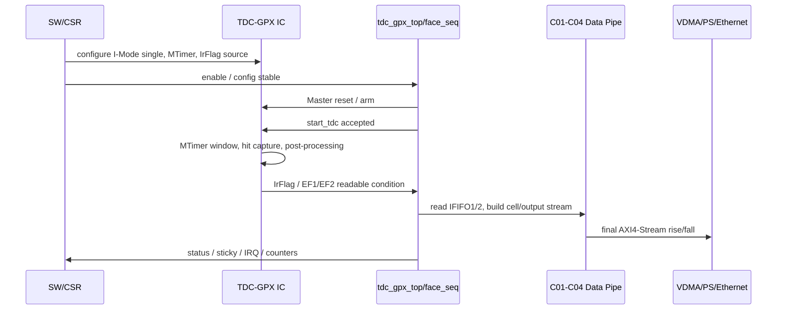
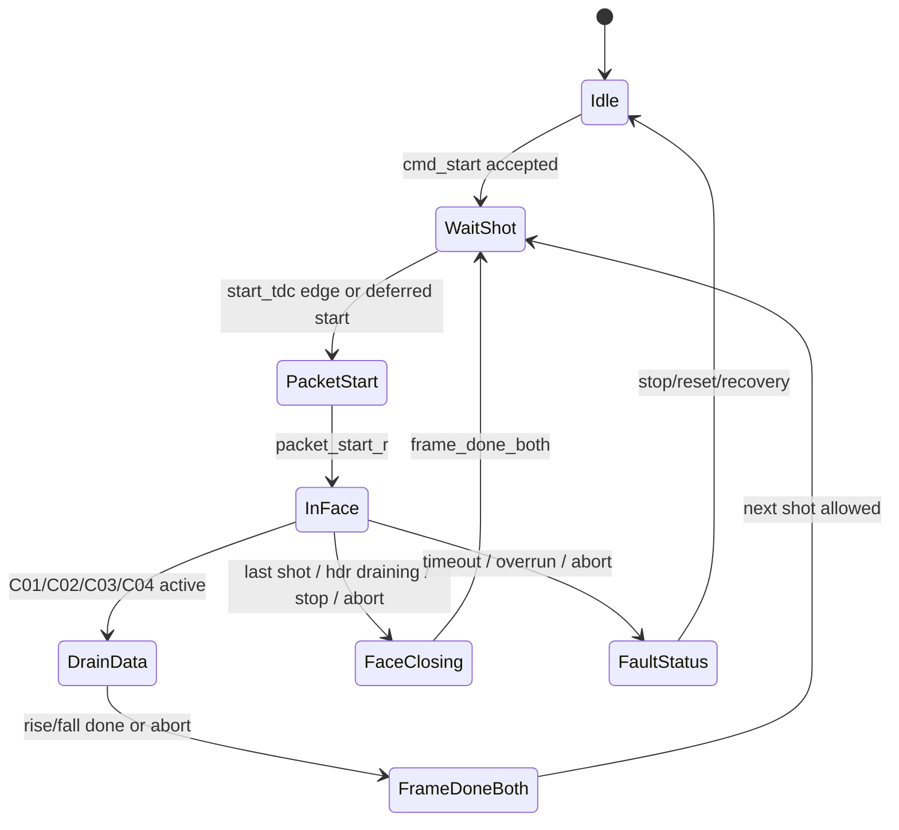
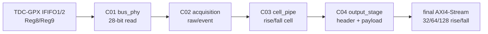
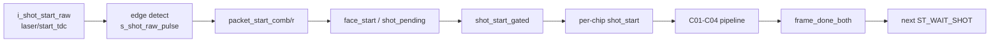
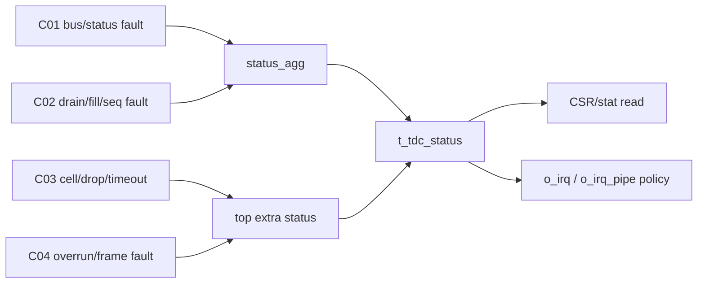
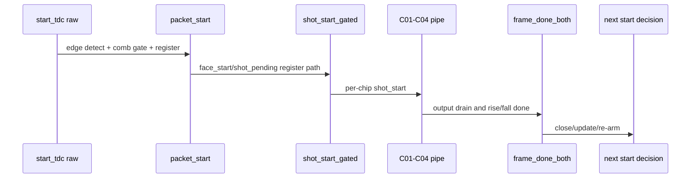

# C06 Control/Status Integration Analysis v001

- 작성 시간: `2026-05-11 16:13:10 +09:00`
- 최종 수정 시간: `2026-05-11 16:13:10 +09:00`
- 절대 기준 문서: `Doc/TDC-GPX-Datasheet.pdf`
- 선행 계획: `Doc/cluster_analysis/C06_Control_Status_Integration/C06_Control_Status_Integration_260501044033_Plan_v001.md`
- 선행 점검: `Doc/cluster_analysis/C06_Control_Status_Integration/C06_Control_Status_Integration_260511155627_Progress_Completeness_Check_v001.md`
- 선행 인계: `Doc/cluster_analysis/C04_Output_Stage/C04_Output_Stage_260501044033_C06_Handoff_v002.md`
- 분석 대상 RTL: `tdc_gpx_top.vhd`, `tdc_gpx_face_seq.vhd`, `tdc_gpx_status_agg.vhd`, `tdc_gpx_pkg.vhd`

---

## 1. C06 분석 목적

C06은 C01~C04에서 닫은 데이터 경로를 top-level 운용 개념으로 묶는 단계다. 이번 v001은 코드 수정 전 분석 문서이며, 다음 네 가지를 확정한다.

1. Datasheet 기준의 I-Mode single 운용 개념을 C06 제어 구조에 매핑한다.
2. `tdc_gpx_top`, `tdc_gpx_face_seq`, `tdc_gpx_status_agg`의 data/control/status 관계를 분리한다.
3. T0~T6 timing marker와 latency/throughput/pipeline/II 판단 기준을 만든다.
4. 다음 단계에서 실행할 C06 검증 matrix와 코드 리뷰 초점을 정리한다.

판정: C06 분석은 시작 가능하고, C06 검증은 아직 미완료다. 이 문서는 검증 전제와 관측 지점을 만드는 산출물이다.

---

## 2. Datasheet 기준 운용 개념

### 2.1 C06에서 직접 따라야 할 Datasheet 근거

| 근거 | Datasheet 위치 | C06 적용 |
|---|---|---|
| I-Mode는 8 stop channel이 1 start channel을 기준으로 동작한다. | `Doc/TDC-GPX-Datasheet.pdf` PDF page 25, section `2.3 I-Mode Basics` | 현재 프로젝트 범위는 I-Mode single이므로 `start_tdc` 하나를 face/shot 시작 기준으로 본다. |
| single start에서는 `StartTimer = 0`으로 internal start generation이 꺼진다. | PDF page 25, section `Single Start` | Continuous measurement는 범위 제외다. C06은 internal retrigger sequence를 지원 가정으로 넣지 않는다. |
| I-Mode output word는 `ChaCode[27:26]`, `Start#[25:18]`, `Slope[17]`, `Hit[16:0]` 구조다. | PDF page 27, section `2.4 Data structure` | C03 내부는 `Hit[16]` metadata를 보존하지만, 현재 generation의 최종 VDMA stream은 사용자 결정에 따라 `Hit[15:0]`만 유효 slot로 본다. |
| register 8/9는 IFIFO1/2 read data이며 I-Mode에서 bit 0..16이 `Hit = Stop-Start`다. | PDF page 20, section `1.7.2 Read registers` | C01/C02 read data의 원천 의미는 17-bit hit다. C06 status/SW 문서에서는 최종 16-bit 정책을 명시해야 한다. |
| Interface FIFO/data bus transfer는 40 MHz 가능 속도이며 FIFO empty read는 금지된다. | PDF page 27, section `Internal Data Processing`, `2.4 Data structure` 앞단 설명 | C01/C02가 EF/fill 기반 read를 닫았더라도, C06은 empty read fault가 status로 추적되는지 확인해야 한다. |
| EF/LF/IrFlag/ErrFlag/OEN pin 의미가 정의되어 있다. | PDF page 13, pin description | C06 status/IRQ 분석에서 GPX pin-level event와 user-visible status를 분리해야 한다. |
| register 12는 FIFO full, HFifo empty, TimerFlag, interrupt unmask bit를 포함한다. | PDF page 22, register 12 | C06은 Datasheet interrupt source와 RTL IRQ/status 의미가 같은지 검토해야 한다. |
| I-Mode single flow는 IrFlag를 기다린 뒤 EF1/EF2를 확인하고 IFIFO를 read한 뒤 Master reset을 수행한다. | PDF page 29, section `2.11.1 Single measurement` | C06의 top-level sequence는 `start_tdc -> wait/drain -> output -> reset/rearm` 관점으로 해석한다. |
| MTimer는 Start/Stop으로 시작 가능하고 TimerFlag unmask 시 IrFlag를 set한다. | PDF page 27, sections `2.6 MTimer`, `2.7 Interrupt Flag` | 사용자 운용에서 IrFlag는 MTimer 기반 측정 window 종료 신호로 해석한다. |

### 2.2 Datasheet 기반 정상 운용 sequence

C06 관점에서 중요한 점은 IrFlag 자체가 데이터가 모두 output stream으로 나갔다는 뜻은 아니라는 것이다. Datasheet의 single flow는 IrFlag 이후 EF를 확인하고 IFIFO를 read한다. RTL에서도 `start_tdc` 수락, GPX drain, C03/C04 output, status update는 서로 다른 stage다.

---

## 3. RTL 구조 매핑

### 3.1 Top-level 경계

| 항목 | RTL 근거 | 분석 |
|---|---|---|
| output width generic | `tdc_gpx_top.vhd:36`, `tdc_gpx_top.vhd:409-410` | 32/64/128만 허용한다. 256bit는 현재 범위 제외다. |
| rise/fall final AXIS | `tdc_gpx_top.vhd:147-162` | C04 결과가 두 lane으로 나가며, C06에서는 lane별 `tready` stall을 고려해야 한다. |
| IRQ output | `tdc_gpx_top.vhd:169-170`, `tdc_gpx_top.vhd:630`, `tdc_gpx_top.vhd:465` | `o_irq`와 `o_irq_pipe` 의미가 분리되어 있으므로 SW/IRQ 정책을 C06에서 명확히 해야 한다. |
| face sequence instance | `tdc_gpx_top.vhd:855-913` | `face_seq`가 top-level start/stop/soft_reset, output drain, config snapshot을 묶는다. |
| status aggregation instance | `tdc_gpx_top.vhd:919-950` | `status_agg`가 busy/error/sticky/counter의 기본 집계를 담당한다. |
| top extra status assignment | `tdc_gpx_top.vhd:962-1110` | 많은 status field가 top에서 추가로 assignment된다. C06 code review의 주요 대상이다. |

### 3.2 face_seq 상태 구조

`tdc_gpx_face_seq.vhd`의 실제 state는 세 개다.

| State | RTL 근거 | 의미 |
|---|---|---|
| `ST_IDLE` | `tdc_gpx_face_seq.vhd:112`, `tdc_gpx_face_seq.vhd:192-292` | command start를 기다리거나 pipeline idle 조건을 확인한다. |
| `ST_WAIT_SHOT` | `tdc_gpx_face_seq.vhd:252`, `tdc_gpx_face_seq.vhd:270-274` | raw shot/start event를 packet_start로 수락할 준비 상태다. |
| `ST_IN_FACE` | `tdc_gpx_face_seq.vhd:274-287` | frame/face가 진행 중이며 `frame_done_both` 후 다음 shot wait로 돌아간다. |

추상 운영 상태는 RTL state보다 더 세분화된다.

### 3.3 registered boundary 현황

| Signal / decision | RTL 근거 | 판단 |
|---|---|---|
| `packet_start` | `tdc_gpx_face_seq.vhd:166-174`, `tdc_gpx_face_seq.vhd:526-535`, `tdc_gpx_face_seq.vhd:476` | 조합 gate 후 register로 닫혀 있다. |
| `frame_done_both` | `tdc_gpx_face_seq.vhd:400-424`, `tdc_gpx_face_seq.vhd:483` | rise/fall 완료/abort를 register로 결합한다. |
| `face_closing` | `tdc_gpx_face_seq.vhd:431-469`, `tdc_gpx_face_seq.vhd:477` | 이전 finding의 조합 chain은 register stage로 개선된 상태다. |
| `shot_start_gated` | `tdc_gpx_face_seq.vhd:653-661`, `tdc_gpx_face_seq.vhd:674-693` | `shot_pending` register 기반이나 최종 출력은 concurrent qualify다. C06 code review에서 depth를 재확인한다. |
| status sticky/counter | `tdc_gpx_status_agg.vhd:110-156` | sequential로 잘 닫혀 있다. |
| `o_status.busy`/overrun | `tdc_gpx_status_agg.vhd:161-179` | concurrent assignment다. 새 규칙상 fan-out/depth를 리뷰해야 한다. |

---

## 4. Data Flow / Control Flow / Status Flow

### 4.1 Data Flow

이 data flow는 C01~C04에서 대부분 닫혔다. C06은 payload packing을 다시 설계하지 않고, 이 flow가 언제 시작/종료되며 backpressure가 생겼을 때 어떤 status가 남는지를 확인한다.

### 4.2 Control Flow

정적 RTL 판독 기준으로 `packet_start_comb`는 `s_packet_start_r`로 register되고, `s_face_start_r`/`s_shot_pending_r`를 거쳐 `s_shot_start_gated`가 나온다. 따라서 `start_tdc`에서 실제 lower cluster enable까지는 최소 수 clock의 control latency가 존재한다. 정확한 cycle 수는 VB-C06-01 xsim marker로 확정해야 한다.

### 4.3 Status Flow

`tdc_gpx_status_agg`는 기본 busy/error/sticky를 만들고, `tdc_gpx_top`은 많은 후속 field를 추가로 채운다. 이 구조는 관측성은 좋지만 status source가 두 곳으로 나뉘므로 C06에서는 bit별 source/clear 정책을 표로 닫아야 한다.

---

## 5. Timing / Latency / Throughput / Pipeline / II

### 5.1 T0~T6 marker 정의

| Marker | RTL 관측 후보 | 의미 | 현재 상태 |
|---|---|---|---|
| T0 | `i_shot_start_raw` rising edge | laser/start_tdc 입력 | C06 xsim marker 필요 |
| T1 | `o_packet_start` / `s_packet_start_r` | face가 start를 packet으로 수락 | register 구조 확인됨 |
| T2 | `o_shot_start_gated` / `o_shot_start_per_chip` | C01/C02 lower cluster enable | register + qualify 구조 확인됨 |
| T3 | C04 final AXIS first `tvalid&tready` | VDMA로 첫 beat 전달 | C04 단위 검증됨, top marker 필요 |
| T4 | C04 final AXIS `tlast&tready` | lane output 완료 | C04 단위 검증됨, top marker 필요 |
| T5 | `o_frame_done_both` | rise/fall frame 종료 | register 구조 확인됨 |
| T6 | 다음 `packet_start` 허용 또는 drop/defer 결정 | II/next shot policy | C06 핵심 검증 필요 |

### 5.2 정적 RTL 기반 latency 해석

정적 판독:

- `s_packet_start_comb`는 `s_packet_start_r`로 1 clock register된다.
- `s_face_start_r`와 `s_shot_pending_r`는 `s_packet_start_r`를 본 뒤 register된다.
- `s_shot_start_gated`는 `s_shot_pending_r` 기반이므로 `packet_start_r` 이후 최소 1 clock이 더 필요하다.
- 따라서 T0->T2는 zero-cycle이 아니며, C06 검증 로그에서 정확한 cycle 수를 산출해야 한다.

### 5.3 Throughput / II 판단

| 항목 | 현재 판단 |
|---|---|
| Data beat II | C04 기준 output ready high이면 beat 단위 II=1로 해석 가능 |
| Shot II | C04 drain, `frame_done_both`, `face_closing`, deferred/drop 정책까지 포함해야 함 |
| System throughput | C04 polygon result + C06 ready stall + 8us reserve 결합으로 판단해야 함 |
| Current blocker | VB-C06-02/04/10이 닫히기 전에는 end-to-end II를 확정할 수 없음 |

### 5.4 C04 polygon budget의 C06 적용

C04 인계 기준:

| Width | cfg=7 유지 가능 거리 | FAIL 시작 |
|---:|---:|---:|
| 32 | 710m까지 | 810m |
| 64 | 780m까지 | 820m |
| 128 | 810m까지 | 820m |

이 값은 `i_m_axis_tready`/`i_m_axis_fall_tready`가 충분히 유지된다는 조건의 결과다. C06에서는 실제 system/VDMA stall이 발생하면 이 margin이 줄어드는지 확인해야 한다.

---

## 6. Next Start / Defer / Drop 정책 분석

`tdc_gpx_face_seq.vhd`에는 next shot 처리 정책이 이미 일부 들어 있다.

| 항목 | RTL 근거 | 해석 |
|---|---|---|
| raw start edge detect | `tdc_gpx_face_seq.vhd:537-552` | raw level이 길어도 내부는 edge pulse 중심으로 처리한다. |
| deferred latch | `tdc_gpx_face_seq.vhd:142-143`, `tdc_gpx_face_seq.vhd:616-627` | 수락할 수 없는 raw start 1개를 deferred로 보존할 수 있다. |
| additional drop count | `tdc_gpx_face_seq.vhd:629-640` | deferred가 이미 있거나 pending이 막히면 drop count로 간다. |
| gated shot start | `tdc_gpx_face_seq.vhd:674-693` | face closing/stop/reset/abort 조건에서 shot_start를 막는다. |

분석 판단:

- 이 구조는 “무제한 queue”가 아니라 “1-deep defer + 추가 start drop” 정책으로 읽힌다.
- C04 drain 중 next `start_tdc`가 들어오면, 한 번은 defer될 수 있으나 그 다음 start는 drop count로 이어질 수 있다.
- 이 정책이 사용자 운용의 13.888889us point interval과 맞는지는 VB-C06-02/10에서 반드시 재현해야 한다.

---

## 7. Preliminary Findings

| ID | 등급 | 내용 | 근거 | 다음 조치 |
|---|---|---|---|---|
| F-C06-A01 | P1 | C06 end-to-end II가 아직 검증되지 않았다. | C06 Plan VB-C06-01..10 open, `tdc_gpx_face_seq.vhd:616-640` | next start drain 중 defer/drop TB 작성 |
| F-C06-A02 | P1 | C04 timing PASS는 output ready high 조건부다. | C04 handoff H-C04C06-07, `tdc_gpx_top.vhd:147-162` | `tready` stall 포함 polygon budget 재검증 |
| F-C06-A03 | P2 | `o_irq`와 `o_irq_pipe`의 SW 의미가 아직 분리 문서화되지 않았다. | `tdc_gpx_top.vhd:169-170`, `tdc_gpx_top.vhd:465`, `tdc_gpx_top.vhd:630` | IRQ pulse/level/sticky 정책 표 작성 |
| F-C06-A04 | P2 | status source가 `status_agg`와 top extra assignment로 나뉘어 있어 bit별 clear/source 추적표가 필요하다. | `tdc_gpx_status_agg.vhd:161-184`, `tdc_gpx_top.vhd:962-1110` | status map v001 작성 |
| F-C06-A05 | P2 | `status_agg` 일부 output은 concurrent assignment라 새 조합 depth 규칙 관점의 review가 필요하다. | `tdc_gpx_status_agg.vhd:161-179` | Code_Review v001에서 register 필요 여부 판단 |
| F-C06-A06 | P2 | Datasheet register 12 full flag clear-on-read 의미와 RTL soft_clear/sticky 의미가 같지 않다. | Datasheet PDF page 22, `tdc_gpx_status_agg.vhd:117-153` | SW-visible status semantics 분리 |

---

## 8. C06 검증 Matrix v001

| ID | 목적 | 관측 marker | PASS 기준 |
|---|---|---|---|
| VB-C06-01 | I-Mode single 정상 sequence | T0..T6 marker | `start_tdc` 1회가 output tlast와 `frame_done_both`까지 도달 |
| VB-C06-02 | C04 drain 중 next start | `s_shot_deferred_r`, `s_shot_drop_cnt_r`, `o_packet_start` | 1-deep defer/drop 정책이 문서와 일치 |
| VB-C06-03 | rise/fall lane 완료 불균형 | `i_frame_done`, `i_frame_fall_done`, `o_frame_done_both` | 둘 다 완료/abort 전 `frame_done_both`가 뜨지 않음 |
| VB-C06-04 | output `tready` stall | final AXIS ready/valid/tlast, overrun status | stall 시 frame이 깨지지 않거나 overrun/status가 남음 |
| VB-C06-05 | sticky clear | `i_soft_clear`, status sticky fields | SW clear 후 sticky/counter가 의도대로 초기화 |
| VB-C06-06 | `max_hits_cfg` snapshot | `s_cfg_face_r.max_hits_cfg`, output beat count | face 중간 변경은 다음 face부터 반영 |
| VB-C06-07 | 32/64/128 width sweep | final beat count | 기존 C02/C04 결과와 top-level이 일치 |
| VB-C06-08 | reset/soft_reset/force_reinit | state/status/fault clear | recovery sequence가 deadlock 없이 Idle 복귀 |
| VB-C06-09 | IRQ policy | `o_irq`, `o_irq_pipe`, CSR status | pulse/level 의미가 문서와 일치 |
| VB-C06-10 | polygon budget + backpressure | T0 interval, ready stall, final margin | 8us reserve 조건에서 PASS/FAIL 경계 재산출 |

AXI4-Lite CSR를 쓰고 읽는 TB는 반드시 `px_utility_pkg.vhd`의 `px_axi_lite_writer`/`px_axi_lite_reader`를 사용한다.

---

## 9. Fix Plan v001 실행 결과 반영

이 문서는 C06 초기 분석 기준 문서이므로 원래 판단은 보존한다. 다만 이후 `C06_Control_Status_Integration_260511192515_Code_Fix_Plan_v001.md` 실행 결과 다음 항목의 상태가 바뀌었고, 남은 항목은 `C06_Control_Status_Integration_260511200655_Code_Fix_Plan_v002.md`로 승계한다.

| 초기 분석 항목 | Fix Plan v001 / Result v001 반영 | 현재 상태 | 다음 추적 |
|---|---|---|---|
| F-C06-A01 end-to-end II 미검증 | face_seq start boundary는 register화됨 | Partial | FP2-C06-03, FP2-C06-04 |
| F-C06-A02 output ready high 의존 | v001에서 직접 수정 없음 | Open | FP2-C06-04 |
| F-C06-A03 `o_irq`/`o_irq_pipe` SW 계약 | `o_irq_pipe`는 reserved/tied-off로 수락 | Partial / Accepted Exception | FP2-C06-06 |
| F-C06-A04 status source 분산 | 일부 sticky clear와 status boundary 반영 | Partial | FP2-C06-07 |
| F-C06-A05 status_agg 조합 depth | `busy/overrun` register boundary 반영 및 xsim PASS | Verified | 없음 |
| F-C06-A06 Datasheet status와 RTL soft_clear 의미 차이 | soft_clear 대상 일부 보완, reset-only 예외 유지 | Partial | FP2-C06-07, FP2-C06-08 |

근거 문서:

- `C06_Control_Status_Integration_260511195318_Code_Fix_Result_v001.md`
- `C06_Control_Status_Integration_260511200655_Code_Fix_Plan_v002.md`

## 10. 다음 단계

다음 산출물은 `C06_Control_Status_Integration_<timestamp>_Code_Review_v001.md`가 맞다.

Code Review v001에서 처리할 우선순위:

1. `tdc_gpx_face_seq.vhd`의 defer/drop/shot gating 정책이 timing/II 요구와 맞는지 리뷰한다.
2. `tdc_gpx_status_agg.vhd` concurrent status assignment가 조합 depth 규칙을 만족하는지 판단한다.
3. `tdc_gpx_top.vhd`의 top extra status assignment를 bit별 source/clear/clock domain 표로 정리한다.
4. `o_irq`/`o_irq_pipe` 정책을 SW 관점으로 분리한다.
5. VB-C06-01..10 중 먼저 구현할 TB 우선순위를 정한다.
