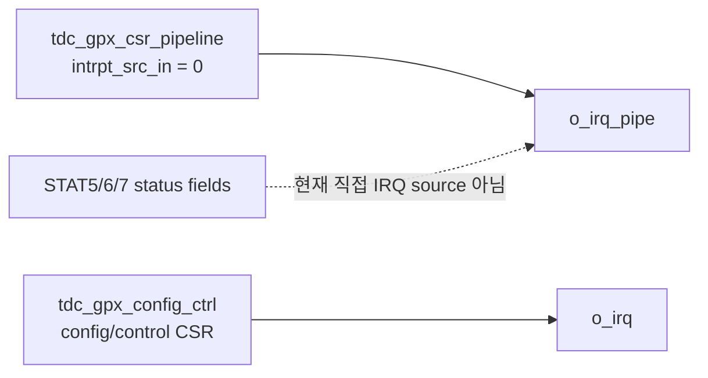
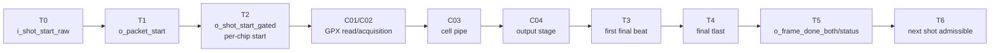

# C06 Control/Status Integration Code Review v001

- 생성 시간: 2026-05-11 16:30:00 KST
- 수정 시간: 2026-05-11 16:36:20 KST
- 작성자: Codex
- 기준 문서:
  - `Doc/TDC-GPX-Datasheet.pdf`
  - `Doc/cluster_analysis/C06_Control_Status_Integration/C06_Control_Status_Integration_260501044033_Plan_v001.md`
  - `Doc/cluster_analysis/C06_Control_Status_Integration/C06_Control_Status_Integration_260511155627_Progress_Completeness_Check_v001.md`
  - `Doc/cluster_analysis/C06_Control_Status_Integration/C06_Control_Status_Integration_260511161310_Analysis_v001.md`
- 분석 대상 RTL:
  - `tdc_gpx_top.vhd`
  - `tdc_gpx_face_seq.vhd`
  - `tdc_gpx_status_agg.vhd`
  - `tdc_gpx_csr_pipeline.vhd`
  - `tdc_gpx_config_ctrl.vhd`

## 1. 리뷰 결론

판정: C06은 코드 구조가 이미 상당 부분 분리되어 있으나, 아직 다음 단계로 넘어가면 안 된다.

이유는 세 가지다.

1. `start_tdc` 수락부터 final AXI4-Stream `tlast`, status/IRQ 반영, 다음 shot 수락까지의 end-to-end II가 아직 xsim 근거로 닫히지 않았다.
2. status/IRQ 경로에는 SW가 해석해야 하는 의미가 두 갈래로 존재한다. `o_irq`와 `o_irq_pipe`가 서로 다른 CSR 블록에서 나오며, `o_irq_pipe`는 현재 interrupt source가 `"0"`으로 묶여 있어 실제 운용 의미가 불명확하다.
3. 새 코딩 규칙 관점에서 일부 top-level 출력 경계가 여전히 조합 경로다. 특히 `o_shot_start_gated`, `o_face_start_gated`, `status_agg.o_status.busy`는 기능적으로는 이해 가능하지만 timing closure 관점에서는 등록 경계 또는 명시적 예외가 필요하다.

긍정적인 부분도 있다. `packet_start`, `frame_done_both`, `face_closing`은 이미 register 기반으로 닫혀 있다. 즉 C06의 핵심 제어 구조는 무너진 상태가 아니라, 마지막 운용 계약과 검증 공백을 닫아야 하는 상태다.

## 2. Datasheet 기준 해석

| Datasheet 근거 | 위치 | C06 판단 |
| --- | --- | --- |
| I-Mode는 1개 Start와 8개 Stop channel 간 hit를 측정한다. | PDF page 25, section `2.3 I-Mode Basics` | C06은 I-Mode single 운용만 대상으로 한다. Quiet/M-mode/continuous는 제외다. |
| Single start에서는 `StartTimer = 0`으로 internal start generation을 끈다. | PDF page 25, `Single Start` 설명 | C06의 next-shot 정책은 external `start_tdc` 수락/보류/드롭 기준으로 닫아야 한다. |
| IFIFO read data는 `ChaCode[27:26]`, `Start#[25:18]`, `Slope[17]`, `Hit[16:0]` 구조다. | PDF page 27, section `2.4 Data structure` | C01~C04에서 닫은 data payload 의미는 C06에서 바꾸지 않는다. C06은 sequence/status 계약을 닫는다. |
| FIFO empty read는 금지 조건이다. | PDF page 27, internal data processing 설명 | C06은 empty read fault 또는 fallback 결과가 SW status로 추적되는지 확인해야 한다. |
| Register 12에는 FIFO full, HFifo empty, TimerFlag, interrupt unmask bit가 포함된다. | PDF page 22, register 12 | Datasheet interrupt/status와 RTL sticky/status는 같은 개념이 아니다. C06에서 SW-visible status map으로 분리해야 한다. |
| I-Mode single sequence는 IrFlag 대기, EF1/EF2 확인, IFIFO read, Master reset 순서다. | PDF page 29, section `2.11.1 Single measurement` | `IrFlag` 발생은 output stream 완료가 아니다. C06 timing은 GPX drain 이후 C03/C04 output까지 포함해야 한다. |

## 3. 코드 리뷰 Findings

### F-C06-CR-01 [P1] End-to-end II와 backpressure 조건이 아직 닫히지 않았다

근거:

- `tdc_gpx_top.vhd:153`, `tdc_gpx_top.vhd:162`: final rise/fall AXI4-Stream에 각각 `i_m_axis_tready`, `i_m_axis_fall_tready`가 존재한다.
- `tdc_gpx_top.vhd:785`, `tdc_gpx_top.vhd:793`: final output stage로 `tready`가 직접 연결된다.
- `Doc/cluster_analysis/C06_Control_Status_Integration/C06_Control_Status_Integration_260501044033_Plan_v001.md:177-186`: VB-C06-01..10 검증 matrix가 아직 C06에서 수행 대상이다.
- `Doc/cluster_analysis/C06_Control_Status_Integration/C06_Control_Status_Integration_260511155627_Progress_Completeness_Check_v001.md:105`: C04 timing PASS는 output ready 유지 조건부 PASS로 기록되어 있다.

판단:

C04까지는 output serialization 자체가 닫혔지만, C06은 system-level ready stall을 포함해야 한다. polygon budget 계산에서 8 us reserve를 이미 가정했기 때문에, final AXIS가 stall될 경우 T0 다음 shot 간격 13.888889 us 안에서 실제 완료 가능한지 다시 산출해야 한다.

영향:

- `tready`가 충분히 유지되면 기존 C04 결과를 그대로 사용할 수 있다.
- `tready` stall이 있으면 T3/T4/T5/T6가 뒤로 밀리고, next `start_tdc`는 defer/drop/overrun 정책을 타게 된다.
- 이 항목이 닫히지 않으면 C06 완료 판정과 다음 Cluster 진입 판정이 불가능하다.

필요 조치:

1. VB-C06-01 정상 sequence, VB-C06-04 output `tready` stall, VB-C06-10 polygon budget + backpressure를 우선 검증한다.
2. T0~T6 marker를 xsim log에 남긴다.
3. PASS/FAIL 표에는 32/64/128 bit width, `max_hits_cfg`, 거리, ready stall pattern을 함께 기록한다.

### F-C06-CR-02 [P2] `face_seq`의 shot/face start 출력 경계가 조합으로 남아 있다

근거:

- `tdc_gpx_face_seq.vhd:515-524`: `s_packet_start_comb`는 여러 조건을 결합한 조합 gate다.
- `tdc_gpx_face_seq.vhd:526-535`: `s_packet_start_r`는 register로 닫혀 있으므로 packet start 자체는 안정화되어 있다.
- `tdc_gpx_face_seq.vhd:674-680`: `s_shot_start_gated`는 `s_shot_pending_r`, `s_face_closing_r`, stop/reset/abort/quiesce 조건으로 조합 생성된다.
- `tdc_gpx_face_seq.vhd:684`: `o_shot_start_per_chip(i)`가 `s_shot_start_gated and s_face_active_mask_r(i)`로 바로 출력된다.
- `tdc_gpx_face_seq.vhd:690-693`: `o_face_start_gated`, `o_shot_start_gated`가 조합 조건을 거쳐 top-level 경계로 나간다.

판단:

현재 구조는 기능적으로 의도된 gating이다. 다만 프로젝트 코딩 규칙의 “모듈 경계는 FF/register로 처리” 및 “조합논리는 최대 2-depth” 기준으로 보면 출력 경계가 완전히 닫힌 형태는 아니다.

중요한 구분은 다음과 같다.

- `packet_start`는 이미 register 후 출력되므로 우수하다.
- `frame_done_both`와 `face_closing`도 register 기반이다.
- 그러나 `shot_start_gated`, `face_start_gated`, per-chip shot start는 최종 qualifier가 조합이다.

영향:

- register를 추가하면 lower cluster start가 1 clock 뒤로 이동한다.
- 이 1 clock은 기능적으로 큰 문제는 아닐 가능성이 높지만, 기존 TB의 T0/T1/T2 marker와 II 산출은 갱신되어야 한다.
- register를 추가하지 않는다면 “timing 예외로 인정하는 이유”와 fan-out/timing 결과가 문서화되어야 한다.

권장:

원칙적으로 `s_shot_start_gated_r`, `s_face_start_gated_r`, `s_shot_start_per_chip_r`를 두는 방향이 맞다. 단, 수정 전 VB-C06-01/02의 현재 timing marker를 먼저 찍어 baseline을 확보해야 한다.

### F-C06-CR-03 [P2] `status_agg.o_status.busy`가 넓은 조합 OR로 CSR status에 전달된다

근거:

- `tdc_gpx_status_agg.vhd:161-174`: `o_status.busy`가 face state, chip busy, assembler/header/output valid, register outstanding을 모두 조합 OR로 결합한다.
- `tdc_gpx_status_agg.vhd:177-179`: pipeline/rise/fall overrun도 조합 출력이다.
- `tdc_gpx_csr_pipeline.vhd:352-354`: CSR status bit `STAT5`가 `i_status.busy`, `i_status.pipeline_overrun`, `i_status.err_fatal`을 직접 packing한다.

판단:

`busy`는 SW가 자주 읽는 대표 상태이고, 동시에 여러 하위 module 상태를 fan-in 한다. 조합 OR 자체는 단순하지만 입력 개수가 많고, CSR packing 경로까지 포함하면 새 규칙 관점에서 register boundary가 더 안전하다.

영향:

- `busy` register화 시 SW status 반영이 1 clock 늦어진다.
- 150 MHz AXI/control clock 기준 1 clock은 6.666 ns이며, SW status polling 관점에서는 허용 가능하다.
- 대신 timing closure와 CDC/status fan-out 추적성이 좋아진다.

권장:

`tdc_gpx_status_agg` 내부에 `s_busy_r`, `s_pipeline_overrun_r`, `s_rise_overrun_r`, `s_fall_overrun_r`를 두고 `o_status`는 register 출력으로 닫는다. 이후 VB-C06-05 sticky/status clear와 함께 status latency 1 clock을 명시한다.

### F-C06-CR-04 [P2] 일부 top-level sticky가 `s_err_soft_clear`로 clear되지 않는다

근거:

- `tdc_gpx_status_agg.vhd:117-153`: error counter와 drain/sequence sticky는 `i_soft_clear`로 clear된다.
- `tdc_gpx_top.vhd:1068-1078`: `frame_done_faulted_sticky`는 reset에서만 clear되고 `s_err_soft_clear`를 보지 않는다.
- `tdc_gpx_top.vhd:1081-1091`: `row_done_faulted_sticky`도 reset에서만 clear된다.
- `tdc_gpx_top.vhd:1094-1106`: `stop_id_error_mask`는 reset 또는 `s_err_soft_clear`로 clear된다.
- `tdc_gpx_top.vhd:1115-1124`: `run_timeout_sticky`도 reset에서만 clear된다.

판단:

현재 sticky clear 정책이 field별로 다르다. 일부는 soft_clear로 지워지고, 일부는 reset-only다. 이것이 의도라면 status map에 field별 clear source를 명확히 써야 한다. 의도가 아니라면 SW가 fault를 확인하고 clear한 뒤 새 run을 시작하는 운용이 불완전하다.

영향:

- SW가 `err_soft_clear`를 수행해도 `frame_done_faulted_sticky`, `row_done_faulted_sticky`, `run_timeout_mask`가 남을 수 있다.
- fault history와 현재 run fault가 구분되지 않아, C06 완료 후 field service/debug에서 오판 가능성이 있다.

권장:

기본 정책은 “운용 fault sticky는 soft_clear로 clear 가능”으로 통일하는 것이 좋다. 단, `quarantine_escape_mask`처럼 source module 내부 sticky가 reset-only로 설계된 항목은 예외로 유지하고 문서에 별도 표기한다.

### F-C06-CR-05 [P2] `o_irq`와 `o_irq_pipe`의 SW 계약이 분리되어 있지 않다

근거:

- `tdc_gpx_top.vhd:169-170`: top-level에는 `o_irq`, `o_irq_pipe` 두 interrupt output이 존재한다.
- `tdc_gpx_top.vhd:424-465`: `u_csr_pipeline.o_irq => o_irq_pipe`로 연결된다.
- `tdc_gpx_csr_pipeline.vhd:345-346`: `intrpt_src_in => "0"`, `irq => o_irq`로 CSR pipeline IRQ source가 상수 0이다.
- `tdc_gpx_top.vhd:471-630`: `u_config_ctrl.o_irq => o_irq`로 별도 IRQ가 출력된다.
- `tdc_gpx_config_ctrl.vhd:1032`: config/control CSR path가 `o_irq`를 생성한다.

판단:

현재 이름만 보면 `o_irq_pipe`가 data pipeline event를 의미할 것 같지만, 실제 source는 `"0"`이다. 반대로 `o_irq`는 config/control CSR 쪽에서 나온다. 따라서 외부 시스템 또는 PS에서 두 포트를 어떻게 써야 하는지 계약이 불명확하다.

영향:

- `o_irq_pipe`를 연결한 board/system에서는 interrupt가 발생하지 않는 것이 정상일 수 있다.
- 반대로 SW가 `o_irq_pipe`를 pipeline done/fault IRQ로 기대하면 기능 FAIL이다.
- Datasheet Register 12 interrupt 의미와 RTL IRQ 의미가 섞여 해석될 위험이 있다.

권장:

1. C06 status map에 `o_irq`, `o_irq_pipe`의 source, pulse/level, clear 조건을 별도 표로 작성한다.
2. `o_irq_pipe`가 당장 쓰이지 않는다면 명시적으로 “reserved/tied-off” 계약으로 바꾼다.
3. pipeline done/fault IRQ가 필요하면 `STAT5/6/7` sticky source를 OR한 registered IRQ를 새로 설계한다.

### F-C06-CR-06 [P3] status source와 clear source가 `status_agg`와 top extra assignment로 분산되어 있다

근거:

- `tdc_gpx_status_agg.vhd:110-153`: error count, drain/sequence sticky는 `status_agg` 내부 process에서 관리된다.
- `tdc_gpx_top.vhd:962-1063`: 다수의 status field가 top에서 직접 assignment된다.
- `tdc_gpx_top.vhd:1009-1021`: `quarantine_escape_mask`는 top 내부 sticky latch다.
- `tdc_gpx_top.vhd:1068-1124`: frame/row/run timeout/stop ID sticky도 top 내부에서 각각 관리된다.
- `tdc_gpx_csr_pipeline.vhd:352-430`: CSR `STAT5/6/7` packing은 별도 module에서 이루어진다.

판단:

기능 자체가 틀렸다는 의미는 아니다. 다만 status field가 많아진 현재 상태에서는 source/clear/clock domain을 한눈에 추적하기 어렵다. C06은 control/status integration 단계이므로 이 추적성을 닫아야 한다.

권장:

`C06_Status_Map_v001` 또는 Code Fix Plan에 다음 열을 갖는 표를 추가한다.

| Field | CSR bit | Source RTL | Clock domain | Sticky 여부 | Clear source | Datasheet 대응 | 검증 항목 |
| --- | --- | --- | --- | --- | --- | --- | --- |

### F-C06-CR-07 [P3] fall-only abort와 rise-primary gating 정책은 문서화와 검증이 필요하다

근거:

- `tdc_gpx_face_seq.vhd:148-156`: rise/fall abort와 legacy alias가 분리되어 있다.
- `tdc_gpx_face_seq.vhd:569-576`: `s_pipeline_abort`는 `s_pipeline_abort_rise` alias다.
- `tdc_gpx_face_seq.vhd:674-680`: shot gating은 `s_pipeline_abort_rise`를 사용한다.
- `tdc_gpx_face_seq.vhd:668-673`: 주석은 fall-only abort가 rise VDMA stream을 죽이지 않는다고 설명한다.

판단:

현재 코드와 주석은 서로 맞다. fall-only abort가 rise-side data path를 막지 않는 것은 설계 의도로 보인다. 따라서 즉시 결함으로 보지는 않는다.

다만 C06 관점에서는 rise/fall lane 완료 불균형이 전체 frame completion과 next shot 수락에 어떤 영향을 주는지 검증되어야 한다.

필요 조치:

VB-C06-03에서 rise 완료, fall 지연, fall abort, rise 정상 완료 조합을 넣고 `o_frame_done_both`, `o_face_closing`, `o_shot_start_gated`, `o_frame_done_faulted_*`를 관측한다.

## 4. Status/IRQ 계약 초안

### 4.1 현재 status source 분해

| 범주 | 대표 field | RTL 위치 | Clear 의미 | 리뷰 판단 |
| --- | --- | --- | --- | --- |
| busy/overrun | `busy`, `pipeline_overrun`, `rise_overrun`, `fall_overrun` | `tdc_gpx_status_agg.vhd:161-179` | 현재 조합 상태 | register 출력 권장 |
| error counter | `error_cycle_count` | `tdc_gpx_status_agg.vhd:110-135` | reset, soft_clear | 양호 |
| drain/sequence sticky | `drain_timeout_mask`, `sequence_error_mask` | `tdc_gpx_status_agg.vhd:140-153`, top mapping `tdc_gpx_top.vhd:965-966` | reset, soft_clear | 양호 |
| top sticky | `frame_done_faulted_sticky`, `row_done_faulted_sticky`, `run_timeout_mask` | `tdc_gpx_top.vhd:1068-1124` | 현재 reset-only | soft_clear 정책 결정 필요 |
| reset-only 예외 후보 | `quarantine_escape_mask` | `tdc_gpx_top.vhd:1009-1021` | reset-only | 내부 source가 reset-only라 예외 가능 |
| IRQ | `o_irq`, `o_irq_pipe` | `tdc_gpx_top.vhd:465`, `tdc_gpx_top.vhd:630` | source 분리 | 계약 미완료 |

### 4.2 IRQ 현재 구조



판단:

`o_irq_pipe`는 이름과 달리 pipeline status event를 반영하지 않는다. 따라서 C06에서는 두 가지 중 하나를 선택해야 한다.

1. `o_irq_pipe`를 reserved/tied-off로 문서화한다.
2. pipeline fault/done sticky를 register OR로 묶어 `o_irq_pipe`를 의미 있는 IRQ로 만든다.

## 5. Timing / Latency / Throughput / Pipeline / II 영향

### 5.1 현재 pipeline 관측점



### 5.2 Finding별 timing 영향

| 항목 | Latency 영향 | Throughput 영향 | Pipeline 영향 | II 영향 |
| --- | --- | --- | --- | --- |
| F-C06-CR-01 backpressure 미검증 | ready stall만큼 T3~T6 증가 | stall이 있으면 기존 C04 PASS 거리 margin 감소 | C04 이후 drain stage가 길어짐 | II가 T6까지 늘어날 수 있음 |
| F-C06-CR-02 start 출력 register화 | T2가 +1 clock 가능 | 정상 조건에서는 미미 | start boundary가 FF로 닫힘 | 최소 II가 +1 clock 가능, 대신 timing 안정화 |
| F-C06-CR-03 status register화 | status visible +1 clock | data throughput 영향 없음 | CSR status fan-in 경계 안정화 | II 직접 영향 없음 |
| F-C06-CR-04 soft_clear 통일 | clear 후 관측 latency 1 clock 가능 | data throughput 영향 없음 | status recovery 절차 명확화 | recovery 후 next run 판단 안정화 |
| F-C06-CR-05 IRQ 계약 정리 | IRQ pulse/level 설계에 따라 달라짐 | data throughput 영향 없음 | SW interrupt 경로 명확화 | SW-driven rearm 정책이면 간접 영향 |

### 5.3 13.888889 us 운용 budget과의 관계

사용자 운용 조건:

- 5각 polygon mirror
- 10 Hz 회전
- 1면 72도, 유효 60도
- laser point 간격 0.05도
- start-to-start 최대 간격: 13.888889 us
- VDMA + PS + Ethernet reserve: 8 us
- 실제 signal processing budget: 5.888889 us - target 왕복 시간

C06에서 반드시 추가해야 할 점은 `tready` stall이다. C04까지의 width sweep은 ready가 충분하다는 조건을 전제로 PASS 경계를 얻었다. C06에서는 다음 식으로 다시 판단해야 한다.

```text
C06 usable processing time
= 13.888889 us - 8.000000 us - round_trip_time(distance)

PASS 조건
= T0->T6 measured latency + ready-stall penalty <= usable processing time
```

## 6. 검증 우선순위

| 우선순위 | 항목 | 목적 | PASS 기준 |
| --- | --- | --- | --- |
| 1 | VB-C06-01 normal sequence | C06 baseline timing 확보 | T0->T6 marker가 순서대로 발생 |
| 2 | VB-C06-04 `tready` stall | F-C06-CR-01 판단 근거 확보 | stall 시 data 보존 또는 status fault 발생 |
| 3 | VB-C06-10 polygon budget + backpressure | 실운용 거리/width PASS 경계 재산출 | 32/64/128 width별 PASS/FAIL 표 생성 |
| 4 | VB-C06-05 sticky clear | F-C06-CR-04 soft_clear 정책 결정 | field별 clear 결과가 status map과 일치 |
| 5 | VB-C06-09 IRQ policy | F-C06-CR-05 계약 결정 | `o_irq`, `o_irq_pipe` source/clear가 문서와 일치 |
| 6 | VB-C06-03 rise/fall imbalance | F-C06-CR-07 확인 | fall-only abort가 의도대로 frame completion에 반영 |

## 7. 코드 수정 권고 순서

### Phase 1: 측정 기준 추가

먼저 TB 또는 기존 xsim 환경에 T0~T6 marker log를 넣는다. 아직 code behavior를 바꾸지 않고 baseline을 잡는 단계다.

### Phase 2: status/IRQ 계약 문서화

`STAT5/6/7`, `o_irq`, `o_irq_pipe`, sticky clear source를 표로 닫는다. 이때 `o_irq_pipe`를 reserved로 둘지, pipeline event IRQ로 만들지 결정한다.

### Phase 3: 낮은 위험 수정

`status_agg.busy/overrun` register화를 먼저 적용한다. data path 영향이 없고, status latency +1 clock만 반영하면 된다.

### Phase 4: start gating register화 검토

`face_seq`의 `shot_start_gated`/`face_start_gated` register화를 적용할지 결정한다. 적용 시 baseline 대비 T2 +1 clock과 II 변화가 TB에서 재검증되어야 한다.

### Phase 5: sticky clear 정책 통일

운용 fault sticky를 `s_err_soft_clear`로 clear할지 결정한다. 기본 권고는 soft_clear 가능이다. reset-only로 남길 field는 문서에서 예외로 관리한다.

## 8. 다음 단계 판단

다음 작업은 코드 수정 전 `C06_Code_Fix_Plan_v001` 또는 바로 `C06_Verify_Baseline_v001`로 진행할 수 있다.

내 판단은 다음 순서가 더 안전하다.

1. `C06_Verify_Baseline_v001`: 현재 코드 기준 T0~T6, ready-stall, sticky/IRQ 관측을 먼저 찍는다.
2. `C06_Code_Fix_Plan_v001`: baseline 결과를 바탕으로 register화/soft_clear/IRQ 수정을 구체화한다.
3. 코드 수정.
4. `C06_Verify_v001`: 수정 후 xsim PASS/FAIL 재검증.

이 순서를 권하는 이유는 `face_seq` start gating register화가 1 clock latency 변화를 만들 수 있기 때문이다. baseline 없이 바로 고치면 기존 C04 timing 결과와 C06 변화량을 분리해서 설명하기 어렵다.

## 9. Fix Plan v001 실행 결과 반영

이 코드 리뷰 문서의 finding은 원본 판단을 보존한다. 다만 Fix Plan v001 실행으로 일부 finding은 닫혔고, 일부는 Fix Plan v002로 승계되었다.

| Finding | v001 실행 결과 | 현재 상태 | v002 승계 |
|---|---|---|---|
| F-C06-CR-01 end-to-end II/backpressure | v001에서 직접 검증 완료되지 않음 | Open | FP2-C06-03, FP2-C06-04 |
| F-C06-CR-02 `face_seq` start 출력 조합 경계 | register boundary 반영, focused/integration xsim PASS | Verified | T0~T6 영향만 FP2-C06-03 |
| F-C06-CR-03 `status_agg.o_status.busy` 조합 OR | `p_live_status` register boundary 반영, xsim PASS | Verified | 없음 |
| F-C06-CR-04 top-level sticky soft_clear 불일치 | frame/row/run_timeout soft_clear 반영, probe PASS | Verified / Partial | 전체 status map은 FP2-C06-07 |
| F-C06-CR-05 `o_irq`와 `o_irq_pipe` SW 계약 | `o_irq_pipe` reserved/tied-off는 수락 | Partial | FP2-C06-06 |
| F-C06-CR-06 status source/clear source 분산 | 일부 개선됐으나 field map 필요 | Partial | FP2-C06-07 |
| F-C06-CR-07 fall-only abort / rise-primary gating | v001에서 직접 검증 완료되지 않음 | Open | FP2-C06-05 |

근거 문서:

- `C06_Control_Status_Integration_260511192515_Code_Fix_Plan_v001.md` section 12
- `C06_Control_Status_Integration_260511195318_Code_Fix_Result_v001.md` section 5, 6, 8
- `C06_Control_Status_Integration_260511200655_Code_Fix_Plan_v002.md` section 5, 8

## 10. Lineage

| 이전 문서 | 이번 문서 반영 위치 |
| --- | --- |
| `C06_Control_Status_Integration_260501044033_Plan_v001.md` | `6. 검증 우선순위`, `7. 코드 수정 권고 순서` |
| `C06_Control_Status_Integration_260511155627_Progress_Completeness_Check_v001.md` | `1. 리뷰 결론`, `3. F-C06-CR-01` |
| `C06_Control_Status_Integration_260511161310_Analysis_v001.md` | `2. Datasheet 기준 해석`, `3. 코드 리뷰 Findings`, `5. Timing / Latency / Throughput / Pipeline / II 영향` |

다음 문서가 생성되면 이 문서의 각 finding은 다음 상태 중 하나로 갱신되어야 한다.

| 상태 | 의미 |
| --- | --- |
| Open | 아직 수정/검증 전 |
| Planned | 수정 계획에 반영됨 |
| Fixed | RTL 수정 완료 |
| Verified | xsim 또는 동등 검증으로 PASS 확인 |
| Accepted Exception | 의도된 예외로 문서화 완료 |
