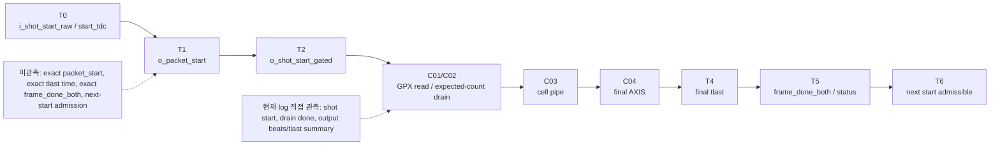

# C06 Control/Status Integration Verify Baseline v001

- 생성 시간: 2026-05-11 19:10:05 KST
- 수정 시간: 2026-05-11 19:16:30 KST
- 작성자: Codex
- 기준 문서:
  - `Doc/TDC-GPX-Datasheet.pdf`
  - `Doc/cluster_analysis/C06_Control_Status_Integration/C06_Control_Status_Integration_260501044033_Plan_v001.md`
  - `Doc/cluster_analysis/C06_Control_Status_Integration/C06_Control_Status_Integration_260511161310_Analysis_v001.md`
  - `Doc/cluster_analysis/C06_Control_Status_Integration/C06_Control_Status_Integration_260511163000_Code_Review_v001.md`
- xsim 기준 경로: `C:\AMDDesignTools\2025.2.1\Vivado`
- 실행 방식: 기존 2025.2.1 elaborated xsim snapshot 재실행

## 1. 결론

판정: C06 baseline 검증은 일부 PASS, 일부 Open이다.

이번 baseline에서 확인된 것은 다음이다.

1. `tdc_gpx_face_seq` 단독 검증은 raw pulse, multi-cycle raw, back-to-back shot, deferred path, invalid stops reject 모두 PASS다.
2. `tdc_gpx_top` 통합 snapshot은 32/64/128 bit width에서 output stream beat/tlast count가 PASS다.
3. `CTL21.max_hits_cfg` early/late write snapshot은 기능적으로 deadlock 없이 PASS다.
4. polygon budget matrix는 32/64/128 bit width 계산 모델이 PASS다.

아직 닫히지 않은 것은 다음이다.

1. T0~T6 marker가 signal-level로 직접 찍힌 것이 아니라 TB log의 shot start/drain/output summary로 간접 확인되었다.
2. final AXI4-Stream `tready` stall 조건은 이번 baseline snapshot에서 직접 검증되지 않았다.
3. `o_irq`, `o_irq_pipe`, sticky clear, rise/fall imbalance는 아직 전용 검증이 없다.

따라서 C06은 “현재 구현이 기본 정상 흐름을 유지한다”는 baseline은 확보했지만, C06 완료 판정은 아직 아니다. 다음 단계는 baseline 공백을 닫기 위한 TB 보완 또는 Code Fix Plan이다.

## 2. 실행 명령과 로그

이번 실행은 사용자가 지정한 Vivado/xsim 경로를 사용했다.

```powershell
& 'C:\AMDDesignTools\2025.2.1\Vivado\bin\xsim.bat' tb_face_seq_snap -log xsim_c06_baseline_face_seq_260511191005.log -runall
& 'C:\AMDDesignTools\2025.2.1\Vivado\bin\xsim.bat' tb_tdc_gpx_top_int_width32 -log xsim_c06_baseline_top_int_width32_260511191005.log -runall
& 'C:\AMDDesignTools\2025.2.1\Vivado\bin\xsim.bat' tb_tdc_gpx_top_int_width64 -log xsim_c06_baseline_top_int_width64_260511191005.log -runall
& 'C:\AMDDesignTools\2025.2.1\Vivado\bin\xsim.bat' tb_tdc_gpx_top_int_width128 -log xsim_c06_baseline_top_int_width128_260511191005.log -runall
& 'C:\AMDDesignTools\2025.2.1\Vivado\bin\xsim.bat' tb_top_ctl21_early64 -log xsim_c06_baseline_ctl21_early64_260511191005.log -runall
& 'C:\AMDDesignTools\2025.2.1\Vivado\bin\xsim.bat' tb_top_ctl21_late64 -log xsim_c06_baseline_ctl21_late64_260511191005.log -runall
& 'C:\AMDDesignTools\2025.2.1\Vivado\bin\xsim.bat' tb_tdc_gpx_polygon_budget_matrix -log xsim_c06_baseline_polygon_260511191005.log -runall
```

주의: 이번 단계는 기존 snapshot 재실행이다. RTL source를 새로 compile/elaborate한 것이 아니므로, 다음 수정 단계 후에는 반드시 fresh compile/xelab/xsim으로 재검증해야 한다.

## 3. Datasheet 기준과 baseline 의미

| Datasheet 근거 | 위치 | 이번 baseline 적용 |
| --- | --- | --- |
| I-Mode는 1개 Start와 8개 Stop channel hit 측정이다. | PDF page 25, section `2.3 I-Mode Basics` | TB는 I-Mode single 계열로만 해석한다. Quiet/M-mode/continuous는 baseline 범위 밖이다. |
| Single start에서는 `StartTimer = 0`으로 internal start generation을 끈다. | PDF page 25, `Single Start` | C06 next shot은 external start 수락/보류/드롭으로 판단한다. |
| IFIFO read data는 `ChaCode`, `Start#`, `Slope`, `Hit` 구조다. | PDF page 27, section `2.4 Data structure` | 이번 baseline은 payload 의미를 다시 검증하지 않고 C02/C03/C04 인계 계약을 전제로 한다. |
| IFIFO empty read는 금지 조건이다. | PDF page 27, internal data processing 설명 | top 통합 TB에서 expected-count bound가 read count와 leftover를 확인한다. |
| I-Mode single은 IrFlag 이후 EF 확인, IFIFO read, Master reset 순서다. | PDF page 29, section `2.11.1 Single measurement` | TB log는 shot start, expected-count drain, output stream summary를 관측한다. |

## 4. Baseline 결과 요약

| 검증 | Log | 결과 | 근거 |
| --- | --- | --- | --- |
| face_seq 기본 동작 | `xsim_c06_baseline_face_seq_260511191005.log` | PASS | line 28-50: Scenario A~E PASS, `ALL SCENARIOS PASSED` |
| top width 32 | `xsim_c06_baseline_top_int_width32_260511191005.log` | PASS | line 31, 78-92: 500m/32-bit, rising/falling beats=72, tlast=2 |
| top width 64 | `xsim_c06_baseline_top_int_width64_260511191005.log` | PASS | line 31, 78-92: 500m/64-bit, rising/falling beats=44, tlast=2 |
| top width 128 | `xsim_c06_baseline_top_int_width128_260511191005.log` | PASS | line 31, 78-92: 500m/128-bit, rising/falling beats=38, tlast=2 |
| CTL21 early write | `xsim_c06_baseline_ctl21_early64_260511191005.log` | PASS | line 55, 79-93: early max_hits write 후 output beats=44, tlast=2 |
| CTL21 late write | `xsim_c06_baseline_ctl21_late64_260511191005.log` | PASS | line 55, 78-102: late write 후 2 faces/4 cols, output beats=104, tlast=4 |
| polygon budget model | `xsim_c06_baseline_polygon_260511191005.log` | PASS | `POLY_BOUNDARY`, `POLY_SWEEP COMPLETE`, final PASS line |

## 5. Timing / Latency / Throughput / Pipeline / II

### 5.1 현재 log에서 얻은 시간 정보

`tb_tdc_gpx_top_int_width64` 기준:

| Marker 후보 | Log time | 의미 |
| --- | --- | --- |
| S5 | 14112.5 ns | START command pulse -> face_seq active |
| Shot 1 start | 14582.5 ns | `col0/shot1` start |
| Shot 1 drain done | 20117.5 ns | expected-count bound PASS 및 drain done |
| Shot 2 start | 25117.5 ns | `col1/shot2` start |
| Shot 2 drain done | 30652.5 ns | expected-count bound PASS 및 drain done |
| Integrated end | 43162.5 ns | output stream summary 완료 |

산출:

- Shot 1 start 이후 drain done까지: 5535.0 ns
- Shot 2 start 이후 drain done까지: 5535.0 ns
- Shot 간격: 10535.0 ns
- Integrated start S5부터 최종 summary까지: 29050.0 ns

해석:

이 값은 T0~T6의 직접 계측값이 아니라 TB log marker 기반 간접 baseline이다. 따라서 `face_seq` 내부 `o_packet_start`, `o_shot_start_gated`, C04 final `tlast`, `o_frame_done_both`, next-start admission을 분리하려면 전용 marker가 필요하다.

### 5.2 T0~T6 baseline timing block



### 5.3 Throughput / II 판단

| 항목 | Baseline 판단 | 제한 |
| --- | --- | --- |
| 32/64/128 width throughput | top integration에서 expected beat/tlast PASS | ready high 조건 |
| polygon budget | 계산 모델 PASS | ready stall penalty 미포함 |
| II | shot interval 10.535 us 시나리오에서 정상 동작 | 최소 II 산출 아님 |
| Pipeline | C01/C02 drain과 C04 output까지 정상 완료 | T0~T6 stage별 latency 미분리 |

결론:

현재 baseline은 “주어진 TB scenario에서는 pipeline이 막히지 않는다”는 근거다. 그러나 “최소 II가 얼마인가” 또는 “13.888889 us start interval 안에서 backpressure까지 포함해 항상 PASS인가”를 닫지는 못한다.

## 6. Polygon budget boundary

baseline log의 `POLY_BOUNDARY` 요약:

| Width | Distance | MAX_PASS_CFG | 의미 |
| --- | ---: | ---: | --- |
| 32 | 10 m | 7 | 시작점에서 cfg=7 PASS |
| 32 | 720 m | 6 | cfg=7이 실패하기 시작하는 boundary |
| 32 | 750 m | 4 | cfg=6도 실패하고 cfg=4까지 PASS |
| 32 | 780 m | 2 | cfg=4 실패, cfg=2까지 PASS |
| 32 | 810 m | 0 | cfg=1도 실패 |
| 64 | 10 m | 7 | 시작점에서 cfg=7 PASS |
| 64 | 790 m | 4 | cfg=7/6 실패, cfg=4까지 PASS |
| 64 | 820 m | 0 | cfg=1도 실패 |
| 128 | 10 m | 7 | 시작점에서 cfg=7 PASS |
| 128 | 820 m | 0 | cfg=1도 실패 |

해석:

이 결과는 C04 output drain 계산 모델 기준이며, C06 final `tready` stall penalty는 포함하지 않는다. 따라서 system 조건으로는 “ready high 또는 bounded-stall 계약”이 반드시 필요하다.

## 7. VB-C06 검증 Matrix 업데이트

| ID | 항목 | Baseline 상태 | 근거/판단 |
| --- | --- | --- | --- |
| VB-C06-01 | I-Mode single 정상 sequence | Partial PASS | top width 32/64/128 PASS. 단 T0~T6 exact marker는 없음 |
| VB-C06-02 | C04 drain 중 next start | Partial PASS | face_seq deferred path PASS. top-level drain 중 next start는 미검증 |
| VB-C06-03 | rise/fall lane 완료 불균형 | Open | 전용 scenario 없음 |
| VB-C06-04 | output `tready` stall | Open | top_int는 `tready='1'` 조건 |
| VB-C06-05 | sticky clear | Open | soft_clear/status sticky 전용 readback 없음 |
| VB-C06-06 | `max_hits_cfg` snapshot | Partial PASS | CTL21 early/late snapshot PASS. field-level snapshot timing은 추가 관측 필요 |
| VB-C06-07 | 32/64/128 width sweep | PASS | top_int width32/64/128 PASS |
| VB-C06-08 | reset/soft_reset/force_reinit | Open | 전용 recovery scenario 없음 |
| VB-C06-09 | IRQ policy | Open | `o_irq`, `o_irq_pipe` 검증 없음 |
| VB-C06-10 | polygon budget + backpressure | Partial PASS | polygon budget model PASS. backpressure 미포함 |

## 8. Code Review Findings 반영 상태

| Finding | Baseline 판단 | 다음 처리 |
| --- | --- | --- |
| F-C06-CR-01 end-to-end II/backpressure | Open 유지 | ready stall 포함 TB 필요 |
| F-C06-CR-02 start 출력 경계 조합 | Open 유지 | 수정 전 baseline은 확보. register화 전/후 비교 가능 |
| F-C06-CR-03 status_agg busy 조합 | Open 유지 | 코드 수정 계획에 register화 반영 |
| F-C06-CR-04 sticky soft_clear 불일치 | Open 유지 | status map과 soft_clear TB 필요 |
| F-C06-CR-05 IRQ 계약 불명확 | Open 유지 | IRQ source/clear 계약 및 TB 필요 |
| F-C06-CR-06 status source 분산 | Planned 후보 | Status Map v001 작성 필요 |
| F-C06-CR-07 fall-only abort 검증 | Open 유지 | rise/fall imbalance TB 필요 |

## 9. 다음 단계

다음은 `C06_Code_Fix_Plan_v001`로 가는 것이 맞다. 이유는 baseline으로 다음 사실이 분리되었기 때문이다.

1. 정상 data/output 흐름은 기본 PASS다.
2. width generic과 C04 budget 모델은 PASS다.
3. C06의 실제 open risk는 data path 기능 자체보다 control/status/IRQ/backpressure 계약이다.

수정 계획에는 다음 네 가지를 포함해야 한다.

1. `tdc_gpx_status_agg`의 `busy/overrun` register boundary 추가.
2. `tdc_gpx_face_seq`의 `shot_start_gated/face_start_gated/per-chip start` register화 또는 timing 예외 문서화.
3. `s_err_soft_clear` 대상 sticky field 통일 및 reset-only 예외 목록 작성.
4. `o_irq_pipe`를 reserved/tied-off로 둘지, pipeline event IRQ로 재정의할지 결정.

그 다음 `C06_Verify_v001`에서 fresh compile/elab/xsim으로 VB-C06-01/03/04/05/09/10을 닫아야 한다.

## 10. Fix Plan v001 실행 결과 반영

이 baseline 문서는 수정 전 상태를 고정해 두는 문서이므로 baseline 수치는 변경하지 않는다. 대신 Fix Plan v001 실행 후 각 VB-C06 항목의 현재 closure 상태와 다음 승계 계획을 아래에 기록한다.

| VB 항목 | Baseline 상태 | Result v001 이후 상태 | 다음 추적 |
|---|---|---|---|
| VB-C06-01 normal sequence | Partial PASS | 64-bit top integration PASS, 32/128 fresh rerun 필요 | FP2-C06-02 |
| VB-C06-02 start output boundary | Open | register boundary 수정 및 focused/integration PASS | Closed |
| VB-C06-03 frame_done/face_close relation | Open | 기본 face_seq PASS, imbalance 상세는 미검증 | FP2-C06-05 |
| VB-C06-04 status aggregation boundary | Open | `status_agg` focused PASS | Closed |
| VB-C06-05 sticky clear | Open | top sticky probe PASS, 전체 map은 미완 | FP2-C06-07 |
| VB-C06-06 IRQ contract | Open | `o_irq_pipe` reserved 수락, `o_irq` CSR 계약 미검증 | FP2-C06-06 |
| VB-C06-07 tready stall | Open | v001에서 직접 재검증 없음 | FP2-C06-04 |
| VB-C06-08 reset/soft_reset/force_reinit | Open | 정상 run PASS, recovery 상세 미검증 | FP2-C06-08 |
| VB-C06-09 width compatibility | PASS baseline | 수정 후 64-bit fresh PASS, 32/128 재검증 필요 | FP2-C06-02 |
| VB-C06-10 traceability | Partial PASS | v001/result/v002 연결 기록 완료 | Closed / 계속 유지 |

근거 문서:

- `C06_Control_Status_Integration_260511195318_Code_Fix_Result_v001.md`
- `C06_Control_Status_Integration_260511200655_Code_Fix_Plan_v002.md`

## 11. Lineage

| 이전 문서 | 이번 문서 반영 위치 |
| --- | --- |
| `C06_Control_Status_Integration_260511161310_Analysis_v001.md` | T0~T6 marker와 VB-C06 matrix를 baseline 기준으로 재분류 |
| `C06_Control_Status_Integration_260511163000_Code_Review_v001.md` | Findings F-C06-CR-01..07의 baseline 상태 업데이트 |

다음 문서가 생성되면 이 문서의 `Partial PASS`와 `Open` 항목은 `Fixed`, `Verified`, `Accepted Exception` 중 하나로 갱신되어야 한다.
