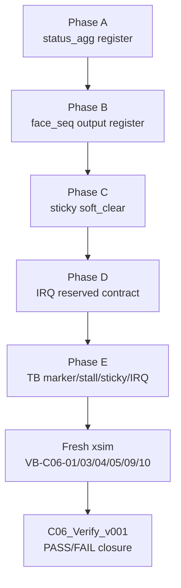

# C06 Control/Status Integration Code Fix Plan v001

- 생성 시간: 2026-05-11 19:25:15 KST
- 수정 시간: 2026-05-11 19:25:15 KST
- 작성자: Codex
- 기준 문서:
  - `Doc/TDC-GPX-Datasheet.pdf`
  - `Doc/cluster_analysis/C06_Control_Status_Integration/C06_Control_Status_Integration_260511161310_Analysis_v001.md`
  - `Doc/cluster_analysis/C06_Control_Status_Integration/C06_Control_Status_Integration_260511163000_Code_Review_v001.md`
  - `Doc/cluster_analysis/C06_Control_Status_Integration/C06_Control_Status_Integration_260511191005_Verify_Baseline_v001.md`
- xsim 기준 경로: `C:\AMDDesignTools\2025.2.1\Vivado`

## 1. 목적과 판정

이 문서는 C06 baseline 이후 실제 코드 보완에 들어가기 위한 수정 계획이다.

판정: 코드 수정 진행 가능. 단, C06의 목적은 data payload 재설계가 아니라 control/status/IRQ/backpressure 계약 closure다.

수정 범위는 다음 4개로 제한한다.

1. `tdc_gpx_status_agg`의 `busy/overrun` 출력 register boundary 추가.
2. `tdc_gpx_face_seq`의 start/gated 출력 boundary register화.
3. top-level 운용 fault sticky의 `s_err_soft_clear` clear 정책 정리.
4. `o_irq_pipe`를 이번 C06에서는 `reserved/tied-off` 계약으로 명확히 닫기.

이번 계획에서는 pipeline event IRQ를 새로 만들지 않는다. `o_irq_pipe`를 새로운 interrupt source로 설계하면 SW interrupt 정책, mask/clear semantic, STAT5/6/7 sticky OR 정책이 함께 바뀌므로 C06의 작은 안정화 범위를 넘는다.

## 2. Datasheet 기준

| Datasheet 근거 | 위치 | 수정 계획 반영 |
| --- | --- | --- |
| I-Mode는 1개 Start와 8개 Stop channel 간 hit를 측정한다. | PDF page 25, section `2.3 I-Mode Basics` | C06 수정은 I-Mode single 운용만 대상으로 한다. |
| Single start에서는 `StartTimer = 0`으로 internal start generation을 끈다. | PDF page 25, `Single Start` | `face_seq`의 external start 수락 경계를 register로 닫는다. |
| I-Mode single sequence는 IrFlag 대기, EF 확인, IFIFO read, Master reset 순서다. | PDF page 29, section `2.11.1 Single measurement` | IrFlag와 output 완료를 혼동하지 않도록 T0~T6 marker와 status 계약을 분리한다. |
| Register 12는 TimerFlag/FIFO/full/empty 및 interrupt mask 관련 bit를 갖는다. | PDF page 22, register 12 | Datasheet interrupt와 RTL `o_irq/o_irq_pipe`는 같은 의미가 아니므로 SW-visible 계약을 분리한다. |
| FIFO empty read는 금지 조건이다. | PDF page 27, internal data processing 설명 | backpressure/sticky/status 검증에서 empty/fault history가 지워지는지 별도 확인한다. |

## 3. 수정 대상과 소유 파일

| Phase | 파일 | 변경 성격 | 목적 |
| --- | --- | --- | --- |
| A | `tdc_gpx_status_agg.vhd` | RTL 수정 | `busy/overrun` 조합 출력 register화 |
| B | `tdc_gpx_face_seq.vhd` | RTL 수정 | `o_face_start_gated`, `o_shot_start_gated`, `o_shot_start_per_chip` register boundary |
| C | `tdc_gpx_top.vhd` | RTL 수정 | reset-only fault sticky 중 soft_clear 대상 정리 |
| D | `tdc_gpx_top.vhd`, `tdc_gpx_csr_pipeline.vhd` | 계약/주석 중심 | `o_irq_pipe` reserved/tied-off 계약 명확화 |
| E | `tb_tdc_gpx_face_seq.vhd`, `tb_tdc_gpx_top_int.vhd`, `tb_tdc_gpx_full_int.vhd` | TB 보완 | T0~T6, stall, sticky/IRQ 관측 |

TB AXI4-Lite 접근은 프로젝트 규칙에 따라 `px_utility_pkg.vhd`의 helper를 사용한다. `tb_tdc_gpx_top_int.vhd:44`, `tb_tdc_gpx_top_int.vhd:58`, `tb_tdc_gpx_full_int.vhd:37`, `tb_tdc_gpx_full_int.vhd:61`에서 이미 해당 규칙을 따르고 있으므로, 새 TB code도 이 패턴을 유지한다.

## 4. Phase A: `status_agg` register boundary

### 4.1 현재 문제

근거:

- `tdc_gpx_status_agg.vhd:161-174`: `o_status.busy`가 많은 입력을 조합 OR로 결합한다.
- `tdc_gpx_status_agg.vhd:177-179`: `pipeline_overrun`, `rise_overrun`, `fall_overrun`도 조합 출력이다.
- `tdc_gpx_csr_pipeline.vhd:352-354`: 이 값들이 CSR `STAT5` packing으로 연결된다.

### 4.2 수정 방향

`tdc_gpx_status_agg` 내부에 다음 register를 추가한다.

| Register | 입력 | 출력 field | Reset |
| --- | --- | --- | --- |
| `s_busy_r` | 기존 busy OR 조건 | `o_status.busy` | `0` |
| `s_pipeline_overrun_r` | `i_shot_overrun or i_shot_fall_overrun` | `o_status.pipeline_overrun` | `0` |
| `s_rise_overrun_r` | `i_shot_overrun` | `o_status.rise_overrun` | `0` |
| `s_fall_overrun_r` | `i_shot_fall_overrun` | `o_status.fall_overrun` | `0` |

주의:

- 이 값들은 sticky가 아니라 live status다.
- register화로 CSR 반영이 `i_clk` 기준 1 clock 늦어진다.
- 150 MHz 기준 1 clock은 약 6.667 ns이므로 SW polling 관점에서는 허용 가능하다.

### 4.3 검증

| 항목 | 기대 |
| --- | --- |
| reset 후 status | busy/overrun field 0 |
| normal sequence 중 status | busy가 최소 1회 1로 관측되고 종료 후 0 |
| overrun stimulus | pipeline/rise/fall overrun이 1 clock 뒤 status에 반영 |

## 5. Phase B: `face_seq` start boundary register화

### 5.1 현재 문제

근거:

- `tdc_gpx_face_seq.vhd:674-680`: `s_shot_start_gated`는 pending/closing/stop/reset/abort/quiesce 조합이다.
- `tdc_gpx_face_seq.vhd:684`: per-chip start가 `s_shot_start_gated and s_face_active_mask_r(i)`로 바로 나간다.
- `tdc_gpx_face_seq.vhd:690-693`: `o_face_start_gated`, `o_shot_start_gated`가 조합 qualifier 후 출력된다.

`packet_start`, `frame_done_both`, `face_closing`은 이미 register 기반이므로 유지한다.

### 5.2 수정 방향

다음 register를 추가한다.

| Register | 목적 |
| --- | --- |
| `s_face_start_gated_r` | `o_face_start_gated` 출력 경계 FF |
| `s_shot_start_gated_r` | `o_shot_start_gated` 출력 경계 FF |
| `s_shot_start_per_chip_r` | per-chip start 출력 경계 FF |

`s_shot_start_gated` 조합 계산은 내부 decision으로 유지하되, module output은 register에서만 나가게 한다.

### 5.3 예상 영향

| 항목 | 영향 |
| --- | --- |
| Latency | T2가 +1 `i_clk` 이동 가능 |
| Throughput | 정상 조건에서는 data beat throughput 영향 없음 |
| Pipeline | start boundary가 FF로 닫힘 |
| II | 최소 II가 +1 clock 늘 수 있음 |

주의:

- 내부 counter가 현재 `s_shot_start_gated` 조합 decision을 사용한다. 출력 register와 counter 기준이 1 clock 어긋나면 안 된다.
- 수정 시 내부 counter 기준을 `s_shot_start_gated_r`로 바꿀지, 조합 decision을 유지하고 출력만 지연할지 선택해야 한다.
- 권고는 “외부로 전달되는 start와 내부 shot count 기준을 동일한 registered pulse로 맞추는 것”이다.

### 5.4 검증

| 항목 | 기대 |
| --- | --- |
| Scenario A raw 1-cycle | `packet_start`, `shot_start_gated`가 각각 1-cycle pulse |
| Scenario B raw multi-cycle | shot count 1회만 증가 |
| Scenario C back-to-back | 두 edge가 두 shot으로 계산 |
| Scenario D deferred | hdr busy 동안 counter 증가 없음, hdr idle 후 1회 증가 |
| top width sweep | 32/64/128 output beat/tlast count 유지 |

## 6. Phase C: sticky clear 정책 정리

### 6.1 현재 문제

근거:

- `tdc_gpx_status_agg.vhd:117-153`: error counter와 drain/sequence sticky는 `i_soft_clear`로 clear된다.
- `tdc_gpx_top.vhd:1072-1074`: `frame_done_faulted_sticky`는 reset-only다.
- `tdc_gpx_top.vhd:1085-1087`: `row_done_faulted_sticky`도 reset-only다.
- `tdc_gpx_top.vhd:1115-1124`: `run_timeout_sticky`도 reset-only다.
- `tdc_gpx_top.vhd:1097-1103`: `stop_id_error_mask`는 reset 또는 `s_err_soft_clear`로 clear된다.

### 6.2 수정 정책

기본 정책:

운용 fault sticky는 `s_err_soft_clear`로 clear 가능해야 한다.

수정 대상:

| Field | 현재 | 수정 |
| --- | --- | --- |
| `frame_done_faulted_sticky` | reset-only | reset 또는 `s_err_soft_clear` |
| `row_done_faulted_sticky` | reset-only | reset 또는 `s_err_soft_clear` |
| `run_timeout_mask` | reset-only | reset 또는 `s_err_soft_clear` |

예외:

| Field | 예외 이유 |
| --- | --- |
| `quarantine_escape_mask` | source module 내부 sticky가 reset-only이고, 기존 주석도 pipeline reset 재발행을 요구한다. 이번 C06에서는 reset-only 예외로 유지한다. |

### 6.3 검증

| 항목 | 기대 |
| --- | --- |
| fault inject 후 status read | sticky set |
| `err_soft_clear` pulse 후 read | soft-clear 대상 sticky clear |
| quarantine escape | soft_clear로 clear되지 않고 reset-only 유지 |

## 7. Phase D: IRQ 계약

### 7.1 현재 구조

근거:

- `tdc_gpx_top.vhd:169-170`: `o_irq`, `o_irq_pipe`가 top output이다.
- `tdc_gpx_top.vhd:465`: `u_csr_pipeline.o_irq => o_irq_pipe`.
- `tdc_gpx_csr_pipeline.vhd:345-346`: `intrpt_src_in => "0"`, `irq => o_irq`.
- `tdc_gpx_top.vhd:630`: `u_config_ctrl.o_irq => o_irq`.

### 7.2 이번 C06 결정

`o_irq_pipe`는 이번 C06에서 pipeline event IRQ로 만들지 않는다.

계약:

| Port | 이번 C06 의미 | 수정 |
| --- | --- | --- |
| `o_irq` | config/control CSR IRQ | 기존 유지 |
| `o_irq_pipe` | reserved/tied-off pipeline IRQ | 문서와 주석으로 명시. 필요 시 `tdc_gpx_csr_pipeline` source 상수 0 유지 |

이 결정의 이유:

1. Datasheet Register 12 interrupt와 RTL pipeline status sticky는 같은 semantic이 아니다.
2. pipeline IRQ를 새로 만들려면 STAT5/6/7 OR, mask, clear, pulse/level 정책이 필요하다.
3. 현재 C06 목표는 control/status 안정화이며, 새로운 SW interrupt 기능 추가는 다음 generation 항목이 맞다.

### 7.3 검증

| 항목 | 기대 |
| --- | --- |
| normal top run | `o_irq_pipe = 0` 유지 |
| status fault | status sticky는 set되지만 `o_irq_pipe`는 0 유지 |
| config/control IRQ | 기존 `o_irq` 동작은 regression으로 유지 |

## 8. Phase E: 검증 계획

### 8.1 Fresh compile/elab/xsim 원칙

baseline은 기존 snapshot 재실행이었다. 코드 수정 후에는 반드시 source compile부터 다시 수행한다.

예상 기준:

```powershell
& 'C:\AMDDesignTools\2025.2.1\Vivado\bin\vivado.bat' -mode batch -source scripts/run_all_tbs.tcl -nojournal -nolog
```

단, 기존 `run_all_tbs.tcl`은 scripts-only 성격이 있으므로 실제 xsim 실행은 기존 프로젝트 흐름 또는 개별 snapshot 재생성 절차를 사용한다. 최종 문서에는 실제 사용한 명령을 그대로 기록한다.

### 8.2 필수 검증 Matrix

| ID | 항목 | 계획 |
| --- | --- | --- |
| VB-C06-01 | I-Mode single 정상 sequence | T0~T6 marker 추가 후 PASS 확인 |
| VB-C06-02 | C04 drain 중 next start | face_seq deferred + top-level next start scenario |
| VB-C06-03 | rise/fall lane 완료 불균형 | fall delay/fall abort/rise 정상 조합 |
| VB-C06-04 | output `tready` stall | `tb_tdc_gpx_full_int`의 `G_BP_TREADY_GAP` 활용 |
| VB-C06-05 | sticky clear | `err_soft_clear` 전/후 STAT readback |
| VB-C06-06 | `max_hits_cfg` snapshot | early/late 유지 검증 |
| VB-C06-07 | 32/64/128 width sweep | top width sweep 재실행 |
| VB-C06-08 | reset/soft_reset/force_reinit | recovery deadlock 없음 |
| VB-C06-09 | IRQ policy | `o_irq_pipe=0` reserved 계약 확인 |
| VB-C06-10 | polygon budget + backpressure | bounded stall penalty 포함 재산출 |

## 9. Timing / Latency / Throughput / Pipeline / II 예상

| 수정 | Latency | Throughput | Pipeline | II |
| --- | --- | --- | --- | --- |
| status register화 | status visible +1 clock | data 영향 없음 | CSR status fan-in 안정화 | 직접 영향 없음 |
| face_seq start register화 | T2 +1 clock 가능 | data beat rate 영향 없음 | start boundary FF closure | 최소 II +1 clock 가능 |
| sticky clear 통일 | clear 후 관측 +0~1 clock | data 영향 없음 | recovery 상태 추적성 향상 | recovery 후 판단 안정화 |
| `o_irq_pipe` reserved | IRQ 기능 추가 없음 | data 영향 없음 | SW 계약 단순화 | 직접 영향 없음 |
| tready stall 검증 | stall만큼 T3~T6 증가 | bounded stall에 따라 감소 | C04 이후 drain 연장 | T6 기준 II 증가 |

## 10. 작업 순서



작업 원칙:

1. 한 Phase씩 수정하고, 가능하면 해당 TB를 먼저 실행한다.
2. C06의 data payload는 변경하지 않는다.
3. 32/64/128 output width 계약은 유지한다.
4. TB AXI4-Lite helper는 `px_utility_pkg.vhd`를 사용한다.
5. 합성 가능한 VHDL만 작성한다.

## 11. Open 결정 항목

이번 계획에서 Codex 기본 판단으로 결정한 항목:

| 항목 | 결정 |
| --- | --- |
| `o_irq_pipe` | reserved/tied-off 유지 |
| `quarantine_escape_mask` | reset-only 예외 유지 |
| `status_agg.busy/overrun` | register화 진행 |
| `face_seq` start outputs | register화 진행 |
| soft_clear 대상 | frame/row faulted, run_timeout 추가 |

사용자 확인이 필요한 항목은 현재 없다. 수정 중 timing 또는 TB가 기존 계약과 충돌하면 별도 Review 문서로 중단 보고한다.

## 12. Lineage

| 이전 문서 | 이번 문서 반영 위치 |
| --- | --- |
| `C06_Control_Status_Integration_260511163000_Code_Review_v001.md` | Findings F-C06-CR-01..07을 Phase A~E로 변환 |
| `C06_Control_Status_Integration_260511191005_Verify_Baseline_v001.md` | PASS/Open 상태를 필수 검증 Matrix와 수정 순서로 변환 |

다음 문서는 `C06_Control_Status_Integration_<timestamp>_Code_Fix_v001.md` 또는 `C06_Control_Status_Integration_<timestamp>_Verify_v001.md`가 되어야 한다.

