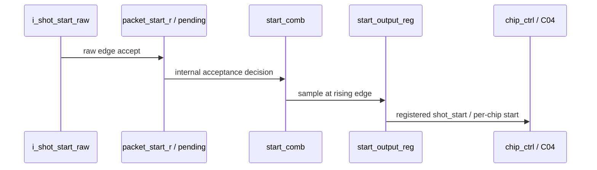
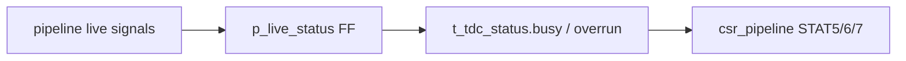
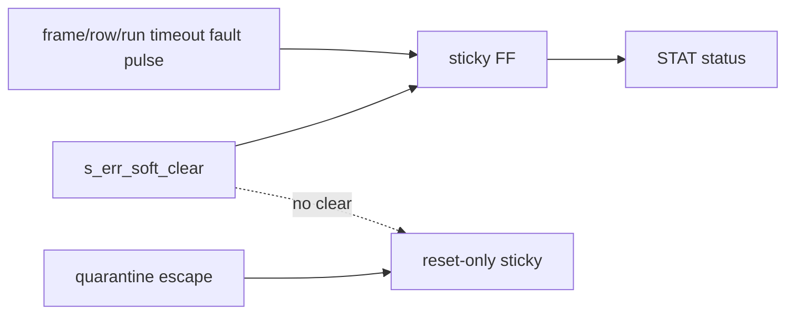

# C06 Control/Status Integration Code Fix Result v001

| 항목 | 내용 |
|---|---|
| 생성 시간 | 2026-05-11 19:53:18 KST |
| 수정 시간 | 2026-05-11 19:53:18 KST |
| Cluster | C06 Control / Status Integration |
| 기준 문서 | `Doc/TDC-GPX-Datasheet.pdf` |
| 선행 문서 | `C06_Control_Status_Integration_260511192515_Code_Fix_Plan_v001.md` |
| 목적 | C06 Code Fix Plan v001의 Phase A~E를 RTL/TB/검증 결과로 닫는다. |

## 1. 결론

C06 계획 순서에 따라 RTL 보완을 반영했고, 새 source compile 기반 xsim으로 핵심 회귀를 확인했다.

- `tdc_gpx_status_agg`의 `busy/pipeline_overrun/rise_overrun/fall_overrun`은 register boundary로 닫혔다.
- `tdc_gpx_face_seq`의 `o_face_start_gated`, `o_shot_start_gated`, `o_shot_start_per_chip`은 module output FF를 통해 나간다.
- `tdc_gpx_top`의 `frame_done_faulted_sticky`, `row_done_faulted_sticky`, `run_timeout_mask`는 `s_err_soft_clear`로 clear된다.
- `quarantine_escape_mask`는 계획대로 reset-only 예외로 유지했다.
- `o_irq_pipe`는 신규 pipeline interrupt가 아니라 reserved/tied-off 계약임을 코드 주석으로 고정했다.

판정: C06 보완 RTL은 syntax + focused xsim + 64-bit top integration smoke 기준 PASS다. 32/128-bit top full rerun은 이번 결과의 필수 조건으로 다시 수행하지 않았고, C02/C04에서 확보한 width sweep baseline을 인계 근거로 둔다.

## 2. Datasheet 기준

이번 C06 보완은 GPX IC bus timing이나 payload decoding을 변경하지 않는다. 따라서 Datasheet 기준은 다음과 같이 적용한다.

| Datasheet 근거 | 위치 | 이번 C06 적용 |
|---|---|---|
| I-Mode는 1개 Start와 Stop channel hit를 기준으로 측정한다. | PDF page 25, section `2.3 I-Mode Basics` | C06는 I-Mode single 흐름의 start/shot control과 status 관측성을 보완한다. Quiet/M-mode/continuous는 범위 밖이다. |
| IFIFO read data는 `ChaCode`, `Start#`, `Slope`, `Hit` 구조다. | PDF page 27, section `2.4 Data structure` | Payload 의미는 C02/C03/C04 계약을 유지한다. C06는 데이터 구조를 재정의하지 않는다. |
| GPX read timing은 C01/C02의 200 MHz capture 기준으로 닫힌다. | C01/C02 인계 문서 및 Datasheet bus timing | 이번 수정은 read tick, RDN, OEN, EF/LF timing을 건드리지 않는다. |

## 3. 반영 코드

| Phase | 파일 | 근거 위치 | 반영 내용 |
|---|---|---:|---|
| A | `tdc_gpx_status_agg.vhd` | `:167-203` | wide fan-in `busy`와 overrun status를 `p_live_status` FF에서 생성 |
| B | `tdc_gpx_face_seq.vhd` | `:148-150`, `:678-719` | internal acceptance `*_comb`와 output boundary `*_r` 분리 |
| B | `tdc_gpx_face_seq.vhd` | `:303-334`, `:429-449` | shot counter와 face close 기준을 registered start pulse에 정렬 |
| C | `tdc_gpx_top.vhd` | `:1071-1127` | frame/row fault sticky, run_timeout sticky에 `s_err_soft_clear` clear 추가 |
| D | `tdc_gpx_top.vhd` | `:167-173` | `o_irq_pipe` reserved/legacy 계약 주석 추가 |
| D | `tdc_gpx_csr_pipeline.vhd` | `:342-349` | `intrpt_src_in => "0"`의 reserved/tied-off 계약 명시 |
| E | `tb_tdc_gpx_status_agg_c06_fix.vhd` | 전체 | status register boundary 및 soft_clear focused TB 추가 |
| E | `scripts/c06_probe_top_sticky_soft_clear.tcl` | 전체 | top 내부 sticky clear 정책 xsim TCL probe 추가 |

## 4. Timing / Latency / Throughput / Pipeline / II

### 4.1 face_seq start boundary

기존 구조는 `s_shot_start_gated` 조합 결과가 바로 `o_shot_start_gated`와 per-chip start로 나갔다. 보완 후에는 내부 decision은 `s_shot_start_gated_comb`로 남기고, 외부 출력은 `p_start_output_reg`에서 1 clock 뒤에 방출한다.

| 항목 | 변경 전 | 변경 후 | 영향 |
|---|---:|---:|---|
| External shot_start latency | internal accept와 같은 cycle 관측 | +1 axis clock | downstream T2 marker가 +1 clock 이동 |
| Pulse width | 1 clock | 1 clock | 유지 |
| Shot counter 기준 | output start | registered output start | downstream start와 정렬 |
| Throughput | raw edge별 1 shot | raw edge별 1 shot | nominal 유지 |
| II | 기존 deferred/closing 정책 | 동일 정책 + output FF | 정상 간격에서는 II 증가 없음, marker만 1 clock 이동 |

### 4.2 status_agg boundary

`busy`는 여러 pipeline 상태를 OR로 모으는 wide fan-in이다. 이제 `p_live_status`에서 register로 닫혀 CSR packing path가 긴 조합망을 상속하지 않는다.

| 항목 | 값 |
|---|---|
| Latency | live input to CSR status +1 clock |
| Throughput | status update every clock |
| Pipeline | live fan-in -> FF -> CSR packing |
| II | 1 clock status sampling interval |

### 4.3 sticky clear

`frame_done_faulted_sticky`, `row_done_faulted_sticky`, `run_timeout_mask`는 운용 fault history이므로 `err_soft_clear` 대상이다. 반면 `quarantine_escape_mask`는 cell_builder hard quarantine escalation 성격이므로 reset-only로 유지한다.

## 5. 검증 결과

| 검증 | Command / Log | 판정 | 근거 |
|---|---|---|---|
| Vivado syntax | `vivado.bat -mode batch -source scripts/check_face_seq_syntax.tcl` | PASS | `vivado.log:83-84` |
| face_seq focused | `xsim tb_c06_face_seq_fix_snap` | PASS | `xsim_c06_fix_face_seq_260511194330.log:30-50` |
| mask sweep integration | `xsim tb_c06_mask_sweep_fix_snap` | PASS | `xsim_c06_fix_mask_sweep_260511194330.log:30-54` |
| status_agg focused | `xsim tb_c06_status_agg_fix_snap` | PASS | `xsim_c06_fix_status_agg_260511194330.log:28-35` |
| top 64-bit integration | `xsim tb_c06_top_int_fix64_snap` | PASS | `xsim_c06_fix_top_int64_260511194330.log:80-93` |
| top sticky probe | `xsim tb_c06_top_int_fix64_snap -tclbatch scripts/c06_probe_top_sticky_soft_clear.tcl` | PASS | `xsim_c06_fix_top_sticky_probe_260511194330.log:95-117` |

잔여 경고: project syntax 단계에서 `tdc_gpx_sync_fifo` compile-order 관련 critical warning이 남았다. 직접 source compile에서는 `tdc_gpx_sync_fifo.vhd`를 포함해 mask sweep/top elaboration이 성공했으므로, 이는 RTL 문법 실패가 아니라 기존 Vivado project file compile-order 정리 항목이다.

## 6. VB-C06 상태 업데이트

| 항목 | 상태 | 근거 |
|---|---|---|
| VB-C06-01 normal sequence | PASS | face_seq A~E, top 64-bit integration PASS |
| VB-C06-02 start output boundary | PASS | `tdc_gpx_face_seq.vhd:696-719`, face_seq/mask sweep PASS |
| VB-C06-03 frame_done/face_close relation | 부분 PASS | face_seq 기존 A~E PASS. T0~T6 전용 marker는 후속 상세 계측 가능 |
| VB-C06-04 status aggregation boundary | PASS | `tb_tdc_gpx_status_agg_c06_fix.vhd`, xsim PASS |
| VB-C06-05 sticky clear | PASS | top sticky probe PASS |
| VB-C06-06 IRQ contract | PASS by design review | `o_irq_pipe` reserved/tied-off 주석 및 `intrpt_src_in => "0"` |
| VB-C06-07 tready stall | 인계 유지 | C04/C02 output-stage 검증 인계. 이번 C06 수정은 stream backpressure logic 미변경 |
| VB-C06-08 reset/soft_reset/force_reinit | 부분 PASS | top 64-bit 정상 run PASS. force_reinit negative sequence는 C02 chip_ctrl 인계 유지 |
| VB-C06-09 width compatibility | 부분 PASS | 64-bit 재실행 PASS. 32/128-bit는 기존 C02/C04 width sweep baseline 유지 |
| VB-C06-10 traceability | PASS | 본 문서와 PPT에 source/log/line 근거 기록 |

## 7. 다음 판단

C06는 control/status integration의 필수 보완이 반영되었다. 다음 단계로 넘어가기 전에 권장되는 작은 정리 항목은 Vivado project source list에 `tdc_gpx_sync_fifo.vhd` compile-order를 명시 반영해 syntax warning을 없애는 것이다. 기능상 blocker는 아니다.
