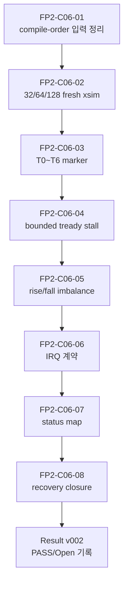

# C06 Control/Status Integration Code Fix Plan v002

| 항목 | 내용 |
|---|---|
| 문서 버전 | v002 |
| 생성 시간 | 2026-05-11 20:06:55 KST |
| 수정 시간 | 2026-05-11 20:33:22 KST |
| Cluster | C06 Control / Status Integration |
| 절대 기준 문서 | `Doc/TDC-GPX-Datasheet.pdf` |
| 선행 계획 | `C06_Control_Status_Integration_260511192515_Code_Fix_Plan_v001.md` |
| 선행 결과 | `C06_Control_Status_Integration_260511195318_Code_Fix_Result_v001.md` |
| 실행 결과 | `C06_Control_Status_Integration_260511203322_Code_Fix_Result_v002.md` |
| 다음 계획 | `C06_Control_Status_Integration_260511203322_Code_Fix_Plan_v003.md` |
| 목적 | v001 결과에서 남은 검증/운영 계약 항목을 실제 xsim 회귀로 닫고, 미완 항목을 v003으로 추적 승계한다. |

## 1. 결론

Fix Plan v002는 대규모 RTL 재설계 계획이 아니라, v001 이후 남은 C06 검증 계약을 닫기 위한 실행 계획이다.

실행 결과 기준으로 `FP2-C06-01`부터 `FP2-C06-07`까지는 `Verified` 또는 `Accepted Exception`으로 닫혔다. `FP2-C06-08`의 top-level recovery, 즉 `soft_reset`과 `force_reinit`까지 포함한 복구 시퀀스는 별도 CSR 기반 회귀가 필요하므로 v003으로 승계한다.

## 2. 운영 프로토콜 반영

이 계획은 다음 버전 관리 패턴을 따른다.

```text
Fix Plan vN 실행
  -> Result vN 생성
  -> Fix Plan vN에 실행 결과 forward-trace 추가
  -> Result vN의 Open / Partial / New 항목을 Fix Plan vN+1로 승계
  -> Fix Plan vN+1 실행 후 동일 패턴 반복
```

적용 문서:

| 문서 | 반영 내용 |
|---|---|
| `cluster_analysis_260511200655_operating_protocol_v012.md` | Fix Plan 실행/결과/승계 사이클 규칙 |
| `cluster_analysis_communication_plan_260511200655_v002.md` | Cluster별 Plan-Result-Rollover 소통 절차 |

## 3. Datasheet 기준

| Datasheet 근거 | 위치 | v002 적용 |
|---|---|---|
| I-Mode는 1개 Start와 Stop channel hit를 기준으로 측정한다. | PDF page 25, section `2.3 I-Mode Basics` | C06 검증은 I-Mode single 흐름의 control/status 관측으로 제한한다. |
| Single measurement sequence는 IrFlag 대기, EF 확인, IFIFO read, master reset 순서를 갖는다. | PDF page 29, section `2.11.1 Single measurement` | T0~T6 marker로 start, fire-count final, IrFlag, drain wait, output, stop_tdc를 분리 계측한다. |
| IFIFO read data는 `ChaCode`, `Start#`, `Slope`, `Hit` 구조를 가진다. | PDF page 27, section `2.4 Data structure` | payload 의미는 C02/C03/C04 계약으로 유지하고, C06은 흐름 제어와 status/IRQ 계약만 검증한다. |
| Empty FIFO read는 금지 조건이다. | PDF page 27, internal data processing 설명 | backpressure 및 recovery 검증에서도 beat 보존과 fault/status 관측을 분리한다. |

## 4. v001 실행 결과 요약

| 항목 | v001 계획 | Result v001 상태 | v002 처리 |
|---|---|---|---|
| Phase A | `status_agg` register boundary | Fixed + Verified | Close |
| Phase B | `face_seq` output register boundary | Fixed + Verified | T0~T6 영향 계측만 승계 |
| Phase C | sticky soft_clear | Fixed + Verified | status map 상세 승계 |
| Phase D | `o_irq_pipe` reserved | Accepted Exception | `o_irq`/`o_irq_pipe` no-spurious 검증 |
| Phase E | 검증 계획 | Partial | v002 개별 작업으로 분해 |
| 신규 발견 | compile-order warning | Open | `FP2-C06-01` |

## 5. v002 작업 항목

| ID | 우선순위 | 항목 | 목적 | 완료 기준 |
|---|---:|---|---|---|
| FP2-C06-01 | P1 | `tdc_gpx_sync_fifo` compile-order warning 정리 | Vivado/xsim 컴파일 입력의 누락 위험 제거 | 직접 compile/elab PASS 또는 환경 예외 근거 문서화 |
| FP2-C06-02 | P1 | 32/64/128-bit fresh xsim | output width 호환성 재확인 | 32/64/128 모두 expected beats/tlast PASS |
| FP2-C06-03 | P1 | T0~T6 marker 계측 | latency, pipeline, II를 수치로 추적 | T0~T6 absolute cycle/time 로그 생성 |
| FP2-C06-04 | P1 | `tready` stall/backpressure 검증 | downstream stall에서 beat/tlast 보존 확인 | bounded stall 조건 PASS |
| FP2-C06-05 | P2 | rise/fall imbalance 검증 | fall-only abort가 rise side를 죽이지 않는지 확인 | Scenario F PASS |
| FP2-C06-06 | P2 | `o_irq`/`o_irq_pipe` 계약 확인 | reserved IRQ와 CSR IRQ 의미 분리 | 정상 run에서 no-spurious IRQ, reserved 정책 문서화 |
| FP2-C06-07 | P2 | status source/clear map 작성 | SW debug 추적성 확보 | STAT5/6/7 field/source/clear/domain 표 완성 |
| FP2-C06-08 | P2 | reset/soft_reset/force_reinit top recovery | top-level recovery 계약 검증 | deadlock 없음 PASS 또는 v003 승계 |

## 6. 실행 순서



## 7. Timing / Latency / Throughput / Pipeline / II 계획

| 분석 항목 | v001 결과 | v002 보완 |
|---|---|---|
| Latency | `face_seq` output start +1 clock 영향 예측 | T0~T6 marker로 cycle/time 실측 |
| Throughput | 64-bit top integration PASS | 32/64/128-bit fresh xsim과 backpressure 조건 동시 비교 |
| Pipeline | start decision -> output FF -> downstream 구조 문서화 | marker와 status map을 연결 |
| II | nominal 유지 판단 | start-to-start 간격과 output stall 영향을 로그로 기록 |
| Timing diagram | block diagram 수준 | Result v002에 timing block diagram 필수 반영 |

## 8. v002 검증 Matrix

| 검증 ID | 연결 작업 | 시나리오 | PASS 기준 |
|---|---|---|---|
| V2-C06-01 | FP2-C06-01 | compile/elab 입력 정리 | `tdc_gpx_sync_fifo.vhd` 포함 직접 compile/elab PASS |
| V2-C06-02 | FP2-C06-02 | 32-bit top fresh xsim | expected beats/tlast PASS |
| V2-C06-03 | FP2-C06-02 | 64-bit top fresh xsim | expected beats/tlast PASS |
| V2-C06-04 | FP2-C06-02 | 128-bit top fresh xsim | expected beats/tlast PASS |
| V2-C06-05 | FP2-C06-03 | T0~T6 marker probe | T0~T6 누락 없이 cycle/time 기록 |
| V2-C06-06 | FP2-C06-04 | bounded `tready` stall | data/tlast 보존 PASS |
| V2-C06-07 | FP2-C06-05 | rise/fall imbalance | `frame_done_both`/`face_closing` 의도 동작 PASS |
| V2-C06-08 | FP2-C06-06 | IRQ probe | `o_irq`/`o_irq_pipe` 정상 run no-spurious |
| V2-C06-09 | FP2-C06-07 | status map review | field/source/clear/domain 추적 가능 |
| V2-C06-10 | FP2-C06-08 | recovery probe | reset/soft_reset/force_reinit deadlock 없음 |

## 9. v002 실행 결과 및 v003 승계 기록

실행 stamp: `260511203055`

실행 명령:

```powershell
powershell -NoProfile -ExecutionPolicy Bypass -File scripts\run_c06_v002_regression.ps1 -Stamp 260511203055
```

| ID | 실행 결과 | 근거 | v003 승계 |
|---|---|---|---|
| FP2-C06-01 | Verified + Accepted Environment Exception | `xvhdl_c06_v002_260511203055.log`에서 `tdc_gpx_sync_fifo.vhd` analyze/entity 확인, top snapshots PASS. Vivado project `open_project/check_syntax`는 로컬 Vivado home/TclStore 권한 문제로 실패했으므로 RTL 문제가 아닌 환경 예외로 분리. | `.xpr` 영구 반영 여부만 v003 결정 항목 |
| FP2-C06-02 | Verified | `xsim_c06_v002_top_int_w32/64/128_260511203055.log` 모두 expected beats/tlast PASS. Beat 수는 32-bit 72, 64-bit 44, 128-bit 38. | 없음 |
| FP2-C06-03 | Verified | `T0_START_TDC`, `T1_FIRE_COUNT_FINAL`, `T2_IRFLAG_ASSERT`, `T3_DRAIN_WAIT_END`, `T4_FIRST_*_BEAT`, `T5_*_TLAST`, `T6_STOP_TDC` marker 생성. | 없음 |
| FP2-C06-04 | Verified | `xsim_c06_v002_top_int_w64_bp_260511203055.log`에서 `bp_gap=17`, `bp_stall_cycles=906`, bounded backpressure PASS. | 없음 |
| FP2-C06-05 | Verified | `xsim_c06_v002_face_seq_260511203055.log`에서 Scenario F PASS 및 A~F 전체 PASS. | 없음 |
| FP2-C06-06 | Verified + Accepted Exception | 정상 run에서 `o_irq=0`, `o_irq_pipe=0`. `tdc_gpx_csr_pipeline.vhd`는 pipeline IRQ source를 reserved/tie-off로 계약하고 STAT5/6/7 readback을 fault observability로 사용한다. | dedicated pipeline IRQ가 필요하면 v003에서 별도 요구사항으로 정의 |
| FP2-C06-07 | Verified | STAT5/6/7 source packing과 lifetime category를 Result v002에 표로 작성. | 없음 |
| FP2-C06-08 | Partial / Open | 모든 TB가 hard reset을 통과했지만, CSR write 기반 `soft_reset`/`force_reinit` top recovery 회귀는 v002에서 별도 실행하지 않았다. | `FP3-C06-01`로 승계 |

## 10. v003 승계 원칙

`Result v002`에서 남은 항목은 다음 세 가지뿐이다.

| v003 ID | 승계 이유 |
|---|---|
| FP3-C06-01 | CSR 기반 `soft_reset`/`force_reinit` recovery를 top xsim에서 별도 검증해야 한다. |
| FP3-C06-02 | project syntax flow를 `.xpr` 영구 갱신으로 닫을지, 직접 compile/elab 회귀를 표준 증거로 둘지 결정해야 한다. |
| FP3-C06-03 | `o_irq_pipe`를 계속 reserved로 둘지, dedicated fault IRQ source를 추가할지 사용자 결정이 필요하다. |

## 11. Lineage

| 이전 문서 | v002 반영 위치 |
|---|---|
| `C06_Control_Status_Integration_260511192515_Code_Fix_Plan_v001.md` | section 4, 5 |
| `C06_Control_Status_Integration_260511195318_Code_Fix_Result_v001.md` | section 4, 5, 7 |
| `C06_Control_Status_Integration_260511163000_Code_Review_v001.md` | FP2-C06-04..08 |
| `C06_Control_Status_Integration_260511191005_Verify_Baseline_v001.md` | 32/64/128, backpressure, Open/Partial matrix 승계 |

## 12. 진행 판정

판정: v002 계획은 실행 완료. 단, C06 전체 handoff를 선언하기 전 `FP3-C06-01`의 top-level recovery 검증을 먼저 닫는 것이 합리적이다.
