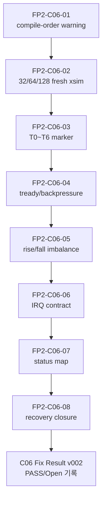

# C06 Control/Status Integration Code Fix Plan v002

| 항목 | 내용 |
|---|---|
| 문서 버전 | v002 |
| 생성 시간 | 2026-05-11 20:06:55 KST |
| 수정 시간 | 2026-05-11 20:06:55 KST |
| Cluster | C06 Control / Status Integration |
| 기준 문서 | `Doc/TDC-GPX-Datasheet.pdf` |
| 선행 계획 | `C06_Control_Status_Integration_260511192515_Code_Fix_Plan_v001.md` |
| 선행 결과 | `C06_Control_Status_Integration_260511195318_Code_Fix_Result_v001.md` |
| 목적 | v001 실행 결과와 오늘 분석에서 남은 항목을 추적 ID로 승계하고, 다음 보완/검증 순서를 고정한다. |

## 1. 결론

Fix Plan v001의 핵심 RTL 보완은 반영되었다. 그러나 오늘 분석 결과, C06를 다음 Cluster로 완전히 넘기기 전에 검증/운영 계약 closure가 더 필요하다.

v002의 성격은 **대규모 RTL 재설계 계획이 아니라, v001 결과의 잔여 항목을 닫는 verification/contract closure plan**이다.

## 2. 운영 규칙 확인

기존 운영 프로토콜에는 `Version lineage 기록 규칙`과 `Review 처리 사이클 규칙`이 이미 있었다. 다만 다음 패턴은 명시가 약했다.

```text
Fix Plan vN 실행
  -> Result vN 생성
  -> Fix Plan vN에 실행 결과 forward-trace 추가
  -> Result vN의 Open/Partial/New 항목을 Fix Plan vN+1로 승계
  -> Fix Plan vN+1 실행 후 같은 패턴 반복
```

이 규칙은 다음 문서에 반영한다.

| 문서 | 반영 내용 |
|---|---|
| `cluster_analysis_260511200655_operating_protocol_v012.md` | Fix Plan 실행/승계 사이클 규칙 추가 |
| `cluster_analysis_communication_plan_260511200655_v002.md` | Cluster별 Plan-Result-Rollover 소통 절차 추가 |

## 3. 오늘 분석 문서 업데이트 반영

Fix Plan v001 실행 결과는 오늘 생성/갱신된 C06 분석 문서에 다음과 같이 반영했다.

| 문서 | 반영 내용 |
|---|---|
| `C06_Control_Status_Integration_260511155627_Progress_Completeness_Check_v001.md` | v001 실행 후 C06 진행도와 남은 검증 항목을 v002로 승계 |
| `C06_Control_Status_Integration_260511161310_Analysis_v001.md` | 초기 finding F-C06-A01..A06의 현재 상태와 v002 추적 ID 기록 |
| `C06_Control_Status_Integration_260511163000_Code_Review_v001.md` | Code Review finding F-C06-CR-01..07의 Fixed/Verified/Partial/Open 상태 기록 |
| `C06_Control_Status_Integration_260511191005_Verify_Baseline_v001.md` | VB-C06-01..10 baseline 대비 Result v001 이후 closure 상태 기록 |
| `C06_Control_Status_Integration_260511192515_Code_Fix_Plan_v001.md` | v001 계획 항목별 실행 결과와 v002 승계 여부 기록 |
| `C06_Control_Status_Integration_260511195318_Code_Fix_Result_v001.md` | Result v001에서 Fix Plan v002로 넘어가는 FP2-C06-01..08 근거 기록 |

이 표는 `Fix Plan vN -> Result vN -> Fix Plan vN+1` 추적이 누락되지 않도록 v002의 기준 색인으로 사용한다.

## 4. Datasheet 기준

이번 v002도 Datasheet 우선 원칙을 유지한다.

| Datasheet 근거 | 위치 | v002 적용 |
|---|---|---|
| I-Mode는 1개 Start와 Stop channel hit를 기준으로 측정한다. | PDF page 25, section `2.3 I-Mode Basics` | T0~T6 marker는 I-Mode single start/stop/drain/output 흐름으로만 정의한다. |
| Single measurement sequence는 IrFlag 대기, EF 확인, IFIFO read, master reset 순서다. | PDF page 29, section `2.11.1 Single measurement` | GPX drain 완료와 final AXI output 완료를 분리해서 계측한다. |
| IFIFO read data는 `ChaCode`, `Start#`, `Slope`, `Hit` 구조다. | PDF page 27, section `2.4 Data structure` | payload 구조는 C02/C03/C04 계약을 유지하고, C06는 control/status/II만 확인한다. |
| FIFO empty read는 금지 조건이다. | PDF page 27, internal data processing 설명 | backpressure와 recovery 검증에서도 fault history가 status로 추적되는지 확인한다. |

## 5. v001 실행 결과 요약

| 항목 | v001 계획 | Result v001 상태 | v002 처리 |
|---|---|---|---|
| Phase A | `status_agg` register boundary | Fixed + Verified | Close |
| Phase B | `face_seq` output register boundary | Fixed + Verified | T0~T6 영향 계측만 승계 |
| Phase C | sticky soft_clear | Fixed + Verified | status map 상세 승계 |
| Phase D | `o_irq_pipe` reserved | Accepted Exception | `o_irq`는 별도 확인 |
| Phase E | 검증 계획 | Partial | v002의 본 작업 |
| 신규 발견 | compile-order warning | Open | v002 FP2-C06-01 |

## 6. v002 작업 항목

| ID | 우선순위 | 항목 | 목적 | 대상 | 완료 기준 |
|---|---:|---|---|---|---|
| FP2-C06-01 | P1 | `tdc_gpx_sync_fifo` compile-order warning 정리 | Vivado project syntax warning 제거 | project source list / scripts | `check_face_seq_syntax.tcl` warning 없음 또는 예외 근거 문서화 |
| FP2-C06-02 | P1 | 수정 후 32/64/128-bit fresh xsim | width compatibility 재확인 | `tb_tdc_gpx_top_int` snapshots | 32/64/128 모두 expected beats/tlast PASS |
| FP2-C06-03 | P1 | T0~T6 marker 계측 | start output +1 clock 영향 및 II 산출 | `tb_tdc_gpx_top_int` 또는 TCL probe | T0~T6 absolute time/cycle 표 생성 |
| FP2-C06-04 | P1 | `tready` stall/backpressure 검증 | C06 end-to-end II와 margin 확인 | `tb_tdc_gpx_full_int` `G_BP_TREADY_GAP` 또는 동등 TB | bounded stall 조건 PASS/FAIL 표 |
| FP2-C06-05 | P2 | rise/fall imbalance 검증 | `frame_done_both`, `face_closing`, fall-only abort 정책 확인 | `face_seq`/top focused TB | 의도 동작 PASS 또는 Accepted Exception |
| FP2-C06-06 | P2 | `o_irq` CSR IRQ source/read/clear 확인 | `o_irq_pipe`와 `o_irq` 계약 분리 | `tdc_gpx_csr_pipeline`, top IRQ TB/probe | `o_irq` source와 clear 조건 표 + 검증 |
| FP2-C06-07 | P2 | status source/clear map 작성 | SW debug 추적성 확보 | `t_tdc_status`, `csr_pipeline`, top assignments | field/source/clear/domain 표 완성 |
| FP2-C06-08 | P2 | reset/soft_reset/force_reinit top recovery | C06 top-level recovery 계약 확인 | top TB/probe 또는 C02 인계 예외 | deadlock 없음 PASS 또는 C02 인계 예외 승인 |

## 7. 실행 순서



## 8. Timing / Latency / Throughput / Pipeline / II 보완 계획

| 분석 항목 | v001 결과 | v002 보완 |
|---|---|---|
| Latency | `face_seq` output start +1 clock, status +1 clock으로 예측 | T0~T6 marker로 cycle/time 실측 |
| Throughput | 64-bit top integration PASS | 32/64/128 fresh xsim 및 stall 조건 반영 |
| Pipeline | start decision -> output FF -> downstream 구조 문서화 | T0~T6 diagram과 status map 연결 |
| II | 정상 조건 nominal 유지로 판단 | backpressure 포함 최소/최대 II 산출 |
| Timing diagram | Result v001에 block 수준 반영 | Verify/Result v002에 timing diagram 또는 timing block diagram 필수 |

## 9. v002 검증 Matrix

| 검증 ID | 연결 작업 | 시나리오 | PASS 기준 |
|---|---|---|---|
| V2-C06-01 | FP2-C06-01 | Vivado syntax/project check | compile-order warning 제거 또는 예외 승인 |
| V2-C06-02 | FP2-C06-02 | 32-bit top fresh xsim | expected beats/tlast PASS |
| V2-C06-03 | FP2-C06-02 | 64-bit top fresh xsim | expected beats/tlast PASS |
| V2-C06-04 | FP2-C06-02 | 128-bit top fresh xsim | expected beats/tlast PASS |
| V2-C06-05 | FP2-C06-03 | T0~T6 marker probe | T0~T6 누락 없이 cycle/time 기록 |
| V2-C06-06 | FP2-C06-04 | bounded `tready` stall | data 보존 또는 fault/status 정책 확인 |
| V2-C06-07 | FP2-C06-05 | rise/fall imbalance | `frame_done_both`/`face_closing` 의도 동작 확인 |
| V2-C06-08 | FP2-C06-06 | IRQ probe/readback | `o_irq`/`o_irq_pipe` 계약 분리 확인 |
| V2-C06-09 | FP2-C06-07 | status map review | field별 source/clear/domain 추적 가능 |
| V2-C06-10 | FP2-C06-08 | recovery probe | reset/soft_reset/force_reinit deadlock 없음 |

## 10. Result v002 작성 규칙

v002 실행 후에는 반드시 다음을 수행한다.

1. `C06_Control_Status_Integration_<timestamp>_Code_Fix_Result_v002.md/.pptx`를 생성한다.
2. 이 `Code_Fix_Plan_v002.md` 끝에 `v002 실행 결과 및 v003 승계 기록`을 추가한다.
3. Result v002에서 `Open`, `Partial`, `New`가 남으면 `Code_Fix_Plan_v003`을 만든다.
4. Result v002에서 모든 항목이 `Verified` 또는 `Accepted Exception`이면 `C06_Handoff`로 넘어간다.

## 11. Lineage

| 이전 문서 | v002 반영 위치 |
|---|---|
| `C06_Control_Status_Integration_260511192515_Code_Fix_Plan_v001.md` | section 4, 5 |
| `C06_Control_Status_Integration_260511195318_Code_Fix_Result_v001.md` | section 4, 5, 8 |
| `C06_Control_Status_Integration_260511163000_Code_Review_v001.md` | FP2-C06-04..08 |
| `C06_Control_Status_Integration_260511191005_Verify_Baseline_v001.md` | 32/64/128, polygon/backpressure, Open/Partial matrix 승계 |

## 12. 진행 판정

판정: v002 계획에 따라 진행 가능하다. 우선순위는 compile-order 정리, width fresh xsim, T0~T6 marker, `tready` stall 순서다.
