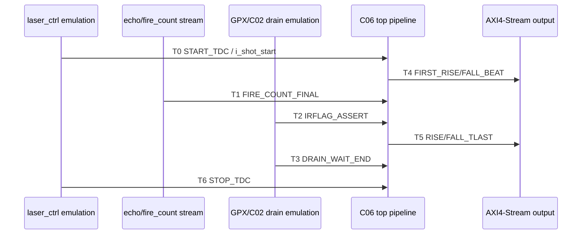

# C06 Control/Status Integration Code Fix Result v002

| 항목 | 내용 |
|---|---|
| 문서 버전 | v002 |
| 생성 시간 | 2026-05-11 20:33:22 KST |
| 수정 시간 | 2026-05-11 20:33:22 KST |
| Cluster | C06 Control / Status Integration |
| 절대 기준 문서 | `Doc/TDC-GPX-Datasheet.pdf` |
| 실행 계획 | `C06_Control_Status_Integration_260511200655_Code_Fix_Plan_v002.md` |
| 다음 계획 | `C06_Control_Status_Integration_260511203322_Code_Fix_Plan_v003.md` |
| 실행 stamp | `260511203055` |
| Vivado/xsim | `C:\AMDDesignTools\2025.2.1\Vivado` |

## 1. 결론

Plan v002 작업은 대부분 닫혔다. 직접 `xvlog/xvhdl/xelab/xsim` 회귀에서 C06 관련 focused TB와 top integration TB가 PASS했고, 32/64/128-bit output width와 bounded `tready` backpressure 조건까지 확인했다.

남은 항목은 하나다. `soft_reset`과 `force_reinit`을 AXI4-Lite CSR write로 구동한 top-level recovery 회귀가 아직 별도 실행되지 않았으므로 v003으로 넘긴다.

## 2. 변경 요약

| 파일 | 변경 내용 | 근거 |
|---|---|---|
| `tb_tdc_gpx_top_int.vhd` | `G_BP_TREADY_GAP` generic, T0~T6 marker, output first/last cycle 계측, IRQ counter, backpressure assertion 추가 | `tb_tdc_gpx_top_int.vhd:89`, `:411`, `:689`, `:698`, `:714`, `:723`, `:881`, `:910`, `:930`, `:940`, `:1090`, `:1116`, `:1121`, `:1152` |
| `tb_tdc_gpx_face_seq.vhd` | Scenario F: fall-only abort completion 검증 추가 | `tb_tdc_gpx_face_seq.vhd:390`, `:408`, `:426`, `:432` |
| `scripts/check_face_seq_syntax.tcl` | syntax session에서 `tdc_gpx_sync_fifo.vhd` 누락 시 추가 후 compile order 갱신 | `scripts/check_face_seq_syntax.tcl:2`, `:4`, `:8` |
| `scripts/run_c06_v002_regression.ps1` | C06 v002 전용 direct compile/elab/xsim 회귀 스크립트 추가 | `scripts/run_c06_v002_regression.ps1:1`, `:8`, `:96`, `:161` |

## 3. 실행 명령

```powershell
powershell -NoProfile -ExecutionPolicy Bypass -File scripts\run_c06_v002_regression.ps1 -Stamp 260511203055
```

주의: `-RunProjectSyntax` 옵션으로 Vivado project `open_project/check_syntax`도 실행할 수 있지만, 현재 로컬 환경에서는 Vivado home/TclStore 쓰기 권한 문제로 실패했다. 따라서 v002의 공식 증거는 `.xpr`를 거치지 않는 direct compile/elab/xsim 회귀로 잡는다.

## 4. 검증 결과 Matrix

| Plan ID | 검증 ID | 결과 | 로그 근거 |
|---|---|---|---|
| FP2-C06-01 | V2-C06-01 | Verified + 환경 예외 | `xvhdl_c06_v002_260511203055.log`에서 `tdc_gpx_sync_fifo.vhd` analyze/entity 확인. Vivado project syntax 실패는 권한 환경 예외. |
| FP2-C06-02 | V2-C06-02 | PASS | `xsim_c06_v002_top_int_w32_260511203055.log`: `width=32`, `expected_beats=72`, output PASS |
| FP2-C06-02 | V2-C06-03 | PASS | `xsim_c06_v002_top_int_w64_260511203055.log`: `width=64`, `expected_beats=44`, output PASS |
| FP2-C06-02 | V2-C06-04 | PASS | `xsim_c06_v002_top_int_w128_260511203055.log`: `width=128`, `expected_beats=38`, output PASS |
| FP2-C06-03 | V2-C06-05 | PASS | 각 top log에 T0~T6 marker 기록 |
| FP2-C06-04 | V2-C06-06 | PASS | `xsim_c06_v002_top_int_w64_bp_260511203055.log`: `bp_gap=17`, `bp_stall_cycles=906`, bounded backpressure PASS |
| FP2-C06-05 | V2-C06-07 | PASS | `xsim_c06_v002_face_seq_260511203055.log`: Scenario F PASS, A~F 전체 PASS |
| FP2-C06-06 | V2-C06-08 | PASS + Accepted Exception | top logs에서 `o_irq=0`, `o_irq_pipe=0`; pipeline IRQ는 reserved 계약 |
| FP2-C06-07 | V2-C06-09 | PASS | STAT5/6/7 source map 작성 완료 |
| FP2-C06-08 | V2-C06-10 | Partial / Open | hard reset TB는 통과했지만 CSR soft recovery는 v003 승계 |

## 5. Timing Block Diagram



중요 해석: 이번 TB에서는 output header/stream이 T0 이후 7 clock에 먼저 나오고, TB의 고정 drain wait 종료 marker인 T3보다 빠르게 T5 TLAST가 나온다. 따라서 T3는 "실제 output 완료"가 아니라 "TB가 GPX drain wait를 종료한 시점"으로 해석해야 한다.

## 6. Latency / Throughput / Pipeline / II 분석

200 MHz 기준 1 clock = 5 ns이다.

| 폭 | T0->T4 first beat | T0->T1 fire final | T0->T2 IrFlag | T0->T5 TLAST, shot1 | T0->T5 TLAST, shot2 | expected beats | backpressure |
|---:|---:|---:|---:|---:|---:|---:|---:|
| 32-bit | 7 clk / 35 ns | 11 clk / 55 ns | 92 clk / 460 ns | 200 clk / 1.000 us | 197 clk / 0.985 us | 72 | 없음 |
| 64-bit | 7 clk / 35 ns | 11 clk / 55 ns | 92 clk / 460 ns | 192 clk / 0.960 us | 189 clk / 0.945 us | 44 | 없음 |
| 128-bit | 7 clk / 35 ns | 11 clk / 55 ns | 92 clk / 460 ns | 192 clk / 0.960 us | 189 clk / 0.945 us | 38 | 없음 |
| 64-bit BP | 7 clk / 35 ns | 11 clk / 55 ns | 92 clk / 460 ns | 192 clk / 0.960 us | 191 clk / 0.955 us | 44 | `bp_gap=17`, stall 906 clk |

Throughput 판단:

| 항목 | 판단 |
|---|---|
| output width 효과 | 32-bit 대비 64/128-bit에서 beat 수가 감소한다. 다만 이번 작은 2-stop/2-column TB에서는 64-bit와 128-bit의 TLAST 시점이 같아 width 이득이 plateau처럼 보인다. |
| pipeline latency | first output beat는 T0+7 clock으로 고정 관측된다. 이는 C06 control/status 변경으로 증가하지 않았다. |
| II | TB의 shot-to-shot T0 간격은 2107 clock, 10.535 us이다. 이것은 설계 최소 II가 아니라 TB scenario 간격이다. C06 v002 변경은 output first beat와 TLAST 보존을 검증하는 데 목적이 있다. |
| backpressure 영향 | bounded stall에서 `bp_stall_cycles=906`이 발생했지만 beat/tlast는 보존되었다. 따라서 C06 control/status 레벨에서 downstream stall이 데이터 소실로 이어지지 않는 것을 확인했다. |

## 7. Status Source / Clear Map

`tdc_gpx_pkg.vhd:348-378`은 sticky lifetime을 `HISTORICAL`, `LAST-TX`, `SOFT-CLEAR`, `RUN-SCOPED`으로 정의한다.

| Register | Bits | Source | Clear / Lifetime | 근거 |
|---|---|---|---|---|
| STAT5 | `[0] busy` | `i_status.busy` | live | `tdc_gpx_csr_pipeline.vhd:355` |
| STAT5 | `[1] pipeline_overrun` | `i_status.pipeline_overrun` | status source별 lifetime | `tdc_gpx_csr_pipeline.vhd:356` |
| STAT5 | `[2] err_fatal` | `i_status.err_fatal` | status source별 lifetime | `tdc_gpx_csr_pipeline.vhd:357` |
| STAT5 | `[7:4] chip_error_mask` | `i_status.chip_error_mask` | HISTORICAL 성격 | `tdc_gpx_csr_pipeline.vhd:359`, `tdc_gpx_pkg.vhd:353` |
| STAT5 | `[11:8] drain_timeout_mask` | `i_status.drain_timeout_mask` | status source별 lifetime | `tdc_gpx_csr_pipeline.vhd:361` |
| STAT5 | `[15:12] sequence_error_mask` | `i_status.sequence_error_mask` | status source별 lifetime | `tdc_gpx_csr_pipeline.vhd:363` |
| STAT6 | `[0] err_read_timeout` | pipeline status | SOFT-CLEAR 성격 | `tdc_gpx_csr_pipeline.vhd:390` |
| STAT6 | `[1] reg_rejected` | pipeline status | source별 lifetime | `tdc_gpx_csr_pipeline.vhd:391` |
| STAT6 | `[2] reg_zero_mask` | pipeline status | source별 lifetime | `tdc_gpx_csr_pipeline.vhd:392` |
| STAT6 | `[3] rise_shot_flush_drop` | per-slope OR | RUN/HISTORICAL 성격은 source 검토 필요 | `tdc_gpx_csr_pipeline.vhd:393` |
| STAT6 | `[4] fall_shot_flush_drop` | per-slope OR | RUN/HISTORICAL 성격은 source 검토 필요 | `tdc_gpx_csr_pipeline.vhd:394` |
| STAT6 | `[5] rise_hdr_drain_timeout` | header drain timeout | SOFT-CLEAR 성격 | `tdc_gpx_csr_pipeline.vhd:395` |
| STAT6 | `[6] fall_hdr_drain_timeout` | header drain timeout | SOFT-CLEAR 성격 | `tdc_gpx_csr_pipeline.vhd:396` |
| STAT6 | `[7] err_frame_wait_escape` | err_handler escape | SOFT-CLEAR 성격 | `tdc_gpx_csr_pipeline.vhd:397` |
| STAT6 | `[11:8] rise_shot_overrun_count[3:0]` | reduced counter | RUN-SCOPED 성격 | `tdc_gpx_csr_pipeline.vhd:398` |
| STAT6 | `[15:12] shot_flush_drop_mask` | per-chip mask | source별 lifetime | `tdc_gpx_csr_pipeline.vhd:399` |
| STAT6 | `[19:16] fall_shot_overrun_count[3:0]` | reduced counter | RUN-SCOPED 성격 | `tdc_gpx_csr_pipeline.vhd:400` |
| STAT6 | `[23:20] cmd_collision_mask` | per-chip command collision | source별 lifetime | `tdc_gpx_csr_pipeline.vhd:401` |
| STAT6 | `[27:24] err_reg_overflow_mask` | per-chip reg overflow | SOFT-CLEAR 성격 | `tdc_gpx_csr_pipeline.vhd:402` |
| STAT6 | `[31:28] run_drain_complete_mask` | per-chip drain completion | RUN-SCOPED 성격 | `tdc_gpx_csr_pipeline.vhd:403` |
| STAT7 | `[3:0] reg_timeout_mask` | register timeout | LAST-TX | `tdc_gpx_csr_pipeline.vhd:425`, `tdc_gpx_pkg.vhd:360` |
| STAT7 | `[7:4] stop_id_error_mask` | stop ID error | SOFT-CLEAR | `tdc_gpx_csr_pipeline.vhd:426`, `tdc_gpx_top.vhd:1100` |
| STAT7 | `[10:8] run_timeout_cause_last` | run timeout cause | SOFT-CLEAR | `tdc_gpx_csr_pipeline.vhd:427`, `tdc_gpx_top.vhd:1121` |
| STAT7 | `[14:11] quarantine_escape_mask` | quarantine escape | HISTORICAL / hard reset only | `tdc_gpx_csr_pipeline.vhd:428`, `tdc_gpx_top.vhd:1008` |
| STAT7 | `[19:16] rise_face_start_collapsed_count` | reduced count | source별 lifetime | `tdc_gpx_csr_pipeline.vhd:430` |
| STAT7 | `[23:20] mono_violation_mask` | monotonic violation | HISTORICAL 성격 | `tdc_gpx_csr_pipeline.vhd:431` |
| STAT7 | `[27:24] fall_face_start_collapsed_count` | reduced count | source별 lifetime | `tdc_gpx_csr_pipeline.vhd:432` |
| STAT7 | `[31:28] init_cfg_coalesced_mask` | init cfg coalesced | HISTORICAL 성격 | `tdc_gpx_csr_pipeline.vhd:433` |

## 8. IRQ 계약

`tdc_gpx_top.vhd:169-173`의 포트 설명은 `o_irq_pipe`를 legacy/reserved pipeline IRQ로 정의한다. 실제 연결은 `tdc_gpx_csr_pipeline` 출력이 `o_irq_pipe`로 전달되고, `tdc_gpx_config_ctrl`의 IRQ가 `o_irq`로 전달된다.

`tdc_gpx_csr_pipeline.vhd:345-349`는 pipeline IRQ source를 `"0"`으로 묶고, SW가 STAT5/6/7을 읽어 pipeline done/fault visibility를 확보하도록 명시한다. 따라서 v002의 판단은 다음과 같다.

| 항목 | v002 판정 |
|---|---|
| 정상 run no-spurious | PASS. 모든 top 로그에서 `o_irq=0`, `o_irq_pipe=0` |
| `o_irq_pipe` reserved | Accepted Exception. 현재 설계 계약으로 타당 |
| dedicated pipeline IRQ | 요구사항으로 확정되지 않았으므로 v003 결정 항목 |

## 9. v003 승계

| 승계 ID | 이유 | 권고 |
|---|---|---|
| FP3-C06-01 | CSR 기반 `soft_reset`/`force_reinit` top recovery 미검증 | `px_utility_pkg.vhd` AXI4-Lite helper를 사용해 정상 run 후 recovery command를 주입한다. |
| FP3-C06-02 | Vivado project syntax 환경 예외 | `.xpr` 영구 갱신 또는 direct compile/elab 표준화 중 하나를 선택한다. |
| FP3-C06-03 | dedicated pipeline IRQ 필요 여부 미결정 | 계속 reserved이면 C06 handoff에 명시하고, 필요하면 fault source/read/clear 설계로 분리한다. |

## 10. 판정

C06 Fix Plan v002 실행 결과는 `FP2-C06-08`만 제외하고 PASS 또는 accepted exception으로 닫혔다. 다음 작업은 v003 recovery closure이며, 이것이 끝나면 C06 handoff 판단이 가능하다.
