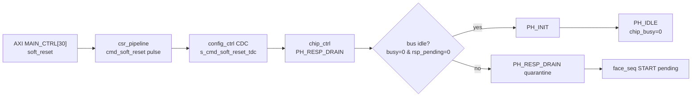

# C06 Control/Status Integration Code Fix Plan v004

| 항목 | 내용 |
|---|---|
| 문서 버전 | v004 |
| 생성 시간 | 2026-05-11 21:12:01 KST |
| 수정 시간 | 2026-05-11 21:12:01 KST |
| Cluster | C06 Control / Status Integration |
| 절대 기준 문서 | `Doc/TDC-GPX-Datasheet.pdf` |
| 선행 결과 | `C06_Control_Status_Integration_260511211201_Code_Fix_Result_v003.md` |
| 목적 | `soft_reset` recovery open 항목을 RTL/운용 계약 중 어느 방향으로 닫을지 결정하고, 선택한 방향을 구현/검증한다. |

## 1. v003 판단 요약

`force_reinit`은 `normal run -> recovery -> normal run`에서 PASS했다. 반면 `soft_reset`은 12,000 clk 추가 대기 후에도 `face_seq`가 START를 수락하지 못하고 `pipeline busy` pending 상태가 유지됐다.

핵심은 `soft_reset` 실패가 output width, tuser, VDMA, IRQ 문제가 아니라 chip side busy/re-init boundary 문제라는 점이다.

## 2. 수정 목표

| ID | 목표 | 우선순위 | 완료 기준 |
|---|---|---:|---|
| FP4-C06-01 | `soft_reset` 후 `chip_busy` 원인 분해 | P1 | focused TB 또는 top probe에서 `PH_RESP_DRAIN`, bus busy, rsp pending 원인을 분리 |
| FP4-C06-02 | `soft_reset` recovery 정책 결정 | P1 | `soft_reset` PASS 보장 또는 recovery 제외 계약 중 하나로 문서/RTL 일치 |
| FP4-C06-03 | 선택 정책 구현 | P1 | RTL 또는 TB/문서 계약 반영 |
| FP4-C06-04 | 회귀 검증 | P1 | `scripts/run_c06_v003_recovery.ps1 -RequireSoftPass` 또는 대체 v004 script PASS |
| FP4-C06-05 | C06 handoff 갱신 | P2 | C07로 넘길 control/status 계약에 recovery 절차 반영 |

## 3. 분석 대상 경로

검토 기준:

| 신호/상태 | 확인할 질문 |
|---|---|
| `i_bus_busy` | soft reset 시점에 bus_phy가 어떤 transaction을 잡고 있는가 |
| `i_bus_rsp_pending` | skid/bus response가 drain될 수 없는 상태인가 |
| `s_drain_to_init_r` | soft reset 후 PH_INIT 전환 의도가 유지되는가 |
| `s_err_drain_cap_r`, `s_err_bus_fatal_r` | quarantine/fatal로 진입했는가 |
| `s_chip_busy` | AXIS domain에서 START gate를 막는 기간과 원인이 무엇인가 |

## 4. 구현 후보

| 후보 | 설명 | 장점 | 위험 |
|---|---|---|---|
| A. soft_reset을 force_reinit과 동일 회복 명령으로 승격 | SW soft_reset 시 PH_RESP_DRAIN을 우회하거나 제한 시간 후 PH_INIT 강제 | SW 사용성 단순, v003 PASS 기준에 가까움 | stale response phase pollution 위험 |
| B. soft_reset은 drain-safe reset, force_reinit만 recovery로 규정 | 현재 구조를 유지하고 soft_reset을 run-to-run recovery PASS 기준에서 제외 | 현재 설계 의도와 `force_reinit` 주석에 부합 | SW 계약이 복잡해짐 |
| C. bus_phy/response path에 soft flush 추가 | soft_reset 시 bus_phy pending/response를 안전하게 clear할 구조 추가 | soft_reset recovery를 안전하게 보장 가능 | RTL 영향 범위 큼, C01/C02 계약 재검토 필요 |

권고: 먼저 focused TB로 `i_bus_busy`/`i_bus_rsp_pending` 원인을 확인한 뒤, A 또는 B를 결정한다. 바로 A로 단순화하면 phase pollution 위험을 확인하지 못한다.

## 5. 검증 계획

| 검증 ID | 시나리오 | PASS 기준 |
|---|---|---|
| V4-C06-01 | normal run -> force_reinit -> normal run | v003과 동일 PASS 유지 |
| V4-C06-02 | normal run -> soft_reset -> status/readiness probe | 선택 정책에 맞는 PASS/expected-open 판정 |
| V4-C06-03 | `-RequireSoftPass` 모드 | soft_reset을 회복 명령으로 보장하기로 결정한 경우만 PASS 필수 |
| V4-C06-04 | no-spurious IRQ | `o_irq=0`, `o_irq_pipe=0` 유지 또는 새 IRQ 정책 명시 |
| V4-C06-05 | STAT5/6/7 | recovery/open 상태가 SW가 추적 가능한 상태 bit로 드러나는지 확인 |

## 6. Timing / Latency / Throughput / Pipeline / II 예측

| 항목 | v004에서 볼 것 |
|---|---|
| Latency | soft_reset command부터 START accept 가능 상태까지의 cycle을 별도 계측 |
| Throughput | recovery command는 run 내부 throughput이 아니라 run 간 gap에만 영향 |
| Pipeline | `PH_RESP_DRAIN`이 정상 drain인지 quarantine인지 분기 표시 |
| II | shot-to-shot II가 아니라 recovery-run-to-run II로 별도 정의 |
| Timing diagram | T8 recovery command, T9 readiness, T0 next shot 순서로 표시 |

## 7. C06 완료 판단 조건

C06을 handoff 가능으로 닫으려면 다음 중 하나가 필요하다.

| 선택 | 완료 조건 |
|---|---|
| soft_reset recovery 보장 | `-RequireSoftPass` 회귀 PASS, 문서/PPT에 timing diagram 반영 |
| force_reinit 전용 recovery | soft_reset 제외 계약을 handoff에 명확히 기록하고, SW 절차를 `force_reinit + STAT polling`으로 고정 |

