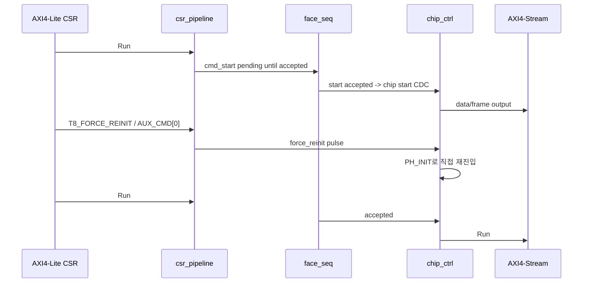
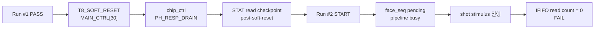

# C06 Control/Status Integration Code Fix Result v003

| 항목 | 내용 |
|---|---|
| 문서 버전 | v003 |
| 생성 시간 | 2026-05-11 21:12:01 KST |
| 수정 시간 | 2026-05-11 21:12:01 KST |
| Cluster | C06 Control / Status Integration |
| 절대 기준 문서 | `Doc/TDC-GPX-Datasheet.pdf` |
| 선행 계획 | `Doc/cluster_analysis/C06_Control_Status_Integration/C06_Control_Status_Integration_260511203322_Code_Fix_Plan_v003.md` |
| 선행 결과 | `Doc/cluster_analysis/C06_Control_Status_Integration/C06_Control_Status_Integration_260511203322_Code_Fix_Result_v002.md` |
| 실행 stamp | `260511212000` |
| Vivado/xsim | `C:\AMDDesignTools\2025.2.1\Vivado` |

## 1. 결론

v003에서는 C06의 top-level recovery 계약을 AXI4-Lite CSR 기반으로 검증했다.

결론은 두 갈래다.

| 항목 | 판단 | 근거 |
|---|---|---|
| `force_reinit` recovery | PASS | `normal run -> force_reinit -> normal run`에서 2회 run 모두 output beat/tlast/status PASS |
| `soft_reset` recovery | Open | `soft_reset` 이후 CSR status read는 진행되지만, 다음 START가 `face_seq`에서 `pipeline busy`로 pending되고, shot drain read count가 0으로 실패 |
| project syntax policy | Accepted environment exception | 현재 공식 회귀는 direct `xvhdl/xelab/xsim` 경로로 관리 |
| `o_irq_pipe` policy | Accepted exception | C06에서는 reserved/tie-off 유지, pipeline fault는 STAT5/6/7 polling으로 추적 |

따라서 C06은 `force_reinit` 기반 recovery 계약까지는 닫혔지만, `soft_reset`을 run-to-run recovery로 사용할 수 있는지는 닫히지 않았다. 다음 v004는 `soft_reset -> PH_RESP_DRAIN -> chip_busy 해제 -> START accept` 경로를 RTL로 닫을지, 아니면 `soft_reset`을 “stale drain 포함 안전 reset 요청”으로 제한하고 운용 recovery는 `force_reinit`으로만 규정할지 결정해야 한다.

## 2. 변경 내용

| 파일 | 변경 내용 | 추적 근거 |
|---|---|---|
| `tb_tdc_gpx_top_int.vhd` | `G_RECOVERY_MODE` generic 추가. mode 1=`soft_reset`, mode 2=`force_reinit` recovery probe 추가 | `tb_tdc_gpx_top_int.vhd:92`, `:198`, `:207` |
| `tb_tdc_gpx_top_int.vhd` | Pipeline CSR read helper 추가. STAT5/6/7 read checkpoint 추가 | `tb_tdc_gpx_top_int.vhd:871` |
| `tb_tdc_gpx_top_int.vhd` | `AUX_CMD[0] force_reinit` write 시나리오 추가 | `tb_tdc_gpx_top_int.vhd:380`, `:1130` |
| `tb_tdc_gpx_top_int.vhd` | soft-reset recovery run에서는 START pending window를 관찰하기 위해 12,000 clk 대기 후 shot stimulus 진행 | `tb_tdc_gpx_top_int.vhd:1061` |
| `scripts/run_c06_v003_recovery.ps1` | v002 baseline + force PASS + soft open probe를 한 번에 수행 | `scripts/run_c06_v003_recovery.ps1:39`, `:99`, `:106` |

## 3. 실행 명령

```powershell
powershell -NoProfile -ExecutionPolicy Bypass -File scripts\run_c06_v003_recovery.ps1 -Stamp 260511212000
```

스크립트 정책:

| 항목 | 기본 동작 |
|---|---|
| v002 baseline | 기존 C06 v002 회귀를 먼저 수행 |
| `force_reinit` | PASS marker가 없거나 failure/error가 있으면 실패 |
| `soft_reset` | 기본 모드에서는 known-open probe로 수집. `-RequireSoftPass`를 주면 반드시 PASS를 요구 |

## 4. 검증 Matrix

| ID | 시나리오 | 결과 | 로그 근거 |
|---|---|---|---|
| V3-C06-01 | v002 baseline regression | PASS | `scripts/run_c06_v003_recovery.ps1`가 v002 regression을 선행 실행 |
| V3-C06-02 | `normal run -> force_reinit -> normal run` | PASS | `xsim_c06_v003_top_int_force_260511212000.log` |
| V3-C06-03 | `force_reinit` 후 STAT5/6/7 readback | PASS | `T7_STATUS_READ tag=post-force-reinit`, cycle 11570 |
| V3-C06-04 | `force_reinit` 후 output beat/tlast 보존 | PASS | `recovery mode force_reinit PASS`, `output streams emitted... PASS` |
| V3-C06-05 | `normal run -> soft_reset -> normal run` | Open | `face_seq: cmd_start pending-latched (pipeline busy)` 반복 후 IFIFO read count 0 |
| V3-C06-06 | `o_irq_pipe` reserved | PASS/Accepted | force recovery summary에서 IRQ count 0 유지 |

## 5. Recovery Timing Diagram



`soft_reset` 경로는 아래 지점에서 열려 있다.



## 6. Latency / Throughput / Pipeline / II

200 MHz 기준 1 clk = 5 ns다.

### 6.1 `force_reinit` PASS 경로

| 구간 | run1 shot1 | run1 shot2 | run2 shot1 | run2 shot2 | 해석 |
|---|---:|---:|---:|---:|---|
| T0 -> T1 fire final | 11 clk / 55 ns | 11 clk / 55 ns | 11 clk / 55 ns | 11 clk / 55 ns | echo/fire_count final 전달 지연은 recovery 전후 동일 |
| T0 -> T2 IrFlag | 92 clk / 460 ns | 92 clk / 460 ns | 92 clk / 460 ns | 92 clk / 460 ns | I-Mode single TB의 MTimer emulation 위치 유지 |
| T0 -> T5 rise TLAST | 192 clk / 960 ns | 189 clk / 945 ns | 190 clk / 950 ns | 189 clk / 945 ns | force recovery 후 output drain latency 유지 |
| Shot-to-shot T0 간격 | 2107 clk / 10.535 us | - | 2107 clk / 10.535 us | - | TB scenario interval이며 설계 최소 II는 아님 |

Throughput 관점에서는 `force_reinit`이 run 내부 throughput을 악화시키지 않았다. output summary는 64-bit, `expected_beats_per_run=44`, `recovery_runs=2`, `expected_beats_total=88`로 닫혔다.

### 6.2 `soft_reset` Open 경로

| 지점 | cycle/time | 판단 |
|---|---:|---|
| Run #1 완료 후 status read | cycle 8671 / 43.4825 us | 정상 read checkpoint |
| `soft_reset` 주입 | cycle 8692 / 43.5875 us | `MAIN_CTRL[30]` pulse |
| post-soft-reset status read | cycle 11570 / 57.9775 us | CSR read는 진행됨 |
| Run #2 START pulse | 58.0825 us | CSR start pending 시작 |
| 추가 대기 후 shot stimulus | cycle 23605 / 118.1525 us | 12,000 clk 대기 후에도 start 수락 없음 |
| 실패 | cycle 24697 / 123.6125 us | IFIFO read count 0, `pipeline busy` pending 반복 |

Pipeline/II 관점에서 `soft_reset`은 단순한 latency 증가가 아니라 `START accept` 경계가 닫히지 않는 상태다. 따라서 v004에서는 `soft_reset`을 latency budget으로만 처리하면 안 되고, `chip_busy`를 만드는 `chip_ctrl` phase와 bus response drain 조건을 구조적으로 닫아야 한다.

## 7. Datasheet 기준 판단

| Datasheet 기준 | v003 판단 |
|---|---|
| I-Mode single measurement 중심 운용 | 모든 top recovery probe는 I-Mode single run으로만 구성했다. |
| 측정 완료 후 다음 측정 전 상태 재정렬 필요 | `force_reinit`은 다음 single run을 정상 재개했다. `soft_reset`은 다음 run의 START accept가 닫히지 않았다. |
| IFIFO empty read 금지 | soft-reset open 경로에서 실제 GPX read count가 0이므로, 다음 단계에서 무리하게 운용하면 empty/read 계약 위반으로 확장될 수 있다. |

## 8. v004로 넘기는 Open 항목

| ID | 내용 | 우선순위 | 제안 |
|---|---|---:|---|
| FP4-C06-01 | `soft_reset` 후 `chip_busy`가 내려오지 않는 원인 분석 | P1 | `chip_ctrl` `PH_RESP_DRAIN`, `i_bus_busy`, `i_bus_rsp_pending`, `s_drain_to_init_r` 경로를 focused TB로 분리 |
| FP4-C06-02 | `soft_reset` 운용 계약 결정 | P1 | 회복 명령으로 보장할지, `force_reinit` 전용 recovery로 제한할지 결정 |
| FP4-C06-03 | `force_reinit` 사용 조건 문서화 | P2 | stale response phase pollution 위험과 SW polling 절차를 C06 handoff에 명시 |
| FP4-C06-04 | status observability gap 점검 | P2 | post-soft-reset STAT read와 실제 `face_seq` start readiness의 차이를 상태 bit로 드러낼지 검토 |

## 9. Lineage

| 이전 항목 | 이번 반영 |
|---|---|
| Plan v003 `FP3-C06-01` | `force_reinit` PASS, `soft_reset` Open으로 분리 |
| Plan v003 `FP3-C06-02` | direct compile/elab/xsim 공식 회귀 유지 |
| Plan v003 `FP3-C06-03` | `o_irq_pipe` reserved 유지, STAT polling 계약 유지 |
| Result v002 `FP2-C06-08 Partial/Open` | v003에서 recovery probe 수행, v004로 soft-reset RTL 보완 인계 |

