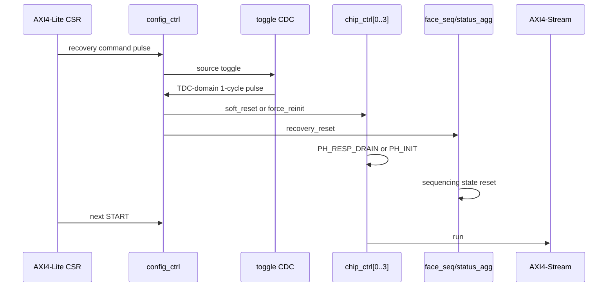
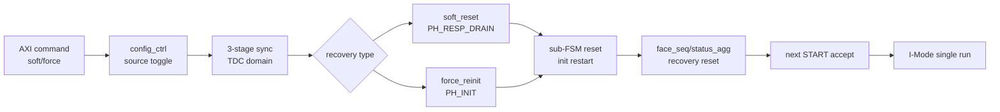

# C06 Control/Status Integration Code Fix Result v004

| 항목 | 내용 |
|---|---|
| 문서 버전 | v004 |
| 생성 시간 | 2026-05-14 11:50:00 KST |
| 수정 시간 | 2026-05-14 11:50:00 KST |
| Cluster | C06 Control / Status Integration |
| 절대 기준 문서 | `Doc/TDC-GPX-Datasheet.pdf` |
| 선행 계획 | `Doc/cluster_analysis/C06_Control_Status_Integration/C06_Control_Status_Integration_260511211201_Code_Fix_Plan_v004.md` |
| 선행 결과 | `Doc/cluster_analysis/C06_Control_Status_Integration/C06_Control_Status_Integration_260511211201_Code_Fix_Result_v003.md` |
| 실행 stamp | `260514115000` |
| Vivado/xsim | `C:\AMDDesignTools\2025.2.1\Vivado` |

## 1. 결론

C06 v004에서는 v003에서 열린 항목이던 `soft_reset` recovery를 닫았다. 최종 판단은 아래와 같다.

| 항목 | v003 판단 | v004 판단 | 근거 |
|---|---|---|---|
| `force_reinit` recovery | PASS로 보였으나 실제 TDC 도메인 도달 여부가 불명확 | PASS | `xsim_c06_v004_top_int_force_260514115000.log:142`, `:146`, `:148`, `:236` |
| `soft_reset` recovery | OPEN | PASS | `xsim_c06_v004_top_int_soft_260514115000.log:142`, `:146`, `:148`, `:156`, `:244` |
| 출력 stream 보존 | 일부 경로만 확인 | PASS | force: `:231`~`:234`, soft: `:239`~`:242` |
| baseline regression | PASS 필요 | PASS | `xsim_c06_v002_face_seq_260514115000.log:54`, `xsim_c06_v002_status_agg_260514115000.log:34`, width 32/64/128 및 backpressure log |

v004의 핵심은 recovery command가 실제로 `i_tdc_clk` 도메인에 도달하도록 CDC를 toggle 방식으로 고정하고, `force_reinit`도 chip sub-FSM 및 AXIS-domain sequencing state의 recovery boundary로 처리한 것이다. 그 결과 `normal run -> recovery command -> normal run`이 `force_reinit`과 `soft_reset` 모두에서 PASS했다.

## 2. 원인 판단

v003 로그 재검토 기준으로 원인은 두 단계였다.

| 원인 ID | 내용 | 판단 근거 |
|---|---|---|
| RC-C06-01 | AXIS 도메인에서 발생한 1-cycle `soft_reset`/`force_reinit` pulse가 `xpm_cdc_pulse` 경로에서 TDC 도메인 pulse로 관측되지 않았다. | v003 중간 로그에서 source pulse만 보이고 `tdc pulse` 및 `chip_ctrl` report가 없었다. v004에서는 `source pulse -> tdc pulse`가 같은 로그에 같이 남는다. |
| RC-C06-02 | v003의 `force_reinit PASS`는 recovery command가 실제로 chip_ctrl까지 도달하지 않은 상태에서 통과한 false positive 가능성이 있었다. | v004에서 command가 실제 도달하자 `chip_ctrl[*]: force_reinit to PH_INIT`가 명확히 발생한다. |
| RC-C06-03 | `force_reinit`이 chip_ctrl coordinator만 `PH_INIT`으로 보내고 sub-FSM 및 face sequencer state를 완전한 recovery boundary로 닫지 못했다. | `tdc_gpx_chip_ctrl.vhd`에서 sub reset에 `i_cmd_force_reinit` 포함, `tdc_gpx_top.vhd`에서 `s_cmd_recovery_reset`을 face/status 쪽에도 배선했다. |

Datasheet 관점에서 이번 수정은 GPX IC bus read timing이나 I-Mode single measurement timing을 변경하지 않는다. C06는 control/status integration cluster이므로, Datasheet의 외부 GPX read/write timing은 C01/C02의 상위 계약으로 유지하고, 여기서는 recovery command가 다음 I-Mode single 운용을 깨끗한 제어 상태에서 시작하게 하는 내부 control boundary만 보완했다.

## 3. 코드 변경 내용

| 파일 | 변경 내용 | 추적 위치 |
|---|---|---|
| `tdc_gpx_config_ctrl.vhd` | `soft_reset`/`force_reinit` CDC를 one-shot pulse CDC에서 toggle bridge로 변경. source toggle을 TDC 도메인 3-stage register로 동기화하고 XOR edge로 1-cycle pulse를 생성한다. | `tdc_gpx_config_ctrl.vhd:472`, `:1172`, `:1189`, `:1205`, `:1208` |
| `tdc_gpx_config_ctrl.vhd` | recovery source/destination pulse를 simulation-only report로 남겨 검증 로그에서 추적 가능하게 했다. | `tdc_gpx_config_ctrl.vhd:1216`, `:1232` |
| `tdc_gpx_chip_ctrl.vhd` | `force_reinit`을 sub-FSM reset boundary에 포함했다. | `tdc_gpx_chip_ctrl.vhd:490` |
| `tdc_gpx_chip_ctrl.vhd` | `force_reinit` 시 같은 cycle에 init start를 걸지 않고, sub-FSM reset 후 다음 cycle에 init을 시작하도록 pending register를 추가했다. | `tdc_gpx_chip_ctrl.vhd:484`, `:998`, `:1049` |
| `tdc_gpx_chip_ctrl.vhd` | `soft_reset -> PH_RESP_DRAIN -> PH_INIT` 및 `force_reinit -> PH_INIT` 전이를 simulation-only report로 추적한다. | `tdc_gpx_chip_ctrl.vhd:1010`, `:1035` |
| `tdc_gpx_top.vhd` | `s_cmd_recovery_reset <= s_cmd_soft_reset or s_cmd_force_reinit`을 추가하고 face sequencer/status aggregator reset 입력에 연결했다. | `tdc_gpx_top.vhd:195`, `:416`, `:873`, `:932` |
| `scripts/run_c06_v004_recovery.ps1` | v002 baseline + v004 force recovery + v004 soft recovery를 모두 PASS 필수 조건으로 실행한다. baseline 호출 stamp 전달도 명시형으로 고정했다. | `scripts/run_c06_v004_recovery.ps1` |

## 4. 검증 명령

```powershell
powershell -NoProfile -ExecutionPolicy Bypass -File scripts\run_c06_v004_recovery.ps1 -Stamp 260514115000
```

검증 스크립트 구성:

| 단계 | 대상 | PASS 기준 |
|---|---|---|
| baseline | `run_c06_v002_regression.ps1 -Stamp 260514115000` | face_seq, status_agg, top width 32/64/128, top width 64 backpressure 모두 PASS |
| force recovery | `G_RECOVERY_MODE=2`, `G_TDATA_WIDTH=64` | recovery PASS, output stream PASS, recovery CDC evidence 존재 |
| soft recovery | `G_RECOVERY_MODE=1`, `G_TDATA_WIDTH=64` | recovery PASS, output stream PASS, recovery CDC evidence 존재 |

## 5. 검증 Matrix

| ID | 시나리오 | 결과 | 로그 근거 |
|---|---|---|---|
| V4-C06-01 | face sequencer baseline | PASS | `xsim_c06_v002_face_seq_260514115000.log:54` |
| V4-C06-02 | status aggregator baseline | PASS | `xsim_c06_v002_status_agg_260514115000.log:34` |
| V4-C06-03 | top integration width 32 | PASS | `xsim_c06_v002_top_int_w32_260514115000.log:143` |
| V4-C06-04 | top integration width 64 | PASS | `xsim_c06_v002_top_int_w64_260514115000.log:143` |
| V4-C06-05 | top integration width 128 | PASS | `xsim_c06_v002_top_int_w128_260514115000.log:143` |
| V4-C06-06 | width 64 bounded backpressure | PASS | `xsim_c06_v002_top_int_w64_bp_260514115000.log:143`, `:145` |
| V4-C06-07 | `force_reinit` source pulse | PASS | `xsim_c06_v004_top_int_force_260514115000.log:142` |
| V4-C06-08 | `force_reinit` TDC pulse 및 chip_ctrl 진입 | PASS | `xsim_c06_v004_top_int_force_260514115000.log:146`, `:148` |
| V4-C06-09 | `force_reinit` 후 output 보존 | PASS | `xsim_c06_v004_top_int_force_260514115000.log:231`~`:236` |
| V4-C06-10 | `soft_reset` source pulse | PASS | `xsim_c06_v004_top_int_soft_260514115000.log:142` |
| V4-C06-11 | `soft_reset` TDC pulse 및 PH_RESP_DRAIN 진입 | PASS | `xsim_c06_v004_top_int_soft_260514115000.log:146`, `:148` |
| V4-C06-12 | `soft_reset` 후 PH_INIT 재진입 | PASS | `xsim_c06_v004_top_int_soft_260514115000.log:156` |
| V4-C06-13 | `soft_reset` 후 output 보존 | PASS | `xsim_c06_v004_top_int_soft_260514115000.log:239`~`:244` |

## 6. Recovery Timing Diagram



동일 200 MHz clock TB에서 관측된 recovery command 전달 시간:

| 구간 | force_reinit | soft_reset | 해석 |
|---|---:|---:|---|
| `T8` marker | 43.5875 us | 43.5875 us | TB가 recovery command write를 시작한 시점 |
| source pulse | 43.6575 us | 43.6575 us | AXI 도메인 command pulse가 실제 발생 |
| TDC pulse | 43.6775 us | 43.6775 us | toggle CDC 출력. source pulse 대비 20 ns, 4 clk 관측 |
| chip_ctrl action | 43.6775 us | 43.6775 us | TDC pulse와 같은 edge에서 chip_ctrl가 recovery 전이 수신 |
| soft PH_INIT exit | - | 43.6975 us | `PH_RESP_DRAIN cnt=3` 후 PH_INIT 전이. TDC pulse 대비 20 ns |

## 7. Latency / Throughput / Pipeline / II

### 7.1 정상 shot pipeline

200 MHz 기준 1 clk = 5 ns이다.

| 측정 구간 | run1 shot1 | run1 shot2 | force run2 shot1 | force run2 shot2 | soft run2 shot1 | soft run2 shot2 | 판단 |
|---|---:|---:|---:|---:|---:|---:|---|
| T0 -> T1 fire_count final | 11 clk / 55 ns | 11 clk / 55 ns | 11 clk / 55 ns | 11 clk / 55 ns | 11 clk / 55 ns | 11 clk / 55 ns | recovery 후에도 동일 |
| T0 -> T2 IrFlag assert | 92 clk / 460 ns | 92 clk / 460 ns | 92 clk / 460 ns | 92 clk / 460 ns | 92 clk / 460 ns | 92 clk / 460 ns | TB I-Mode single timing 동일 |
| T0 -> T5 TLAST | 192 clk / 960 ns | 189 clk / 945 ns | 192 clk / 960 ns | 189 clk / 945 ns | 192 clk / 960 ns | 189 clk / 945 ns | stream drain latency 보존 |
| T0 -> T3 drain wait end | 1092 clk / 5.460 us | 1092 clk / 5.460 us | 1092 clk / 5.460 us | 1092 clk / 5.460 us | 1092 clk / 5.460 us | 1092 clk / 5.460 us | drain window 보존 |

### 7.2 Throughput

| 항목 | force_reinit run | soft_reset run | 판단 |
|---|---:|---:|---|
| output width | 64 bit | 64 bit | recovery TB 공통 조건 |
| expected beats per run | 44 | 44 | run당 stream beat 수 보존 |
| total expected beats | 88 | 88 | 2회 run 합산 |
| rising stream beats/tlast | 88 / 4 | 88 / 4 | PASS |
| falling stream beats/tlast | 88 / 4 | 88 / 4 | PASS |
| IRQ count | `o_irq=0`, `o_irq_pipe=0` | `o_irq=0`, `o_irq_pipe=0` | recovery가 fault를 만들지 않음 |

### 7.3 II 분석

| II 종류 | 값 | 의미 |
|---|---:|---|
| shot-to-shot T0 interval | 2107 clk / 10.535 us | TB의 500 m shot period 조건에서 관측된 run 내부 interval. C06 recovery 수정으로 변하지 않음. |
| force `T8 -> next T0` | 2993 clk / 14.965 us | status read/checkpoint 및 재시작 절차 포함. 순수 RTL 최소 latency가 아니라 TB recovery sequence latency이다. |
| soft `T8 -> next T0` | 14913 clk / 74.565 us | TB가 soft recovery run에서 12000 clk 대기를 포함한다. v004에서는 긴 대기 후에도 START/shot/output이 정상 동작한다. |

정리하면 C06 v004 수정은 steady-state shot pipeline의 latency, throughput, II를 변경하지 않는다. 영향은 recovery command가 들어간 run-to-run 구간에만 존재하며, 그 구간도 TB sequence와 status polling 시간이 대부분이다.

## 8. Pipeline 구조 판단



모듈 경계 관점에서 recovery command는 `config_ctrl`의 CDC register, `chip_ctrl`의 phase register, `top`의 `s_cmd_recovery_reset` 경계로 닫힌다. 조합 path로 recovery 결정을 길게 밀어내지 않고, 도메인 및 모듈 경계마다 FF 기반 상태 전이를 사용하므로 C06의 timing 분석 가능성은 개선되었다.

## 9. Datasheet 기준과 운용 계약

| 계약 | v004 판단 |
|---|---|
| GPX IC bus timing | 변경 없음. C01/C02에서 확정한 Datasheet 기반 bus timing 계약을 유지한다. |
| I-Mode single | v004 recovery 검증은 I-Mode single 조건만 대상으로 한다. Quiet/M-mode 및 continuous measurement는 이 cluster의 운용 범위가 아니다. |
| IFIFO empty read 금지 | recovery 후 shot pipeline에서 expected-count bound PASS가 유지된다. empty read 회피 계약은 C02/C03/C04 산출물의 상위 계약을 유지한다. |
| output width | 64-bit recovery TB에서 검증했고, baseline으로 32/64/128 width integration을 함께 재확인했다. |
| status observability | recovery command의 source/dest pulse와 chip phase 전이를 simulation log로 추적 가능하게 했다. |

## 10. Lineage

| 이전 항목 | v004 반영 |
|---|---|
| Plan v004 `FP4-C06-01` `soft_reset` 후 chip busy 원인 분해 | recovery CDC pulse 누락과 force/soft boundary 미완료를 원인으로 분해했다. |
| Plan v004 `FP4-C06-02` `soft_reset` recovery 정책 결정 | soft reset도 recovery PASS 대상으로 확정했다. |
| Plan v004 `FP4-C06-03` 구현 | `config_ctrl`, `chip_ctrl`, `top`, `face_seq` 관련 boundary 보완을 반영했다. |
| Plan v004 `FP4-C06-04` regression | v004 script로 baseline + force + soft 전체 PASS를 확인했다. |
| Result v003 soft reset OPEN | v004에서 CLOSED로 전환했다. |

## 11. 남은 관리 항목

| ID | 내용 | 상태 | 다음 처리 |
|---|---|---|---|
| OP-C06-01 | simulation-only recovery report를 release 전에도 유지할지 결정 | Open | 현재는 증거 추적성을 위해 유지. 합성 제외 영역이므로 RTL 합성에는 영향 없음. |
| OP-C06-02 | C06 handoff 문서 갱신 | Pending | 본 결과와 v005 plan을 기준으로 C07 인계 계약에 반영 |
| OP-C06-03 | v003 script 유지 여부 | Pending | v004 script가 공식 recovery regression이므로 v003는 과거 probe로만 유지 |

