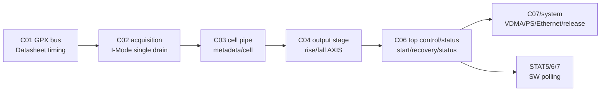
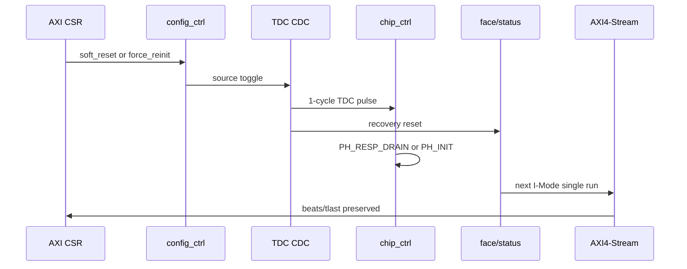

# C06 Control/Status Integration -> C07 Handoff v001

| 항목 | 내용 |
|---|---|
| 문서 종류 | C06 종료 / 다음 Cluster 인계 문서 |
| 문서 버전 | v001 |
| 생성 시간 | 2026-05-14 13:22:59 KST |
| 수정 시간 | 2026-05-14 13:41:16 KST |
| 현재 Cluster | C06 Control / Status Integration |
| 다음 단계 | C07 또는 release-readiness / system integration 검토 |
| 절대 기준 문서 | `Doc/TDC-GPX-Datasheet.pdf` |
| 기준 결과 | `C06_Control_Status_Integration_260514132259_Code_Fix_Result_v005.md` |
| 공식 회귀 | `scripts/run_c06_v004_recovery.ps1 -Stamp 260514132259` |
| archive session | `sim_results/vivado_xsim/sessions/260514132259_c06_v004_recovery/` |

## 1. 인계 결론

C06은 다음 단계로 넘길 수 있다.

단, 초기 communication plan은 C06까지 정의되어 있었으므로, `C07` 명칭은 아직 임시다. 다음 작업을 계속한다면 C07은 "system integration / release readiness / downstream 소비 계약" 성격으로 정의하는 것이 맞다.

판정:

```text
C06 -> 다음 단계: GO_WITH_CONTRACT
```

## 2. C06에서 닫은 범위

| 범위 | 상태 | 근거 |
|---|---|---|
| top-level start/face/status path | Close | face_seq/status_agg baseline PASS |
| 32/64/128 output width baseline | Close | width 32/64/128 top integration PASS |
| bounded output backpressure | Close | width64 backpressure PASS |
| force_reinit recovery | Close | force log line 142/146/148/236/238 |
| soft_reset recovery | Close | soft log line 142/146/148/156/244/246 |
| recovery 후 output preservation | Close | force log line 231/232, soft log line 239/240 |
| C06 공식 회귀 명령 | Close | `scripts/run_c06_v004_recovery.ps1` |

## 3. 다음 단계가 받아야 할 계약

| 계약 ID | 인계 계약 | 근거 |
|---|---|---|
| H-C06-01 | C06 운용 범위는 I-Mode single이다. Quiet/M-mode와 continuous measurement는 닫힌 범위가 아니다. | 사용자 운용 결정, C06 v005 |
| H-C06-02 | GPX IC read/write timing은 Datasheet 기준 C01/C02 계약을 유지한다. C06는 외부 GPX timing을 변경하지 않는다. | `Doc/TDC-GPX-Datasheet.pdf`, C01/C02 lineage |
| H-C06-03 | recovery command는 AXI 1-cycle pulse여도 TDC domain pulse로 보존되어야 한다. | `tdc_gpx_config_ctrl.vhd:472-473`, `:1180-1183`, force/soft logs |
| H-C06-04 | `force_reinit`은 chip_ctrl를 `PH_INIT`으로 되돌리고 다음 run을 허용한다. | `tdc_gpx_chip_ctrl.vhd:1031-1049`, force log line 148/236 |
| H-C06-05 | `soft_reset`은 `PH_RESP_DRAIN` 후 `PH_INIT`으로 재진입한다. | `tdc_gpx_chip_ctrl.vhd:1010`, `:862`, soft log line 148/156/244 |
| H-C06-06 | recovery는 face_seq/status_agg state도 recovery boundary로 닫는다. | `tdc_gpx_top.vhd:416`, `:873`, `:932` |
| H-C06-07 | output width는 32/64/128을 지원한다. 다음 단계는 VDMA/PS parser 폭과 일치시켜야 한다. | width logs line 138/139/143 |
| H-C06-08 | 현재 generation의 최종 VDMA stream은 Hit[16]을 버린다. | C04 handoff 정책 |
| H-C06-09 | `o_irq_pipe`는 reserved/tie-off 정책을 유지한다. SW는 STAT5/6/7 polling 계약을 따른다. | C06 Result v002/v005 |
| H-C06-10 | simulation-only recovery report는 유지한다. | v005 section 7 |

## 4. Data / Control / Status 경계



다음 단계는 C01~C06 내부를 다시 여는 것이 아니라, C06이 넘긴 final stream과 status 계약을 시스템 소비자 관점에서 수락해야 한다.

## 5. Recovery Timing Handoff



| 구간 | 관측값 | 다음 단계 해석 |
|---|---:|---|
| source pulse -> TDC pulse | 20 ns / 4 clk | recovery command CDC latency |
| soft TDC pulse -> PH_INIT | 20 ns / 4 clk | stale response drain 조건이 idle일 때의 TB 관측값 |
| force T8 -> run2 T0 | 14.965 us | TB status/read/checkpoint 포함. RTL 최소 latency로 오해 금지 |
| soft T8 -> run2 T0 | 74.565 us | TB의 12000 clk wait 포함. RTL 최소 latency로 오해 금지 |

## 6. Latency / Throughput / Pipeline / II 인계

| Metric | C06 인계값 | 다음 단계 주의 |
|---|---:|---|
| T0 -> T1 fire_count final | 11 clk / 55 ns | TB I-Mode single 조건 |
| T0 -> T2 IrFlag assert | 92 clk / 460 ns | MTimer/IrFlag emulation 조건 |
| T0 -> T5 TLAST | 189~192 clk / 945~960 ns | 64-bit, small integration TB 기준 |
| T0 -> T3 drain wait end | 1092 clk / 5.460 us | TB fixed drain wait marker |
| shot-to-shot T0 interval | 2107 clk / 10.535 us | TB scenario interval, 설계 최소 II 아님 |
| 32-bit baseline throughput | rise/fall 72 beats, tlast 2 | width 32 parser 수락 필요 |
| 64-bit baseline throughput | rise/fall 44 beats, tlast 2 | width 64 parser 수락 필요 |
| 128-bit baseline throughput | rise/fall 38 beats, tlast 2 | width 128 parser 수락 필요 |
| recovery throughput | rise/fall 88 beats, tlast 4 | force/soft 64-bit recovery 공통 |

## 7. 남은 위험과 다음 단계 수락 조건

| Risk ID | 위험 | 다음 단계 처리 |
|---|---|---|
| R-C06-HO-01 | VDMA/PS/Ethernet 8 us reserve는 RTL/xsim 내부 검증값이 아니다. | system measurement 또는 보수 reserve sweep에서 확인 |
| R-C06-HO-02 | recovery width sweep은 64-bit만 직접 수행했다. | 필요 시 32/128 recovery sweep을 C07에서 추가 |
| R-C06-HO-03 | Quiet/M-mode, continuous measurement는 미지원이다. | 요구사항이 생기면 새 generation/새 Cluster로 분리 |
| R-C06-HO-04 | Hit[16]은 최종 stream에서 버려진다. | SW parser와 문서가 16-bit hit slot 정책을 따라야 함 |
| R-C06-HO-05 | simulation-only report는 유지된다. | release 로그 정책 변경 시 별도 plan 필요 |

## 8. 공식 검증 패키지

| 항목 | 경로 |
|---|---|
| session README | `sim_results/vivado_xsim/sessions/260514132259_c06_v004_recovery/README.md` |
| manifest | `sim_results/vivado_xsim/sessions/260514132259_c06_v004_recovery/manifest.csv` |
| compile log | `logs/compile/xvhdl_c06_v002_260514132259.log` |
| force recovery log | `logs/simulate/xsim_c06_v004_top_int_force_260514132259.log` |
| soft recovery log | `logs/simulate/xsim_c06_v004_top_int_soft_260514132259.log` |
| width baseline logs | `logs/simulate/xsim_c06_v002_top_int_w32/w64/w128_260514132259.log` |
| backpressure log | `logs/simulate/xsim_c06_v002_top_int_w64_bp_260514132259.log` |

## 9. 다음 Cluster 권고 정의

초기 plan은 C06까지 정의되어 있으므로, C07은 아래 중 하나로 사용자와 확정하는 것이 좋다.

| 후보 | 목적 | 권고 |
|---|---|---|
| `C07_System_Integration` | VDMA/PS/Ethernet, board reserve, parser 계약 검증 | 다음 작업이 시스템 연결이면 권고 |
| `C07_Release_Readiness` | simulation-only report, synthesis/STA, release checklist | release 준비이면 권고 |
| 종료 / Final Report | C01~C06을 하나의 최종 운용 보고서로 묶음 | 추가 RTL 분석이 없으면 권고 |

## 10. 인계 결론

C06은 `GO_WITH_CONTRACT`다.

다음 단계는 C06 내부 recovery/control/status를 다시 고치는 것이 아니라, 위 계약을 수락하고 시스템 소비자 관점에서 VDMA/PS/Ethernet reserve, parser, board timing, release policy를 닫는 것이다.

## 11. Post-review 강화 조건

사용자 종합 평가 이후, 본 handoff의 `GO_WITH_CONTRACT`는 아래 조건을 명시적으로 포함하는 것으로 강화한다.

| 조건 | 후속 반영 위치 |
|---|---|
| recovery width sweep은 32/64/128 force/soft 모두로 확장한다. | `C06_Control_Status_Integration_260514134116_Code_Fix_Plan_v006.md` FP6-C06-01 |
| 8 us VDMA/PS/Ethernet reserve는 실측값이 아니므로 reserve sweep 또는 board/system measurement로 닫는다. | `C06_Control_Status_Integration_260514134116_Code_Fix_Plan_v006.md` FP6-C06-03 |
| Hit[16] 폐기는 이번 generation 정책으로 유지하되, 16-bit hit slot 거리 한계와 SW parser 계약을 명시한다. | `C06_Control_Status_Integration_260514134116_Code_Fix_Plan_v006.md` FP6-C06-05 |
| v003 false positive 교훈에 따라 C01~C04 PASS marker를 source/destination/effect 기준으로 audit한다. | `C06_Control_Status_Integration_260514134116_Code_Fix_Plan_v006.md` FP6-C06-04 |
