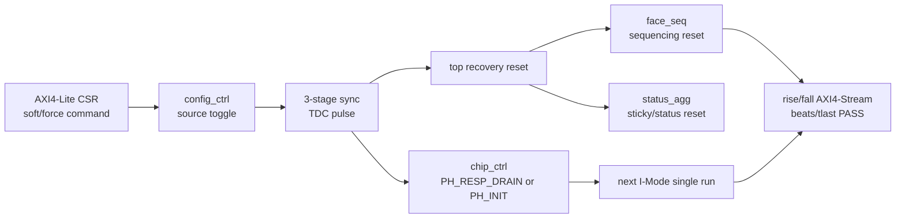

# C06 Control/Status Integration Code Fix Result v005

| 항목 | 내용 |
|---|---|
| 문서 버전 | v005 |
| 생성 시간 | 2026-05-14 13:22:59 KST |
| 수정 시간 | 2026-05-14 13:30:33 KST |
| Cluster | C06 Control / Status Integration |
| 절대 기준 문서 | `Doc/TDC-GPX-Datasheet.pdf` |
| 선행 계획 | `Doc/cluster_analysis/C06_Control_Status_Integration/C06_Control_Status_Integration_260514115000_Code_Fix_Plan_v005.md` |
| 선행 결과 | `Doc/cluster_analysis/C06_Control_Status_Integration/C06_Control_Status_Integration_260514115000_Code_Fix_Result_v004.md` |
| 실행 stamp | `260514132259` |
| Vivado/xsim | `C:\AMDDesignTools\2025.2.1\Vivado` |
| archive session | `sim_results/vivado_xsim/sessions/260514132259_c06_v004_recovery/` |

## 1. 결론

`Code Fix Plan v005` 실행 결과, C06은 다음 Cluster 또는 release-readiness 검토로 넘길 수 있는 상태다.

이번 v005는 RTL 기능을 다시 바꾸는 단계가 아니라, v004에서 닫힌 recovery/control/status 계약을 공식 회귀 명령, handoff 문서, 완료도 판단, 잔여 위험 정책으로 고정하는 단계다.

판정:

| 항목 | 판단 |
|---|---|
| C06 내부 blocker | 없음 |
| 공식 C06 recovery regression | PASS |
| 다음 Cluster 진입 | GO_WITH_CONTRACT |
| Datasheet 기준 GPX timing | C01/C02 계약을 유지. C06에서 변경 없음 |
| 운용 범위 | I-Mode single만 close. Quiet/M-mode, continuous measurement는 범위 밖 |

## 2. v005 Plan 항목 실행 결과

| Plan ID | 목표 | 결과 | 근거 |
|---|---|---|---|
| FP5-C06-01 | C06 handoff 문서 갱신 | Closed | `C06_Control_Status_Integration_260514132259_C07_Handoff_v001.md` |
| FP5-C06-02 | recovery regression 공식 스크립트 지정 | Closed | `scripts/run_c06_v004_recovery.ps1`, 실행 stamp `260514132259` PASS |
| FP5-C06-03 | simulation-only report 정책 결정 | Accepted / 유지 | `synthesis translate_off/on` 내부 report는 검증 추적성 때문에 유지 |
| FP5-C06-04 | C06 완료도 체크 갱신 | Closed | 본 문서 section 8 완료도 표와 handoff section 10 |
| FP5-C06-05 | 다음 cluster 진입 판단 | Closed | GO_WITH_CONTRACT. 다음 단계는 C06 계약 수락 후 진행 |

## 3. 공식 회귀 명령과 archive 근거

v005에서 공식 C06 recovery regression은 아래 명령으로 고정한다.

```powershell
powershell -NoProfile -ExecutionPolicy Bypass -File scripts\run_c06_v004_recovery.ps1 -Stamp 260514132259
```

실행 결과:

| 항목 | 결과 |
|---|---|
| exit code | 0 |
| archive session | `sim_results/vivado_xsim/sessions/260514132259_c06_v004_recovery/` |
| archive artifact count | 38 |
| root generated artifact check | `sim_results`만 남음 |

검증 구성:

| 단계 | 로그 | PASS 근거 |
|---|---|---|
| face_seq baseline | `logs/simulate/xsim_c06_v002_face_seq_260514132259.log` | line 54 `ALL SCENARIOS PASSED (A,B,C,D,E,F)` |
| status_agg baseline | `logs/simulate/xsim_c06_v002_status_agg_260514132259.log` | line 34 `ALL STATUS_AGG C06 SCENARIOS PASSED` |
| width 32 | `logs/simulate/xsim_c06_v002_top_int_w32_260514132259.log` | line 143 output stream PASS |
| width 64 | `logs/simulate/xsim_c06_v002_top_int_w64_260514132259.log` | line 143 output stream PASS |
| width 128 | `logs/simulate/xsim_c06_v002_top_int_w128_260514132259.log` | line 143 output stream PASS |
| width 64 backpressure | `logs/simulate/xsim_c06_v002_top_int_w64_bp_260514132259.log` | line 143 bounded backpressure PASS, line 145 output stream PASS |
| force recovery | `logs/simulate/xsim_c06_v004_top_int_force_260514132259.log` | line 236 recovery PASS, line 238 output stream PASS |
| soft recovery | `logs/simulate/xsim_c06_v004_top_int_soft_260514132259.log` | line 244 recovery PASS, line 246 output stream PASS |

## 4. Recovery 계약 고정

| 계약 | 판단 | RTL / log 근거 |
|---|---|---|
| AXI 1-cycle recovery command는 TDC domain pulse로 보존된다. | Closed | `tdc_gpx_config_ctrl.vhd:472-473`, `:1180-1183`, force log line 142/146, soft log line 142/146 |
| `force_reinit`은 chip_ctrl를 `PH_INIT`으로 되돌린다. | Closed | `tdc_gpx_chip_ctrl.vhd:1031-1049`, force log line 148/150/152/154 |
| `soft_reset`은 `PH_RESP_DRAIN` 후 `PH_INIT`으로 재진입한다. | Closed | `tdc_gpx_chip_ctrl.vhd:1010`, `:862`, soft log line 148/156 |
| recovery는 face/status state도 recovery boundary로 닫는다. | Closed | `tdc_gpx_top.vhd:416`, `:873`, `:932` |
| recovery 후 output stream beat/tlast 총량은 보존된다. | Closed | force log line 231/232/236/238, soft log line 239/240/244/246 |

## 5. Timing / Latency / Throughput / Pipeline / II

200 MHz 기준 1 clock = 5 ns다.

### 5.1 정상 shot pipeline

| 측정 구간 | 관측값 | 해석 |
|---|---:|---|
| T0 -> T1 fire_count final | 11 clk / 55 ns | fire_count final 전달 지연 |
| T0 -> T2 IrFlag assert | 92 clk / 460 ns | TB I-Mode single timing |
| T0 -> T5 TLAST shot1 | 192 clk / 960 ns | 64-bit recovery TB 기준 output close |
| T0 -> T5 TLAST shot2 | 189 clk / 945 ns | 두 번째 column output close |
| T0 -> T3 drain wait end | 1092 clk / 5.460 us | TB fixed drain wait marker |

### 5.2 Recovery command timing

| 구간 | force_reinit | soft_reset | 해석 |
|---|---:|---:|---|
| T8 marker | 43.5875 us | 43.5875 us | TB recovery command write 시작 |
| source pulse | 43.6575 us | 43.6575 us | AXI domain command pulse |
| TDC pulse | 43.6775 us | 43.6775 us | source 대비 20 ns / 4 clk |
| chip action | 43.6775 us | 43.6775 us | TDC pulse와 같은 edge에서 recovery 수신 |
| soft PH_INIT exit | - | 43.6975 us | TDC pulse 대비 20 ns / 4 clk |

### 5.3 Throughput

| 항목 | force_reinit | soft_reset | 판단 |
|---|---:|---:|---|
| output width | 64 bit | 64 bit | recovery TB 조건 |
| expected beats per run | 44 | 44 | run당 beat 보존 |
| expected beats total | 88 | 88 | 2회 run 합산 |
| rising stream beats/tlast | 88 / 4 | 88 / 4 | PASS |
| falling stream beats/tlast | 88 / 4 | 88 / 4 | PASS |
| IRQ summary | `o_irq=0`, `o_irq_pipe=0` | `o_irq=0`, `o_irq_pipe=0` | recovery가 fault를 만들지 않음 |

### 5.4 II

| II 종류 | 관측값 | 해석 |
|---|---:|---|
| shot-to-shot T0 interval | 2107 clk / 10.535 us | TB의 500 m shot period 조건. 설계 최소 II가 아님 |
| force `T8 -> run2 T0` | 2993 clk / 14.965 us | status read/checkpoint 포함 TB recovery sequence |
| soft `T8 -> run2 T0` | 14913 clk / 74.565 us | TB가 soft recovery run에서 12000 clk 대기를 포함 |

## 6. Pipeline 도식



C06 v005의 pipeline 결론은 다음과 같다.

| 경계 | 상태 |
|---|---|
| AXI -> TDC command CDC | toggle bridge로 close |
| chip_ctrl phase boundary | register phase로 close |
| face/status recovery boundary | top-level recovery reset으로 close |
| output stream preservation | force/soft recovery 모두 PASS |

## 7. Simulation-only report 정책

v005에서 선택한 정책은 `유지`다.

판단 근거:

| 항목 | 판단 |
|---|---|
| 합성 영향 | `synthesis translate_off/on` 내부라 합성 경로에 영향 없음 |
| 검증 가치 | recovery source pulse, TDC pulse, chip phase 전이를 line 근거로 추적 가능 |
| release 위험 | simulation log가 길어질 수 있음 |
| 완화 | 공식 regression에서는 유지. 제품 release에서 log noise가 문제 되면 별도 plan으로 `g_SIM_REPORT_EN` generic gate를 검토 |

따라서 v005에서는 simulation-only report를 제거하지 않는다. 제거 또는 generic gate는 기능 변경이 아니라 release 로그 정책 변경이므로, 별도 사용자 승인 후 진행한다.

## 8. C06 완료도 갱신

| 영역 | v001 점검 | v005 판단 | 근거 |
|---|---:|---:|---|
| Data path | 약 90% | Close | C01~C04 handoff + C06 width 32/64/128 baseline PASS |
| Control/status | 약 55% | Close for C06 scope | face_seq/status_agg baseline, recovery reset, STAT/IRQ accepted policy |
| Recovery | Open | Close | force/soft recovery PASS |
| Backpressure | Open/Partial | Close for bounded TB | width64 backpressure PASS |
| End-to-end 운용 | 약 75% | GO_WITH_CONTRACT | I-Mode single scope에서 C06 blocker 없음 |

주의: 이 완료도는 STA, board timing, VDMA/PS/Ethernet 실측 완료를 뜻하지 않는다. C06 RTL/xsim 운용 계약이 닫혔다는 의미다.

## 9. 다음 Cluster 진입 판단

다음 Cluster 또는 release-readiness 단계는 진입 가능하다. 단, 아래 조건을 수락해야 한다.

| 수락 조건 | 내용 |
|---|---|
| C06 scope | I-Mode single만 close |
| GPX timing | Datasheet 기반 GPX bus timing은 C01/C02 계약을 상속 |
| output width | 32/64/128 baseline PASS, recovery는 64-bit에서 force/soft PASS |
| simulation-only report | 유지 |
| remaining system risk | VDMA/PS/Ethernet 8 us reserve와 board-level timing은 시스템 검증 항목 |

## 10. Lineage

| 이전 항목 | v005 반영 |
|---|---|
| Result v004 `OP-C06-01` simulation-only report | v005 section 7에서 유지 정책으로 결정 |
| Result v004 `OP-C06-02` C06 handoff 문서 갱신 | `C06_Control_Status_Integration_260514132259_C07_Handoff_v001.md` 생성 |
| Result v004 `OP-C06-03` v003 script 유지 여부 | v004 script를 공식 regression으로 지정. v003은 과거 probe로만 유지 |
| Plan v005 `FP5-C06-01..05` | 본 문서 section 2에서 전체 close/accepted 처리 |

## 11. v005 산출물

| 산출물 | 목적 |
|---|---|
| `C06_Control_Status_Integration_260514132259_Code_Fix_Result_v005.md` | Plan v005 실행 결과 |
| `C06_Control_Status_Integration_260514132259_Code_Fix_Result_v005.pptx` | v005 핵심 공유 PPT |
| `C06_Control_Status_Integration_260514132259_C07_Handoff_v001.md` | 다음 Cluster / release-readiness 인계 계약 |
| `C06_Control_Status_Integration_260514132259_C07_Handoff_v001.pptx` | handoff 핵심 공유 PPT |
