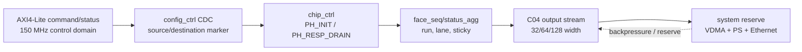

# C06 Control/Status Integration Code Fix Plan v006

| 항목 | 내용 |
|---|---|
| 문서 종류 | Review-driven release hardening plan |
| 문서 버전 | v006 |
| 생성 시간 | 2026-05-14 13:41:16 KST |
| 수정 시간 | 2026-05-14 13:41:16 KST |
| Cluster | C06 Control / Status Integration |
| 절대 기준 문서 | `Doc/TDC-GPX-Datasheet.pdf` |
| 선행 결과 | `Doc/cluster_analysis/C06_Control_Status_Integration/C06_Control_Status_Integration_260514132259_Code_Fix_Result_v005.md` |
| 선행 Review | `Doc/cluster_analysis/C06_Control_Status_Integration/C06_Control_Status_Integration_260514134116_Review_v001.md` |
| 목표 | C06을 `GO_WITH_CONTRACT`에서 release/system integration 전 hardening 가능 상태로 끌어올린다. |

## 1. v006 목적

v005는 C06 내부 recovery/control/status blocker를 닫았다. v006는 새 RTL 기능을 크게 추가하기보다, 사용자 종합 평가에서 지적된 검증 신뢰도와 시스템 계약 위험을 release 전에 닫기 위한 계획이다.

v006의 핵심 질문은 다음 세 가지다.

1. 64-bit에서만 직접 검증한 recovery가 32/64/128 width 모두에서 같은 방식으로 동작하는가?
2. polygon budget은 8 us reserve와 output ready high 가정이 깨져도 운용 가능한가?
3. C01~C04에서 PASS라고 기록된 항목도 source/destination/effect marker 기준으로 신뢰할 수 있는가?

## 2. 작업 항목

| Plan ID | 작업 | 우선순위 | 완료 기준 |
|---|---|---:|---|
| FP6-C06-01 | recovery width sweep 확장 | P0 | 32/64/128 각각 force/soft recovery fresh TB log 확보 |
| FP6-C06-02 | output backpressure + width stress | P0 | 32/64/128 width에서 bounded tready stall 후 beats/tlast 보존 확인 |
| FP6-C06-03 | polygon budget reserve sweep | P0 | 13.888889 us start interval에서 reserve 8 us 기준, 보수 reserve 후보별 pass/fail table 생성 |
| FP6-C06-04 | C01~C04 PASS marker audit | P1 | CDC/recovery/handshake 관련 PASS를 source/destination/effect marker 기준으로 재분류 |
| FP6-C06-05 | Hit[16] discard SW/range contract | P1 | 16-bit direct hit range, 810 m wrap 위험, SW parser 계약 문서화 |
| FP6-C06-06 | sticky clear policy map | P2 | soft-clear/reset-only sticky field를 SW-visible table로 고정 |
| FP6-C06-07 | lane imbalance + stall scenario | P2 | rise/fall 한쪽 완료/abort와 output stall 결합 시 frame_done/face_closing/tlast 보존 확인 |

## 3. 검증 Matrix

| 검증 ID | 대상 | Width | Scenario | PASS marker |
|---|---|---|---|---|
| VB6-C06-01 | force recovery | 32/64/128 | run1 중 force -> run2 정상 출력 | source pulse, TDC pulse, PH_INIT, beats/tlast |
| VB6-C06-02 | soft recovery | 32/64/128 | run1 중 soft -> PH_RESP_DRAIN -> run2 정상 출력 | source pulse, TDC pulse, PH_RESP_DRAIN, PH_INIT, beats/tlast |
| VB6-C06-03 | bounded backpressure | 32/64/128 | output tready gap 삽입 | no data loss, no duplicate tlast, expected beat count |
| VB6-C06-04 | polygon budget | 32/64/128 | 13.888889 us shot interval + reserve sweep | available signal time >= measured processing time |
| VB6-C06-05 | lane imbalance | selected width | rise-only/fall-only abort + stall | frame_done_both, face_closing, next shot gating |
| VB6-C06-06 | sticky clear | N/A | soft clear / reset-only field별 clear | CSR readback field map |

## 4. Timing / Latency / Throughput / Pipeline / II 기록 규칙

v006 결과 문서는 아래 marker를 동일한 이름으로 기록한다.

| Marker | 의미 | 필수 기록 |
|---|---|---|
| T0 | run/shot 기준 start marker | clock count, simulation time |
| T1 | fire_count final 또는 expected count 확정 | source와 destination 구분 |
| T2 | IrFlag / drain start 조건 | Datasheet I-Mode single sequence 기준 |
| T3 | chip_ctrl recovery command source pulse | AXI/control clock domain |
| T4 | TDC domain recovery pulse | TDC/capture clock domain |
| T5 | chip_ctrl FSM effect | `PH_INIT` 또는 `PH_RESP_DRAIN` 전이 |
| T6 | output stream final TLAST | stream별 beat/tlast count |
| T7 | next shot accepted/deferred/dropped | II 판단 기준 |

## 5. Pipeline Diagram



## 6. Polygon Budget 재산출 방식

사용자 운용 조건:

| 항목 | 값 | 근거 |
|---|---:|---|
| polygon one shot interval | 13.888889 us | 5각 mirror, 72도/20 ms, 0.05도 spacing |
| system reserve baseline | 8 us | 사용자 가정값. RTL/xsim 실측값 아님 |
| available signal-processing window | `13.888889 us - round_trip_time - reserve` | C04/C06 timing budget rule |

v006는 8 us를 고정 진실로 취급하지 않고 아래처럼 sweep한다.

| Reserve 후보 | 목적 |
|---:|---|
| 6 us | 보수 여유 확인용 optimistic case |
| 8 us | 사용자 baseline |
| 10 us | board/system 여유 감소 case |
| measured value | 실제 VDMA/PS/Ethernet 실측값 확보 시 최종 기준 |

거리 sweep은 기존 C04 기준과 연결하되, output backpressure stall이 추가되는 경우 processing time에 stall penalty를 더한다.

```text
PASS 조건:
  measured_or_estimated_processing_time + stall_penalty <=
  13.888889 us - round_trip_time(distance) - reserve
```

## 7. Hit[16] SW 계약

Datasheet의 IFIFO raw hit는 `Hit[16:0]`다. 현재 final VDMA stream에서는 Hit[16]을 버린다.

v006에서 문서화할 계약은 다음과 같다.

| 계약 | 내용 |
|---|---|
| SW parser width | final hit slot은 16-bit로 해석한다. |
| raw meaning | 내부 raw/event 의미는 Datasheet의 17-bit hit에서 유래한다. |
| range warning | 81 ps bin 기준 16-bit 직접 표현 시간은 약 5.308 us, 왕복 거리 약 796 m다. |
| 810 m 운용 | 16-bit 직접 범위를 초과하므로 wrap/overflow 정책을 SW 또는 운용 문서에서 수락해야 한다. |
| 다음 generation | Hit[16] metadata 보존은 다음 generation 검토 항목이다. |

## 8. C01~C04 Marker Audit 범위

v003 false positive 교훈을 C01~C04에 적용한다.

| Cluster | Audit 대상 | 확인 기준 |
|---|---|---|
| C01 | GPX bus read timing, OEN, EF/status sync | Datasheet timing + source/destination/effect marker 존재 여부 |
| C02 | expected count CDC, drain pipeline, zero-stop shot | fire_count final, CDC output, drain effect marker 분리 |
| C03 | cell pipe metadata, Hit[16] policy handoff | input raw, metadata transform, output stream marker |
| C04 | output width serialization, polygon budget | width별 beat/tlast, timing budget, ready stall 조건 |

이 audit은 C01~C04 RTL을 즉시 다시 고치는 목적이 아니라, 과거 PASS 근거가 "진짜 effect marker"까지 포함하는지 분류하는 목적이다.

## 9. 위험과 완화

| Risk ID | 위험 | 완화 |
|---|---|---|
| R6-C06-01 | width별 recovery TB 추가 중 기존 64-bit result와 다른 beat count가 나올 수 있음 | expected count 계산을 width-independent event 수와 width-dependent serialization 수로 분리 |
| R6-C06-02 | 8 us reserve가 실제보다 작으면 C04 pass distance가 과대평가될 수 있음 | measured reserve 또는 10 us 이상 보수 sweep을 함께 제시 |
| R6-C06-03 | Hit[16] 폐기 정책이 SW parser에서 묵시적으로 처리될 수 있음 | SW contract table을 handoff에 명시하고 release check에 추가 |
| R6-C06-04 | lane imbalance stress가 face_seq 단독 PASS와 다르게 나올 수 있음 | top-level output stall과 결합한 별도 scenario로 분리 |

## 10. 실행 순서

1. 기존 `scripts/run_c06_v004_recovery.ps1`를 기준으로 width별 recovery sweep 명령을 만든다.
2. 32/64/128 force/soft recovery를 fresh stamp로 실행한다.
3. backpressure stress를 width별로 확장한다.
4. polygon reserve sweep 문서를 작성하고, 8 us baseline과 보수 reserve를 분리 표기한다.
5. Hit[16] SW/range contract와 sticky clear map을 handoff 보완 문서에 반영한다.
6. C01~C04 marker audit 결과를 별도 review로 기록한다.
7. v006 결과 문서에 Plan ID별 close/partial/open 상태를 기록한다.

## 11. Lineage

| 선행 항목 | v006 반영 |
|---|---|
| `R-C06-HO-01` 8 us reserve는 RTL/xsim 내부 검증값 아님 | FP6-C06-03 |
| `R-C06-HO-02` recovery width sweep은 64-bit만 직접 수행 | FP6-C06-01 |
| `R-C06-HO-04` Hit[16] final stream 폐기 | FP6-C06-05 |
| 사용자 Review `C06 v003 false positive pattern` | FP6-C06-04 marker audit |
| 사용자 Review `lane imbalance / sticky clear` | FP6-C06-06, FP6-C06-07 |
