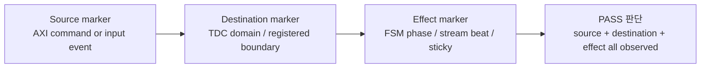

# C06 Control/Status Integration Review v001

| 항목 | 내용 |
|---|---|
| 문서 종류 | 사용자 종합 평가 재판정 / release hardening review |
| 문서 버전 | v001 |
| 생성 시간 | 2026-05-14 13:41:16 KST |
| 수정 시간 | 2026-05-14 13:41:16 KST |
| Cluster | C06 Control / Status Integration |
| 절대 기준 문서 | `Doc/TDC-GPX-Datasheet.pdf` |
| 기준 결과 | `Doc/cluster_analysis/C06_Control_Status_Integration/C06_Control_Status_Integration_260514132259_Code_Fix_Result_v005.md` |
| 기준 handoff | `Doc/cluster_analysis/C06_Control_Status_Integration/C06_Control_Status_Integration_260514132259_C07_Handoff_v001.md` |
| 후속 계획 | `Doc/cluster_analysis/C06_Control_Status_Integration/C06_Control_Status_Integration_260514134116_Code_Fix_Plan_v006.md` |

## 1. 리뷰 결론

사용자 종합 평가의 핵심 방향은 타당하다. 특히 C06 v003의 false positive 패턴은 단순한 문서 오기가 아니라, 검증 marker가 실제 동작 완료 지점과 분리될 수 있다는 경고다. 이 패턴은 C06 v004/v005에서 바로잡혔지만, C01~C04의 PASS marker도 같은 관점으로 재감사할 필요가 있다.

다만 최신 v005 문서 기준으로 정정할 부분도 있다.

```text
C06 v005 판정은 Absolute PASS가 아니라 GO_WITH_CONTRACT다.
```

즉 C06 내부 recovery/control/status blocker는 닫혔지만, system integration 관점의 width recovery sweep, 8 us reserve 실측, output backpressure 포함 budget은 아직 다음 단계 계약으로 남아 있다.

## 2. 사용자 리뷰 입력 재판정

| Review ID | 사용자 지적 | 최신 v005 기준 판단 | 조치 |
|---|---|---|---|
| RV-C06-01 | v003 `force_reinit PASS`가 실제 TDC-domain delivery 없이 PASS처럼 보였다. | Valid | v004/v005에서 source pulse, TDC pulse, chip phase action, output preservation을 분리 관측했지만, 같은 marker audit을 C01~C04에도 적용한다. |
| RV-C06-02 | C06 조건부 PASS가 절대 PASS처럼 표현될 위험이 있다. | Partial | v005는 `GO_WITH_CONTRACT`로 표현되어 있으나, release 문맥에서는 오해 가능성이 있으므로 v006에서 "닫힌 범위"와 "계약 범위"를 더 강하게 분리한다. |
| RV-C06-03 | recovery width sweep은 64-bit만 직접 수행됐다. | Valid | 32/64/128 force/soft recovery fresh sweep을 v006 P0로 수행한다. |
| RV-C06-04 | polygon budget은 13.888889 us interval, 8 us reserve, output ready high 가정 위에 있다. | Valid | 8 us는 RTL/xsim 내부 검증값이 아니므로 reserve sweep 또는 board/system measurement 계약으로 분리한다. |
| RV-C06-05 | Hit[16] 폐기는 운용 거리와 직접 연결된다. | Valid | 최종 VDMA stream에서 Hit[16]을 버리는 정책은 사용자 결정으로 유지하되, 16-bit 직접 표현 가능 시간/거리 한계를 SW 계약에 명시한다. |
| RV-C06-06 | rise/fall lane imbalance가 미검증일 수 있다. | Partial | `face_seq` baseline Scenario F는 fall-only abort를 PASS했지만, top-level output stall과 결합된 lane imbalance는 별도 stress가 필요하다. |
| RV-C06-07 | sticky clear field별 정책이 불일치할 수 있다. | Partial | 일부는 soft clear, 일부는 reset-only로 문서화되어 있다. v006에서 SW-visible sticky clear map을 release 계약 표로 고정한다. |

## 3. false positive에서 얻은 검증 원칙

v003 false positive의 본질은 "명령이 발생했다"와 "목적지에서 동작했다"를 같은 PASS로 취급한 것이다. C06 v004/v005는 이 문제를 아래처럼 분리해서 닫았다.

| 구간 | v004/v005 관측 근거 | 의미 |
|---|---|---|
| AXI source pulse | force/soft log line 142 | SW command가 source domain에서 발생 |
| TDC domain pulse | force/soft log line 146 | CDC 이후 destination domain에서 pulse 보존 |
| chip_ctrl phase action | force log line 148/150/152/154, soft log line 148/156 | 실제 제어 FSM이 recovery를 수락 |
| output preservation | force log line 231/232/236/238, soft log line 239/240/244/246 | recovery 이후 다음 run stream이 보존 |

따라서 이후 Cluster 검증에는 아래 규칙을 적용한다.

```text
CDC/recovery/handshake PASS는 source marker, destination marker, effect marker를 분리해서 기록한다.
```

## 4. Conditional PASS 경계 재정의

C06 v005에서 닫힌 범위와 다음 단계 계약은 다르다.

| 영역 | v005에서 닫힌 범위 | 남은 계약 / v006 hardening |
|---|---|---|
| output width | 32/64/128 baseline top integration PASS | recovery force/soft fresh sweep은 64-bit만 직접 수행됨 |
| backpressure | width64 bounded backpressure PASS | 32/128 및 polygon budget 결합 stress는 미수행 |
| recovery | force/soft recovery PASS | width별 recovery와 ready stall 결합은 v006 대상 |
| timing budget | C04/C06 TB 조건에서 산출 | VDMA/PS/Ethernet 8 us reserve는 실측값 아님 |
| data contract | Hit[16] 최종 stream 폐기 정책 반영 | SW/parser가 16-bit hit slot과 wrap/overflow 의미를 수락해야 함 |

## 5. Hit[16] 폐기 위험의 정량 의미

Datasheet 기준 raw IFIFO data는 `Hit[16:0]`를 포함한다. 현재 generation에서는 사용자의 결정에 따라 최종 VDMA stream에서 Hit[16]을 버리고 16-bit hit slot만 전달한다.

사용자 운용 분석에서 사용한 81 ps bin 기준으로 계산하면 다음과 같다.

| 항목 | 계산 | 값 |
|---|---:|---:|
| 16-bit 직접 표현 count | 65536 count | 0..65535 |
| 16-bit 직접 표현 시간 | `65536 * 81 ps` | 5.308416 us |
| 왕복 시간 기준 직접 표현 거리 | `c * 5.308416 us / 2` | 약 796 m |
| 810 m 왕복 시간 | `2 * 810 m / c` | 약 5.404 us |
| 810 m 초과분 | `5.404 us - 5.308 us` | 약 95 ns |

판단:

- 810 m 운용은 16-bit 직접 표현 범위를 이미 살짝 넘는다.
- Hit[16] 폐기는 이번 generation 정책으로 유지할 수 있지만, SW가 거리/모드별 wrap 또는 saturation 정책을 명확히 알아야 한다.
- 이 항목은 RTL bug라기보다 system/SW 계약 위험이다.

## 6. Timing / Latency / Throughput / Pipeline / II 영향

v006에서 재검증할 timing 항목은 다음처럼 분리한다.

| Metric | 현재 v005 근거 | v006에서 추가할 것 |
|---|---|---|
| Latency | AXI source pulse -> TDC pulse -> chip action은 분리 관측됨 | width별 force/soft recovery에서 동일 marker 재확인 |
| Throughput | baseline width별 beats/tlast, recovery 64-bit beats/tlast PASS | 32/64/128 recovery beats/tlast 및 stall pattern별 보존 |
| Pipeline | AXI CSR -> config_ctrl CDC -> chip_ctrl -> face/status -> output stream | source/destination/effect marker를 pipeline block별로 표준화 |
| II | TB scenario interval과 recovery run-to-run interval 기록 | polygon interval 13.888889 us, reserve sweep, output stall을 결합한 pass/fail boundary |



## 7. v006로 넘길 우선순위

| 우선순위 | 항목 | 이유 |
|---|---|---|
| P0 | 32/64/128 force/soft recovery fresh sweep | C06 recovery PASS가 64-bit 직접 검증에만 기대지 않도록 한다. |
| P0 | 8 us reserve의 measurement/sweep 계약화 | polygon budget의 핵심 가정이므로 실측 또는 보수 sweep 없이는 release 근거가 약하다. |
| P0 | output backpressure + polygon budget 결합 stress | output ready high 가정이 깨질 때 거리/width margin이 달라진다. |
| P1 | C01~C04 PASS marker audit | v003 false positive 패턴이 다른 cluster에 숨어 있는지 확인한다. |
| P1 | Hit[16] 폐기 SW/range 계약 | 16-bit 직접 표현 범위와 운용 거리 정책을 SW가 수락해야 한다. |
| P2 | sticky clear policy map | reset-only와 soft-clear 차이를 SW-visible 계약으로 고정한다. |
| P2 | top-level lane imbalance + stall scenario | face_seq 단독 PASS를 system-level stream stall 조건으로 확장한다. |

## 8. Lineage

| 선행 문서 / 입력 | 본 Review 반영 |
|---|---|
| 사용자 `cluster_analysis 전체 종합 평가 보고서` | RV-C06-01..07로 재판정 |
| `C06_Control_Status_Integration_260514132259_Code_Fix_Result_v005.md` | Absolute PASS가 아니라 `GO_WITH_CONTRACT`임을 기준으로 재해석 |
| `C06_Control_Status_Integration_260514132259_C07_Handoff_v001.md` | R-C06-HO-01..04를 v006 P0/P1 계획으로 승격 |
| 본 Review v001 | `C06_Control_Status_Integration_260514134116_Code_Fix_Plan_v006.md`에 실행 계획으로 반영 |
