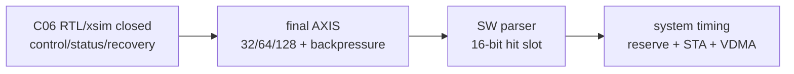

# C06 Control/Status Integration -> C07 Handoff v002

| 항목 | 내용 |
|---|---|
| 문서 종류 | C06 v006 hardening 이후 다음 단계 인계 |
| 문서 버전 | v002 |
| 생성 시간 | 2026-05-14 14:47:55 KST |
| 수정 시간 | 2026-05-14 14:58:26 KST |
| 현재 Cluster | C06 Control / Status Integration |
| 다음 단계 | C07 System Integration 또는 Release Readiness |
| 절대 기준 문서 | `Doc/TDC-GPX-Datasheet.pdf` |
| 기준 결과 | `Doc/cluster_analysis/C06_Control_Status_Integration/C06_Control_Status_Integration_260514144755_Code_Fix_Result_v006.md` |
| 공식 회귀 | `scripts/run_c06_v006_hardening.ps1 -Stamp 260514144755` |
| archive session | `sim_results/vivado_xsim/sessions/260514144755_c06_v006_hardening/` |

## 1. 인계 결론

C06은 v006 hardening 이후 다음 단계로 넘길 수 있다.

```text
C06 -> C07/system: GO_WITH_HARDENED_CONTRACT
```

이 판정은 아래를 뜻한다.

- C06 내부 control/status/recovery blocker는 닫혔다.
- 32/64/128 output width와 force/soft recovery가 직접 xsim으로 확인됐다.
- bounded output backpressure와 rise/fall lane-only stall이 직접 확인됐다.
- 단, VDMA/PS/Ethernet reserve와 board STA는 C06 RTL/xsim 범위 밖이다.

## 2. 다음 단계가 받아야 할 계약

| 계약 ID | 인계 계약 | 근거 |
|---|---|---|
| H2-C06-01 | 운용 범위는 I-Mode single이다. Quiet/M-mode/continuous는 닫힌 범위가 아니다. | 사용자 결정, Datasheet I-Mode single |
| H2-C06-02 | GPX bus timing은 C01/C02 Datasheet 계약을 상속한다. | `Doc/TDC-GPX-Datasheet.pdf`, C01/C02 lineage |
| H2-C06-03 | output width는 32/64/128 모두 지원한다. | `xsim_c06_v002_top_int_w32/w64/w128_260514144755.log:143` |
| H2-C06-04 | recovery는 32/64/128 모두 force/soft를 지원한다. | v006 recovery logs line 236/244 |
| H2-C06-05 | bounded output backpressure는 32/64/128 모두 beats/tlast를 보존한다. | v006 bp logs line 143/145 |
| H2-C06-06 | rise-only/fall-only output stall에서 양쪽 stream beat/tlast가 보존된다. | `xsim_c06_v006_top_int_w64_bp_rise/fall_260514144755.log:143`, `:145` |
| H2-C06-07 | final VDMA stream은 Hit[16]을 버리고 16-bit hit slot을 전달한다. | C04 정책, v006 result section 9 |
| H2-C06-08 | `quarantine_escape_mask`는 reset-only 이력이다. 나머지 주요 C06 sticky는 `err_soft_clear` 계약을 따른다. | v006 result section 11 |

## 3. C07에서 반드시 닫아야 할 System 항목

| System ID | 항목 | 이유 |
|---|---|---|
| SYS-C07-01 | VDMA/PS/Ethernet reserve 실측 | 8 us는 사용자 가정값이며 RTL/xsim 측정값이 아니다. |
| SYS-C07-02 | polygon budget 최종 거리표 | v006 보수 계산에서 8 us reserve 기준 810 m는 margin 부족으로 분류된다. |
| SYS-C07-03 | SW parser 16-bit hit slot 수락 | Hit[16] 폐기 정책을 SW가 명시적으로 따라야 한다. |
| SYS-C07-04 | board STA / clock constraint | C06 xsim PASS는 STA/board timing closure를 뜻하지 않는다. |
| SYS-C07-05 | 장기 output stall policy | v006는 bounded stall만 닫았다. 무한/장기 VDMA stall은 system fault policy가 필요하다. |

## 4. Timing / Pipeline / II 인계

| Metric | 인계값 |
|---|---|
| recovery CDC | source pulse -> TDC pulse 4 clk / 20 ns |
| output width throughput | 32: 72 beats/run, 64: 44 beats/run, 128: 38 beats/run |
| recovery throughput | 32: 144 beats, 64: 88 beats, 128: 76 beats per lane |
| bounded stall | `bp_gap=17`, 2-cycle stall 반복에서 pass |
| lane stall | 64-bit rise-only/fall-only pass |
| conservative T2->T5 | 32-bit 0.540 us, 64/128-bit 0.500 us |



## 5. Handoff v001 대비 변경

| v001 조건 | v002 보강 |
|---|---|
| recovery width sweep은 64-bit만 직접 수행 | 32/64/128 force/soft 직접 PASS |
| backpressure는 width64 bounded만 직접 수행 | 32/64/128 bounded + 64-bit rise/fall lane-only PASS |
| Hit[16] 폐기 정책만 기록 | 16-bit direct range와 810 m 위험을 SW 계약으로 명시 |
| sticky clear 차이 우려 | 최신 코드 기준 sticky clear map 작성 |
| GO_WITH_CONTRACT | GO_WITH_HARDENED_CONTRACT |

## 6. 최종 인계 판단

다음 작업이 RTL 내부 control/status 수정이라면 C06에서 추가 blocker는 없다.

다음 작업이 제품/release 판단이라면 C07은 반드시 system integration 성격이어야 한다. 특히 8 us reserve 실측, Hit[16] SW parser 계약, board STA가 닫히기 전에는 "시스템 release PASS"로 표현하면 안 된다.
