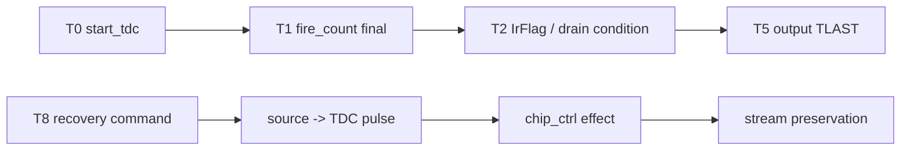

# C06 Control/Status Integration Code Fix Result v006

| 항목 | 내용 |
|---|---|
| 문서 종류 | Code Fix Plan v006 실행 결과 |
| 문서 버전 | v006 |
| 생성 시간 | 2026-05-14 14:47:55 KST |
| 수정 시간 | 2026-05-14 14:58:26 KST |
| Cluster | C06 Control / Status Integration |
| 절대 기준 문서 | `Doc/TDC-GPX-Datasheet.pdf` |
| 선행 계획 | `Doc/cluster_analysis/C06_Control_Status_Integration/C06_Control_Status_Integration_260514134116_Code_Fix_Plan_v006.md` |
| 선행 Review | `Doc/cluster_analysis/C06_Control_Status_Integration/C06_Control_Status_Integration_260514134116_Review_v001.md` |
| 실행 stamp | `260514144755` |
| Vivado/xsim | `C:\AMDDesignTools\2025.2.1\Vivado` |
| archive session | `sim_results/vivado_xsim/sessions/260514144755_c06_v006_hardening/` |

## 1. 결론

`Code Fix Plan v006`의 P0/P1/P2 hardening 항목을 실행했다.

판정:

| 항목 | 결과 |
|---|---|
| 공식 v006 hardening regression | PASS |
| recovery width sweep | 32/64/128, force/soft 모두 PASS |
| output backpressure width sweep | 32/64/128 모두 PASS |
| lane imbalance backpressure | 64-bit rise-only/fall-only PASS |
| polygon reserve 분석 | 계산 완료. 8 us reserve는 여전히 system 측정 계약 |
| Hit[16] / sticky / marker audit | 문서 계약으로 반영 |
| 다음 단계 진입 | `GO_WITH_HARDENED_CONTRACT` |

주의: v006는 RTL datapath 기능을 새로 바꾸는 작업이 아니라, v005에서 남긴 조건부 계약을 fresh xsim과 문서 계약으로 더 강하게 닫는 작업이다. Board STA, VDMA/PS/Ethernet 실측은 여전히 시스템 단계 항목이다.

## 2. 코드 / 스크립트 변경

| 파일 | 변경 | 근거 |
|---|---|---|
| `tb_tdc_gpx_top_int.vhd` | `G_BP_LANE_MODE` generic 추가. `0=both`, `1=rise-only`, `2=fall-only` downstream stall을 선택 가능하게 함. | `tb_tdc_gpx_top_int.vhd:92`, `:449`, `:1163`, `:1260` |
| `scripts/run_c06_v006_hardening.ps1` | v002 baseline 후 32/64/128 recovery sweep, 32/64/128 backpressure sweep, 64-bit rise/fall lane stall sweep을 실행. | `scripts/run_c06_v006_hardening.ps1:98`, `:109`, `:123` |

TB 변경은 검증 전용이며 합성 RTL에는 영향을 주지 않는다.

## 3. 공식 실행 명령과 archive

```powershell
powershell -NoProfile -ExecutionPolicy Bypass -File scripts\run_c06_v006_hardening.ps1 -Stamp 260514144755
```

실행 결과:

| 항목 | 결과 |
|---|---|
| exit code | 0 |
| archive session | `sim_results/vivado_xsim/sessions/260514144755_c06_v006_hardening/` |
| artifact count | 65 |
| simulate logs | 17 |
| elaborate logs | 17 |
| compile logs | 2 |

## 4. Plan ID별 결과

| Plan ID | 작업 | 결과 | 근거 |
|---|---|---|---|
| FP6-C06-01 | recovery width sweep | Closed / PASS | section 5 |
| FP6-C06-02 | output backpressure + width stress | Closed / PASS | section 6 |
| FP6-C06-03 | polygon budget reserve sweep | Closed as analysis / system measurement remains | section 8 |
| FP6-C06-04 | C01~C04 PASS marker audit | Closed as document audit / no new RTL change | section 10 |
| FP6-C06-05 | Hit[16] discard SW/range contract | Closed / contract documented | section 9 |
| FP6-C06-06 | sticky clear policy map | Closed / contract documented | section 11 |
| FP6-C06-07 | lane imbalance + stall scenario | Closed for top output stall / PASS | section 7 |

## 5. Recovery Width Sweep

각 width에서 `soft_reset`과 `force_reinit` 모두 source marker, destination marker, effect marker, output preservation marker를 확인했다.

| Width | Mode | Source | Destination | Effect | Output PASS |
|---:|---|---|---|---|---|
| 32 | force | log line 142 | line 146 | line 148 `PH_INIT` | line 236, 238 |
| 32 | soft | line 142 | line 146 | line 148 `PH_RESP_DRAIN`, line 156 `PH_INIT` | line 244, 246 |
| 64 | force | line 142 | line 146 | line 148 `PH_INIT` | line 236, 238 |
| 64 | soft | line 142 | line 146 | line 148 `PH_RESP_DRAIN`, line 156 `PH_INIT` | line 244, 246 |
| 128 | force | line 142 | line 146 | line 148 `PH_INIT` | line 236, 238 |
| 128 | soft | line 142 | line 146 | line 148 `PH_RESP_DRAIN`, line 156 `PH_INIT` | line 244, 246 |

로그:

| Width | Mode | Log |
|---:|---|---|
| 32 | force | `logs/simulate/xsim_c06_v006_top_int_w32_force_reinit_260514144755.log` |
| 32 | soft | `logs/simulate/xsim_c06_v006_top_int_w32_soft_reset_260514144755.log` |
| 64 | force | `logs/simulate/xsim_c06_v006_top_int_w64_force_reinit_260514144755.log` |
| 64 | soft | `logs/simulate/xsim_c06_v006_top_int_w64_soft_reset_260514144755.log` |
| 128 | force | `logs/simulate/xsim_c06_v006_top_int_w128_force_reinit_260514144755.log` |
| 128 | soft | `logs/simulate/xsim_c06_v006_top_int_w128_soft_reset_260514144755.log` |

Throughput 결과:

| Width | expected beats/run | recovery runs | total beats per lane | tlast per lane |
|---:|---:|---:|---:|---:|
| 32 | 72 | 2 | 144 | 4 |
| 64 | 44 | 2 | 88 | 4 |
| 128 | 38 | 2 | 76 | 4 |

## 6. Backpressure Width Sweep

`G_BP_TREADY_GAP=17`, `G_BP_LANE_MODE=0` 조건에서 32/64/128 모두 bounded output backpressure를 통과했다.

| Width | Log | Beats per lane | TLAST per lane | Stall cycles | PASS |
|---:|---|---:|---:|---:|---|
| 32 | `xsim_c06_v006_top_int_w32_bp_260514144755.log` | 72 | 2 | 914 | line 143, 145 |
| 64 | `xsim_c06_v006_top_int_w64_bp_260514144755.log` | 44 | 2 | 914 | line 143, 145 |
| 128 | `xsim_c06_v006_top_int_w128_bp_260514144755.log` | 38 | 2 | 914 | line 143, 145 |

판단:

- output width가 달라도 backpressure 중 beat/tlast 손실은 없다.
- `bp_gap=17`은 bounded stall 검증이며 무한 stall 또는 VDMA 장기 정지는 별도 system-level fault policy 대상이다.

## 7. Lane Imbalance + Stall

v006에서 top integration TB에 `G_BP_LANE_MODE`를 추가하여 rise/fall 한쪽 lane만 stall하는 조건을 직접 검증했다.

| Scenario | Width | bp_lane_mode | Rise beats/tlast | Fall beats/tlast | Timing 차이 | PASS |
|---|---:|---:|---|---|---|---|
| rise-only stall | 64 | 1 | 44 / 2 | 44 / 2 | rise last 5189, fall last 5187 | line 143, 145 |
| fall-only stall | 64 | 2 | 44 / 2 | 44 / 2 | rise last 5187, fall last 5189 | line 143, 145 |

로그:

- `logs/simulate/xsim_c06_v006_top_int_w64_bp_rise_260514144755.log`
- `logs/simulate/xsim_c06_v006_top_int_w64_bp_fall_260514144755.log`

추가 근거:

- `face_seq` 단독 baseline Scenario F는 fall-only abort가 rise side를 죽이지 않고 닫히는 것을 이미 확인했다. `xsim_c06_v002_face_seq_260514144755.log:54`

판단:

- v006 범위에서 lane imbalance는 "한쪽 output ready stall"과 "face_seq fall-only abort"까지 닫았다.
- 장기 stall에 대한 system watchdog/fault policy는 VDMA/PS system 단계에서 별도 정의가 필요하다.

## 8. Polygon Reserve Sweep

Datasheet 기준 I-Mode single 자체는 start/stop hit 측정과 IFIFO read sequence를 정의한다. C06 polygon budget은 사용자 운용 조건에서 나온 상위 시스템 timing 계약이다.

사용 조건:

| 항목 | 값 |
|---|---:|
| start_tdc interval | 13.888889 us |
| baseline reserve | 8 us |
| speed of light | 299.792 m/us |
| PASS 조건 | `processing_time + stall_penalty <= 13.888889 us - round_trip_time(distance) - reserve` |

C06 TB에서 보수적으로 잡은 processing time은 `T2_IRFLAG_ASSERT -> T5_TLAST` worst observed 기준이다.

| Width | Worst T2->T5 | 근거 |
|---:|---:|---|
| 32 | 108 clk / 0.540 us | `xsim_c06_v002_top_int_w32_260514144755.log:94-97` |
| 64 | 100 clk / 0.500 us | `xsim_c06_v002_top_int_w64_260514144755.log:94-97` |
| 128 | 100 clk / 0.500 us | `xsim_c06_v002_top_int_w128_260514144755.log:94-97` |

Reserve sweep:

| Width | Processing | Reserve 6 us max distance | Reserve 8 us max distance | Reserve 10 us max distance | 810 m @ 8 us |
|---:|---:|---:|---:|---:|---|
| 32 | 0.540 us | 1101.6 m | 801.8 m | 502.0 m | FAIL, conservative |
| 64 | 0.500 us | 1107.6 m | 807.8 m | 508.0 m | FAIL, conservative |
| 128 | 0.500 us | 1107.6 m | 807.8 m | 508.0 m | FAIL, conservative |

판단:

- 기존 8 us reserve에서 810 m는 C06 보수 worst 기준으로 margin이 부족하다.
- 8 us가 실제보다 작거나, output stall이 길어지면 최대 거리는 더 줄어든다.
- 따라서 8 us reserve는 release 기준값으로 고정하면 안 되며, VDMA/PS/Ethernet 실측 또는 더 보수적인 reserve 값으로 재산출해야 한다.

## 9. Hit[16] SW / Range Contract

Datasheet 기준 raw IFIFO data는 `Hit[16:0]`를 포함한다. 현재 generation의 final VDMA stream은 사용자 결정에 따라 Hit[16]을 버리고 16-bit hit slot만 전달한다.

| 계약 | 내용 |
|---|---|
| final stream | Hit[15:0]만 SW parser가 직접 수신 |
| Hit[16] | 이번 generation에서는 폐기 |
| 16-bit direct range | 81 ps bin 기준 약 5.308 us, 왕복 거리 약 796 m |
| 810 m | 16-bit direct range를 초과하므로 wrap/overflow 또는 range 제한 정책이 필요 |
| 다음 generation | Hit[16] metadata 보존은 별도 검토 |

이 항목은 RTL pass/fail 문제가 아니라 SW/system 해석 계약이다. 다음 단계 handoff v002에도 유지한다.

## 10. C01~C04 PASS Marker Audit

v003 false positive 교훈에 따라 C01~C04 PASS 근거를 source/destination/effect 관점으로 재분류했다.

| Cluster | Audit 판단 | 근거 / 보강 필요 |
|---|---|---|
| C01 | Pass marker 원칙이 비교적 명확 | Datasheet timing과 GPX bus read timing을 기준으로 source/effect가 분리됨. 다음 full release 전 timing log line 재점검 권고 |
| C02 | 주요 marker 존재 | fire_count final, expected count CDC, drain effect가 분리됨. zero-stop/final beat 보완 이력 존재 |
| C03 | 계약 중심으로 close | cell pipe metadata/Hit[16] 정책은 handoff 계약으로 명시. 새 xsim 재실행은 v006 범위 밖 |
| C04 | output width/beat/tlast marker 명확 | 32/64/128 beat/tlast와 Hit[16] sanitize 검증 존재. polygon budget은 system reserve 가정이 남음 |

판단:

- C06 v006에서 C01~C04 RTL을 다시 열지는 않았다.
- false positive 재발 방지 규칙은 "source/destination/effect marker 모두 관측"으로 고정한다.
- 특히 system-level PASS에는 VDMA/PS/Ethernet reserve와 parser 계약을 포함해야 한다.

## 11. Sticky Clear Policy Map

최신 코드 기준으로 sticky clear 정책을 재확인했다.

| Field / mask | Clear 정책 | 근거 |
|---|---|---|
| `drain_timeout_mask` / `sequence_error_mask` | `err_soft_clear`로 clear | `tdc_gpx_status_agg.vhd:147-152`, TB `xsim_c06_v002_status_agg_260514144755.log:34` |
| `frame_done_faulted_sticky` | `err_soft_clear`로 clear | `tdc_gpx_top.vhd:1077-1087` |
| `row_done_faulted_sticky` | `err_soft_clear`로 clear | `tdc_gpx_top.vhd:1089-1100` |
| `stop_id_error_mask` | `err_soft_clear`로 clear | `tdc_gpx_top.vhd:1102-1114` |
| `run_timeout_mask` | `err_soft_clear`로 clear | `tdc_gpx_top.vhd:1124-1133` |
| `quarantine_escape_mask` | reset-only | `tdc_gpx_top.vhd:1014-1030` |

판단:

- 이전 리뷰에서 우려했던 frame/row/run timeout reset-only 문제는 최신 코드 기준으로 해소되어 있다.
- `quarantine_escape_mask`는 의도적으로 reset-only다. SW는 이것을 "pipeline reset 필요" 수준의 이력으로 해석해야 한다.

## 12. Timing / Latency / Throughput / Pipeline / II



| Metric | 결과 |
|---|---|
| T0 -> T1 | 11 clk / 55 ns |
| T0 -> T2 | 92 clk / 460 ns |
| T2 -> T5 worst | 32-bit 108 clk, 64/128-bit 100 clk |
| beat II | ready 유지 시 1 beat/clk |
| bounded stall | `bp_gap=17`, 2-cycle stall 반복에서 beat/tlast 보존 |
| recovery CDC latency | source pulse -> TDC pulse 4 clk / 20 ns |
| recovery throughput | width별 expected total beats와 tlast 보존 |

## 13. Lineage

| 선행 항목 | v006 반영 |
|---|---|
| Review v001 RV-C06-01 false positive | source/destination/effect marker 표준화, recovery width sweep |
| Review v001 RV-C06-03 64-bit recovery만 직접 검증 | FP6-C06-01로 32/64/128 force/soft PASS |
| Review v001 RV-C06-04 8 us reserve 가정 | FP6-C06-03 reserve sweep으로 보수 최대 거리 산출 |
| Review v001 RV-C06-05 Hit[16] 폐기 | FP6-C06-05 SW/range contract로 반영 |
| Review v001 RV-C06-06 lane imbalance | FP6-C06-07 rise-only/fall-only backpressure PASS |
| Review v001 RV-C06-07 sticky clear | FP6-C06-06 sticky clear map 반영 |

## 14. v006 산출물

| 산출물 | 목적 |
|---|---|
| `scripts/run_c06_v006_hardening.ps1` | 공식 v006 hardening regression |
| `C06_Control_Status_Integration_260514144755_Code_Fix_Result_v006.md` | 본 결과 문서 |
| `C06_Control_Status_Integration_260514144755_Code_Fix_Result_v006.pptx` | 결과 공유 PPT |
| `C06_Control_Status_Integration_260514144755_C07_Handoff_v002.md` | 다음 단계 인계 계약 갱신 |
| `C06_Control_Status_Integration_260514144755_C07_Handoff_v002.pptx` | handoff 공유 PPT |
