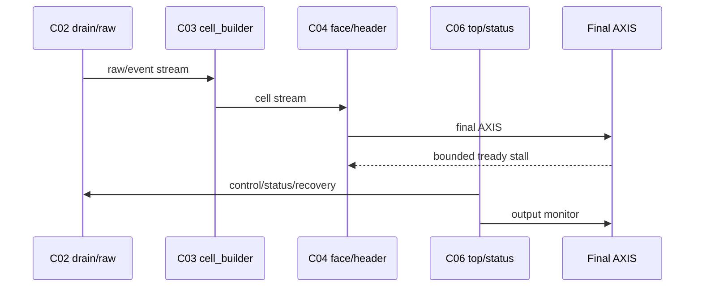
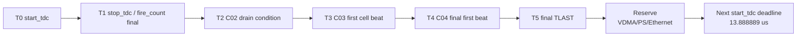

# C07 System Integration / Chain Hardening Plan v001

| 항목 | 내용 |
|---|---|
| 문서 종류 | C07 진입 계획 / C01-C06 chain hardening 계획 |
| 문서 버전 | v001 |
| 생성 시간 | 2026-05-14 15:15:07 KST |
| 수정 시간 | 2026-05-15 19:44:00 KST |
| Cluster | C07 System Integration / Release Readiness |
| 절대 기준 문서 | `Doc/TDC-GPX-Datasheet.pdf` |
| 입력 문서 | `cluster_analysis_260514151507_Chain_Integrity_Review_v001.md` |
| 이전 handoff | `C06_Control_Status_Integration_260514144755_C07_Handoff_v002.md` |
| 공식 Vivado 경로 | `C:\AMDDesignTools\2025.2.1\Vivado` |

## 1. 목적

C07의 목적은 C06 내부 RTL 수정이 아니라, C01부터 C06까지 쌓인 검증 chain이 release 판단에 충분한지 확인하는 것이다.

핵심은 다음 네 가지다.

1. C02에서 넘긴 `output stream CDC 전체 재설계` 계약을 실제 closure로 닫는다.
2. C06 v006에서 보강한 bounded backpressure가 C02->C03->C04->C06 전체 chain에서도 안전한지 확인한다.
3. C03/C04에서 직접 검증이 얕았던 항목을 별도 matrix로 보강한다.
4. polygon budget의 `8 us reserve`를 system 실측 또는 보수치로 바꿔 최종 거리 판단을 다시 한다.

## 2. C07 진입 판정

```text
C06 -> C07: GO_WITH_HARDENED_CONTRACT
C07 목적: system/release chain closure
```

| 구분 | 상태 |
|---|---|
| C06 recovery 32/64/128 | PASS, v006 hardening |
| C06 bounded backpressure 32/64/128 | PASS, v006 hardening |
| C06 rise/fall lane-only stall | PASS, v006 hardening |
| C06 sticky/Hit[16]/marker policy | 문서 계약 완료 |
| C02 output stream CDC 전체 재설계 | C07 P0 |
| C03 direct matrix | C07 P1 |
| C04 ready/header pending | C07 P1 |
| 8 us reserve | C07 P0, system measurement 필요 |

## 3. 작업 범위

| 범위 | 포함 여부 | 설명 |
|---|---|---|
| I-Mode single | 포함 | 프로젝트 운용 기준 |
| Quiet/M-mode/continuous | 제외 | 사용자 결정에 따라 이번 generation 범위 아님 |
| 32/64/128 output width | 포함 | 256-bit는 제외 |
| Hit[16] 최종 VDMA 보존 | 제외 | 이번 generation에서는 폐기 정책 유지 |
| Hit[16] SW/range 계약 | 포함 | 16-bit slot 운용 한계 명시 |
| board STA | 포함 | release readiness 판단 항목 |
| VDMA/PS/Ethernet reserve | 포함 | polygon budget 최종 근거 |

## 4. P0 작업

### 4.1 CHAIN-P0-01: Output Stream CDC 전체 재설계 Closure

질문:

> 현재 구조가 C02 handoff의 `output stream CDC 전체 재설계`로 인정 가능한가?

검토 대상:

| 대상 | 확인할 내용 |
|---|---|
| `tdc_gpx_config_ctrl.vhd` | raw acquisition CDC와 expected count CDC 경계 |
| `tdc_gpx_decode_pipe.vhd` | raw/event pipeline skid boundary |
| `tdc_gpx_cell_builder.vhd` | C03 cell stream 출력 clock/ready 경계 |
| `tdc_gpx_face_assembler.vhd` | input FIFO, elastic FIFO, ready path |
| `tdc_gpx_output_stage.vhd` | rise/fall output path와 final AXIS clock |
| `tdc_gpx_header_inserter.vhd` | final stream register boundary와 tkeep/tstrb |
| `tdc_gpx_top.vhd` | top-level clock domain과 output stream 연결 |

완료 기준:

| 결과 | 의미 |
|---|---|
| Accept current architecture | 현재 FIFO/skid/register boundary가 전체 CDC/ready 요구를 만족함을 문서화 |
| Patch required | 별도 async FIFO, skid FIFO, register stage 추가 필요 |
| Contract exception | 같은 clock 또는 bounded-stall system 계약으로 닫음 |

### 4.2 CHAIN-P0-02: End-to-End Output Ready/Stall Stress TB

목적은 C06 v006의 bounded stall PASS를 전체 data chain으로 확장하는 것이다.



검증 조건:

| 조건 | 값 |
|---|---|
| output width | 32/64/128 |
| mode | I-Mode single |
| max_hits_cfg | 1, 3, 5, 7 또는 기존 TB capability에 맞춘 단계적 sweep |
| downstream stall | bounded stall + lane-only stall |
| marker | source, destination, effect, output 모두 요구 |
| Vivado/xsim archive | `sim_results/vivado_xsim/sessions/<stamp>_c07_chain_stress/` |

완료 기준:

- expected beats/tlast가 width별로 보존된다.
- tuser/status fault 구분이 보존된다.
- bounded stall 중 false PASS marker가 발생하지 않는다.
- recovery command가 걸려도 output stream이 계약대로 drain 또는 reinit된다.

### 4.3 CHAIN-P0-03: Marker Audit Retro-Verification

C06 v003 false positive를 방지하기 위해, 과거 핵심 PASS 항목을 marker 기준으로 재점검한다.

| 대상 | 재점검 기준 |
|---|---|
| C02 OP-C02-04 downstream tuser boundary | 입력 source, downstream destination, tuser effect, output monitor 분리 |
| C04 Hit[16] sanitize | C03 입력 Hit[16], face_assembler sanitize effect, final AXIS output 비교 |
| C04 width beat/tlast | header/face source와 final AXIS output beat/tlast 비교 |

완료 기준:

| Marker | 필요 |
|---|---|
| Source | 원 입력 또는 명령 발생 확인 |
| Destination | 대상 stage에 도달 확인 |
| Effect | stage 내부 상태/데이터 변환 확인 |
| Output | 최종 stream/status 관측 확인 |

### 4.4 CHAIN-P0-04: 8 us Reserve 실측 / 보수치 갱신

현재 C04/C06 polygon budget은 사용자가 제시한 `8 us` VDMA/PS/Ethernet reserve를 사용한다. 이는 RTL/xsim 측정값이 아니다.

완료 기준:

| 결과물 | 내용 |
|---|---|
| measured reserve | VDMA -> PS -> Ethernet 경로 실측값 |
| conservative reserve | 실측 전 release 판단용 보수값 |
| updated distance table | 100 m부터 10 m 단위 또는 운용 후보 거리별 PASS/FAIL |
| width comparison | 32/64/128별 처리 시간과 margin |

## 5. P1 작업

### 5.1 CHAIN-P1-01: C03 Direct Matrix TB

C03는 C04 통합 PASS로 우회된 항목을 직접 닫는다.

| 항목 | 이유 |
|---|---|
| dual-buffer next-shot II | shot 간격이 짧을 때 collect/output ownership 확인 |
| IFIFO2 wait/timeout | stop3 이후 stop4..7 지연/timeout 처리 확인 |
| shot drop/quarantine | buffer full 또는 late shot 조건의 fault 경계 확인 |
| width/max_hits matrix | 32/64/128 및 max_hits_cfg 변화에 따른 cell output 확인 |
| rise/fall slope asymmetry | 한쪽 slope abort 또는 delay 시 다른 slope 보존 확인 |

### 5.2 CHAIN-P1-02: C04 Ready/Header Pending Direct TB

| 항목 | 이유 |
|---|---|
| face_assembler ready path | 새 코딩 규칙의 조합 depth/ready boundary 확인 |
| header_inserter face_start pending | tlast/frame_done과 새 face_start 충돌 확인 |
| output stall during header | header prefix 중 backpressure 보존 확인 |
| output stall during data | data pass-through 중 backpressure 보존 확인 |

### 5.3 CHAIN-P1-03: Hit[16] SW/Range 계약 확인

이번 generation은 최종 VDMA stream에서 Hit[16]을 버린다.

| 항목 | 값 |
|---|---|
| Datasheet raw hit | Hit[16:0] |
| final stream | Hit[15:0] |
| 81 ps bin 기준 16-bit direct time | 약 5.308 us |
| round-trip 거리 환산 | 약 796 m |
| 810 m 운용 | 16-bit direct range 초과 가능성 있음 |

완료 기준:

- SW parser가 16-bit hit slot을 명시적으로 수락한다.
- 810 m 근처 운용은 wrap/range 정책을 별도 문서로 가진다.
- 다음 generation Hit[16] 보존 검토 항목으로 다시 승계한다.

## 6. Timing / Latency / Throughput / Pipeline / II 분석 계획

| Metric | 측정 위치 | 기준 |
|---|---|---|
| C02 drain latency | GPX read trigger -> raw/event accepted | Datasheet read timing과 C01/C02 계약 |
| C03 cell latency | raw/event accepted -> cell output first beat | dual-buffer ownership 기준 |
| C04 output latency | cell accepted -> final AXIS first beat/tlast | face/header pipeline 기준 |
| C06 recovery latency | AXI/control command -> TDC domain effect | source/dest/effect marker |
| End-to-end II | shot_start interval -> next accepted shot | polygon 운용 13.888889 us 이하 |
| Throughput | final AXIS beat count / width | 32/64/128 비교 |
| Stall penalty | bounded tready stall -> tlast delay | width별 margin |



## 7. 검증 Matrix

| ID | 검증 | Width | Stall | Expected |
|---|---|---|---|---|
| C07-VB-01 | chain baseline | 32/64/128 | none | beat/tlast/tuser PASS |
| C07-VB-02 | bounded stall | 32/64/128 | final AXIS | beat/tlast preserved |
| C07-VB-03 | lane-only stall | 64 우선, 필요 시 32/128 | rise-only/fall-only | both lanes complete |
| C07-VB-04 | C03 dual-buffer II | 64 우선 | none/stall | no illegal drop |
| C07-VB-05 | IFIFO2 wait/timeout | 64 우선 | none | timeout/fault boundary correct |
| C07-VB-06 | C04 header pending | 32/64/128 | header/data stall | tlast/frame_done correct |
| C07-VB-07 | recovery during output | 32/64/128 | bounded stall | source/dest/effect/output PASS |
| C07-VB-08 | reserve distance table | 32/64/128 | measured/conservative reserve | PASS/FAIL margin table |

## 8. 산출물

| 산출물 | 파일명 규칙 |
|---|---|
| Chain stress result | `C07_System_Integration_<YYMMDDHHMMSS>_Chain_Stress_Result_v001.md/.pptx` |
| Marker audit result | `C07_System_Integration_<YYMMDDHHMMSS>_Marker_Audit_Result_v001.md/.pptx` |
| Reserve measurement result | `C07_System_Integration_<YYMMDDHHMMSS>_Reserve_Measurement_Result_v001.md/.pptx` |
| C03 direct matrix result | `C07_System_Integration_<YYMMDDHHMMSS>_C03_Direct_Matrix_Result_v001.md/.pptx` |
| C04 direct matrix result | `C07_System_Integration_<YYMMDDHHMMSS>_C04_Direct_Matrix_Result_v001.md/.pptx` |
| Final readiness | `C07_System_Integration_<YYMMDDHHMMSS>_Release_Readiness_v001.md/.pptx` |
| Vivado/xsim archive | `sim_results/vivado_xsim/sessions/<stamp>_c07_<label>/` |

## 9. 사용자 판단 필요 항목

| 항목 | 기본 권고 |
|---|---|
| `output stream CDC 전체 재설계`를 현재 구조 수락으로 닫을지 | RTL boundary audit 후 판단 |
| VDMA/PS/Ethernet reserve를 실측할지, 보수값으로 둘지 | 실측 우선 |
| 810 m 운용을 8 us reserve에서 허용할지 | 현재 v006 보수 계산 기준으로는 margin 부족 |
| Hit[16] 폐기를 SW parser가 명시 수락할지 | SW 계약 문서 필요 |

## 10. Lineage

| 이전 문서 | 이번 반영 |
|---|---|
| `cluster_analysis_260514151507_Chain_Integrity_Review_v001.md` | 사용자 chain integrity 리뷰를 최신 v006 기준으로 보정하고 C07 P0/P1 계획으로 전개 |
| `C06_Control_Status_Integration_260514144755_C07_Handoff_v002.md` | `GO_WITH_HARDENED_CONTRACT`를 C07 system/release 조건부 진입으로 해석 |
| `C02_Chip_Acquisition_260430233213_Cluster2_Readiness_Review_v001.md` | `output stream CDC 전체 재설계` 미종결 항목을 C07 P0로 승격 |
| `C03_Cell_Pipe_260501022223_Analysis_v001.md` | C03 direct matrix 미검증 항목을 C07 P1로 승격 |
| `C04_Output_Stage_260501030046_Plan_v002.md` | ready/header pending 검증 항목을 C07 P1로 승격 |

## 11. v001 실행 반영 기록

| 실행 결과 문서 | 반영 내용 |
|---|---|
| `C07_System_Integration_260514153208_Chain_Stress_Result_v001.md` | P0-01 output stream CDC는 RTL 내부 architecture contract로 닫고, P0-02 width/max_hits/bounded-stall chain stress는 PASS로 닫았다. P0-03 marker audit, P0-04 reserve measurement, P1 C03/C04 direct matrix는 후속으로 유지한다. |
| `C07_System_Integration_260515162050_Marker_Audit_Result_v001.md` | P0-03 marker audit를 Source/Destination/Effect/Output 기준으로 수행했다. C02 downstream `tuser`는 `PASS_WITH_TRACE`, C04 `Hit[16]` sanitize와 C04/C07 width beat/tlast는 `PASS`로 판정했고, P0-04 reserve measurement 및 P1 C03/C04 direct matrix는 후속으로 유지했다. |
| `C07_System_Integration_260515174538_Reserve_Budget_Result_v001.md` | P0-04를 8/9/10/11/12us reserve sensitivity xsim으로 수행했다. 8us는 128-bit 810m cfg7 PASS지만 margin 38.69ns로 얇고, 9us 보수 reserve에서는 128-bit cfg7이 660m까지로 내려간다. 실제 VDMA/PS/Ethernet 실측은 release gate로 분리했다. |
| `C07_System_Integration_260515191624_C03_Direct_Matrix_Result_v001.md` | P1 `CHAIN-P1-01`을 C03 direct TB로 수행했다. 32/64/128 bit x max_hits 1/3/5/7 matrix, IFIFO2 timeout 32/64/128, dual-buffer next-shot II, no-free-buffer drop/quarantine clean exit, 기존 cell_pipe slope abort 회귀가 PASS했다. |
| `C07_System_Integration_260515194251_C04_Direct_Matrix_Result_v001.md` | P1 `CHAIN-P1-02`를 C04 direct TB로 수행했다. `face_assembler` ready/stall boundary는 32/64/128 bit에서 order, TLAST, row_done, metadata sanitize를 보존했고, `header_inserter`는 `ST_DRAIN_LAST`에서 다음 `face_start`를 pending latch한 뒤 2-frame SOF/TLAST/frame_done을 PASS했다. |

## 12. 현재 진행 상태

| 우선순위 | 항목 | 현재 상태 | 다음 계획 |
|---|---|---|---|
| P0 | CHAIN-P0-01 output stream CDC closure | Closed in RTL scope | external VDMA clock CDC/STA는 system item으로 유지 |
| P0 | CHAIN-P0-02 end-to-end ready/stall stress TB | PASS | 결과 유지 |
| P0 | CHAIN-P0-03 marker audit retro-verification | Closed by marker audit | release bundle 필요 시 C02 tuser historical logs 재패키징 |
| P0 | CHAIN-P0-04 8 us reserve 측정/보수치 갱신 | Closed for RTL/xsim sensitivity | system 실측 또는 보수 reserve 선택은 release gate로 유지 |
| P1 | CHAIN-P1-01 C03 direct matrix TB | Closed | `C07_System_Integration_260515191624_C03_Direct_Matrix_Result_v001.md`에서 17개 xsim + 기존 C03 regression PASS |
| P1 | CHAIN-P1-02 C04 ready/header pending direct TB | Closed | `C07_System_Integration_260515194251_C04_Direct_Matrix_Result_v001.md`에서 6개 xsim PASS |
| P1 | CHAIN-P1-03 Hit[16] SW/range 계약 | Open | P0-04 이후 거리 정책과 함께 정리 |
