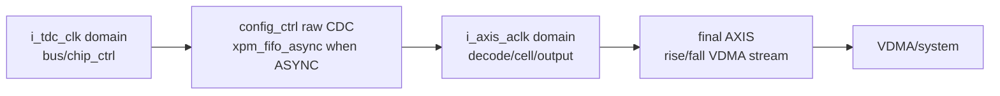
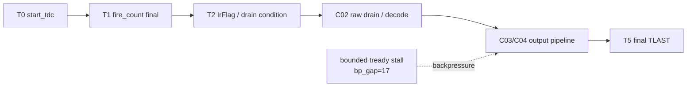

# C07 System Integration Chain Stress Result v001

| 항목 | 내용 |
|---|---|
| 문서 종류 | C07 P0-01/P0-02 실행 결과 |
| 문서 버전 | v001 |
| 생성 시간 | 2026-05-14 15:32:08 KST |
| 수정 시간 | 2026-05-14 15:46:30 KST |
| Cluster | C07 System Integration / Chain Hardening |
| 절대 기준 문서 | `Doc/TDC-GPX-Datasheet.pdf` |
| 입력 계획 | `Doc/cluster_analysis/C07_System_Integration/C07_System_Integration_260514151507_Plan_v001.md` |
| 실행 스크립트 | `scripts/run_c07_v001_chain_stress.ps1 -Stamp 260514153208` |
| Vivado/xsim | `C:\AMDDesignTools\2025.2.1\Vivado` |
| archive session | `sim_results/vivado_xsim/sessions/260514153208_c07_v001_chain_stress/` |

## 1. 결론

C07 P0의 첫 실행은 PASS다.

| ID | 항목 | 결과 | 판단 |
|---|---|---|---|
| CHAIN-P0-01 | output stream CDC 전체 재설계 closure | Closed as RTL architecture contract | top 내부는 raw CDC 이후 전부 `i_axis_aclk` 단일 stream domain이다. final VDMA가 다른 clock이면 외부 CDC FIFO가 system 항목으로 필요하다. |
| CHAIN-P0-02 | C02->C06 output ready/stall end-to-end stress TB | PASS | 32/64/128 width x max_hits 1/3/5/7 x 2 faces x bounded backpressure 모두 beat/tlast 보존 |
| CHAIN-P0-03 | C02/C04 marker audit retro-verification | Not executed in this run | 다음 C07 marker audit 결과 문서로 분리 |
| CHAIN-P0-04 | 8 us reserve 실측/보수치 갱신 | Not executed in this run | board/VDMA/PS/Ethernet system 측정 필요 |

즉, C02에서 넘어온 `output stream CDC 전체 재설계`는 RTL 내부 관점에서는 “현재 구조 수락 + system clock 계약”으로 닫을 수 있다. 그러나 VDMA/PS/Ethernet 경로가 `i_axis_aclk`와 다른 clock이면 top 외부 CDC FIFO 또는 VDMA clocking 계약이 반드시 필요하다.

## 2. 코드 보완

| 파일 | 변경 | 근거 |
|---|---|---|
| `tb_tdc_gpx_top_int.vhd` | `G_MAX_HITS_OVERRIDE` generic 추가. `0`이면 거리 기반, `1..7`이면 CTL21 max_hits 직접 강제 | `tb_tdc_gpx_top_int.vhd:76`, `:131`, `:141`, `:1178` |
| `tb_tdc_gpx_top_int.vhd` | `G_STREAM_CLK_MODE` generic 추가 및 `tdc_gpx_top.g_STREAM_CLK_MODE`로 pass-through | `tb_tdc_gpx_top_int.vhd:92`, `:605` |
| `tb_tdc_gpx_top_int.vhd` | summary에 `max_hits_override`, `stream_clk_mode` 출력 | `tb_tdc_gpx_top_int.vhd:1272`, `:1274` |
| `scripts/run_c07_v001_chain_stress.ps1` | width 32/64/128, max_hits 1/3/5/7, 2-face, bounded backpressure sweep 추가 | `scripts/run_c07_v001_chain_stress.ps1:79-95` |
| `scripts/run_c07_v001_chain_stress.ps1` | CTL21 late-write scenario 추가 | `scripts/run_c07_v001_chain_stress.ps1:99-113` |
| `scripts/run_c07_v001_chain_stress.ps1` | 실행 후 공식 xsim archive 이동 | `scripts/run_c07_v001_chain_stress.ps1:117` |

## 3. Output CDC / Ready Architecture Audit

### 3.1 Top 내부 clock domain



| 구간 | clock | CDC/ready boundary | 코드 근거 |
|---|---|---|---|
| GPX bus/chip_ctrl -> raw stream | `i_tdc_clk` -> `i_axis_aclk` | `g_STREAM_CLK_MODE="ASYNC"`이면 `xpm_fifo_async` | `tdc_gpx_top.vhd:42`, `tdc_gpx_config_ctrl.vhd:67`, `tdc_gpx_config_ctrl.vhd:1909` |
| decode_pipe -> cell_pipe | `i_axis_aclk` | 같은 clock. skid/register boundary는 module 내부 | `tdc_gpx_top.vhd:645-676` |
| cell_pipe -> output_stage | `i_axis_aclk` | same-domain AXIS ready/valid | `tdc_gpx_top.vhd:735`, `tdc_gpx_top.vhd:741` |
| face_assembler input/output | `i_axis_aclk` | input XPM FIFO + sync elastic FIFO + output XPM FIFO | `tdc_gpx_face_assembler.vhd:362`, `:391-408`, `:435`, `:448` |
| output_stage face/header | `i_axis_aclk` | rise/fall XPM FIFO + header FSM | `tdc_gpx_output_stage.vhd:338`, `:382`, `tdc_gpx_header_inserter.vhd:326` |
| final VDMA stream | `i_axis_aclk` | top 내부에는 추가 CDC 없음. `i_m_axis_tready`는 같은 clock 계약 | `tdc_gpx_top.vhd:794` |

### 3.2 Closure 판단

| 질문 | 판단 |
|---|---|
| C02 handoff의 `output stream CDC 전체 재설계`가 top 내부 RTL에서 필요한가? | raw CDC 이후 output path는 모두 `i_axis_aclk` 단일 domain이므로 top 내부에는 별도 output CDC가 필요하지 않다. |
| 현재 구조가 ready/backpressure를 감당하는가? | bounded backpressure 기준 32/64/128 x max_hits 1/3/5/7에서 PASS했다. |
| final VDMA clock이 `i_axis_aclk`와 다르면? | top 외부에 AXIS CDC FIFO 또는 VDMA clock 계약이 필요하다. 이번 RTL/xsim은 이 system 항목을 검증하지 않는다. |
| 결론 | `CHAIN-P0-01`은 RTL scope에서는 `Accept current architecture with system clock contract`로 닫는다. system release scope에서는 외부 VDMA CDC/STA가 C07 후속이다. |

## 4. 공식 실행 결과

```powershell
powershell -NoProfile -ExecutionPolicy Bypass -File scripts\run_c07_v001_chain_stress.ps1 -Stamp 260514153208
```

| 항목 | 결과 |
|---|---|
| exit code | 0 |
| archive session | `sim_results/vivado_xsim/sessions/260514153208_c07_v001_chain_stress/` |
| artifact count | 71 |
| simulate logs | 19 |
| compile/elaborate logs | compile 2, elaborate 19 |
| failure/error scan | no `Failure:`, `ERROR:`, `failed` marker in simulate logs |

Baseline evidence:

| Test | Result | Evidence |
|---|---|---|
| face_seq baseline | PASS | `logs/simulate/xsim_c06_v002_face_seq_260514153208.log:54` |
| status_agg baseline | PASS | `logs/simulate/xsim_c06_v002_status_agg_260514153208.log:34` |
| top_int baseline 32/64/128 | PASS | `xsim_c06_v002_top_int_w32/w64/w128_260514153208.log` |
| top_int baseline 64-bit bounded BP | PASS | `xsim_c06_v002_top_int_w64_bp_260514153208.log` |

## 5. Chain Stress Matrix

조건은 공통으로 `faces=2`, `cols=2`, active chip 4, stops_per_chip 2, `bp_gap=17`, `stream_clk_mode=ASYNC`이다.

| Width | max_hits | Expected beats / lane | TLAST / lane | First shot T2->T5 | Last output cycle | Result |
|---:|---:|---:|---:|---:|---:|---|
| 32 | 1 | 112 | 4 | 100 clk / 0.500 us | 9401 | PASS |
| 32 | 3 | 144 | 4 | 108 clk / 0.540 us | 9410 | PASS |
| 32 | 5 | 176 | 4 | 115 clk / 0.575 us | 9417 | PASS |
| 32 | 7 | 208 | 4 | 124 clk / 0.620 us | 9427 | PASS |
| 64 | 1 | 88 | 4 | 100 clk / 0.500 us | 9401 | PASS |
| 64 | 3 | 88 | 4 | 100 clk / 0.500 us | 9401 | PASS |
| 64 | 5 | 120 | 4 | 108 clk / 0.540 us | 9410 | PASS |
| 64 | 7 | 120 | 4 | 108 clk / 0.540 us | 9410 | PASS |
| 128 | 1 | 76 | 4 | 100 clk / 0.500 us | 9401 | PASS |
| 128 | 3 | 76 | 4 | 100 clk / 0.500 us | 9401 | PASS |
| 128 | 5 | 76 | 4 | 100 clk / 0.500 us | 9401 | PASS |
| 128 | 7 | 76 | 4 | 100 clk / 0.500 us | 9401 | PASS |

대표 evidence:

| Case | Evidence |
|---|---|
| 32-bit max_hits=7 | `logs/simulate/xsim_c07_v001_top_int_w32_mh7_bp_260514153208.log:161`, PASS `:167`, `:169` |
| 64-bit max_hits=7 | `logs/simulate/xsim_c07_v001_top_int_w64_mh7_bp_260514153208.log:161`, PASS `:167`, `:169` |
| 128-bit max_hits=7 | `logs/simulate/xsim_c07_v001_top_int_w128_mh7_bp_260514153208.log:161`, PASS `:167`, `:169` |

해석:

- 32-bit는 max_hits 증가가 beat 수와 T2->T5에 직접 반영된다.
- 64-bit는 packing 경계 때문에 max_hits 1/3이 같은 beat 수, 5/7이 같은 beat 수로 묶인다.
- 128-bit는 현재 조건에서 max_hits 1/3/5/7이 모두 같은 beat 수로 packing된다.
- 따라서 “넓은 bus는 빨라진다”는 판단은 맞지만, 이득은 raw/event 의미가 아니라 output packing quantization과 active geometry에 의해 계단식으로 나타난다.

## 6. CTL21 Late-Write Scenario

`G_MAX_HITS_WRITE_MODE=3`, `G_MAX_HITS_OVERRIDE=3`, `G_N_FACES=2`, 64-bit bounded backpressure 조건도 PASS했다.

| 항목 | Evidence |
|---|---|
| early write 생략 | `xsim_c07_v001_top_int_w64_late_mh3_260514153208.log:55` |
| first packet_start 이후 CTL21 write | `xsim_c07_v001_top_int_w64_late_mh3_260514153208.log:98` |
| summary | `xsim_c07_v001_top_int_w64_late_mh3_260514153208.log:162` |
| bounded BP PASS | `xsim_c07_v001_top_int_w64_late_mh3_260514153208.log:168` |
| output PASS | `xsim_c07_v001_top_int_w64_late_mh3_260514153208.log:170` |

의미:

- `max_hits_cfg`를 face/shot 시작 전에 설정해야 output width 이득이 예측 가능하다는 기존 판단은 유지된다.
- late write는 동작상 PASS하지만, 첫 face와 이후 face의 beat budget이 달라지는 운용이므로 release 기본 전략으로 권장하지 않는다.

## 7. Timing / Latency / Throughput / Pipeline / II



| Metric | 결과 | 판단 |
|---|---|---|
| Source marker | `T0_START_TDC`, `T1_FIRE_COUNT_FINAL`, `T2_IRFLAG_ASSERT` | source/control marker 존재 |
| Destination/effect marker | raw CDC ASYNC marker + expected-count drain exact read | GPX read/drain 경계 확인 |
| Output marker | `T4_FIRST_*_BEAT`, `T5_*_TLAST`, beat/tlast summary | final stream 보존 확인 |
| Beat II | ready high window에서는 1 beat/clk | bounded stall은 tready low cycle만큼 지연 |
| Throughput | 32-bit max_hits=7: 208 beats/lane, 64-bit: 120, 128-bit: 76 | width 증가에 따라 final beat 수 감소 |
| Worst first-shot T2->T5 in this run | 32-bit max_hits=7, 124 clk / 0.620 us | C06 v006보다 큰 조건에서도 통과 |
| Shot/face II | 2 faces x 2 cols에서 shot sequence 유지 | 더 짧은 polygon interval stress는 C07 reserve/II 후속 |

주의:

- `T4_FIRST_*_BEAT`는 header prefix의 첫 beat일 수 있어, raw data first beat와 동일한 의미가 아니다.
- `T2->T5`는 첫 shot의 drain condition부터 해당 line TLAST까지의 관찰값이다.
- full system II는 VDMA/PS/Ethernet reserve와 다음 `start_tdc` deadline을 합쳐 판단해야 하므로 C07 P0-04가 남는다.

## 8. 남은 항목

| ID | 남은 이유 | 다음 산출물 |
|---|---|---|
| CHAIN-P0-03 | C02 OP-C02-04와 C04 sanitize/width 과거 PASS marker의 source/dest/effect/output audit은 아직 별도 수행 전 | `C07_System_Integration_<stamp>_Marker_Audit_Result_v001` |
| CHAIN-P0-04 | `8 us reserve`는 RTL/xsim 값이 아니라 system 가정 | `C07_System_Integration_<stamp>_Reserve_Measurement_Result_v001` |
| CHAIN-P1-01 | C03 dual-buffer/IFIFO2/drop/quarantine 전용 direct TB는 아직 별도 수행 전 | `C07_System_Integration_<stamp>_C03_Direct_Matrix_Result_v001` |
| CHAIN-P1-02 | C04 ready/header pending direct TB는 아직 별도 수행 전 | `C07_System_Integration_<stamp>_C04_Direct_Matrix_Result_v001` |

## 9. Plan v001 반영

| Plan v001 항목 | 이번 결과 |
|---|---|
| P0-01 output stream CDC closure | RTL scope closed as architecture contract. External VDMA CDC remains system item. |
| P0-02 end-to-end output ready/stall stress TB | Closed / PASS |
| P0-03 marker audit | Remains open |
| P0-04 reserve measurement | Remains open |

