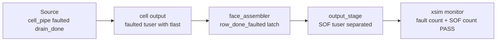
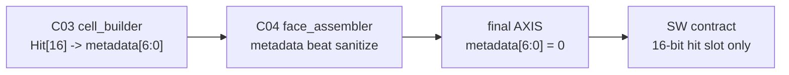
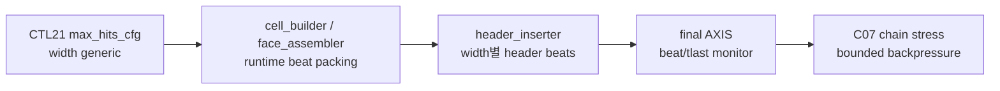
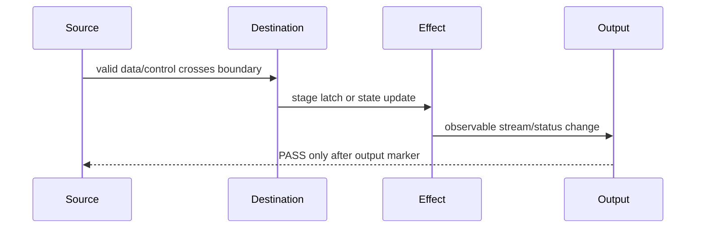

# C07 System Integration Marker Audit Result v001

| 항목 | 내용 |
|---|---|
| 문서 종류 | C07 P0-03 Marker Audit Retro-Verification 결과 |
| 문서 버전 | v001 |
| 생성 시간 | 2026-05-15 16:20:50 KST |
| 수정 시간 | 2026-05-15 16:23:50 KST |
| Cluster | C07 System Integration / Release Readiness |
| 절대 기준 문서 | `Doc/TDC-GPX-Datasheet.pdf` |
| 입력 계획 | `Doc/cluster_analysis/C07_System_Integration/C07_System_Integration_260514151507_Plan_v001.md` |
| 직전 결과 | `Doc/cluster_analysis/C07_System_Integration/C07_System_Integration_260514153208_Chain_Stress_Result_v001.md` |
| Vivado/xsim 기준 경로 | `C:\AMDDesignTools\2025.2.1\Vivado` |

## 1. 목적

C06 v003에서 `force_reinit PASS`가 실제 TDC domain 효과 관측 없이 source 쪽 marker만으로 PASS 처리된 false positive가 있었다. 따라서 과거 C02/C04에서 PASS로 닫힌 핵심 항목을 다음 4단계 marker 기준으로 재점검한다.

| 단계 | 의미 | 이 문서의 판정 기준 |
|---|---|---|
| Source | 입력 자극, 명령, 또는 데이터 의미가 발생했는가 | TB stimulus, CTL 설정, metadata 생성 위치 |
| Destination | 다음 stage 경계까지 전달됐는가 | FIFO/AXIS handshake, submodule 입력 latch |
| Effect | stage 내부 상태 또는 data 변환이 실제 발생했는가 | fault latch, sanitize, beat/tlast 계산 |
| Output | 최종 stream/status에서 관측됐는가 | xsim log, monitor counter, assert/PASS |

이번 문서는 RTL 수정 없이 기존 C02/C04 증거와 C07 fresh chain stress 결과를 audit한다. 새 xsim은 실행하지 않았다.

## 2. 결론

| ID | 대상 | 판정 | 판단 |
|---|---|---|---|
| MA-C07-01 | C02 OP-C02-04 downstream `tuser` boundary | PASS_WITH_TRACE | source, destination, effect, output marker가 분리되어 존재한다. 다만 C07 archive 안에 재실행 로그를 묶은 형태는 아니므로 release bundle에는 historical evidence로 연결한다. |
| MA-C07-02 | C04 `Hit[16]` final VDMA sanitize | PASS | C03 cell metadata의 `Hit[16]` 의미가 C04 face_assembler에서 명시적으로 제거되고, final AXIS monitor가 `[6:0]=0`을 검사한다. |
| MA-C07-03 | C04/C07 width별 beat/tlast 보존 | PASS | C04 direct evidence와 C07 fresh chain stress가 32/64/128 x max_hits 1/3/5/7에서 beat/tlast 보존을 확인했다. |
| MA-C07-04 | C04 ready/header pending direct 검증 | REMAINS_P1 | 이번 marker audit의 대상은 아니며, C07 Plan v001 P1-02로 유지한다. |
| MA-C07-05 | VDMA/PS/Ethernet `8 us reserve` | REMAINS_P0 | system 측정 또는 보수치 갱신이 필요하며, P0-04로 유지한다. |

따라서 C07 P0-03은 `Closed by marker audit`로 닫는다. 단, C02 historical log를 C07 session archive로 재생성하는 작업은 P2 release packaging 개선으로 남긴다.

## 3. Marker Audit A: C02 OP-C02-04 downstream tuser boundary

### 3.1 운용 의미

C02 이후 downstream `tuser`는 final VDMA stream의 `tuser`와 같은 의미가 아니다. 중간 cell/face 경계에서는 row fault 또는 corrupted slice를 전달하는 control 의미이고, final output stream에서는 `m_axis_tuser(0)`이 SOF로 사용된다. 따라서 "tuser가 전달됐다"가 아니라 "fault 의미가 downstream status로 보존되고 final SOF 의미와 충돌하지 않는다"가 검증 기준이다.

### 3.2 4단계 근거

| Marker | 근거 | 해석 |
|---|---|---|
| Source | `tb_tdc_gpx_cell_pipe.vhd:166`, `:172`, `:228` | final drain_done control beat에서 faulted bit를 생성한다. |
| Destination | `tb_tdc_gpx_cell_pipe.vhd:275`, `:292-293` | `o_cell_rise_tuser(0)`가 `tlast`와 같은 beat에서 assert되는지 checker가 확인한다. |
| Destination | `tdc_gpx_face_assembler.vhd:598-600` | face_assembler가 `s_in_tvalid`, `s_in_tready`, `s_in_tlast`, `s_in_tuser`가 동시에 성립할 때 faulted row 조건으로 수신한다. |
| Effect | `tdc_gpx_face_assembler.vhd:692`, `:807`, `:860`, `:906`, `:1022` | row fault를 `s_row_done_faulted_r`에 fold하고 `o_row_done_faulted`로 출력한다. |
| Output | `C02_Chip_Acquisition_260430224233_Downstream_TUSER_Boundary_Fix_v001.md`, section 6 | `xsim_cell_pipe_tuser.log:28`, `xsim_output_stage_tuser.log:42`, `:56`로 PASS가 기록되어 있다. |
| Output | `tb_tdc_gpx_output_stage.vhd:338`, `:356-360`, `:787-804` | final `m_axis_tuser(0)`은 SOF count로 별도 확인되고, row fault와 final VDMA tuser 의미가 섞이지 않도록 검사한다. |

### 3.3 판정

`PASS_WITH_TRACE`로 판정한다. C06 false positive와 달리 source만 본 것이 아니라, cell output tlast/tuser, face row fault latch, output SOF/fault count가 분리되어 있다. 다만 이 항목의 xsim log는 C07 fresh archive가 아니라 C02 historical evidence에 있으므로, release package에서 하나의 archive만 요구하면 재실행 스크립트를 만드는 편이 좋다.

## 4. Marker Audit B: C04 Hit[16] final VDMA sanitize

### 4.1 운용 의미

Datasheet의 raw hit는 `Hit[16:0]`이다. 현재 generation에서는 사용자 결정에 따라 final VDMA stream에서 `Hit[16]`을 버리고 `Hit[15:0]`만 보존한다. 따라서 marker audit의 목적은 `Hit[16]`이 실수로 final VDMA metadata 영역에 남지 않는지 확인하는 것이다.

### 4.2 4단계 근거

| Marker | 근거 | 해석 |
|---|---|---|
| Source | `tdc_gpx_cell_builder.vhd:79`, `:403`, `:428` | C03 cell metadata에서 `hit_msb_vec[6:0]`가 Datasheet `Hit[16]` 의미로 생성된다. |
| Destination | `tdc_gpx_face_assembler.vhd:826-827` | face_assembler가 chip slice data beat를 선택해 `v_sanitized_tdata`로 받는다. |
| Effect | `tdc_gpx_face_assembler.vhd:829`, `:831` | metadata beat이면 `v_sanitized_tdata(6 downto 0)`을 0으로 clear한 뒤 pipe data로 등록한다. |
| Output | `tb_tdc_gpx_output_stage.vhd:350-352`, `:385-387` | final stream monitor가 metadata beat의 `[6:0]`이 0이 아니면 sanitize fail로 기록한다. |
| Output | `tb_tdc_gpx_output_stage.vhd:542-566`, `:803-804` | max_hits sweep 및 scenario 2에서 metadata count와 sanitize assert가 존재한다. |
| Output | `C04_Output_Stage_260501031720_Result_v001.md`, section 4 | 32/64/128 direct output stage sim이 sanitize PASS를 기록한다. |

### 4.3 판정

`PASS`로 판정한다. `Hit[16]`은 C03 내부 metadata로 존재하지만 C04 final VDMA 출력에서 제거된다. 이 판정은 "Hit[16] 폐기 정책이 구현됐다"는 의미이며, "긴 거리 운용에서 16-bit hit slot만으로 충분하다"는 의미는 아니다. Hit[16] 폐기와 운용 거리/wrap 의미는 C07 P1-03 SW/range 계약으로 남아야 한다.

## 5. Marker Audit C: C04/C07 width별 beat/tlast 보존

### 5.1 운용 의미

32/64/128-bit output width는 raw/event 내부 의미를 바꾸는 기능이 아니라, cell/output packing과 final AXIS beat 수를 바꾸는 기능이다. 넓은 bus는 같은 의미량을 더 적은 beat로 내보내므로 throughput margin을 개선한다. 다만 packing quantization 때문에 max_hits_cfg 변화가 항상 선형으로 beat 수에 반영되지는 않는다.

### 5.2 4단계 근거

| Marker | 근거 | 해석 |
|---|---|---|
| Source | `scripts/run_c07_v001_chain_stress.ps1:79-90` | width 32/64/128과 max_hits 1/3/5/7 matrix를 생성한다. |
| Source | `tb_tdc_gpx_top_int.vhd:76`, `:90-92`, `:1178` | `G_MAX_HITS_OVERRIDE`, `G_STREAM_CLK_MODE` generic으로 top integration TB를 제어한다. |
| Destination | `tb_tdc_gpx_top_int.vhd:605`, `:671`, `:693`, `:701` | generic이 top으로 전달되고 final rise/fall AXIS tlast가 monitor로 연결된다. |
| Effect | `tb_tdc_gpx_top_int.vhd:754-782`, `:1266-1307` | T5 TLAST marker와 summary beat/tlast count가 수집되고 mismatch assert가 존재한다. |
| Output | `tb_tdc_gpx_top_int.vhd:1325`, `:1335` | bounded backpressure와 output beats/tlast PASS marker가 분리되어 출력된다. |
| Output | `C07_System_Integration_260514153208_Chain_Stress_Result_v001.md`, section 5 | 32/64/128 x max_hits 1/3/5/7 x 2 faces x bounded backpressure PASS matrix가 기록됐다. |

### 5.3 C07 fresh matrix 요약

| Width | max_hits | Expected beats/lane | TLAST/lane | First-shot T2->T5 | 판정 |
|---:|---:|---:|---:|---:|---|
| 32 | 1 / 3 / 5 / 7 | 112 / 144 / 176 / 208 | 4 | 0.500 / 0.540 / 0.575 / 0.620 us | PASS |
| 64 | 1 / 3 / 5 / 7 | 88 / 88 / 120 / 120 | 4 | 0.500 / 0.500 / 0.540 / 0.540 us | PASS |
| 128 | 1 / 3 / 5 / 7 | 76 / 76 / 76 / 76 | 4 | 0.500 us all | PASS |

대표 근거:

| Case | Evidence |
|---|---|
| 32-bit max_hits=7 | `sim_results/vivado_xsim/sessions/260514153208_c07_v001_chain_stress/logs/simulate/xsim_c07_v001_top_int_w32_mh7_bp_260514153208.log:161`, `:167`, `:169` |
| 64-bit max_hits=7 | `sim_results/vivado_xsim/sessions/260514153208_c07_v001_chain_stress/logs/simulate/xsim_c07_v001_top_int_w64_mh7_bp_260514153208.log:161`, `:167`, `:169` |
| 128-bit max_hits=7 | `sim_results/vivado_xsim/sessions/260514153208_c07_v001_chain_stress/logs/simulate/xsim_c07_v001_top_int_w128_mh7_bp_260514153208.log:161`, `:167`, `:169` |

### 5.4 판정

`PASS`로 판정한다. C04 direct output-stage 결과와 C07 fresh top integration chain stress가 같은 방향으로 닫혔다. 32-bit는 max_hits 증가가 beat와 T2->T5 지연에 직접 반영되고, 64/128-bit는 packing 경계 때문에 계단형으로 반영된다.

## 6. Timing / Latency / Throughput / Pipeline / II 영향

이번 marker audit 자체는 RTL 변경이 없으므로 latency, throughput, pipeline, II를 변경하지 않는다. 다만 false positive 방지 관점에서 marker를 다음과 같이 해석해야 한다.

| 항목 | 영향 | 근거와 판단 |
|---|---|---|
| Latency | 변경 없음 | sanitize는 `face_assembler` 기존 register path에서 data bit를 clear하는 동작이다. 별도 stage가 추가되지 않았다. |
| Throughput | 변경 없음 | width throughput은 C07 chain stress의 beat 수 감소로 이미 반영됐다. marker audit는 throughput을 재산출하지 않는다. |
| Pipeline | 변경 없음 | source/destination/effect/output marker를 분리해 해석할 뿐, 파이프라인 stage를 추가하지 않는다. |
| II (Initiation Interval) | 변경 없음 | bounded backpressure에서 beat/tlast 보존이 확인됐지만, polygon deadline과 VDMA/PS/Ethernet reserve는 P0-04에서 다시 결합해야 한다. |
| Timing diagram | marker 기준 보강 | T0/T1/T2/T5만으로 PASS를 선언하지 않고, effect marker와 output marker가 모두 있어야 한다. |

## 7. 남은 항목

| 우선순위 | 항목 | 상태 | 다음 조치 |
|---|---|---|---|
| P0 | CHAIN-P0-04 `8 us reserve` 측정/보수치 갱신 | Open | VDMA/PS/Ethernet 측정값 또는 보수 reserve 값을 정하고 distance budget을 재산출한다. |
| P1 | CHAIN-P1-01 C03 direct matrix TB | Open | dual-buffer, IFIFO2 wait/timeout, shot drop/quarantine, rise/fall asymmetry를 C03 단독 TB로 확인한다. |
| P1 | CHAIN-P1-02 C04 ready/header pending direct TB | Open | header/data stall, face_start pending, ready boundary를 직접 검증한다. |
| P1 | CHAIN-P1-03 Hit[16] SW/range 계약 | Open | final VDMA 16-bit hit slot 정책과 운용 거리/wrap 정책을 SW 계약 문서로 고정한다. |
| P2 | Historical log repackaging | Optional | C02 tuser historical logs를 C07 archive에 재실행/재수집해 release package 추적성을 개선한다. |

## 8. Plan v001 반영

| Plan 항목 | 이번 결과 |
|---|---|
| CHAIN-P0-01 output stream CDC closure | 직전 Chain Stress Result v001에서 RTL scope closed, external VDMA CDC/STA remains system item으로 정리됨 |
| CHAIN-P0-02 end-to-end ready/stall stress TB | 직전 Chain Stress Result v001에서 PASS |
| CHAIN-P0-03 marker audit | 이 문서에서 `Closed by marker audit` |
| CHAIN-P0-04 reserve measurement | Open, 다음 P0 작업 |

## 9. Lineage

| 이전 문서 | 이번 반영 |
|---|---|
| `C07_System_Integration_260514151507_Plan_v001.md` | P0-03 실행 결과를 marker audit 문서로 생성하고, source/destination/effect/output 판정 기준을 실제 대상에 적용 |
| `C07_System_Integration_260514153208_Chain_Stress_Result_v001.md` | P0-01/P0-02 PASS를 fresh chain evidence로 사용하고, P0-03 open 항목을 본 문서에서 닫음 |
| `C02_Chip_Acquisition_260430224233_Downstream_TUSER_Boundary_Fix_v001.md` | C02 OP-C02-04의 historical xsim evidence를 marker chain 기준으로 재해석 |
| `C04_Output_Stage_260501031720_Result_v001.md` | Hit[16] sanitize 및 width beat/tlast direct evidence를 C07 release audit에 연결 |
