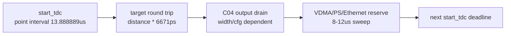

# C07 System Integration Reserve Budget Result v001

| 항목 | 내용 |
|---|---|
| 문서 종류 | C07 P0-04 `8 us reserve` 실측/보수치 갱신 결과 |
| 문서 버전 | v001 |
| 생성 시간 | 2026-05-15 17:45:38 KST |
| 수정 시간 | 2026-05-15 17:48:50 KST |
| Cluster | C07 System Integration / Release Readiness |
| 절대 기준 문서 | `Doc/TDC-GPX-Datasheet.pdf` |
| 입력 계획 | `Doc/cluster_analysis/C07_System_Integration/C07_System_Integration_260514151507_Plan_v001.md` |
| 직전 결과 | `Doc/cluster_analysis/C07_System_Integration/C07_System_Integration_260515162050_Marker_Audit_Result_v001.md` |
| 실행 스크립트 | `scripts/run_c07_v001_reserve_budget.ps1 -Stamp 260515174807` |
| Vivado/xsim 기준 경로 | `C:\AMDDesignTools\2025.2.1\Vivado` |
| xsim archive | `sim_results/vivado_xsim/sessions/260515174807_c07_v001_reserve_budget/` |

## 1. 목적

C04 polygon budget은 사용자가 제시한 `VDMA + PS + Ethernet reserve = 8 us` 가정에 의존했다. C07 P0-04의 목적은 이 값을 실제 system 운용 판단에 쓸 수 있도록 다음 두 가지를 분리하는 것이다.

1. RTL/xsim으로 확인 가능한 output processing budget 경계를 재산출한다.
2. 실제 VDMA/PS/Ethernet 시간은 보드/PS 계측 없이는 실측 완료로 닫지 않고, reserve 값 변화에 따른 보수 경계를 제시한다.

이번 결과는 보드 실측이 아니다. `8/9/10/11/12 us` reserve sweep을 xsim으로 수행해 보수 reserve를 선택할 때 운용 거리 경계가 어떻게 이동하는지 기록한다.

## 2. 모델과 근거

| 모델 항목 | 값 | 근거 |
|---|---:|---|
| polygon point interval | 13.888889 us | 사용자 운용 조건, `tb_tdc_gpx_polygon_budget_matrix.vhd:39` |
| 거리 왕복 시간 | `distance_m * 6671 ps` | `tb_tdc_gpx_polygon_budget_matrix.vhd:38`, `:61` |
| output clock | 150 MHz, 6667 ps | `tb_tdc_gpx_polygon_budget_matrix.vhd:37` |
| full load | 4 active chips x 8 stops/chip | `tb_tdc_gpx_polygon_budget_matrix.vhd:30-31` |
| system reserve generic | `G_SYSTEM_RESERVED_PS` | `tb_tdc_gpx_polygon_budget_matrix.vhd:22`, `:42` |
| sweep script | reserve 8/9/10/11/12 us | `scripts/run_c07_v001_reserve_budget.ps1` |

계산식:

```text
available_budget_ps(distance, reserve)
  = 13,888,889 ps - reserve_ps - distance_m * 6,671 ps

pass 조건:
  available_budget_ps >= output_drain_ps(width, max_hits_cfg)
```

주의: 이 모델은 C04 full-line analytical timing budget이다. C07 chain stress는 top-level bounded backpressure 보존을 확인했지만 시험 geometry가 `stops_per_chip=2`이므로, 거리 운용 경계에는 여전히 C04 polygon full-load model을 기준으로 둔다.

## 3. 실행 결과

```powershell
powershell -NoProfile -ExecutionPolicy Bypass -File scripts\run_c07_v001_reserve_budget.ps1 -Stamp 260515174807
```

| 항목 | 결과 |
|---|---|
| exit code | 0 |
| archive session | `sim_results/vivado_xsim/sessions/260515174807_c07_v001_reserve_budget/` |
| archive artifact count | 26 |
| compile log | `logs/compile/xvhdl_c07_v001_reserve_budget_260515174807.log` |
| simulation logs | `xsim_c07_v001_reserve_8us_260515174807.log` ... `xsim_c07_v001_reserve_12us_260515174807.log` |
| PASS markers | each reserve log contains `*** tb_tdc_gpx_polygon_budget_matrix PASS ***` |

디버그 기록: 같은 작업 중 `260515174538`, `260515174726` 세션은 스크립트 수정 중 생성된 실패/부분 실행 archive다. release evidence는 `260515174807_c07_v001_reserve_budget`만 사용한다.

## 4. Reserve Sweep 결과

### 4.1 8 us current assumption

| Width | cfg7 유지 가능 거리 | cfg swap 구간 | 완전 FAIL 시작 | 근거 |
|---:|---|---|---|---|
| 32 | 710m까지 | 720-740m cfg6, 750-770m cfg4, 780-800m cfg2 | 810m | `xsim_c07_v001_reserve_8us_260515174807.log:36`, `:180`, `:188`, `:196`, `:204` |
| 64 | 780m까지 | 790-810m cfg4 | 820m | `xsim_c07_v001_reserve_8us_260515174807.log:212`, `:370`, `:378` |
| 128 | 810m까지 | 없음 | 820m | `xsim_c07_v001_reserve_8us_260515174807.log:386`, `:550` |

810m 판정:

| Width | 810m 결과 | 판단 |
|---:|---|---|
| 32 | FAIL | cfg1도 budget 부족 |
| 64 | cfg4까지 PASS | cfg7은 불가 |
| 128 | cfg7 PASS, margin 38,690 ps | 통과는 하지만 margin이 38.69 ns뿐이라 실측 없이 release margin으로 보기 어렵다. |

### 4.2 9 us conservative reserve

| Width | cfg7 유지 가능 거리 | cfg swap 구간 | 완전 FAIL 시작 | 근거 |
|---:|---|---|---|---|
| 32 | 560m까지 | 570-590m cfg6, 600-620m cfg4, 630-650m cfg2 | 660m | `xsim_c07_v001_reserve_9us_260515174807.log:36`, `:150`, `:158`, `:166`, `:174` |
| 64 | 630m까지 | 640-660m cfg4 | 670m | `xsim_c07_v001_reserve_9us_260515174807.log:182`, `:310`, `:318` |
| 128 | 660m까지 | 없음 | 670m | `xsim_c07_v001_reserve_9us_260515174807.log:326`, `:460` |

해석: `8us`에 1us guardband를 추가하면 810m 운용은 모든 width에서 실패한다. 즉 810m를 release target으로 유지하려면 system reserve가 8us를 넘지 않는다는 보드/PS 실측 계약이 필요하다.

### 4.3 10/11/12 us 보수 reserve

| Reserve | Width | cfg7 유지 가능 거리 | cfg swap 구간 | 완전 FAIL 시작 |
|---:|---:|---|---|---|
| 10us | 32 | 410m까지 | 420-440m cfg6, 450-470m cfg4, 480-500m cfg2 | 510m |
| 10us | 64 | 480m까지 | 490-510m cfg4 | 520m |
| 10us | 128 | 510m까지 | 없음 | 520m |
| 11us | 32 | 260m까지 | 270-290m cfg6, 300-320m cfg4, 330-350m cfg2 | 360m |
| 11us | 64 | 330m까지 | 340-360m cfg4 | 370m |
| 11us | 128 | 360m까지 | 없음 | 370m |
| 12us | 32 | 110m까지 | 120-140m cfg6, 150-170m cfg4, 180-200m cfg2 | 210m |
| 12us | 64 | 180m까지 | 190-210m cfg4 | 220m |
| 12us | 128 | 210m까지 | 없음 | 220m |

대표 근거:

| Reserve | Evidence |
|---:|---|
| 10us | `xsim_c07_v001_reserve_10us_260515174807.log:36`, `:120`, `:128`, `:136`, `:144`, `:250`, `:258`, `:370` |
| 11us | `xsim_c07_v001_reserve_11us_260515174807.log:36`, `:90`, `:98`, `:106`, `:114`, `:190`, `:198`, `:280` |
| 12us | `xsim_c07_v001_reserve_12us_260515174807.log:36`, `:60`, `:68`, `:76`, `:84`, `:130`, `:138`, `:190` |

## 5. 운용 판단

| 판단 항목 | 결론 |
|---|---|
| `8us`를 그대로 release 계약으로 쓸 수 있는가 | 보드/PS/Ethernet 실측 없이 확정하면 위험하다. 특히 128-bit 810m cfg7 margin은 38.69ns뿐이다. |
| 측정이 없을 때 보수 reserve로 무엇을 쓸 수 있는가 | `9us`를 임시 보수 reserve로 둘 수 있다. 단, 이 경우 cfg7 target은 32-bit 560m, 64-bit 630m, 128-bit 660m로 내려간다. |
| 810m를 유지하려면 | 128-bit width, cfg7, measured reserve <= 8us 계약이 필요하다. release margin을 0.5us로 잡으면 reserve는 약 7.54us 이하가 되어야 한다. |
| 64-bit로 810m 운용하려면 | cfg4까지는 8us 가정에서 PASS지만 margin이 18.689ns 수준이다. 실측 없는 release 기준으로는 부적합하다. |
| 32-bit 810m | 8us 가정에서도 FAIL이다. |

## 6. Timing / Latency / Throughput / Pipeline / II



| 항목 | 영향 |
|---|---|
| Latency | core RTL latency를 바꾸지 않는다. testbench generic으로 reserve budget만 sweep했다. |
| Throughput | 32/64/128 폭의 drain time 차이가 거리 경계로 직접 반영된다. cfg7 drain은 32-bit 1.146724us, 64-bit 0.680034us, 128-bit 0.446689us다. |
| Pipeline | `start_tdc -> ToF -> output drain -> system reserve -> next start_tdc` 순서의 timing block으로 판단한다. |
| II | point-to-point II는 13.888889us다. `ToF + output drain + system reserve <= 13.888889us`일 때 유지된다. |
| Backpressure | C07 chain stress에서 bounded output backpressure의 beat/tlast 보존은 PASS지만, 실제 VDMA/PS/Ethernet reserve 값 자체는 system 측정 대상이다. |

## 7. P0-04 Closure

`CHAIN-P0-04`는 다음 상태로 닫는다.

```text
Closed for RTL/xsim reserve sensitivity.
System release still requires either:
  A. measured VDMA/PS/Ethernet reserve <= chosen contract, or
  B. conservative reserve table acceptance with reduced max distance/cfg.
```

즉, xsim 관점의 reserve sweep은 완료됐다. 다만 실제 release 판단에서는 `8us measured contract` 또는 `9us 이상 보수 reserve에 따른 거리 제한` 중 하나를 선택해야 한다.

## 8. 다음 항목

| 우선순위 | 항목 | 다음 조치 |
|---|---|---|
| P1 | CHAIN-P1-01 C03 direct matrix TB | dual-buffer, IFIFO2 wait/timeout, shot drop/quarantine, rise/fall asymmetry 검증 |
| P1 | CHAIN-P1-02 C04 ready/header pending direct TB | header/data stall, face_start pending, ready boundary 직접 검증 |
| P1 | CHAIN-P1-03 Hit[16] SW/range 계약 | 16-bit hit slot과 810m 근처 wrap/range 정책 명시 |
| System | VDMA/PS/Ethernet 실측 | 보드/PS 계측 결과가 오면 본 문서를 v002로 갱신 |

## 9. Lineage

| 이전 문서 | 이번 반영 |
|---|---|
| `C07_System_Integration_260514151507_Plan_v001.md` | CHAIN-P0-04를 reserve sensitivity xsim으로 수행하고, system measurement는 release gate로 분리 |
| `C07_System_Integration_260515162050_Marker_Audit_Result_v001.md` | P0-03 이후 남은 P0-04 항목을 본 문서에서 실행 |
| `C04_Output_Stage_260501042543_Polygon_Budget_Sweep_Result_v001.md` | 기존 8us 단일 가정 결과를 8/9/10/11/12us reserve sweep으로 확장 |
| `tb_tdc_gpx_polygon_budget_matrix.vhd` | hard-coded 8us reserve를 generic `G_SYSTEM_RESERVED_PS`로 보완 |
