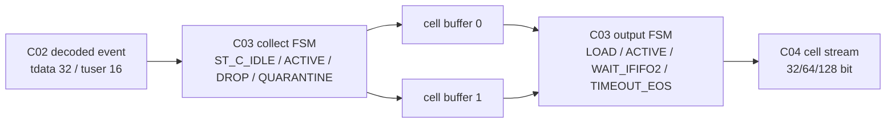
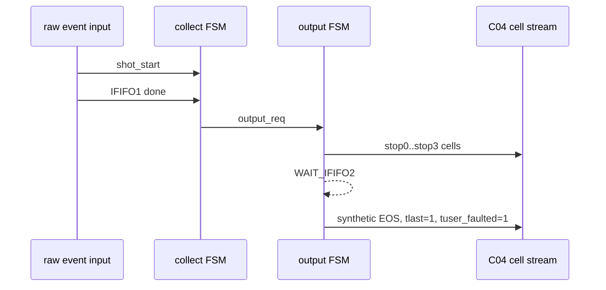
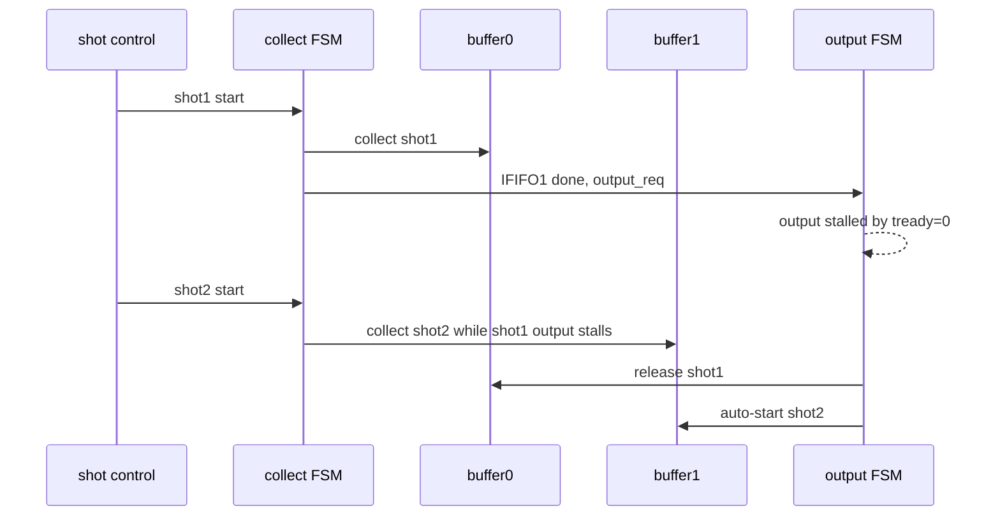
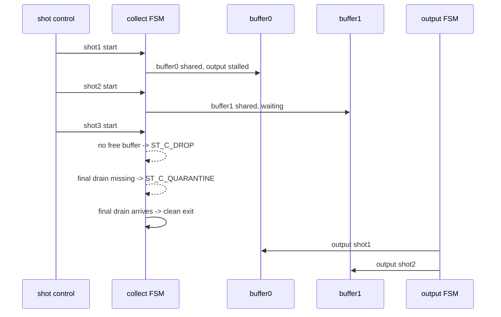

# C07 System Integration C03 Direct Matrix Result v001

| 항목 | 내용 |
|---|---|
| 문서 종류 | C07 P1 `CHAIN-P1-01 C03 direct matrix TB` 결과 |
| 문서 버전 | v001 |
| 생성 시간 | 2026-05-15 19:16:24 KST |
| 수정 시간 | 2026-05-15 19:24:00 KST |
| Cluster | C07 System Integration / C03 Chain Retro-Verification |
| 절대 기준 문서 | `Doc/TDC-GPX-Datasheet.pdf` |
| 입력 계획 | `Doc/cluster_analysis/C07_System_Integration/C07_System_Integration_260514151507_Plan_v001.md` |
| 직전 결과 | `Doc/cluster_analysis/C07_System_Integration/C07_System_Integration_260515174538_Reserve_Budget_Result_v001.md` |
| 실행 스크립트 | `scripts/run_c07_v001_c03_direct_matrix.ps1 -Stamp 260515191624` |
| Vivado/xsim 기준 경로 | `C:\AMDDesignTools\2025.2.1\Vivado` |
| xsim archive | `sim_results/vivado_xsim/sessions/260515191624_c07_v001_c03_direct_matrix/` |

## 1. 목적

C03는 이전에 C04 통합 PASS를 통해 넓게 닫힌 부분이 있었다. C07 chain audit에서 문제로 삼은 것은 "다음 cluster에서 잘 보인다"가 아니라 "C03 자체가 직접 검증됐는가"이다. 그래서 이번 결과는 `tdc_gpx_cell_builder`와 `tdc_gpx_cell_pipe` 레벨에서 다음 항목을 직접 검증한다.

| 검증 항목 | 이번 결과 |
|---|---|
| width/max_hits matrix | 32/64/128 bit x max_hits 1/3/5/7 직접 PASS |
| IFIFO2 wait/timeout | 32/64/128 bit에서 synthetic EOS + faulted tuser PASS |
| dual-buffer next-shot II | 64 bit, max_hits 3, output stall 중 다음 shot 수집 PASS |
| shot drop/quarantine | 64 bit, max_hits 3, no-free-buffer drop 및 quarantine clean exit PASS |
| rise/fall slope asymmetry | 기존 `tb_tdc_gpx_cell_pipe_c03_fix` 재실행 PASS |

결론: `CHAIN-P1-01`은 C03 RTL/xsim 범위에서 `Closed`로 판정한다. C04 ready/header pending 직접 검증과 Hit[16] SW/range 계약은 각각 `CHAIN-P1-02`, `CHAIN-P1-03`으로 남긴다.

## 2. 기준과 근거

| 기준 | 근거 |
|---|---|
| Datasheet raw hit | `Doc/TDC-GPX-Datasheet.pdf`, GPX I-Mode hit data는 기존 C03/C04 분석에서 `Hit[16:0]`로 추적됨 |
| 내부 raw/event 폭 | `tdc_gpx_pkg.vhd:96-98`, decoded event stream은 `tdata=32`, `tuser=16` |
| raw hit 보존 경계 | `tdc_gpx_pkg.vhd:47`, `:52`, `:110`; `c_RAW_HIT_WIDTH=17`, slot data는 16 bit |
| C03 metadata 정책 | `tdc_gpx_cell_builder.vhd:88-93`, Hit[16]은 output metadata `hit_msb_vec[6:0]`로 보존 |
| runtime beat count | `tdc_gpx_pkg.vhd:814-829`, `fn_beats_per_cell_rt(max_hits, width)` |
| dual-buffer/drop FSM | `tdc_gpx_cell_builder.vhd:1-58`, `:540-850` |
| IFIFO2 wait/timeout FSM | `tdc_gpx_cell_builder.vhd:860-1082` |
| 신규 TB | `tb_tdc_gpx_cell_builder_c07_direct.vhd` |
| 실행 스크립트 | `scripts/run_c07_v001_c03_direct_matrix.ps1` |

## 3. 신규 검증 구조



신규 TB는 `cell_builder`를 직접 인스턴스하고 `g_QUARANTINE_MARGIN_CLKS=8`, `g_IFIFO2_MARGIN_CLKS=8`로 줄여 timeout/quarantine 경계를 짧게 만든다. 이것은 생산 RTL 기본 margin을 바꾸는 것이 아니라, 상태 전이를 빠르게 자극하기 위한 TB 전용 generic이다. 기존 `cell_pipe` wrapper 회귀 TB도 같은 스크립트에서 다시 돌려 slope demux, input skid, per-slope abort 보존을 확인했다.

## 4. 실행 결과

```powershell
powershell -NoProfile -ExecutionPolicy Bypass -File scripts\run_c07_v001_c03_direct_matrix.ps1 -Stamp 260515191624
```

| 항목 | 결과 |
|---|---|
| exit code | 0 |
| archive session | `sim_results/vivado_xsim/sessions/260515191624_c07_v001_c03_direct_matrix/` |
| archive artifact count | 76 |
| compile logs | `logs/compile/xvlog_c07_v001_c03_direct_260515191624.log`, `logs/compile/xvhdl_c07_v001_c03_direct_260515191624.log` |
| simulation logs | `logs/simulate/xsim_c07_v001_c03_*_260515191624.log` |
| failure/error scan | 실행 스크립트에서 `Failure:`, `ERROR:`, `failed` marker 없음 확인 |

주의: 동일 세션 archive 안에 `260515190912` 로그와 backup 로그가 함께 있다. 이것은 첫 실행 때 TB 종료 처리(`std.env.finish`)가 없어 중단된 중간 산출물이다. release evidence는 `260515191624` 로그만 사용한다.

## 5. Width / Max Hits Matrix

| max_hits_cfg | 32-bit beats/cell | 64-bit beats/cell | 128-bit beats/cell | 판정 |
|---:|---:|---:|---:|---|
| 1 | 2 | 2 | 2 | PASS |
| 3 | 3 | 2 | 2 | PASS |
| 5 | 4 | 3 | 2 | PASS |
| 7 | 5 | 3 | 2 | PASS |

각 케이스에서 TB가 확인한 내용은 다음과 같다.

| 확인 항목 | 의미 |
|---|---|
| data beat slot packing | `Hit[15:0]`가 width별 slot 위치에 맞게 packing됨 |
| metadata beat position | runtime last beat가 metadata beat로 사용됨 |
| `hit_valid[6:0]` | max_hits 수만큼 valid bit가 set됨 |
| `slope_vec[6:0]` | rising slope 입력이 metadata로 보존됨 |
| `hit_count_actual` | max_hits_cfg와 동일한 count로 출력됨 |
| `hit_msb_vec[6:0]` | Datasheet raw hit의 `Hit[16]`가 C03 metadata에 보존됨 |

주요 PASS marker:

| Evidence | Marker |
|---|---|
| `logs/simulate/xsim_c07_v001_c03_matrix_w32_mh1_260515191624.log:28` | `PASS: C07 C03 direct matrix width=32 max_hits=1 beats_per_cell=2` |
| `logs/simulate/xsim_c07_v001_c03_matrix_w32_mh7_260515191624.log:28` | `PASS: C07 C03 direct matrix width=32 max_hits=7 beats_per_cell=5` |
| `logs/simulate/xsim_c07_v001_c03_matrix_w64_mh5_260515191624.log:28` | `PASS: C07 C03 direct matrix width=64 max_hits=5 beats_per_cell=3` |
| `logs/simulate/xsim_c07_v001_c03_matrix_w128_mh7_260515191624.log:28` | `PASS: C07 C03 direct matrix width=128 max_hits=7 beats_per_cell=2` |

## 6. IFIFO2 Wait / Timeout



| Width | max_hits | 예상 구조 | 결과 |
|---:|---:|---|---|
| 32 | 7 | stop0..3 출력 후 synthetic EOS | PASS |
| 64 | 7 | stop0..3 출력 후 synthetic EOS | PASS |
| 128 | 7 | stop0..3 출력 후 synthetic EOS | PASS |

주요 PASS marker:

| Evidence | Marker |
|---|---|
| `logs/simulate/xsim_c07_v001_c03_ififo2_w32_260515191624.log:28` | `PASS: C07 C03 IFIFO2 timeout width=32 max_hits=7` |
| `logs/simulate/xsim_c07_v001_c03_ififo2_w64_260515191624.log:28` | `PASS: C07 C03 IFIFO2 timeout width=64 max_hits=7` |
| `logs/simulate/xsim_c07_v001_c03_ififo2_w128_260515191624.log:28` | `PASS: C07 C03 IFIFO2 timeout width=128 max_hits=7` |

해석: `IFIFO1 done`만 들어오고 `IFIFO2 final done`이 오지 않으면, output FSM은 stop3->4 boundary에서 대기한 뒤 synthetic final beat를 만들고 `tuser(0)=1`로 faulted slice를 표시한다. C03는 slice를 무한히 잡고 있지 않고 downstream이 frame 경계를 닫을 수 있도록 faulted EOS를 만든다.

## 7. Dual Buffer / Drop / Quarantine

### 7.1 Dual-buffer next-shot II



| 항목 | 결과 |
|---|---|
| 조건 | 64-bit, max_hits=3, `m_axis_tready=0`으로 shot1 output hold |
| 기대 | shot2가 buffer1에 수집되고 shot drop이 발생하지 않아야 함 |
| 결과 | PASS, `logs/simulate/xsim_c07_v001_c03_dual_w64_mh3_260515191624.log:28` |

### 7.2 Shot drop / quarantine



| 항목 | 결과 |
|---|---|
| 조건 | 64-bit, max_hits=3, buffer0/1 모두 occupied 상태에서 shot3 start |
| 기대 | shot3는 output slice를 만들지 않고 drop/quarantine 경계를 통과해야 함 |
| 결과 | PASS, `logs/simulate/xsim_c07_v001_c03_drop_w64_mh3_260515191624.log:28` |

해석: C03의 지속 가능한 II는 "무조건 매 shot accept"가 아니다. downstream이 막혀 두 buffer가 모두 점유되면 세 번째 shot은 설계 의도대로 drop/quarantine 경계로 들어간다. 따라서 system release에서 보장해야 할 것은 `두 buffer를 소진하기 전에 output이 drain되는가`이며, 이 항목은 C07 P0 chain stress와 C04/C07 polygon budget의 의미와 연결된다.

## 8. Rise / Fall Slope Asymmetry

기존 C03 보완 TB도 같은 스크립트에서 재실행했다.

| TB | 확인 내용 | 결과 |
|---|---|---|
| `tb_tdc_gpx_cell_pipe_c03_fix.vhd` | Hit[16] metadata 보존, input skid, fall-only abort 후 stale fall beat 제거 | PASS |

Evidence:

```text
logs/simulate/xsim_c07_v001_c03_pipe_fix_260515191624.log:36
PASS: C03 cell_pipe Hit[16], input skid, and per-slope abort regression passed.
```

## 9. Timing / Latency / Throughput / Pipeline / II

| 항목 | 분석 |
|---|---|
| Latency | `IFIFO1 done` handshake 후 collect FSM이 `output_req`를 만들고, output FSM은 `ST_O_IDLE -> ST_O_LOAD -> ST_O_ACTIVE`로 진행한다. 구조적으로 first output valid는 output_req 인지 후 2 clk 경로다. |
| Throughput | `m_axis_tready=1`일 때 output FSM은 1 beat/clk로 drain한다. width/max_hits에 따라 cell당 beat 수가 줄어든다. |
| Pipeline | C03는 `input event -> collect FSM -> dual buffer -> output FSM -> C04 cell stream`의 2-FSM + 2-buffer 구조다. |
| II | dual-buffer가 비어 있으면 현재 output stall 중에도 다음 shot collect가 가능하다. 단, 두 buffer가 모두 occupied이면 다음 shot은 drop/quarantine으로 들어간다. |
| Timeout boundary | IFIFO2 미도착은 무한 wait가 아니라 timeout 후 synthetic EOS로 닫힌다. TB는 margin을 8 clk로 축소했고, 생산 기본 margin은 RTL generic 기본값을 따른다. |

### 9.1 Width별 drain 의미

| max_hits_cfg | 32-bit | 64-bit | 128-bit |
|---:|---:|---:|---:|
| 1 | 2 clk/cell | 2 clk/cell | 2 clk/cell |
| 3 | 3 clk/cell | 2 clk/cell | 2 clk/cell |
| 5 | 4 clk/cell | 3 clk/cell | 2 clk/cell |
| 7 | 5 clk/cell | 3 clk/cell | 2 clk/cell |

이 결과는 "raw/event 내부 의미가 width에 따라 바뀐다"는 뜻이 아니다. C03 내부 raw hit 의미는 고정이고, output serializer의 beat 수가 줄어들어 drain 시간이 줄어든다는 뜻이다.

## 10. Closure

| 항목 | 상태 | 근거 |
|---|---|---|
| `CHAIN-P1-01 C03 direct matrix TB` | Closed | 17개 xsim PASS + 기존 C03 cell_pipe regression PASS |
| `C07-VB-04 C03 dual-buffer II` | Closed | dual-buffer next-shot stall scenario PASS |
| `C07-VB-05 IFIFO2 wait/timeout` | Closed | 32/64/128 IFIFO2 timeout scenario PASS |
| shot drop/quarantine boundary | Closed for clean final-drain exit | no-free-buffer drop, quarantine transition, clean exit PASS |
| forced quarantine escape | Not targeted | 생산용 장기 watchdog escape는 C03 기능 safety net이며 이번 direct matrix의 release blocker로 보지 않음 |

## 11. 다음 항목

| 우선순위 | 항목 | 다음 조치 |
|---|---|---|
| P1 | `CHAIN-P1-02 C04 ready/header pending direct TB` | face_assembler ready path, header_inserter pending, header/data stall 직접 검증 |
| P1 | `CHAIN-P1-03 Hit[16] SW/range 계약` | final VDMA 16-bit 정책과 거리/wrap 판단을 SW 계약으로 명시 |
| System | VDMA/PS/Ethernet reserve 실측 | P0-04에서 분리한 release gate 유지 |

## 12. Lineage

| 이전 문서 | 이번 반영 |
|---|---|
| `C07_System_Integration_260514151507_Plan_v001.md` | `CHAIN-P1-01`을 실행하고 Closed로 업데이트 |
| `C07_System_Integration_260515174538_Reserve_Budget_Result_v001.md` | P0 이후 다음 항목으로 남긴 C03 direct matrix를 본 문서에서 수행 |
| `C03_Cell_Pipe_260501022223_Analysis_v001.md` | 통합 PASS로 우회됐던 width/max_hits, dual-buffer, IFIFO2, drop/quarantine 직접 검증을 보강 |
| `tb_tdc_gpx_cell_builder_c07_direct.vhd` | C03 direct matrix 신규 TB 추가 |
| `scripts/run_c07_v001_c03_direct_matrix.ps1` | Vivado/xsim 실행 및 archive 자동화 추가 |
