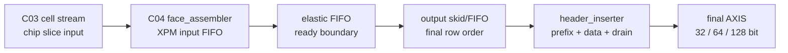
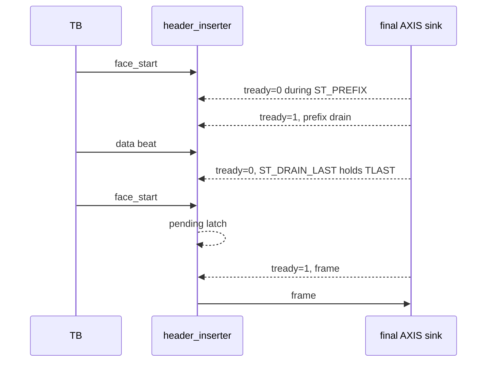
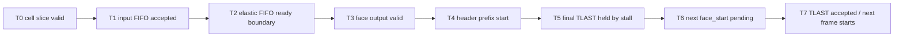

# C07 System Integration C04 Direct Matrix Result v001

| 항목 | 내용 |
|---|---|
| 문서 종류 | C07 P1 `CHAIN-P1-02 C04 ready/header pending direct TB` 결과 |
| 문서 버전 | v001 |
| 생성 시간 | 2026-05-15 19:42:51 KST |
| 수정 시간 | 2026-05-15 19:44:00 KST |
| Cluster | C07 System Integration / C04 Chain Retro-Verification |
| 절대 기준 문서 | `Doc/TDC-GPX-Datasheet.pdf` |
| 입력 계획 | `Doc/cluster_analysis/C07_System_Integration/C07_System_Integration_260514151507_Plan_v001.md` |
| 직전 결과 | `Doc/cluster_analysis/C07_System_Integration/C07_System_Integration_260515191624_C03_Direct_Matrix_Result_v001.md` |
| 실행 스크립트 | `scripts/run_c07_v001_c04_direct_matrix.ps1 -Stamp 260515194251` |
| Vivado/xsim 기준 경로 | `C:\AMDDesignTools\2025.2.1\Vivado` |
| xsim archive | `sim_results/vivado_xsim/sessions/260515194251_c07_v001_c04_direct_matrix/` |
| archive 생성 시간 | 2026-05-15 19:43:36 KST |

주의: 파일명 stamp는 xsim 실행 stamp를 따른다. archive README의 실제 생성 시간은 2026-05-15 19:43:36 KST이며, 추적 기준은 `260515194251` session path와 각 log marker다.

## 1. 목적

C04는 이전 C04 결과에서 final stream sanitize와 width별 beat/tlast는 확인됐지만, chain integrity review에서 두 가지 직접 검증 부족 항목이 남아 있었다.

| 검증 부족 항목 | 이번 검증 목표 |
|---|---|
| `face_assembler` ready path | downstream stall 중에도 chip slice 순서, beat 수, TLAST, row_done, metadata sanitize가 보존되는지 확인 |
| `header_inserter` face_start pending | header/data stall 및 final TLAST 보류 중 다음 `face_start`가 pending으로 잡히고 다음 frame이 손실 없이 시작되는지 확인 |

결론: `CHAIN-P1-02`는 C04 RTL/xsim 직접 범위에서 `Closed`로 판정한다. 단, VDMA/PS/Ethernet의 실제 장기 backpressure profile과 board-level CDC/STA는 system release item으로 유지한다.

## 2. 기준과 근거

| 기준 | 근거 |
|---|---|
| Datasheet 기준 | `Doc/TDC-GPX-Datasheet.pdf`; raw hit 의미와 TDC 운용 기준은 Datasheet를 절대 기준으로 유지 |
| C04 입력 cell stream 폭 | `tdc_gpx_pkg.vhd`, `fn_output_width_supported()`, `fn_axis_keep_width()`, `fn_beats_per_cell_rt()` |
| `face_assembler` input FIFO/elastic boundary | `tdc_gpx_face_assembler.vhd:273-277`, `:366-407` |
| `face_assembler` output skid/FIFO boundary | `tdc_gpx_face_assembler.vhd:439-448`, `:516-531` |
| `face_assembler` row_done/faulted boundary | `tdc_gpx_face_assembler.vhd:592-598`, `:803-860`, `:1021-1022` |
| `header_inserter` final output register boundary | `tdc_gpx_header_inserter.vhd:325-326`, `:440` |
| `header_inserter` prefix/data/drain FSM | `tdc_gpx_header_inserter.vhd:459-530`, `:550-573` |
| `header_inserter` pending face_start | `tdc_gpx_header_inserter.vhd:613-641` |
| 신규 TB | `tb_tdc_gpx_face_assembler_c07_direct.vhd`, `tb_tdc_gpx_header_inserter_c07_direct.vhd` |
| 실행 스크립트 | `scripts/run_c07_v001_c04_direct_matrix.ps1` |

## 3. 직접 검증 구조



이번 검증은 top 통합 TB가 아니라 C04 구성요소를 직접 자극한다. 따라서 source와 destination이 같은 모듈 안에서 관측되고, output marker가 final handshake 후에만 PASS로 찍히도록 구성했다.

## 4. 실행 결과

```powershell
powershell -NoProfile -ExecutionPolicy Bypass -File scripts\run_c07_v001_c04_direct_matrix.ps1 -Stamp 260515194251
```

| 항목 | 결과 |
|---|---|
| exit code | 0 |
| archive session | `sim_results/vivado_xsim/sessions/260515194251_c07_v001_c04_direct_matrix/` |
| archive artifact count | 32 |
| release evidence log stamp | `260515194251` |
| failure/error scan | 실행 스크립트가 `Failure:`, `ERROR:`, `failed` marker를 검사했고 최종 PASS 로그에서 release blocker marker 없음 |

주요 PASS marker:

| Evidence | Marker |
|---|---|
| `logs/simulate/xsim_c07_v001_c04_face_w32_260515194251.log:28` | `PASS: C07 C04 face_assembler ready boundary width=32 beats=80` |
| `logs/simulate/xsim_c07_v001_c04_face_w64_260515194251.log:28` | `PASS: C07 C04 face_assembler ready boundary width=64 beats=48` |
| `logs/simulate/xsim_c07_v001_c04_face_w128_260515194251.log:28` | `PASS: C07 C04 face_assembler ready boundary width=128 beats=32` |
| `logs/simulate/xsim_c07_v001_c04_header_w32_260515194251.log:28,30` | `face_start pending-latched`, `PASS: C07 C04 header pending/stall width=32 beats=26` |
| `logs/simulate/xsim_c07_v001_c04_header_w64_260515194251.log:28,30` | `face_start pending-latched`, `PASS: C07 C04 header pending/stall width=64 beats=14` |
| `logs/simulate/xsim_c07_v001_c04_header_w128_260515194251.log:28,30` | `face_start pending-latched`, `PASS: C07 C04 header pending/stall width=128 beats=8` |

## 5. `face_assembler` Ready Boundary 검증

### 5.1 Scenario

| 조건 | 값 |
|---|---|
| active chip | chip0, chip1 |
| stops_per_chip | 8 |
| max_hits_cfg | 7 |
| output width | 32/64/128 bit |
| downstream stall | 초기 2 us stall 후 7 clk ready / 3 clk stall 반복 |
| 입력 부하 | chip0 full slice 후 chip1 full slice |

검증자는 downstream stall이 존재하는 동안 다음 항목을 모두 확인한다.

| 확인 항목 | 판정 |
|---|---|
| output beat count | width별 기대 beat 수와 일치 |
| chip order | chip0 slice가 먼저, chip1 slice가 다음으로 유지 |
| TLAST | 마지막 beat에서만 asserted |
| metadata sanitize | 출력 metadata `[6:0] = 0` 보존 |
| row_done | row 종료 시 1회 pulse |
| fault/abort | chip_error, shot_overrun, face_abort 없음 |

### 5.2 Width별 beat 결과

| Width | beats/chip | total beats | 결과 |
|---:|---:|---:|---|
| 32 bit | 40 | 80 | PASS |
| 64 bit | 24 | 48 | PASS |
| 128 bit | 16 | 32 | PASS |

해석: 32/64/128 bit width가 넓어질수록 같은 C04 row를 drain하는 beat 수가 줄어든다. 내부 raw/cell 의미가 바뀌는 것이 아니라, C04 output 직렬화 단계에서 한 beat에 담기는 cell slot 수가 늘어나기 때문이다.

## 6. `header_inserter` Pending / Stall 검증

### 6.1 Scenario



핵심 관측점은 `header_inserter: face_start pending-latched (not IDLE, state=st_drain_last)` marker다. 이 marker는 다음 `face_start`가 단순히 입력에서 보인 것이 아니라, `ST_DRAIN_LAST` 상태에서 내부 pending queue로 latch됐음을 뜻한다.

### 6.2 Width별 beat 결과

| Width | header beats/frame | data beats/frame | total frames | total beats | 결과 |
|---:|---:|---:|---:|---:|---|
| 32 bit | 12 | 1 | 2 | 26 | PASS |
| 64 bit | 6 | 1 | 2 | 14 | PASS |
| 128 bit | 3 | 1 | 2 | 8 | PASS |

검증자는 다음 항목을 확인한다.

| 확인 항목 | 판정 |
|---|---|
| SOF count | 2회 |
| TLAST count | 2회 |
| frame_done count | 2회 |
| collapsed frame | 0회 |
| tkeep/tstrb | width별 all-one 유지 |
| header magic | 모든 header에서 유지 |
| fault | drain_timeout, abort_truncated, frame_faulted 없음 |

## 7. Timing / Latency / Throughput / Pipeline / II

| Metric | 분석 |
|---|---|
| Latency | `face_assembler`는 chip input FIFO와 elastic FIFO 뒤에서 output skid/FIFO로 row를 forward한다. downstream stall이 있으면 first output 및 TLAST가 stall 길이만큼 늦어지지만 순서와 row boundary는 유지된다. |
| Throughput | `m_axis_tready=1`일 때 C04 output은 1 beat/clk로 drain한다. width가 32->64->128로 증가하면 동일 row/frame의 beat 수가 80->48->32, header pending test는 26->14->8로 감소한다. |
| Pipeline | `cell slice input -> input FIFO -> elastic FIFO -> face_assembler output FIFO -> header prefix/data/drain -> final AXIS` 구조다. 각 모듈 경계는 FIFO 또는 registered output으로 닫혀 있다. |
| II | `header_inserter`는 `ST_DRAIN_LAST`에서 다음 `face_start`를 1-depth pending으로 잡는다. 따라서 final TLAST가 sink에 수락된 직후 다음 frame으로 넘어갈 수 있다. 다중 pending은 의도적으로 지원하지 않으며, system은 face_start가 1-depth pending 용량을 넘지 않도록 보장해야 한다. |
| Stall penalty | 이번 TB는 초기 장기 stall과 주기적 stall을 직접 넣었다. C04 자체는 bounded stall에서 데이터 손실 없이 기다린다. 단, 실제 VDMA/PS/Ethernet stall profile의 장기 worst case는 C07 release gate로 유지한다. |

### 7.1 Timing Block



## 8. Closure

| 항목 | 상태 | 근거 |
|---|---|---|
| `CHAIN-P1-02 C04 ready/header pending direct TB` | Closed | 32/64/128 face_assembler + header_inserter direct xsim PASS |
| `C07-VB-06 C04 header pending` | Closed | `ST_DRAIN_LAST` pending marker와 2-frame SOF/TLAST/frame_done PASS |
| C04 width beat/tlast direct check | Closed | face/header width별 beat count와 TLAST count PASS |
| C04 ready path bounded-stall behavior | Closed for RTL direct scope | downstream stall 중 order, TLAST, row_done, metadata sanitize 보존 |
| External VDMA/PS/Ethernet stall profile | Not closed here | system release measurement/gate item |

## 9. 다음 항목

| 우선순위 | 항목 | 다음 조치 |
|---|---|---|
| P1 | `CHAIN-P1-03 Hit[16] SW/range 계약` | final VDMA 16-bit 정책, 81 ps bin 기준 direct range, 810 m 근처 wrap/range 의미를 SW 계약으로 명시 |
| System | VDMA/PS/Ethernet reserve 실측 | P0-04에서 분리한 release gate 유지 |
| Release | C07 final readiness | P1-03 이후 C01-C07 closure bundle 정리 |

## 10. Lineage

| 이전 문서 | 이번 반영 |
|---|---|
| `C07_System_Integration_260514151507_Plan_v001.md` | `CHAIN-P1-02`를 실행하고 Closed로 업데이트 |
| `C04_Output_Stage_260501030046_Plan_v002.md` | ready/header pending 검증 후보를 direct TB로 보강 |
| `C07_System_Integration_260515191624_C03_Direct_Matrix_Result_v001.md` | C03 direct matrix 다음 P1 항목으로 C04 direct matrix를 수행 |
| `tb_tdc_gpx_face_assembler_c07_direct.vhd` | C04 face_assembler ready/stall direct TB 신규 추가 |
| `tb_tdc_gpx_header_inserter_c07_direct.vhd` | C04 header_inserter pending/stall direct TB 신규 추가 |
| `scripts/run_c07_v001_c04_direct_matrix.ps1` | Vivado/xsim 실행 및 archive 자동화 추가 |
