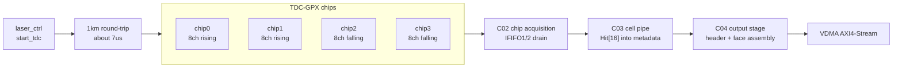
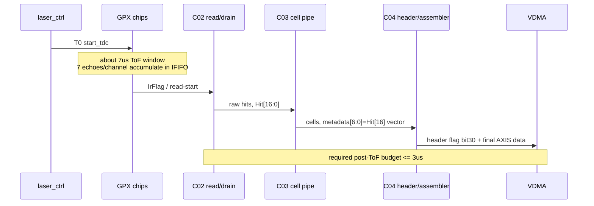

# C07 System Integration 4-Chip Hit[16] Timing Result v001

| 항목 | 내용 |
|---|---|
| 문서 종류 | C07 4-chip rise/fall 분리 + Hit[16] 보존 + 10us 목표 판단 결과 |
| 문서 버전 | v001 |
| 생성 시간 | 2026-07-08 11:39:43 KST |
| 수정 시간 | 2026-07-08 11:39:43 KST |
| Cluster | C07 System Integration / Release Readiness |
| 절대 기준 문서 | `Doc/TDC-GPX-Datasheet.pdf` |
| 사용자 운용 목표 | 4 GPX chips, 16ch rising + 16ch falling, 7 echoes/channel, 1km ToF 7us, read/process/VDMA <= 3us, total <= 10us |
| Vivado/xsim 기준 경로 | `C:\AMDDesignTools\2025.2.1\Vivado` |
| 주요 xsim archive | `sim_results/vivado_xsim/sessions/260708113119_c07_v002_4chip_target/` |
| 추가 C04 direct archive | `sim_results/vivado_xsim/sessions/260708113827_c07_v001_c04_direct_matrix/` |

## 1. 결론

이번 검토에서 Hit[16]은 최종 VDMA stream에서 버리지 않고 cell metadata와 header flag로 보존하도록 정책을 변경했다. Datasheet의 raw hit 기준은 `Hit[16:0]`이므로, 1km급 운용에서 Hit[16]을 버리는 이전 정책은 range reconstruction 계약상 부적절하다.

4-chip 목표 기능 검증은 PASS이다. `chip0/1 = rising`, `chip2/3 = falling`, chip당 8 stop channel, channel당 7 echo 조건에서 64-bit와 128-bit target wrapper가 모두 xsim PASS했다.

10us 운용 목표에 대해서는 다음과 같이 판단한다.

| 조건 | 판단 |
|---|---|
| 1km 왕복 ToF 7us + 후처리 3us 목표 | 목표 정의는 타당하다. PRF 22us 이하와도 분리해서 관리 가능하다. |
| 현재 구현 그대로, 64-bit final stream | 경계 또는 불충분 가능성이 높다. 현재 공통 active chip mask 구조에서는 rise/fall 각 stream이 4-chip row를 모두 emit하므로 불필요한 빈 chip slot이 포함된다. |
| 현재 구현 그대로, 128-bit final stream | 가장 현실적인 PASS 후보이다. xsim 기능 PASS, beat 수 감소, 3us 예산에 대한 추정 margin이 64-bit보다 크다. |
| 64-bit도 안정적으로 PASS하려면 | per-slope active chip mask가 필요하다. rise stream은 chip0/1만, fall stream은 chip2/3만 assemble/output하도록 구조를 보완해야 한다. |

주의: 현재 통합 TB의 `T3_DRAIN_WAIT_END`는 실제 drain 완료 handshake가 아니라 TB 내부 `wait_clk(1000)` 뒤에 찍는 상한 대기 marker이다. 따라서 `T2_IRFLAG_ASSERT -> T5_TLAST` xsim delta를 그대로 물리 처리시간으로 사용하면 과대 계상된다. 이번 xsim은 dataflow, beat count, TLAST, Hit[16] metadata 보존을 검증한 결과로 사용하고, 3us 예산의 최종 판단은 별도 타이밍 TB에서 `IrFlag -> last GPX read -> last cell accepted -> final TLAST` marker를 세분화해서 다시 닫아야 한다.

## 2. Hit[16] 정책 변경

### 2.1 의미

`Hit[16]`은 GPX raw hit `Hit[16:0]` 중 MSB이다. 이전 C04 정책은 최종 VDMA stream에서 이 값을 sanitize/폐기하는 방향이었으나, 1km 운용에서는 유지해야 한다.

이유는 16-bit hit slot만 사용하면 fine time reconstruction 범위가 제한되기 때문이다. 사용자 목표의 1km 왕복 시간은 약 7us이고, 이는 16-bit low field만으로 충분하다고 단정할 수 없다. 따라서 Hit[16]은 header/metadata 계약으로 보존해야 한다.

### 2.2 RTL 반영

| 파일 | 반영 내용 | 근거 |
|---|---|---|
| `tdc_gpx_face_assembler.vhd` | cell metadata `[6:0] = Hit[16] vector`를 clear하지 않고 보존 | `tdc_gpx_face_assembler.vhd:827` |
| `tdc_gpx_header_inserter.vhd` | header word3 bit30을 `hit_msb_meta_en` flag로 사용 | `tdc_gpx_header_inserter.vhd:22`, `:67`, `:357` |
| `tb_tdc_gpx_top_int.vhd` | `G_FORCE_HIT16`, metadata non-zero count check 추가 | `tb_tdc_gpx_top_int.vhd:97`, `:1410`, `:1450` |

### 2.3 검증 결과

| Width | Hit[16] metadata result | Evidence |
|---:|---|---|
| 64 | PASS, `rise_nonzero=16`, `fall_nonzero=16` | `xsim_c07_v002_4chip_target_w64_260708113119.log` |
| 128 | PASS, `rise_nonzero=16`, `fall_nonzero=16` | `xsim_c07_v002_4chip_target_w128_260708113119.log` |

## 3. 4-Chip 목표 구조

이번 target wrapper는 다음 조건을 사용했다.

| 항목 | 값 | 근거 |
|---|---:|---|
| GPX chip 수 | 4 | `tb_tdc_gpx_top_int_c07_4chip_target.vhd:33` |
| chip당 stop channel | 8 | `tb_tdc_gpx_top_int_c07_4chip_target.vhd:29` |
| channel당 echo | 7 | `tb_tdc_gpx_top_int_c07_4chip_target.vhd:30` |
| rising chip | chip0, chip1 | `G_CHIP_SLOPE_MASK => "0011"` |
| falling chip | chip2, chip3 | `G_CHIP_SLOPE_MASK => "0011"` |
| output width 검증 | 64, 128 | `scripts/run_c07_v002_4chip_target.ps1` |
| stream mode | ASYNC | `tb_tdc_gpx_top_int_c07_4chip_target.vhd` |



## 4. xsim 결과

실행 스크립트:

```powershell
powershell -ExecutionPolicy Bypass -File scripts\run_c07_v002_4chip_target.ps1
```

### 4.1 64-bit 결과

| Marker | Cycle | Time |
|---|---:|---:|
| T0_START_TDC | 2891 | 14582.5 ns |
| T2_IRFLAG_ASSERT | 2983 | 15042.5 ns |
| T3_DRAIN_WAIT_END | 3983 | 20042.5 ns |
| T5_RISE_TLAST | 4124 | 20747.5 ns |
| T5_FALL_TLAST | 4124 | 20747.5 ns |

| 항목 | 결과 |
|---|---:|
| expected_words_per_ififo | 28 |
| rising stream beats | 102 |
| falling stream beats | 102 |
| tlast count | rise 1, fall 1 |
| Hit[16] nonzero metadata | rise 16, fall 16 |
| 최종 marker | `Hit[16] final metadata preservation - PASS`, `output streams emitted beats/tlast as expected - PASS` |

### 4.2 128-bit 결과

| Marker | Cycle | Time |
|---|---:|---:|
| T0_START_TDC | 2891 | 14582.5 ns |
| T2_IRFLAG_ASSERT | 2983 | 15042.5 ns |
| T3_DRAIN_WAIT_END | 3983 | 20042.5 ns |
| T5_RISE_TLAST | 4096 | 20607.5 ns |
| T5_FALL_TLAST | 4096 | 20607.5 ns |

| 항목 | 결과 |
|---|---:|
| expected_words_per_ififo | 28 |
| rising stream beats | 67 |
| falling stream beats | 67 |
| tlast count | rise 1, fall 1 |
| Hit[16] nonzero metadata | rise 16, fall 16 |
| 최종 marker | `Hit[16] final metadata preservation - PASS`, `output streams emitted beats/tlast as expected - PASS` |

## 5. Timing / Latency / Throughput / Pipeline / II

### 5.1 물리 운용 예산

사용자 목표는 다음과 같이 정리된다.

```text
start_tdc interval / PRF budget: <= 22us
1km round-trip ToF: about 7us
post-ToF read + process + VDMA budget: <= 3us
total target: <= 10us
```

즉 RTL 관점에서 닫아야 하는 핵심 조건은 다음이다.

```text
IrFlag 또는 read-start 기준 -> final VDMA TLAST <= 3us
```

### 5.2 현재 xsim marker의 한계

`tb_tdc_gpx_top_int.vhd`의 `do_shot` procedure는 IrFlag 후 실제 drain_done을 기다리는 구조가 아니라, 아래처럼 상한 대기 후 count를 검사한다.

```text
T2_IRFLAG_ASSERT
wait_clk(1000)
T3_DRAIN_WAIT_END
expected read count assert
```

따라서 이번 통합 xsim에서 `T2 -> T5`가 약 5.565us 또는 5.705us로 보이는 것은 실제 RTL 처리시간이 아니라 TB의 고정 1000-clock wait가 포함된 값이다. 이 값을 그대로 사용하면 3us 목표를 잘못 FAIL 처리하게 된다.

### 5.3 Beat 기반 output throughput

현재 구현은 공통 `active_chip_mask="1111"`를 사용한다. 따라서 rise stream과 fall stream이 각각 4-chip row를 모두 emit한다. chip0/1만 rising이고 chip2/3만 falling이더라도, 현재 C04 출력 구조에서는 각 slope stream에 빈 counterpart chip slot이 포함된다.

| 구조 | Width | beats/slope | 200MHz stream time | 150MHz stream time |
|---|---:|---:|---:|---:|
| 현재 공통 active mask | 64 | 102 | 0.510 us | 0.680 us |
| 현재 공통 active mask | 128 | 67 | 0.335 us | 0.447 us |
| per-slope active mask 보완 후 추정 | 64 | 54 | 0.270 us | 0.360 us |
| per-slope active mask 보완 후 추정 | 128 | 35 | 0.175 us | 0.233 us |

### 5.4 3us 예산 판단

이전 C02 분석에서 1-chip 8ch/7echo drain은 약 2.14us 수준으로 관리 가능한 것으로 봤다. 4-chip 구조는 chip별 bus가 병렬이면 drain time은 chip 수에 선형 증가하지 않고, 가장 늦은 chip의 drain time에 의해 결정된다. 따라서 output serialization과 C03/C04 assembly overhead가 3us 예산의 주된 margin 항목이다.

| 조건 | 판단 |
|---|---|
| 128-bit, 현재 공통 active mask | PASS 가능성이 높다. output serialization이 약 0.447us @150MHz 수준이라 3us 목표 margin이 남는다. |
| 64-bit, 현재 공통 active mask | 경계이다. C02 drain 약 2.14us + C03/C04 overhead + output 0.680us @150MHz를 합치면 3us에 매우 근접하거나 초과할 수 있다. |
| 64-bit, per-slope active mask 보완 | PASS 가능성이 높다. output이 0.360us @150MHz로 줄어 3us 예산에 들어올 가능성이 커진다. |
| 32-bit | 이번 target wrapper에서는 제외했다. 이전 polygon budget에서도 1km/고 echo 조건에는 부적합 후보이다. |

### 5.5 Pipeline / II block



| Metric | 현재 판단 |
|---|---|
| Latency | 기능 xsim은 TLAST까지 PASS이나, 실제 latency marker는 `IrFlag -> last GPX read -> last cell -> TLAST`로 재계측 필요 |
| Throughput | 128-bit가 64-bit 대비 102 -> 67 beats로 감소하여 유리 |
| Pipeline | C02 병렬 chip drain, C03 cell metadata 보존, C04 header/face output 순서 |
| II | PRF 22us 이하 조건에서는 10us 처리 목표가 닫히면 II margin은 존재한다. 단 downstream VDMA backpressure는 bounded 조건으로 별도 유지 필요 |

## 6. 추가 회귀 결과

Hit[16] 보존 변경 후 C04 direct matrix를 재실행했다.

```powershell
powershell -ExecutionPolicy Bypass -File scripts\run_c07_v001_c04_direct_matrix.ps1
```

| Width | face_assembler direct | header_inserter direct |
|---:|---|---|
| 32 | PASS, beats=80 | PASS, beats=26 |
| 64 | PASS, beats=48 | PASS, beats=14 |
| 128 | PASS, beats=32 | PASS, beats=8 |

Archive: `sim_results/vivado_xsim/sessions/260708113827_c07_v001_c04_direct_matrix/`

## 7. Open Item / 수정 권고

| ID | 우선순위 | 항목 | 이유 |
|---|---|---|---|
| C07-4CH-01 | P0 | per-slope active chip mask 추가 | 4-chip 구조에서 rise=chip0/1, fall=chip2/3만 output하도록 해야 64-bit도 3us 목표에 안정적으로 들어온다. |
| C07-4CH-02 | P0 | timing-specific TB 추가 | 현재 통합 TB의 `T3_DRAIN_WAIT_END`는 fixed wait marker이므로 실제 3us 판단용 marker가 부족하다. |
| C07-4CH-03 | P1 | VDMA 입력 구조 확정 | rise/fall 두 AXIS stream이 병렬 VDMA로 들어가는지, 하나로 merge되는지에 따라 최종 output time이 달라진다. |
| C07-4CH-04 | P1 | 150MHz/200MHz stream clock 계약 확정 | 64-bit margin은 stream clock에 민감하다. |

## 8. Lineage

| 이전 문서/결정 | 이번 반영 |
|---|---|
| `C07_System_Integration_260514151507_Plan_v001.md` | CHAIN-P1-03 Hit[16] SW/range 계약을 RTL 보존 정책으로 전환 |
| `C07_System_Integration_260515174538_Reserve_Budget_Result_v001.md` | 기존 8us reserve 중심 판단을 사용자 1km/7us + post-ToF 3us 목표로 재해석 |
| `C07_System_Integration_260515194251_C04_Direct_Matrix_Result_v001.md` | C04 direct matrix를 Hit[16] 보존 정책 후 재실행 |
| 사용자 결정 2026-07-08 | Hit[16]을 header/metadata에 넣어 관리, 4-chip rise/fall 분리 구조로 확장 |

## 9. 다음 단계 제안

다음 fix plan은 `C07-4CH-01`과 `C07-4CH-02`를 먼저 수행해야 한다. 즉, per-slope active mask를 RTL/generic/CSR 계약으로 추가하고, `IrFlag/read-start -> last GPX read -> C03 last cell -> C04 final TLAST`를 직접 찍는 timing TB를 만든다. 그 결과가 닫히면 64-bit와 128-bit 중 release width를 결정할 수 있다.

## 10. Forward Trace

| 이후 문서 | 반영 내용 |
|---|---|
| `C07_System_Integration_260708115127_4Chip_Hit16_Timing_Result_v002.md` | v001의 10us timing budget 해석을 정정했다. v001은 10us를 1km 왕복 7us 포함 총 시간처럼 해석했으나, v002에서는 사용자 기준에 따라 `PRF 22us - ToF 7us = 15us`, 그중 `TDC read 시작 -> VDMA DDR 도착 <= 10us`, `PS/Ethernet <= 5us`로 재정의했다. 따라서 v001의 “64-bit는 3us 기준 경계” 판단은 폐기되고, VDMA DDR 5us 가정 기준에서는 64-bit/128-bit 모두 PASS 가능으로 정정된다. |
