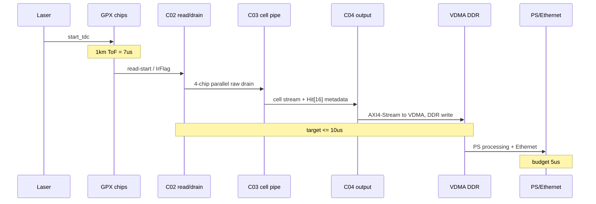

# C07 System Integration 4-Chip Hit[16] Timing Result v002

| 항목 | 내용 |
|---|---|
| 문서 종류 | C07 4-chip rise/fall 분리 + Hit[16] 보존 + 10us timing budget 정정 결과 |
| 문서 버전 | v002 |
| 생성 시간 | 2026-07-08 11:51:27 KST |
| 수정 시간 | 2026-07-08 11:51:27 KST |
| Cluster | C07 System Integration / Release Readiness |
| 절대 기준 문서 | `Doc/TDC-GPX-Datasheet.pdf` |
| 직전 문서 | `Doc/cluster_analysis/C07_System_Integration/C07_System_Integration_260708113943_4Chip_Hit16_Timing_Result_v001.md` |
| 정정 사유 | v001은 10us를 1km 왕복 7us 포함 총 시간처럼 해석했다. 사용자 기준은 1km 왕복 7us 이후의 TDC read/VDMA-DDR 처리 시간이 10us 이내인지 확인하는 것이다. |
| Vivado/xsim 기준 경로 | `C:\AMDDesignTools\2025.2.1\Vivado` |
| 주요 xsim archive | `sim_results/vivado_xsim/sessions/260708113119_c07_v002_4chip_target/` |

## 1. 정정된 운용 시간 모델

사용자 기준의 시간 분해는 다음과 같다.

```text
PRF / laser-to-laser interval = 22 us
1km round-trip ToF           =  7 us
post-ToF available time      = 15 us

post-ToF available time = TDC_read_to_VDMA_DDR_budget + PS/Ethernet_budget
                        = 10 us + 5 us
```

따라서 이번에 닫아야 하는 RTL/system 판단식은 다음이다.

```text
TDC 개별 chip read 시작 -> VDMA가 Zynq DDR에 올림 <= 10 us
```

`VDMA -> DDR`의 실제 DMA latency는 현재 RTL/xsim만으로는 알 수 없다. AXI HP/HPC 포트, VDMA burst 설정, DDR 부하, PS/PL clock, interconnect QoS에 따라 달라진다. 따라서 사용자 지시에 따라 `VDMA -> DDR = 5 us`를 보수 가정으로 둔다.

그러면 RTL front-end가 만족해야 하는 내부 목표는 다음처럼 분리된다.

```text
TDC read 시작 -> final AXI4-Stream VDMA 입력 accepted <= 5 us
VDMA 입력 accepted -> DDR write complete                 = 5 us 가정
합계                                                    <= 10 us
```

## 2. v001 판단에서 정정되는 부분

| v001 표현 | v002 정정 |
|---|---|
| `1km ToF 7us + post-ToF read/process/VDMA 3us = total 10us`처럼 판단 | 폐기. 10us는 ToF 이후 TDC read부터 VDMA DDR까지의 budget이다. |
| 64-bit가 3us에 경계 또는 불충분 가능성이 높다고 판단 | 정정. 10us budget과 VDMA DDR 5us 가정에서는 64-bit도 PASS 가능성이 높다. |
| 128-bit만 현실적 PASS 후보로 표현 | 정정. 128-bit는 여전히 가장 여유롭지만, 64-bit도 현재 추정 기준에서는 목표 안에 들어온다. |
| timing-specific TB의 목적을 3us 판단으로 표현 | 정정. timing-specific TB는 5us RTL front-end 목표를 직접 닫기 위한 항목이다. |

## 3. 구조 기준

4-chip 구조는 chip별 bus/control path가 병렬로 생성된다.

| 항목 | 근거 |
|---|---|
| GPX pin/bus가 chip별 array | `tdc_gpx_top.vhd:130-144` |
| config_ctrl가 chip별 pipeline 생성 | `tdc_gpx_config_ctrl.vhd:1510`, `:1513`, `:1775` |
| target wrapper 조건 | `tb_tdc_gpx_top_int_c07_4chip_target.vhd:29-35` |

따라서 4-chip timing은 한 chip drain 시간을 4배 곱하는 구조가 아니다. 병목은 다음 중 가장 늦은 항목으로 봐야 한다.

1. chip별 C02 drain 중 가장 늦은 chip
2. C03 cell assembly / C04 face assembly
3. final AXI4-Stream serialization
4. VDMA DDR write

```mermaid
flowchart LR
    T0["laser start_tdc"]
    TOF["1km round-trip<br/>7us"]
    R["read-start / IrFlag"]
    C2["C02 per-chip parallel drain<br/>4 chips"]
    C3["C03 cell pipe<br/>Hit[16] metadata"]
    C4["C04 output/header<br/>rise/fall streams"]
    VDMA["VDMA write to Zynq DDR"]
    PS["PS processing + Ethernet<br/>5us budget"]
    NEXT["next PRF deadline<br/>22us"]

    T0 --> TOF --> R --> C2 --> C3 --> C4 --> VDMA --> PS --> NEXT
```



## 4. 근거 수치

### 4.1 C02 chip read/drain

C02의 8ch/7echo에 해당하는 측정은 `IFIFO1=28 words`, `IFIFO2=28 words`, 총 56 data words 기준이다.

| 항목 | 값 | 근거 |
|---|---:|---|
| TDC clock | 200 MHz, 5 ns | C02 timing metric |
| IFIFO1 load | 28 words = 4 stop x 7 echo | `C02_Chip_Acquisition_260430210752_Timing_Metric_Detail_v001.md` |
| IFIFO2 load | 28 words = 4 stop x 7 echo | 동일 |
| total drain output_done | 428 clk | 동일 |
| 시간 환산 | 428 x 5 ns = 2.140 us | 계산 |

해석: 4-chip 구조에서 chip별 bus/control이 병렬이면, 4개 chip 전체 read의 기본 병목은 약 `2.14 us` 수준으로 본다. 단, 모든 chip이 동일하게 28+28 words를 갖고, bus backpressure 조건이 C02 검증과 같은 수준이라는 전제가 붙는다.

### 4.2 C04/final output serialization

현재 target xsim은 공통 active chip mask `"1111"`를 사용한다. 따라서 rise stream과 fall stream이 각각 4-chip row를 모두 emit한다.

| Width | xsim beats/slope | 150MHz 기준 | 200MHz 기준 | 근거 |
|---:|---:|---:|---:|---|
| 64 | 102 beats | 0.680 us | 0.510 us | `xsim_c07_v002_4chip_target_w64_260708113119.log` |
| 128 | 67 beats | 0.447 us | 0.335 us | `xsim_c07_v002_4chip_target_w128_260708113119.log` |

`tdc_gpx_top.vhd`는 `i_axis_aclk`를 nominal 150MHz AXI-Stream clock으로 설명한다. 따라서 release budget은 150MHz 기준을 우선 사용한다.

### 4.3 xsim 기능 검증 결과

| Width | 기능 결과 | Hit[16] metadata | Stream 결과 |
|---:|---|---|---|
| 64 | PASS | `rise_nonzero=16`, `fall_nonzero=16` | rise/fall 각각 `beats=102`, `tlast_cnt=1` |
| 128 | PASS | `rise_nonzero=16`, `fall_nonzero=16` | rise/fall 각각 `beats=67`, `tlast_cnt=1` |

주의: 현재 top integration TB의 `T3_DRAIN_WAIT_END`는 실제 drain done handshake가 아니라 `wait_clk(1000)` 뒤에 찍는 fixed wait marker이다. 그러므로 `T2 -> T5`를 실제 RTL latency로 직접 사용하지 않는다. 이번 xsim은 dataflow, beat count, TLAST, Hit[16] metadata preservation 증거로 사용한다.

## 5. 10us budget 계산

### 5.1 보수 가정

| 항목 | 값 |
|---|---:|
| TDC read/drain, C02 기준 | 2.140 us |
| C04 output serialization, 64-bit @150MHz | 0.680 us |
| C04 output serialization, 128-bit @150MHz | 0.447 us |
| C03/C04 내부 assembly guard | 1.000 us 가정 |
| VDMA -> DDR write | 5.000 us 가정 |

`C03/C04 내부 assembly guard = 1us`는 현재 정확 계측값이 아니라 보수 여유다. C07 timing-specific TB에서 직접 계측해야 한다.

### 5.2 계산표

| Width | RTL front-end 추정 | VDMA DDR 가정 | 총합 | 10us 목표 |
|---:|---:|---:|---:|---|
| 64 | 2.140 + 0.680 + 1.000 = 3.820 us | 5.000 us | 8.820 us | PASS, margin 1.180 us |
| 128 | 2.140 + 0.447 + 1.000 = 3.587 us | 5.000 us | 8.587 us | PASS, margin 1.413 us |

즉 정정된 기준에서는 64-bit와 128-bit 모두 PASS 가능성이 높다. 128-bit는 margin이 더 크고, VDMA/DDR backpressure 또는 assembly overhead가 증가할 때 더 안전하다.

### 5.3 guard 허용 한계

VDMA DDR을 5us로 가정할 때, RTL front-end가 사용할 수 있는 최대 시간은 5us다.

| Width | C02 + output serialization | 남는 assembly/CDC/backpressure guard |
|---:|---:|---:|
| 64 | 2.140 + 0.680 = 2.820 us | 2.180 us |
| 128 | 2.140 + 0.447 = 2.587 us | 2.413 us |

따라서 C03/C04 assembly, CDC, bounded backpressure, VDMA input acceptance 지연이 위 guard 안에 들어오면 10us 목표는 만족한다.

## 6. Timing / Latency / Throughput / Pipeline / II



| Metric | v002 판단 |
|---|---|
| Latency | 목표 latency는 `read-start -> VDMA DDR complete <= 10us`다. VDMA DDR 5us 가정 시 RTL front-end 목표는 `<=5us`다. |
| Throughput | 64-bit는 102 beats/slope, 128-bit는 67 beats/slope로 128-bit가 유리하다. 그러나 10us 기준에서는 64-bit도 가능 영역이다. |
| Pipeline | chip별 C02 drain은 병렬, 이후 C03/C04에서 rise/fall stream으로 assemble/output된다. |
| II | PRF 22us 기준으로 `7us ToF + <=10us TDC/VDMA_DDR + 5us PS/Ethernet <= 22us`가 정확한 운용 계약이다. |
| Backpressure | VDMA DDR 5us 가정 안에 VDMA ready stall과 DDR write 지연이 포함되어야 한다. 이 값은 보드 계측으로 교체해야 한다. |

## 7. 수정된 결론

| 항목 | 결론 |
|---|---|
| Hit[16] 보존 | PASS. header/metadata로 보존하도록 RTL/TB 반영 완료. |
| 4-chip rise/fall 기능 | PASS. 64/128-bit target xsim에서 beat/TLAST/metadata PASS. |
| 10us 목표, VDMA DDR 5us 가정 | 64-bit PASS 가능, 128-bit PASS 가능. |
| release 권고 width | 128-bit 우선. 64-bit도 가능하지만 VDMA/DDR stall 실측 전에는 128-bit가 더 안전하다. |
| per-slope active mask | 여전히 권고. 64-bit margin을 키우고 불필요한 empty chip slot emission을 줄일 수 있다. |

## 8. 남은 검증 항목

| ID | 우선순위 | 항목 | 이유 |
|---|---|---|---|
| C07-4CH-TIM-01 | P0 | timing-specific TB 추가 | `read-start -> last GPX read -> last cell -> final AXIS accepted`를 fixed wait 없이 직접 계측해야 한다. |
| C07-4CH-TIM-02 | P0 | VDMA DDR latency 실측 또는 보수 모델 확정 | 현재는 5us 가정이다. 실제 DDR write latency가 5us를 넘으면 10us margin이 줄어든다. |
| C07-4CH-TIM-03 | P1 | per-slope active chip mask | rise stream chip0/1, fall stream chip2/3만 output하면 64-bit margin이 증가한다. |
| C07-4CH-TIM-04 | P1 | bounded VDMA backpressure TB | VDMA ready stall이 guard 2.18us/2.413us 안에 들어오는지 확인한다. |

## 9. Lineage

| 이전 문서/결정 | v002 반영 |
|---|---|
| `C07_System_Integration_260708113943_4Chip_Hit16_Timing_Result_v001.md` | 10us budget 해석 오류를 정정하고, v001의 3us 기준 판단을 폐기 |
| 사용자 정정 2026-07-08 | `PRF 22us - ToF 7us = 15us`, 그중 `TDC read -> VDMA DDR <=10us`, `PS/Ethernet 5us`로 재정의 |
| `C02_Chip_Acquisition_260430210752_Timing_Metric_Detail_v001.md` | 8ch/7echo chip drain `428clk = 2.14us`를 read/drain 기준으로 사용 |
| `C07_System_Integration_260515174538_Reserve_Budget_Result_v001.md` | 64/128 output serialization time을 참고하되, v002에서는 PRF 22us 운용 모델로 재배치 |

## 10. Forward Trace

| 이후 문서 | 반영 내용 |
|---|---|
| `C07_System_Integration_260708120147_5Hz_Frame_Budget_Result_v001.md` | v002의 shot-level `10us` 계약을 5Hz frame/FoV 계산으로 확장했다. `0.288H x 0.144V` Mode A는 22.8206us shot interval로 PASS 가능, `0.144H x 0.144V` Mode B는 11.4286us shot interval로 현재 1km/7echo/5Hz 조건에서 FAIL로 분리했다. |
