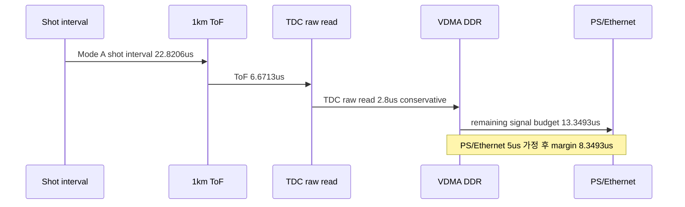

# C07 System Integration 5Hz Frame Budget Result v001

| 항목 | 내용 |
|---|---|
| 문서 종류 | 1km / 5Hz 운용 조건의 frame/shot/time budget 재계산 |
| 문서 버전 | v001 |
| 생성 시간 | 2026-07-08 12:01:47 KST |
| 수정 시간 | 2026-07-08 12:01:47 KST |
| Cluster | C07 System Integration / Release Readiness |
| 절대 기준 문서 | `Doc/TDC-GPX-Datasheet.pdf` |
| 직전 문서 | `C07_System_Integration_260708115127_4Chip_Hit16_Timing_Result_v002.md` |
| 사용자 정정 기준 | 방금까지의 10us 검토는 1km를 5Hz로 동작시키기 위한 shot-level budget이다. 1km 왕복 6.67us 이후 TDC/VDMA/PS 처리가 PRF 안에 들어오는지 판단한다. |

## 1. 결론

사용자 계산 방식은 `0.288도 수평 x 0.144도 수직` 운용에서는 논리적으로 맞다. 정확값으로 다시 계산하면 다음과 같다.

```text
shot interval = 22.8206 us
1km round-trip ToF = 6.6713 us
TDC raw read = 2.8000 us
남는 시간 = 13.3493 us
```

따라서 `0.288도 x 0.144도`, 5Hz, 1km, 7echo 조건에서는 현재 4-chip 구조가 가능 영역이다. 이전 v002의 `TDC read 시작 -> VDMA DDR <= 10us` 계약과 `PS/Ethernet = 5us` 가정을 그대로 적용해도 다음처럼 들어온다.

```text
22.8206 us - 6.6713 us - 10.0000 us - 5.0000 us
  = 1.1493 us margin
```

다만 `0.144도 x 0.144도` 운용은 shot interval이 약 `11.4286us`로 줄어든다. 같은 1km/7echo/5Hz 조건에서는 `ToF + TDC raw read`만 빼도 남는 시간이 약 `1.9573us`뿐이다. 이 경우 `PS/Ethernet 5us` 또는 `TDC read -> VDMA DDR 10us` 계약은 성립하지 않는다.

## 2. Frame / FoV 계산

### 2.1 FoV point count

| Mode | 수평 | 수직 | 공간 point/frame | 7echo 포함 |
|---|---:|---:|---:|---:|
| A | 90도 / 0.288도 = 313 | 15도 / 0.144도 = 105 | 32,865 | 230,055 echo points/frame |
| B | 90도 / 0.144도 = 625 | 15도 / 0.144도 = 105 | 65,625 | 459,375 echo points/frame |

주의: 위 point 수는 point cloud 관점의 echo point 수다. rise/fall edge를 모두 raw timestamp로 보존하면 내부 TDC timestamp 수는 edge 수만큼 더 커진다. 그러나 4-chip 구조에서는 rise chip 2개와 fall chip 2개가 병렬로 동작하므로, chip별 read 병목은 `16ch x 7echo / 2 TDC = 56 reads/chip` 기준으로 보는 것이 맞다.

### 2.2 16ch APD / vertical 7-step 구조

| 항목 | 값 |
|---|---:|
| vertical points | 105 |
| vertical steps | 7 |
| points per step | 105 / 7 = 15 |
| APD channels | 16 |
| 판단 | 1 step의 vertical 15 points는 16ch 안에 수집 가능 |

## 3. Shot / PRF 계산

사용자 계산은 다음 구조다.

```text
frame time = 200 ms at 5Hz
90도 FoV active time per frame = 200 ms / 4 = 50 ms
7 motor rotations per frame
active time per 90도 sector per rotation = 200 ms / 7 / 4 = 7.142857 ms
```

Mode A에서는 한 rotation의 90도 sector 안에 313 shots가 들어간다.

```text
shots/frame = 313 horizontal shots x 7 vertical steps = 2,191 shots
shot interval = 50 ms / 2,191 = 22.8206 us
PRF = 43.82 kHz
```

Mode B에서는 다음과 같다.

```text
shots/frame = 625 horizontal shots x 7 vertical steps = 4,375 shots
shot interval = 50 ms / 4,375 = 11.4286 us
PRF = 87.50 kHz
```

| Mode | shots/frame | active time/frame | shot interval | PRF |
|---|---:|---:|---:|---:|
| A: 0.288H x 0.144V | 2,191 | 50 ms | 22.8206 us | 43.82 kHz |
| B: 0.144H x 0.144V | 4,375 | 50 ms | 11.4286 us | 87.50 kHz |

## 4. 1km 왕복 시간

정확한 빛의 속도 `299,792,458 m/s` 기준:

```text
round-trip time = 2,000 m / 299,792,458 m/s
                = 6.6712819 us
```

사용자 계산의 `약 6.67us`는 맞다.

## 5. TDC Data 처리 시간

사용자 계산:

```text
TDC raw read time = 50 ns x (16 points x 7 echoes) / 2 TDC
                  = 50 ns x 56
                  = 2.8 us
```

이 값은 보수적인 raw read 기준으로 타당하다. 기존 C02 xsim 문서에서는 56 words drain이 `428clk @ 200MHz = 2.14us`로 관측되었으므로, `2.8us`는 release budget에 쓰기 좋은 보수값이다.

| 기준 | 값 | 의미 |
|---|---:|---|
| 사용자 보수 계산 | 2.8 us | 50ns/read x 56 reads |
| C02 xsim 관측 | 2.14 us | 56 words / 428clk @200MHz |

## 6. Mode별 시간 budget

### 6.1 Mode A: 0.288H x 0.144V

```text
shot interval              = 22.8206 us
1km ToF                    =  6.6713 us
TDC raw read               =  2.8000 us
remaining signal budget    = 13.3493 us
```

| 항목 | 계산 | 결과 |
|---|---|---:|
| ToF 이후 남는 시간 | 22.8206 - 6.6713 | 16.1493 us |
| TDC raw read 후 남는 시간 | 16.1493 - 2.8000 | 13.3493 us |
| PS/Ethernet 5us 포함 후 margin | 13.3493 - 5.0000 | 8.3493 us |
| `TDC read -> VDMA DDR <=10us` + `PS/Ethernet 5us` 계약 margin | 22.8206 - 6.6713 - 10.0000 - 5.0000 | 1.1493 us |

판단: PASS 가능. 단, `TDC read -> VDMA DDR <=10us` 계약을 쓰면 margin은 약 `1.15us`이므로 VDMA/DDR stall 실측이 필요하다.

### 6.2 Mode B: 0.144H x 0.144V

```text
shot interval              = 11.4286 us
1km ToF                    =  6.6713 us
TDC raw read               =  2.8000 us
remaining signal budget    =  1.9573 us
```

| 항목 | 계산 | 결과 |
|---|---|---:|
| ToF 이후 남는 시간 | 11.4286 - 6.6713 | 4.7573 us |
| TDC raw read 후 남는 시간 | 4.7573 - 2.8000 | 1.9573 us |
| PS/Ethernet 5us 포함 후 margin | 1.9573 - 5.0000 | -3.0427 us |
| `TDC read -> VDMA DDR <=10us` + `PS/Ethernet 5us` 계약 margin | 11.4286 - 6.6713 - 10.0000 - 5.0000 | -10.2427 us |

판단: 현재 조건에서는 FAIL. 0.144도 수평 해상도까지 1km/5Hz/7echo로 유지하려면 frame rate, active FoV duty, echo 수, 거리, horizontal step, 또는 downstream 처리 구조를 바꿔야 한다.

## 7. 현재 RTL/xsim 결과와 연결

직전 C07 target xsim은 다음을 확인했다.

| 항목 | 결과 |
|---|---|
| 4-chip target | chip0/1 rising, chip2/3 falling |
| Hit[16] | header/metadata 보존 PASS |
| 64-bit | rise/fall 각각 102 beats, TLAST PASS |
| 128-bit | rise/fall 각각 67 beats, TLAST PASS |
| archive | `sim_results/vivado_xsim/sessions/260708113119_c07_v002_4chip_target/` |

Mode A의 5Hz/1km budget에서는 64-bit와 128-bit 모두 가능 영역이다. 128-bit는 output beat 수가 작아 margin이 더 크다.

## 8. Timing / Latency / Throughput / Pipeline / II



| Metric | Mode A 판단 |
|---|---|
| Latency | `ToF + TDC raw read + VDMA/PS/Ethernet`가 22.8206us 안에 들어와야 한다. |
| Throughput | PRF는 43.82kHz이고, 4-chip 병렬 read 구조에서 chip별 raw read 56 words가 병목 기준이다. |
| Pipeline | 7us ToF 동안 IFIFO에 echo가 쌓이고, 이후 2.8us 수준으로 chip별 raw read를 수행한 뒤 C03/C04/VDMA로 이동한다. |
| II | Shot II는 22.8206us다. `TDC read -> VDMA DDR <=10us`와 `PS/Ethernet <=5us`가 모두 성립하면 II margin은 약 1.1493us다. |
| Risk | Mode B 0.144H는 shot II 11.4286us라서 같은 조건에서는 성립하지 않는다. |

## 9. 다음 검증 항목

| ID | 우선순위 | 항목 | 목적 |
|---|---|---|---|
| C07-5HZ-01 | P0 | Mode A timing-specific TB | fixed wait 없이 `read-start -> final AXIS accepted`를 계측해 10us 계약을 직접 닫는다. |
| C07-5HZ-02 | P0 | VDMA DDR write latency 실측 | `VDMA -> DDR = 5us` 가정을 보드 계측값으로 교체한다. |
| C07-5HZ-03 | P1 | Mode B feasibility plan | 0.144H x 0.144V를 목표에 포함할지 별도 결정한다. 현재 조건에서는 FAIL이다. |
| C07-5HZ-04 | P1 | per-slope active chip mask | rise/fall stream의 empty slot을 줄여 64-bit margin을 키운다. |

## 10. Lineage

| 이전 문서/결정 | 이번 반영 |
|---|---|
| `C07_System_Integration_260708115127_4Chip_Hit16_Timing_Result_v002.md` | 10us budget을 PRF 22us 관점으로 다시 배치했다. v002의 `TDC read -> VDMA DDR <=10us`, `PS/Ethernet 5us` 계약은 유지하되, frame/shot 계산에서 Mode A는 PASS 가능, Mode B는 FAIL로 분리했다. |
| 사용자 계산 2026-07-08 | 5Hz frame, 90도 FoV, 7 motor rotations, 16ch APD, 7echo, 1km ToF, 50ns/read 계산을 공식 budget으로 기록했다. |
| C02 timing metric | 56 words drain `428clk = 2.14us`를 사용자 보수값 `2.8us`보다 빠른 검증 근거로 참조했다. |
