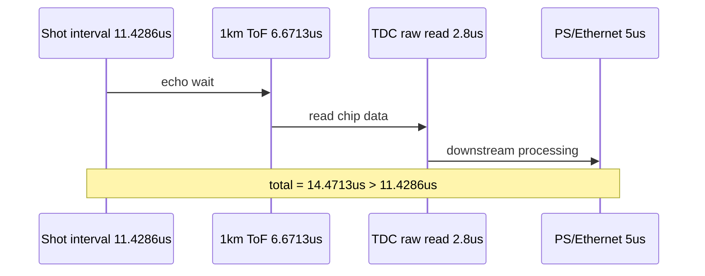

# C07 System Integration 0.144 x 0.144 Mode Feasibility Note v001

| 항목 | 내용 |
|---|---|
| 문서 종류 | 0.144 x 0.144 해상도 / 1km / 5Hz 가능성 검토 |
| 문서 버전 | v001 |
| 생성 시간 | 2026-07-08 12:21:49 KST |
| 수정 시간 | 2026-07-08 12:21:49 KST |
| Cluster | C07 System Integration / Release Readiness |
| 절대 기준 문서 | `Doc/TDC-GPX-Datasheet.pdf` |
| 입력 문서 | `C07_System_Integration_260708120147_5Hz_Frame_Budget_Result_v001.md` |

## 1. 결론

현재 전제 그대로라면 `0.144 x 0.144`, `1km`, `7echo`, `5Hz`를 동시에 만족하기 어렵다.

핵심 이유는 shot interval이 너무 짧아지기 때문이다.

```text
0.288H x 0.144V: shot interval = 22.8206 us
0.144H x 0.144V: shot interval = 11.4286 us
```

1km 왕복 시간은 해상도와 무관하게 약 `6.6713us`로 고정된다. 따라서 0.144H 모드에서는 1km echo가 돌아온 뒤 남는 시간이 `4.7573us`뿐이다.

```text
11.4286 us - 6.6713 us = 4.7573 us
```

이 안에 TDC raw read `2.8us`와 PS/Ethernet reserve `5us`를 모두 넣으면 다음과 같이 부족하다.

```text
11.4286 - 6.6713 - 2.8 - 5.0 = -3.0427 us
```

따라서 PS/Ethernet 5us를 shot-critical budget에 포함하는 조건에서는 0.144H 모드가 5Hz/1km를 만족하지 못한다.

## 2. 기준 계산

| 항목 | 값 |
|---|---:|
| horizontal points | 625 |
| vertical steps | 7 |
| shots/frame | 625 x 7 = 4,375 |
| 5Hz frame time | 200 ms |
| 90도 active time/frame | 50 ms |
| shot interval | 50 ms / 4,375 = 11.4286 us |
| PRF | 87.5 kHz |
| 1km round-trip ToF | 6.6713 us |
| TDC raw read | 2.8 us |
| PS/Ethernet reserve | 5.0 us |

## 3. Margin 분석

| 모델 | 계산 | Margin |
|---|---|---:|
| TDC raw read + PS/Ethernet 5us | `11.4286 - 6.6713 - 2.8 - 5.0` | -3.0427 us |
| TDC read -> VDMA DDR 10us + PS/Ethernet 5us | `11.4286 - 6.6713 - 10.0 - 5.0` | -10.2427 us |
| TDC raw read만 고려 | `11.4286 - 6.6713 - 2.8` | 1.9573 us |

해석:

- TDC raw read만 보면 0.144H 모드도 겨우 가능하다.
- 하지만 PS/Ethernet 5us를 같은 shot-critical path에 포함하면 불가능하다.
- 이전 C07 v002의 `TDC read -> VDMA DDR <=10us` 계약까지 그대로 유지하면 더 명확히 불가능하다.

## 4. 만족 조건으로 역산

### 4.1 1km 유지 시 가능한 frame rate

| 조건 | 필요한 frame time | 가능한 frame rate |
|---|---:|---:|
| ToF + TDC raw read 2.8us + PS/Ethernet 5us | 253.25 ms | 3.95 Hz |
| ToF + TDC/VDMA DDR 10us + PS/Ethernet 5us | 379.25 ms | 2.64 Hz |

즉 0.144H x 0.144V에서 1km와 7echo를 유지하려면, 현재 계산 기준으로는 5Hz가 아니라 약 `3.95Hz 이하` 또는 보수 계약 기준 `2.64Hz 이하`로 내려가야 한다.

### 4.2 5Hz 유지 시 가능한 거리

PS/Ethernet 5us와 TDC raw read 2.8us를 유지하면, ToF에 쓸 수 있는 시간은 다음뿐이다.

```text
11.4286 - 2.8 - 5.0 = 3.6286 us
```

이를 거리로 환산하면:

```text
max one-way distance = 3.6286us * c / 2
                     = 약 544 m
```

따라서 `0.144H x 0.144V`, `5Hz`, `7echo`, `PS/Ethernet 5us`를 유지한다면 1km가 아니라 약 `544m` 수준이 거리 상한 후보가 된다.

## 5. 선택 가능한 방향

| 방향 | 효과 | 판단 |
|---|---|---|
| 5Hz 유지, 0.144H 유지 | 최대 거리 또는 echo 수를 줄여야 한다 | 1km/7echo와 충돌 |
| 1km 유지, 0.144H 유지 | frame rate를 약 3.95Hz 이하로 낮춰야 한다 | 가능 후보 |
| 1km/5Hz 유지 | horizontal step을 0.288도 수준으로 완화해야 한다 | 현재 Mode A PASS 후보 |
| PS/Ethernet 5us를 shot-critical path에서 제외 | pipeline 처리로 가능성 증가 | 시스템 아키텍처 재정의 필요 |
| per-slope active mask / 128-bit / VDMA 최적화 | margin 개선 | 필요하지만 단독으로 -3us deficit을 모두 해결하긴 어려움 |

## 6. Timing / Pipeline / II



| Metric | 판단 |
|---|---|
| Latency | 0.144H 모드는 shot interval이 11.4286us라 latency budget이 매우 작다. |
| Throughput | PRF가 87.5kHz로 올라가며, 0.288H 대비 shot 처리량이 2배가 된다. |
| Pipeline | ToF는 pipeline으로 줄일 수 없는 물리 대기시간이다. 남은 4.7573us 안에 TDC/VDMA/PS를 넣어야 한다. |
| II | shot II 11.4286us에서 `ToF + TDC raw + PS/Ethernet`이 14.4713us이므로 II 위반이다. |

## 7. Lineage

| 이전 문서/결정 | 이번 반영 |
|---|---|
| `C07_System_Integration_260708120147_5Hz_Frame_Budget_Result_v001.md` | Mode B `0.144H x 0.144V`가 FAIL인 이유를 별도 계산으로 분리했다. |
| 사용자 질문 2026-07-08 | “분해능을 0.144 x 0.144로 가면 5Hz 만족이 어려운가?”에 대해 정량 답변을 기록했다. |
