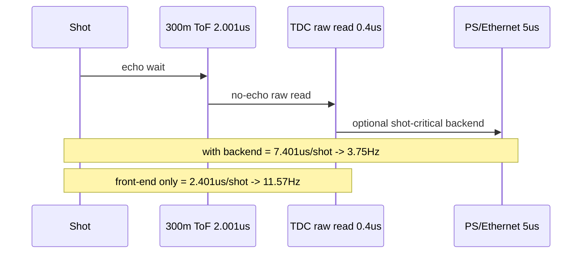

# C07 System Integration 300m No-Echo 0.1deg Max Hz Result v001

| 항목 | 내용 |
|---|---|
| 문서 종류 | 300m / Echo 없음 / 0.1도 x 0.1도 해상도 최대 영상속도 계산 |
| 문서 버전 | v001 |
| 생성 시간 | 2026-07-08 12:31:04 KST |
| 수정 시간 | 2026-07-08 12:31:04 KST |
| Cluster | C07 System Integration / Release Readiness |
| 절대 기준 문서 | `Doc/TDC-GPX-Datasheet.pdf` |
| 이전 문서 | `C07_System_Integration_260708122149_0144_Mode_Feasibility_Note_v001.md` |
| 계산 기준 | 기존 사용자 모델과 동일하게 FoV 90도 x 15도, 16ch APD array, 360도 회전 중 90도 FoV = frame time / 4 모델을 유지 |

## 1. 결론

거리 300m, Echo 없음, 해상도 `0.1도 x 0.1도` 조건에서 최대 영상속도는 후단 처리 가정에 따라 달라진다.

| 기준 | 최대 영상속도 |
|---|---:|
| Sensor/TDC/VDMA front-end만 고려 | 약 11.57 Hz |
| PS/Ethernet 5us가 shot-critical path에 포함 | 약 3.75 Hz |
| 이전 보수 계약 `TDC read -> VDMA DDR 10us` + `PS/Ethernet 5us` 유지 | 약 1.63 Hz |

실제 시스템 목표로는 두 번째 값인 `약 3.75Hz`를 우선 봐야 한다. 다만 PS/Ethernet 처리가 shot마다 blocking되지 않고 frame-level 또는 pipeline으로 겹칠 수 있다면 front-end 기준인 `약 11.57Hz`에 가까워질 수 있다.

## 2. Point / Shot 계산

| 항목 | 계산 | 값 |
|---|---|---:|
| 수평 point | 90도 / 0.1도 | 900 |
| 수직 point | 15도 / 0.1도 | 150 |
| 16ch APD vertical step | ceil(150 / 16) | 10 |
| 90도 FoV shot 수 | 900 x 10 | 9,000 shots |

주의: `0.1도 x 0.1도`에서 전체 공간 point는 `900 x 150 = 135,000 points/FoV`다. 그러나 16ch APD array가 한 shot에서 수직 16 point를 병렬 수집하므로 shot 수는 `900 x ceil(150/16) = 9,000`으로 계산한다.

## 3. 거리 / TDC 시간

### 3.1 300m 왕복 시간

정확한 빛의 속도 `299,792,458 m/s` 기준:

```text
round-trip time = 2 x 300m / c
                = 2.0014 us
```

### 3.2 Echo 없음 TDC raw read 시간

사용자 기존 식을 Echo 없음, 즉 1 echo로 바꾸면 다음과 같다.

```text
TDC raw read = 50ns x (16 points x 1 echo) / 2 TDC
             = 0.4 us
```

4-chip rise/fall 구조에서는 rise chip pair와 fall chip pair가 병렬로 동작한다고 본다. 따라서 slope를 둘 다 보존하더라도 이 계산을 단순히 2배로 곱하지 않는다. 단, 실제 출력 merge 구조가 rise/fall을 직렬화하면 별도 output margin이 필요하다.

## 4. 최대 Hz 계산

기존 사용자 모델에서는 90도 FoV active time이 frame time의 1/4이다. 따라서:

```text
frame_time = shot_time x shots_per_90deg x 4
max_hz     = 1 / frame_time
```

### 4.1 Front-end만 고려

```text
shot_time = ToF_300m + TDC_raw_read
          = 2.0014 + 0.4
          = 2.4014 us

frame_time = 2.4014us x 9,000 x 4
           = 86.45 ms

max_hz = 11.57 Hz
```

### 4.2 PS/Ethernet 5us 포함

```text
shot_time = ToF_300m + TDC_raw_read + PS/Ethernet
          = 2.0014 + 0.4 + 5.0
          = 7.4014 us

frame_time = 7.4014us x 9,000 x 4
           = 266.45 ms

max_hz = 3.75 Hz
```

### 4.3 이전 보수 계약 유지

이전 C07 v002에서 사용한 보수 계약을 그대로 쓰면:

```text
shot_time = ToF_300m + TDC/VDMA_DDR_contract + PS/Ethernet
          = 2.0014 + 10.0 + 5.0
          = 17.0014 us

frame_time = 17.0014us x 9,000 x 4
           = 612.05 ms

max_hz = 1.63 Hz
```

이 값은 Echo 없음 조건에서는 과도하게 보수적이다. 실제 release 판단에는 timing-specific TB와 VDMA DDR 계측으로 `TDC/VDMA_DDR` 시간을 다시 줄여야 한다.

## 5. 해석

| 질문 | 답 |
|---|---|
| 300m / no-echo / 0.1도 x 0.1도에서 5Hz가 가능한가? | PS/Ethernet 5us가 shot마다 blocking되면 어렵다. front-end만 보면 가능하다. |
| 몇 Hz가 현실적인가? | 현재 계산 기준으로는 system 전체 직렬 budget이면 약 3.75Hz, pipeline overlap이 잘 되면 11Hz 이상 가능성이 있다. |
| 5Hz를 만족하려면? | PS/Ethernet 5us가 shot-critical path에서 빠지거나, VDMA/PS 처리가 frame-level pipeline으로 겹쳐야 한다. |
| 해상도 병목은? | 0.1도 수평 때문에 shots/90도 FoV가 9,000으로 증가하는 것이 주된 병목이다. |

## 6. Timing / Pipeline / II



| Metric | 판단 |
|---|---|
| Latency | 300m ToF가 2.001us로 줄어, 거리 대기 병목은 크게 완화된다. |
| Throughput | Echo 없음으로 TDC raw read가 2.8us에서 0.4us로 줄어든다. |
| Pipeline | PS/Ethernet이 shot-level blocking이면 5Hz 달성이 어렵고, pipeline overlap이면 가능성이 커진다. |
| II | 5Hz를 만족하려면 9,000 shots/90도 FoV 기준 shot_time이 `200ms / 4 / 9000 = 5.556us` 이하여야 한다. PS/Ethernet 5us를 더하면 7.401us라서 초과한다. |

## 7. 5Hz 만족 조건

`0.1도 x 0.1도`, 300m, no-echo에서 5Hz를 만족하려면 shot_time은 다음보다 작아야 한다.

```text
required_shot_time = 200ms / 4 / 9,000
                   = 5.5556 us
```

현재 front-end는:

```text
2.0014us + 0.4us = 2.4014us
```

따라서 front-end margin은:

```text
5.5556 - 2.4014 = 3.1542us
```

즉 PS/Ethernet 또는 backend가 shot-critical path에 들어갈 수 있는 시간은 약 `3.15us`뿐이다. 기존 5us backend reserve는 이보다 커서 5Hz를 깨뜨린다.

## 8. 다음 검증 항목

| ID | 우선순위 | 항목 | 목적 |
|---|---|---|---|
| C07-300M-01 | P0 | PS/Ethernet 5us가 shot-critical인지 frame-level pipeline인지 결정 | 최대 Hz가 3.75Hz인지 11.57Hz인지 갈라진다. |
| C07-300M-02 | P0 | no-echo timing-specific TB | `read-start -> final AXIS accepted`를 no-echo 조건으로 직접 계측한다. |
| C07-300M-03 | P1 | VDMA DDR write latency 실측 | backend reserve를 5us에서 실측값으로 교체한다. |
| C07-300M-04 | P1 | 5Hz 만족 구조안 | backend shot-critical 시간을 3.15us 이하로 줄이거나 pipeline overlap 구조를 확정한다. |

## 9. Lineage

| 이전 문서/결정 | 이번 반영 |
|---|---|
| `C07_System_Integration_260708122149_0144_Mode_Feasibility_Note_v001.md` | 0.144도/1km/7echo의 어려움을 확인한 뒤, 거리 300m/no-echo/0.1도 조건으로 재계산했다. |
| 사용자 질문 2026-07-08 | “거리 300m, Echo 없음, 수평 0.1 x 수직 0.1일 때 최대 영상속도”를 계산해 기록했다. |
