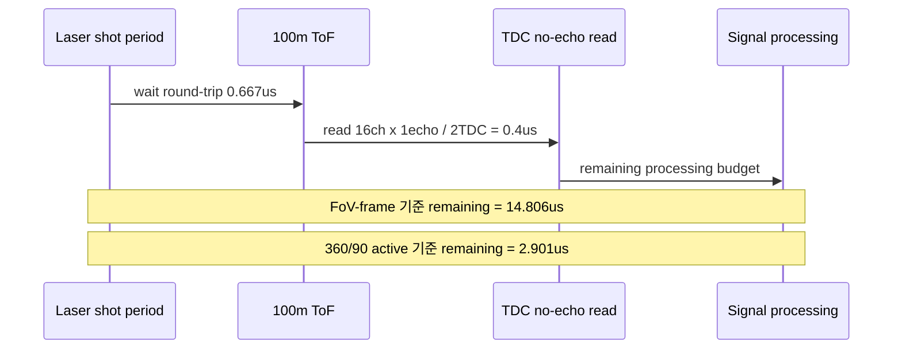

# C07 System Integration 100m 20Hz 0.2deg PRF Budget v001

| 항목 | 내용 |
|---|---|
| 문서 종류 | 100m / 20Hz / 0.2도 x 0.2도 / 1 echo / 16ch APD array PRF 및 shot budget 계산 |
| 문서 버전 | v001 |
| 생성 시간 | 2026-07-08 12:38:56 KST |
| 수정 시간 | 2026-07-08 12:38:56 KST |
| Cluster | C07 System Integration / Release Readiness |
| 절대 기준 문서 | `Doc/TDC-GPX-Datasheet.pdf` |
| 이전 문서 | `C07_System_Integration_260708123104_300m_NoEcho_010deg_MaxHz_Result_v001.md` |
| 계산 기준 | 수평 90도, 수직 20도, 20Hz, 거리 100m, 해상도 0.2도 x 0.2도, echo=1, 16ch APD array |

## 1. 결론

`수평 90도 x 수직 20도` FoV 자체를 1 frame으로 정의하면 다음과 같다.

```text
shots/frame = 3,150
frame rate  = 20 Hz
PRF         = 63.0 kHz
shot period = 15.873 us
```

100m 왕복 시간과 TDC no-echo read 시간을 빼면 shot 내부 신호처리 여유는 다음이다.

```text
100m round-trip ToF = 0.667 us
TDC no-echo read    = 0.400 us
remaining budget    = 15.873 - 0.667 - 0.400
                    = 14.806 us
```

따라서 90도 FoV를 1 frame으로 보는 기준에서는 20Hz 운용이 충분히 가능해 보인다.

다만 기존 문서들처럼 360도 회전 중 90도 FoV 구간만 쓰는 `4등분 active-time 모델`을 적용하면 PRF는 4배가 된다.

```text
PRF_4x         = 252.0 kHz
shot period_4x = 3.968 us
remaining_4x   = 3.968 - 0.667 - 0.400
               = 2.901 us
```

이 경우도 front-end만 보면 가능하지만, PS/Ethernet 5us가 shot-critical path에 붙으면 불가능하다.

## 2. 1 Frame 내 필요 laser shot 수

| 항목 | 계산 | 값 |
|---|---|---:|
| 수평 point 수 | 90도 / 0.2도 | 450 |
| 수직 point 수 | 20도 / 0.2도 | 100 |
| 16ch APD vertical step | ceil(100 / 16) | 7 |
| 1 frame shot 수 | 450 x 7 | 3,150 shots/frame |

해석:

- 16ch APD array는 한 shot에서 수직 16 point를 병렬로 받을 수 있다.
- 수직 100 point를 모두 덮으려면 `ceil(100/16)=7` step이 필요하다.
- 따라서 수평 450 position마다 수직 step 7회가 필요하므로 `450 x 7 = 3,150 shots/frame`이다.

## 3. PRF / laser 간격

### 3.1 FoV 90도 = 1 frame 기준

| 항목 | 계산 | 값 |
|---|---|---:|
| frame rate | 목표 | 20 Hz |
| frame time | 1 / 20Hz | 50 ms |
| shots/frame | 위 계산 | 3,150 |
| PRF | 3,150 x 20 | 63.0 kHz |
| laser-to-laser period | 1 / 63kHz | 15.873 us |

### 3.2 360도 회전 중 90도 FoV만 active인 경우

| 항목 | 계산 | 값 |
|---|---|---:|
| 90도 active time | 50ms / 4 | 12.5 ms |
| shots/90도 FoV | 3,150 | 3,150 |
| PRF | 3,150 / 12.5ms | 252.0 kHz |
| laser-to-laser period | 1 / 252kHz | 3.968 us |

주의: 사용자가 "1 frame = 90도 FoV"라고 정의하면 3.1이 맞다. 반대로 실제 스캐너가 360도 중 90도 구간에서만 해당 FoV를 얻는 구조라면 3.2를 써야 한다.

## 4. 빛의 왕복 시간

정확한 빛의 속도 `299,792,458 m/s` 기준:

```text
round-trip time = 2 x 100m / c
                = 0.667128 us
```

| 거리 | 왕복 시간 |
|---:|---:|
| 100m | 0.667 us |

## 5. TDC data read 시간

Echo 값이 1이므로 사용자 기존 식은 다음과 같이 바뀐다.

```text
TDC raw read = 50ns x (16 points x 1 echo) / 2 TDC
             = 0.4 us
```

| 항목 | 값 |
|---|---:|
| points/shot | 16 |
| echo/point | 1 |
| TDC pair | 2 |
| read unit | 50 ns |
| TDC raw read | 0.4 us |

## 6. shot 내부 budget

### 6.1 FoV 90도 = 1 frame 기준

```text
shot period       = 15.873 us
ToF 100m          =  0.667 us
TDC raw read      =  0.400 us
remaining budget  = 14.806 us
```

| 항목 | 시간 |
|---|---:|
| laser-to-laser period | 15.873 us |
| 100m 왕복 대기 | 0.667 us |
| TDC no-echo read | 0.400 us |
| 남는 신호처리 시간 | 14.806 us |
| PS/Ethernet 5us 포함 후 margin | 9.806 us |

판단: 충분히 가능하다. PS/Ethernet 5us가 shot-critical path에 포함되어도 약 9.8us margin이 남는다.

### 6.2 360도/90도 active-time 기준

```text
shot period       = 3.968 us
ToF 100m          = 0.667 us
TDC raw read      = 0.400 us
remaining budget  = 2.901 us
```

| 항목 | 시간 |
|---|---:|
| laser-to-laser period | 3.968 us |
| 100m 왕복 대기 | 0.667 us |
| TDC no-echo read | 0.400 us |
| 남는 신호처리 시간 | 2.901 us |
| PS/Ethernet 5us 포함 후 margin | -2.099 us |

판단: front-end만 보면 가능하지만, PS/Ethernet 5us가 shot마다 blocking되면 불가능하다. 이 경우 PS/Ethernet은 반드시 frame-level 또는 pipeline으로 겹쳐야 한다.

## 7. Timing / Pipeline / II



| Metric | FoV 90도 = 1 frame | 360도/90도 active-time |
|---|---:|---:|
| Latency budget/shot | 15.873 us | 3.968 us |
| ToF | 0.667 us | 0.667 us |
| TDC no-echo read | 0.400 us | 0.400 us |
| 신호처리 여유 | 14.806 us | 2.901 us |
| II / PRF | 15.873us / 63kHz | 3.968us / 252kHz |
| 20Hz 가능성 | 높음 | front-end만 가능, backend blocking이면 어려움 |

## 8. 다음 확인 항목

| ID | 우선순위 | 항목 | 이유 |
|---|---|---|---|
| C07-100M-01 | P0 | frame 정의 확정 | 90도 FoV를 frame으로 보는지, 360도 회전 중 90도 active-time으로 보는지에 따라 PRF가 4배 차이난다. |
| C07-100M-02 | P0 | PS/Ethernet 처리 위치 확정 | shot-critical path인지 frame-level pipeline인지에 따라 360도 active-time 모델 가능성이 갈린다. |
| C07-100M-03 | P1 | no-echo timing TB | 실제 `read-start -> final AXIS accepted` 시간을 no-echo 조건으로 계측한다. |
| C07-100M-04 | P1 | 20Hz full-frame stress | 3,150 shots/frame 조건을 frame-level buffer/VDMA가 감당하는지 확인한다. |

## 9. Lineage

| 이전 문서/결정 | 이번 반영 |
|---|---|
| `C07_System_Integration_260708123104_300m_NoEcho_010deg_MaxHz_Result_v001.md` | 거리/해상도/Hz 조건을 새 사용자 목표인 100m, 20Hz, 0.2도, 1echo로 재계산했다. |
| 사용자 질문 2026-07-08 | 1 frame 내 필요 laser shot 수, PRF, laser 간격, 그 안에서의 ToF 및 신호처리 budget을 계산해 기록했다. |

## 10. Forward Trace

| 이후 문서 | 반영 내용 |
|---|---|
| `C07_System_Integration_260708125148_100m_20Hz_4Facet_Mirror_PRF_Budget_v002.md` | 사용자 설명에 따라 v001의 수직 7 step 모델과 360도/90도 active-time 단순 모델을 정정했다. 실제 구조는 4각 다면 미러이며, 한 면의 광학 90도는 반사법칙에 의해 기계각 45도 동안 발생한다. 또한 수직 20도는 한 면당 16ch APD가 동시에 담당하므로 수직 step을 곱하지 않는다. 그 결과 active PRF는 252kHz가 아니라 72kHz, laser period는 3.968us가 아니라 13.8889us로 정정된다. |
