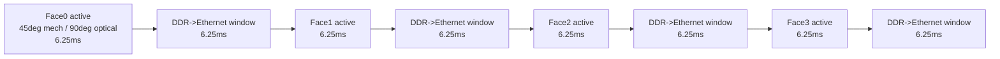
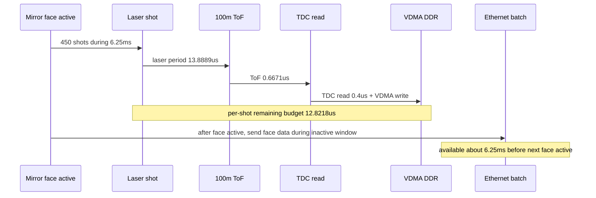

# C07 System Integration 100m 20Hz 4-Facet Mirror PRF Budget v002

| 항목 | 내용 |
|---|---|
| 문서 종류 | 4각 다면 미러 / 반사법칙 기반 100m 20Hz 0.2도 shot budget 정정 |
| 문서 버전 | v002 |
| 생성 시간 | 2026-07-08 12:51:48 KST |
| 수정 시간 | 2026-07-08 12:51:48 KST |
| Cluster | C07 System Integration / Release Readiness |
| 절대 기준 문서 | `Doc/TDC-GPX-Datasheet.pdf` |
| 직전 문서 | `C07_System_Integration_260708123856_100m_20Hz_020deg_PRF_Budget_v001.md` |
| 정정 사유 | 실제 구조는 360도 회전 4각 다면 미러이며, 한 면이 광학 90도를 담당한다. 반사법칙 때문에 광학 90도는 미러 기계각 45도 회전 동안 발생한다. 또한 수직 20도는 한 면당 16ch APD가 동시에 담당하므로 수직 7 step 모델을 쓰지 않는다. |

## 1. 이해한 운용 개념

사용자 설명에 따른 최종 운용 모델은 다음과 같다.

1. 4각 다면 미러가 360도 회전한다.
2. 한 면이 광학 FoV 수평 90도를 담당한다.
3. 반사법칙 때문에 광학 90도 스캔은 미러 기계각 45도 회전 동안 발생한다.
4. 수직 20도는 한 면당 16개 APD point가 동시에 담당한다.
5. 따라서 수직 분해능은 별도 step 수가 아니라 16ch APD 배치로 결정된다.
6. 한 면의 90도 active scan 중에는 laser point마다 VDMA를 통해 DDR까지 데이터를 보낸다.
7. 한 면의 active scan이 끝나고 다음 면 scan이 시작되기 전에는 DDR에 모인 face 데이터를 Ethernet으로 한 번에 보낸다.

이 구조에서는 PRF를 평균 frame 기준이 아니라 **한 면의 45도 기계각 active window** 기준으로 계산해야 한다.

## 2. 기하 / 시간 모델

20Hz frame이면 4각 미러 1회전 시간이 다음이다.

```text
frame rate = 20 Hz
rotation period = 1 / 20Hz = 50 ms
```

한 면의 광학 90도 FoV는 기계각 45도 동안 발생한다.

```text
active time per face = 50ms x 45deg / 360deg
                     = 6.25 ms
```

한 면 active scan 후 다음 면 active scan까지의 inactive/dead window도 동일하게 약 `6.25ms`로 본다. 이 구간이 DDR에 모아둔 face 데이터를 Ethernet으로 보내는 시간 후보가 된다.



## 3. Shot 수 계산

수평 분해능은 `0.2도`이고, 광학 수평 FoV는 한 면당 `90도`다.

```text
horizontal shots per face = 90deg / 0.2deg
                          = 450 shots/face
```

수직은 `20도`를 16ch APD가 동시에 담당한다. 따라서 수직 step을 별도로 곱하지 않는다.

| 항목 | 계산 | 값 |
|---|---|---:|
| 수평 FoV/face | 고정 | 90도 |
| 수평 분해능 | 목표 | 0.2도 |
| shots/face | 90 / 0.2 | 450 |
| APD vertical points/shot | 고정 | 16 |
| faces/frame | 4각 미러 | 4 |
| shots/frame | 450 x 4 | 1,800 |
| points/face | 450 x 16 | 7,200 |
| points/frame | 7,200 x 4 | 28,800 |

주의: 이전 v001은 수직 20도를 0.2도 grid로 나누어 `100 vertical points`, `ceil(100/16)=7 step`을 곱했다. 이번 사용자 설명에 따르면 그 모델은 폐기한다. 수직 분해능은 한 면의 16ch APD 배치로 결정된다.

## 4. PRF / laser 간격

### 4.1 순간 PRF, active window 기준

한 면의 active window는 6.25ms이고, 그 안에 450 shots가 들어가야 한다.

```text
PRF_active = 450 shots / 6.25ms
           = 72 kHz

laser period_active = 1 / 72kHz
                    = 13.8889 us
```

### 4.2 평균 PRF, frame 전체 기준

Frame 전체로 평균을 내면:

```text
PRF_average = 1,800 shots / 50ms
            = 36 kHz

average period = 27.7778 us
```

하지만 laser 간격 설계에는 평균 PRF가 아니라 active window 기준 `72kHz`, `13.8889us`를 사용해야 한다.

| 기준 | PRF | laser period | 사용 목적 |
|---|---:|---:|---|
| active window 기준 | 72 kHz | 13.8889 us | 실제 laser shot 간격 설계 |
| frame 평균 기준 | 36 kHz | 27.7778 us | 평균 데이터율/열/전력 계산 |

## 5. 100m ToF와 TDC 처리 budget

100m 왕복 시간:

```text
round-trip time = 2 x 100m / 299,792,458m/s
                = 0.6671 us
```

Echo=1, 16ch, 2 TDC pair 기준 TDC raw read 보수 계산:

```text
TDC raw read = 50ns x (16 points x 1 echo) / 2 TDC
             = 0.4 us
```

따라서 active laser period 안에서 남는 시간은:

```text
remaining = 13.8889us - 0.6671us - 0.4us
          = 12.8218us
```

| 항목 | 시간 |
|---|---:|
| active laser period | 13.8889 us |
| 100m 왕복 ToF | 0.6671 us |
| TDC no-echo read | 0.4000 us |
| TDC/VDMA 및 local 신호처리 여유 | 12.8218 us |

판단: laser와 laser 사이에서 100m echo 대기와 TDC read를 수행하는 것은 충분히 가능하다.

## 6. DDR / Ethernet 처리 위치

이번 운용 모델에서는 PS/Ethernet이 shot마다 blocking되는 구조가 아니다.

| 구간 | 수행 내용 | 시간 후보 |
|---|---|---:|
| Face active 45도 | laser firing, TDC read, VDMA -> DDR | 6.25 ms |
| Face inactive / next face 전 | DDR에 모인 face data를 Ethernet으로 전송 | 6.25 ms |

한 face 데이터량은 point payload에 따라 달라진다.

| Payload/point | Face data | Frame data @20Hz |
|---:|---:|---:|
| 2 bytes | 14.4 KB/face | 1.152 MB/s |
| 4 bytes | 28.8 KB/face | 2.304 MB/s |
| 8 bytes | 57.6 KB/face | 4.608 MB/s |

이 데이터율 자체는 Ethernet 대역폭 관점에서는 크지 않다. 다만 PS software overhead, packetization, cache/DDR copy 여부는 별도 계측이 필요하다.

## 7. 이전 v001과의 차이

| 항목 | v001 | v002 정정 |
|---|---:|---:|
| 수직 처리 | 100 vertical points / 16ch = 7 steps | 한 면당 16ch가 수직 20도 담당, step 없음 |
| shots/frame | 3,150 | 1,800 |
| active PRF | 252 kHz | 72 kHz |
| laser period | 3.968 us | 13.8889 us |
| ToF+TDC 후 여유 | 2.901 us | 12.8218 us |
| PS/Ethernet 위치 | shot-critical 가능성 검토 | face inactive window에서 batch 전송 |

v002 기준에서는 20Hz/100m/0.2도/echo1 조건이 훨씬 안정적인 가능 영역으로 이동한다.

## 8. Timing / Pipeline / II



| Metric | 판단 |
|---|---|
| Latency | laser-to-laser active period는 13.8889us이며, ToF+TDC read 후 12.8218us가 남는다. |
| Throughput | 순간 PRF는 72kHz, 평균 PRF는 36kHz다. 실제 laser driver와 TDC budget은 순간 PRF 기준으로 봐야 한다. |
| Pipeline | shot 중에는 VDMA DDR까지 지속적으로 밀어 넣고, Ethernet은 face 단위 batch로 inactive window에서 처리한다. |
| II | shot II는 13.8889us다. 100m/echo1 조건에서는 II 위반 가능성이 낮다. |
| Risk | DDR->Ethernet batch가 6.25ms 안에 완료되는지 PS 측 계측이 필요하다. |

## 9. 다음 확인 항목

| ID | 우선순위 | 항목 | 이유 |
|---|---|---|---|
| C07-4FACET-01 | P0 | 16ch vertical optical mapping 확정 | 수직 20도를 16 point가 어떻게 담당하는지, 각 point angular spacing을 확정해야 한다. |
| C07-4FACET-02 | P0 | active window 45도 검증 | 실제 광학 FoV 90도가 기계각 45도에서 정확히 확보되는지 mechanical/optical 모델 확인 필요 |
| C07-4FACET-03 | P0 | face batch Ethernet budget 계측 | face inactive window 약 6.25ms 안에 DDR->Ethernet 전송 완료 필요 |
| C07-4FACET-04 | P1 | 72kHz active PRF timing TB | `13.8889us shot II`, `100m`, `echo1`, `16ch` 조건의 end-to-end timing TB |

## 10. Lineage

| 이전 문서/결정 | 이번 반영 |
|---|---|
| `C07_System_Integration_260708123856_100m_20Hz_020deg_PRF_Budget_v001.md` | 수직 7 step 및 360도/90도 active-time 모델을 폐기하고, 4각 다면 미러 + 반사법칙 + 16ch 수직 동시 수집 모델로 정정했다. |
| 사용자 설명 2026-07-08 | 4각 다면 미러, 한 면당 광학 90도, 기계각 45도 active scan, face 단위 DDR->Ethernet batch 구조를 공식 운용 개념으로 기록했다. |

## 11. Forward Trace

| 이후 문서 | 반영 내용 |
|---|---|
| `C07_System_Integration_260708125917_300m_7Echo_4Chip_VDMA_DDR_Budget_v001.md` | v002의 `13.8889us shot II`, `72kHz active PRF`, `face batch Ethernet` 모델을 유지하고, 거리 300m 및 echo=7 조건으로 확장했다. 보수 계산 기준으로 64-bit는 `ToF + TDC read + output = 5.4814us`, laser period 대비 guard `8.4075us`로 VDMA DDR 적재 가능 영역으로 판단했다. |
