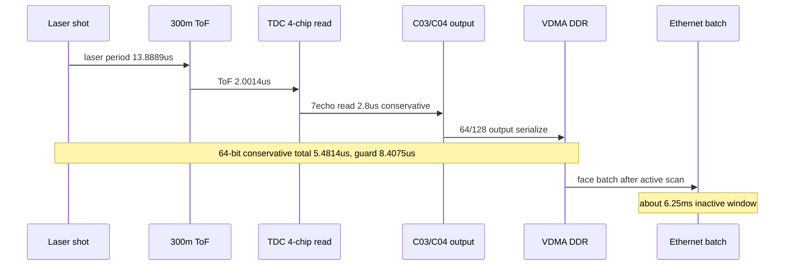

# C07 System Integration 300m 7Echo 4Chip VDMA DDR Budget v001

| 항목 | 내용 |
|---|---|
| 문서 종류 | 4각 다면 미러 active shot interval 내 300m / 7echo / 4-chip / VDMA DDR 가능성 판단 |
| 문서 버전 | v001 |
| 생성 시간 | 2026-07-08 12:59:17 KST |
| 수정 시간 | 2026-07-08 12:59:17 KST |
| Cluster | C07 System Integration / Release Readiness |
| 절대 기준 문서 | `Doc/TDC-GPX-Datasheet.pdf` |
| 입력 문서 | `C07_System_Integration_260708125148_100m_20Hz_4Facet_Mirror_PRF_Budget_v002.md` |
| 검토 조건 | 4각 다면 미러, 20Hz, 한 면 active 기계각 45도, 수평 90도/0.2도, 수직 20도/16ch, 거리 300m, echo=7, TDC-GPX 4 chips |

## 1. 결론

현재 계산 기준에서는 **문제 없어 보인다**고 판단한다.

한 면 active scan 기준 laser-to-laser 간격은 `13.8889us`다. 300m 왕복 시간과 7echo TDC read, 그리고 C04 output serialization을 보수적으로 합산해도 다음 수준이다.

```text
300m ToF                 = 2.0014 us
TDC 7echo read 보수값     = 2.8000 us
64-bit output @150MHz    = 0.6800 us
합계                     = 5.4814 us
남는 DDR/VDMA guard      = 13.8889 - 5.4814
                         = 8.4075 us
```

128-bit 출력은 output serialization이 더 짧으므로 guard가 약 `8.6408us`로 조금 더 커진다.

따라서 300m/7echo 조건에서 laser 간격 안에 `빛 왕복 대기 -> TDC 4-chip read -> VDMA 입력/DDR 적재`를 넣는 것은 가능 영역으로 본다. 단, 최종 release 판단은 VDMA `tready` stall과 DDR write completion을 실제 보드 또는 timing-specific TB로 확인해야 한다.

## 2. 기준 timing

이전 v002에서 정리한 4각 다면 미러 모델:

| 항목 | 값 |
|---|---:|
| frame rate | 20 Hz |
| rotation period | 50 ms |
| face active mechanical angle | 45도 |
| active time/face | 6.25 ms |
| shots/face | 450 |
| active PRF | 72 kHz |
| laser period | 13.8889 us |

300m 왕복 시간:

```text
round-trip time = 2 x 300m / c
                = 2.0014 us
```

## 3. TDC 4-chip / 7echo read 판단

TDC-GPX 4-chip 구조는 다음 전제를 둔다.

1. chip0/1은 rising edge, chip2/3은 falling edge를 담당한다.
2. 각 chip은 8 channel 기준으로 동작한다.
3. chip별 bus/control path는 병렬이다.
4. 따라서 4개 chip을 순차로 읽는 시간으로 4배 곱하지 않는다.
5. 병목은 가장 늦은 chip read와 C03/C04 output/VDMA stall이다.

사용자 보수식:

```text
TDC read = 50ns x (16 points x 7 echoes) / 2 TDC
         = 2.8 us
```

C02 xsim 근거:

```text
56 words drain = 428clk @200MHz = 2.14us
```

| 기준 | 값 | 판단 |
|---|---:|---|
| 사용자 보수값 | 2.8 us | release budget에 사용 |
| C02 xsim 관측값 | 2.14 us | 실제 RTL 경로는 보수값보다 빠른 근거 |

## 4. VDMA/DDR까지의 budget

현재 C07 target xsim의 C04 output serialization 근거:

| Width | output beats/slope | 150MHz serialization time |
|---:|---:|---:|
| 64-bit | 102 | 0.6800 us |
| 128-bit | 67 | 0.4467 us |

보수 계산:

| Width | 계산 | 합계 | laser period 대비 guard |
|---:|---|---:|---:|
| 64-bit | `2.0014 + 2.8 + 0.6800` | 5.4814 us | 8.4075 us |
| 128-bit | `2.0014 + 2.8 + 0.4467` | 5.2481 us | 8.6408 us |

C02 xsim 실측값 2.14us를 사용하면:

| Width | 계산 | 합계 | laser period 대비 guard |
|---:|---|---:|---:|
| 64-bit | `2.0014 + 2.14 + 0.6800` | 4.8214 us | 9.0675 us |
| 128-bit | `2.0014 + 2.14 + 0.4467` | 4.5881 us | 9.3008 us |

해석:

- 64-bit도 충분히 가능 영역이다.
- 128-bit는 serialization guard가 더 크다.
- 현재 구조의 공통 active mask padding/header까지 포함한 beat 기준에서도 margin이 있다.
- per-slope active chip mask를 적용하면 output beat와 DDR traffic이 더 줄어들 수 있다.

## 5. DDR/VDMA 데이터율 rough estimate

C07 target xsim beat 수를 그대로 사용해 rough bandwidth를 계산하면 다음과 같다. rise/fall 두 stream을 모두 DDR에 저장한다고 보고, padding/header 포함 beat 기준으로 보수 계산했다.

| Width | bytes/shot | active bandwidth @72kHz | average bandwidth @36kHz |
|---:|---:|---:|---:|
| 64-bit | `102 beats x 8B x 2 slope = 1,632B` | 117.5 MB/s | 58.8 MB/s |
| 128-bit | `67 beats x 16B x 2 slope = 2,144B` | 154.4 MB/s | 77.2 MB/s |

데이터율 자체는 일반적인 Zynq DDR/AXI VDMA 대역폭에서 과도한 수준으로 보이지 않는다. 실제 위험은 다음이다.

1. VDMA `tready` stall이 shot-critical guard를 초과하는가
2. DDR arbitration/QoS 때문에 burst가 지연되는가
3. rise/fall 두 stream을 별도 VDMA로 받을지, merge해서 받을지
4. descriptor/frame buffer 전환이 face boundary에서 끊김 없이 동작하는가

## 6. Face 단위 Ethernet batch

Echo point 수:

| 항목 | 계산 | 값 |
|---|---|---:|
| echo points/face | `450 shots x 16ch x 7echo` | 50,400 |
| echo points/frame | `50,400 x 4` | 201,600 |

Ethernet은 shot마다 blocking되지 않고 face inactive window에서 batch 전송하는 구조다. 한 face active 후 다음 face active 전까지 약 `6.25ms`가 있으므로, face data를 이 구간에 보낼 수 있는지 PS/Ethernet 계측이 필요하다.

## 7. Timing / Pipeline / II



| Metric | 판단 |
|---|---|
| Latency | 300m/7echo/64-bit 보수 합계가 5.4814us로 laser period 13.8889us 안에 들어온다. |
| Throughput | active PRF 72kHz 기준 rough DDR bandwidth는 64-bit 117.5MB/s, 128-bit 154.4MB/s 수준이다. |
| Pipeline | shot-critical path는 `ToF -> TDC read -> VDMA DDR`이고 Ethernet은 face batch path로 분리된다. |
| II | shot II 13.8889us 대비 guard가 8us 이상이므로 II 위반 가능성은 낮다. |
| Risk | 실제 VDMA DDR completion과 tready stall은 보드 계측 또는 timing TB로 닫아야 한다. |

## 8. 판단 조건

이 판단은 다음 조건에서 유효하다.

| 조건 | 상태 |
|---|---|
| 4개 TDC chip bus/control path가 병렬 | RTL 구조상 가능 전제 |
| VDMA가 shot마다 장시간 backpressure를 걸지 않음 | 검증 필요 |
| Ethernet은 shot-critical이 아니라 face batch | 사용자 운용 개념 |
| DDR write가 8us guard 안에 완료 | 계측 필요 |
| 64/128 output stream sink가 충분히 ready | 검증 필요 |

## 9. 다음 검증 항목

| ID | 우선순위 | 항목 | 목적 |
|---|---|---|---|
| C07-300M7E-01 | P0 | timing-specific TB | `13.8889us shot II`, `300m`, `7echo`, `4chip`, `64/128bit` 조건에서 fixed wait 없이 final AXIS accepted까지 계측 |
| C07-300M7E-02 | P0 | VDMA DDR write 계측 | DDR write completion이 guard 8us 안에 들어오는지 확인 |
| C07-300M7E-03 | P1 | face batch Ethernet 계측 | inactive window 6.25ms 안에 face data 전송 가능 확인 |
| C07-300M7E-04 | P1 | per-slope active mask 적용 검토 | DDR traffic과 output beats를 줄여 margin 확대 |

## 10. Lineage

| 이전 문서/결정 | 이번 반영 |
|---|---|
| `C07_System_Integration_260708125148_100m_20Hz_4Facet_Mirror_PRF_Budget_v002.md` | 4각 다면 미러 active shot interval 13.8889us 모델을 유지하고, 거리 300m 및 echo=7 조건으로 확장했다. |
| 사용자 질문 2026-07-08 | “레이저와 레이저 간격에서 300m 왕복을 echo 7까지 확장해 4-chip TDC와 VDMA DDR까지 쌓는 데 문제 없는가?”에 대한 판단과 근거를 기록했다. |

## 11. Forward Trace

| 이후 문서 | 반영 내용 |
|---|---|
| `C07_System_Integration_260708130837_Polygon_Mirror_Optical_Timing_Simulator_v001.md` | 300m/7echo/4-chip/VDMA DDR 판단을 기본값으로 사용하고, 4각/5각 다면 미러, 반사법칙 active window, face rest Ethernet batch, target plane point map을 HTML 시뮬레이터로 구현했다. |
