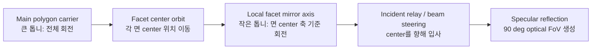

# C07 Face-Center Incident Model Review v001

| 항목 | 내용 |
|---|---|
| 문서 종류 | 광학 구조 검토 기록 |
| 문서 버전 | v001 |
| 생성 시간 | 2026-07-08 17:24:04 KST |
| Cluster | C07 System Integration / Optical Timing Simulator |
| 기준 문서 | `Doc/cluster_analysis/C07_System_Integration/C07_System_Integration_260708130837_Polygon_Mirror_Optical_Timing_Simulator_v001.md` |
| 사용자 명제 | 입사 레이저가 다면미러의 각 면 center로 입사되도록, 다면미러 회전 중심축 의존 관계를 제거하고 facet-center 축 관점의 회전/반사를 검토 |

## 1. 결론

사용자 명제는 다음과 같이 분리해서 판단해야 한다.

| 구조 | 가능성 | 판단 |
|---|---:|---|
| 단일 고정 광원 + 고정 진행각 + 강체 다면미러 | 불가 | 각 facet center는 polygon 중심을 기준으로 원호를 그리며 이동한다. 고정 직선 ray가 이 원호 전체를 계속 통과할 수 없다 |
| 단일 고정 광원 + 시간가변 beam steering | 가능 | 진행각을 encoder phase에 맞춰 계속 바꾸면 현재 facet center를 조준할 수 있다 |
| facet center와 함께 이동하는 광원/relay optics | 가능 | 광원 또는 광학 relay가 facet center local axis를 따라 움직이면 center incidence를 만들 수 있다 |
| 큰 톱니 + 작은 톱니로 facet mirror local angle을 별도 구동 | 가능하지만 별도 복합 스캐너 | 더 이상 단순 polygon mirror가 아니라 main carrier rotation과 local facet mirror rotation을 동시에 갖는 구조 |

핵심 판단: `입사 레이저가 항상 각 면 center로 들어간다`를 성립시키려면, 고정 입사 ray 모델을 버리고 `beam steering`, `co-moving relay`, 또는 `local-axis geared mirror` 중 하나를 명시해야 한다.

## 2. 왜 단순 고정 ray로는 불가능한가

regular polygon의 i번째 facet center를 `C_i(theta)`라고 하면, 강체 다면미러에서는 이 점이 polygon 회전 중심 `O`를 기준으로 원호를 그린다.

```text
C_i(theta) = O + rho x R(theta + phi_i) x u_i
```

고정 광원과 고정 진행각이 만드는 ray는 하나의 직선이다.

```text
L(t) = S + t x d
```

`C_i(theta)`가 active window 전체에서 항상 `L(t)` 위에 있으려면 원호 일부가 직선 위에 놓여야 한다. 원과 직선은 일반적으로 최대 2점에서만 만난다. 따라서 `rho = 0` 같은 퇴화 조건이 아니면, 고정 ray가 회전 중인 facet center를 연속적으로 맞추는 것은 물리적으로 불가능하다.

이 검토가 이전 시뮬레이터에서 보였던 문제의 원인이다. `고정 ray`와 `face center 조준`을 동시에 만족시키려 하면 ray가 대각선으로 틀어지거나, face center를 따라 움직이는 것처럼 보이는 모순이 생긴다.

## 3. 큰 톱니 / 작은 톱니 구조의 의미

사용자가 제안한 구조는 다음과 같이 해석할 수 있다.



이 구조에서는 반사면의 상태가 두 개의 자유도를 갖는다.

| 자유도 | 의미 |
|---|---|
| main carrier angle `theta` | 어떤 face가 optical window에 들어오는지 결정 |
| local mirror angle `psi(theta)` | 해당 face center 기준으로 실제 반사면 접선/법선 각도를 결정 |

이때 반사 법칙은 polygon 중심이 아니라 facet center local hit point 기준으로 적용해야 한다.

```text
output_angle(theta) = 2 x tangent_angle_local(theta) - incident_angle(theta)
```

만약 local incident angle을 일정하게 유지할 수 있다면, optical FoV는 local mirror angle sweep의 2배가 된다.

```text
optical_fov = 2 x local_mirror_sweep
```

따라서 90도 optical FoV를 얻으려면 active 구간에서 local mirror angle이 45도 sweep되어야 한다.

## 4. 가능한 구현 조건

### 4.1 Beam steering 방식

고정 광원은 유지하되 encoder phase를 이용해 입사 진행각을 계속 바꾼다.

```text
incident_angle(theta) = angle(S -> C_i(theta))
```

장점은 광원이 고정될 수 있다는 점이다. 단점은 beam steering 장치가 필요하고, incident angle이 변하므로 출력각은 `2 x tangent - incident`로 다시 계산해야 한다.

### 4.2 Co-moving relay 방식

광섬유, 회전 relay, 소형 collimator, 또는 동등한 광학계를 facet center local axis와 함께 이동시킨다.

장점은 `facet center 입사` 명제를 가장 직접적으로 만족한다. 단점은 회전부 광학 정렬, 전원/열/진동, 동적 밸런스, 배선/광섬유 수명 문제가 커진다.

### 4.3 Local-axis geared mirror 방식

큰 톱니는 face indexing과 rest/active window를 만들고, 작은 톱니는 각 facet mirror의 local angle을 별도로 만든다.

이 방식은 가능하지만, 단순 다면미러가 아니다. `polygon body edge = mirror surface`가 아니라 `polygon carrier 위의 local rotating mirror`로 모델을 바꿔야 한다.

## 5. 시뮬레이터 반영 방향

현재 HTML 시뮬레이터는 `fixed source / fixed incident propagation / rigid polygon first-hit` 모델이다. 사용자 명제를 검토하려면 아래 optical mode를 추가해야 한다.

| Mode | 이름 | 계산 기준 |
|---|---|---|
| A | Fixed-ray rigid polygon | 현재 모델. 고정 ray와 polygon edge 첫 교점에서 반사 |
| B | Face-center tracking ray | 현재 active face center `C_i(theta)`를 향해 incident ray를 phase별로 갱신 |
| C | Local-axis geared mirror | facet center local axis를 기준으로 mirror tangent angle `psi(theta)`를 별도 계산 |

Mode C에는 최소한 다음 입력이 필요하다.

| 입력 | 의미 |
|---|---|
| local gear ratio | main carrier angle 대비 local mirror angle 변화율 |
| local mirror phase offset | 90도 FoV 중앙을 맞추기 위한 offset |
| incident relay mode | fixed source steering인지, co-moving relay인지 |
| facet center radius `rho` | polygon 중심에서 facet center까지의 거리 |
| aperture margin | ray가 face center에서 얼마나 벗어나도 허용할지 |

## 6. TDC/VDMA 시스템 영향

이 광학 구조 변경은 TDC-GPX 데이터 처리 파이프라인의 raw throughput 계산을 직접 바꾸지는 않는다. 다만 shot-to-angle mapping이 바뀐다.

| 항목 | 영향 |
|---|---|
| PRF / shot period | 동일한 FoV/resolution/frame rate이면 유지 가능 |
| ToF wait | 거리 기준이므로 유지 |
| TDC iFIFO read budget | chip 수/echo 수/AXIS width 기준이므로 유지 |
| VDMA DDR budget | point 수/payload 기준이므로 유지 |
| angle metadata | main polygon angle만으로 부족. local mirror angle 또는 encoder-derived reflected angle이 필요 |
| calibration | face별 local phase offset, gear backlash, encoder phase 보정 필요 |

## 7. 판단

사용자 명제는 기구/광학적으로 `가능한 개념`이다. 그러나 그 조건은 명확하다.

1. `고정 ray가 강체 다면미러의 각 face center를 계속 맞춘다`는 것은 불가능하다.
2. center incidence를 원하면 ray 또는 광학 relay가 facet center를 따라가야 한다.
3. 큰 톱니/작은 톱니 모델은 가능하지만, 이는 `rigid polygon mirror scanner`가 아니라 `main carrier + local rotating mirror` 복합 스캐너다.
4. 시뮬레이터에는 Mode B/C를 별도 추가해야 하며, 현재 Mode A와 섞으면 물리 해석이 다시 모순된다.

## 8. 다음 반영 후보

| 우선순위 | 항목 |
|---|---|
| P0 | HTML 시뮬레이터에 optical mode selector 추가: `Rigid polygon`, `Face-center tracking`, `Local geared mirror` |
| P0 | Mode C 수식 추가: `psi(theta) = gear_ratio x theta + phase_offset`, `out = 2 x psi - incident` |
| P1 | diagnostics table에 `facet center position`, `local mirror angle`, `incident steering angle`, `center error` 추가 |
| P1 | 90도 FoV가 Mode별로 어떻게 생성되는지 trail overlay를 분리 표시 |
| P2 | gear backlash/encoder quantization이 angle error에 미치는 영향 계산 |
