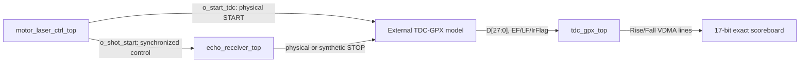

# C08-S22 External GPX I-Mode Integration Closure

Date: 2026-07-27

## Decision

No production Hit-calculation or model-selection generic is added to
`tdc_gpx_top`.

This is the correct ownership split:

1. `motor_laser_ctrl_top` generates the physical GPX START path and the
   synchronized logical Shot event.
2. `echo_receiver_top` owns LVDS-to-STOP conversion and optional deterministic
   simulation STOP generation.
3. The external TDC-GPX chip owns START-to-STOP interpolation, IFIFO contents,
   status pins, and the 28-bit I-Mode data word.
4. `tdc_gpx_top` owns only external-bus control, I-Mode decode, pipeline
   processing, and VDMA output.

The simulation-only `tdc_gpx_external_chip_model` retains calibration and size
generics such as bin resolution and chip count. They describe the external
device model and are not exposed as production `tdc_gpx_top` generics, XGUI
parameters, or CSR controls. They therefore add no 200 MHz production-path
logic or timing cost.

## Executable Architecture

The integrated testbench now instantiates `motor_laser_ctrl_top` rather than
separate Motor and Laser top-level instances. Its private Motor-to-Laser AXIS
contract is `TDATA[31:0]`, `TUSER[7:0]`, full `TKEEP`, and permanently high
`TREADY`.

## I-Mode Word Contract

The production decoder and external model use the same SINGLE_SHOT mapping:

| Time order | Bits | Field | Meaning |
|---:|---:|---|---|
| 1 | `[27:26]` | `ChaCode` | channel 0..3 in the selected IFIFO |
| 2 | `[25:18]` | `StartNum` | zero in the current SINGLE_SHOT mode |
| 3 | `[17]` | `Slope` | rising/falling edge direction |
| 4 | `[16:0]` | `Hit` | 17-bit external GPX distance/time code |

`tdc_gpx_decoder_i_mode` passes the complete 17-bit Hit into the event
pipeline. The canonical Cell ABI stores `Hit[15:0]` in the hit slot and
`Hit[16]` in metadata bit 0. The final scoreboard reconstructs both pieces and
performs an exact 17-bit comparison; a 16-bit-only comparison cannot pass this
gate.

## Verification

Both maintained regressions use AXIS 150 MHz and TDC 200 MHz.

| Scenario | Shots | Raw 28-bit checks | Rise/Fall 17-bit checks | Expected/Rise/Fall Hit | Result |
|---|---:|---:|---:|---:|---|
| Internal encoder | 2 | 8 | 2 / 2 | 30943 / 30943 / 30943 | PASS |
| External A/B/Z encoder | 12 | 48 | 12 / 12 | 31272 / 31272 / 31272 | PASS |

Final archives:

- `sim_results/vivado_xsim/sessions/260727_i_mode_final_internal_system_integration_smoke`
- `sim_results/vivado_xsim/sessions/260727_i_mode_final_external_system_integration_smoke`

The raw check count equals `Shot references x 4 active chips`. Every raw word
also checks `ChaCode=0`, `StartNum=0`, the configured per-chip Slope, and the
full `Hit[16:0]` value.

The two scenarios have different final Hit codes because their actual
START-to-STOP pin timing differs through the two encoder/admission paths. This
is not accepted by assumption: each scenario builds an independent timestamp
reference from the observed START and STOP pins, and the raw GPX bus plus both
VDMA slope outputs must equal that reference exactly.

Healthy status was identical in both runs:

- `STAT5 = 0x00000001`
- `STAT6 = 0xF0000000`
- `STAT7 = 0x00000000`
- `cfg_rejected = 0`
- `pipeline_abort = 0`

## HTML Alignment

Use
`C08_HDL_HTML_Alignment_260727_External_GPX_I_Mode_Integration_Simulator_v022.html`.

The new I-Mode panel shows ownership, the exact 28-bit field partition, the
nominal Echo-delay-to-Hit calculation, and the deliberate absence of a
production Hit-calculation generic. Loading either current `rtl_result.json`
adds measured gates for:

- every active chip's raw I-Mode bus read;
- reference, Rise, and Fall check-count closure;
- exact equality of expected, Rise, and Fall 17-bit Hit values.

The nominal HTML calculation is a planning value based on the selected target,
5 ns Echo CSR quantization, AXIS clock, and bin resolution. The loaded RTL
contract remains the authoritative check of actual pin-to-pipeline timing.

## Sign-off Boundary

This closes functional simulation of the integrated data path and I-Mode bit
preservation. It does not replace board-level LVDS/GPX electrical timing,
post-route timing closure, or hardware measurement of external TDC-GPX
calibration.
