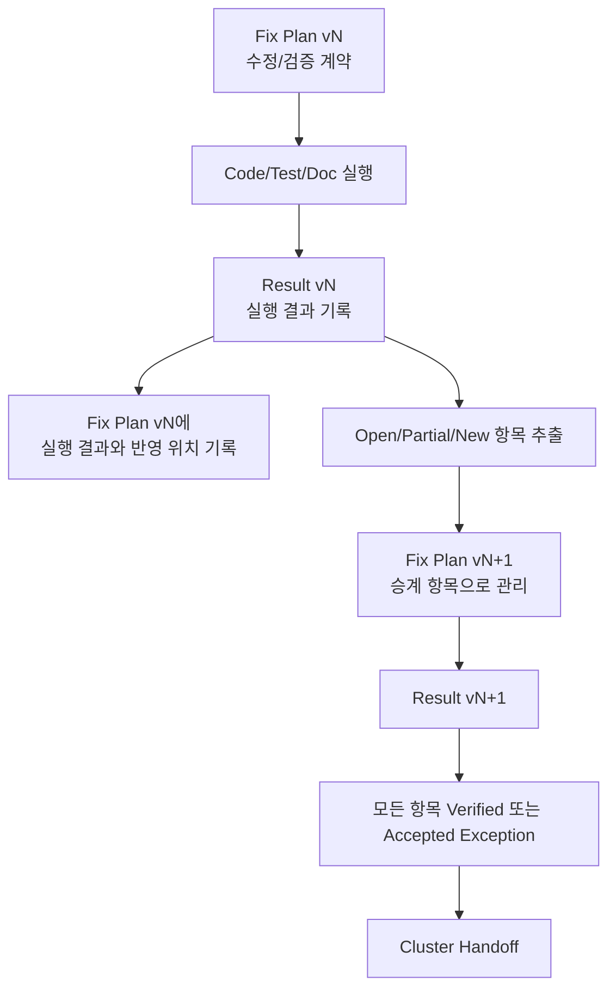

# Cluster Analysis Operating Protocol

| 항목 | 내용 |
|---|---|
| 문서 버전 | v012 |
| 생성 시간 | 2026-05-11 20:06:55 KST |
| 수정 시간 | 2026-05-11 20:06:55 KST |
| 기준 문서 | `Doc/TDC-GPX-Datasheet.pdf` |
| 이전 문서 | `cluster_analysis_260501010717_operating_protocol_v011.md` |
| 목적 | Cluster 분석, 수정 계획, 수정 결과, 다음 계획 승계가 끊기지 않도록 Fix Plan 실행/승계 사이클을 명문화한다. |

## 1. 최상위 기준

이 프로젝트에서 기능 해석, timing 판단, 운용 개념 보완, 코드 리뷰 판단의 최상위 기준은 항상 `Doc/TDC-GPX-Datasheet.pdf`이다.

우선순위는 다음과 같다.

| 우선순위 | 기준 | 적용 원칙 |
|---:|---|---|
| 1 | `Doc/TDC-GPX-Datasheet.pdf` | GPX IC timing, mode, register, 금지 조건의 절대 기준 |
| 2 | 현재 RTL 구현 | Datasheet 요구가 현재 코드에서 어떻게 구현되었는지 확인하는 기준 |
| 3 | Testbench / xsim log | 구현 의도와 실제 검증 범위를 확인하는 기준 |
| 4 | 기존 문서 / 주석 | 참고 자료이며 Datasheet와 충돌하면 Datasheet가 우선 |

모든 Markdown과 PPT는 근거를 추적할 수 있도록 Datasheet page/section, RTL file/line, TB/log 이름을 함께 기록한다.

## 2. 문서 생성 및 파일명 규칙

Cluster 산출물은 `Doc/cluster_analysis` 아래에 Cluster별 폴더를 만들고 저장한다.

파일명에는 가능한 경우 `YYMMDDHHMMSS` timestamp를 포함한다.

예:

```text
C06_Control_Status_Integration_260511200655_Code_Fix_Plan_v002.md
C06_Control_Status_Integration_260511200655_Code_Fix_Plan_v002.pptx
```

기존 산출물은 덮어쓰지 않고 새 버전 파일을 생성한다. 이전 버전에는 다음 버전에서 어디에 반영되었는지 추적 기록을 남긴다.

## 3. 필수 분석 항목

모든 Cluster 분석, Fix Plan, Result, Handoff 문서에는 다음 항목을 포함한다.

| 항목 | 필수 내용 |
|---|---|
| Timing diagram/block | 사용자와 구조적으로 소통 가능한 타이밍도 또는 타이밍 블록도 |
| Latency | 입력 기준점부터 출력/상태 반영까지의 cycle/time |
| Throughput | 정상 조건과 stall 조건에서 처리 가능한 data/shot/frame rate |
| Pipeline | register/FF boundary와 stage별 역할 |
| II(Initiation Interval) | 다음 transaction/shot/frame을 시작할 수 있는 최소 간격 |
| 근거 추적 | Datasheet, RTL, TB, log, 사용자 결정 사항 |
| 상태 판단 | PASS, Partial, Open, Accepted Exception 구분 |

## 4. RTL 및 Testbench 운영 규칙

RTL은 합성 가능한 VHDL로 작성한다.

조합논리는 timing 분석을 방해하지 않도록 원칙적으로 최소화한다. 예외적으로 2-depth 이하 조합논리는 허용할 수 있지만, module boundary, handshake boundary, timing closure에 영향을 주면 FF/register boundary로 닫는다.

AXI4-Lite CSR를 쓰고 읽는 모든 testbench는 자체 AXI4-Lite helper를 새로 만들지 않고 `px_utility_pkg.vhd`에 정의된 공통 유틸리티를 사용한다.

Vivado/xsim 실행 기준 경로는 다음으로 고정한다.

```text
C:\AMDDesignTools\2025.2.1\Vivado
```

## 5. Fix Plan 실행/승계 사이클 규칙

Fix Plan은 단순 메모가 아니라 실행 가능한 계약이다. 따라서 각 Fix Plan은 실행 후 결과 문서와 다음 계획으로 반드시 연결한다.



### 5.1 Fix Plan vN 작성 규칙

Fix Plan vN에는 다음 표를 포함한다.

| 필드 | 설명 |
|---|---|
| Plan ID | `FP2-C06-01`처럼 버전과 Cluster가 드러나는 ID |
| 우선순위 | P0/P1/P2/P3 |
| 대상 | RTL/TB/문서/스크립트/운영 계약 |
| 목적 | 왜 수정 또는 검증이 필요한지 |
| 완료 기준 | PASS 조건 또는 Accepted Exception 조건 |
| 근거 | Datasheet, 이전 문서, RTL, xsim log |

### 5.2 Result vN 작성 규칙

Result vN에는 Fix Plan vN의 각 항목이 다음 중 하나로 분류되어야 한다.

| 상태 | 의미 |
|---|---|
| Fixed | 코드/문서/테스트 수정 완료 |
| Verified | xsim 또는 동등 검증으로 PASS 확인 |
| Partial | 일부만 완료되어 다음 계획으로 승계 필요 |
| Open | 아직 미처리 |
| New | 실행 중 새로 발견된 항목 |
| Accepted Exception | 설계 의도 또는 범위 제외로 수락된 예외 |

### 5.3 Fix Plan vN 자체 업데이트 규칙

Result vN이 생성된 뒤에는 Fix Plan vN에도 실행 결과를 되돌려 적는다.

필수 표:

| 항목 | vN 계획 | Result vN 반영 위치 | 상태 | vN+1 승계 여부 |
|---|---|---|---|---|
| 예: Phase A | status boundary 수정 | Result vN section 3/5 | Fixed + Verified | 아니오 |
| 예: Phase E | stall 검증 | Result vN section 6 | Partial | 예 |

### 5.4 Fix Plan vN+1 승계 규칙

Result vN의 `Partial`, `Open`, `New` 항목은 Fix Plan vN+1에서 새 추적 ID를 받아야 한다.

필수 표:

| vN+1 ID | 승계 원인 | vN 근거 | vN+1 처리 방향 |
|---|---|---|---|
| 예: FP2-C06-04 | v001 Phase E Partial | Result v001 section 6 | backpressure 재검증 |

이 규칙 때문에 Fix Plan v002는 단순히 새 계획이 아니라, Fix Plan v001과 Result v001에서 닫히지 않은 항목을 추적하는 장부 역할을 한다.

## 6. C06 적용 기록

이번 규칙은 C06에서 다음 문서에 적용되었다.

| 문서 | 반영 내용 |
|---|---|
| `C06_Control_Status_Integration_260511192515_Code_Fix_Plan_v001.md` | v001 실행 결과와 v002 승계 항목 추가 |
| `C06_Control_Status_Integration_260511195318_Code_Fix_Result_v001.md` | Result v001에서 Fix Plan v002로 넘어가는 항목 추가 |
| `C06_Control_Status_Integration_260511200655_Code_Fix_Plan_v002.md` | FP2-C06-01..08 추적 ID로 다음 보완/검증 계획 작성 |
| `cluster_analysis_communication_plan_260511200655_v002.md` | 사용자와 Codex 사이의 Plan-Result-Rollover 소통 절차 추가 |

## 7. Git 관리 규칙

수정 및 보완이 발생할 때마다 관련 파일만 Git으로 관리한다.

원칙:

- 관련 없는 dirty file은 staging하지 않는다.
- 코드, testbench, 문서 변경은 가능한 한 의미 단위로 commit한다.
- 시뮬레이션 log와 문서 근거는 commit 전후로 추적 가능해야 한다.

## 8. Context 인계 규칙

컨텍스트 용량이 한계에 가까워지거나 다음 prompt에서 5% 미만으로 부족할 것으로 예상되면, Codex는 사용자에게 명확히 보고한다.

보고 뒤에는 다음 내용을 문서로 남긴다.

| 항목 | 내용 |
|---|---|
| 지금까지의 결정 | 사용자 결정, 설계 계약, 예외 사항 |
| 코드 상태 | 수정 파일, commit hash, 검증 상태 |
| 문서 상태 | 최신 Plan/Result/Handoff 위치 |
| 다음 작업 | 이어서 시작할 Fix Plan 또는 Cluster |

## 9. v011 -> v012 변경 이력

| 항목 | v012 반영 위치 | 변경 내용 |
|---|---|---|
| Fix Plan 실행/승계 사이클 | section 5 | `Fix Plan vN -> Result vN -> Fix Plan vN+1` 규칙 명문화 |
| Result 생성 후 원 Plan 갱신 | section 5.3 | vN 계획 문서에도 실행 결과와 다음 승계 위치를 기록하도록 추가 |
| 다음 Fix Plan 추적 ID 관리 | section 5.4 | Open/Partial/New 항목을 새 ID로 추적하도록 규칙화 |
| C06 적용 기록 | section 6 | v001 실행 결과, Result v001, Fix Plan v002 연결을 현재 사례로 기록 |

