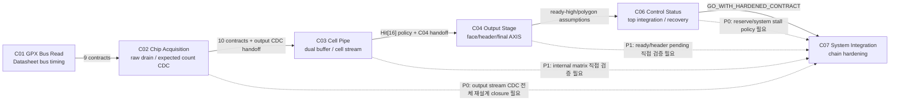
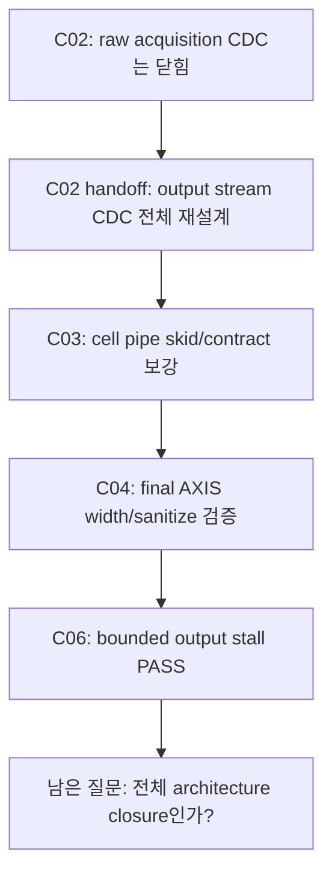

# C01-C06 Cluster Chain Integrity Review v001

| 항목 | 내용 |
|---|---|
| 문서 종류 | Cluster 누적 검증 chain 무결성 리뷰 |
| 문서 버전 | v001 |
| 생성 시간 | 2026-05-14 15:15:07 KST |
| 수정 시간 | 2026-05-14 15:15:07 KST |
| 범위 | C01 GPX Bus Read -> C06 Control/Status Integration |
| 절대 기준 문서 | `Doc/TDC-GPX-Datasheet.pdf` |
| 사용자 입력 | C01-C06 단계별 누적 검증 점검 및 weak link 분석 |
| 최신 보정 기준 | `C06_Control_Status_Integration_260514144755_Code_Fix_Result_v006.md` |

## 1. 결론

사용자 리뷰의 큰 방향은 맞다. 특히 `output stream CDC 전체 재설계`가 C02에서 C03/C04로 넘어간 뒤, “완전히 닫혔다”고 말할 수 있는 별도 closure 증거가 부족하다는 지적은 유효하다.

다만 C06 관련 일부 위험은 v006 hardening 이후 최신 상태로 보정해야 한다.

| 사용자 리뷰 항목 | 최신 v006 기준 판단 | 조치 |
|---|---|---|
| C06 recovery가 64-bit 단일 폭에 의존 | v006에서 32/64/128 force/soft recovery PASS로 보강됨 | stale risk에서 제거 |
| C06 bounded output backpressure 미검증 | v006에서 32/64/128 bounded backpressure PASS | 단, 무한/장기 stall은 C07 system policy로 유지 |
| rise/fall lane imbalance 미검증 | v006에서 64-bit rise-only/fall-only output stall PASS | C03 내부 dual-buffer/lane matrix는 별도 P1 유지 |
| false positive PASS marker 위험 | v006에서 source/destination/effect/output marker 기준 반영 | C01-C04 marker audit 규칙으로 승격 |
| output stream CDC 전체 재설계 미종결 | 여전히 유효. v006 bounded stall은 전체 architecture closure가 아님 | C07 P0로 승격 |
| 8 us reserve 가정 | 여전히 유효. RTL/xsim 측정값이 아니라 system 가정 | C07 P0로 승격 |

따라서 현재 판정은 다음과 같다.

```text
C06 control/status/recovery 내부 blocker: 닫힘
C01-C06 누적 release chain: 조건부 유지
다음 단계: C07 System Integration / Chain Hardening에서 P0 항목을 직접 닫아야 함
```

## 2. Chain Integrity Map



## 3. Layer별 재판정

| Layer | 최신 판단 | 강점 | 남은 위험 |
|---|---|---|---|
| C01 | Strong | Datasheet timing, OEN, status sync, bus legality를 다중 버전으로 닫음 | C01 PASS marker를 source/effect 기준으로 소급 audit하면 더 단단해짐 |
| C02 | Strong with handoff | C01 계약 수락, expected count atomic CDC, zero-stop/final beat 보강 | `output stream CDC 전체 재설계`를 후속으로 넘긴 상태 |
| C03 | Thin direct evidence | cell pipe finding 수정과 C04 handoff 완료 | dual-buffer next-shot II, IFIFO2 wait/timeout, shot drop/quarantine, width/max_hits matrix 직접 검증 부족 |
| C04 | Partial direct evidence | Hit[16] sanitize, blank-fill, 32/64/128 beat/tlast, polygon budget 산출 | face_assembler ready path, header_inserter pending timing, ready-high 가정 직접 closure 부족 |
| C06 | Hardened but conditional | 32/64/128 recovery, bounded backpressure, lane stall, sticky map, marker rule 보강 | 전체 stream CDC architecture, 8 us reserve 실측, 장기 stall policy는 C07 필요 |

## 4. 근거 추적

| 근거 | 위치 | 의미 |
|---|---|---|
| C02 output stream CDC handoff | `C02_Chip_Acquisition_260430233213_Cluster2_Readiness_Review_v001.md:319`, `:337`, `:379` | C02는 raw CDC만 닫고 전체 output stream architecture는 C03/C04 후속으로 명시 |
| C03 수락 질문 | `C02_Chip_Acquisition_260501021013_C03_Handoff_v001.md:118`, `:121`, `:149` | dual buffer, timeout/drop/fault, output stream CDC를 C03/C04 질문으로 넘김 |
| C03 미검증 목록 | `C03_Cell_Pipe_260501022223_Analysis_v001.md:307-309` | dual buffer next-shot II, IFIFO2 wait/timeout, shot drop/quarantine이 직접 matrix 후보로 남음 |
| C04 ready/header 질문 | `C04_Output_Stage_260501030046_Plan_v002.md:111-112` | face_assembler ready path와 header_inserter pending timing 질문 존재 |
| C04 result 범위 | `C04_Output_Stage_260501031720_Result_v001.md:16-17`, `:79` | Hit[16] sanitize와 blank-fill 중심으로 닫힘 |
| C06 ready-high finding | `C06_Control_Status_Integration_260511161310_Analysis_v001.md:255`, `:289` | output ready high 의존이 C06 초기에 P1/Open으로 잡힘 |
| C06 v006 closure | `C06_Control_Status_Integration_260514144755_Code_Fix_Result_v006.md` | 32/64/128 recovery, bounded backpressure, lane stall, reserve 분석을 보강 |
| v006 archive | `sim_results/vivado_xsim/sessions/260514144755_c06_v006_hardening/` | 공식 Vivado/xsim hardening 증거 |

## 5. Output CDC / Ready Risk 재분류

이 위험은 한 문장으로 “C02에서 생긴 handoff가 C06에서 다시 노출된 항목”이다.



최신 판단:

| 구분 | 판단 |
|---|---|
| C06 v006 bounded stall | 닫힘. 32/64/128에서 bounded backpressure로 beat/tlast 보존 확인 |
| C03/C04 stream width contract | 대부분 닫힘. 32/64/128 width와 keep/strb, final beat count는 확인됨 |
| `output stream CDC 전체 재설계` | 아직 “전체 재설계 closure” 문서가 없음 |
| 필요한 추가 판단 | 현재 구조가 `전체 재설계`로 인정 가능한지, 아니면 별도 async FIFO/clock-domain architecture가 필요한지 명확히 결정해야 함 |

## 6. False Positive 방지 Marker 기준

C06 v003 false positive 사건 이후, PASS는 source 한쪽 marker만으로 인정하면 안 된다.

| Marker 계층 | 의미 | 최소 요구 |
|---|---|---|
| Source | 명령/입력이 발생했는가 | testbench 또는 source domain log |
| Destination | 대상 clock domain에 도착했는가 | CDC 목적 domain pulse/log |
| Effect | 대상 FSM/data path가 실제 반응했는가 | phase transition, register update, fifo action |
| Output | 외부 관찰 가능한 결과가 보존되는가 | beat/tlast/tuser/status/pass counter |

C06 v006 recovery 검증은 이 기준을 만족한다. C01-C04의 과거 PASS는 필요 시 이 기준으로 audit해야 한다.

## 7. Timing / Latency / Throughput / Pipeline / II 영향

| 항목 | 최신 상태 | 남은 판단 |
|---|---|---|
| C06 recovery CDC latency | source pulse -> TDC pulse 4 clk / 20 ns | 닫힘 |
| C06 T2->T5 conservative processing | 32-bit 0.540 us, 64/128-bit 0.500 us | 닫힘. 단, system reserve와 합산 필요 |
| Output beat II | ready 유지 시 1 beat/clk | 장기 stall 시 system policy 필요 |
| Width throughput | 32: 72 beats/run, 64: 44 beats/run, 128: 38 beats/run | v006 기준 닫힘 |
| C03 shot-level II | dual buffer 상태와 IFIFO2 wait에 의존 | 직접 matrix 필요 |
| C04 face/header pipeline | width/sanitize는 확인됨 | ready path와 face_start pending 직접 증거 필요 |
| Polygon budget | 8 us reserve 기준 810 m는 conservative FAIL 쪽 | VDMA/PS/Ethernet 실측 필요 |

## 8. 후속 Action 분류

| 우선순위 | ID | 작업 | 목적 | 완료 기준 |
|---|---|---|---|---|
| P0 | CHAIN-P0-01 | output stream CDC 전체 재설계 closure | C02 handoff 미종결 항목을 닫음 | 현재 구조 수락 또는 새 CDC architecture 정의/검증 |
| P0 | CHAIN-P0-02 | C02->C06 output ready/stall end-to-end stress TB | bounded stall이 cluster chain 전체에서 안전한지 확인 | source/dest/effect/output marker 모두 PASS |
| P0 | CHAIN-P0-03 | C02 OP-C02-04, C04 sanitize/width marker 소급 audit | false positive 패턴 차단 | source/dest/effect/output marker 표 작성 |
| P0 | CHAIN-P0-04 | 8 us reserve 실측/보수치 갱신 | polygon budget의 운용 근거 확정 | measured reserve 또는 보수 reserve로 거리 재산출 |
| P1 | CHAIN-P1-01 | C03 direct matrix TB | C03 thin layer 보강 | dual-buffer, IFIFO2 wait, timeout/drop/quarantine PASS |
| P1 | CHAIN-P1-02 | C04 ready/header pending 직접 검증 | C04 partial layer 보강 | face_assembler ready path, header pending scenario PASS |
| P1 | CHAIN-P1-03 | Hit[16] SW/range 계약 재확인 | 16-bit slot 운용 한계 명시 | parser 계약과 거리 제한 문서화 |

## 9. 다음 문서로의 반영

이 리뷰는 다음 계획 문서에 반영한다.

| 반영 대상 | 반영 내용 |
|---|---|
| `C07_System_Integration_260514151507_Plan_v001.md` | 위 P0/P1 action을 C07 실행 계획으로 전개 |
| C06 handoff v002 | C06 자체는 `GO_WITH_HARDENED_CONTRACT`, system release는 C07 조건부로 해석 |
| 다음 regression | chain marker 기준을 기본 PASS 규칙으로 적용 |

