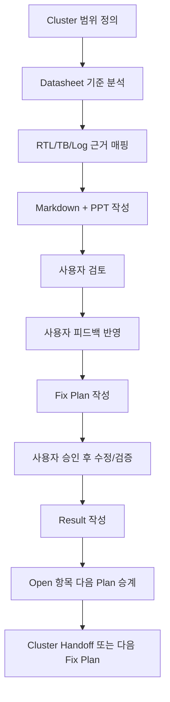

# TDC-GPX Cluster 단계별 분석 소통 계획

| 항목 | 내용 |
|---|---|
| 문서 버전 | v002 |
| 생성 시간 | 2026-05-11 20:06:55 KST |
| 수정 시간 | 2026-05-11 20:06:55 KST |
| 이전 문서 | `cluster_analysis_communication_plan_20260429_v001.md` |
| 기준 문서 | `Doc/TDC-GPX-Datasheet.pdf` |
| 목적 | Cluster별 분석, 사용자 검토, Fix Plan 실행, Result 기록, 다음 Fix Plan 승계를 끊기지 않게 관리한다. |

## 1. 소통 원칙

Cluster 분석은 한 번에 전체를 닫는 방식이 아니라, GPX IC에서 읽어오는 단계부터 논리적으로 Cluster를 나누고, 각 Cluster의 분석이 끝났을 때 사용자와 확인한 뒤 다음 Cluster로 넘어간다.

각 Cluster 문서는 `Doc/cluster_analysis/<Cluster>` 폴더에 Markdown과 PPT로 기록한다.

Markdown은 상세한 판단 근거, 도표, 분석 표를 중심으로 작성한다. PPT는 핵심 구조를 추상화해서 도형, 도식, 그림, timing diagram으로 공유한다.

## 2. 사용자 검토 흐름

Codex는 다음 순서로 사용자와 소통한다.



사용자가 "다 됐어", "진행해", "다음 단계"처럼 명확히 승인하면 다음 단계로 넘어간다.

사용자가 검토 중이라고 말하면 Codex는 추가 실행하지 않고 기록만 보완한다.

## 3. Plan-Result-Rollover 소통 절차

이번 v002에서 가장 중요한 추가 규칙은 다음이다.

```text
Fix Plan vN
  -> 작업 실행
  -> Code Fix / Verification Result vN
  -> Fix Plan vN에 실행 결과와 반영 위치 기록
  -> 남은 항목을 Fix Plan vN+1로 승계
  -> vN+1 실행 후 같은 방식 반복
```

즉, Fix Plan v002는 v001을 대체하는 문서가 아니라 v001 실행 결과에서 닫히지 않은 항목을 추적하는 다음 장부이다.

## 4. 각 문서의 역할

| 문서 유형 | 역할 | 사용자 확인 포인트 |
|---|---|---|
| Analysis | 운용 개념, 데이터 흐름, timing/pipeline/II 이해 | "내가 이해한 구조가 맞는가" |
| Code Review | 부실 코드, 위험, 미검증 계약 도출 | "수정할 필요가 있는가" |
| Verify Baseline | 현재 코드 기준 PASS/Open 경계 구분 | "검증 경계가 충분한가" |
| Code Fix Plan | 수정 및 검증을 실행 가능한 항목으로 분해 | "이 순서대로 수정해도 되는가" |
| Code Fix Result | 실제 수정/검증 결과와 log 근거 기록 | "닫힌 항목과 남은 항목이 맞는가" |
| Next Fix Plan | Result에서 남은 항목을 추적 ID로 승계 | "다음 계획이 누락 없이 이어지는가" |
| Handoff | 다음 Cluster가 받아야 할 계약과 완료 상태 | "다음 Cluster로 넘어가도 되는가" |

## 5. C06 현재 적용 상태

| 흐름 | 문서 | 상태 |
|---|---|---|
| v001 계획 | `C06_Control_Status_Integration_260511192515_Code_Fix_Plan_v001.md` | 실행 결과와 v002 승계 기록 추가됨 |
| v001 결과 | `C06_Control_Status_Integration_260511195318_Code_Fix_Result_v001.md` | FP2-C06-01..08 승계 근거 추가됨 |
| v002 계획 | `C06_Control_Status_Integration_260511200655_Code_Fix_Plan_v002.md` | 오늘 분석된 Open/Partial/New 항목을 추적 ID로 관리 |

## 6. 사용자 피드백 반영 규칙

사용자 피드백은 즉시 최종 결론으로 덮어쓰지 않는다. 먼저 다음 세 가지로 분류한다.

| 분류 | 처리 |
|---|---|
| 설계 결정 | 운영 계약 또는 Fix Plan에 반영 |
| 검증 의문 | Verify Matrix 또는 Timing/II 분석 항목에 반영 |
| 구현 요청 | Code Fix Plan의 Phase 또는 추적 ID로 반영 |

사용자가 "다 끝났어"라고 말하면 그때까지의 피드백을 묶어서 문서에 반영하고, 다음 버전을 생성한다.

## 7. 다음 작업 소통 방식

Fix Plan v002 실행 이후에는 다음을 반드시 수행한다.

1. `C06_Control_Status_Integration_<timestamp>_Code_Fix_Result_v002.md/.pptx` 생성
2. `C06_Control_Status_Integration_260511200655_Code_Fix_Plan_v002.md`에 v002 실행 결과와 v003 승계 여부 기록
3. 남은 항목이 있으면 `Code_Fix_Plan_v003` 생성
4. 모두 닫히면 C06 Handoff 문서 생성

## 8. v001 -> v002 변경 이력

| 항목 | v002 반영 위치 | 변경 내용 |
|---|---|---|
| Plan-Result-Rollover 명문화 | section 3 | Fix Plan vN과 Result vN, 다음 Fix Plan vN+1 연결 절차 추가 |
| 문서별 역할 세분화 | section 4 | Analysis/Review/Baseline/Plan/Result/Handoff 역할 구분 |
| C06 적용 상태 | section 5 | v001 계획, v001 결과, v002 계획 연결 상태 기록 |
| 사용자 피드백 처리 | section 6 | 설계 결정/검증 의문/구현 요청으로 분류해 반영 |

