# `tdc_gpx_top` 신호처리 상세 사용 설명서

> 대상: FPGA 신호처리 엔지니어, 펌웨어/드라이버 엔지니어, 검증 엔지니어
>
> 기준 RTL: `tdc_gpx_top.vhd` 및 직접 하위 모듈
>
> 기준 Git 리비전: `4c4fe96` (`refactor: decouple echo diagnostics from GPX drain`)
>
> 기준 일시: 2026-07-22
>
> RTL 대조 재검토: 2026-07-22, GPX FIFO 소유권과 Echo 진단 경계 포함
>
> 언어/표준: VHDL-2008(일부 하위 모듈은 VHDL-93 호환 표기)

---

## 1. 문서 목적

이 문서는 VHDL로 구현된 `tdc_gpx_top`을 **신호처리 관점에서 읽고, 구동하고, 출력 데이터를 해석하고, 이상 동작을 추적**하기 위한 설명서이다. 단순 포트 목록보다 다음 질문에 답하는 데 초점을 둔다.

1. 레이저 한 발(`Shot`)이 어떤 제어 신호를 거쳐 TDC-GPX 측정으로 연결되는가?
2. GPX의 28비트 원시 데이터가 어떤 단계를 거쳐 VDMA용 Rise/Fall 스트림이 되는가?
3. `Hit`, `Cell`, `Row`, `Face`, `Frame`은 각각 무엇이며 메모리에서는 어떻게 배치되는가?
4. GPX FIFO flag, IFIFO drain, backpressure, timeout이 서로 어떻게 영향을 주는가?
5. 오류가 발생했을 때 어떤 상태와 비트를 순서대로 확인해야 하는가?
6. 현재 RTL이 수행하는 계산과 수행하지 않는 계산은 무엇인가?

이 문서의 최우선 근거는 현재 RTL이다. 기존 `Doc/register_map.md`, `Doc/known_issues.md`, 과거 발표 자료는 배경 자료로만 사용한다. 서로 충돌할 경우 **현재 VHDL 코드와 회귀시험을 우선**한다.

---

## 2. 한눈에 보는 결론

`tdc_gpx_top`은 합성 시 선택한 1~4개의 TDC-GPX 칩을 제어하고, 각 칩의 IFIFO 원시 시간값을 읽어 Rise/Fall별 정형 데이터로 조립한 뒤 AXI4-Stream으로 출력하는 모듈이다. 논리 chip slot ABI의 상한은 4개지만 외부 물리 핀 수는 `g_NUM_CHIPS`에 맞춰 축소된다.

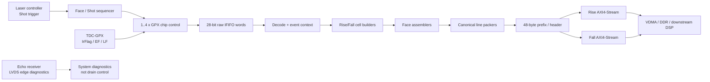

현재 RTL의 중요한 경계는 다음과 같다.

| 구분 | 현재 RTL이 수행함 | 현재 RTL이 수행하지 않음 |
|---|---|---|
| GPX 제어 | 초기화, 설정 쓰기, 측정, IFIFO drain, ALU trigger | 레이저 발광 자체 생성 |
| 이벤트 처리 | 28비트 word decode, chip/stop/slope/shot 문맥 부여 | 표적 검출/클러스터링 |
| 데이터 정형 | hit를 Cell로 모으고 Row/Face로 조립 | 거리 영상 형상화 |
| 오류 처리 | timeout, blank-fill, fault metadata, sticky status | 모든 오류의 자동 재시도 보장 |
| 보정 정보 | `bin_resolution_ps`, `k_dist_fixed`, `start_off1`을 헤더에 기록하고 `start_off1`을 GPX Reg5 image에 반영 | FPGA Cell 경로에서 raw Hit를 산술 보정하거나 거리로 변환 |
| 출력 | Rise/Fall 독립 AXI4-Stream, VDMA geometry 제공 | VDMA 자체 구성 또는 DDR 주소 관리 |

> **핵심 주의:** `hit_store_mode`, `dist_scale`, `i_bin_resolution_ps`, `i_k_dist_fixed`가 존재해도 FPGA Cell 경로는 항상 GPX가 내보낸 **17비트 raw Hit**를 저장한다. `start_off1`은 GPX Reg5 설정에도 반영되지만 FPGA가 출력 Hit에서 다시 빼는 산술은 없다. 실제 거리 변환은 후단 DSP/소프트웨어의 책임이다.

> **물리 trigger 경계:** `i_shot_start`는 외부에서 실제 TStart/레이저 trigger가 발생했다는 **동기화된 사건 표지**이다. 이 top에는 GPX TStart를 직접 구동하는 출력 포트가 없다. `i_shot_start`가 내부 acquisition/Shot bookkeeping을 시작할 뿐, 물리 trigger를 대신 생성하지 않는다.

> **GPX FIFO 소유권:** `echo_receiver`가 세는 값은 GPX 입력 전단에서 관측한 LVDS edge 수이다. GPX가 실제로 받아 IFIFO에 저장한 word 수를 알 수 없으므로 drain 종료나 read 상한으로 사용할 수 없다. 현재 `tdc_gpx_top`은 Echo event/count 입력 포트를 갖지 않으며, 정상 drain 종료는 GPX `EF1/EF2`가 결정한다. `LF1/LF2`와 Reg6 Fill은 burst 크기 힌트이고 `n_drain_cap`은 출력 truncation 보호 경계이다.

---

## 3. 신호처리 데이터 계층

코드를 읽기 전에 아래 계층을 고정해야 한다. 같은 `frame`이라는 단어가 레이저 제어, VDMA, 소프트웨어에서 다르게 사용되면 분석이 쉽게 어긋난다.

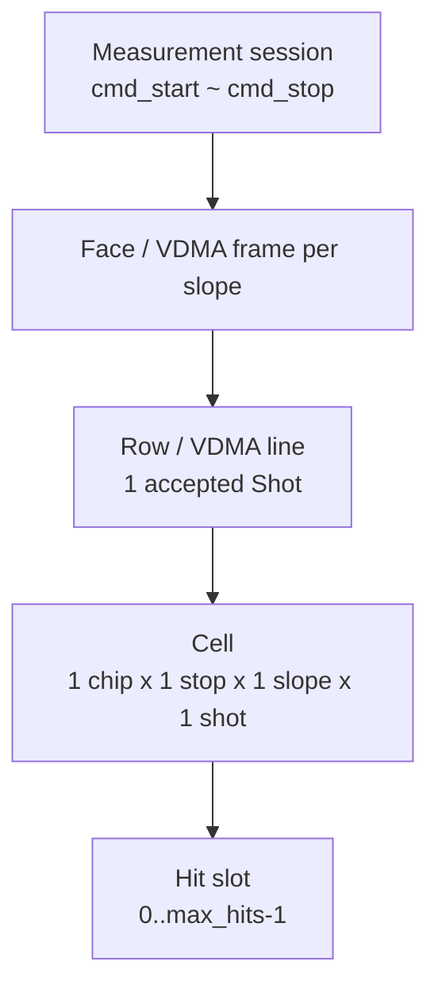

| 계층 | 물리적 의미 | RTL 기준 | 출력 기준 |
|---|---|---|---|
| Session | 측정 실행 구간 | `cmd_start` 수락부터 `cmd_stop`/reset | 여러 Face 가능 |
| Face | 설정이 고정된 출력 묶음 | `packet_start`에서 설정 snapshot | 각 slope별 VDMA frame 하나 |
| Row/Line | 레이저 한 발의 모든 활성 chip/stop 결과 | `shot_start_gated` 1회 | `TLAST`로 끝나는 한 줄 |
| Cell | 한 slope에서 한 chip의 한 stop 채널 결과 | `(chip, slope, stop, shot)` | hit words + metadata word |
| Hit | 한 stop 채널에서 검출된 시간 이벤트 | GPX `Hit[16:0]` | 최대 `max_hits`개 저장 |

추가 해석 규칙:

- `cols_per_face`는 이름과 달리 출력 관점에서 **Face당 line 수**, 즉 Face에 포함되는 accepted Shot 수이다.
- `rows_per_face`라는 헤더 필드는 한 line의 **Cell 슬롯 수**이다. 이는 `popcount(lane_chip_mask) x stops_per_chip`이다.
- `n_faces`는 `motor_decoder_top.g_N_FACES`가 소유하는 정적 polygon geometry이다. TDC는 이를 `i_n_faces`로 받아 Face ID 범위를 검증하고 header/status에 기록할 뿐, 독립적으로 Face ID를 생성하지 않는다. `n_faces`개 Face 뒤 session을 자동 종료하지 않으며 실제 Shot 발생과 종료는 외부 `i_shot_start`/`cmd_stop`이 결정한다.
- Rise와 Fall은 서로 다른 출력 메모리로 전달된다. Fall ON에서는 두 lane의 `frame_done`을 모두 기다리고, Fall OFF에서는 Fall 완료를 즉시 충족시켜 Rise만 기다린다. `face_seq`에는 slope abort 입력 논리가 남아 있지만 현재 top에서는 두 입력을 모두 `'0'`에 고정한다.

---

## 4. 시스템 연결 구조

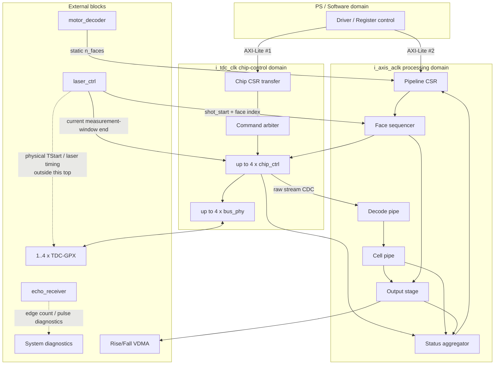

부모 설계에서 반드시 제공해야 하는 항목:

1. 실제 클럭 생성과 XDC 제약
2. GPX 병렬 버스 핀 배치와 I/O timing constraint
   - `g_NUM_CHIPS = popcount(g_PRESENT_CHIP_MASK)` 일치
   - compact physical lane과 실제 schematic chip의 대응
3. `laser_ctrl`의 물리 TStart/레이저 timing과 이에 정렬된 `i_shot_start`/`i_stop_tdc` 표지
4. `echo_receiver`의 LVDS/edge 진단 경로를 GPX IFIFO 제어와 분리
5. Rise/Fall VDMA의 HSIZE, VSIZE, STRIDE, buffer 주소
6. raw Hit를 거리로 바꾸는 후단 보정/변환 로직

---

## 5. RTL 계층과 파일 역할

### 5.1 `tdc_gpx_top`의 직접 하위 블록

| 순서 | 인스턴스 | 파일 | 책임 |
|---:|---|---|---|
| 1 | `u_csr_pipeline` | [`tdc_gpx_csr_pipeline.vhd`](../tdc_gpx_csr_pipeline.vhd) | Pipeline AXI-Lite, 명령 edge 검출, status CDC |
| 2 | `u_config_ctrl` | [`tdc_gpx_config_ctrl.vhd`](../tdc_gpx_config_ctrl.vhd) | Chip CSR, GPX 설정 image, 명령 중재, 최대 4-slot chip 제어, compact physical pin mapping, raw CDC |
| 3 | `u_decode_pipe` | [`tdc_gpx_decode_pipe.vhd`](../tdc_gpx_decode_pipe.vhd) | GPX raw decode와 chip/shot 문맥 부여 |
| 4 | `u_cell_pipe` | [`tdc_gpx_cell_pipe.vhd`](../tdc_gpx_cell_pipe.vhd) | slope demux, chip별 Cell 생성 |
| 5 | `u_output_stage` | [`tdc_gpx_output_stage.vhd`](../tdc_gpx_output_stage.vhd) | Row 조립, canonical packing, header 삽입 |
| 6 | `u_face_seq` | [`tdc_gpx_face_seq.vhd`](../tdc_gpx_face_seq.vhd) | session/Face/Shot 순서와 설정 snapshot |
| 7 | `u_status_agg` | [`tdc_gpx_status_agg.vhd`](../tdc_gpx_status_agg.vhd) | busy, overrun, timestamp count, error-cycle count |

### 5.2 내부 핵심 블록

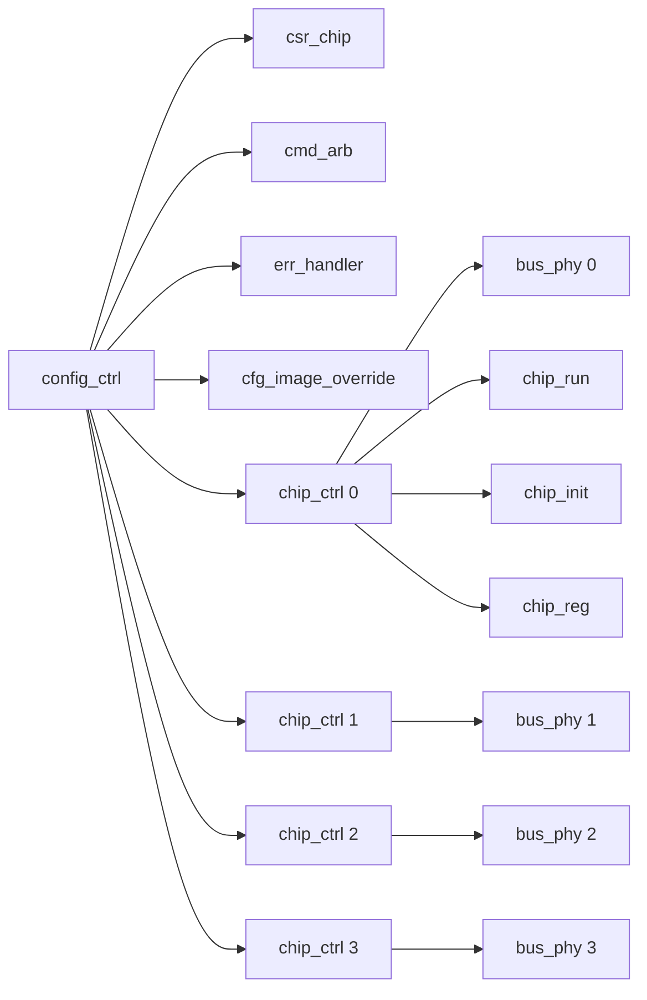

| 파일 | 분석 시 보는 핵심 |
|---|---|
| `tdc_gpx_chip_ctrl.vhd` | INIT/RUN/REG 서브 FSM의 상위 phase 전환, raw FIFO, response quarantine |
| `tdc_gpx_chip_run.vhd` | Shot capture, IFIFO1/2 drain, timeout, ALU trigger |
| `tdc_gpx_bus_phy.vhd` | GPX 비동기 병렬 버스의 실제 strobe/OEN/turnaround timing |
| `tdc_gpx_cfg_image_override.vhd` | merged config를 GPX Reg5/Reg7 image 정책에 반영 |
| `tdc_gpx_decoder_i_mode.vhd` | GPX 28비트 word의 필드 해체 |
| `tdc_gpx_raw_event_builder.vhd` | chip ID, stop ID, hit 순번, shot tag 추가 |
| `tdc_gpx_cell_builder.vhd` | sparse hit를 dense Cell로 변환, ping-pong buffer |
| `tdc_gpx_face_assembler.vhd` | chip 순서 정렬, timeout blank-fill, Row 생성 |
| `tdc_gpx_line_packer.vhd` | 의미 있는 32비트 word만 연속 packing |
| `tdc_gpx_header_inserter.vhd` | line prefix, 첫 line Face header, SOF/EOL 생성 |
| `tdc_gpx_pkg.vhd` | 공통 타입, Cell 형식, helper 함수 |
| `tdc_gpx_cfg_pkg.vhd` | CSR 주소/비트, 초기값, bus timing 규칙 |

> **코드 읽기 주의:** `tdc_gpx_top.vhd` 머리말에는 “No processes”라고 남아 있지만 현재 top에는 VDMA geometry와 여러 sticky latch process가 존재한다. 머리말의 해당 문장은 오래된 설명이다.

---

## 6. 클럭, 리셋, CDC 계약

### 6.1 클럭 도메인

| 클럭 | 기본/명목 | 소유 기능 | 주의점 |
|---|---:|---|---|
| `i_axis_aclk` | 150 MHz | decode, Cell, Face, output, sequencer, runtime status | 전체 신호처리 throughput의 기준 |
| `i_tdc_clk` | 200 MHz | `bus_phy`, `chip_ctrl`, GPX 제어 | GPX 버스 timing과 drain watchdog 기준 |
| `s_axi_aclk` | 100 MHz 명목 | 두 AXI-Lite CSR | 소프트웨어 접근 도메인 |

`g_AXIS_CLK_MHZ`와 `g_TDC_CLK_MHZ`는 클럭을 만들지 않는다. 다음 용도에 쓰이는 **설계 메타데이터**이다.

- 5 ns 단위 range/scan 값을 소비 도메인의 clock count로 변환
- ns 단위 top timing generic을 도메인별 clock count로 변환
- elaboration assertion
- timeout/throughput 계약 설명

허용값은 `50, 100, 125, 150, 200 MHz`이고 `g_AXIS_CLK_MHZ <= g_TDC_CLK_MHZ`여야 한다. 실제 clock generator와 XDC 값이 generic과 다르면 거리 window와 timeout의 물리 시간이 틀어진다.

### 6.2 stream clock mode

| `g_STREAM_CLK_MODE` | 동작 | 제약 |
|---|---|---|
| `ASYNC` | TDC raw stream을 `xpm_fifo_async`로 TDC->AXIS 전달 | 분리 클럭 기본 선택 |
| `SYNC` | raw stream CDC FIFO를 bypass | 두 포트가 같은 clock domain이거나 명시적으로 synchronous여야 함 |

`SYNC`에서 `g_AXIS_CLK_MHZ = g_TDC_CLK_MHZ`라는 elaboration assertion은 숫자만 검사한다. 서로 독립된 두 PLL 출력이 우연히 같은 MHz인 것만으로는 안전하지 않다. 두 clock의 위상 관계가 보장되고 STA가 synchronous path로 분석할 수 있어야 하며, 가장 단순한 통합은 두 포트에 같은 clock net을 연결하는 것이다.

### 6.3 주요 CDC 방식

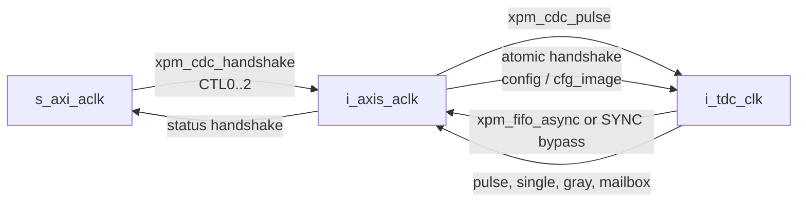

현재 `tdc_gpx_config_ctrl.vhd`에서 `t_tdc_cfg`와 `cfg_image`는 실제로 `xpm_cdc_handshake`를 사용한다. 과거 `Doc/known_issues.md`의 “2-FF bundle + software settle” 설명은 현재 구현과 다르다.

CDC 신호를 분석할 때는 다음을 구분한다.

- **pulse:** command, timeout event처럼 1회성 사건
- **single/sticky level:** 칩별 독립 상태 비트
- **gray:** 증가하는 shot sequence
- **handshake/mailbox:** 여러 비트가 한 묶음으로 일관되게 전달되어야 하는 데이터
- **async FIFO:** 연속 AXI-Stream payload

### 6.4 리셋

- `i_axis_aresetn`: 처리 파이프라인의 active-low reset
- `s_axi_aresetn`: CSR 도메인의 active-low reset
- TDC 도메인 reset은 `i_axis_aresetn`을 `xpm_cdc_async_rst`로 async assert/sync deassert하여 만든다.
- `cmd_soft_reset`: 설정을 보존하면서 동작 상태를 초기화하는 명령 경계
- `err_soft_clear`: 선택된 sticky/error history만 지우며 데이터 경로를 재시작하지 않는다.
- `force_reinit`: chip-control recovery 경계이며 외부 bus가 실제로 정리되지 않은 상태에서는 만능 복구 수단이 아니다.

### 6.5 시간 설정값의 기준 domain

이름에 `clks`, `ticks`가 함께 존재하므로 다음 표를 기준으로 해석한다.

| 값 | 입력 단위 | RTL 변환 | 실제 소비 domain |
|---|---|---|---|
| `max_range_5ns_ticks` | 항상 5 ns/tick | `g_AXIS_CLK_MHZ`, `g_TDC_CLK_MHZ`별 ceiling 변환 | AXIS Cell 계열 watchdog의 기준 window, TDC 측정 window 및 drain 예산의 기준값 |
| `max_scan_5ns_ticks` | 항상 5 ns/tick | `g_AXIS_CLK_MHZ` 기준 ceiling 변환 | `face_assembler`의 chip-slice 대기/blank-fill |
| `g_*_TIME_NS` timing generic | ns | 해당 소비 domain 기준 ceiling 변환 | power/recovery/bus/drain/error/Cell margin |
| `bus_clk_div`, `bus_ticks` | TDC clock count/분주 | legality clamp만 수행 | `bus_phy` |

runtime 거리/scan 설정은 CSR 호환성을 위해 5 ns tick으로 유지한다. 합성 전 timing policy는 top의 ns generic으로 관리하며, RTL이 `ceil(time_ns × clock_MHz / 1000)`으로 변환한다. 따라서 clock 조합을 바꿀 때 같은 시간 generic을 다시 환산할 필요는 없다. 단, `bus_clk_div`/`bus_ticks`와 일부 명시적인 hard cap은 구조상 cycle count이므로 별도 해석이 필요하다.

---

## 7. Top generic 사용법

| Generic | 기본값 | 의미 | 변경 시 확인 |
|---|---:|---|---|
| `g_HW_VERSION` | `0x00010000` | HW 식별값 | 드라이버 호환성 |
| `g_OUTPUT_WIDTH` | 32 | Rise/Fall AXIS 폭, 32/64/128 | VDMA stream 폭과 TB matrix |
| `g_NUM_CHIPS` | 4 | 외부 물리 TDC lane 수, 1..4; top port 폭을 직접 결정 | `popcount(g_PRESENT_CHIP_MASK)`와 반드시 일치 |
| `g_PRESENT_CHIP_MASK` | `1111` | 고정 4-slot 논리 ABI 중 구현할 chip ID 선택 | 실제 GPX 배치, compact lane 순서, slope 그룹 |
| `g_RISE_CHIP_MASK` | `0011` | Fall 활성 시 chip별 Rise 가능 역할; Fall mask와 중복 가능 | 보드 배선, GPX Reg0, 활성 mask 조합 |
| `g_FALL_CHIP_MASK` | `1100` | chip별 Fall 가능 역할; `0000`이면 Fall datapath 합성 제거 | 보드 배선, Fall VDMA 필요 여부 |
| `g_MAX_STOPS_PER_CHIP` | 8 | 빌드가 허용하는 chip당 최대 Stop 수, 2..8 | GPX 설정과 최대 Cell/VDMA geometry |
| `g_MAX_HITS_PER_STOP` | 7 | 빌드가 허용하는 Stop당 최대 Hit 수, 1..7 | 거리 창, Cell 크기, 처리량 |
| `g_AXIS_CLK_MHZ` | 150 | 처리 클럭 메타데이터 | 실제 클럭/XDC 일치 |
| `g_TDC_CLK_MHZ` | 200 | GPX 제어 클럭 메타데이터 | 실제 클럭/XDC 일치 |
| `g_POWERUP_TIME_NS` | 240 ns | GPX power-up 단계 | 데이터시트/보드 reset |
| `g_RECOVERY_TIME_NS` | 40 ns | ALU 후 recovery | Shot 간격 예산 |
| `g_ALU_PULSE_TIME_NS` | 20 ns | ALU trigger 폭 | GPX timing |
| `g_BUS_READ_PERIOD_MIN_TIME_NS` | 25 ns | CSR와 PHY가 공유하는 최소 read initiation 시간 | GPX 40 MHz 한계 |
| `g_BUS_IDLE_STABLE_TIME_NS` | 20,480 ns | bus-fatal 후 자동 복구 전 연속 idle 시간 | PCB 안정성/복구 지연 |
| `g_DRAIN_MARGIN_TIME_NS` | 1,280 ns | TDC drain watchdog의 range 이후 여유 | bus/ALU 지연 |
| `g_ERR_DEBOUNCE_TIME_NS` | 25 ns | ErrFlag debounce 시간 | board noise |
| `g_ERR_MAX_RETRIES` | 3 | 자동 복구 retry 횟수 | 시스템 오류 정책 |
| `g_CELL_QUARANTINE_MARGIN_TIME_NS` | 3,410 ns | Cell DROP/QUARANTINE 여유 | late drain bound |
| `g_CELL_IFIFO2_MARGIN_TIME_NS` | 1,705 ns | Cell IFIFO2 대기 여유 | output-side bound |
| `g_OEN_MODE` | `DYNAMIC_CONNECTED` | GPX OEN 연결 방식 | 실제 schematic |
| `g_STREAM_CLK_MODE` | `ASYNC` | raw stream CDC 구조 | 두 clock 관계 |

`parent_ref/rtl/tdc_gpx_parent_core.vhd`는 위 top generic을 모두 같은 이름으로 노출하고 그대로 전달한다. 따라서 parent에서 값을 바꾸면 `tdc_gpx_top`을 거쳐 실제 소비 하위 모듈까지 한 경로로 내려간다. `parent_ref/scripts/verify_parent_generic_parity.ps1`는 top 선언, parent 선언, generic map의 이름과 개수를 자동 대조하며 누락·개명·간접 매핑을 오류로 처리한다. 반대로 `g_CHIP_ID`, `g_SLOPE_VALUE`, FIFO data/depth, CDC synchronizer stage처럼 instance identity나 구조에서 파생되는 generic은 top에 중복 노출하지 않는다. 이 구분은 사용자가 정해야 하는 build policy만 최상위에서 관리하고, 서로 모순될 수 있는 중복 설정을 만들지 않기 위한 것이다.

`tdc_gpx_top`에는 의도적으로 `g_N_FACES`가 없다. polygon 면 수의 합성 전 소유자는 `motor_decoder_top.g_N_FACES` 하나이며, motor의 `o_n_faces`를 TDC의 `i_n_faces`에 직접 연결한다. 두 IP에 같은 의미의 generic을 각각 두면 서로 다른 값으로 합성될 수 있으므로 금지한다.

기본 시간값을 지원 주파수에 적용하면 다음처럼 사이클 수만 달라진다. 괄호 안 물리 시간은 동일하다.

| Clock MHz | TDC power-up 240 ns | TDC bus-idle 20,480 ns | TDC drain 1,280 ns | AXIS Cell quarantine 3,410 ns |
|---:|---:|---:|---:|---:|
| 50 | 12 | 1,024 | 64 | 171 |
| 100 | 24 | 2,048 | 128 | 341 |
| 125 | 30 | 2,560 | 160 | 427 |
| 150 | 36 | 3,072 | 192 | 512 |
| 200 | 48 | 4,096 | 256 | 682 |

EF guard는 단순 고정 시간이 아니라 `ceil(11.8 ns / TDC period) + 2 synchronizer clocks`이며, 50/100/125/150/200 MHz에서 각각 3/4/4/4/5 clocks이다. 이 식의 `2`는 실제 `bus_phy` 2-FF 동기화 구조에 대응하므로 별도 top generic으로 중복 노출하지 않는다.

예를 들어 `max_scan_5ns_ticks=1000`은 항상 5 us이고, AXIS 50/100/125/150/200 MHz에서 각각 250/500/625/750/1000 clocks로 변환된다.

### 7.1 고정 ABI 상수와 build-profile generic의 경계

`tdc_gpx_pkg.vhd`의 다음 세 값은 선택된 하드웨어 규모가 아니라 **인터페이스와 데이터 형식의 절대 상한**이다.

| Package 상수 | 고정 이유 | 선택값 |
|---|---|---|
| `c_MAX_CHIPS=4` | 논리 chip ID 폭, 내부 ABI 배열, CSR/header slot 형식의 상한 | `g_NUM_CHIPS`, `g_PRESENT_CHIP_MASK` |
| `c_MAX_STOPS_PER_CHIP=8` | Stop ID/배열 및 canonical 형식의 상한 | `g_MAX_STOPS_PER_CHIP` |
| `c_MAX_HITS_PER_STOP=7` | 17-bit GPX hit의 Cell metadata/slot 형식 상한 | `g_MAX_HITS_PER_STOP` |

`g_NUM_CHIPS`와 `g_PRESENT_CHIP_MASK`는 역할이 다르다. `g_NUM_CHIPS`는 Vivado IP Integrator가 사용자 함수를 포트 범위에서 해석하지 못하기 때문에 필요한 **물리 포트 폭 generic**이고, mask는 sparse 논리 chip ID를 보존하는 **slot 선택 generic**이다. RTL은 `g_NUM_CHIPS = popcount(g_PRESENT_CHIP_MASK)`를 assertion으로 강제한다. 따라서 두 값을 독립적인 자유도로 사용하면 안 되며, parent 생성 스크립트 또는 빌드 설정에서 한 쌍으로 변경해야 한다.

물리 lane은 `g_PRESENT_CHIP_MASK`의 낮은 chip ID부터 연속 배치된다.

| 예시 | `g_NUM_CHIPS` | Present mask | 물리 lane mapping | 외부 D / ADR 폭 |
|---|---:|---:|---|---:|
| 1-chip | 1 | `0001` | P0 -> logical chip 0 | 28 / 4 bit |
| sparse 2-chip | 2 | `0101` | P0 -> chip 0, P1 -> chip 2 | 56 / 8 bit |
| 3-chip | 3 | `0111` | P0/P1/P2 -> chip 0/1/2 | 84 / 12 bit |
| 4-chip | 4 | `1111` | P0/P1/P2/P3 -> chip 0/1/2/3 | 112 / 16 bit |

CSR, header, status의 chip ID는 compact physical lane 번호로 바뀌지 않는다. 예를 들어 `0101`에서는 외부 lane이 2개뿐이어도 metadata의 chip ID는 0과 2이다.

CSR 요청은 build profile 밖으로 나가지 못한다.

| CSR 요청 | RTL 적용값 |
|---|---|
| `active_chip_mask` | `request AND g_PRESENT_CHIP_MASK`; 결과가 0이면 가장 낮은 present slot 하나 |
| `stops_per_chip < 2` | 2 |
| `stops_per_chip > g_MAX_STOPS_PER_CHIP` | `g_MAX_STOPS_PER_CHIP` |
| `max_hits_cfg = 0` | `g_MAX_HITS_PER_STOP` alias |
| `max_hits_cfg > g_MAX_HITS_PER_STOP` | `g_MAX_HITS_PER_STOP` |

`g_PRESENT_CHIP_MASK`는 비존재 Cell builder를 elaboration에서 제거하고 해당 chip-control slot을 reset/비활성 상태로 고정한다. 합성기는 이 constant-disabled cone을 제거할 수 있다. 반면 Stop/Hit generic은 현재 CSR legality, header, Cell/VDMA geometry를 제한하지만 고정 ABI record와 일부 내부 배열은 package 상한 크기를 유지한다. 따라서 Stop/Hit 상한 축소에 따른 LUT/FF/BRAM 절감은 합성 utilization 비교로 확인해야 하며, 저장 배열 자체를 반드시 축소하려면 별도의 type/interface 구조 변경이 필요하다.

### 7.2 slope topology

고정 enum 모드 대신 세 개의 generic mask가 합성 전 물리 역할을 정의하고, Chip CSR `SCAN_TIMEOUT[19] falling_enable`이 실행 시 lane 구성을 선택한다.

| `falling_enable` | runtime Rise mask | runtime Fall mask | 의미 |
|---:|---|---|---|
| 0 | `active_chip_mask` | `0000` | 모든 활성 chip을 Rise로 사용 |
| 1 | `active_chip_mask AND g_RISE_CHIP_MASK` | `active_chip_mask AND g_FALL_CHIP_MASK` | 합성 전 역할대로 Rise/Fall 분리; mask 중복 chip은 양 edge |

합성 전 generic에는 다음 제약이 걸린다.

1. `g_PRESENT_CHIP_MASK`는 0일 수 없다.
2. 모든 present chip은 Rise 또는 Fall 역할을 하나 이상 가져야 한다.
3. Rise-capable chip 수는 Fall-capable chip 수보다 작을 수 없다.
4. `g_RISE_CHIP_MASK`와 `g_FALL_CHIP_MASK`의 같은 bit가 1이면 해당 chip은 양 edge를 독립 Cell로 만든다.

start 시에도 현재 active subset에 동일한 원칙을 적용한다. Fall 활성 시 Rise/Fall lane이 각각 비어 있지 않고, 모든 active chip이 적어도 한 lane에 포함되며, runtime Rise 수가 Fall 수 이상이어야 한다. 위 조건을 만족하지 않으면 해당 start pulse는 `cfg_rejected`로 폐기된다.

| 대표 build | Present | Rise capability | Fall capability | Fall ON runtime lane | 생성되는 Cell builder |
|---|---:|---:|---:|---|---:|
| 기본 2R+2F split | `1111` | `0011` | `1100` | Rise `0011`, Fall `1100` | Rise 4 + Fall 2 |
| 4-chip Rise-only | `1111` | `1111` | `0000` | Fall 사용 불가 | Rise 4 + Fall 0 |
| 3-chip 2R+1F | `0111` | `0011` | `0100` | Rise `0011`, Fall `0100` | Rise 3 + Fall 1 |
| 1-chip dual-edge | `0001` | `0001` | `0001` | Rise/Fall 모두 `0001` | Rise 1 + Fall 1 |
| 4-chip dual-edge | `1111` | `1111` | `1111` | Rise/Fall 모두 `1111` | Rise 4 + Fall 4 |

Rise builder가 `g_RISE_CHIP_MASK` 수보다 많을 수 있는 이유는 runtime Fall OFF에서 **모든 present chip을 Rise로 전환**해야 하기 때문이다. 반면 Fall builder와 Fall assembler/FIFO/packer/header는 `g_FALL_CHIP_MASK AND g_PRESENT_CHIP_MASK`가 0이면 generate되지 않는다. 외부 Fall AXI 포트 ABI는 유지되지만 `TVALID=0`, Fall HSIZE=0의 idle/zero 계약으로 고정된다. `o_vdma_vsize_lines`는 slope별 포트가 아니라 공통 Face VSIZE이므로 `cols_per_face`를 계속 나타낸다.

Fall-capable build에서 `falling_enable=0`으로 바꾸는 것은 합성 제거가 아니다. 이미 생성된 Fall 회로를 실행 중 유휴화하고, HSIZE를 0으로 만들며, Face 완료가 Fall `frame_done`을 기다리지 않게 한다. 자원 절감이 목적이면 합성 전에 `g_FALL_CHIP_MASK=0000`으로 설정해야 한다.

### 7.3 xc7z020 OOC 합성 확인

`xc7z020clg484-2`, AXIS 150 MHz, TDC 200 MHz, 32-bit 출력의 2026-07-22 topology 최적화 비교 결과는 다음과 같다.

| Build | 생성 topology | LUT | FF | LUTRAM | AXIS WNS | TDC WNS |
|---|---|---:|---:|---:|---:|---:|
| split `P1111/R0011/F1100` | Rise builder 4, Fall builder 2, Fall output chain 1식 | 17,252 | 23,381 | 2,296 | 1.246 ns | 0.800 ns |
| Rise-only `P1111/R1111/F0000` | Rise builder 4, Fall builder 0, Fall output chain 0 | 13,832 | 20,088 | 1,504 | 1.338 ns | 0.843 ns |

Rise-only build는 split 대비 LUT 3,420개(19.8%), FF 3,293개(14.1%), LUTRAM 792개(34.5%)가 감소했다. netlist topology assertion으로 Fall assembler/FIFO/line-packer/header가 0개임도 확인했다. 즉 `g_FALL_CHIP_MASK=0000`의 합성 제거는 단순 기대가 아니라 생성 netlist와 utilization 양쪽에서 확인된 계약이다.

2026-07-22 physical-pin OOC matrix는 동일 part/clock/output 조건에서 다음 포트 폭을 netlist에서 직접 확인했다. 네 경우 모두 post-synthesis timing, `check_timing`, CDC gate를 통과했다.

| Build profile | `g_NUM_CHIPS` / Present | `io_tdc_d` | `o_tdc_adr` | 각 control/status vector |
|---|---:|---:|---:|---:|
| 1-chip dual edge | 1 / `0001` | 28 | 4 | 1 |
| sparse 2-chip rising | 2 / `0101` | 56 | 8 | 2 |
| 3-chip 2R+1F | 3 / `0111` | 84 | 12 | 3 |
| 4-chip 2R+2F | 4 / `1111` | 112 | 16 | 4 |

2026-07-23에는 OOC와 parent가 함께 읽는 30-file canonical RTL manifest를 기준으로 4-chip split build를 다시 구현했다. 기본 implementation 전략은 WNS `-0.084 ns`였고, 동일 RTL/XDC의 `TIMING_EXPLORE`에서 다음과 같이 최종 closure됐다. 이 결과가 현재 source set의 물리 sign-off 기준이다.

| 항목 | 최종 결과 |
|---|---:|
| Post-route LUT / FF / LUTRAM | 15,835 / 20,242 / 2,272 |
| 전체 WNS / TNS | 0.041 ns / 0.000 ns |
| AXIS 150 MHz WNS | 0.506 ns |
| TDC 200 MHz WNS | 0.041 ns |
| WHS / THS | 0.065 ns / 0.000 ns |
| no-clock / unconstrained internal endpoint | 0 / 0 |
| Critical unsafe CDC / routing error | 0 / 0 |

최종 session은 `signoff_results/sessions/260723071000_ip_handoff_timing_explore_w32_a150_t200_p1111_r0011_f1100_impl`이다. 이 OOC 결과는 내부 clocked path를 검증하며, 실제 보드의 GPX I/O delay와 pin assignment는 parent/board XDC에서 별도로 닫아야 한다.

---

## 8. Top 포트 설명

### 8.1 제어 및 입력 스트림

| 포트 | 도메인 | 의미 | 계약 |
|---|---|---|---|
| `i_n_faces` | 정적 sideband | motor가 합성 전 확정한 polygon 면 수 | `motor_decoder_top.o_n_faces`에 직접 연결, bitstream 동작 중 1..5의 일정한 값이어야 함 |
| `i_shot_start` | AXIS | 실제 레이저/TStart 발생 표지이자 `i_shot_face_index`의 valid | level이 길어도 내부 edge detector가 1회 pulse로 변환; 물리 TStart 출력은 아님 |
| `i_shot_face_index` | AXIS | 수락된 Shot이 속한 face ID payload | `i_shot_start` pulse 전체에서 안정; direct/deferred Shot queue가 payload를 함께 보존 |
| `i_stop_tdc` | AXIS | 현재 Shot의 측정 window 종료 표지 | TDC domain으로 pulse CDC; 동기화된 `IrFlag`보다 먼저 도착할 때만 `sequence_error`, IrFlag 이후 drain/ALU 중 도착은 정상이며 session 종료 명령은 아님 |
| `i_bin_resolution_ps` | AXIS | bin 해상도 메타데이터 | 헤더 기록 전용 |
| `i_k_dist_fixed` | AXIS | 외부 거리 scale 메타데이터 | 헤더 기록 전용, Q-format은 이 RTL이 정의하지 않음 |

`tdc_gpx_top`에는 `stop_evt` 또는 `fire_count` 입력 포트가 없다. Echo pulse/count가 필요한 시스템은 이를 별도 진단 또는 광학 검증 경로로 수집할 수 있지만, 그 값을 GPX IFIFO read 개수로 변환해 이 모듈에 주입해서는 안 된다.

현재 `laser_ctrl` 결과 스트림은 `tdata[15:0]=step_idx+1`, `tdata[31:16]=remaining` 계약이므로 GPX geometry 입력이 아니다. `tdc_gpx_top`은 이 스트림을 받지 않지만, 수락된 Shot의 face ID는 전용 `i_shot_face_index` payload로 받는다. `cols_per_face`는 Pipeline CSR `RANGE_COLS[31:16]`이 단독 소유하며 Laser 결과 스트림은 별도 진단/소프트웨어 경로로 라우팅해야 한다.

#### IP 간 값 전달 방식

| 값의 수명 | 예 | 연결 방식 | 이유 |
|---|---|---|---|
| bitstream 동안 불변 | `n_faces`, build capability | generic 파생 정적 sideband 직접 연결 | 변화가 없으므로 handshake 없이도 coherent |
| 이벤트마다 변화 | `shot_face_index` | `i_shot_start`를 valid로 사용하는 payload 묶음 | Shot과 face ID를 같은 cycle 경계에서 원자적으로 capture |
| 운용 중 장기 설정 변경 | motor center/half width, TDC CSR 설정 | request/apply 또는 `xpm_cdc_handshake` | multi-bit 값이 중간 상태로 관측되는 것을 방지 |
| 연속 데이터 | raw hit, VDMA output | AXI4-Stream `TVALID/TREADY` | backpressure와 beat 보존 필요 |

Laser가 이미 발사된 뒤 TDC가 `ready`를 낮추는 사후 backpressure는 광학 사건을 되돌릴 수 없으므로 추가하지 않는다. 현재 TDC는 경계 충돌에 대해 1-deep deferred Shot과 drop 진단을 가진다. 모든 Shot의 무손실 수락이 필수라면 향후 `laser_ctrl`이 발사 **전에** 확인하는 `tdc_ready/fire_admit` 핸드셰이크를 추가해야 한다.

### 8.2 GPX 물리 포트

| 그룹 | 포트 | 설명 |
|---|---|---|
| 데이터/주소 | `io_tdc_d`, `o_tdc_adr` | compact flat vector; 폭은 각각 `28*g_NUM_CHIPS`, `4*g_NUM_CHIPS` |
| 버스 strobe | `o_tdc_csn`, `o_tdc_rdn`, `o_tdc_wrn`, `o_tdc_oen` | 각 `g_NUM_CHIPS` bit, chip select/read/write/output enable |
| GPX 제어 | `o_tdc_stopdis`, `o_tdc_alutrigger`, `o_tdc_puresn` | 각 `g_NUM_CHIPS` bit, stop disable/ALU trigger/reset |
| FIFO 상태 | `i_tdc_ef1/2`, `i_tdc_lf1/2` | 각 `g_NUM_CHIPS` bit, empty/load flag, 내부 2-FF sync |
| 완료/오류 | `i_tdc_irflag`, `i_tdc_errflag` | 각 `g_NUM_CHIPS` bit, 측정 완료와 GPX 오류 flag |

물리 lane `p`의 data slice는 `io_tdc_d(28*p+27 downto 28*p)`, address slice는 `o_tdc_adr(4*p+3 downto 4*p)`이다. `p`는 logical chip ID가 아니라 present mask의 낮은 set bit부터 매긴 compact 번호다. 따라서 XDC/보드 wrapper는 generic profile별 lane mapping을 고정해야 한다. `tdc_gpx_config_ctrl`가 이 경계에서 IOBUF를 소유하고, 내부 `bus_phy`는 분리된 `i_d/o_d/o_d_tri` 신호로 동작한다.

`g_NUM_CHIPS`만 바꾸거나 mask만 바꾸는 구성은 허용되지 않는다. 예를 들어 3-chip 구성은 `g_NUM_CHIPS=3`과 1-bit가 세 개인 Present mask를 함께 사용해야 한다. 기본 연속 배치는 `0111`이고 sparse 배치도 가능하지만, sparse mapping은 반드시 schematic/XDC와 일치해야 한다.

### 8.3 출력

Rise는 `o_m_axis_*`, Fall은 `o_m_axis_fall_*`이다.

| 신호 | 의미 |
|---|---|
| `TDATA` | 32/64/128비트 packed line data |
| `TVALID/TREADY` | 표준 AXI4-Stream handshake |
| `TKEEP/TSTRB` | accepted output beat에서는 항상 모두 1 |
| `TLAST` | **Face 끝이 아니라 VDMA line 끝** |
| `TUSER[0]` | **각 Face**의 첫 line 첫 beat에서 SOF=1 |
| `o_vdma_hsize_bytes_rise/fall` | 해당 slope 한 line의 byte 수 |
| `o_vdma_vsize_lines` | Face의 line 수=`cols_per_face` |

VDMA를 tight packing으로 설정하면 `STRIDE = 해당 lane HSIZE`이다. Rise와 Fall의 활성 chip 수가 다르면 두 HSIZE도 달라질 수 있다.

HSIZE/VSIZE 출력은 live CSR mirror가 아니라 **Face snapshot의 관측값**이다. 첫 `packet_start` 후 약 3 AXIS clocks가 지나야 현재 Face 값으로 안정된다. PS가 첫 Shot 전에 VDMA를 설정해야 한다면 CSR 설정으로 같은 산식을 미리 계산하고, exported geometry는 snapshot 후 일치 여부를 확인하는 용도로 사용한다.

### 8.4 interrupt

- `o_irq`: GPX 개별 register read/write operation 완료 pulse가 source인 chip CSR interrupt 경로; Shot/Face 완료 IRQ가 아님
- `o_irq_pipe`: 현재 pipeline CSR interrupt source가 reserved 0이므로 사실상 legacy/reserved
- pipeline 완료/오류는 `STAT5/6/7`을 읽어 확인한다.

---

## 9. 설정과 명령 처리

### 9.1 두 AXI-Lite 주소 공간

두 CSR은 별개의 AXI-Lite slave이므로 동일 offset이 서로 다른 의미를 가질 수 있다.

#### Pipeline CSR, 7비트 주소

| Offset | 이름 | 핵심 필드 |
|---:|---|---|
| `0x00` | `MAIN_CTRL` | mask, topology 관련 runtime 설정, command `[31:28]` |
| `0x04` | `RANGE_COLS` | `[15:0] max_range_5ns_ticks`, `[31:16] cols_per_face` |
| `0x08` | `AUX_CMD` | bit0 force_reinit, bit1 err_soft_clear |
| `0x40..0x5C` | `STAT0..7` | published status window |

#### Chip CSR, 9비트 주소

| Offset | 이름 | 핵심 필드 |
|---:|---|---|
| `0x04` | `BUS_TIMING` | divider, ticks, GPX register target/trigger |
| `0x0C` | `START_OFF1` | `[17:0]` |
| `0x10` | `CFG_REG7` | GPX register 7 image |
| `0x14..0x50` | `CFG_IMAGE[0..15]` | GPX configuration mirror |
| `0x54` | `SCAN_TIMEOUT` | `[15:0]` max scan 5 ns ticks, `[18:16]` max hits, `[19]` falling enable |
| `0x80..0x8C` | chip result | chip0..3 register read result |

> `tdc_gpx_cfg_pkg.vhd`의 공용 constant는 chip CSR 배치도 포함하므로 `c_ADDR_RANGE_COLS=0x08`로 보일 수 있다. 그러나 **published Pipeline CSR의 RANGE_COLS는 0x04**이며 `tdc_gpx_csr_pipeline.vhd`가 CTL1에 배치한다.

Pipeline CSR wrapper는 generated IP의 native status 위치 `0x20..0x3C`를 숨기고 published 위치 `0x40..0x5C`로 주소 변환한다. `0x20..0x3C`와 `0x60..0x7C`를 status alias로 사용하면 안 된다. 두 AXI-Lite slave의 시스템 base address는 이 RTL이 정하지 않으므로 parent address map에서 별도로 할당해야 한다.

Pipeline의 compile-time status는 다음과 같다.

| Offset | 이름 | 값/형식 |
|---:|---|---|
| `0x40` | `HW_VERSION` | `g_HW_VERSION`, 기본 `0x00010000` |
| `0x44` | `HW_CONFIG` | build chip 수, build max stops/hits, hit width, AXIS width, Cell format, `[28]` Fall 회로 존재 여부, `[31:29]` motor-owned n_faces |
| `0x48` | `MAX_ROWS` | `popcount(g_PRESENT_CHIP_MASK) x g_MAX_STOPS_PER_CHIP`; 기본 32 |
| `0x4C` | `CELL_SIZE` | build max hits 기준 canonical Cell bytes; 기본 20 B |
| `0x50` | `MAX_HSIZE` | build profile full-mask 최대 line bytes; 기본 688 B |

`MAX_ROWS/CELL_SIZE/MAX_HSIZE`는 선택된 build profile의 compile-time 상한이고 현재 Face의 slope별 runtime geometry가 아니다. 실제 VDMA 설정은 Face 설정으로 계산하거나 `o_vdma_hsize_bytes_rise/fall`, `o_vdma_vsize_lines`로 교차 확인한다.

### 9.2 `MAIN_CTRL` 비트

| 비트 | 필드 | 실제 영향 |
|---|---|---|
| `[3:0]` | `active_chip_mask` | chip/lane/Cell/VDMA geometry |
| `[4]` | `packet_scope` | 현재 datapath와 header 모두에서 미사용; config snapshot에만 보존 |
| `[6:5]` | `hit_store_mode` | 현재는 header-only |
| `[9:7]` | `dist_scale` | 현재는 header-only |
| `[10]` | `drain_mode` | IFIFO drain 방식 |
| `[11]` | `pipeline_en` | 현재는 header-only |
| `[14:12]` | reserved | legacy `n_faces` 위치; write해도 무시되며 `i_n_faces`가 단독 소유 |
| `[18:15]` | `stops_per_chip` | Cell 개수와 stop ID 범위 |
| `[22:19]` | `n_drain_cap` | 선택적 IFIFO별 drain cap 단위; 0=비활성, 각 IFIFO의 실제 cap=`4 x field` words |
| `[27:23]` | `stopdis_override` | stop disable override |
| `[28]` | `cmd_start` | session start rising edge |
| `[29]` | `cmd_stop` | stop rising edge |
| `[30]` | `cmd_soft_reset` | soft reset rising edge |
| `[31]` | `cmd_cfg_write` | GPX config write rising edge |

명령 비트는 rising-edge 검출이다. 드라이버는 일반적으로 다음처럼 동작해야 한다.

```text
write COMMAND bit = 1
wait for CSR/CDC propagation or status completion
write COMMAND bit = 0
```

비트를 1로 계속 유지하면 두 번째 명령은 발생하지 않는다. `cmd_start`는 내부 pending latch가 있어 파이프라인이 busy이면 준비될 때까지 보존된다. `cmd_cfg_write`도 CDC busy 동안 pending될 수 있다.

`stopdis_override[4]`는 override enable이고 `[3:0]`은 chip별 강제 `STOPDIS` 값이다. enable=1이면 FSM 상태보다 즉시 우선한다. mid-shot 변경은 현재 측정을 임의 지점에서 끊을 수 있고 자동 recovery를 시작하지 않으므로 정상 운용에서는 0으로 유지한다.

### 9.3 runtime clamp/reject

| 입력 | 적용 |
|---|---|
| active mask `0000` | CSR 출력에서 chip0 `0001`로 clamp |
| 정적 `i_n_faces`가 1..5 밖 | simulation assertion failure; 내부 방어값은 1로 sanitize |
| stops `<2` | 2로 clamp |
| stops `>8` | 8로 clamp |
| cols `0` | 1로 clamp |
| `max_hits=000` | 유효값 7로 해석 |
| Fall ON인데 runtime Rise/Fall 중 하나가 비거나 Rise chip 수가 Fall보다 작음 | start reject |
| `HW_CONFIG[28]=0` build에서 `falling_enable=1` | start reject |

설정은 `packet_start`에서 `s_cfg_face_r`로 snapshot된다. 따라서 Face 진행 중 소프트웨어가 CSR을 바꾸더라도 현재 Face의 geometry와 packing에는 즉시 섞이지 않는다.

### 9.4 reset 직후 주요 기본값

| 주소 공간/offset | reset 값 | 해석 |
|---|---:|---|
| Pipeline `MAIN_CTRL 0x00` | `0x0004000F` | mask=`1111`, reserved `[14:12]=0`, stops=8, 명령=0 |
| Pipeline `RANGE_COLS 0x04` | `0x0960010B` | cols=2400, max range=267 x 5 ns |
| Chip `BUS_TIMING 0x04` | `0x00000142` | divider=2, ticks=5 |
| Chip `START_OFF1 0x0C` | `0x00000000` | offset 0 |
| Chip `CFG_REG7 0x10` | `0x00000000` | Reg7 image 0 |
| Chip `CFG_IMAGE 0x14..0x50` | 모두 0 | 실제 GPX 운용값을 SW가 기록해야 함 |
| Chip `SCAN_TIMEOUT 0x54` | `0x00080000` | max_scan=0, max_hits=0은 build 최대값 alias, falling_enable=1 |

Reset 기본값은 합성 가능한 안전 초기 상태일 뿐 보드/광학계용 완료 설정이 아니다. 특히 `CFG_IMAGE`와 GPX timing/calibration 필드는 반드시 시스템 값으로 덮어쓴다.

### 9.5 start reject와 pending의 현재 계약

`face_seq`는 pipeline이 잠시 busy일 때만 `cmd_start`를 pending으로 보존한다. geometry 또는 slope 구성이 유효하지 않으면 `cfg_rejected`를 1 AXIS clock pulse로 만들고 내부 pending을 즉시 삭제한다. 따라서 설정을 나중에 고쳐도 과거 start가 자동 수락되지 않는다. 드라이버는 설정을 수정한 뒤 **새 `cmd_start` rising edge**를 내야 한다.

`cfg_rejected` 자체는 아직 published `STAT5/6/7`에 packing되지 않는다. 소프트웨어가 reject 이유를 직접 읽을 수 없으므로 start 전에 다음을 검사한다.

1. `active_chip_mask`가 `g_PRESENT_CHIP_MASK` 밖의 chip을 포함하지 않는다.
2. Fall ON이면 `active AND g_RISE_CHIP_MASK`와 `active AND g_FALL_CHIP_MASK`가 모두 0이 아니다.
3. Fall ON이면 모든 active chip이 적어도 한 slope 역할을 가지며 Rise 수가 Fall 수 이상이다.
4. `HW_CONFIG[28]=0`이면 `falling_enable=0`으로 쓴다.

이 검사를 통과했는데 session-active 전환이 보이지 않으면 ILA에서 `s_cfg_rejected_r`와 `s_cmd_start_accepted`를 함께 관측한다.

### 9.6 GPX 개별 register 접근

`BUS_TIMING`의 `[13:10]`에 GPX register address, `[19:16]`에 target chip mask를 넣고 `[30]` read 또는 `[31]` write trigger를 1->0으로 pulse한다. mask가 `0000`이면 `[15:14]`의 chip ID를 one-hot으로 변환한다. read와 write가 동시에 상승하면 write가 우선한다.

개별 write data는 별도 data register가 아니라 **최종 override가 반영된 `CFG_IMAGE[target_addr][27:0]`**에서 가져온다. 따라서 먼저 해당 image를 기록하고 CDC 완료 여유를 둔 뒤 write trigger를 발생시킨다. Reg5의 `start_off1`/ALU trigger bit와 Reg7은 각각 `START_OFF1`/`CFG_REG7` 값이 raw image보다 우선한다.

read 결과는 chip별 `0x80/0x84/0x88/0x8C`에 `[31:28]=완료 address`, `[27:0]=read data`로 latch된다. `o_irq`의 source도 이 register operation 완료 pulse이다.

### 9.7 GPX Reg0 Rise/Fall edge 설정

Chip CSR `CFG_IMAGE[0]` (`0x14`)은 GPX Reg0의 기본 image이다. 이 image에서 `[18:10]`은 `TRiseEn[8:0]`, `[27:19]`는 `TFallEn[8:0]`이며 각 9비트에는 TStart와 Stop1..8 edge enable이 포함된다.

`config_ctrl`은 이 image를 chip별로 전송하기 전에 다음 규칙으로 **허용되지 않은 edge group만 0으로 지운다**.

| 조건 | chip의 TRiseEn | chip의 TFallEn |
|---|---|---|
| chip이 `g_PRESENT_CHIP_MASK` 밖 | 모두 0 | 모두 0 |
| `falling_enable=0`, present chip | base image 값을 유지 | 모두 0 |
| `falling_enable=1`, Rise capability 있음 | base image 값을 유지 | Fall capability가 없으면 모두 0 |
| `falling_enable=1`, Fall capability만 있음 | 모두 0 | base image 값을 유지 |
| 두 capability mask에 모두 포함 | base image 값을 유지 | base image 값을 유지 |

RTL은 허용된 edge bit를 자동으로 1로 만들지 않는다. 소프트웨어가 `CFG_IMAGE[0]`에 실제 TStart/Stop edge enable 값을 먼저 기록해야 하며, generic/runtime 역할 필터는 그 값 중 금지된 방향을 제거하는 안전장치다. `active_chip_mask`는 어떤 chip이 현재 Shot에 참여하는지를 정하고 Reg0의 물리 역할 자체를 다시 쓰지 않는다.

---

## 10. 권장 구동 순서

### 10.1 초기 설정과 시작

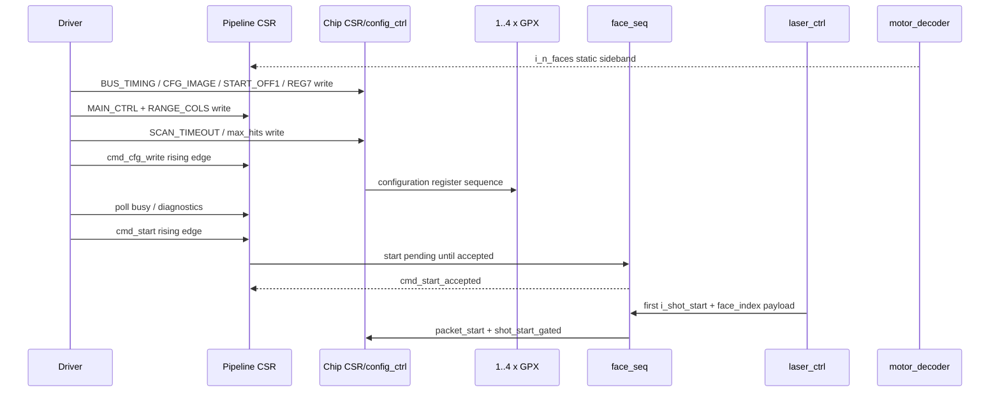

권장 절차:

1. 모든 reset을 assert한 뒤 clock 안정화
2. AXI/AXIS reset deassert
3. Chip CSR에 bus timing과 GPX config image 기록
4. Motor build의 `n_faces`와 TDC `HW_CONFIG[31:29]`가 같은지 확인하고 Pipeline CSR에 active mask, stops, range, cols 기록
5. Chip CSR에 `max_scan_5ns_ticks`, `max_hits_cfg` 기록
6. `cmd_cfg_write` rising edge 발생
7. `busy=0`, `err_fatal=0` 확인
8. CSR 설정으로 Rise/Fall HSIZE와 VSIZE를 미리 계산해 VDMA 준비
9. `cmd_start` rising edge 발생
10. start가 수락된 후 외부 laser controller가 Shot pulse 생성

첫 `packet_start` 전의 exported HSIZE/VSIZE는 새 CSR 설정의 Face snapshot이 아니다. 따라서 첫 VDMA buffer는 다음 산식으로 미리 설정한다.

```text
rise_lane_mask  = active_mask                                  // falling_enable=0
                = active_mask AND g_RISE_CHIP_MASK             // falling_enable=1
fall_lane_mask  = 0000                                         // falling_enable=0
                = active_mask AND g_FALL_CHIP_MASK             // falling_enable=1
cell_slots      = popcount(lane_mask) x stops_per_chip
cell_bytes      = 4 x (ceil(effective_max_hits / 2) + 1)
HSIZE           = 48 + align16(cell_slots x cell_bytes)
VSIZE           = cols_per_face
```

첫 Shot에서 snapshot된 뒤 exported geometry가 계산값과 같은지 확인한다. parent에 hardware VDMA programming logic이 있다면 `packet_start` 이후 3 AXIS clock의 settling과 첫 data beat까지의 제어 순서를 함께 검증한다.

`cmd_start_accepted`는 top 외부 포트나 published CSR bit가 아니라 내부 handshake이다. SW는 유효 설정을 사전 검증하고 `STAT5.busy`의 session-active 전환을 간접 확인하며, 정확한 acceptance cycle이 필요하면 parent debug port 또는 ILA로 `s_cmd_start_accepted`를 관측한다. `busy`는 Face 사이 `ST_WAIT_SHOT`에서도 high이므로 session 중 chip이 잠시 idle이라는 뜻으로 사용하면 안 된다.

### 10.2 정지와 복구

| 목적 | 명령 | 결과 |
|---|---|---|
| 정상 session 종료 | `cmd_stop` | chip acquisition은 현재 IFIFO를 가능한 한 drain하지만 AXIS pipeline은 현재 Face를 abort할 수 있음 |
| 파이프라인 상태 재초기화 | `cmd_soft_reset` | pending/sequence/FSM을 정리, 설정은 유지 의도 |
| 오류 이력 확인 후 삭제 | `AUX_CMD.err_soft_clear` | soft-clear 범주 sticky와 error cycle count 삭제 |
| chip-control 재초기화 시도 | `AUX_CMD.force_reinit` | bus가 외부적으로 안정된 경우에만 사용 |

`cmd_stop`이 `ST_CAPTURE`에서 들어오면 `chip_run`은 stop을 pending하고 `STOPDIS`를 활성화한 뒤 IrFlag를 기다려 정상 drain을 시도한다. IrFlag가 끝내 오지 않으면 fallback timeout cause `111`로 purge 경로에 진입한다. 이 graceful 동작의 목적은 GPX/bus를 정리하는 것이며 현재 Row/Face의 VDMA 보존을 보장하지 않는다. 같은 command가 `cell_pipe`, `face_assembler`, `header_inserter`에는 pipeline abort로 전달되고 header는 synthetic `TLAST` 없이 truncated line을 남길 수 있다.

완전한 마지막 Face가 필요하면 새 Shot 생성을 먼저 멈추고, 현재 활성화된 각 slope에서 해당 Face의 예상 line 수와 마지막 `TLAST` 수신을 확인한 뒤 chip이 Shot 사이 `ST_ARMED`인 구간에서 `cmd_stop`을 내린다. `i_stop_tdc`는 이 session-stop 명령을 대체하지 않는다.

---

## 11. Face/Shot sequencer

### 11.1 상태

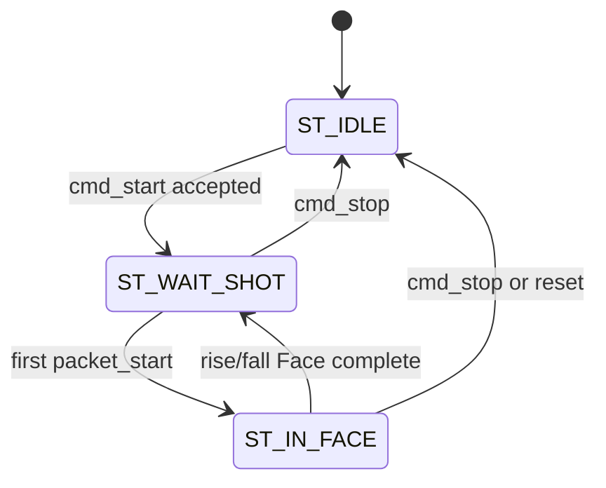

### 11.2 첫 Shot의 특수 처리

첫 `i_shot_start`는 동시에 다음 의미를 가진다.

1. Face 설정 snapshot을 시작하는 `packet_start`
2. `face_start` 생성의 원인
3. 실제 외부 trigger에 대응하는 내부 GPX acquisition bookkeeping을 시작할 첫 `shot_start_gated`

내부 register boundary 때문에 pulse는 몇 clock에 걸쳐 정렬되지만 동일한 첫 Shot 정체성을 유지한다.

```text
i_axis_aclk          _|‾|_|‾|_|‾|_|‾|_|‾|_
i_shot_start raw     ____|‾‾‾‾|____________   (길어도 edge 1회)
shot_raw_pulse       ____|‾|________________
packet_start         ______|‾|______________
face_start           ________|‾|____________
shot_start_gated     __________|‾|__________
```

정확한 cycle offset은 register 경계와 현재 상태에 따라 파형으로 확인하되, 기능 계약은 각 내부 event가 1-clock pulse라는 점이다.

`shot_start_gated`는 `chip_run`, Cell buffer, Row assembler가 같은 Shot 경계를 보도록 만드는 내부 event이다. 물리 GPX TStart는 top 밖에서 발생하며, 부모는 그 trigger와 `i_shot_start` 사이의 고정 지연/정렬을 시스템 timing contract로 관리해야 한다.

### 11.3 Shot deferral

- Face가 닫히는 경계에서 들어온 Shot edge는 1-depth deferred latch에 저장될 수 있다.
- 이미 deferred Shot이 있는 상태에서 추가 edge가 들어오면 `shot_drop_count`가 증가한다.
- 같은 입력 level이 여러 Shot으로 해석되지 않도록 raw input edge detection을 사용한다.

### 11.4 현재 top의 abort 배선과 latent Rise-primary 정책

`face_seq` entity 자체에는 다음 비대칭 정책이 구현되어 있다.

- Rise abort는 Rise와 Fall을 모두 중단한다.
- Fall-only abort는 Rise 출력을 중단하지 않는다.
- Face 종료 회계는 Fall ON이면 두 lane의 done 또는 해당 lane abort를 확인하고, Fall OFF이면 Fall lane을 이미 완료된 것으로 처리한다.

그러나 **현재 `tdc_gpx_top`에서는 `i_face_abort`, `i_face_fall_abort`를 모두 `'0'`에 고정**하고 `output_stage`의 `o_face_abort`도 `open` 처리한다. `face_assembler`는 missing/late slice를 blank-fill해 Row를 self-complete하므로 data-path overrun이 이 abort 입력으로 승격되지 않는다. 현재 합성 top에서 실제 pipeline abort 원인은 `cmd_stop`, `cmd_soft_reset`, `force_reinit` 같은 system command이다.

따라서 위 Rise-primary 비대칭은 `face_seq`의 latent 확장 정책이지 현재 top에서 slope별 data abort가 발생한다는 뜻이 아니다. 정상 Face 전환은 Fall ON일 때 Rise/Fall 양쪽의 실제 `frame_done`을 기다리고, Fall OFF일 때 Rise `frame_done`만 기다린다.

---

## 12. 한 Shot의 끝단간 데이터 흐름

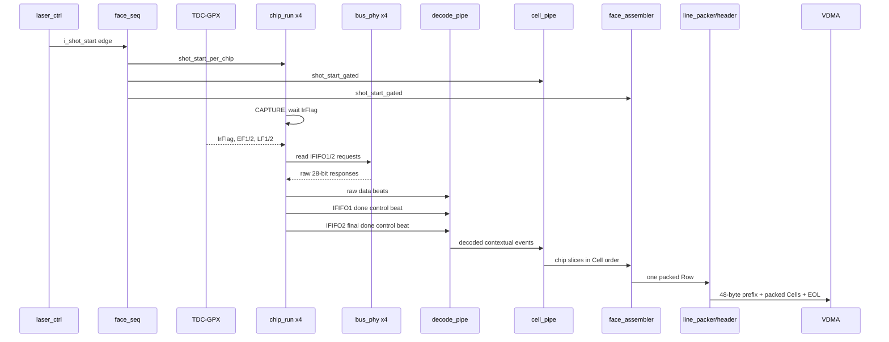

신호처리 관점의 인과관계:

1. Shot pulse가 Cell buffer와 Row assembler를 같은 shot 경계로 초기화한다.
2. Echo receiver는 GPX 입력 전단의 LVDS edge를 별도 진단할 수 있지만 이 drain 경로에는 개입하지 않는다.
3. GPX IrFlag가 capture 종료를 알리면 IFIFO drain이 시작된다.
4. `LF1/LF2`와 Reg6 Fill은 안전한 burst 크기를 고르는 힌트이고, 실제 수신된 bus response마다 drain count가 증가한다.
5. 정상 IFIFO 완료는 GPX `EF1/EF2`가 결정한다. cap에 도달했는데 EF가 낮으면 출력은 fault 처리되고 물리 tail은 purge된다.
6. IFIFO1 완료 marker는 Cell의 앞쪽 stop 출력 시작을 허용한다.
7. IFIFO2 최종 완료 marker가 전체 chip slice를 닫는다.
8. 활성 chip 결과는 논리 chip 번호 오름차순으로 한 Row가 된다. 물리 lane이 compact여도 metadata chip ID와 Row 순서는 바뀌지 않는다.
9. Row마다 48바이트 prefix를 붙여 VDMA line을 만든다.

---

## 13. Echo 관측과 GPX FIFO 소유권

### 13.1 두 카운트가 같다고 가정할 수 없는 이유

Echo receiver는 LVDS 입력을 single-ended pulse로 바꾸어 TDC-GPX의 Stop 입력으로 전달하고, 전단에서 관측한 rising/falling edge 수를 셀 수 있다. 그러나 그 뒤에 있는 GPX가 각 pulse를 유효 Stop으로 받아 어느 IFIFO에 실제 저장했는지는 알 수 없다.

```text
optical echo
    -> LVDS receiver / edge counter       (전단 관측치)
    -> GPX Stop input and internal logic
    -> GPX IFIFO1/2 stored words          (GPX 소유 상태)
```

두 값은 GPX 설정, Stop disable, dead time, 입력 timing, 전기적 품질, 내부 overflow/error 때문에 달라질 수 있다. 따라서 Echo edge count는 광학/배선 진단에는 유용하지만 IFIFO read 종료 조건이나 hard bound가 될 수 없다. 현재 RTL은 이 잘못된 결합을 제거했고 `tdc_gpx_top` 포트에도 Echo count stream이 존재하지 않는다.

### 13.2 drain 판단 신호의 역할

| 신호/값 | 실제 의미 | drain에서의 권한 |
|---|---|---|
| `IrFlag` | GPX capture/measurement 종료 | drain 시작 조건 |
| `EF1`, `EF2` | 해당 GPX IFIFO가 empty | **정상 완료의 최종 권한** |
| `LF1`, `LF2` | load flag가 보장하는 데이터 존재 구간 | burst 후보 선택 힌트 |
| Reg6 `Fill` | LF 구간에서 안전하게 읽을 burst word 수 | burst 길이 힌트 |
| accepted bus response | GPX에서 실제 반환된 28-bit word | 출력된 drain count 증가 |
| `n_drain_cap` | IFIFO별 최대 출력 word 보호 경계, 실제 값은 `4 x field` | truncation 검출, empty 증거 아님 |
| Echo edge count | GPX 입력 전단 관측치 | 외부 진단 전용, drain 제어권 없음 |

`n_drain_cap`에 도달했는데 해당 EF가 여전히 낮으면 RTL은 “FIFO가 비었다”고 간주하지 않는다. bounded output을 닫고 fault를 기억한 뒤 남은 물리 IFIFO tail을 purge하여 다음 Shot과 섞이지 않게 하며, 최종 control beat에 `faulted=1`을 전달한다. 즉 cap은 성능 설정이면서 동시에 데이터 truncation을 드러내는 보호 장치이다.

### 13.3 거리와 처리 window

`max_range_5ns_ticks`는 항상 5 ns 기준이다.

```text
physical_range_window = max_range_5ns_ticks x 5 ns
local_axis_clocks      = ceil(physical_range_window x g_AXIS_CLK_MHZ / 1000)
local_tdc_clocks       = ceil(physical_range_window x g_TDC_CLK_MHZ  / 1000)
tdc_drain_margin_clks  = ceil(g_DRAIN_MARGIN_TIME_NS x g_TDC_CLK_MHZ / 1000)
tdc_total_budget_clks  = min(65535, local_tdc_clocks + tdc_drain_margin_clks)
```

`local_tdc_clocks`는 레이저 측정 window 자체이고, `tdc_total_budget_clks`는 GPX의 동기화된 `IrFlag` 이후 물리 IFIFO drain까지 허용하는 총 획득 예산이다. `i_stop_tdc`가 `IrFlag`보다 먼저 도착하면 측정 종료 순서가 맞지 않으므로 `sequence_error`가 발생한다. 반대로 `IrFlag`가 먼저 확인된 뒤 drain/ALU 중 `i_stop_tdc`가 도착하는 것은 정상 순서이며 오류가 아니다.

TDC-domain 변환값은 capture/drain watchdog에, AXIS-domain 변환값은 Cell DROP/QUARANTINE watchdog에 사용된다. Echo receiver가 자체 관측 window를 필요로 한다면 그 모듈에서 별도로 정의해야 하며, `tdc_gpx_top`의 IFIFO 완료 조건에 합치지 않는다.

Shot 주기는 `max_range`, 실제 광 왕복시간, GPX drain/ALU 시간, 출력 backpressure를 함께 만족해야 한다. `max_range=0`은 거리 기반 watchdog 비활성 의미이지만 내부 legacy hard cap까지 무한대로 만드는 것은 아니다.

---

## 14. GPX chip-control 경로

### 14.1 `chip_ctrl` 상위 phase

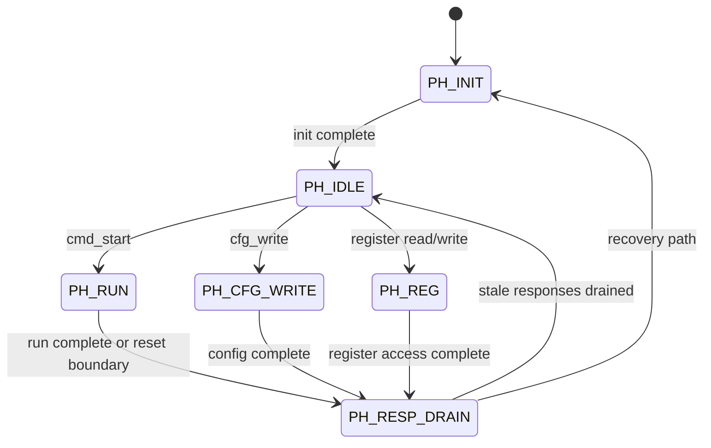

`chip_ctrl`의 `PH_IDLE`에서 여러 명령이 같은 cycle에 충돌하면 구현 우선순위는 `start > cfg_write > register read > register write`이며 collision sticky를 남긴다. `cmd_arb`가 정상 동작하면 이런 동시 도착은 없어야 하므로 sticky가 보이면 낮은 우선순위 명령만 재시도하기보다 명령 중재/CDC 계약부터 조사한다. 정상 driver는 명령을 직렬화해야 한다.

`PH_RESP_DRAIN`은 이전 operation의 늦은 bus response가 다음 operation으로 잘못 귀속되는 것을 막는다. bus가 끝까지 안정되지 않으면 quarantine/fatal 상태로 이어질 수 있다.

### 14.2 `chip_run` 상태

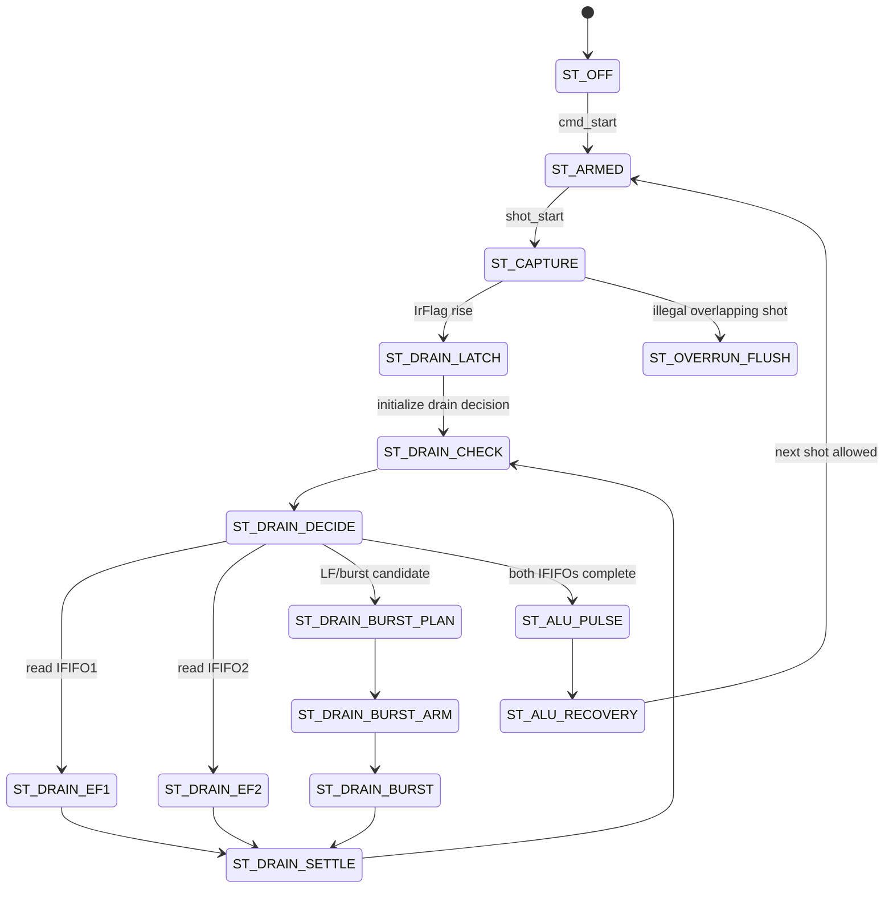

실제 FSM에는 `ST_DRAIN_FLUSH`도 존재하며 stop/timeout/purge 경로에서 사용된다.

### 14.3 drain 완료 판단

각 IFIFO1/IFIFO2의 **정상 물리 완료**는 동기화된 EF가 empty를 가리킬 때 성립한다.

```text
normal_done = EF_sync == empty

cap_hit = n_drain_cap != 0
          AND drained_count >= 4 x n_drain_cap
          AND EF_sync != empty
```

`cap_hit`은 해당 IFIFO의 downstream 출력을 더 늘리지 않기 위한 bounded-output 조건이다. 양쪽 bounded output을 닫은 뒤 EF가 낮은 IFIFO는 purge mode에서 실제 empty까지 읽어 버리고, 최종 marker를 faulted로 만든다. `LF/Fill`은 burst 최적화에만 사용되며 완료를 선언하지 않는다.

### 14.4 중간/최종 control beat

- IFIFO1 완료: `ififo_id=0`, `drain_done=1` control beat
- IFIFO2 최종 완료: `ififo_id=1`, `drain_done=1` control beat
- cap-triggered truncation/purge이면 final marker의 `faulted=1`

`o_run_drain_complete`는 chip_run 내부 drain 완료 시점이고, `o_drain_done`은 final control beat가 downstream handshake된 시점이다. 두 신호는 의미가 다르다.

### 14.5 timeout cause

| 코드 | 원인 |
|---:|---|
| `001` | raw output busy |
| `010` | IFIFO1 response wait |
| `011` | IFIFO2 response wait |
| `100` | burst response wait |
| `101` | flush response wait |
| `110` | overrun flush |
| `111` | capture-stop fallback, IrFlag 미도착 |

`max_range_tdc_clks=0`이면 shot watchdog cap은 `0xFFFF` fallback을 사용한다. 0은 무한대가 아니라 “거리 기반 cap 비활성 + legacy 최대 cap”이다.

### 14.6 raw FIFO와 control beat 보존

`chip_ctrl` 내부 raw FIFO는 data beat와 IFIFO 완료 control beat를 같은 경로로 보낸다. 현재 credit 정책의 핵심은 다음과 같다.

- 물리 깊이: 8 entries
- 일반 data admission limit: 6 entries
- upstream busy를 미리 거는 기준: 약 4 entries
- 남은 여유는 이미 발행된 bus response와 IFIFO 완료 control beat를 보존하는 데 사용
- control beat가 data beat보다 우선

이 예약 credit이 깨져 raw/control beat가 유실되면 Cell builder는 Shot 경계를 닫지 못할 수 있다. 따라서 `raw_drop_mask`, legacy `raw_overflow`, final drain marker, quarantine sticky를 함께 확인한다.

---

## 15. GPX 병렬 bus timing

`tdc_gpx_bus_phy`는 1 transaction을 `bus_ticks`개의 tick으로 수행한다.

```text
tick index       0             1 ... N-2             N-1
phase            A             L                     H
ADR/DATA         setup         hold                  hold
RDN or WRN       high          low                   high
READ sample                    ... sample at N-2
response valid                                        assert
```

`tick_en` 주기는 `bus_clk_div`로 정한다. 200 MHz 기준 read capture 지연은 다음이다.

```text
capture_delay_from_RDN_low
  = ((bus_ticks - 3) x bus_clk_div + 1) x T_tdc_clk
```

200 MHz에서 합법적인 핵심 조합:

| divider | ticks | capture delay | read rate | 판정 |
|---:|---:|---:|---:|---|
| 1 | 4 | 10 ns | 50 MHz | 금지, data-valid 여유 부족 |
| 1 | 5 | 15 ns | 40 MHz | 허용, 가장 빠름 |
| 2 | 4 | 15 ns | 25 MHz | 허용 |
| 2 | 5 | 25 ns | 20 MHz | 기본값 |

안전 불변조건:

1. WRITE 중 GPX OEN은 high여야 한다.
2. READ 중 FPGA D-bus는 Hi-Z여야 한다.
3. IDLE 중 D-bus는 Hi-Z여야 한다.
4. WRITE->READ와 READ->WRITE 사이 turnaround gap을 보장한다.
5. `i_oen_permanent=1` drain 동작 중 WRITE는 금지한다.

generic과 divider를 바꿀 때는 단순 시뮬레이션뿐 아니라 보드 I/O delay와 GPX 데이터시트 timing을 다시 닫아야 한다.

---

## 16. Raw word부터 contextual event까지

### 16.1 GPX I-Mode 28비트 word

| 비트 | 필드 | 의미 |
|---|---|---|
| `[27:26]` | `ChaCode` | 해당 IFIFO 내 channel 0..3 |
| `[25:18]` | `StartNum` | SINGLE_SHOT에서 reserved/0 |
| `[17]` | `Slope` | edge 방향, 1=Rise, 0=Fall |
| `[16:0]` | `Hit` | Stop-Start raw bin count |

local stop ID는 다음처럼 재구성된다.

```text
stop_id[2:0] = ififo_id & ChaCode[1:0]

IFIFO1: stop 0..3
IFIFO2: stop 4..7
```

### 16.2 `chip_ctrl -> decoder_i_mode`

| 신호 | data beat | control beat |
|---|---|---|
| `tdata[27:0]` | raw GPX word | 0 |
| `tuser[0]` | IFIFO ID | IFIFO ID |
| `tuser[5]` | 0 | faulted |
| `tuser[7]` | 0 | drain_done=1 |

### 16.3 `decoder_i_mode -> raw_event_builder`

| 필드 | 의미 |
|---|---|
| `tdata[16:0]` | raw Hit |
| `tuser[0]` | slope |
| `tuser[2:1]` | raw ChaCode |
| `tuser[5:3]` | local stop ID |
| `tuser[6]` | IFIFO ID |
| `tuser[7]` | drain_done |

control beat에서는 `tuser[5]`가 faulted로 재사용된다. `tuser[7]=1`이 data/control을 구분하므로 해석 충돌은 없다.

### 16.4 `raw_event_builder -> cell_pipe`

| 필드 | 의미 |
|---|---|
| `tdata[16:0]` | raw Hit |
| `tuser[0]` | slope |
| `tuser[2:1]` | chip ID |
| `tuser[5:3]` | local stop ID |
| `tuser[6]` | IFIFO ID |
| `tuser[7]` | drain_done |
| `tuser[10:8]` | stop별 hit sequence 0..7 |
| `tuser[15:11]` | global shot sequence 하위 5비트 |

stop ID가 `stops_per_chip` 이상이면 해당 event는 폐기되고 chip별 `stop_id_error` pulse가 발생한다.

IFIFO1 done은 hit sequence counter를 초기화하지 않는다. IFIFO2 final done에서 모든 stop counter를 초기화한다. hit sequence는 slope별이 아니라 **같은 stop에서 Rise/Fall이 공유**한다.

다만 `cell_builder`는 `tuser[10:8]`을 RAM write address로 사용하지 않는다. slope demux 뒤의 Rise/Fall builder가 각각 자신의 `hit_count_actual`로 수신 event를 0번 slot부터 연속 재색인한다. 따라서 같은 chip이 두 generic mask에 포함된 dual-edge 구성에서도 Rise Cell과 Fall Cell의 저장 slot/count/max_hits 판정은 서로 독립적이고, raw-event의 shared `hit_seq_local`은 파형에서 원래 chip stream 순서를 추적하는 context tag이다.

---

## 17. Cell builder

### 17.1 Cell 정의

Cell 하나는 다음 좌표를 가진다.

```text
Cell = (shot, slope, chip, stop)
```

Cell은 `max_hits`개의 16비트 hit slot과 17번째 bit를 보존하는 metadata를 가진다. GPX raw Hit `H[16:0]`는 다음처럼 분리된다.

```text
slot data       = H[15:0]
metadata msb[i] = H[16]
```

따라서 metadata를 무시하면 17비트 시간을 16비트로 잘못 해석하게 된다.

### 17.2 dual-buffer 소유권

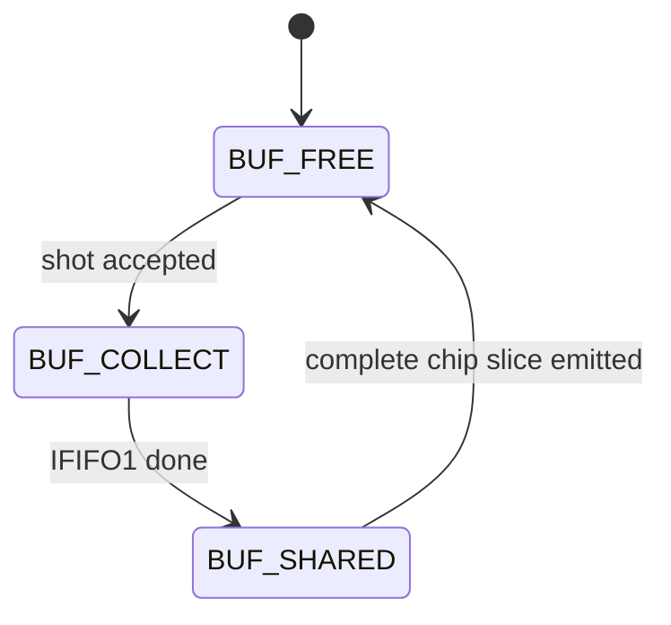

`BUF_SHARED`에서는 output process가 stop 0..3을 읽는 동안 collect process가 stop 4..7을 계속 쓸 수 있다. 이 구조가 IFIFO1 조기 출력과 Shot overlap 흡수의 핵심이다.

### 17.3 collect FSM

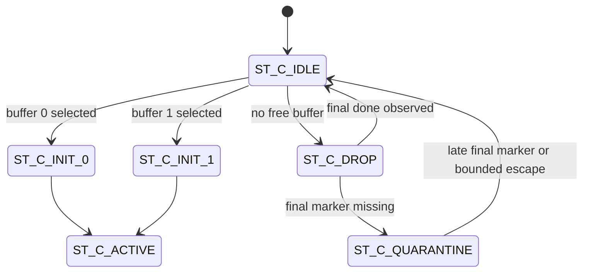

두 buffer가 모두 사용 중이면 upstream을 막는 대신 해당 Shot 전체를 흡수하며 폐기한다. 최종 drain marker가 없으면 quarantine에 들어가 stale beat를 흡수한다. 현재 RTL에는 bounded escape와 chip별 sticky가 있으므로 과거 문서의 “영구 quarantine” 설명과 다르다.

### 17.4 output FSM

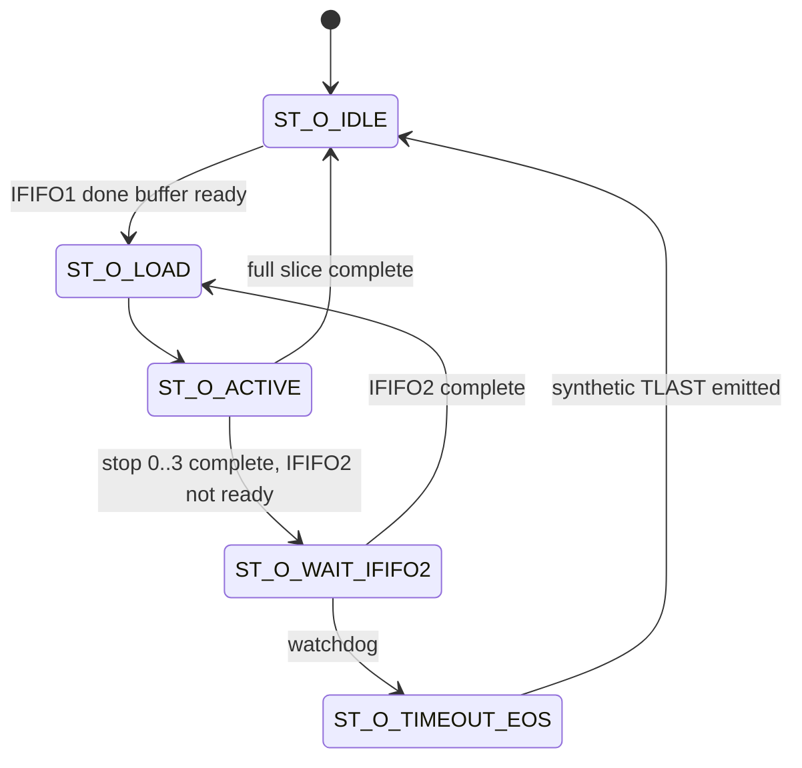

IFIFO2가 오지 않으면 synthetic zero beat와 `TLAST=1`, fault indication을 보내 downstream Row가 영구 대기하지 않게 한다.

### 17.5 Cell metadata 32비트 word

| 비트 | 필드 | 의미 |
|---|---|---|
| `[31:25]` | `hit_valid[6:0]` | 각 slot 유효 여부 |
| `[24:18]` | `slope_vec[6:0]` | slot별 slope |
| `[17:16]` | reserved | 0 |
| `[15:12]` | `hit_count_actual` | 저장된 유효 hit 수, `effective max_hits`에서 cap |
| `[11]` | `hit_dropped` | 해당 Cell에서 max_hits를 초과한 hit가 있었음 |
| `[10]` | `error_fill` | 합성 blank/error Cell |
| `[9:8]` | `chip_id` | Cell 출처 |
| `[7]` | reserved | 0 |
| `[6:0]` | `hit_msb_vec` | 각 Hit의 원래 bit16 |

Cell parse 순서:

```text
for each cell:
    read ceil(max_hits / 2) x 32-bit hit words
    read 1 x 32-bit metadata word
```

odd max_hits의 마지막 32비트 hit word에서 남는 상위 16비트 slot은 padding이며 `hit_valid`를 기준으로 무시한다.

---

## 18. Face assembler와 Row 보존 정책

### 18.1 strict chip order

각 slope assembler는 활성 chip을 `chip0 -> chip1 -> chip2 -> chip3` 순서로 출력한다. 비활성 chip은 건너뛴다. 결과적으로 DDR에서 Cell 순서는 다음과 같다.

```text
chip0 stop0..N-1,
chip1 stop0..N-1,
chip2 stop0..N-1,
chip3 stop0..N-1
```

단, 해당 slope의 lane mask에 속한 chip만 존재한다.

### 18.2 상태

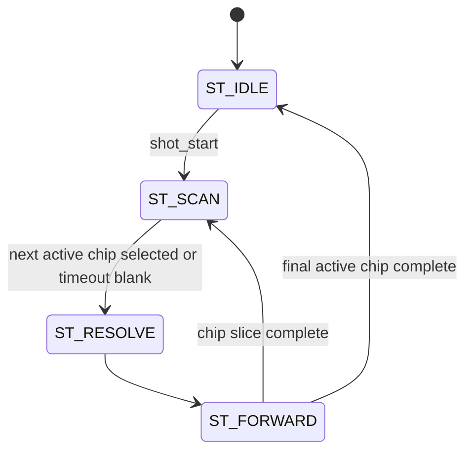

### 18.3 blank-fill 원칙

Row 크기를 일정하게 유지하는 것이 우선 정책이다.

- chip 데이터가 `max_scan_5ns_ticks × 5 ns`까지 오지 않으면 해당 chip Cell을 blank로 생성한다.
- `max_scan_5ns_ticks=0`은 programmable timeout 비활성이지만 16비트 hard cap `0xFFFF`는 남는다.
- 현재 Row가 끝나기 전에 새 Shot이 오면 남은 부분을 blank-fill하여 기존 Row의 정확한 크기와 `TLAST`를 보존한다.
- 다음 Shot은 pending되어 다음 line으로 처리된다.
- `error_fill`, chip error mask, row fault pulse/sticky로 degraded Row임을 표시한다.

`o_face_abort`는 현재 항상 0인 deprecated 포트이다. 실제 overrun 복구는 Face 전체를 abort하기보다 Row를 self-complete하는 blank-fill 방식이다.

### 18.4 Shot 경계 FIFO 정책

Shot 경계의 모든 FIFO가 같은 방식으로 reset되는 것은 아니다. 데이터의 **귀속**과 이미 조립된 Row의 **보존**을 분리하기 위해 다음 두 정책을 사용한다.

| 경계 | `shot_start` 동작 | 목적/관측 |
|---|---|---|
| `face_assembler`의 chip별 입력 FIFO | 매 Shot flush | 이전 Shot의 늦은 chip-slice를 새 Row에 섞지 않음; 남은 valid가 있으면 `shot_flush_drop`와 chip mask가 sticky로 남음 |
| `face_assembler` 내부 출력 FIFO | occupancy=0이고 같은 cycle write가 없을 때만 reset pulse 허용 | 이미 조립된 이전 Row beat와 `TLAST` 보존 |
| `output_stage`의 slope별 Face FIFO | occupancy=0이고 같은 cycle write가 없을 때만 reset pulse 허용 | VDMA backpressure 중 이전 line tail 보존 |
| 명시적 pipeline abort | 관련 FIFO reset/flush 허용 | 현재 Face 보존보다 command 경계 복구를 우선 |

출력 FIFO의 occupancy guard는 CHAIN-P0-01 수정의 핵심이다. 과거처럼 mid-Face `shot_start`에서 출력 FIFO를 무조건 reset하면 VDMA `TREADY=0` 구간에 남아 있던 이전 line의 beat와 `TLAST`가 사라져 `line_packer`와 header column count가 어긋난다. 반대로 chip별 입력 FIFO flush는 늦은 이전-Shot slice를 의도적으로 폐기하는 정상 정책이므로, 두 reset을 같은 종류의 데이터 손실로 해석하면 안 된다.

---

## 19. Canonical line packing과 VDMA

### 19.1 Cell byte 수

```text
hit_words_per_cell   = ceil(effective_max_hits / 2)
canonical_cell_bytes = 4 x (hit_words_per_cell + 1 metadata word)
```

| effective max hits | hit words | metadata words | Cell bytes |
|---:|---:|---:|---:|
| 1 | 1 | 1 | 8 |
| 2 | 1 | 1 | 8 |
| 3 | 2 | 1 | 12 |
| 4 | 2 | 1 | 12 |
| 5 | 3 | 1 | 16 |
| 6 | 3 | 1 | 16 |
| 7 또는 0 | 4 | 1 | 20 |

### 19.2 lane geometry

```text
lane_cell_slots = popcount(lane_chip_mask) x stops_per_chip
line_data_bytes = lane_cell_slots x canonical_cell_bytes
HSIZE            = 48 + align16(line_data_bytes)
VSIZE            = cols_per_face
STRIDE           = HSIZE     // tight packing
```

48바이트 prefix가 이미 16바이트 정렬이므로 구현상 전체 line은 48바이트 prefix와 16바이트 정렬된 Cell data로 구성된다.

### 19.3 예제

기본 split build `P1111/R0011/F1100`, Fall ON, slope당 chip 2개, stops=8, max_hits=7:

```text
Cell slots = 2 x 8 = 16
Cell data  = 16 x 20 = 320 B
HSIZE      = 48 + align16(320) = 368 B
```

출력 폭별 accepted beat 수:

| 폭 | bytes/beat | beats/line |
|---:|---:|---:|
| 32 | 4 | 92 |
| 64 | 8 | 46 |
| 128 | 16 | 23 |

같은 bitstream에서 Fall OFF 또는 정적 Rise-only build `P1111/R1111/F0000`, 4 Rise chips, stops=8, max_hits=7:

```text
Cell slots = 4 x 8 = 32
HSIZE      = 48 + align16(32 x 20) = 688 B
```

`p_vdma_geometry`는 Face snapshot 값을 세 단계 register로 계산한다. 1단계에서 slot/hit/VSIZE를 포착하고, 2단계에서 payload block 수를 계산하며, 3단계에서 header block을 더해 정렬된 HSIZE/VSIZE를 출력한다. 따라서 새 Face snapshot 후 HSIZE/VSIZE가 안정되기까지 약 3 AXIS clocks를 허용한다. 활성 Face 동안에는 안정적으로 유지된다.

`face_seq`에도 이름이 비슷한 `o_rows_per_face`, `o_hsize_bytes`가 남아 있지만 이는 full active mask 기준 legacy reference이고 top에서는 둘 다 `open`이다. VDMA의 authoritative contract는 top이 slope lane mask로 계산한 `o_vdma_hsize_bytes_rise/fall`과 `o_vdma_vsize_lines`이다. split topology에서 legacy full-mask 값으로 VDMA를 설정하면 lane당 Cell 수를 두 배로 해석할 수 있다.

### 19.4 line layout

```text
offset 0
  +------------------------+
  | 48-byte prefix         |  every line
  | line 0: actual header  |
  | line 1+: all zeros     |
  +------------------------+
  | Cell 0 hit words       |
  | Cell 0 metadata        |
  | Cell 1 hit words       |
  | Cell 1 metadata        |
  | ...                    |
  +------------------------+
  | 0..12 byte line pad    |
  +------------------------+ HSIZE / TLAST
```

`line_packer`는 64/128비트 Cell builder beat에 있던 per-Cell padding을 제거하고 의미 있는 32비트 word를 Cell 경계 너머로 이어 붙인다. padding은 line 끝의 16바이트 alignment에서만 생긴다.

---

## 20. 48바이트 Face header

header는 little-endian 32비트 word 12개이다. line 0에만 실제 값이 있고 line 1 이후 48바이트 prefix는 0이다.

| Word | Offset | 내용 |
|---:|---:|---|
| 0 | `0x00` | magic `0x47434454`, 메모리 byte로 `T D C G` |
| 1 | `0x04` | VDMA frame ID |
| 2 | `0x08` | scan frame ID, 현재 reserved 0 |
| 3 | `0x0C` | face ID, lane mask, n_faces, stops, drain cap, header modes |
| 4 | `0x10` | `[15:0] Cell slots/line`, `[31:16] lines/Face` |
| 5 | `0x14` | max_hits, Cell bytes, hit slot width, chip/stops capacity |
| 6 | `0x18` | shot sequence start, bin resolution ps |
| 7 | `0x1C` | start_off1, Cell format, pre-Face chip error mask |
| 8 | `0x20` | k_dist_fixed |
| 9 | `0x24` | timestamp low |
| 10 | `0x28` | timestamp high |
| 11 | `0x2C` | pre-Face error-cycle count snapshot |

Word 3 bit 구성:

| 비트 | 필드 |
|---|---|
| `[7:0]` | face ID |
| `[11:8]` | 해당 lane chip mask |
| `[14:12]` | n_faces |
| `[18:15]` | stops_per_chip |
| `[22:19]` | n_drain_cap |
| `[23]` | pipeline_en, header-only |
| `[25:24]` | hit_store_mode, header-only |
| `[28:26]` | dist_scale, header-only |
| `[29]` | drain_mode |
| `[30]` | Hit bit16 metadata 지원 표시 |
| `[31]` | 해당 Face snapshot의 falling_enable |

Word 3의 face ID는 `laser_ctrl`이 `i_shot_start`와 함께 보낸 `i_shot_face_index`에서 오며, `n_faces`는 motor의 정적 `i_n_faces`에서 온다. 두 값은 Face 시작 시 함께 snapshot되므로 software가 별도의 TDC CSR face counter를 맞출 필요가 없다. `face_index >= n_faces`는 통합 연결 오류로 간주해야 한다.

Word 5 bit 구성:

| 비트 | 필드 |
|---|---|
| `[7:0]` | 현재 Face에 적용된 effective max hits |
| `[15:8]` | 해당 max hits의 canonical Cell bytes |
| `[23:16]` | hit slot data width, 현재 16 |
| `[27:24]` | `popcount(g_PRESENT_CHIP_MASK)` build chip 수 |
| `[31:28]` | `g_MAX_STOPS_PER_CHIP` build 상한 |

헤더의 error 정보는 `face_start` 시점 snapshot이다. 현재 Face drain 중 새로 발생한 오류는 다음 Face header, Cell metadata 또는 CSR status에서 확인해야 한다.

> 포트와 내부 신호 이름은 `timestamp_ns`이지만 현재 구현은 `i_axis_aclk`마다 1씩 증가하는 **clock-cycle counter**이다. 실제 ns가 아니다. 시간으로 바꾸려면 `timestamp_seconds = counter / f_axis`를 사용한다.

---

## 21. raw Hit와 거리 변환

### 21.1 현재 저장값

현재 output Cell에는 다음 값이 저장된다.

```text
raw_hit_17 = (metadata.hit_msb_vec[i] << 16) | hit_slot[i]
```

`hit_store_mode=CORRECTED` 또는 `DISTANCE`로 설정해도 현재 RTL의 Cell 데이터는 달라지지 않는다. 그 필드는 header word 3에만 기록된다.

### 21.2 후단에서 필요한 개념적 처리

실제 보정식은 GPX 설정과 시스템 calibration 정의에 따라 부모 설계에서 확정해야 한다. 일반적인 처리 단계는 다음과 같다.

```text
raw_hit_17
   -> offset / wrap / calibration correction
   -> corrected_bin
   -> time_ps = corrected_bin x bin_resolution_ps
   -> one_way_distance = c x time / 2
   -> requested engineering unit scaling
```

`start_off1`은 `tdc_gpx_cfg_image_override`에서 GPX configuration image의 Reg5 `[17:0]`에 반영되고 Face header에도 기록된다. 따라서 GPX 내부 측정값에 미치는 효과는 GPX 데이터시트의 Reg5 의미를 따라야 한다. 그러나 FPGA의 Cell datapath에는 `raw_hit - start_off1` 같은 별도 subtractor가 없다. 후단이 `start_off1`을 다시 적용할지는 시스템 calibration 계약으로 정해 이중 보정을 피해야 한다.

`start_off1`의 부호/후단 적용 방향과 `k_dist_fixed`의 Q-format은 현재 `tdc_gpx_top`이 정의하지 않는다. 인터페이스 문서 없이 임의로 다음과 같은 계산을 FPGA RTL 동작이라고 단정하면 안 된다.

```text
distance = raw_hit x k_dist_fixed   // 현재 RTL에 없음
raw_hit  = raw_hit - start_off1     // 현재 Cell datapath에 없음
```

후단 parser는 header에 기록된 calibration metadata와 별도의 버전 계약을 사용해야 한다.

---

## 22. AXI4-Stream handshake와 backpressure

모든 stream 전송은 다음 조건에서만 발생한다.

```text
transfer = TVALID AND TREADY
```

```text
clk       _|‾|_|‾|_|‾|_|‾|_|‾|_
TVALID    ____|‾‾‾‾‾‾‾|________
TREADY    ____|‾|_____|‾|________
transfer  ____|‾|_____|‾|________
TDATA     ==== A ===== A ==========  // stall 중 안정
```

핵심 규칙:

- `TVALID=1, TREADY=0`이면 source는 payload와 sideband를 유지한다.
- `TLAST`는 handshake된 때에만 line 종료로 계산한다.
- output sink가 stall하면 line packer/header/FIFO를 거쳐 상류로 pressure가 전달된다.
- mid-Face Shot 경계에서도 이미 출력 FIFO에 수락된 이전 line beat는 occupancy guard로 보존된다. 다만 assembler **입력** FIFO의 이전-Shot tail은 귀속 정합성을 위해 flush될 수 있다.
- Cell builder는 두 buffer로 일부 overlap을 흡수하지만 무한정 흡수하지 못한다.
- buffer가 부족하면 Shot drop, assembler가 늦으면 blank-fill, header final beat가 막히면 watchdog escape가 발생할 수 있다.

따라서 평균 대역폭뿐 아니라 최악 stall 길이를 검증해야 한다.

### 22.1 최소 출력 대역폭 예산

```text
bytes_per_face_per_lane = HSIZE_lane x cols_per_face
average_lane_Bps        = HSIZE_lane x shot_rate
both_lanes_Bps          = (HSIZE_rise + HSIZE_fall) x shot_rate
```

프로토콜 overhead, VDMA burst 효율, DDR arbitration, software cache/buffer 전환 여유를 별도로 더해야 한다.

### 22.2 Shot period 하한의 구성

```text
T_shot_min >= max(
    optical round-trip and echo window,
    GPX capture + IFIFO drain + ALU recovery,
    Cell dual-buffer reuse time,
    Row/output/VDMA worst-case service time
)
```

이 부등식을 만족하지 않으면 단순 데이터 유실뿐 아니라 Shot 간 귀속 오류가 생길 수 있다.

---

## 23. 오류 처리 아키텍처

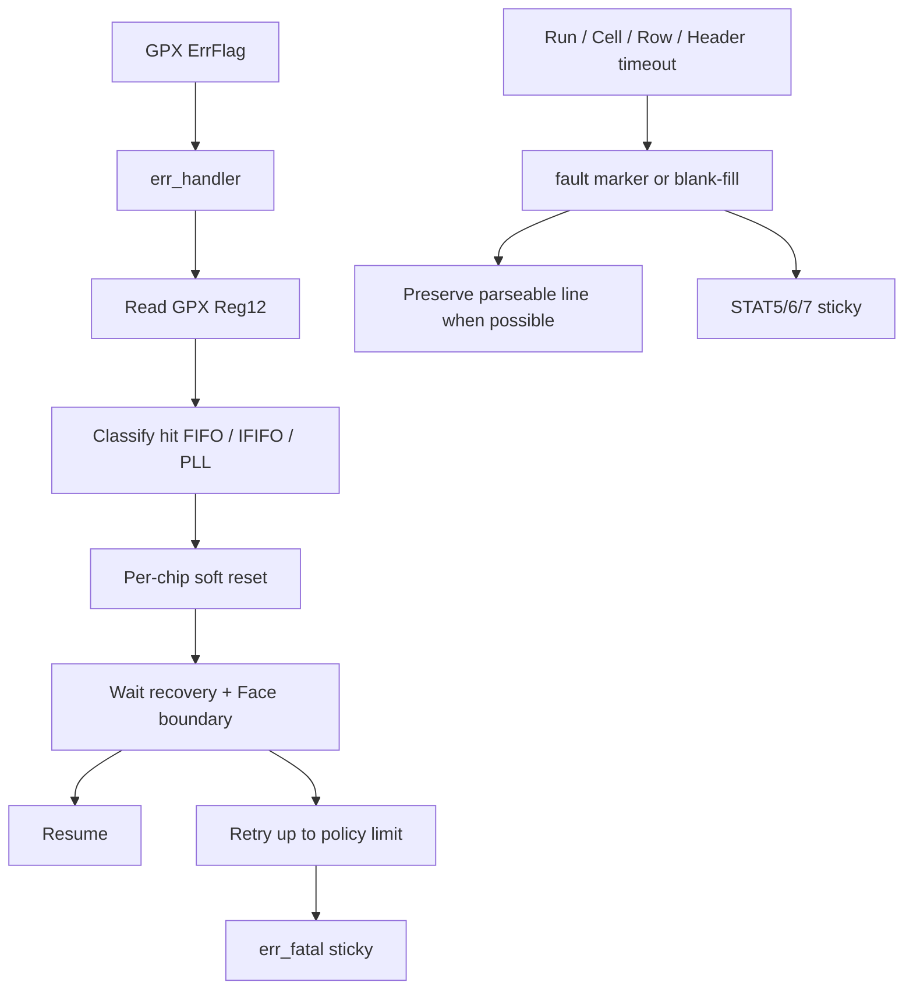

`err_handler` 상태는 대략 다음 순서이다.

```text
IDLE -> READ_REG12 -> WAIT_READ -> RECOVERY -> WAIT_RECOVERY
     -> WAIT_FRAME_DONE -> IDLE or retry/fatal
```

과거 이름 일부에는 `reg11` 흔적이 있지만 현재 classification read는 Reg12이다.

오류 중에도 parser가 line 경계를 잃지 않도록 다음 정책을 사용한다.

| 위치 | 오류 | 데이터 경로 대응 |
|---|---|---|
| chip_run | drain mismatch/timeout | final control beat에 fault, timeout status |
| cell_builder | IFIFO2 미도착 | synthetic zero TLAST, slice timeout |
| cell_builder | buffer 없음 | Shot 전체 absorb/drop, quarantine |
| face_assembler | chip slice 미도착 | 정해진 수의 blank Cell 생성 |
| face_assembler | 새 Shot overlap | 현재 Row 나머지를 blank-fill |
| header | final beat sink stall | bounded escape, frame fault/truncation sticky |

---

## 24. Software-visible status

### 24.1 STAT5 `0x54`

| 비트 | 필드 | 해석 |
|---|---|---|
| `[0]` | busy | sequencer/chip/FIFO/output/reg transaction 중 하나라도 active |
| `[1]` | pipeline_overrun | Rise 또는 Fall assembler overrun level |
| `[2]` | err_fatal | err_handler 실패 또는 bus fatal fold |
| `[7:4]` | chip_error_mask | chip별 live/raw 오류 |
| `[11:8]` | drain_timeout_mask | chip별 sticky |
| `[15:12]` | sequence_error_mask | chip별 sticky |

### 24.2 STAT6 `0x58`

| 비트 | 필드 |
|---|---|
| `[0]` | err_read_timeout |
| `[1]` | reg_rejected |
| `[2]` | reg_zero_mask |
| `[3]` | Rise shot flush drop |
| `[4]` | Fall shot flush drop |
| `[5]` | Rise header drain timeout |
| `[6]` | Fall header drain timeout |
| `[7]` | error-handler frame wait escape |
| `[11:8]` | Rise overrun count low nibble |
| `[15:12]` | chip별 shot flush drop mask |
| `[19:16]` | Fall overrun count low nibble |
| `[23:20]` | chip command collision mask |
| `[27:24]` | chip register queue overflow mask |
| `[31:28]` | current-shot run drain-complete mask |

### 24.3 STAT7 `0x5C`

| 비트 | 필드 |
|---|---|
| `[3:0]` | register timeout mask |
| `[7:4]` | stop ID error mask |
| `[10:8]` | most recent run timeout cause |
| `[14:11]` | Cell quarantine escape mask |
| `[15]` | masked-slope hit drop 발생 여부 |
| `[19:16]` | Rise face-start collapsed count low nibble |
| `[23:20]` | Reserved, read as zero (기존 ABI 위치 유지) |
| `[27:24]` | Fall face-start collapsed count low nibble |
| `[31:28]` | init config-write coalesced mask |

모든 내부 diagnostic이 CSR에 노출되는 것은 아니다. `t_tdc_status` record에는 더 많은 원인별 mask가 있지만 8개 pipeline status register에 모두 packing되지 않는다. 세부 원인 분석에는 simulation waveform 또는 ILA가 필요할 수 있다.

### 24.4 status 해석 주의

- `error_cycle_count`는 모든 sticky가 유지된 시간도, 정확한 오류 event 총수도 아니다. 아래 source 중 하나 이상이 관측된 **AXIS cycle 수**이며 같은 cycle의 동시 오류는 1로 합쳐진다.
  `stop_id_error`, Rise/Fall `hit_dropped`, active-chip `drain_timeout`, active-chip `sequence_error`, `chip_error_merged` 상승 edge가 count source이다.
- counter의 low nibble만 노출되는 필드는 정확한 누적 개수가 아니라 “비정상 발생 여부/밀도”로 사용한다.
- status CDC handshake 진행 중 여러 변화가 있으면 중간값이 합쳐져 최종값만 보일 수 있다.
- quarantine escape mask는 top에서 hard reset만으로 지워진다.
- fault/history clear 정책은 신호마다 다르므로 `err_soft_clear` 후 0이 되지 않는 비트를 곧바로 새 오류로 오판하지 않는다.

### 24.5 중요한 내부-only 진단

다음 항목은 `t_tdc_status` 또는 내부 신호에는 있지만 현재 published `STAT0..7`에 직접 packing되지 않는다.

| 내부 항목 | 의미 | 현재 SW 대안 |
|---|---|---|
| `cfg_rejected` | start geometry reject | driver 사전 검증, ILA/TB; reject 취소에는 stop/soft-reset |
| `error_cycle_count` | 정의된 오류 source가 active였던 AXIS cycle 수 | 다음 Face header word 11의 pre-Face snapshot 또는 ILA; 직접 CSR counter 없음 |
| `shot_seq_current`, `vdma_frame_count` | 현재 Shot/Face 진행 식별자 | Face header word 6/word 1 또는 output handshake monitor |
| `shot_drop_count`, `frame_abort_count` | run별 deferred-Shot drop/Face abort 누적 | 관련 STAT sticky/counter 조각과 ILA; 전체 16비트 직접 CSR 없음 |
| `err_active`, `err_chip_mask`, `err_cause` | error-handler의 현재 recovery 상태/대상/분류 | `STAT5.err_fatal`은 결과 요약뿐이며 진행 중 세부 상태는 ILA 필요 |
| `rsp_mismatch_mask`, `run_timeout_mask` | chip별 bus 응답 귀속 오류/run timeout history | 관련 timeout/fatal 요약과 ILA; 이 mask 자체의 직접 CSR 없음 |
| `shot_drop_any`, `slice_timeout_any` | Cell builder drop/timeout OR 요약 | Cell metadata, Row fault, 관련 STAT와 ILA |
| `bus_fatal_mask` | chip별 bus quarantine fatal | `STAT5.err_fatal` OR-fold만 확인, chip 분리는 ILA |
| `frame_done_faulted_sticky` | header drain watchdog로 synthetic frame done | 관련 header timeout bit와 ILA |
| `row_done_faulted_sticky` | blank/partial Row 완료 | Cell `error_fill`, chip error, ILA |
| `raw_drop_mask`, `drain_cap_mask` | raw credit drop와 response-drain cap 구분 | ILA/TB; 원인별 direct CSR mask 없음 |
| `run_timeout_cause_per_chip` | chip별 3-bit timeout cause | `STAT7[10:8]`의 most-recent 통합 cause, ILA |
| Rise/Fall `hdr_abort_truncated` | command abort로 EOL 없는 line 가능 | VDMA line count/TLAST 검증, ILA |

`t_tdc_status` record에 필드가 있다는 사실만으로 SW-readable이라고 판단하면 안 된다. 실제 노출 여부는 `tdc_gpx_csr_pipeline.vhd`의 `s_stat_src`, `s_stat6_src`, `s_stat7_src` packing을 기준으로 확인한다.

---

## 25. 오류 진단 순서

### 25.1 출력이 전혀 없는 경우

1. 세 clock과 reset을 확인한다.
2. `cmd_start` rising edge와 `cmd_start_accepted`를 확인한다.
3. `face_seq`가 `ST_WAIT_SHOT`인지 확인한다.
4. `i_shot_start` edge와 `shot_start_gated`를 확인한다.
5. active mask가 slope topology와 맞는지 확인한다.
6. chip별 `PH_RUN`, `ST_ARMED -> ST_CAPTURE` 전환을 확인한다.
7. IrFlag와 IFIFO read bus transaction이 발생하는지 확인한다.
8. raw CDC output, decode output, Cell output 순서로 `TVALID/TREADY`를 추적한다.
9. assembler/header가 idle인지와 VDMA `TREADY`를 확인한다.

### 25.2 출력은 있으나 모두 blank인 경우

1. Cell metadata `error_fill`을 확인한다.
2. `max_scan_5ns_ticks × 5 ns`가 GPX drain 지연보다 짧지 않은지 확인한다.
3. chip lane mask와 actual slope가 일치하는지 확인한다.
4. `STAT7[15] masked_slope_drop_any`를 확인한다.
5. chip slice `TLAST`가 assembler 입력 FIFO에 도달하는지 확인한다.
6. IFIFO2 final drain marker와 faulted bit를 확인한다.

### 25.3 line 크기 또는 Cell 정렬이 틀린 경우

1. Face snapshot의 active mask, stops, max_hits를 기록한다.
2. exported HSIZE/VSIZE가 VDMA 설정과 같은지 확인한다.
3. parser가 48바이트 prefix를 **모든 line에서** 건너뛰는지 확인한다.
4. line 1 이후 prefix도 48바이트라는 점을 확인한다.
5. Cell당 `ceil(max_hits/2)+1` 32비트 word를 사용하는지 확인한다.
6. line 끝 0..12바이트 alignment padding을 건너뛴다.
7. 64/128비트 stream에서 Cell 경계가 AXIS beat 경계와 항상 일치한다고 가정하지 않는다.

### 25.4 거리값이 비정상인 경우

1. metadata의 Hit bit16을 복원했는지 확인한다.
2. `bin_resolution_ps`가 실제 GPX calibration과 맞는지 확인한다.
3. `start_off1`과 `k_dist_fixed`의 외부 계약/Q-format을 확인한다.
4. 현재 RTL에서 distance conversion이 수행되지 않는다는 점을 확인한다.
5. 왕복시간을 거리로 바꿀 때 `c/2`를 적용했는지 확인한다.
6. slope와 stop 채널 mapping이 맞는지 확인한다.

### 25.5 Shot drop/overrun이 발생하는 경우

1. 실제 Shot 간격을 측정한다.
2. chip drain 완료와 다음 Shot 사이 간격을 확인한다.
3. Cell buffer 두 개가 해제되는 시점을 확인한다.
4. Rise/Fall output `TREADY` stall 길이를 확인한다.
5. VDMA HSIZE/STRIDE 또는 DDR bandwidth 병목을 확인한다.
6. `shot_drop_count`, STAT6 overrun/flush, STAT7 quarantine을 함께 본다.

---

## 26. 파형 분석 레시피: Shot 하나 추적하기

ILA 또는 simulator에 다음 신호를 단계별로 추가한다.

### 26.1 Shot identity

```text
i_shot_start
s_packet_start_r
s_face_start_gated_r
s_shot_start_gated_r
s_global_shot_seq_r
s_face_shot_cnt_r
s_cfg_face_r.*
```

### 26.2 chip 0 acquisition

```text
u_config_ctrl.gen_chip[0].u_chip_ctrl.s_phase_r
u_config_ctrl.gen_chip[0].u_chip_ctrl.u_run.s_state_r
shot_start_per_chip[0]
i_tdc_irflag[0]
i_tdc_ef1[0], i_tdc_ef2[0]
bus request valid/rw/addr
bus response valid/data/user
raw valid/data/user
```

### 26.3 decode와 Cell

```text
decode tvalid/tready/tdata/tuser
event tvalid/tready/tdata/tuser
cell_builder collect state / output state
buffer ownership 0/1
cell output tvalid/tready/tlast/tuser
```

### 26.4 Row와 output

```text
face_assembler state
active chip mask / chip done mask
row_done / row_done_faulted
line_packer input/output handshakes
header state / column count
Rise/Fall output TVALID/TREADY/TLAST/TUSER
```

Shot sequence 하위 5비트만 event `tuser[15:11]`에 들어가므로 장시간 파형에서는 wrap을 고려해 global sequence와 함께 본다.

---

## 27. DDR parser 예시

아래는 구조를 설명하기 위한 의사코드이다. CPU endian과 실제 DMA API에 맞게 구현해야 한다.

```text
function parse_face(buffer, hsize, vsize):
    for line_index in 0 .. vsize-1:
        line = buffer[line_index * hsize : (line_index + 1) * hsize]
        prefix = line[0:48]

        if line_index == 0:
            header = parse_12_le_u32(prefix)
            assert header.word0 == 0x47434454
            cell_slots = header.word4 & 0xFFFF
            max_hits  = header.word5 & 0xFF
            if max_hits == 0:
                max_hits = 7
        else:
            assert prefix is all zero, or record transport corruption

        p = 48
        for cell_index in 0 .. cell_slots-1:
            hit_words = ceil(max_hits / 2)
            slots16 = unpack_16bit_slots(line[p : p + 4*hit_words])
            p += 4 * hit_words
            meta = read_le_u32(line[p : p+4])
            p += 4

            valid = meta[31:25]
            slope = meta[24:18]
            count = meta[15:12]
            dropped = meta[11]
            error_fill = meta[10]
            chip_id = meta[9:8]
            msb = meta[6:0]

            for i in 0 .. max_hits-1:
                if valid[i]:
                    raw_hit17 = (msb[i] << 16) | slots16[i]
                    consume(chip_id, cell_index, i, slope[i], raw_hit17)

        // p..hsize-1 is line alignment padding
```

Cell index를 `(chip, stop)`으로 바꾸는 방법:

```text
chip_rank = floor(cell_index / stops_per_chip)
stop_id   = cell_index mod stops_per_chip
chip_id   = nth_set_bit(lane_chip_mask, chip_rank)
```

metadata `chip_id`와 계산 결과를 비교하면 parser 정렬 오류를 조기에 찾을 수 있다.

---

## 28. 처리량과 latency 분석 방법

### 28.1 GPX read 시간

대략적인 단일 bus transaction 시간:

```text
T_bus_tx ~= bus_ticks x bus_clk_div / f_tdc
```

실제 drain 시간은 IFIFO word 수, round-robin, EF guard, burst 조건, response backpressure를 포함한다.

### 28.2 Cell/Row 직렬화

Cell builder의 내부 beat 수는 출력 폭에 따라 다르지만 canonical DDR byte 수는 동일하다. 예를 들어 max_hits=7일 때:

| 폭 | Cell builder beats/Cell | canonical bytes/Cell |
|---:|---:|---:|
| 32 | 5 | 20 |
| 64 | 3 | 20 |
| 128 | 2 | 20 |

line packer가 Cell builder beat의 불필요 padding을 제거한다.

### 28.3 end-to-end latency를 나누는 방법

```text
T_total = T_trigger_align
        + T_optical_and_capture
        + T_irflag_to_drain_start
        + T_ififo_drain
        + T_decode_cell
        + T_row_assembly
        + T_line_pack_header
        + T_sink_stall
```

latency 보고서에는 평균값만 쓰지 말고 다음을 분리한다.

- no-hit / nominal-hit / max-hit
- clean EF 완료 / cap-triggered fault+purge / timeout purge
- 32/64/128비트 출력
- no-stall / bounded stall / timeout stall
- split/rise-only/3-chip/dual-edge slope mask topology

---

## 29. 검증 방법

### 29.1 주요 회귀시험

| 시험 | 목적 |
|---|---|
| `tb_tdc_gpx_top_int.vhd` | top 통합, CSR, 1/2/3/4-chip 및 sparse physical pin contract, Rise/Fall 출력, VDMA geometry |
| `tb_tdc_gpx_top_int_c07_4chip_target.vhd` | 4-chip target configuration |
| `tb_tdc_gpx_top_int_c08_dual_edge_shared.vhd` | legacy 이름을 유지한 all-chip dual-edge topology |
| `tb_tdc_gpx_top_int_slope_profiles.vhd` | runtime Rise-only, 정적 Rise-only 32채널 순서, 3-chip 2R+1F, 1-chip dual-edge, chip별 GPX Reg0 역할 |
| `tb_tdc_gpx_top_int_c08_vdma_widths.vhd` | 32/64/128 width contract |
| `tb_tdc_gpx_top_int_masked_slope_stat.vhd` | 잘못된 slope event의 STAT7 관측 |
| `tb_tdc_gpx_cell_pipe_lane_mask.vhd` | lane gating, masked hit sticky, 같은 chip의 Rise/Fall payload 독립 보존 |
| `tb_tdc_gpx_bus_phy*.vhd` | GPX bus timing, C01 contract |
| `tb_tdc_gpx_cell_builder_c07_direct.vhd` | Cell buffer/metadata/timeout |
| `tb_tdc_gpx_face_assembler_c07_direct.vhd` | Row, blank-fill, fault propagation |
| `tb_tdc_gpx_line_packer*.vhd` | canonical packing과 폭 독립성 |
| `tb_tdc_gpx_atomic_snapshot_cdc.vhd` | multi-bit atomic CDC |
| `tb_tdc_gpx_cfg_image_override.vhd` | Echo 경로 없이 Reg5/Reg7 GPX image override 정책 검증 |
| `tb_tdc_gpx_config_ctrl.vhd` | EF-authoritative drain의 config-control 통합 경계 |

### 29.2 실행 스크립트

| 스크립트 | 용도 |
|---|---|
| `scripts/run_all_tbs.tcl` | 전체 TB 실행 |
| `scripts/add_and_run_top_int_tb.tcl` | top integration 집중 실행 |
| `scripts/run_c08_vdma_contract_regression.tcl` | VDMA 포맷/폭 계약 |
| `scripts/run_cdc_check.tcl` | CDC 확인 |
| `scripts/run_ooc_signoff.ps1` | OOC synthesis/선택적 implementation |
| `scripts/run_ooc_signoff_matrix.ps1` | clock/width/mode 대표 matrix |

sign-off wrapper는 clean worktree와 고유 session 이름을 요구하며, 생성된 OOC XDC를 synthesis 전에 적용한다. OOC 결과에는 보드 pin, I/O delay, 상위 clock generation, 상위 false-path, 실제 VDMA/DDR 통합이 포함되지 않는다.

### 29.3 변경 후 필수 회귀 범위

| 변경 영역 | 최소 회귀 |
|---|---|
| CSR/CDC | csr unit + atomic CDC + top_int |
| chip_run/bus | bus_phy + chip_ctrl + top_int |
| Cell metadata | Cell direct + line packer + parser reference |
| geometry/max_hits | width matrix + VDMA contract |
| Face/Shot | face_seq + output shot backpressure + top_int |
| error recovery | timeout/force_reinit/soft_reset scenarios |

---

## 30. 권장 코드 읽기 순서

신호처리 엔지니어가 처음부터 모든 FSM을 읽는 것보다 아래 순서가 효율적이다.

1. [`tdc_gpx_pkg.vhd`](../tdc_gpx_pkg.vhd): 상수, record, Cell/helper 함수
2. [`tdc_gpx_top.vhd`](../tdc_gpx_top.vhd): 인스턴스 연결과 Face snapshot 배선
3. [`tdc_gpx_face_seq.vhd`](../tdc_gpx_face_seq.vhd): Shot/Face 시간축
4. [`tdc_gpx_chip_run.vhd`](../tdc_gpx_chip_run.vhd): 물리 측정과 IFIFO drain
5. [`tdc_gpx_decoder_i_mode.vhd`](../tdc_gpx_decoder_i_mode.vhd)와 [`tdc_gpx_raw_event_builder.vhd`](../tdc_gpx_raw_event_builder.vhd): 데이터 bit 의미
6. [`tdc_gpx_cell_builder.vhd`](../tdc_gpx_cell_builder.vhd): Cell 구조와 ping-pong buffer
7. [`tdc_gpx_face_assembler.vhd`](../tdc_gpx_face_assembler.vhd): Row 보존 정책
8. [`tdc_gpx_line_packer.vhd`](../tdc_gpx_line_packer.vhd)와 [`tdc_gpx_header_inserter.vhd`](../tdc_gpx_header_inserter.vhd): DDR 포맷
9. [`tdc_gpx_config_ctrl.vhd`](../tdc_gpx_config_ctrl.vhd): CDC/명령/오류 통합
10. [`tdc_gpx_bus_phy.vhd`](../tdc_gpx_bus_phy.vhd): 마지막으로 pin-level timing 확인

top에서 찾을 기준 label:

```text
u_csr_pipeline
u_config_ctrl
u_decode_pipe
u_cell_pipe
u_output_stage
u_face_seq
u_status_agg
p_vdma_geometry
p_quarantine_escape_mask
p_frame_faulted_sticky
p_row_faulted_sticky
p_stop_id_error_sticky
p_run_timeout_sticky
```

---

## 31. 현재 코드의 주의점과 기술 부채

1. Top은 구조 연결 외에도 geometry/snapshot/sticky process를 포함한다. 머리말은 현재 구조에 맞게 수정했지만 향후 process 이동 시 이 설명을 함께 갱신해야 한다.
2. `timestamp_ns` 이름과 달리 값은 AXIS clock count이다.
3. `hit_store_mode`, `dist_scale`, `pipeline_en`은 현재 header-only이고 `packet_scope`는 header에도 기록되지 않는 미사용 field이다.
4. `bin_resolution_ps`, `k_dist_fixed`는 헤더 전용이며, `start_off1`은 GPX Reg5와 헤더에 반영되지만 FPGA Cell hit 산술에는 사용되지 않는다.
5. `o_irq_pipe`는 reserved 경로이며 pipeline 상태는 polling이 기본이다.
6. `face_assembler.o_face_abort`는 호환성을 위해 남은 constant-zero 포트이다.
7. 일부 주석의 깨진 문자와 오래된 Round 설명이 존재하므로 코드 연결과 assertion을 우선한다.
8. `Doc/known_issues.md`의 config CDC와 quarantine 설명 일부는 현재 RTL보다 오래되었다.
9. header error snapshot은 pre-Face이므로 현재 Face에서 난 post-drain 오류가 header에 즉시 보이지 않을 수 있다.
10. 모든 내부 원인별 status가 CSR에 노출되지 않으므로 ILA 관측 계획이 필요하다.
11. `cfg_rejected`는 published CSR에 없지만 invalid start pending은 즉시 삭제된다. 드라이버는 사전 검증하고 reject 후 설정을 고쳐 새 start edge를 내야 한다.
12. `i_stop_tdc`는 session stop이나 물리 GPX stop 출력이 아니라 현재 Shot 측정 window 종료 표지이다. 동기화된 `IrFlag`보다 먼저 도착하면 순서 오류이고, IrFlag 이후 drain/ALU 중 도착하는 것은 정상 순서이다.
13. VDMA geometry 출력은 Face snapshot 후 갱신되므로 첫 Shot 전 software programming 값으로 바로 사용할 수 없다.
14. `SYNC` mode의 generic equality assertion은 실제 clock-net 동기 관계까지 검증하지 않는다.
15. Shot 경계에서 assembler 입력 FIFO flush는 의도된 귀속 보호지만, 출력 FIFO reset은 occupancy=0일 때만 허용된다. 이 guard를 단순화하면 backpressure 중 이전 line이 손상된다.

---

## 32. 통합 전 체크리스트

### 32.1 구조/클럭

- [ ] 실제 AXIS/TDC clock이 generic 및 XDC와 일치한다.
- [ ] 분리 clock이면 `g_STREAM_CLK_MODE=ASYNC`이다.
- [ ] `SYNC` mode이면 단순 동주파수가 아니라 같은/synchronous clock domain임을 STA로 보장한다.
- [ ] AXIS 주파수가 TDC보다 빠르지 않다.
- [ ] reset deassert 순서와 clock 안정 조건을 만족한다.
- [ ] OEN mode가 보드 schematic과 일치한다.

### 32.2 설정

- [ ] 두 AXI-Lite 주소 공간을 혼동하지 않는다.
- [ ] command bit를 1->0으로 되돌려 다음 rising edge를 준비한다.
- [ ] `g_PRESENT/Rise/Fall` mask가 PCB 배선과 맞고 모든 present chip에 역할이 있다.
- [ ] stops, max_hits, cols가 parser/VDMA 설정과 같다.
- [ ] motor의 `g_N_FACES`/`o_n_faces`와 TDC `i_n_faces`/`HW_CONFIG[31:29]`가 같은 1..5 값이다.
- [ ] max_range의 단위가 5 ns tick임을 반영했다.
- [ ] `max_scan_5ns_ticks`를 5 ns 기준 물리 시간으로 예산화했다.
- [ ] top의 `g_*_TIME_NS` 값이 보드/GPX/신호처리 margin과 맞다.
- [ ] `HW_CONFIG[28]`과 `SCAN_TIMEOUT[19] falling_enable`이 일치한다.
- [ ] Fall ON이면 runtime Rise/Fall lane이 모두 유효하고 Rise chip 수가 Fall보다 작지 않음을 start 전에 검증했다.

### 32.3 upstream 계약

- [ ] 물리 TStart와 `i_shot_start`의 지연/정렬을 정의했다.
- [ ] `i_shot_face_index`가 `i_shot_start` 전체에서 안정하고 항상 `i_n_faces`보다 작다.
- [ ] `i_stop_tdc`를 session stop으로 사용하지 않는다.
- [ ] Echo edge count는 광학/배선 진단으로만 사용하고 GPX IFIFO read bound로 사용하지 않는다.
- [ ] GPX `IrFlag`, `EF1/2`, `LF1/2`의 polarity와 보드 연결을 확인했다.
- [ ] `n_drain_cap` 도달은 정상 empty가 아니라 faulted truncation/purge임을 후단이 처리한다.
- [ ] Shot 주기가 optical ambiguity와 processing latency를 모두 만족한다.

### 32.4 downstream 계약

- [ ] Rise/Fall HSIZE를 각각 사용한다.
- [ ] 첫 Face의 HSIZE/VSIZE는 CSR 값으로 미리 계산하고 snapshot 후 export와 비교한다.
- [ ] VSIZE=`cols_per_face`로 설정한다.
- [ ] 모든 line에서 48바이트 prefix를 포함한다.
- [ ] `TLAST`를 line end로 해석한다.
- [ ] `TUSER[0]` SOF를 첫 line 첫 beat로 해석한다.
- [ ] Hit bit16을 metadata에서 복원한다.
- [ ] `error_fill`, `hit_dropped`, `faulted` 정보를 폐기하지 않는다.

### 32.5 오류/검증

- [ ] STAT5/6/7 초기값과 clear lifecycle을 시험했다.
- [ ] no-hit, max-hit, missing IFIFO2, masked slope를 시험했다.
- [ ] VDMA backpressure 중 data/TLAST 보존을 시험했다.
- [ ] 32/64/128 중 실제 선택 폭으로 OOC timing을 확인했다.
- [ ] 보드 I/O timing과 GPX bus waveform을 실측 또는 post-route 분석했다.

---

## 33. 용어 요약

| 용어 | 이 문서의 의미 |
|---|---|
| GPX | 외부 TDC-GPX 칩 |
| IFIFO1/2 | GPX 내부 hit readout FIFO 두 그룹, stop 0..3 / 4..7 |
| Hit | GPX가 출력한 17비트 raw 시간 bin |
| Slope | Rise=1, Fall=0 edge 구분 |
| Shot | 레이저 발사 1회와 그에 대응하는 한 측정 주기 |
| `i_stop_tdc` | 현재 Shot의 측정 window 종료 표지; active capture에서 동기화된 IrFlag보다 먼저 도착할 때만 sequence error를 발생시키는 감시 입력 |
| Cell | 한 Shot의 `(slope, chip, stop)` hit 집합 |
| Chip slice | 한 chip의 모든 stop Cell 직렬 묶음 |
| Row/Line | 한 Shot의 한 slope 전체 Cell, `TLAST`로 종료 |
| Face | `cols_per_face`개의 line을 가진 한 slope VDMA frame |
| Blank-fill | 데이터가 없거나 늦을 때 형식을 보존하기 위한 합성 Cell |
| Drain | GPX IFIFO에서 raw word를 읽어 비우는 과정 |
| Echo edge count | GPX 입력 전단의 LVDS receiver가 관측한 edge 수, 외부 진단 전용 |
| Drain cap | IFIFO별 출력 word 상한; EF가 낮은 채 도달하면 faulted truncation 후 물리 tail purge |
| Quarantine | stale beat를 흡수하면서 Shot 경계를 재동기화하는 오류 상태 |
| Canonical packing | output width와 무관하게 동일 DDR byte layout을 만드는 packing |

---

## 34. 최종 사용 원칙

`tdc_gpx_top`을 안정적으로 사용하는 핵심은 다음 다섯 가지이다.

1. **소유권 단일화:** `n_faces`는 motor, Shot face ID는 laser, TDC runtime geometry는 해당 CSR이 각각 한 번만 소유한다.
2. **Shot 정체성 보존:** laser Shot 표지, face payload, GPX raw data, drain control marker를 같은 Shot으로 상관한다. Echo edge 진단은 별도로 비교하되 제어 조건으로 쓰지 않는다.
3. **고정 형식 보존:** 오류가 있어도 blank/fault metadata로 line 크기를 가능한 한 유지한다.
4. **Face snapshot 사용:** 설정 변경이 진행 중 Face의 geometry에 섞이지 않게 한다.
5. **raw와 engineering value 분리:** RTL이 출력하는 17비트 raw Hit와 후단의 보정 거리값을 혼동하지 않는다.

신호처리 분석은 `shot_start_gated -> chip_run drain -> raw event -> Cell metadata -> Row TLAST -> VDMA line` 순서로 진행하면 가장 빠르게 원인을 좁힐 수 있다.

---

## 부록 A. 함께 볼 원본 자료

| 자료 | 용도 | 신뢰 우선순위 |
|---|---|---|
| [`tdc_gpx_top.vhd`](../tdc_gpx_top.vhd) | top 연결과 현재 계약 | 최우선 |
| [`tdc_gpx_pkg.vhd`](../tdc_gpx_pkg.vhd) | 데이터 타입, Cell/VDMA helper | 최우선 |
| [`tdc_gpx_cfg_pkg.vhd`](../tdc_gpx_cfg_pkg.vhd) | CSR 비트와 bus timing | 최우선 |
| [`register_map.md`](register_map.md) | 소프트웨어 register 참조 | RTL과 교차 확인 |
| [`TDC-GPX-Datasheet.pdf`](TDC-GPX-Datasheet.pdf) | GPX pin/register/timing 의미 | 칩 물리 계약의 원본 |
| [`known_issues.md`](known_issues.md) | 과거 설계 판단 배경 | 일부 항목은 현재 RTL보다 오래됨 |
| [`signoff_results/README.md`](../signoff_results/README.md) | OOC sign-off 실행 방법과 범위 | 현재 flow 참조 |
| [C08 Slope Mask/Falling Simulator v015](cluster_analysis/C08_HDL_HTML_Alignment/C08_HDL_HTML_Alignment_260721_Slope_Mask_Falling_Contract_Simulator_v015.html) | Present/Rise/Fall generic, runtime Fall, APD coverage, HSIZE/DDR/Ethernet 상호작용 | 브라우저 계산/검증 도구 |
| [C08 Clock/Timing Generic Simulator v016](cluster_analysis/C08_HDL_HTML_Alignment/C08_HDL_HTML_Alignment_260721_Clock_Timing_Generic_Contract_Simulator_v016.html) | ns generic의 TDC/AXIS clock 변환, 5 ns scan CSR 변환과 시간 margin | 현재 timing 계약 계산/검증 도구 |
| [C08 Physical Chip Pin Contract Simulator v017](cluster_analysis/C08_HDL_HTML_Alignment/C08_HDL_HTML_Alignment_260722_Physical_Chip_Pin_Contract_Simulator_v017.html) | `g_NUM_CHIPS`, sparse Present mask, compact physical lane과 D/ADR/control 핀 폭 | 현재 physical pin 계약 계산/검증 도구 |
| [C08 GPX FIFO Ownership Simulator v018](cluster_analysis/C08_HDL_HTML_Alignment/C08_HDL_HTML_Alignment_260722_GPX_FIFO_Ownership_Contract_Simulator_v018.html) | Echo 진단 분리, EF 완료 권한, LF/Fill burst 힌트, cap fault/purge | 현재 FIFO 소유권과 전체 C08 계산/검증 도구 |
| [C08 IP Handoff Contract Simulator v020](cluster_analysis/C08_HDL_HTML_Alignment/C08_HDL_HTML_Alignment_260723_IP_Handoff_Contract_Simulator_v020.html) | motor 정적 `n_faces`, laser Shot face payload, runtime request/apply와 전체 계산 | 현재 IP 전달 계약과 전체 C08 계산/검증 도구 |
| [C08 Slope Mask/Falling Closure v017](cluster_analysis/C08_HDL_HTML_Alignment/C08_HDL_HTML_Alignment_260721_Slope_Mask_Falling_Closure_v017.md) | xsim, parent validate, OOC, HTML 검증 근거 | 현재 slope closure 기록 |
| [C08 Clock/Timing Generic Closure v018](cluster_analysis/C08_HDL_HTML_Alignment/C08_HDL_HTML_Alignment_260721_Clock_Timing_Generic_Closure_v018.md) | 시간 generic 전파, 5 ns CSR, 50~200 MHz 회귀와 OOC timing 근거 | 현재 clock/timing closure 기록 |
| [C08 Physical Chip Pin Contract Closure v019](cluster_analysis/C08_HDL_HTML_Alignment/C08_HDL_HTML_Alignment_260722_Physical_Chip_Pin_Contract_Closure_v019.md) | `c_MAX_CHIPS` 전수 조사, compact physical pin 구현, 1/2/3/4-chip xsim/OOC/parent/HTML 검증 근거 | 현재 physical pin closure 기록 |
| [C08 GPX FIFO Ownership Closure v020](cluster_analysis/C08_HDL_HTML_Alignment/C08_HDL_HTML_Alignment_260722_GPX_FIFO_Ownership_Contract_Closure_v020.md) | expected-count 경로 제거, EF-authoritative drain, 복구/parent/HTML 검증 근거 | 현재 FIFO 소유권 closure 기록 |
| [C08 Static/Dynamic IP Handoff Closure v031](cluster_analysis/C08_HDL_HTML_Alignment/C08_HDL_HTML_Alignment_260723_Static_Dynamic_IP_Handoff_Closure_v031.md) | IP별 값 소유권, 정적/event/runtime 전달 방식, 통합 회귀 근거 | 현재 IP 전달 closure 기록 |

---

## 부록 B. 핵심 계약의 RTL 추적표

설명서와 코드가 다시 달라졌는지 검토할 때는 단순 문자열보다 아래 process/function/instance 경계를 먼저 확인한다. label은 line number보다 변경에 덜 민감하다.

| 확인할 계약 | 1차 RTL 근거 | 함께 볼 지점 |
|---|---|---|
| 지원 clock/폭/topology assertion | [`tdc_gpx_top.vhd`](../tdc_gpx_top.vhd)의 concurrent assertion | clock generic과 `g_PRESENT/Rise/Fall_CHIP_MASK` |
| 5 ns range/scan 변환 | [`tdc_gpx_config_ctrl.vhd`](../tdc_gpx_config_ctrl.vhd)의 `s_max_range_tdc_clks` | `tdc_gpx_top`의 `s_max_scan_axis_clks`, [`tdc_gpx_cell_pipe.vhd`](../tdc_gpx_cell_pipe.vhd)의 `s_max_range_axis_clks` |
| top timing generic 전파 | `tdc_gpx_top`의 `c_TDC_*_CLKS`, `c_AXIS_*_CLKS` | `config_ctrl -> chip_ctrl -> chip_run`, `cell_pipe -> cell_builder` generic map |
| top/parent generic 동등성 | [`verify_parent_generic_parity.ps1`](../parent_ref/scripts/verify_parent_generic_parity.ps1) | top 22개 선언, parent 22개 선언, same-name map 22개 자동 대조 |
| start 수락, Face/Shot pulse, snapshot | [`tdc_gpx_face_seq.vhd`](../tdc_gpx_face_seq.vhd)의 `p_face_seq`, `p_packet_start_reg`, `p_face_cfg_latch` | `p_shot_raw_edge`, `p_start_output_reg` |
| outer start pending/retry/reject | [`tdc_gpx_csr_pipeline.vhd`](../tdc_gpx_csr_pipeline.vhd)의 `p_start_pending`, [`tdc_gpx_face_seq.vhd`](../tdc_gpx_face_seq.vhd)의 `s_cmd_start_pending_r` | `o_cmd_start`, `i_cmd_start_accepted`, `s_cfg_rejected_r` |
| GPX 설정 image 정책 | [`tdc_gpx_cfg_image_override.vhd`](../tdc_gpx_cfg_image_override.vhd)의 combinational override | `config_ctrl`의 `u_cfg_override`, cfg-image atomic CDC |
| IFIFO EF 완료와 drain cap/purge | [`tdc_gpx_chip_run.vhd`](../tdc_gpx_chip_run.vhd)의 `fn_drain_eval` | `ST_DRAIN_DECIDE`, `s_purge_mode_r`, final control beat 생성부 |
| raw word 문맥/Shot tag | [`tdc_gpx_raw_event_builder.vhd`](../tdc_gpx_raw_event_builder.vhd)의 `p_builder` | [`tdc_gpx_decoder_i_mode.vhd`](../tdc_gpx_decoder_i_mode.vhd) |
| slope lane gating | [`tdc_gpx_cell_pipe.vhd`](../tdc_gpx_cell_pipe.vhd)의 `s_effective_rise_mask`, `s_effective_fall_mask`, `p_slope_demux` | top의 `s_face_rise_mask`, `s_face_fall_mask` |
| Cell 저장/metadata/dual buffer | [`tdc_gpx_cell_builder.vhd`](../tdc_gpx_cell_builder.vhd)의 `p_collect`, `p_payload_write`, `p_output` | package의 canonical Cell helper |
| Row 순서, blank-fill, 입력 FIFO flush | [`tdc_gpx_face_assembler.vhd`](../tdc_gpx_face_assembler.vhd)의 `p_main`, `s_fifo_rst_n` | `o_shot_flush_drop_mask` |
| Shot 경계 출력 FIFO 보존 | `tdc_gpx_face_assembler`의 `p_out_fifo_track`와 [`tdc_gpx_output_stage.vhd`](../tdc_gpx_output_stage.vhd)의 `p_face_fifo_track` | 두 파일의 `p_assert_shot_reset_guard` |
| 폭 독립 canonical packing | [`tdc_gpx_line_packer.vhd`](../tdc_gpx_line_packer.vhd)의 `p_cfg_latch`, `p_input_stage`, `p_pack` | `fn_canonical_cell_bytes`, `fn_vdma_line_bytes` |
| header/SOF/EOL/abort | [`tdc_gpx_header_inserter.vhd`](../tdc_gpx_header_inserter.vhd)의 `p_main` | 12-word header 조립부 |
| slope별 HSIZE/VSIZE export | `tdc_gpx_top`의 `p_vdma_geometry` | `fn_vdma_line_bytes` |
| error-cycle 의미와 live busy | [`tdc_gpx_status_agg.vhd`](../tdc_gpx_status_agg.vhd)의 `p_error_cnt`, `p_live_status` | top의 status record 단일 조립부 |
| 실제 published status bit | `tdc_gpx_csr_pipeline`의 `s_stat_src`, `s_stat6_src`, `s_stat7_src` | `p_send_stat`, `p_send_stat6`, `p_send_stat7` |
