# TDC-GPX LiDAR Integrated Controller CSR, Data Path, and VDMA Reference

> Korean edition: [TDC_GPX_LIDAR_CTRL_CSR_DATA_VDMA_REFERENCE_KO.md](TDC_GPX_LIDAR_CTRL_CSR_DATA_VDMA_REFERENCE_KO.md)

## 한국어 핵심 읽기 안내

이 문서는 RTL과 소프트웨어가 같은 비트 의미를 사용하도록 만든 통합
참조서이다. 레지스터와 신호 이름은 VHDL 및 Vivado에서 바로 검색할 수
있도록 영문 원형을 유지했고, 아래 세 계약을 한 문서에서 연결한다.

- 통합 CSR은 `CTL 32개 + STAT 32개 + IRQ 4개`의 고정 주소 ABI이다.
- 외부 GPX의 28-bit I-Mode 데이터 중 `Hit[16:0]`은 Cell의 16-bit slot과
  metadata의 MSB vector로 분리 저장되며, DDR에서 다시 17-bit로 복원된다.
- 별도 HSYNC/VSYNC 핀은 없고, AXI4-Stream의 `TLAST=EOL`,
  `TUSER[0]=SOF`가 각각 VDMA의 수평/수직 경계를 표현한다.

분석할 때는 먼저 2~5장의 CSR 설정·상태 계약을 확인하고, 6장의 데이터
비트 이동, 7장의 48-byte prefix, 8장의 HSIZE/VSIZE 산식을 순서대로 읽는
것을 권장한다. 특히 STAT3~5는 최대 용량 상수이며 현재 Face의 실제 VDMA
크기는 `o_vdma_hsize_bytes_rise/fall`과 `o_vdma_vsize_lines`가 기준이다.

## 1. Document purpose and RTL baseline

This document is the software and signal-processing reference for the unified
`tdc_gpx_lidar_ctrl` control plane and the `tdc_gpx_top` data plane. It answers
three questions in one place:

1. What does every software-visible 32-bit CSR bit mean?
2. How does an external GPX 28-bit I-Mode word become a DDR cell, without
   losing the 17th Hit bit?
3. What do VDMA horizontal and vertical dimensions mean, and which AXI4-Stream
   signals replace discrete HSYNC/VSYNC?

The authoritative RTL baseline is the source tree at commit `c4d36a7`. The
primary sources are:

- `system_integration/rtl/lidar_unified_csr_pkg.vhd`
- `system_integration/rtl/lidar_unified_csr_top.vhd`
- `tdc_gpx_unified_csr_adapter.vhd`
- `tdc_gpx_decoder_i_mode.vhd`
- `tdc_gpx_raw_event_builder.vhd`
- `tdc_gpx_cell_builder.vhd`
- `tdc_gpx_face_assembler.vhd`
- `tdc_gpx_line_packer.vhd`
- `tdc_gpx_header_inserter.vhd`
- `tdc_gpx_top.vhd`

The GPX raw-word interpretation follows the current SINGLE_SHOT I-Mode RTL and
the local `Doc/TDC-GPX-Datasheet.pdf`, section 2.4 data structure. This document
describes what the RTL actually implements. Reserved bits must be written as
zero unless a later ABI revision explicitly assigns them.

## 2. Register notation and access rules

| Mark | Meaning |
|---|---|
| `RW` | Software read/write |
| `RO` | Software read-only |
| `RW1C` | Write one to clear; writing zero has no effect |
| `Live` | Takes effect without a configuration commit |
| `Epoch` | Action occurs only when the written epoch differs from the last accepted epoch |
| `Sticky` | Remains asserted until its documented clear event |
| `wrap` | Counter naturally wraps at its maximum; no saturation is implied |

All offsets are byte offsets from the AXI4-Lite base address assigned to the
IP in Vivado Address Editor. All registers are 32 bits and word aligned.

### 2.1 Fixed address layout

| Region | Offset | Count | Access |
|---|---:|---:|---|
| `CTL0..CTL31` | `0x000..0x07C` | 32 | RW |
| `STAT0..STAT31` | `0x080..0x0FC` | 32 | RO |
| `INTR_EN` | `0x100` | 1 | RW |
| `INTR_STATUS` | `0x104` | 1 | RO |
| `INTR_FLAG` | `0x108` | 1 | RW1C |
| `INTR_MODE` | `0x10C` | 1 | RW |

The CSR bank resets every CTL and interrupt register to `0x00000000`.
However, Motor, Laser, and TDC adapters hold safe generic-derived active
defaults after reset. A zero CTL readback therefore does **not** prove that
every active processing parameter is zero. Software must write the complete
staging set and then change `CFG_EPOCH` before normal operation.

### 2.2 Time-unit rule

Fields named `*_5NS_TICKS` use a clock-independent 5 ns unit:

```text
time_ns = csr_value * 5 ns
local_clock_count = ceil(csr_value * local_clock_MHz / 200)
```

The adapter converts the value for the consuming clock domain. A value of 288
therefore always means 1,440 ns, whether the processing clock is 50, 100, 125,
150, or 200 MHz. Fields explicitly named `clocks` or `states` are not 5 ns
fields.

## 3. Control registers: CTL0 through CTL31

### 3.1 System transaction control

#### CTL0 `SYS_CTRL` - `0x000`, RW, reset `0x00000000`

| Bits | Field | Type | Meaning |
|---:|---|---|---|
| `[0]` | `MOTOR_SIM_EN` | Live | `1`: embedded virtual encoder; `0`: physical A/B/Z decoder |
| `[1]` | `LASER_EN` | Live | Global Laser firing enable. Safety interlocks still apply |
| `[2]` | `LASER_STREAM_EN` | Live | Enable Laser result AXI stream |
| `[3]` | `ECHO_SIM_EN` | Live | Enable Echo simulation path when synthesized |
| `[7:4]` | Reserved | - | Write zero |
| `[15:8]` | `RESET_EPOCH` | Epoch | Change value to request one reset in each adapter |
| `[31:16]` | Reserved | - | Write zero |

#### CTL1 `SYS_CFG_APPLY` - `0x004`, RW, reset `0x00000000`

| Bits | Field | Type | Meaning |
|---:|---|---|---|
| `[7:0]` | `CFG_EPOCH` | Epoch | Commit all staged Motor, Laser, and TDC configuration atomically per adapter |
| `[31:8]` | Reserved | - | Write zero |

Recommended commit sequence: write all relevant CTLs, wait until
`STAT31.ANY_BUSY=0`, increment `CFG_EPOCH`, and poll `STAT31.ALL_CFG_ACCEPTED`.
Echo delay profiles use their own toggle/acknowledge transaction.

### 3.2 Motor Decoder and Virtual Encoder

#### CTL2 `MOTOR_CFG` - `0x008`, RW

| Bits | Field | Unit/encoding | Meaning |
|---:|---|---|---|
| `[15:0]` | `CPR` | count/rev | Encoder pulses per revolution; valid range is build dependent and must be nonzero |
| `[16]` | `ENC_DIR` | `0/1` | `0`: Forward/CW polarity, `1`: Reverse/CCW polarity correction |
| `[18:17]` | `DEC_MODE` | `00/01/10` | Quadrature x1/x2/x4; `11` is invalid |
| `[19]` | `Z_EARLY` | Boolean | Select early Z/index behavior |
| `[27:20]` | `AXIS_VALID_HOLD` | motor clocks | Number of clocks to hold the Motor AXIS position event valid |
| `[31:28]` | Reserved | - | Write zero |

#### CTL3 `MOTOR_TICKS_LO` - `0x00C`, RW

| Bits | Field | Unit | Meaning |
|---:|---|---|---|
| `[31:0]` | `TICKS_LO` | motor clocks/state | Virtual encoder lower state interval; must be nonzero |

The virtual scheduler alternates `TICKS_LO` and `TICKS_LO+1`; a separate
runtime `TICKS_HI` register is intentionally unnecessary.

#### CTL4 `MOTOR_SCHED_LATENCY` - `0x010`, RW

| Bits | Field | Unit | Meaning |
|---:|---|---|---|
| `[14:0]` | `HI_COUNT` | states/rev | Number of virtual states using `TICKS_LO+1`; must be less than `CPR*4` |
| `[20:15]` | `PHYS_AXIS_LATENCY` | motor clocks | Measured physical encoder-to-Motor-AXIS latency metadata |
| `[26:21]` | `VIRT_AXIS_LATENCY` | motor clocks | Measured virtual encoder-to-Motor-AXIS latency metadata |
| `[31:27]` | Reserved | - | Write zero |

#### CTL5 `MOTOR_Z_PARAM` - `0x014`, RW

| Bits | Field | Unit | Meaning |
|---:|---|---|---|
| `[14:0]` | `Z_OFFSET` | decoded states | Index pulse position offset |
| `[29:15]` | `Z_WIDTH` | decoded states | Index pulse width |
| `[31:30]` | Reserved | - | Write zero |

#### CTL6 `MOTOR_FACE_INDEX` - `0x018`, RW

| Bits | Field | Type | Meaning |
|---:|---|---|---|
| `[2:0]` | `FACE_WRITE_INDEX` | index | Select Face 0..4 to receive CTL7 staging data |
| `[5:3]` | `FACE_READ_INDEX` | index | Select Face 0..4 reported in STAT7 |
| `[7:6]` | Reserved | - | Write zero |
| `[15:8]` | `FACE_WRITE_EPOCH` | toggle/epoch | Change after CTL7 is stable to commit one Face entry |
| `[31:16]` | Reserved | - | Write zero |

#### CTL7 `MOTOR_FACE_GEOMETRY` - `0x01C`, RW

| Bits | Field | Unit | Meaning |
|---:|---|---|---|
| `[14:0]` | `FACE_CENTER` | decoded states | Center position in the current decoded-state scale |
| `[29:15]` | `FACE_HALF_WIDTH` | decoded states | Common active half-width about the center |
| `[30]` | Reserved | - | A legacy constant names this bit `FACE_VALID`, but the current adapter does not consume it; write zero |
| `[31]` | Reserved | - | Write zero |

Motor configuration is rejected when CPR is zero/out of range, DEC_MODE is
`11`, `TICKS_LO=0`, or `HI_COUNT >= CPR*4`. Runtime decode changes require all
active Face center/half-width values to be rewritten in the new state scale.

### 3.3 Laser Controller

#### CTL8 `LASER_FIRE_CFG` - `0x020`, RW

| Bits | Field | Unit | Meaning |
|---:|---|---|---|
| `[15:0]` | `FIRE_WIDTH` | 5 ns ticks | Physical `fire_pulse` width; zero is blocking-invalid |
| `[31:16]` | `FIRE_DONE_TIMEOUT` | 5 ns ticks | Maximum wait for synchronized `fire_done`; nonzero and `<= TARGET_ROUNDTRIP` |

#### CTL9 `LASER_ROUNDTRIP` - `0x024`, RW

| Bits | Field | Unit | Meaning |
|---:|---|---|---|
| `[31:0]` | `TARGET_ROUNDTRIP` | 5 ns ticks | Measurement/range wait window after firing; must be nonzero |

#### CTL10 `LASER_TDC_WIDTH` - `0x028`, RW

| Bits | Field | Unit | Meaning |
|---:|---|---|---|
| `[15:0]` | `START_TDC_WIDTH` | 5 ns ticks | `start_tdc` pulse width; zero prevents a usable shot |
| `[31:16]` | `STOP_TDC_WIDTH` | 5 ns ticks | `stop_tdc` pulse width; zero disables the stop pulse |

#### CTL11 `LASER_SIM_DELAY` - `0x02C`, RW

| Bits | Field | Unit | Meaning |
|---:|---|---|---|
| `[31:0]` | `SIM_T0_DELAY` | 5 ns ticks | Simulated Fire-to-TDC-start delay; ignored for physical shots |

#### CTL12 `LASER_SCHED0` - `0x030`, RW

| Bits | Field | Unit | Meaning |
|---:|---|---|---|
| `[15:0]` | `SHOT_INTERVAL_STATES` | decoded states | Minimum angular spacing; must be nonzero |
| `[20:16]` | `FACE_ENABLE_MASK` | bit/Face | Bit n enables firing on Face n |
| `[31:21]` | Reserved | - | Write zero |

#### CTL13 `LASER_SCHED1` - `0x034`, RW

| Bits | Field | Unit | Meaning |
|---:|---|---|---|
| `[15:0]` | `START_SKIP_STEPS` | shot steps | Skip this many grid points at Face entry |
| `[31:16]` | `ACTIVE_WINDOW_STEPS` | shot steps | Number of active grid points; zero means continue to Face end |

#### CTL14 `LASER_SCHED2` - `0x038`, RW

| Bits | Field | Unit | Meaning |
|---:|---|---|---|
| `[15:0]` | `MAX_SHOTS_PER_FACE` | shots | Zero means no additional count limit |
| `[31:16]` | `REARM_GUARD` | 5 ns ticks | Extra wait after roundtrip before returning to fire-ready |

Laser commit validation requires `FIRE_WIDTH != 0`,
`FIRE_DONE_TIMEOUT != 0`, `TARGET_ROUNDTRIP != 0`,
`FIRE_DONE_TIMEOUT <= TARGET_ROUNDTRIP`, and
`SHOT_INTERVAL_STATES != 0`.

### 3.4 Echo Receiver indexed delay profile

#### CTL15 `ECHO_DELAY_CMD` - `0x03C`, RW

| Bits | Field | Type | Meaning |
|---:|---|---|---|
| `[4:0]` | `CHANNEL_INDEX` | 0..31 | Select one APD/Echo channel |
| `[7:5]` | Reserved | - | Write zero |
| `[8]` | `DELAY_WRITE_TOGGLE` | toggle | Toggle after CTL16 is stable to stage the selected channel |
| `[9]` | `PROFILE_APPLY_TOGGLE` | toggle | Toggle to apply the complete staged profile at an idle window |
| `[31:10]` | Reserved | - | Write zero |

#### CTL16 `ECHO_DELAY_DATA` - `0x040`, RW

| Bits | Field | Unit | Meaning |
|---:|---|---|---|
| `[15:0]` | `CHANNEL_DELAY` | 5 ns ticks | Simulation delay for the selected channel |
| `[31:16]` | Reserved | - | Write zero |

When Echo Receiver is synthesized disabled, CTL15/16 remain address-compatible
but have no processing effect, Echo capability bits are clear, and STAT19..22
read zero.

### 3.5 TDC-GPX bus, image, pipeline, and commands

#### CTL17 `TDC_BUS_TIMING` - `0x044`, RW

| Bits | Field | Encoding | Meaning |
|---:|---|---|---|
| `[5:0]` | `BUS_CLK_DIV` | 1..63 | GPX bus tick divider; values below the capture-safe minimum are clamped |
| `[8:6]` | `BUS_TICKS` | nominal 3..7 | Bus phase length; values below the divider-dependent minimum are clamped |
| `[9]` | Reserved | - | Write zero |
| `[13:10]` | `REG_ADDR` | 0..15 | Direct GPX register target |
| `[15:14]` | `REG_CHIP_ID` | 0..3 | Single-chip target when `REG_CHIP_MASK=0` |
| `[19:16]` | `REG_CHIP_MASK` | bit/chip | Nonzero selects one or more chips; zero decodes `REG_CHIP_ID` |
| `[31:20]` | Reserved | - | Legacy local read/write trigger bits are not used in unified mode |

#### CTL18 `TDC_START_OFFSET` - `0x048`, RW

| Bits | Field | Meaning |
|---:|---|---|
| `[17:0]` | `START_OFF1` | GPX Start offset applied to configuration image Reg5 and copied into the Face header |
| `[31:18]` | Reserved | Write zero |

#### CTL19 `TDC_CFG_REG7` - `0x04C`, RW

| Bits | Field | Meaning |
|---:|---|---|
| `[31:0]` | `CFG_REG7` | GPX register 7 staging/override word; physical bus uses bits `[27:0]` |

#### CTL20 `TDC_IMAGE_CMD` - `0x050`, RW

| Bits | Field | Type | Meaning |
|---:|---|---|---|
| `[4:0]` | `IMAGE_INDEX` | 0..15 | Select GPX configuration image register |
| `[7:5]` | Reserved | - | Write zero |
| `[15:8]` | `IMAGE_WRITE_EPOCH` | epoch | Change after CTL21 is stable to stage one image word |
| `[31:16]` | Reserved | - | Write zero |

#### CTL21 `TDC_IMAGE_DATA` - `0x054`, RW

| Bits | Field | Meaning |
|---:|---|---|
| `[31:0]` | `IMAGE_DATA` | Selected GPX image word. GPX physical writes use `[27:0]`; `[31:28]` are retained in CSR readback but are not driven on the 28-bit bus |

During initialization, Reg14 bit 4 is forcibly written as zero because the
unsupported GPX 16-bit mode has a CSN behavior requiring a separate workaround.
The semantic meaning of individual GPX image bits remains the GPX datasheet
contract; the unified CSR intentionally provides a raw indexed image window.

#### CTL22 `TDC_SCAN_CFG` - `0x058`, RW

| Bits | Field | Unit | Meaning |
|---:|---|---|---|
| `[15:0]` | `MAX_SCAN` | 5 ns ticks | Face/line scan watchdog; zero disables this programmable deadline, not hard safety caps |
| `[18:16]` | `MAX_HITS` | 0..7 | Maximum Returns per Stop; zero aliases the synthesized maximum, values above build max clamp |
| `[19]` | `FALLING_ENABLE` | Boolean | Enable the configured falling-slope lane |
| `[31:20]` | Reserved | - | Write zero |

#### CTL23 `TDC_PIPELINE_MAIN` - `0x05C`, RW

| Bits | Field | Meaning |
|---:|---|---|
| `[3:0]` | `ACTIVE_CHIP_MASK` | Requested logical chips; masked by synthesized present chips. Zero selects the first present chip |
| `[4]` | `PACKET_SCOPE` | Header metadata policy |
| `[6:5]` | `HIT_STORE_MODE` | `00` raw, `01` corrected, `10` distance, `11` reserved; currently metadata/contract field |
| `[9:7]` | `DIST_SCALE` | Distance-scale metadata copied into header |
| `[10]` | `DRAIN_MODE` | GPX drain policy selection |
| `[11]` | `PIPELINE_EN` | Pipeline-enable metadata/control |
| `[14:12]` | Reserved | Face count comes from Motor sideband, not this register |
| `[18:15]` | `STOPS_PER_CHIP` | Requested 2..build maximum; clamped to legal range |
| `[22:19]` | `DRAIN_CAP` | Maximum drained words policy; zero means unlimited by this cap |
| `[27:23]` | `STOPDIS_OVERRIDE` | GPX Stop-disable override bits |
| `[31:28]` | Reserved | Unified commands use CTL25 |

#### CTL24 `TDC_RANGE_COLS` - `0x060`, RW

| Bits | Field | Unit | Meaning |
|---:|---|---|---|
| `[15:0]` | `MAX_RANGE` | 5 ns ticks | Target roundtrip capture bound; converted independently into TDC and AXIS clocks |
| `[31:16]` | `COLS_PER_FACE` | shots/Face | VDMA line count. Zero is sanitized to one |

#### CTL25 `TDC_AUX_CMD` - `0x064`, RW

| Bits | Field | Encoding | Meaning |
|---:|---|---|---|
| `[2:0]` | `OPCODE` | 0..7 | `0` none, `1` start, `2` stop, `3` force reinit, `4` error clear, `5` register read, `6` register write, `7` invalid |
| `[7:3]` | Reserved | - | Write zero |
| `[15:8]` | `CMD_EPOCH` | epoch | Change to issue exactly one serialized command |
| `[31:16]` | Reserved | - | Write zero |

The remaining control words are individually reserved:

| Register | Offset | Required value |
|---|---:|---:|
| CTL26 | `0x068` | `0x00000000` |
| CTL27 | `0x06C` | `0x00000000` |
| CTL28 | `0x070` | `0x00000000` |
| CTL29 | `0x074` | `0x00000000` |
| CTL30 | `0x078` | `0x00000000` |
| CTL31 | `0x07C` | `0x00000000` |

Preserve them as zero so future ABI revisions can add features without moving
existing registers.

## 4. Status registers: STAT0 through STAT31

All STAT registers are RO. Status crossing clock domains is snapshotted, so
software should allow synchronization latency after reset, commit, or a fast
event. A `Sticky` field records history; a `Live` field describes current state.

### 4.1 System identity and capacity

#### STAT0 `SYS_VERSION` - `0x080`

| Bits | Field | Current value |
|---:|---|---|
| `[31:24]` | Signature | `0x4C`, ASCII `L` |
| `[23:16]` | ABI major | `1` |
| `[15:8]` | ABI minor | `0` |
| `[7:0]` | RTL revision | `0` |

#### STAT1 `SYS_CAPABILITY` - `0x084`

| Bits | Field | Meaning |
|---:|---|---|
| `[0]` | `MOTOR_PRESENT` | Motor Decoder included |
| `[1]` | `LASER_PRESENT` | Laser Controller included |
| `[2]` | `ECHO_PRESENT` | Echo Receiver included; clear in no-Echo build |
| `[3]` | `TDC_PRESENT` | TDC-GPX controller included |
| `[4]` | `ECHO_INDEXED` | Indexed Echo delay window supported |
| `[5]` | `TDC_INDEXED` | Indexed GPX image window supported |
| `[6]` | `CFG_EPOCH` | Shared configuration epoch supported |
| `[7]` | `RESET_EPOCH` | Shared reset epoch supported |
| `[12:8]` | `ACTIVE_CTL_COUNT` | 26 with Echo, 24 without Echo |
| `[18:13]` | `ACTIVE_STAT_COUNT` | 32 with Echo, 28 without Echo |
| `[24:19]` | `IRQ_SOURCE_COUNT` | 32 |
| `[31:25]` | Reserved | Zero |

#### STAT2 `SYS_CONFIG` - `0x088`

| Bits | Field | Meaning |
|---:|---|---|
| `[7:0]` | `CFG_REQUESTED` | CTL1 requested epoch |
| `[15:8]` | `RESET_REQUESTED` | CTL0 requested reset epoch |
| `[23:16]` | `LASER_CFG_ACCEPTED` | Last Laser accepted config epoch |
| `[31:24]` | `TDC_CFG_ACCEPTED` | Last TDC accepted config epoch |

#### STAT3..STAT5 compile-time ABI capacity

| Index / address | Register | Bits | Meaning |
|---:|---|---:|---|
| STAT3 / `0x08C` | `TDC_MAX_ROWS` | `[31:0]` | 32 maximum logical cell slots, `4 chips * 8 Stops` |
| STAT4 / `0x090` | `TDC_CELL_SIZE` | `[31:0]` | 20 maximum canonical bytes/cell at 7 Returns |
| STAT5 / `0x094` | `TDC_MAX_HSIZE` | `[31:0]` | 688-byte full-mask maximum line |

These are **capacity constants**, not current Face geometry. Program VDMA from
`o_vdma_hsize_bytes_rise`, `o_vdma_hsize_bytes_fall`, and
`o_vdma_vsize_lines`; do not substitute STAT5 for a lane-specific HSIZE.

### 4.2 Motor status

#### STAT6 `MOTOR_STATUS` - `0x098`

| Bits | Field | Class | Meaning |
|---:|---|---|---|
| `[2:0]` | `CURRENT_FACE` | Live | Current Face index |
| `[3]` | `ACTIVE` | Live | Position is inside an active Face window |
| `[4]` | `SIM_RUNNING` | Live | Virtual encoder running |
| `[5]` | `CFG_BUSY` | Live | Motor configuration transaction busy |
| `[6]` | `Z_EARLY_OVERRUN` | Sticky | Early-index overrun fault |
| `[7]` | `Z_COLLISION` | Sticky | Index trigger collision |
| `[8]` | `POSITION_OVERFLOW` | Sticky | Position arithmetic overflow |
| `[9]` | `QUAD_INVALID` | Sticky | Invalid quadrature transition observed |
| `[10]` | `AXIS_DROP` | Sticky | Motor AXIS source event dropped |
| `[12:11]` | `ACTIVE_DEC_MODE` | Live | Applied x1/x2/x4 encoding |
| `[15:13]` | `N_FACES` | Static | Synthesized mirror Face count |
| `[16]` | `APPLIED_DIR` | Live | Applied polarity/direction configuration |
| `[17]` | `DECODED_DIR` | Live | Direction actually reported by quadrature decoder |
| `[31:18]` | Reserved | - | Zero |

#### STAT7 `MOTOR_FACE_GEOMETRY` - `0x09C`

| Bits | Field | Meaning |
|---:|---|---|
| `[14:0]` | `APPLIED_FACE_CENTER` | Selected Face center in decoded states |
| `[29:15]` | `APPLIED_FACE_HALF_WIDTH` | Selected Face active half-width |
| `[30]` | `GEOMETRY_VALID` | Selected geometry has been applied and is valid |
| `[31]` | Reserved | Zero |

#### STAT8 `MOTOR_CFG_STATUS` - `0x0A0`

| Bits | Field | Meaning |
|---:|---|---|
| `[7:0]` | `CFG_EPOCH_ACCEPTED` | Last accepted shared config epoch |
| `[15:8]` | `FACE_EPOCH_ACCEPTED` | Last accepted indexed Face-write epoch |
| `[18:16]` | `FACE_READ_INDEX` | Face currently selected for STAT7 |
| `[19]` | `GEOMETRY_VALID` | Applied Face geometry valid |
| `[20]` | `BUSY` | Configuration busy |
| `[21]` | `APPLY_TRACK` | Apply transaction is being tracked |
| `[22]` | `REJECT` | Sticky invalid/rejected configuration |
| `[23]` | `CFG_VALID` | Active Motor configuration is valid |
| `[31:24]` | `RESET_EPOCH_ACCEPTED` | Last accepted reset epoch |

| Index / address | Register | Bits | Meaning |
|---:|---|---:|---|
| STAT9 / `0x0A4` | `MOTOR_QUAD_INVALID` | `[31:0]` | Invalid quadrature transition count, wrap |
| STAT10 / `0x0A8` | `MOTOR_AXIS_DROP` | `[31:0]` | Dropped Motor AXIS event count, wrap |
| STAT11 / `0x0AC` | `MOTOR_REV_PERIOD` | `[31:0]` | Most recent Z-to-Z period in Motor clocks; zero until valid |

### 4.3 Laser status and measurements

#### STAT12 `LASER_STATUS` - `0x0B0`

| Bits | Field | Class | Meaning |
|---:|---|---|---|
| `[0]` | `LASER_ACTIVE` | Live | Laser enabled and Face session active; not identical to pulse high |
| `[1]` | `FIRE_BUSY` | Live | Fire executor active |
| `[2]` | `START_TDC_BUSY` | Live | `start_tdc` pulse active |
| `[3]` | `STOP_TDC_BUSY` | Live | `stop_tdc` pulse active |
| `[4]` | `FIRE_WIDTH_ZERO` | Sticky/blocking | Fire width was zero |
| `[5]` | `ROUNDTRIP_ZERO` | Sticky/blocking | Target roundtrip was zero |
| `[6]` | `SIM_BLIND` | Sticky/diagnostic | Simulation offset <= fire width |
| `[7]` | `SIM_EXCEED` | Sticky/diagnostic | Simulation offset >= roundtrip |
| `[8]` | `TIMEOUT_COUNT_OVERFLOW` | Sticky/IRQ | Cumulative timeout counter wrapped |
| `[9]` | `FRAME_COUNT_OVERFLOW` | Sticky/IRQ | Per-revolution count overflow |
| `[10]` | `FRAME_RESET_PENDING` | Live | Face-0 boundary reset pending |
| `[11]` | `SCHEDULE_OVERRUN` | Sticky | Angular schedule reached before re-arm |
| `[12]` | `FIRE_DONE_TIMEOUT_ZERO` | Sticky/blocking | Fire-done timeout was zero |
| `[31:13]` | Reserved | - | Zero |

| Index / address | Register | Unit | Valid when | Meaning |
|---:|---|---|---|---|
| STAT13 / `0x0B4` | `LASER_ENCODER_TO_FIRE` | AXIS clocks | STAT16[6] | Motor position event to physical `fire_pulse` rising latency |
| STAT14 / `0x0B8` | `LASER_FIRE_DONE` | AXIS clocks | STAT16[4] | Physical `fire_pulse` rising to synchronized `fire_done` |
| STAT15 / `0x0BC` | `LASER_FIRE_TO_TDC` | AXIS clocks | STAT16[5] | Physical `fire_pulse` rising to `start_tdc` rising |

#### STAT16 `LASER_METRIC_FLAGS` - `0x0C0`

| Bits | Field | Meaning |
|---:|---|---|
| `[0]` | `SNAPSHOT_VALID` | Metric snapshot valid |
| `[1]` | `PHYSICAL_SHOT` | Snapshot came from physical fire path |
| `[2]` | `TIMEOUT_SHOT` | Fire-done watchdog expired |
| `[3]` | `SIMULATED_SHOT` | Snapshot came from simulation path |
| `[4]` | `FIRE_DONE_VALID` | STAT14 valid |
| `[5]` | `START_TDC_VALID` | STAT15 valid |
| `[6]` | `ENCODER_TO_FIRE_VALID` | STAT13 valid |
| `[15:7]` | Reserved | Zero |
| `[31:16]` | `METRIC_SEQUENCE` | Wrapping coherent-snapshot sequence |

Coherent read rule: read STAT16 sequence, read STAT13..15, then read STAT16
again. Accept only when both sequences match and `SNAPSHOT_VALID=1`.

| Index / address | Register | Bits | Meaning |
|---:|---|---:|---|
| STAT17 / `0x0C4` | `LASER_FRAME_COUNT` | `[15:0]` | Physical FIRE_CMD count in current revolution |
|  |  | `[31:16]` | Qualified FIRE_DONE count in current revolution |
| STAT18 / `0x0C8` | `LASER_TIMEOUT_COUNT` | `[31:0]` | Cumulative missing-fire_done/watchdog timeout count, wrap |

The per-revolution counters restart at the next Face-0 boundary. The timeout
count intentionally continues across revolutions; STAT12[8] records wrap so
an operator can identify a long-running fault condition.

### 4.4 Echo Receiver status

#### STAT19 `ECHO_RISE_MASK` - `0x0CC`

`[31:0]` is the last completed shot rising-detection mask. Bit
`channel = chip_id * stops_per_chip + stop_id` identifies the APD/Stop channel.

#### STAT20 `ECHO_FALL_MASK` - `0x0D0`

`[31:0]` is the equivalent falling-detection mask for the last completed shot.

#### STAT21 `ECHO_STATUS` - `0x0D4`

| Bits | Field | Class | Meaning |
|---:|---|---|---|
| `[0]` | `DESCRIPTOR_PROTOCOL` | Sticky | Descriptor protocol fault |
| `[1]` | `DESCRIPTOR_OVERWRITE` | Sticky | Pending descriptor overwritten |
| `[2]` | `DESCRIPTOR_MISSING` | Sticky | Expected descriptor missing |
| `[3]` | `WINDOW_SEQUENCE` | Sticky | Shot/window sequence fault |
| `[4]` | `COUNT_SATURATED` | Sticky | Internal event count saturated |
| `[5]` | `DESCRIPTOR_PENDING` | Live | Descriptor waiting |
| `[6]` | `WINDOW_ACTIVE` | Live | Echo observation window open |
| `[7]` | `SIM_MODE_ACTIVE` | Live | Echo simulation mode selected |
| `[8]` | `ANY_SIM_ACTIVE` | Live | At least one channel simulation path active |
| `[9]` | `DELAY_WRITE_ACK` | toggle | Acknowledges CTL15[8] |
| `[10]` | `PROFILE_APPLY_ACK` | toggle | Acknowledges CTL15[9] |
| `[11]` | `PROFILE_APPLY_PENDING` | Live | Apply deferred until an idle window |
| `[12]` | `COMMAND_REJECT` | Sticky | Invalid index or overlapping profile command |
| `[13]` | `LAST_SHOT_VALID` | Live/history | STAT19/20 contain a completed shot |
| `[15:14]` | Reserved | - | Zero |
| `[23:16]` | `SHOT_SEQUENCE` | wrap | Completed-shot sequence |
| `[31:24]` | `PROFILE_SEQUENCE` | wrap | Applied profile sequence |

#### STAT22 `ECHO_DELAY_READBACK` - `0x0D8`

| Bits | Field | Meaning |
|---:|---|---|
| `[15:0]` | `SELECTED_DELAY` | Active delay, 5 ns ticks |
| `[20:16]` | `SELECTED_INDEX` | Channel selected by CTL15 |
| `[21]` | `SELECTED_VALID` | Index exists in the synthesized channel count |
| `[22]` | `SELECTED_SIM_ACTIVE` | Selected channel simulation path active |
| `[23]` | `SELECTED_RISE` | Selected channel was rising in last shot |
| `[24]` | `SELECTED_FALL` | Selected channel was falling in last shot |
| `[31:25]` | Reserved | Zero |

### 4.5 TDC-GPX direct-read and pipeline status

#### STAT23..STAT26 `TDC_CHIPn_RESULT` - `0x0DC..0x0E8`

Each word has the same format:

| Register | Address | Logical chip |
|---|---:|---:|
| STAT23 `TDC_CHIP0_RESULT` | `0x0DC` | 0 |
| STAT24 `TDC_CHIP1_RESULT` | `0x0E0` | 1 |
| STAT25 `TDC_CHIP2_RESULT` | `0x0E4` | 2 |
| STAT26 `TDC_CHIP3_RESULT` | `0x0E8` | 3 |

| Bits | Field | Meaning |
|---:|---|---|
| `[27:0]` | `REG_RDATA` | Last direct GPX register-read data for chip n |
| `[31:28]` | `REG_ADDR_DONE` | GPX register address associated with the value |

#### STAT27 `TDC_PIPELINE_STATUS` - `0x0EC`

| Bits | Field | Class | Meaning |
|---:|---|---|---|
| `[0]` | `BUSY` | Live | TDC control/pipeline busy |
| `[1]` | `PIPELINE_OVERRUN` | Event/status | Pipeline overrun observed |
| `[2]` | `FATAL_RECOVERY` | Sticky | Fatal recovery state observed |
| `[3]` | Reserved | - | Zero |
| `[7:4]` | `CHIP_ERROR_MASK` | Sticky/aggregate | Per-chip internal error OR GPX Reg12 fault evidence |
| `[11:8]` | `DRAIN_TIMEOUT_MASK` | Sticky | Per-chip FIFO drain timeout |
| `[15:12]` | `SEQUENCE_ERROR_MASK` | Sticky | Per-chip acquisition sequence/protocol error |
| `[23:16]` | `CMD_EPOCH_ACCEPTED` | Ack | Last accepted CTL25 command epoch |
| `[31:24]` | `IMAGE_EPOCH_ACCEPTED` | Ack | Last accepted CTL20 image-write epoch |

#### STAT28 `TDC_STATUS_EXT` - `0x0F0`

| Bits | Field | Meaning |
|---:|---|---|
| `[0]` | `ERR_READ_TIMEOUT` | Direct register read timed out |
| `[1]` | `REG_REQUEST_REJECTED` | Register request rejected |
| `[2]` | `REG_ZERO_MASK` | Direct request resolved to no target chip |
| `[3]` | `RISE_SHOT_FLUSH_DROP` | Rising lane dropped data at shot flush boundary |
| `[4]` | `FALL_SHOT_FLUSH_DROP` | Falling lane dropped data at shot flush boundary |
| `[5]` | `RISE_HEADER_DRAIN_TIMEOUT` | Rising output drain watchdog expired |
| `[6]` | `FALL_HEADER_DRAIN_TIMEOUT` | Falling output drain watchdog expired |
| `[7]` | `FRAME_WAIT_ESCAPE` | Frame wait/recovery escape occurred |
| `[11:8]` | `RISE_OVERRUN_COUNT_LO` | Low nibble of wrapping rising overrun count |
| `[15:12]` | `SHOT_FLUSH_DROP_MASK` | Per-chip flush/drop evidence |
| `[19:16]` | `FALL_OVERRUN_COUNT_LO` | Low nibble of wrapping falling overrun count |
| `[23:20]` | `CMD_COLLISION_MASK` | Per-chip command collision |
| `[27:24]` | `REG_REQUEST_OVERFLOW_MASK` | Per-chip request queue overflow |
| `[31:28]` | `RUN_DRAIN_COMPLETE_MASK` | Per-chip run drain completed |

#### STAT29 `TDC_STATUS_EXT2` - `0x0F4`

| Bits | Field | Meaning |
|---:|---|---|
| `[3:0]` | `REG_TIMEOUT_MASK` | Per-chip direct-register timeout |
| `[7:4]` | `STOP_ID_ERROR_MASK` | Per-chip decoded Stop ID out of active range |
| `[10:8]` | `LAST_RUN_TIMEOUT_CAUSE` | `000` none, `001` raw busy, `010` EF1 response, `011` EF2 response, `100` burst response, `101` flush response, `110` overrun flush, `111` capture-stop fallback |
| `[14:11]` | `QUARANTINE_ESCAPE_MASK` | Per-chip cell-builder hard quarantine escape evidence |
| `[15]` | `MASKED_SLOPE_DROP_ANY` | Hit arrived on a slope lane disabled for that chip |
| `[19:16]` | `RISE_FACE_START_COLLAPSED_LO` | Low nibble of rising collapsed Face-start count |
| `[23:20]` | `GPX_REG12_FAULT_MASK` | Reg12 `[10:0]` was nonzero on direct read |
| `[27:24]` | `FALL_FACE_START_COLLAPSED_LO` | Low nibble of falling collapsed Face-start count |
| `[31:28]` | `INIT_CFG_COALESCED_MASK` | Per-chip initialization config request coalesced |

`ERROR_CLEAR` (CTL25 opcode 4) clears the soft-clear diagnostic epoch,
including GPX Reg12 fault evidence and the operational timeout/sequence group.
Some historical escalation evidence, notably quarantine escape, is deliberately
reset-only. Therefore, an ERROR_CLEAR followed by a nonzero reset-only bit is
not automatically a new fault. Use RESET_EPOCH when a completely clean
historical baseline is required.

#### STAT30 `TDC_IMAGE_SELECTED_DATA` - `0x0F8`

`[31:0]` returns the active/staged GPX image word selected by CTL20 index.

#### STAT31 `SYS_ADAPTER_STATE` - `0x0FC`

| Bits | Field | Meaning |
|---:|---|---|
| `[0]` | `MOTOR_CFG_MATCH` | Motor accepted epoch equals CTL1 epoch and config is valid |
| `[1]` | `LASER_CFG_MATCH` | Laser accepted epoch equals CTL1 epoch and config is valid |
| `[2]` | `TDC_CFG_MATCH` | TDC accepted epoch equals CTL1 epoch and config is valid |
| `[3]` | `MOTOR_RESET_MATCH` | Motor accepted reset epoch matches CTL0 |
| `[4]` | `LASER_RESET_MATCH` | Laser accepted reset epoch matches CTL0 |
| `[5]` | `ECHO_RESET_MATCH` | Echo accepted reset epoch matches CTL0 |
| `[6]` | `TDC_RESET_MATCH` | TDC accepted reset epoch matches CTL0 |
| `[7]` | `MOTOR_BUSY` | Motor adapter busy |
| `[8]` | `LASER_BUSY` | Laser adapter busy |
| `[9]` | `ECHO_BUSY` | Echo profile apply pending |
| `[10]` | `TDC_BUSY` | TDC config or command busy |
| `[11]` | `MOTOR_REJECT` | Motor config reject |
| `[12]` | `LASER_REJECT` | Laser config reject |
| `[13]` | `ECHO_REJECT` | Echo profile command reject |
| `[14]` | `TDC_REJECT` | TDC config/image/command reject |
| `[15]` | `MOTOR_VALID` | Active Motor config valid |
| `[16]` | `LASER_VALID` | Active Laser config valid |
| `[17]` | `TDC_VALID` | Active TDC config valid |
| `[18]` | `ALL_CFG_ACCEPTED` | Motor, Laser, and TDC config matches are all true |
| `[19]` | `ALL_RESET_ACCEPTED` | All four adapter reset epochs match |
| `[20]` | `ANY_BUSY` | Any adapter busy |
| `[21]` | `ANY_REJECT` | Any adapter reject |
| `[31:22]` | Reserved | Zero |

## 5. Interrupt registers and bit ownership

### 5.1 Interrupt register behavior

| Offset | Register | Meaning |
|---:|---|---|
| `0x100` | `INTR_EN` | Bit n = 1 allows source n to contribute to `o_irq` |
| `0x104` | `INTR_STATUS` | Synchronized current source level; observation only |
| `0x108` | `INTR_FLAG` | Manual-mode pending flags; write 1 to clear. A simultaneous new event wins over clear |
| `0x10C` | `INTR_MODE` | Bit n = 0 manual latched level, bit n = 1 automatic one-CSR-clock pulse |

For reliable service, mask sources, configure mode, clear old manual flags,
confirm source levels are idle, then enable the desired mask. In manual mode,
read `INTR_FLAG`, service the detailed STAT cause, W1C the same bits, and read
again because a new event can arrive during the clear transaction.

### 5.2 Interrupt source map

| Bit | Owner | Event |
|---:|---|---|
| 0..3 | System | Reserved, tied zero |
| 4 | Motor | Enter active Face region |
| 5 | Motor | Exit active Face region |
| 6 | Motor | Revolution/index event |
| 7 | Motor | Diagnostic transition |
| 8 | Laser | Blocking config/error transition |
| 9 | Laser | Timeout counter overflow transition |
| 10 | Laser | Frame counter overflow transition |
| 11..15 | Laser | Reserved, tied zero |
| 16 | Echo | Echo diagnostic transition |
| 17 | Echo | Echo indexed-command reject transition |
| 18..20 | Echo | Reserved, tied zero |
| 21 | TDC | Direct GPX register command completed |
| 22 | TDC | Pipeline overrun or fatal recovery transition |
| 23 | TDC | Chip error or GPX Reg12 fault transition |
| 24 | TDC | Drain/register/header timeout transition |
| 25 | TDC | Sequence, Stop-ID, command-collision, masked-slope, or request error transition |
| 26 | TDC | TDC config/image reject transition |
| 27 | TDC | Serialized command reject transition |
| 28..31 | Reserved | Tied zero |

## 6. External GPX data path, bit by bit

### 6.1 End-to-end ownership

```mermaid
flowchart LR
    E["Echo Receiver\nphysical STOP waveform"] --> G["External TDC-GPX\nSTART-to-STOP measurement"]
    G -->|"28-bit I-Mode word\nio_tdc_d[27:0]"| B["bus_phy / chip_ctrl\ni_tdc_clk"]
    B -->|"32b data + 8b user"| C["stream CDC\nSYNC or ASYNC"]
    C --> D["I-Mode decoder\ni_axis_aclk"]
    D --> R["raw event builder\nchip/stop/return tags"]
    R --> P["rise/fall cell builders\n17-bit hits"]
    P --> A["face assembler\nchip then Stop order"]
    A --> L["line packer\ncanonical 32-bit words"]
    L --> H["48-byte line prefix\nSOF/EOL generation"]
    H --> V["AXI VDMA S2MM\nDDR frame buffer"]
```



The Echo Receiver does not generate a GPX data word. It supplies the physical
STOP edge. The external GPX chip measures START-to-STOP, creates the 28-bit
I-Mode word, and owns Hit calculation. `tdc_gpx_top` only reads, tags, packs,
checks, and transports that external value.

### 6.2 Physical GPX I-Mode word

The bus reads GPX Reg8 (IFIFO1) and Reg9 (IFIFO2). `io_tdc_d[27:0]` is:

| Bits | GPX field | Meaning in current SINGLE_SHOT mode |
|---:|---|---|
| `[27:26]` | `ChaCode` | Channel 0..3 within the selected IFIFO |
| `[25:18]` | `StartNum` | Start index; expected zero/unused in current SINGLE_SHOT profile |
| `[17]` | `Slope` | RTL convention: `1` rising, `0` falling |
| `[16:0]` | `Hit` | 17-bit START-to-STOP time code in GPX bin units |

The local Stop ID is reconstructed without arithmetic ambiguity:

```text
stop_id[2:0] = ififo_id & ChaCode[1:0]
IFIFO1: stop 0..3
IFIFO2: stop 4..7
```

### 6.3 Stage-by-stage transport contracts

| Stage | TDATA | TUSER / control | Clock |
|---|---|---|---|
| `bus_phy -> chip_ctrl` | `[27:0]=read data`, `[31:28]=0` | `[0]` read/write, `[4:1]` register address, `[7:5]=0` | TDC |
| `chip_ctrl raw stream` | `[27:0]=I-Mode word`, `[31:28]=0` | `[0]` IFIFO ID, `[5]` fault on final control beat, `[7]` drain_done | TDC then CDC |
| `decoder_i_mode` | `[16:0]=Hit`, `[31:17]=0` | `[0]` slope, `[2:1]` ChaCode, `[5:3]` Stop ID, `[6]` IFIFO, `[7]` drain_done | AXIS |
| `raw_event_builder` | `[16:0]=Hit` | `[0]` slope, `[2:1]` chip, `[5:3]` Stop, `[6]` IFIFO, `[7]` drain_done, `[10:8]` Return index, `[15:11]` shot sequence low 5 | AXIS |
| `cell_builder` | Runtime hit beats plus one metadata word | Separate rise/fall builder selected by slope | AXIS |
| `face_assembler` | Complete cells in deterministic chip/Stop order | `TLAST` ends one chip slice internally | AXIS |
| `line_packer/header` | Canonical packed line plus 48-byte prefix | `TUSER[0]` SOF, `TLAST` EOL | AXIS |

On a `drain_done` control beat, payload is zero and TUSER[7] distinguishes the
overlapping fault/Stop-ID sideband. IFIFO1 completion preserves IFIFO ID 0 and
does not end the shot; final IFIFO2 completion uses IFIFO ID 1 and ends the
shot acquisition.

### 6.4 Cell definition and 17-bit Hit preservation

A **cell** is all Returns for one `(slope lane, chip, Stop, shot)` tuple. It is
not a VDMA line. A line contains all cells for one shot on one slope lane.

For effective maximum `H=1..7`:

```text
hit_words  = ceil(H / 2)
cell_words = hit_words + 1 metadata word
cell_bytes = 4 * cell_words
```

| H | Hit words | Metadata words | Cell bytes |
|---:|---:|---:|---:|
| 1..2 | 1 | 1 | 8 |
| 3..4 | 2 | 1 | 12 |
| 5..6 | 3 | 1 | 16 |
| 7 | 4 | 1 | 20 |

Each hit word stores two lower-16-bit slots:

| Bits | Meaning |
|---:|---|
| `[15:0]` | `Hit[15:0]` for Return `2*w` |
| `[31:16]` | `Hit[15:0]` for Return `2*w+1`; zero when absent |

The final 32-bit metadata word is:

| Bits | Field | Meaning |
|---:|---|---|
| `[31:25]` | `HIT_VALID[6:0]` | Valid Return slots |
| `[24:18]` | `SLOPE_VEC[6:0]` | Valid slots set for rising cells, zero for falling cells |
| `[17:16]` | Reserved | Zero |
| `[15:12]` | `HIT_COUNT_ACTUAL` | Number of captured Returns, 0..7 |
| `[11]` | `HIT_DROPPED` | More hits arrived than the configured/stored capacity |
| `[10]` | `ERROR_FILL` | Cell was blank-filled because the expected chip/cell did not complete |
| `[9:8]` | `CHIP_ID` | Logical GPX chip 0..3 |
| `[7]` | Reserved | Zero |
| `[6:0]` | `HIT_MSB[6:0]` | `Hit[16]` for each Return slot |

Reconstruct Return n exactly as:

```text
Hit17[n] = metadata.HIT_MSB[n] & hit_slot[n][15:0]
valid only when metadata.HIT_VALID[n] = 1
```

The former 16-bit truncation concern is closed in the current RTL: Hit bit 16
is retained through the final VDMA payload. Header word 3 bit 30 advertises
this format.

### 6.5 Deterministic ordering and error preservation

Within one slope lane and one shot, cells are emitted in ascending logical
chip ID and then Stop 0 through `STOPS_PER_CHIP-1`. Disabled chips are skipped.
Rising and falling lanes are independent AXI streams and independent VDMA
frames; they are not interleaved in one line.

If a chip or cell times out, the assembler emits fixed-size blank cells with
`ERROR_FILL=1`. This preserves every later byte offset and allows software to
discard only the affected sample or whole Face without losing DDR alignment.

The line packer keeps the canonical 32-bit cell-word ABI at all output widths.
With 64- or 128-bit TDATA, adjacent canonical words and cells share a beat.
There is no per-cell 64/128-bit padding. Only 0, 4, 8, or 12 bytes may be added
at the end of the complete payload to align the line to 16 bytes.

## 7. Per-line 48-byte prefix

Every VDMA line reserves 48 bytes. On line 0, the 12 words carry Face metadata;
on later lines the 48-byte prefix is zero. All words use the normal little-
endian AXI/DDR byte order of the Zynq system.

| Word / byte | Bits | Meaning |
|---|---:|---|
| W0 / `0x00` | `[31:0]` | Magic `0x47434454`; memory bytes spell `TDCG` |
| W1 / `0x04` | `[31:0]` | VDMA Frame ID |
| W2 / `0x08` | `[31:0]` | Reserved scan ID, currently zero |
| W3 / `0x0C` | `[7:0]` | Face ID |
|  | `[11:8]` | Active chip mask for this slope lane |
|  | `[14:12]` | Number of mirror Faces |
|  | `[18:15]` | Stops per chip |
|  | `[22:19]` | Drain cap |
|  | `[23]` | Pipeline enabled |
|  | `[25:24]` | Hit store mode |
|  | `[28:26]` | Distance scale metadata |
|  | `[29]` | Drain mode |
|  | `[30]` | Hit[16] preserved in cell metadata |
|  | `[31]` | Falling lane enabled for this Face |
| W4 / `0x10` | `[15:0]` | Cell slots in this slope line, not VDMA VSIZE |
|  | `[31:16]` | Columns/lines per Face |
| W5 / `0x14` | `[7:0]` | Effective maximum Returns |
|  | `[15:8]` | Canonical bytes per cell |
|  | `[23:16]` | Hit slot width, currently 16 |
|  | `[27:24]` | Synthesized present-chip count |
|  | `[31:28]` | Synthesized maximum Stops/chip |
| W6 / `0x18` | `[15:0]` | Global shot sequence at Face start |
|  | `[31:16]` | GPX bin resolution in ps |
| W7 / `0x1C` | `[17:0]` | StartOff1 |
|  | `[21:18]` | Cell format ID |
|  | `[25:22]` | Chip error mask |
|  | `[31:26]` | Reserved |
| W8 / `0x20` | `[31:0]` | `k_dist_fixed`; numeric Q-format is an external calibration contract |
| W9 / `0x24` | `[31:0]` | Timestamp/cycle counter low |
| W10 / `0x28` | `[31:0]` | Timestamp/cycle counter high |
| W11 / `0x2C` | `[31:0]` | Number of AXIS clocks for which the aggregate error condition was active |

Important RTL naming caveat: the header input is named `timestamp_ns`, but the
current counter increments once per `i_axis_aclk`. It is an **AXIS-clock cycle
counter**, not nanoseconds. Convert it with `seconds = counter / f_axis`.

## 8. VDMA horizontal/vertical contract

### 8.1 There are no discrete HSYNC/VSYNC pins

`tdc_gpx_top` emits AXI4-Stream video-style framing:

| Video concept | AXI4-Stream signal | This design's meaning |
|---|---|---|
| Frame/vertical start | `TUSER[0]=1` | First accepted beat of line 0 for one Face and one slope lane |
| Horizontal line end | `TLAST=1` | Last accepted beat of every shot/column line |
| Pixel/data valid | `TVALID && TREADY` | One 32/64/128-bit payload transfer |
| Byte valid | `TKEEP/TSTRB` | Full width on every beat because line size is beat aligned |

Thus “Vsync” is represented by SOF, and “Hsync” is represented by EOL. VDMA
does not need external pulse-width or polarity settings for these markers.

### 8.2 Physical and logical meaning of H and V

| Dimension | RTL meaning | Physical scan interpretation |
|---|---|---|
| Horizontal, HSIZE | Bytes for all active chip/Stop cells in one shot, plus line prefix/pad | One laser point across all APD channels of one slope |
| Vertical, VSIZE | Number of shot lines in one Face | Ordered horizontal scan points acquired while one polygon Face is active |

The names come from VDMA's 2-D memory model. They do not mean that the APD
channels themselves are a physical horizontal raster. A cell slot is a channel
sample inside a line; a VDMA line is one shot; a VDMA frame is one mirror Face.

### 8.3 Authoritative geometry equations

For each rise/fall lane independently:

```text
lane_chips    = popcount(active_lane_chip_mask)
cell_slots    = lane_chips * stops_per_chip
cell_bytes    = 4 * (ceil(effective_max_hits / 2) + 1)
payload_bytes = cell_slots * cell_bytes
HSIZE         = 48 + align_up(payload_bytes, 16)
VSIZE         = cols_per_face
frame_bytes   = HSIZE * VSIZE
beats/line    = HSIZE / (g_OUTPUT_WIDTH / 8)
```

If a slope lane has no active chips, its HSIZE is zero and no header-only lane
is advertised. Rise and fall use the same VSIZE but may have different HSIZE.

`g_OUTPUT_WIDTH=32/64/128` changes only beats per line and transfer time under
the same clock/backpressure. It does not change HSIZE bytes, cell content, or
DDR frame bytes.

### 8.4 Worked examples at seven Returns and eight Stops/chip

| Topology per slope | Cell slots | Payload | HSIZE | 32-bit beats | 64-bit beats | 128-bit beats |
|---|---:|---:|---:|---:|---:|---:|
| 2 chips | 16 | 320 B | 368 B | 92 | 46 | 23 |
| 4 chips | 32 | 640 B | 688 B | 172 | 86 | 43 |

For dedicated 2-rise + 2-fall, both independent lanes normally report 368 B.
For four rising-only chips, rise reports 688 B and fall reports 0 B.

### 8.5 VDMA S2MM programming sequence

1. Commit TDC topology, Stops/chip, max Returns, and columns.
2. Wait at least the documented geometry pipeline settling interval and sample
   `o_vdma_hsize_bytes_rise/fall` and `o_vdma_vsize_lines`.
3. Stop or park the relevant VDMA S2MM channel before changing geometry.
4. Program `HSIZE` from the corresponding lane output.
5. Program `VSIZE` from `o_vdma_vsize_lines`.
6. Program `STRIDE >= HSIZE`; use `STRIDE=HSIZE` for tightly packed frames.
7. Provide enough frame-store memory for `STRIDE * VSIZE` per slope frame.
8. Start VDMA before enabling a new Face stream, then verify SOF/EOL and status.

Do not change active topology or columns in the middle of a Face. The Face
snapshot keeps the current stream stable, but VDMA must not be reprogrammed
against a partially received frame.

### 8.6 Frame integrity under backpressure

An AXI beat transfers only on `TVALID && TREADY`. While `TREADY=0`, the source
must hold TDATA, TUSER, TKEEP, and TLAST stable. The current output path includes
elastic buffering and shot-boundary FIFO reset guards. If a watchdog still
forces recovery, status records the truncation/timeout and software must reject
the affected Face; it must not parse a partial frame as valid geometry.

## 9. Minimal software bring-up checklist

1. Read STAT0 and require the expected major ABI and `0x4C` signature.
2. Read STAT1 and adapt to Echo-present/no-Echo capability.
3. Mask interrupts and clear old manual flags.
4. Stage all Motor, Laser, and TDC controls; stage Face and image indexed data.
5. Increment CTL1 `CFG_EPOCH`; require STAT31[18]=1 and STAT31[21]=0.
6. Apply Echo profile with its toggles and verify STAT21 acknowledgements.
7. Program VDMA using the runtime `o_vdma_*` geometry, not STAT3..5.
8. Enable selected interrupt sources and issue TDC START with a new command epoch.
9. For each frame, validate SOF, every EOL, 48-byte line prefix, cell metadata,
   and reconstructed 17-bit Returns.
10. On error, capture STAT12, STAT21, STAT27..29, STAT31 and INTR_FLAG before
    issuing ERROR_CLEAR or RESET_EPOCH.

## 10. Interpretation boundaries

- `k_dist_fixed` and `DIST_SCALE` are transported metadata. Their numeric
  fixed-point convention must be owned by the calibration/software contract.
- `START_OFF1` is applied to the GPX configuration image and reported in the
  header. The FPGA cell datapath does not subtract it again.
- GPX configuration image bit semantics are defined by the GPX datasheet;
  CTL20/21 intentionally expose a raw indexed window.
- STAT3..5 are fixed capacity information. The runtime VDMA outputs are the
  only authoritative lane geometry.
- Header timestamp is an AXIS cycle count despite its legacy `_ns` signal name.
