# TDC-GPX LiDAR 통합 제어기 CSR·데이터 경로·VDMA 상세 참조서

> 영문 기술 참조서: [TDC_GPX_LIDAR_CTRL_CSR_DATA_VDMA_REFERENCE.md](TDC_GPX_LIDAR_CTRL_CSR_DATA_VDMA_REFERENCE.md)

## 1. 문서 목적과 적용 기준

이 문서는 통합 `tdc_gpx_lidar_ctrl` 제어 경로와 `tdc_gpx_top` 데이터
경로를 신호처리 엔지니어와 소프트웨어 엔지니어가 같은 의미로 해석하기
위한 기준 문서이다. 다음 세 가지 내용을 하나의 시간순 흐름으로 설명한다.

1. 통합 CSR의 32-bit 레지스터마다 어떤 비트가 어떤 의미를 갖는가?
2. 외부 TDC-GPX의 28-bit I-Mode 데이터가 어떤 경로와 비트 배치를 거쳐
   DDR에 저장되는가?
3. VDMA의 수평·수직 동기가 물리 신호와 논리 데이터 구조에서 어떻게
   구분되며, HSIZE와 VSIZE는 무엇을 뜻하는가?

CSR와 TDC 데이터 경로의 RTL 기준점은 이 저장소 커밋 `c4d36a7`의 다음
원본이다.

- `system_integration/rtl/lidar_unified_csr_pkg.vhd`
- `system_integration/rtl/lidar_unified_csr_top.vhd`
- `tdc_gpx_unified_csr_adapter.vhd`
- `tdc_gpx_decoder_i_mode.vhd`
- `tdc_gpx_raw_event_builder.vhd`
- `tdc_gpx_cell_builder.vhd`
- `tdc_gpx_face_assembler.vhd`
- `tdc_gpx_line_packer.vhd`
- `tdc_gpx_header_inserter.vhd`
- `tdc_gpx_top.vhd`

통합 generic과 Vivado Customize IP 기본값은 현재 형제 IP 패키지의 다음
두 파일을 함께 대조한 값이다.

- `../../../tdc_gpx_lidar_ctrl/HDL/tdc_gpx_lidar_ctrl_top.vhd`
- `../../../tdc_gpx_lidar_ctrl/ip_repo/component.xml`

GPX 원시 데이터 해석은 현재 RTL의 SINGLE_SHOT I-Mode와 로컬
`Doc/TDC-GPX-Datasheet.pdf` 2.4절의 데이터 구조를 기준으로 한다.
레지스터명과 필드명은 VHDL 및 Vivado에서 직접 검색할 수 있도록 영문
원형을 유지한다. 설명과 운용 판단은 한국어로 제공한다.

## 2. 표기법과 공통 접근 규칙

| 표기 | 의미 |
|---|---|
| `RW` | 소프트웨어 읽기/쓰기 |
| `RO` | 소프트웨어 읽기 전용 |
| `RW1C` | 1을 쓰면 클리어되고 0을 쓰면 변화 없음 |
| `Live` | `CFG_EPOCH` 없이 소비 도메인에 도착하는 즉시 적용되는 값. CDC 관측 지연은 존재할 수 있음 |
| `Staging` | 소프트웨어가 작성했지만 아직 active 동작에는 반영되지 않은 대기값 |
| `Active` | 처리 로직이 현재 실제로 사용 중인 승인값 |
| `Selector` | indexed window에서 읽거나 쓸 항목을 고르는 주소. 그 자체는 설정값이 아님 |
| `Epoch token` | 시간을 뜻하지 않는 8-bit 요청 식별자. 직전 **관측값**과 달라질 때 새 거래 1건으로 인식 |
| `Toggle token` | 직전 1-bit 값과 반대값을 써서 새 거래 1건을 표시하는 식별자 |
| `Ack` | 요청이 소비 도메인에 도달하여 처리됐음을 알려주는 회신값. Reject와 함께 확인해야 함 |
| `Sticky` | 지정된 clear 조건까지 오류 이력을 유지 |
| `wrap` | 최대값 이후 0으로 순환하는 카운터 |
| `Reserved` | 현재 미사용. 소프트웨어는 0을 써야 함 |

모든 주소는 Vivado Address Editor가 IP에 할당한 AXI4-Lite 기준 주소에
더하는 byte offset이다. 모든 레지스터는 32-bit이고 4-byte 정렬이다.

### 2.1 고정 주소 구조

| 영역 | Offset | 개수 | 접근 |
|---|---:|---:|---|
| `CTL0..CTL31` | `0x000..0x07C` | 32 | RW |
| `STAT0..STAT31` | `0x080..0x0FC` | 32 | RO |
| `INTR_EN` | `0x100` | 1 | RW |
| `INTR_STATUS` | `0x104` | 1 | RO |
| `INTR_FLAG` | `0x108` | 1 | RW1C |
| `INTR_MODE` | `0x10C` | 1 | RW |

CSR bank가 reset되면 모든 CTL과 interrupt 레지스터 readback은
`0x00000000`이 된다. 그러나 Motor, Laser, TDC adapter의 실제 active
설정은 안전한 generic 초기값을 유지할 수 있다. 따라서 CTL이 0으로
읽힌다는 이유만으로 실제 처리 설정도 모두 0이라고 판단하면 안 된다.
운용 전에는 필요한 staging CTL을 모두 쓴 뒤 `CFG_EPOCH`를 변경해야 한다.

### 2.2 5 ns tick 시간 규칙

이름이 `*_5NS_TICKS`인 필드는 클럭 개수가 아니라 5 ns 고정 시간 단위다.

```text
설정 시간(ns) = CSR 값 * 5 ns
로컬 클럭 수 = ceil(CSR 값 * 로컬 클럭 주파수(MHz) / 200)
```

예를 들어 288 ticks는 처리 클럭이 50/100/125/150/200 MHz 중 무엇이든
항상 1,440 ns를 의미한다. 각 adapter가 소비하는 클럭 도메인에 맞춰
클럭 수로 변환한다. 필드명에 `clocks` 또는 `states`가 명시된 값은 이
5 ns 변환 대상이 아니다.

### 2.3 기본값을 해석하는 세 계층

이 IP에는 서로 다른 의미의 기본값이 세 계층으로 존재한다.

| 계층 | 의미 | 소프트웨어에서 보이는 방식 |
|---|---|---|
| CSR reset image | `s_axi_csr_aresetn=0`일 때 `my_axil_csr32`에 적재되는 값 | 모든 CTL과 interrupt register가 `0x00000000`으로 읽힘 |
| 하위 IP active startup image | Motor, Laser, TDC adapter와 처리기가 generic 또는 package 상수로 시작하는 실제 설정 | CTL readback과 반드시 같지 않음 |
| STAT idle baseline | 모든 reset을 해제하고 CDC snapshot이 안정된 뒤의 정적·idle 상태 | build option과 실시간 입력에 따라 달라질 수 있음 |

따라서 아래 표의 `시작 설정 등가값`은 **CSR reset readback이 아니다**.
현재 통합 top의 기본 generic과 같은 설정을 소프트웨어가 다시 staging하고
commit하려 할 때 사용할 수 있는 packed 참고값이다. XGUI에서 generic을
바꾸면 등가값도 함께 다시 계산해야 한다.

### 2.4 통합 IP generic 기본 프로파일

| 영역 | Generic | 기본값 | 의미 |
|---|---|---:|---|
| Clock | `g_PROC_CLK_MHZ` | `150` | Motor/Laser/Echo/AXIS 처리 클럭, MHz |
| Clock | `g_TDC_CLK_MHZ` | `200` | TDC-GPX bus/control 클럭, MHz |
| Clock | `g_STREAM_CLK_MODE` | `"ASYNC"` | TDC 결과를 처리 클럭으로 CDC |
| Motor | `g_MOTOR_RPM` | `1200` | 가상 엔코더 초기 회전속도 |
| Motor | `g_CPR` | `3600` | 물리 엔코더 pulse/revolution |
| Motor | `g_DEC_MODE` | `4` | 물리 quadrature x4 decode |
| Motor | `g_DIR` | `0` | Forward/CW 극성 |
| Motor | `g_TICKS_LO`, `g_TICKS_HI` | `520`, `521` | 가상 엔코더 state 간격 후보 |
| Motor | `g_HI_COUNT` | `12000` | 한 회전에서 521 clocks를 사용하는 state 수 |
| Motor | `g_Z_OFFSET`, `g_Z_EARLY`, `g_Z_WIDTH` | `0`, `0`, `0` | 초기 index pulse 보정 |
| Motor | `g_PHYSICAL_ENCODER_TO_AXIS_LATENCY_CLKS` | `9` | 물리 encoder 측정 지연 metadata |
| Motor | `g_VIRTUAL_ENCODER_TO_AXIS_LATENCY_CLKS` | `5` | 가상 encoder 측정 지연 metadata |
| Mirror | `g_N_FACES`, `g_TOTAL_STATES` | `5`, `14400` | 5면, 가상 엔코더 CPR x4 state/revolution |
| Mirror | `g_FACE_CENTER_0..4` | `1440, 4320, 7200, 10080, 12960` | Face별 초기 center, decoded states |
| Mirror | `g_FACE_HALF_0..4` | 모두 `1200` | Face 공통 초기 half-width, decoded states |
| Laser | `g_FIRE_DONE_TIMEOUT_5NS_TICKS` | `288` | 1,440 ns fire_done timeout |
| Laser | `g_TARGET_ROUNDTRIP_5NS_TICKS` | `288` | 1,440 ns target roundtrip |
| Laser | `g_STEP_INTERVAL_STATES` | `1` | 최소 shot 각도 간격, decoded state |
| Laser | `g_AXIS_ACCEPT_TO_FIRE_CLKS` | `3` | 검증된 AXIS accept-to-fire 지연 |
| Laser | `g_START_TDC_TO_FIRE_DONE_SYNC_CLKS` | `3` | 검증된 START-to-FIRE_DONE sync delta |
| Topology | `g_NUM_CHIPS`, `g_STOPS_PER_CHIP` | `4`, `8` | 4 GPX x 8 STOP |
| Topology | `g_MAX_HITS_PER_STOP` | `7` | STOP당 최대 Return 수 |
| Topology | `g_PRESENT_CHIP_MASK` | `1111` | Chip 0~3 실장 |
| Topology | `g_RISE_CHIP_MASK`, `g_FALL_CHIP_MASK` | `0011`, `1100` | Chip 0/1 rising, Chip 2/3 falling |
| Echo | `g_ENABLE_ECHO_RECEIVER` | `true` | 내부 LVDS-to-STOP 경로 합성 |
| Echo | `g_ENABLE_ECHO_SIM_PATH` | `false` | Echo simulation path 비활성 |
| TDC | `g_TDC_HW_VERSION` | `0x00010000` | TDC hardware version word |
| TDC | `g_OUTPUT_WIDTH` | `32` | Rise/Fall AXIS `TDATA` 폭 |
| TDC | `g_OEN_MODE` | `"DYNAMIC_CONNECTED"` | GPX OEN 동적 제어 |
| TDC | `g_POWERUP_TIME_NS`, `g_RECOVERY_TIME_NS` | `240`, `40` | 전원/복구 보호시간 |
| TDC | `g_ALU_PULSE_TIME_NS` | `20` | GPX ALU trigger pulse 시간 |
| TDC | `g_BUS_READ_PERIOD_MIN_TIME_NS` | `25` | GPX read capture 최소시간 |
| TDC | `g_BUS_IDLE_STABLE_TIME_NS` | `20480` | bus idle 안정 대기시간 |
| TDC | `g_DRAIN_MARGIN_TIME_NS` | `6000` | IFIFO drain 보호 margin |
| TDC | `g_ERR_DEBOUNCE_TIME_NS`, `g_ERR_MAX_RETRIES` | `25`, `3` | 오류 debounce와 retry 수 |
| TDC | `g_CELL_QUARANTINE_MARGIN_TIME_NS` | `3410` | cell quarantine margin |
| TDC | `g_CELL_IFIFO2_MARGIN_TIME_NS` | `1705` | IFIFO2 처리 margin |

### 2.5 CTL reset값과 시작 설정 등가값

| Register | Offset | CSR reset | 시작 설정 등가값 | 기본값 출처·해석 |
|---|---:|---:|---:|---|
| CTL0 `SYS_CTRL` | `0x000` | `0x00000000` | `0x00000000` | 물리 encoder 선택, Laser/stream/Echo simulation 비활성 |
| CTL1 `SYS_CFG_APPLY` | `0x004` | `0x00000000` | `0x00000000` | config epoch 0, commit 요청 없음 |
| CTL2 `MOTOR_CFG` | `0x008` | `0x00000000` | `0x00340E10` | CPR 3600, CW, x4, valid hold 3 |
| CTL3 `MOTOR_TICKS_LO` | `0x00C` | `0x00000000` | `0x00000208` | 520 Motor clocks/state |
| CTL4 `MOTOR_SCHED_LATENCY` | `0x010` | `0x00000000` | `0x00A4AEE0` | HI_COUNT 12000, physical 9, virtual 5 clocks |
| CTL5 `MOTOR_Z_PARAM` | `0x014` | `0x00000000` | `0x00000000` | Z offset/width 0 |
| CTL6 `MOTOR_FACE_INDEX` | `0x018` | `0x00000000` | `0x00000000` | write/read Face 0, epoch 0 |
| CTL7 `MOTOR_FACE_GEOMETRY` | `0x01C` | `0x00000000` | `0x025805A0` | Face 0 center 1440, half-width 1200 |
| CTL8 `LASER_FIRE_CFG` | `0x020` | `0x00000000` | `0x0120000D` | fire width 13 ticks, timeout 288 ticks |
| CTL9 `LASER_ROUNDTRIP` | `0x024` | `0x00000000` | `0x00000120` | target roundtrip 288 ticks |
| CTL10 `LASER_TDC_WIDTH` | `0x028` | `0x00000000` | `0x00050005` | START/STOP 폭 각각 5 ticks |
| CTL11 `LASER_SIM_DELAY` | `0x02C` | `0x00000000` | `0x00000085` | simulation T0 delay 133 ticks |
| CTL12 `LASER_SCHED0` | `0x030` | `0x00000000` | `0x001F0001` | 모든 Face 허용, shot interval 1 state |
| CTL13 `LASER_SCHED1` | `0x034` | `0x00000000` | `0x00000000` | skip 0, window 0(제한 없음) |
| CTL14 `LASER_SCHED2` | `0x038` | `0x00000000` | `0x00000000` | max shots와 re-arm guard 제한 없음 |
| CTL15 `ECHO_DELAY_CMD` | `0x03C` | `0x00000000` | `0x00000000` | channel 0 선택, command toggle 0 |
| CTL16 `ECHO_DELAY_DATA` | `0x040` | `0x00000000` | `0x00000000` | 32개 channel delay 모두 0 ticks |
| CTL17 `TDC_BUS_TIMING` | `0x044` | `0x00000000` | `0x00000142` | bus divider 2, ticks 5 |
| CTL18 `TDC_START_OFFSET` | `0x048` | `0x00000000` | `0x000004DA` | GPX StartOff1 board 기준값 |
| CTL19 `TDC_CFG_REG7` | `0x04C` | `0x00000000` | `0x00281FB4` | GPX 40 MHz reference 설정 |
| CTL20 `TDC_IMAGE_CMD` | `0x050` | `0x00000000` | `0x00000000` | image index 0, epoch 0, write 요청 없음 |
| CTL21 `TDC_IMAGE_DATA` | `0x054` | `0x00000000` | indexed | 실제 staging image는 2.6절 기본 image로 별도 초기화 |
| CTL22 `TDC_SCAN_CFG` | `0x058` | `0x00000000` | `0x00080000` | falling lane 활성, watchdog 0, max hits=build 최대 7 |
| CTL23 `TDC_PIPELINE_MAIN` | `0x05C` | `0x00000000` | `0x0004000F` | 4 chip, 8 STOP, face scope, RAW, sequential |
| CTL24 `TDC_RANGE_COLS` | `0x060` | `0x00000000` | `0x0960010B` | max range 267 ticks, 2400 columns/Face |
| CTL25 `TDC_AUX_CMD` | `0x064` | `0x00000000` | `0x00000000` | command 없음, epoch 0 |
| CTL26..CTL31 | `0x068..0x07C` | `0x00000000` | `0x00000000` | Reserved |

Motor Face별 CTL7 등가값은 다음과 같다. 각 값을 CTL7에 쓴 뒤 CTL6의
해당 `FACE_WRITE_INDEX`와 새 `FACE_WRITE_EPOCH`으로 **shadow bank에
적재**한다. 이 단계만으로 active geometry는 바뀌지 않는다. 필요한 Face를
모두 적재한 뒤 새 CTL1 `CFG_EPOCH`를 발행해야 전체 geometry가 active가 된다.

| Face | Center | Half-width | CTL7 등가값 |
|---:|---:|---:|---:|
| 0 | 1440 | 1200 | `0x025805A0` |
| 1 | 4320 | 1200 | `0x025810E0` |
| 2 | 7200 | 1200 | `0x02581C20` |
| 3 | 10080 | 1200 | `0x02582760` |
| 4 | 12960 | 1200 | `0x025832A0` |

### 2.6 TDC-GPX 설정 image 기본값

CTL20/21은 하나의 register만 표현하는 일반 CTL이 아니라 16-word GPX
설정 image를 선택하고 갱신하는 indexed window다. Adapter reset 시 staging과
active image는 아래 값으로 초기화된다. 여기서 reset은 `i_cfg_rst_n=0`인
hardware/config-domain reset을 뜻한다. CTL0 `RESET_EPOCH`는 현재 staging과
active image를 기본 image로 덮어쓰지 않는다.

| GPX Reg | 기본값 | 핵심 의미 |
|---:|---:|---|
| Reg0 | `0x0FF7FC81` | common rising START, STOP1..8 rise/fall template, service bits |
| Reg1 | `0x00000000` | channel adjustment |
| Reg2 | `0x00000002` | I-Mode |
| Reg3 | `0x00000000` | service baseline |
| Reg4 | `0x06000000` | quiet mode, EFlag high impedance |
| Reg5 | `0x00E004DA` | disable policy, ALU trigger, StartOff1 |
| Reg6 | `0x00000000` | LF threshold / PowerOnECL baseline |
| Reg7 | `0x00281FB4` | HSDiv, RefClkDiv, MTimer |
| Reg8 | `0x00000000` | reserved/default |
| Reg9 | `0x00000000` | reserved/default |
| Reg10 | `0x00000000` | reserved/default |
| Reg11 | `0x07FF0000` | error mask |
| Reg12 | `0x02000000` | MTimer interrupt to IrFlag |
| Reg13 | `0x00000000` | reserved/default |
| Reg14 | `0x00000000` | 28-bit bus mode |
| Reg15 | `0x00000000` | reserved/default |

Reg0는 topology-neutral template다. 실제 chip programming 직전에
`g_RISE_CHIP_MASK`, `g_FALL_CHIP_MASK`, `falling_enable`에 따라 해당 chip이
지원하지 않는 STOP edge bit가 제거된다. 따라서 물리 GPX Reg0에 최종 기록되는
값은 모든 chip에서 항상 `0x0FF7FC81`인 것은 아니다.

### 2.7 STAT와 interrupt의 reset 후 기대값

STAT는 저장형 reset register가 아니라 하위 도메인의 live snapshot이다.
아래 값은 기본 generic에서 모든 reset을 해제하고 CDC가 안정된 **idle 기준값**이다.
reset이 assert된 동안 또는 해제 직후 몇 clock 동안은 0이나 이전 snapshot이
보일 수 있으므로, `STAT31.ANY_BUSY=0` 확인 후 해석한다.

| Register | 기본 idle 기대값 | 비고 |
|---|---:|---|
| STAT0 `SYS_VERSION` | `0x4C010000` | 고정 ABI version |
| STAT1 `SYS_CAPABILITY` | `0x01041AFF` | Echo Receiver enable 기본 build |
| STAT1, Echo disabled build | `0x010398EB` | Echo present/indexed 제거, active CTL 24, STAT 28 |
| STAT2 `SYS_CONFIG` | `0x00000000` | 모든 config/reset epoch 0 |
| STAT3 `TDC_MAX_ROWS` | `0x00000020` | 32 rows 최대 용량 |
| STAT4 `TDC_CELL_SIZE` | `0x00000014` | max-hits=7 canonical cell 20 bytes |
| STAT5 `TDC_MAX_HSIZE` | `0x000002B0` | 688 bytes 최대 line |
| STAT6 `MOTOR_STATUS` | `0x0000B000` | x4 decode, 5 Faces, idle 기준 |
| STAT7 `MOTOR_FACE_GEOMETRY` | `0x425805A0` | Face 0 center/half와 valid=1 |
| STAT8 `MOTOR_CFG_STATUS` | `0x00880000` | geometry/config valid, epochs 0 |
| STAT9..STAT18 | `0x00000000` | event·latency·counter가 아직 없음 |
| STAT19..STAT21 | `0x00000000` | 완료 Echo shot과 오류가 없음 |
| STAT22 `ECHO_DELAY_READBACK` | `0x00200000` | Echo enable 시 channel 0 valid, delay 0 |
| STAT19..STAT22, Echo disabled build | `0x00000000` | 해당 하위 IP가 합성되지 않음 |
| STAT23..STAT29 | `0x00000000` | 직접 읽기 결과와 TDC 오류/epoch가 없음 |
| STAT30 `TDC_IMAGE_SELECTED_DATA` | `0x0FF7FC81` | 기본 선택 index 0의 GPX Reg0 staging image |
| STAT31 `SYS_ADAPTER_STATE` | `0x000F807F` | reset/config epoch 0 match, valid, idle, no reject |

| Interrupt register | Reset값 | 의미 |
|---|---:|---|
| `INTR_EN` | `0x00000000` | 모든 IRQ source mask |
| `INTR_STATUS` | `0x00000000` | idle source level |
| `INTR_FLAG` | `0x00000000` | latched event 없음 |
| `INTR_MODE` | `0x00000000` | 기본 source mode 선택값 |

동적 STAT와 `INTR_STATUS`는 외부 pin, CDC settle 순서, startup event에 따라
위 idle 기대값과 잠시 다를 수 있다. 정적 식별값인 STAT0~5, Motor active
설정인 STAT7/8, TDC **staging image** 선택값인 STAT30, transaction 상태인
STAT31을 구분하여 확인한 뒤 event counter를 해석하는 것이 안전하다.

### 2.8 제어값의 적용 방식

CTL 필드는 모두 같은 방식으로 동작하지 않는다. 특히 데이터 필드와 거래
트리거를 한 번의 32-bit 값으로 보지 말고 아래 역할로 분리해서 해석해야 한다.

| 방식 | 해당 필드 | 기록 직후 의미 | active가 되는 시점 | 완료 확인 |
|---|---|---|---|---|
| Live | CTL0[3:0], CTL6 `FACE_READ_INDEX` | CDC 후 즉시 입력 mux/enable/read selector에 전달 | 별도 commit 없음 | 관련 STAT live 값 또는 readback |
| 공유 staging | CTL2~5, CTL8~14, CTL17~19, CTL22~24 | 다음 설정 image를 구성 | 새 CTL1 `CFG_EPOCH`가 각 adapter에서 승인될 때 | STAT31[18]=1, [20]=0 |
| Motor indexed shadow | CTL6 `FACE_WRITE_INDEX/EPOCH` + CTL7 | 선택 Face의 shadow bank 한 항목만 갱신 | 이후 새 CTL1 `CFG_EPOCH`가 모든 Face를 active bank로 옮길 때 | shadow write는 STAT8, active 값은 STAT7 |
| Echo indexed profile | CTL15 toggle + CTL16 | 선택 channel의 delay staging 또는 전체 profile apply 요청 | apply toggle이 window idle 상태에서 승인될 때 | STAT21 toggle ack/pending/reject |
| TDC indexed image | CTL20 `IMAGE_INDEX/EPOCH` + CTL21 | 선택 GPX image word의 staging 갱신 | 이후 새 CTL1 `CFG_EPOCH`가 전체 image를 active snapshot으로 승격할 때 | staging은 STAT30, write 소비는 STAT27, 적용은 STAT31 |
| TDC serialized command | CTL25 `OPCODE/CMD_EPOCH`; 일부 opcode는 CTL17 operand 사용 | command queue에 정확히 한 건 요청 | TDC command interface가 ready일 때 1-cycle pulse 생성 | STAT27 command ack와 STAT31 busy/reject |
| Header-only metadata | CTL23 일부 필드 | 출력 header의 데이터 계약만 변경 | 새 CTL1 `CFG_EPOCH` 승인 시 | 생성된 48-byte prefix와 STAT31 |

`Staging` readback과 `Active` readback은 서로 다를 수 있다. 예를 들어 STAT30은
CTL20이 선택한 **staging** GPX image word이고, STAT7은 CTL6이 선택한 Face의
**active** geometry다. 따라서 STAT30이 바뀌었다고 외부 GPX chip programming이
완료됐다고 판단하면 안 된다.

### 2.9 8-bit Epoch token의 정확한 의미

`RESET_EPOCH[15:8]`의 8 bit는 reset 시간, reset pulse 폭, 허용 횟수 또는
누적 reset count가 아니다. 서로 다른 클럭 도메인 사이에서 한 번의 요청을
잃지 않고 전달하기 위한 **거래 번호**다. 각 adapter는 내부에 마지막으로 본
`seen_epoch`를 보관하고 다음 규칙으로 동작한다.

CSR/hardware reset 직후 requested와 accepted token이 모두 0이라
STAT31 `ALL_RESET_ACCEPTED=1`로 보일 수 있지만, 이는 초기값이 서로 같다는
뜻이지 reset 명령이 한 번 실행됐다는 뜻이 아니다. 실제 운용 reset은 token을
0이 아닌 새 값으로 바꿔야 시작된다. 또한 `RESET_EPOCH`는 CTL 레지스터 bank를
0으로 지우지 않는다. CTL reset image를 다시 만드는 것은 AXI CSR reset의
역할이다.

```text
if requested_epoch != seen_epoch:
    seen_epoch = requested_epoch       # 요청은 한 번 소비됨
    validate/request operation
    if accepted:
        accepted_epoch = requested_epoch
else:
    do nothing                         # 같은 값을 다시 써도 재실행 안 됨
```

핵심은 비교 대상이 마지막 **승인값**이 아니라 마지막 **관측/소비값**이라는
점이다. 잘못된 설정이 거부돼도 해당 요청 token은 이미 소비될 수 있다.
내용을 고친 뒤 같은 token을 다시 쓰면 재실행되지 않으므로 반드시 또 다른
token을 사용해야 한다.

소프트웨어는 CTL에 현재 기록된 token을 기준으로 다음 값을 만든다.

```text
next_epoch = (current_requested_epoch + 1) & 0xFF
```

`0xFF -> 0x00` wrap은 정상이다. RTL은 직전 관측값과 같은지만 비교하므로
256번 이후에도 동작한다. 다만 epoch는 누적 명령 횟수가 아니므로 값만 보고
시스템 부팅 이후 reset/commit 횟수를 계산할 수는 없다.

| Epoch token | 소유 transaction | 소비 IP | 성공/소비 확인 | Reject 시 재시도 |
|---|---|---|---|---|
| CTL0 `RESET_EPOCH` | 운용 상태 reset/recovery | Motor, Laser, Echo, TDC | STAT31[19]=1, [20]=0 | 새 token 사용 |
| CTL1 `CFG_EPOCH` | 공유 staging snapshot 적용 | Motor, Laser, TDC. Echo 제외 | STAT31[18]=1, [20]=0, [21]=0 | 설정 수정 후 새 token 사용 |
| CTL6 `FACE_WRITE_EPOCH` | 선택 Face shadow 한 항목 기록 | Motor만 | STAT8[15:8]=요청값. STAT8[22]도 확인 | 새 token 사용 |
| CTL20 `IMAGE_WRITE_EPOCH` | 선택 GPX image staging 한 word 기록 | TDC만 | STAT27[31:24]=요청값과 TDC reject 확인 | 새 token 사용 |
| CTL25 `CMD_EPOCH` | serialized TDC command 한 건 | TDC만 | STAT27[23:16]=요청값과 TDC reject 확인 | 새 token 사용 |

TDC image adapter는 잘못된 `IMAGE_INDEX`도 token 자체는 소비하고
`IMAGE_EPOCH_ACCEPTED`를 갱신한 뒤 reject를 세울 수 있다. 따라서 image write는
epoch 일치만으로 성공 판정하지 말고 STAT31[14]/[21]의 TDC reject가 0인지도
반드시 확인한다.

`RESET_EPOCH`는 가장 높은 우선순위다. 같은 coherent snapshot에 들어온
`CFG_EPOCH`, `FACE_WRITE_EPOCH`, TDC `IMAGE_WRITE_EPOCH/CMD_EPOCH`는 reset과
함께 실행되지 않고 현재값으로 동기화되어 이미 본 token으로 처리된다. Reset
완료 후 설정이나 command가 필요하면 각각 **새 token**을 다시 발행해야 한다.

공유 reset은 모든 IP의 generic 설정을 똑같이 다시 적재하는 명령도 아니다.

| IP | 새 `RESET_EPOCH`의 실제 효과 |
|---|---|
| Motor | 내부 decoder/virtual encoder/Face bank를 reset해 generic 초기 geometry로 복귀하고 config valid를 내린다. 이후 새 `CFG_EPOCH` 적용이 필요하다. |
| Laser | executor, pulse 상태, 측정/counter 이력을 reset한다. Adapter의 승인된 timing snapshot은 유지된다. |
| Echo | observation/shot 이력과 simulation delay profile을 reset한다. Simulation delay active/staging 값은 0으로 돌아간다. |
| TDC | chip/pipeline recovery용 soft reset을 발생시키고 pending config/command 및 reject 상태를 정리한다. Adapter의 active config/image snapshot은 유지된다. |

따라서 일반 reset 절차는 CTL0의 live bit를 보존하면서 새 reset token을 쓰고,
STAT31[19]=1과 [20]=0을 기다린 뒤, 필요한 staging 값을 다시 준비하여 새
CTL1 `CFG_EPOCH`를 발행하는 순서다.

### 2.10 Requested, Accepted, Match, Busy, Reject 구분

| 용어 | 의미 | 판단에 사용하면 안 되는 의미 |
|---|---|---|
| Requested | CTL에 현재 보이는 소프트웨어 요청 token | 하위 도메인 도착/실행 완료 |
| Seen | adapter가 마지막으로 관측해 재실행 방지에 사용하는 내부 token. CSR에 직접 노출되지 않음 | 성공한 요청 |
| Accepted/Ack | adapter가 정의한 단계까지 요청을 소비한 token | 모든 하위 물리 동작 성공 |
| Match | requested와 accepted가 같고 해당 config가 valid라는 비교 | 외부 GPX chip bus 완료 |
| Busy | 해당 adapter에 apply/command가 pending 또는 진행 중 | 오류 상태 |
| Reject | 잘못된 값, 무효 index/opcode 또는 겹친 요청이 있었음 | 모든 Ack가 무효라는 뜻 |

Motor `STAT8[22]`와 Echo `STAT21[12]` reject는 운용 이력을 남기는 sticky라서
한 번 1이 되면 이후 정상 transaction이 성공해도 `STAT31.ANY_REJECT`가 계속
1일 수 있다. 둘은 새 `RESET_EPOCH` 또는 hardware reset으로 기준을 다시
세운다. Laser/TDC adapter reject는 정상 후속 transaction 또는 reset에서
해당 원인이 정리될 수 있다.

따라서 clean reset 직후에는 `Ack/Match 일치 + Busy=0 + Reject=0`을 성공
조건으로 사용한다. 이미 sticky reject가 남은 운용 중에는 해당 IP의 accepted
token, valid, 상세 STAT를 함께 기록하여 이번 transaction의 결과와 과거 이력을
구분한다. 모든 polling에는 소프트웨어 timeout을 두어야 한다.

## 3. 제어 레지스터 CTL0~CTL31

## 3.1 시스템 설정 transaction

### CTL0 `SYS_CTRL` - `0x000`, RW, CSR reset `0x00000000`

| Bits | Field | 종류 | 의미 |
|---:|---|---|---|
| `[0]` | `MOTOR_SIM_EN` | Live | `1`: 내부 가상 엔코더, `0`: 외부 물리 A/B/Z. 두 source 모두 같은 decoder/Face geometry를 사용 |
| `[1]` | `LASER_EN` | Live | 새 레이저 발사를 허용하는 전역 gate. reset이나 timing commit trigger가 아님 |
| `[2]` | `LASER_STREAM_EN` | Live | Laser 관측 AXI stream 활성. `fire_pulse` 허용 여부와 별개 |
| `[3]` | `ECHO_SIM_EN` | Live | `g_ENABLE_ECHO_SIM_PATH=true` build에서만 simulation edge path 선택. 물리 LVDS path를 지연시키지 않음 |
| `[7:4]` | Reserved | - | 0으로 기록 |
| `[15:8]` | `RESET_EPOCH` | Epoch token | 현재 CTL0 token과 다른 새 거래 번호를 쓰면 Motor/Laser/Echo/TDC에 운용 reset 1건 요청. 시간·pulse 폭·횟수가 아님 |
| `[31:16]` | Reserved | - | 0으로 기록 |

예를 들어 현재 CTL0 readback의 `RESET_EPOCH=0x2A`이면 live bit `[3:0]`을
그대로 보존한 채 `0x2B`를 기록한다. 같은 `0x2B`를 여러 번 써도 reset은
한 번만 발생한다. 완료는 CTL readback이 아니라 STAT31
`ALL_RESET_ACCEPTED=1`과 `ANY_BUSY=0`으로 확인한다. Reset은 설정 commit이
아니므로 완료 후 필요한 설정은 새 `CFG_EPOCH`로 다시 적용한다.

`MOTOR_SIM_EN`은 live source mux이므로 운용 중 임의로 바꾸면 물리 위치와
가상 위치 사이에 불연속이 생길 수 있다. 레이저를 disable하고 처리기가 idle인
상태에서 전환한 뒤 reset/config 절차로 위치 기준을 다시 세우는 것이 안전하다.

### CTL1 `SYS_CFG_APPLY` - `0x004`, RW, CSR reset `0x00000000`

| Bits | Field | 종류 | 의미 |
|---:|---|---|---|
| `[7:0]` | `CFG_EPOCH` | Epoch token | staging된 Motor, Laser, TDC 설정을 adapter별 coherent snapshot으로 적용 요청. Echo profile은 포함하지 않음 |
| `[31:8]` | Reserved | - | 0으로 기록 |

권장 순서는 관련 CTL과 indexed shadow/image를 모두 기록하고
`STAT31.ANY_BUSY=0`을 확인한 뒤 현재 CTL1 token과 다른 새 `CFG_EPOCH`를
기록하는 것이다. 완료는 `STAT31.ALL_CFG_ACCEPTED=1`, `ANY_BUSY=0`,
`ANY_REJECT=0`을 함께 확인한다. Echo delay profile은 이 거래에 참여하지 않고
CTL15/16의 별도 toggle/acknowledge 방식을 사용한다.

## 3.2 Motor Decoder와 Virtual Encoder

### CTL2 `MOTOR_CFG` - `0x008`, RW, CSR reset `0x00000000`

| Bits | Field | 단위/인코딩 | 의미 |
|---:|---|---|---|
| `[15:0]` | `CPR` | count/rev | Encoder pulse/revolution. 0은 허용하지 않으며 build 상한 이하여야 함 |
| `[16]` | `ENC_DIR` | `0/1` | `0`: Forward/CW 극성, `1`: Reverse/CCW 극성 보정 |
| `[18:17]` | `DEC_MODE` | `00/01/10` | Quadrature x1/x2/x4. `11`은 잘못된 설정 |
| `[19]` | `Z_EARLY` | Boolean | Z/index early 동작 방식 선택 |
| `[27:20]` | `AXIS_VALID_HOLD` | Motor clocks | Motor AXIS 위치 event를 valid로 유지할 클럭 수 |
| `[31:28]` | Reserved | - | 0으로 기록 |

### CTL3 `MOTOR_TICKS_LO` - `0x00C`, RW, CSR reset `0x00000000`

| Bits | Field | 단위 | 의미 |
|---:|---|---|---|
| `[31:0]` | `TICKS_LO` | Motor clocks/state | 가상 엔코더의 짧은 state 간격. 0은 허용하지 않음 |

가상 엔코더 scheduler는 `TICKS_LO`와 `TICKS_LO+1`을 분배하므로 runtime
`TICKS_HI` 레지스터는 필요하지 않다.

### CTL4 `MOTOR_SCHED_LATENCY` - `0x010`, RW, CSR reset `0x00000000`

| Bits | Field | 단위 | 의미 |
|---:|---|---|---|
| `[14:0]` | `HI_COUNT` | states/rev | 한 회전 중 `TICKS_LO+1`을 사용할 state 수. `CPR*4`보다 작아야 함 |
| `[20:15]` | `PHYS_AXIS_LATENCY` | Motor clocks | 물리 encoder 입력부터 Motor AXIS까지 측정된 지연 metadata |
| `[26:21]` | `VIRT_AXIS_LATENCY` | Motor clocks | 가상 encoder부터 Motor AXIS까지 측정된 지연 metadata |
| `[31:27]` | Reserved | - | 0으로 기록 |

### CTL5 `MOTOR_Z_PARAM` - `0x014`, RW, CSR reset `0x00000000`

| Bits | Field | 단위 | 의미 |
|---:|---|---|---|
| `[14:0]` | `Z_OFFSET` | decoded states | Index pulse 위치 offset |
| `[29:15]` | `Z_WIDTH` | decoded states | Index pulse 폭 |
| `[31:30]` | Reserved | - | 0으로 기록 |

### CTL6 `MOTOR_FACE_INDEX` - `0x018`, RW, CSR reset `0x00000000`

| Bits | Field | 종류 | 의미 |
|---:|---|---|---|
| `[2:0]` | `FACE_WRITE_INDEX` | Selector | CTL7을 기록할 Motor Face shadow entry 선택. 유효 범위는 `0 <= index < g_N_FACES`; 5~7은 항상 무효 |
| `[5:3]` | `FACE_READ_INDEX` | Live Selector | STAT7에서 읽을 **active** Face entry 선택. write index 및 현재 주사 Face와 무관 |
| `[7:6]` | Reserved | - | 0으로 기록 |
| `[15:8]` | `FACE_WRITE_EPOCH` | Epoch token | CTL7이 안정된 뒤 새 token을 써서 선택 Face의 shadow entry를 한 번 갱신. active 적용 trigger가 아님 |
| `[31:16]` | Reserved | - | 0으로 기록 |

### CTL7 `MOTOR_FACE_GEOMETRY` - `0x01C`, RW, CSR reset `0x00000000`

| Bits | Field | 단위 | 의미 |
|---:|---|---|---|
| `[14:0]` | `FACE_CENTER` | decoded states | 현재 decode 배율 기준 Face 중심 위치 |
| `[29:15]` | `FACE_HALF_WIDTH` | decoded states | 중심을 기준으로 한 공통 활성 반폭 |
| `[30]` | Reserved | - | 과거 상수명은 `FACE_VALID`지만 현재 adapter가 소비하지 않으므로 0 기록 |
| `[31]` | Reserved | - | 0으로 기록 |

CPR이 0/상한 초과, DEC_MODE가 `11`, `TICKS_LO=0`, 또는
`HI_COUNT >= CPR*4`이면 Motor 설정이 거부된다. Runtime에 decode 배율을
바꾸면 모든 활성 Face의 center/half-width도 새로운 decoded-state 단위로
다시 계산하여 기록해야 한다.

`g_N_FACES`는 합성 시 1~5 중 하나로 고정되는 **Face bank의 개수**다.
`g_FACE_CENTER_n/g_FACE_HALF_n`도 hardware reset 직후 사용할 초기값을
정한다. 반면 CTL6/7은 광학 정렬, 장착 오차 보정 또는 runtime CPR/decode
변경에 맞춰 그 고정 개수 안의 좌표를 재조정하는 선택 기능이다. 제품에서
geometry를 고정 운용한다면 CTL6/7을 쓰지 않아도 generic 초기값이 그대로
사용된다.

예를 들어 `g_N_FACES=4` build에는 Face 0~3 entry만 존재한다. CTL6 write/read
index 4는 Face 4를 새로 만드는 설정이 아니며 write는 reject, read는 invalid가
된다. Face 개수 자체를 4에서 5로 바꾸려면 generic을 변경하고 다시 합성해야
한다.

Face geometry는 Virtual Encoder 전용이 아니다. 물리 A/B/Z와 내부 Virtual
Encoder는 먼저 하나의 quadrature decoder 입력으로 선택되고, 그 결과인 공통
decoded position이 Face window detector로 들어간다. 따라서 CTL6/7로 적용한
동일 geometry를 두 경로가 공유한다. `MOTOR_SIM_EN`은 입력 source만 바꾸며
Face bank를 따로 만들지 않는다.

한 개 이상의 Face geometry를 runtime에 바꾸는 정확한 순서는 다음과 같다.

1. `FACE_WRITE_INDEX < g_N_FACES`인지 확인한다.
2. CTL7에 그 Face의 `CENTER/HALF_WIDTH`를 decoded-state 단위로 쓴다.
3. CTL6의 write index를 유지하고 `FACE_WRITE_EPOCH`를 새 token으로 바꾼다.
4. STAT8[15:8]이 요청 token과 같아질 때까지 기다린다. Reject 이력이 새로
   발생했다면 index/data를 고치고 또 다른 Face token으로 재시도한다.
5. 필요한 모든 Face에 1~4단계를 반복한다.
6. CTL2~5도 같은 decoded-state scale로 준비하고 새 CTL1 `CFG_EPOCH`를 쓴다.
7. STAT31[18]=1, [20]=0, [21]=0을 확인한다.
8. CTL6 `FACE_READ_INDEX`만 바꿔 각 Face를 선택하고 STAT7[30]=1 및 active
   center/half-width를 검증한다. Read selector 변경에는 epoch가 필요 없다.

잘못된 write index는 Motor reject를 남기며 해당 Face token은 이미 소비된다.
잘못된 read index는 쓰기를 발생시키지 않고 STAT7을 0, `GEOMETRY_VALID=0`으로
보이게 한다.

## 3.3 Laser Controller

### CTL8 `LASER_FIRE_CFG` - `0x020`, RW, CSR reset `0x00000000`

| Bits | Field | 단위 | 의미 |
|---:|---|---|---|
| `[15:0]` | `FIRE_WIDTH` | 5 ns ticks | 실제 `fire_pulse` 폭. 0이면 발사 차단 오류 |
| `[31:16]` | `FIRE_DONE_TIMEOUT` | 5 ns ticks | shot request를 executor가 승인한 시점부터 동기화된 `fire_done`/simulation T0까지의 최대 대기시간. 0이 아니고 `TARGET_ROUNDTRIP` 이하여야 함 |

16-bit 최대값 65,535는 327,675 ns, 즉 327.675 us다.

### CTL9 `LASER_ROUNDTRIP` - `0x024`, RW, CSR reset `0x00000000`

| Bits | Field | 단위 | 의미 |
|---:|---|---|---|
| `[31:0]` | `TARGET_ROUNDTRIP` | 5 ns ticks | `fire_done` 또는 simulation T0로 `start_tdc`를 만든 시점부터 `stop_tdc`까지의 측정창. 0은 허용하지 않음 |

### CTL10 `LASER_TDC_WIDTH` - `0x028`, RW, CSR reset `0x00000000`

| Bits | Field | 단위 | 의미 |
|---:|---|---|---|
| `[15:0]` | `START_TDC_WIDTH` | 5 ns ticks | `start_tdc` pulse 폭. 0이면 유효한 shot을 만들 수 없음 |
| `[31:16]` | `STOP_TDC_WIDTH` | 5 ns ticks | `stop_tdc` pulse 폭. 0이면 stop pulse 비활성 |

### CTL11 `LASER_SIM_DELAY` - `0x02C`, RW, CSR reset `0x00000000`

| Bits | Field | 단위 | 의미 |
|---:|---|---|---|
| `[31:0]` | `SIM_T0_DELAY` | 5 ns ticks | simulation shot의 Fire-to-TDC-start 지연. 물리 shot에서는 무시 |

### CTL12 `LASER_SCHED0` - `0x030`, RW, CSR reset `0x00000000`

| Bits | Field | 단위 | 의미 |
|---:|---|---|---|
| `[15:0]` | `SHOT_INTERVAL_STATES` | decoded states | 다음 발사를 허용하는 최소 각도 간격. 0은 허용하지 않음 |
| `[20:16]` | `FACE_ENABLE_MASK` | bit/Face | bit n이 1이고 `n < g_N_FACES`이면 Face n에서 발사 허용. 합성되지 않은 Face bit는 효과 없음 |
| `[31:21]` | Reserved | - | 0으로 기록 |

### CTL13 `LASER_SCHED1` - `0x034`, RW, CSR reset `0x00000000`

| Bits | Field | 단위 | 의미 |
|---:|---|---|---|
| `[15:0]` | `START_SKIP_STEPS` | decoded position advances | Face 진입 후 건너뛸 decoded position event 수. shot 개수나 grid 개수가 아님 |
| `[31:16]` | `ACTIVE_WINDOW_STEPS` | decoded position advances | skip 이후 발사를 허용할 position event 폭. 0이면 Face 끝까지 별도 제한 없음 |

### CTL14 `LASER_SCHED2` - `0x038`, RW, CSR reset `0x00000000`

| Bits | Field | 단위 | 의미 |
|---:|---|---|---|
| `[15:0]` | `MAX_SHOTS_PER_FACE` | shots | Face당 최대 shot 수. 0이면 별도 개수 제한 없음 |
| `[31:16]` | `REARM_GUARD` | 5 ns ticks | roundtrip 종료 후 다시 발사 가능 상태가 되기 전 추가 보호시간 |

Laser commit은 다음 조건을 모두 만족해야 한다.

- `FIRE_WIDTH != 0`
- `FIRE_DONE_TIMEOUT != 0`
- `TARGET_ROUNDTRIP != 0`
- `FIRE_DONE_TIMEOUT <= TARGET_ROUNDTRIP`
- `SHOT_INTERVAL_STATES != 0`

`SHOT_INTERVAL_STATES=N`이면 방향과 무관하게 Motor가 전달한 decoded-position
advance event를 N개마다 하나의 발사 grid로 본다. CW 증가값과 CCW 감소값에
unsigned 차감 연산을 적용하는 구조가 아니다. 해당 grid에서 executor가 아직
roundtrip/guard 처리 중이면 그 grid는 지연 발사하지 않고 건너뛰며
`SCHEDULE_OVERRUN`을 남긴다. 따라서 각도 위치를 보존하는 대신 설정한 각도
분해능보다 실제 shot 수가 줄 수 있다.

## 3.4 Echo Receiver indexed delay profile

### CTL15 `ECHO_DELAY_CMD` - `0x03C`, RW, CSR reset `0x00000000`

| Bits | Field | 종류 | 의미 |
|---:|---|---|---|
| `[4:0]` | `CHANNEL_INDEX` | Selector | APD Echo channel 선택. 유효 범위는 `0 <= index < synthesized channel count`; 최대 build에서 0~31 |
| `[7:5]` | Reserved | - | 0으로 기록 |
| `[8]` | `DELAY_WRITE_TOGGLE` | Toggle token | CTL16이 안정된 후 현재 bit의 반대값으로 바꿔 선택 channel의 staging delay 기록 요청 |
| `[9]` | `PROFILE_APPLY_TOGGLE` | Toggle token | 현재 bit의 반대값으로 바꿔 전체 staging profile의 active 적용 요청 |
| `[31:10]` | Reserved | - | 0으로 기록 |

### CTL16 `ECHO_DELAY_DATA` - `0x040`, RW, CSR reset `0x00000000`

| Bits | Field | 단위 | 의미 |
|---:|---|---|---|
| `[15:0]` | `CHANNEL_DELAY` | 5 ns ticks | 선택 channel Echo **simulation** edge에 적용할 지연. 물리 LVDS-to-STOP 초저지연 경로에는 삽입되지 않음 |
| `[31:16]` | Reserved | - | 0으로 기록 |

Echo Receiver를 합성에서 비활성화하면 CTL15/16 주소는 ABI 호환을 위해
남지만 처리 기능은 없고, Echo capability가 0이 되며 STAT19~22도 0이다.

`Toggle token`은 pulse bit가 아니다. 예를 들어 현재
`DELAY_WRITE_TOGGLE=0`이면 새 write 요청은 1, 그 다음 요청은 다시 0으로
바꾼다. 항상 1을 쓴 뒤 소프트웨어가 임의로 0으로 복귀시키면 두 번의 요청으로
인식될 수 있다.

Echo simulation profile 변경 순서는 다음과 같다.

1. CTL15 `CHANNEL_INDEX`와 CTL16 `CHANNEL_DELAY`를 기록한다.
2. CTL15 `DELAY_WRITE_TOGGLE`만 반전한다.
3. STAT21 `DELAY_WRITE_ACK`가 새 toggle 값과 같아질 때까지 기다린다.
4. 필요한 channel마다 1~3단계를 반복한다.
5. CTL15 `PROFILE_APPLY_TOGGLE`을 반전한다.
6. STAT21 `PROFILE_APPLY_ACK`가 요청값과 같고 `PROFILE_APPLY_PENDING=0`이 될
   때까지 기다린다. Echo window가 active이면 window 종료까지 pending 상태다.
7. `COMMAND_REJECT=0`을 확인하고 STAT22에서 선택 channel의 active delay를
   읽는다.

`g_ENABLE_ECHO_SIM_PATH=false`이면 물리 Echo 경로만 합성된다. 이 경우 CTL15
toggle은 deadlock 방지를 위해 그대로 ack되지만 CTL16 delay는 실제 신호에
영향을 주지 않고 profile sequence도 증가하지 않는다. 따라서 ack만 보고
simulation delay가 적용됐다고 판단하면 안 되며 build generic/capability를
먼저 확인해야 한다.

## 3.5 TDC-GPX bus, 설정 image, pipeline, command

### CTL17 `TDC_BUS_TIMING` - `0x044`, RW, CSR reset `0x00000000`

| Bits | Field | 인코딩 | 의미 |
|---:|---|---|---|
| `[5:0]` | `BUS_CLK_DIV` | 1~63 | GPX bus tick divider. capture 안전 최소값보다 작으면 RTL이 상향 clamp |
| `[8:6]` | `BUS_TICKS` | 통상 3~7 | bus phase 길이. divider별 안전 최소값보다 작으면 상향 clamp |
| `[9]` | Reserved | - | 0으로 기록 |
| `[13:10]` | `REG_ADDR` | 0~15 | CTL25 opcode 5/6이 사용할 직접 GPX register operand |
| `[15:14]` | `REG_CHIP_ID` | 0~3 | CTL25 opcode 5/6에서 `REG_CHIP_MASK=0`일 때 단일 대상 chip |
| `[19:16]` | `REG_CHIP_MASK` | bit/chip | CTL25 opcode 5/6의 복수 chip operand. 0이면 `REG_CHIP_ID`를 one-hot 변환 |
| `[31:20]` | Reserved | - | local CSR의 과거 read/write trigger는 통합 모드에서 사용하지 않음 |

### CTL18 `TDC_START_OFFSET` - `0x048`, RW, CSR reset `0x00000000`

| Bits | Field | 의미 |
|---:|---|---|
| `[17:0]` | `START_OFF1` | GPX raw image Reg5의 StartOff1 bit 구간을 덮어쓰며 Face header에도 기록되는 Start offset |
| `[31:18]` | Reserved | 0으로 기록 |

### CTL19 `TDC_CFG_REG7` - `0x04C`, RW, CSR reset `0x00000000`

| Bits | Field | 의미 |
|---:|---|---|
| `[31:0]` | `CFG_REG7` | GPX raw image Reg7 전체를 덮어쓰는 override word. 실제 28-bit bus에는 `[27:0]`만 전달 |

### CTL20 `TDC_IMAGE_CMD` - `0x050`, RW, CSR reset `0x00000000`

| Bits | Field | 종류 | 의미 |
|---:|---|---|---|
| `[4:0]` | `IMAGE_INDEX` | Selector | staging/readback할 GPX 설정 image word. 0~15만 유효; 16~31은 reject |
| `[7:5]` | Reserved | - | 0으로 기록 |
| `[15:8]` | `IMAGE_WRITE_EPOCH` | Epoch token | CTL21이 안정된 후 새 token으로 바꿔 선택 image word 한 개를 staging에 기록 |
| `[31:16]` | Reserved | - | 0으로 기록 |

### CTL21 `TDC_IMAGE_DATA` - `0x054`, RW, CSR reset `0x00000000`

| Bits | Field | 의미 |
|---:|---|---|
| `[31:0]` | `IMAGE_DATA` | 선택된 GPX image word. `[31:28]`은 CSR readback에는 보존되지만 28-bit 물리 bus에는 출력되지 않음 |

CTL20 `IMAGE_INDEX`는 Live selector이므로 epoch를 바꾸지 않아도 STAT30에서
선택된 **staging** word를 읽을 수 있다. `IMAGE_WRITE_EPOCH`의 승인은 한 word가
staging window에서 소비됐다는 뜻일 뿐, active image 승격이나 외부 GPX write
완료를 뜻하지 않는다. 여러 word를 수정한 뒤 새 CTL1 `CFG_EPOCH`를 발행해야
전체 16-word image가 TDC active snapshot으로 함께 넘어간다.

CTL20/21은 raw image를 편집한다. 실제 chip programming image를 만들 때
CTL18 `START_OFF1`이 Reg5의 해당 bit와 ALU trigger policy를 다시 덮어쓰고,
CTL19 `CFG_REG7`이 Reg7 전체를 덮어쓴다. 따라서 STAT30에서 보이는 raw
staging Reg5/Reg7과 외부 chip에 최종 기록되는 effective word는 다를 수 있다.

초기화 시 GPX Reg14 bit 4는 강제로 0으로 기록된다. 지원하지 않는 GPX
16-bit mode는 CSN 관련 별도 workaround가 필요하기 때문이다. 각 GPX
설정 image bit의 물리 의미는 GPX datasheet를 따른다. CTL20/21은 그 값을
가공하지 않는 raw indexed window다.

### CTL22 `TDC_SCAN_CFG` - `0x058`, RW, CSR reset `0x00000000`

| Bits | Field | 단위 | 의미 |
|---:|---|---|---|
| `[15:0]` | `MAX_SCAN` | 5 ns ticks | Face/line scan watchdog. 0은 programmable deadline만 비활성화하며 hard safety cap은 남음 |
| `[18:16]` | `MAX_HITS` | 0~7 | Stop당 최대 Return 수. 0은 합성 최대값, build 최대 초과값은 clamp |
| `[19]` | `FALLING_ENABLE` | Boolean | 구성된 falling slope lane 활성 |
| `[31:20]` | Reserved | - | 0으로 기록 |

`FALLING_ENABLE=1`은 합성된 `g_FALL_CHIP_MASK` 경로를 runtime에 허용할 뿐이다.
falling chip/lane이 합성되지 않은 build에서 이 bit를 1로 써도 새 falling
하드웨어가 생기지 않는다. 반대로 0이면 합성된 falling lane은 처리 대상에서
제외된다.

### CTL23 `TDC_PIPELINE_MAIN` - `0x05C`, RW, CSR reset `0x00000000`

| Bits | Field | 의미 |
|---:|---|---|
| `[3:0]` | `ACTIVE_CHIP_MASK` | 요청한 논리 chip mask. 합성된 present mask와 AND. 0이면 첫 present chip 선택 |
| `[4]` | `PACKET_SCOPE` | Header-only metadata. 현재 packet 경계나 VDMA geometry를 바꾸지 않음 |
| `[6:5]` | `HIT_STORE_MODE` | Header-only metadata. `00` raw, `01` corrected, `10` distance, `11` reserved; 현재 Cell payload 변환기를 선택하지 않음 |
| `[9:7]` | `DIST_SCALE` | Header-only 거리 scale label. 현재 Hit 값에 곱셈/나눗셈을 수행하지 않음 |
| `[10]` | `DRAIN_MODE` | `0`: legacy 단일 read 진행, `1`: LF가 추가 data를 알릴 때 최대 2-word burst 허용 |
| `[11]` | `PIPELINE_EN` | Header-only sequential/pipeline mode label. 현재 처리 병렬도를 켜거나 끄지 않음 |
| `[14:12]` | Reserved | Face 수는 Motor sideband가 소유 |
| `[18:15]` | `STOPS_PER_CHIP` | 요청값 2~build 최대. 범위를 벗어나면 clamp |
| `[22:19]` | `DRAIN_CAP` | IFIFO별 read cap 단위. 0은 무제한, N은 IFIFO마다 최대 `4*N` word 후 잔여 data purge 및 faulted completion |
| `[27:23]` | `STOPDIS_OVERRIDE` | `[27]`: override enable, `[26:23]`: chip 3..0에 강제할 STOPDIS 값. 정상 운용은 enable=0 |
| `[31:28]` | Reserved | 통합 command는 CTL25가 소유 |

`STOPDIS_OVERRIDE`는 CTL1 승인 전에는 staging 값이다. 승인 후에는 shot
snapshot에 묶이지 않고 TDC clock 다음 edge에 pin으로 반영되는 긴급/debug
override다. Shot 중 바꾸면 현재 acquisition을 중단하거나 오염시킬 수 있고
내부 FSM recovery를 자동 실행하지 않으므로, 전환과 겹친 Face는 폐기해야 한다.

### CTL24 `TDC_RANGE_COLS` - `0x060`, RW, CSR reset `0x00000000`

| Bits | Field | 단위 | 의미 |
|---:|---|---|---|
| `[15:0]` | `MAX_RANGE` | 5 ns ticks | shot당 목표 왕복거리 capture/window 한계. TDC와 AXIS 도메인에서 각각 local clocks로 변환하며 0은 이 programmable range check를 비활성화 |
| `[31:16]` | `COLS_PER_FACE` | shots/Face | 한 Face에서 기대하는 shot 수이자 Rise/Fall VDMA `VSIZE` line 수. Face 개수나 HSIZE가 아니며 0은 1로 보정 |

### CTL25 `TDC_AUX_CMD` - `0x064`, RW, CSR reset `0x00000000`

| Bits | Field | 인코딩 | 의미 |
|---:|---|---|---|
| `[2:0]` | `OPCODE` | 0~7 | `1` start, `2` stop, `3` force reinit, `4` error clear, `5` register read, `6` register write. `0`은 epoch를 바꾸지 않을 때의 idle 값이고 새 epoch와 함께 쓰면 reject. `7`도 reject |
| `[7:3]` | Reserved | - | 0으로 기록 |
| `[15:8]` | `CMD_EPOCH` | Epoch token | 유효 opcode와 함께 새 token으로 바꾸면 serialized command를 정확히 한 번 요청 |
| `[31:16]` | Reserved | - | 0으로 기록 |

Opcode 5/6은 CTL17의 `REG_ADDR/REG_CHIP_ID/REG_CHIP_MASK`를 command와 같은
snapshot에서 operand로 캡처한다. `CMD_EPOCH`가 바뀐 뒤 CTL17을 수정해도 이미
pending인 command 대상은 바뀌지 않는다. STAT27 `CMD_EPOCH_ACCEPTED`는
command interface가 ready여서 해당 pulse가 발행됐음을 뜻한다. GPX bus 작업의
최종 결과는 STAT23~29와 busy/error 상태까지 확인해야 한다.

### CTL26~CTL31 예약 영역 - CSR reset `0x00000000`

| Register | Offset | 기록값 |
|---|---:|---:|
| CTL26 | `0x068` | `0x00000000` |
| CTL27 | `0x06C` | `0x00000000` |
| CTL28 | `0x070` | `0x00000000` |
| CTL29 | `0x074` | `0x00000000` |
| CTL30 | `0x078` | `0x00000000` |
| CTL31 | `0x07C` | `0x00000000` |

기존 주소를 이동하지 않고 기능을 추가하기 위한 예약 공간이므로 현재는
항상 0으로 유지한다.

## 4. 상태 레지스터 STAT0~STAT31

모든 STAT는 RO다. 다른 클럭 도메인에서 넘어오는 status는 coherent
snapshot과 동기화 단계를 거치므로 reset, commit, 빠른 event 직후에는
CSR clock 기준 관측 지연이 있을 수 있다. `Sticky`는 과거 오류 이력이고
`Live`는 현재 상태다.

## 4.1 시스템 식별과 용량

### STAT0 `SYS_VERSION` - `0x080`

| Bits | Field | 현재 값/의미 |
|---:|---|---|
| `[31:24]` | Signature | `0x4C`, ASCII `L` |
| `[23:16]` | ABI major | `1` |
| `[15:8]` | ABI minor | `0` |
| `[7:0]` | RTL revision | `0` |

### STAT1 `SYS_CAPABILITY` - `0x084`

| Bits | Field | 의미 |
|---:|---|---|
| `[0]` | `MOTOR_PRESENT` | Motor Decoder 포함 |
| `[1]` | `LASER_PRESENT` | Laser Controller 포함 |
| `[2]` | `ECHO_PRESENT` | Echo Receiver 포함. no-Echo build에서는 0 |
| `[3]` | `TDC_PRESENT` | TDC-GPX controller 포함 |
| `[4]` | `ECHO_INDEXED` | Echo indexed delay window 지원 |
| `[5]` | `TDC_INDEXED` | GPX indexed image window 지원 |
| `[6]` | `CFG_EPOCH` | 공유 config epoch 지원 |
| `[7]` | `RESET_EPOCH` | 공유 reset epoch 지원 |
| `[12:8]` | `ACTIVE_CTL_COUNT` | Echo 포함 26, 미포함 24 |
| `[18:13]` | `ACTIVE_STAT_COUNT` | Echo 포함 32, 미포함 28 |
| `[24:19]` | `IRQ_SOURCE_COUNT` | 32 |
| `[31:25]` | Reserved | 0 |

### STAT2 `SYS_CONFIG` - `0x088`

| Bits | Field | 의미 |
|---:|---|---|
| `[7:0]` | `CFG_REQUESTED` | CTL1이 요청한 config epoch |
| `[15:8]` | `RESET_REQUESTED` | CTL0이 요청한 reset epoch |
| `[23:16]` | `LASER_CFG_ACCEPTED` | Laser가 마지막으로 승인한 config epoch |
| `[31:24]` | `TDC_CFG_ACCEPTED` | TDC가 마지막으로 승인한 config epoch |

### STAT3~STAT5 합성 최대 용량

| Index / 주소 | Register | Bits | 의미 |
|---:|---|---:|---|
| STAT3 / `0x08C` | `TDC_MAX_ROWS` | `[31:0]` | 논리 Cell slot 최대 32개, `4 chips * 8 Stops` |
| STAT4 / `0x090` | `TDC_CELL_SIZE` | `[31:0]` | Return 7개일 때 canonical Cell 최대 20 bytes |
| STAT5 / `0x094` | `TDC_MAX_HSIZE` | `[31:0]` | 4-chip full-mask 최대 line 688 bytes |

STAT3~5는 **현재 Face geometry가 아니라 ABI 최대 용량 상수**다. 실제 VDMA
설정에는 `o_vdma_hsize_bytes_rise`, `o_vdma_hsize_bytes_fall`,
`o_vdma_vsize_lines`를 사용해야 한다.

## 4.2 Motor 상태

### STAT6 `MOTOR_STATUS` - `0x098`

| Bits | Field | 종류 | 의미 |
|---:|---|---|---|
| `[2:0]` | `CURRENT_FACE` | Live | 현재 Face index |
| `[3]` | `ACTIVE` | Live | 현재 위치가 활성 Face window 내부 |
| `[4]` | `SIM_RUNNING` | Live | 가상 엔코더 동작 중 |
| `[5]` | `CFG_BUSY` | Live | Motor 설정 transaction 처리 중 |
| `[6]` | `Z_EARLY_OVERRUN` | Sticky | early-index overrun |
| `[7]` | `Z_COLLISION` | Sticky | index trigger 충돌 |
| `[8]` | `POSITION_OVERFLOW` | Sticky | 위치 연산 overflow |
| `[9]` | `QUAD_INVALID` | Sticky | 잘못된 quadrature 전이 검출 |
| `[10]` | `AXIS_DROP` | Sticky | Motor AXIS source event 손실 |
| `[12:11]` | `ACTIVE_DEC_MODE` | Live | 현재 적용된 x1/x2/x4 mode |
| `[15:13]` | `N_FACES` | Static | 합성 시 결정된 다면미러 Face 수 |
| `[16]` | `APPLIED_DIR` | Live | 적용된 극성/방향 설정 |
| `[17]` | `DECODED_DIR` | Live | quadrature decoder가 실제 보고한 이동 방향 |
| `[31:18]` | Reserved | - | 0 |

### STAT7 `MOTOR_FACE_GEOMETRY` - `0x09C`

| Bits | Field | 의미 |
|---:|---|---|
| `[14:0]` | `APPLIED_FACE_CENTER` | CTL6 `FACE_READ_INDEX`가 선택한 **active bank** Face center, decoded states |
| `[29:15]` | `APPLIED_FACE_HALF_WIDTH` | 같은 active bank Face의 active half-width |
| `[30]` | `GEOMETRY_VALID` | read index가 `g_N_FACES` 범위 안이고 active geometry가 존재함 |
| `[31]` | Reserved | 0 |

STAT7은 방금 CTL7에 쓴 shadow 값을 보여주지 않는다. CTL1 global commit이
끝난 active 값만 표시한다. 현재 주사 중인 Face도 자동 선택하지 않으므로 현재
Face는 STAT6[2:0], geometry 조회 대상은 STAT8[18:16]으로 따로 확인한다.

### STAT8 `MOTOR_CFG_STATUS` - `0x0A0`

| Bits | Field | 의미 |
|---:|---|---|
| `[7:0]` | `CFG_EPOCH_ACCEPTED` | 마지막 승인 공유 config epoch |
| `[15:8]` | `FACE_EPOCH_ACCEPTED` | 마지막으로 Motor shadow bank가 승인한 Face-write token. active commit 완료 표시는 아님 |
| `[18:16]` | `FACE_READ_INDEX` | STAT7 active readback을 선택하는 live index |
| `[19]` | `GEOMETRY_VALID` | 적용 geometry 유효 |
| `[20]` | `BUSY` | 설정 처리 중 |
| `[21]` | `APPLY_TRACK` | apply transaction 추적 중 |
| `[22]` | `REJECT` | 잘못된 설정 거부 이력 |
| `[23]` | `CFG_VALID` | 현재 active Motor 설정 유효 |
| `[31:24]` | `RESET_EPOCH_ACCEPTED` | 마지막 승인 reset epoch |

`FACE_EPOCH_ACCEPTED`가 요청값과 같으면 선택 Face의 shadow write가
승인됐다는 뜻이다. 실제 Face detector가 새 좌표를 쓰기 시작했는지는 이후
CTL1 commit을 완료하고 `CFG_EPOCH_ACCEPTED`, `CFG_VALID`, STAT7 값을 통해
확인한다.

| Index / 주소 | Register | 의미 |
|---:|---|---|
| STAT9 / `0x0A4` | `MOTOR_QUAD_INVALID` | 32-bit invalid quadrature transition wrap counter |
| STAT10 / `0x0A8` | `MOTOR_AXIS_DROP` | 32-bit Motor AXIS drop wrap counter |
| STAT11 / `0x0AC` | `MOTOR_REV_PERIOD` | 마지막 Z-to-Z 회전주기, Motor clocks. 유효 측정 전에는 0 |

## 4.3 Laser 상태와 지연 측정

### STAT12 `LASER_STATUS` - `0x0B0`

| Bits | Field | 종류 | 의미 |
|---:|---|---|---|
| `[0]` | `LASER_ACTIVE` | Live | Laser enable과 Face session이 모두 활성. 물리 pulse high와 동일 의미는 아님 |
| `[1]` | `FIRE_BUSY` | Live | Fire executor 동작 중 |
| `[2]` | `START_TDC_BUSY` | Live | `start_tdc` pulse 출력 중 |
| `[3]` | `STOP_TDC_BUSY` | Live | `stop_tdc` pulse 출력 중 |
| `[4]` | `FIRE_WIDTH_ZERO` | Sticky/차단 | fire width가 0이었음 |
| `[5]` | `ROUNDTRIP_ZERO` | Sticky/차단 | target roundtrip이 0이었음 |
| `[6]` | `SIM_BLIND` | Sticky/진단 | simulation offset <= fire width |
| `[7]` | `SIM_EXCEED` | Sticky/진단 | simulation offset >= roundtrip |
| `[8]` | `TIMEOUT_COUNT_OVERFLOW` | Sticky/IRQ | 누적 timeout counter wrap |
| `[9]` | `FRAME_COUNT_OVERFLOW` | Sticky/IRQ | 회전별 command/done counter overflow |
| `[10]` | `FRAME_RESET_PENDING` | Live | 다음 Face-0 경계에서 count reset 대기 |
| `[11]` | `SCHEDULE_OVERRUN` | Sticky | 재무장 전에 다음 각도 grid 도달 |
| `[12]` | `FIRE_DONE_TIMEOUT_ZERO` | Sticky/차단 | fire_done timeout이 0이었음 |
| `[31:13]` | Reserved | - | 0 |

| Index / 주소 | Register | 단위 | 유효조건 | 의미 |
|---:|---|---|---|---|
| STAT13 / `0x0B4` | `LASER_ENCODER_TO_FIRE` | AXIS clocks | STAT16[6] | Motor 위치 event에서 실제 `fire_pulse` 상승까지 지연 |
| STAT14 / `0x0B8` | `LASER_FIRE_DONE` | AXIS clocks | STAT16[4] | `fire_pulse` 상승에서 동기화된 `fire_done`까지 지연 |
| STAT15 / `0x0BC` | `LASER_FIRE_TO_TDC` | AXIS clocks | STAT16[5] | `fire_pulse` 상승에서 `start_tdc` 상승까지 지연 |

### STAT16 `LASER_METRIC_FLAGS` - `0x0C0`

| Bits | Field | 의미 |
|---:|---|---|
| `[0]` | `SNAPSHOT_VALID` | 지연 측정 snapshot 유효 |
| `[1]` | `PHYSICAL_SHOT` | 물리 fire 경로에서 얻은 snapshot |
| `[2]` | `TIMEOUT_SHOT` | fire_done watchdog timeout shot |
| `[3]` | `SIMULATED_SHOT` | simulation 경로 shot |
| `[4]` | `FIRE_DONE_VALID` | STAT14 유효 |
| `[5]` | `START_TDC_VALID` | STAT15 유효 |
| `[6]` | `ENCODER_TO_FIRE_VALID` | STAT13 유효 |
| `[15:7]` | Reserved | 0 |
| `[31:16]` | `METRIC_SEQUENCE` | coherent snapshot wrap sequence |

일관된 측정값을 읽으려면 STAT16 sequence를 먼저 읽고 STAT13~15를 읽은
뒤 STAT16을 다시 읽는다. 두 sequence가 같고 `SNAPSHOT_VALID=1`일 때만
세 측정값을 같은 shot의 결과로 사용한다.

| Index / 주소 | Register | Bits | 의미 |
|---:|---|---:|---|
| STAT17 / `0x0C4` | `LASER_FRAME_COUNT` | `[15:0]` | 현재 한 회전의 실제 FIRE_CMD 수 |
|  |  | `[31:16]` | 현재 한 회전의 정상 FIRE_DONE 수 |
| STAT18 / `0x0C8` | `LASER_TIMEOUT_COUNT` | `[31:0]` | fire_done 미수신/watchdog timeout 누적 wrap counter |

회전별 command/done count는 다음 Face-0 경계에서 다시 시작한다.
Timeout count는 운용 중 계속 누적되고 wrap되며, wrap 발생은 STAT12[8]에
남아 장시간 레이저 모듈 이상을 운영자가 확인할 수 있다.

## 4.4 Echo Receiver 상태

### STAT19 `ECHO_RISE_MASK` - `0x0CC`

`[31:0]`은 마지막으로 완료된 shot의 rising 검출 mask다.

```text
channel_index = chip_id * stops_per_chip + stop_id
```

해당 channel bit가 1이면 observation window 안에서 rising edge가 있었다.

### STAT20 `ECHO_FALL_MASK` - `0x0D0`

`[31:0]`은 같은 shot의 falling 검출 mask다.

### STAT21 `ECHO_STATUS` - `0x0D4`

| Bits | Field | 종류 | 의미 |
|---:|---|---|---|
| `[0]` | `DESCRIPTOR_PROTOCOL` | Sticky | descriptor protocol 오류 |
| `[1]` | `DESCRIPTOR_OVERWRITE` | Sticky | pending descriptor overwrite |
| `[2]` | `DESCRIPTOR_MISSING` | Sticky | 필요한 descriptor 미수신 |
| `[3]` | `WINDOW_SEQUENCE` | Sticky | shot/window 순서 오류 |
| `[4]` | `COUNT_SATURATED` | Sticky | 내부 event count 포화 |
| `[5]` | `DESCRIPTOR_PENDING` | Live | 처리 대기 descriptor 존재 |
| `[6]` | `WINDOW_ACTIVE` | Live | Echo observation window 활성 |
| `[7]` | `SIM_MODE_ACTIVE` | Live | Echo simulation mode 활성 |
| `[8]` | `ANY_SIM_ACTIVE` | Live | 하나 이상의 channel simulation 활성 |
| `[9]` | `DELAY_WRITE_ACK` | Toggle Ack | CTL15[8] 요청 toggle을 소비한 값. reject와 함께 확인 |
| `[10]` | `PROFILE_APPLY_ACK` | Toggle Ack | 실제 active profile 적용을 완료한 CTL15[9] toggle 값 |
| `[11]` | `PROFILE_APPLY_PENDING` | Live | window가 끝날 때까지 apply 대기 |
| `[12]` | `COMMAND_REJECT` | Sticky | 잘못된 index 또는 겹친 profile command 거부 |
| `[13]` | `LAST_SHOT_VALID` | History | STAT19/20에 완료된 shot 정보가 있음 |
| `[15:14]` | Reserved | - | 0 |
| `[23:16]` | `SHOT_SEQUENCE` | wrap | 완료 shot sequence |
| `[31:24]` | `PROFILE_SEQUENCE` | wrap | 적용 profile sequence |

`DELAY_WRITE_ACK`는 invalid channel 또는 apply pending 중 write도 software가
무한 대기하지 않도록 요청 toggle까지는 따라갈 수 있다. 성공 여부는
`COMMAND_REJECT=0`을 함께 확인해야 한다. 반면 `PROFILE_APPLY_ACK`는 window가
idle이 되어 active profile 복사가 끝난 뒤 요청 toggle과 같아진다.

### STAT22 `ECHO_DELAY_READBACK` - `0x0D8`

| Bits | Field | 의미 |
|---:|---|---|
| `[15:0]` | `SELECTED_DELAY` | 선택 channel의 active delay, 5 ns ticks |
| `[20:16]` | `SELECTED_INDEX` | CTL15가 선택한 channel |
| `[21]` | `SELECTED_VALID` | 선택 index가 합성된 channel 수 안에 있음 |
| `[22]` | `SELECTED_SIM_ACTIVE` | 선택 channel simulation 활성 |
| `[23]` | `SELECTED_RISE` | 마지막 shot에서 선택 channel rising 검출 |
| `[24]` | `SELECTED_FALL` | 마지막 shot에서 선택 channel falling 검출 |
| `[31:25]` | Reserved | 0 |

## 4.5 TDC-GPX 직접 읽기와 pipeline 상태

### STAT23~STAT26 `TDC_CHIPn_RESULT` - `0x0DC..0x0E8`

| Register | 주소 | 논리 chip |
|---|---:|---:|
| STAT23 `TDC_CHIP0_RESULT` | `0x0DC` | 0 |
| STAT24 `TDC_CHIP1_RESULT` | `0x0E0` | 1 |
| STAT25 `TDC_CHIP2_RESULT` | `0x0E4` | 2 |
| STAT26 `TDC_CHIP3_RESULT` | `0x0E8` | 3 |

각 word의 비트 구조는 같다.

| Bits | Field | 의미 |
|---:|---|---|
| `[27:0]` | `REG_RDATA` | 해당 chip의 마지막 GPX 직접 register read 데이터 |
| `[31:28]` | `REG_ADDR_DONE` | 데이터와 연결된 GPX register 주소 |

### STAT27 `TDC_PIPELINE_STATUS` - `0x0EC`

| Bits | Field | 종류 | 의미 |
|---:|---|---|---|
| `[0]` | `BUSY` | Live | TDC control/pipeline 동작 중 |
| `[1]` | `PIPELINE_OVERRUN` | Event/status | pipeline overrun 관측 |
| `[2]` | `FATAL_RECOVERY` | Sticky | fatal recovery 진입 이력 |
| `[3]` | Reserved | - | 0 |
| `[7:4]` | `CHIP_ERROR_MASK` | Sticky/집계 | chip 내부 오류 또는 GPX Reg12 fault |
| `[11:8]` | `DRAIN_TIMEOUT_MASK` | Sticky | chip별 IFIFO drain timeout |
| `[15:12]` | `SEQUENCE_ERROR_MASK` | Sticky | chip별 acquisition sequence/protocol 오류 |
| `[23:16]` | `CMD_EPOCH_ACCEPTED` | Ack | TDC command interface에 발행 완료된 마지막 CTL25 command token |
| `[31:24]` | `IMAGE_EPOCH_ACCEPTED` | Consume Ack | TDC indexed staging window가 소비한 마지막 CTL20 image-write token. invalid index 성공 보장은 아님 |

### STAT28 `TDC_STATUS_EXT` - `0x0F0`

| Bits | Field | 의미 |
|---:|---|---|
| `[0]` | `ERR_READ_TIMEOUT` | 직접 register read timeout |
| `[1]` | `REG_REQUEST_REJECTED` | register 요청 거부 |
| `[2]` | `REG_ZERO_MASK` | register 요청 대상 chip mask가 0 |
| `[3]` | `RISE_SHOT_FLUSH_DROP` | rising lane shot flush에서 데이터 손실 |
| `[4]` | `FALL_SHOT_FLUSH_DROP` | falling lane shot flush에서 데이터 손실 |
| `[5]` | `RISE_HEADER_DRAIN_TIMEOUT` | rising output drain watchdog timeout |
| `[6]` | `FALL_HEADER_DRAIN_TIMEOUT` | falling output drain watchdog timeout |
| `[7]` | `FRAME_WAIT_ESCAPE` | frame wait/recovery escape 발생 |
| `[11:8]` | `RISE_OVERRUN_COUNT_LO` | rising overrun wrap counter 하위 nibble |
| `[15:12]` | `SHOT_FLUSH_DROP_MASK` | chip별 flush/drop 이력 |
| `[19:16]` | `FALL_OVERRUN_COUNT_LO` | falling overrun wrap counter 하위 nibble |
| `[23:20]` | `CMD_COLLISION_MASK` | chip별 command collision |
| `[27:24]` | `REG_REQUEST_OVERFLOW_MASK` | chip별 register request queue overflow |
| `[31:28]` | `RUN_DRAIN_COMPLETE_MASK` | chip별 run drain 완료 |

### STAT29 `TDC_STATUS_EXT2` - `0x0F4`

| Bits | Field | 의미 |
|---:|---|---|
| `[3:0]` | `REG_TIMEOUT_MASK` | chip별 직접 register timeout |
| `[7:4]` | `STOP_ID_ERROR_MASK` | 활성 범위를 벗어난 decoded Stop ID |
| `[10:8]` | `LAST_RUN_TIMEOUT_CAUSE` | `000` none, `001` raw busy, `010` EF1 response, `011` EF2 response, `100` burst response, `101` flush response, `110` overrun flush, `111` capture-stop fallback |
| `[14:11]` | `QUARANTINE_ESCAPE_MASK` | cell-builder hard quarantine escape 이력 |
| `[15]` | `MASKED_SLOPE_DROP_ANY` | 해당 chip에서 비활성 slope로 Hit 입력 |
| `[19:16]` | `RISE_FACE_START_COLLAPSED_LO` | rising collapsed Face-start count 하위 nibble |
| `[23:20]` | `GPX_REG12_FAULT_MASK` | 직접 읽은 GPX Reg12 `[10:0]`이 0이 아니었음 |
| `[27:24]` | `FALL_FACE_START_COLLAPSED_LO` | falling collapsed Face-start count 하위 nibble |
| `[31:28]` | `INIT_CFG_COALESCED_MASK` | 초기화 중 config 요청 coalesced 이력 |

CTL25 opcode 4 `ERROR_CLEAR`는 GPX Reg12 fault와 운용 timeout/sequence 등
soft-clear 진단 epoch를 지운다. `QUARANTINE_ESCAPE_MASK`처럼 강한 escalation
증거는 reset-only로 유지된다. 따라서 ERROR_CLEAR 후 남아 있는 reset-only
bit를 무조건 새로운 오류로 해석하면 안 된다. 완전히 새로운 이력 기준이
필요하면 CTL0 `RESET_EPOCH`를 변경한다.

### STAT30 `TDC_IMAGE_SELECTED_DATA` - `0x0F8`

`[31:0]`은 CTL20 `IMAGE_INDEX`가 선택한 GPX **staging image** word다. 이 값은
software write 검증용이며 현재 active image 또는 외부 chip에서 다시 읽은
register 값이 아니다. 외부 GPX direct read 결과는 STAT23~26을 사용한다.

### STAT31 `SYS_ADAPTER_STATE` - `0x0FC`

| Bits | Field | 의미 |
|---:|---|---|
| `[0]` | `MOTOR_CFG_MATCH` | Motor 승인 epoch가 CTL1과 같고 config 유효 |
| `[1]` | `LASER_CFG_MATCH` | Laser 승인 epoch가 CTL1과 같고 config 유효 |
| `[2]` | `TDC_CFG_MATCH` | TDC 승인 epoch가 CTL1과 같고 config 유효 |
| `[3]` | `MOTOR_RESET_MATCH` | Motor 승인 reset epoch가 CTL0과 같음 |
| `[4]` | `LASER_RESET_MATCH` | Laser 승인 reset epoch가 CTL0과 같음 |
| `[5]` | `ECHO_RESET_MATCH` | Echo 승인 reset epoch가 CTL0과 같음 |
| `[6]` | `TDC_RESET_MATCH` | TDC 승인 reset epoch가 CTL0과 같음 |
| `[7]` | `MOTOR_BUSY` | Motor adapter busy |
| `[8]` | `LASER_BUSY` | Laser adapter busy |
| `[9]` | `ECHO_BUSY` | Echo profile apply pending |
| `[10]` | `TDC_BUSY` | TDC config 또는 command busy |
| `[11]` | `MOTOR_REJECT` | Motor config reject |
| `[12]` | `LASER_REJECT` | Laser config reject |
| `[13]` | `ECHO_REJECT` | Echo profile command reject |
| `[14]` | `TDC_REJECT` | TDC config/image/command reject |
| `[15]` | `MOTOR_VALID` | active Motor config valid |
| `[16]` | `LASER_VALID` | active Laser config valid |
| `[17]` | `TDC_VALID` | active TDC config valid |
| `[18]` | `ALL_CFG_ACCEPTED` | Motor/Laser/TDC config match 모두 1 |
| `[19]` | `ALL_RESET_ACCEPTED` | 네 adapter reset match 모두 1 |
| `[20]` | `ANY_BUSY` | 하나 이상의 adapter busy |
| `[21]` | `ANY_REJECT` | 하나 이상의 adapter reject |
| `[31:22]` | Reserved | 0 |

`*_MATCH`는 요청 token과 승인 token이 같다는 비교 결과다. 해당 IP의 모든
물리 동작이 끝났다는 일반적인 `done` 신호는 아니다. 예를 들어
`TDC_CFG_MATCH=1`은 adapter가 active snapshot을 승격하고 config-write pulse를
발행했다는 의미이며, 외부 GPX bus 초기화/쓰기의 최종 건전성은 TDC busy와
STAT27~29 오류 상태를 추가로 확인해야 한다.

## 5. Interrupt 레지스터와 source bit

## 5.1 Interrupt register 동작

| Offset | Register | 의미 |
|---:|---|---|
| `0x100` | `INTR_EN` | bit n=1인 source만 `o_irq`에 기여 |
| `0x104` | `INTR_STATUS` | 동기화된 현재 source level. 관측 전용 |
| `0x108` | `INTR_FLAG` | Manual mode pending. 1을 써서 clear. 같은 시점의 새 event가 clear보다 우선 |
| `0x10C` | `INTR_MODE` | bit n=0: manual latched level, bit n=1: CSR clock 1-cycle auto pulse |

권장 초기화는 `INTR_EN=0`, mode 설정, 기존 `INTR_FLAG` W1C, source idle
확인, 필요한 enable 적용 순서다. Manual ISR에서는 `INTR_FLAG`를 읽고 상세
STAT 원인을 처리한 뒤 읽은 bit를 W1C하고 다시 읽어야 한다.

## 5.2 Interrupt source map

| Bit | 소유 IP | Event |
|---:|---|---|
| 0..3 | System | Reserved, 항상 0 |
| 4 | Motor | 활성 Face 영역 진입 |
| 5 | Motor | 활성 Face 영역 이탈 |
| 6 | Motor | 한 회전/Z-index event |
| 7 | Motor | Motor diagnostic transition |
| 8 | Laser | 발사 차단 config/error transition |
| 9 | Laser | Timeout count overflow transition |
| 10 | Laser | Frame count overflow transition |
| 11..15 | Laser | Reserved, 항상 0 |
| 16 | Echo | Echo diagnostic transition |
| 17 | Echo | Echo indexed command reject transition |
| 18..20 | Echo | Reserved, 항상 0 |
| 21 | TDC | GPX 직접 register command 완료 |
| 22 | TDC | Pipeline overrun 또는 fatal recovery transition |
| 23 | TDC | Chip error 또는 GPX Reg12 fault transition |
| 24 | TDC | Drain/register/header timeout transition |
| 25 | TDC | Sequence/Stop-ID/command collision/masked slope/request 오류 transition |
| 26 | TDC | TDC config/image reject transition |
| 27 | TDC | Serialized command reject transition |
| 28..31 | Reserved | 항상 0 |

## 6. 외부 TDC-GPX 데이터의 전체 이동 경로

## 6.1 IP별 데이터 소유권

```mermaid
flowchart LR
    E["Echo Receiver\n물리 STOP 파형"] --> G["외부 TDC-GPX\nSTART-to-STOP 측정"]
    G -->|"28-bit I-Mode word\nio_tdc_d[27:0]"| B["bus_phy / chip_ctrl\ni_tdc_clk"]
    B -->|"32b TDATA + 8b TUSER"| C["stream CDC\nSYNC 또는 ASYNC"]
    C --> D["I-Mode decoder\ni_axis_aclk"]
    D --> R["raw event builder\nchip/Stop/Return tag"]
    R --> P["rise/fall cell builder\n17-bit Hit 저장"]
    P --> A["face assembler\nchip 다음 Stop 순서"]
    A --> L["line packer\ncanonical 32-bit word"]
    L --> H["48-byte line prefix\nSOF/EOL 생성"]
    H --> V["AXI VDMA S2MM\nDDR Frame buffer"]
```



Echo Receiver는 GPX 데이터 word를 계산하지 않는다. LVDS Echo를 single-ended
STOP 파형으로 만들어 외부 GPX chip에 전달한다. 외부 GPX가 START-to-STOP을
측정하여 28-bit I-Mode word를 만든다. `tdc_gpx_top`은 그 값을 bus에서 읽어
tag를 추가하고 순서를 정렬하고 오류를 표시하고 DDR 형식으로 packing한다.

## 6.2 외부 GPX I-Mode 28-bit word

GPX Reg8은 IFIFO1, Reg9는 IFIFO2 데이터다. `io_tdc_d[27:0]`의 의미는
다음과 같다.

| Bits | GPX Field | 현재 SINGLE_SHOT 의미 |
|---:|---|---|
| `[27:26]` | `ChaCode` | 선택 IFIFO 내부 channel 0~3 |
| `[25:18]` | `StartNum` | Start index. 현재 SINGLE_SHOT에서는 0/미사용 기대 |
| `[17]` | `Slope` | RTL 기준 `1` rising, `0` falling |
| `[16:0]` | `Hit` | GPX bin 단위 17-bit START-to-STOP 시간값 |

Stop ID는 IFIFO와 ChaCode를 연결하여 복원한다.

```text
stop_id[2:0] = ififo_id & ChaCode[1:0]
IFIFO1: Stop 0~3
IFIFO2: Stop 4~7
```

## 6.3 단계별 TDATA/TUSER 계약

| 단계 | TDATA | TUSER/제어 | Clock |
|---|---|---|---|
| `bus_phy -> chip_ctrl` | `[27:0]` read data, `[31:28]=0` | `[0]` read/write, `[4:1]` register 주소, `[7:5]=0` | TDC |
| `chip_ctrl raw stream` | `[27:0]` I-Mode word, `[31:28]=0` | `[0]` IFIFO ID, `[5]` final control beat fault, `[7]` drain_done | TDC 후 CDC |
| `decoder_i_mode` | `[16:0]` Hit, `[31:17]=0` | `[0]` slope, `[2:1]` ChaCode, `[5:3]` Stop ID, `[6]` IFIFO, `[7]` drain_done | AXIS |
| `raw_event_builder` | `[16:0]` Hit | `[0]` slope, `[2:1]` chip, `[5:3]` Stop, `[6]` IFIFO, `[7]` drain_done, `[10:8]` Return index, `[15:11]` shot sequence 하위 5-bit | AXIS |
| `cell_builder` | runtime Hit beat와 metadata word | slope에 따라 rise/fall builder 분리 | AXIS |
| `face_assembler` | 정해진 순서의 완전한 Cell | 내부 chip slice 마지막에 TLAST | AXIS |
| `line_packer/header` | canonical line + 48-byte prefix | `TUSER[0]` SOF, `TLAST` EOL | AXIS |

`drain_done`은 payload가 0인 제어 beat다. TUSER[7]=1로 표시하기 때문에
data beat에서 Stop ID로 쓰이는 중첩 bit와 구별된다. IFIFO1 완료는 shot을
끝내지 않고 IFIFO2 처리를 계속한다. 마지막 IFIFO2 완료가 shot acquisition
종료를 뜻한다.

## 6.4 Cell 정의와 17-bit Hit 보존

**Cell**은 한 `(slope lane, chip, Stop, shot)` 조합에 속한 모든 Return을
모은 고정 형식 단위다. Cell은 VDMA line이 아니다. VDMA line 하나는 한
shot의 모든 Cell을 담는다.

유효 최대 Return 수를 `H=1..7`이라고 하면:

```text
hit_words  = ceil(H / 2)
cell_words = hit_words + metadata 1 word
cell_bytes = 4 * cell_words
```

| H | Hit words | Metadata words | Cell bytes |
|---:|---:|---:|---:|
| 1~2 | 1 | 1 | 8 |
| 3~4 | 2 | 1 | 12 |
| 5~6 | 3 | 1 | 16 |
| 7 | 4 | 1 | 20 |

각 32-bit Hit word에는 두 Return의 하위 16-bit가 들어간다.

| Bits | 의미 |
|---:|---|
| `[15:0]` | Return `2*w`의 `Hit[15:0]` |
| `[31:16]` | Return `2*w+1`의 `Hit[15:0]`. 해당 Return이 없으면 0 |

마지막 32-bit metadata word는 다음과 같다.

| Bits | Field | 의미 |
|---:|---|---|
| `[31:25]` | `HIT_VALID[6:0]` | 각 Return slot 유효 mask |
| `[24:18]` | `SLOPE_VEC[6:0]` | rising Cell이면 유효 slot이 1, falling Cell이면 0 |
| `[17:16]` | Reserved | 0 |
| `[15:12]` | `HIT_COUNT_ACTUAL` | 실제 저장 Return 수 0~7 |
| `[11]` | `HIT_DROPPED` | 설정/저장 용량보다 많은 Hit가 들어옴 |
| `[10]` | `ERROR_FILL` | chip/Cell timeout 때문에 blank Cell로 채움 |
| `[9:8]` | `CHIP_ID` | 논리 GPX chip 0~3 |
| `[7]` | Reserved | 0 |
| `[6:0]` | `HIT_MSB[6:0]` | 각 Return의 `Hit[16]` |

DDR에서 Return n의 17-bit Hit는 다음과 같이 복원한다.

```text
Hit17[n] = metadata.HIT_MSB[n] & hit_slot[n][15:0]
metadata.HIT_VALID[n] = 1일 때만 유효
```

현재 RTL은 GPX의 17번째 Hit bit를 잃지 않는다. Header W3 bit 30이 이
metadata MSB 형식을 사용한다는 것을 표시한다.

## 6.5 Cell과 channel 순서

한 slope lane과 한 shot에서 Cell은 논리 chip ID 오름차순, 각 chip 안에서
Stop 0부터 `STOPS_PER_CHIP-1` 순서로 출력된다. 비활성 chip은 건너뛴다.
Rising과 falling은 서로 독립된 AXI stream과 VDMA Frame이며 한 line에
섞이지 않는다.

Chip 또는 Cell timeout이 발생하면 assembler가 같은 크기의 blank Cell을
만들고 `ERROR_FILL=1`을 기록한다. 누락 데이터를 제거하여 뒤 데이터를
당기는 대신 byte 위치를 보존하므로 이후 모든 Cell과 DDR Frame 정렬이
유지된다.

64/128-bit 출력에서도 canonical 32-bit Cell word 구조는 바뀌지 않는다.
`line_packer`가 이 word들을 인접 Cell 경계까지 연속 packing한다. 따라서
Cell마다 64/128-bit padding이 생기지 않는다. 전체 payload 끝에서 16-byte
line 정렬을 위해서만 0, 4, 8, 12 byte padding이 추가될 수 있다.

## 7. VDMA line의 48-byte prefix

모든 VDMA line 앞에는 48 bytes가 예약된다. Line 0의 12개 32-bit word에는
Face metadata가 들어가고, 이후 line의 prefix 48 bytes는 0이다. DDR byte
순서는 Zynq AXI의 little-endian 규칙을 따른다.

| Word / byte | Bits | 의미 |
|---|---:|---|
| W0 / `0x00` | `[31:0]` | Magic `0x47434454`. 메모리 byte로 `TDCG` |
| W1 / `0x04` | `[31:0]` | VDMA Frame ID |
| W2 / `0x08` | `[31:0]` | 예약 scan ID, 현재 0 |
| W3 / `0x0C` | `[7:0]` | Face ID |
|  | `[11:8]` | 이 slope lane의 active chip mask |
|  | `[14:12]` | 다면미러 Face 수 |
|  | `[18:15]` | Stops/chip |
|  | `[22:19]` | Drain cap |
|  | `[23]` | Pipeline enable |
|  | `[25:24]` | Hit store mode |
|  | `[28:26]` | Distance scale metadata |
|  | `[29]` | Drain mode |
|  | `[30]` | Cell metadata가 Hit[16]을 보존함 |
|  | `[31]` | 현재 Face에서 falling lane enable |
| W4 / `0x10` | `[15:0]` | 이 slope line의 Cell slot 수. VSIZE가 아님 |
|  | `[31:16]` | Face당 columns/lines |
| W5 / `0x14` | `[7:0]` | 유효 최대 Return 수 |
|  | `[15:8]` | Canonical Cell bytes |
|  | `[23:16]` | Hit slot 폭, 현재 16 |
|  | `[27:24]` | 합성된 present chip 수 |
|  | `[31:28]` | 합성된 최대 Stops/chip |
| W6 / `0x18` | `[15:0]` | Face 시작 시 global shot sequence |
|  | `[31:16]` | GPX bin resolution, ps |
| W7 / `0x1C` | `[17:0]` | StartOff1 |
|  | `[21:18]` | Cell format ID |
|  | `[25:22]` | Chip error mask |
|  | `[31:26]` | Reserved |
| W8 / `0x20` | `[31:0]` | `k_dist_fixed`. Q-format은 외부 calibration 계약 |
| W9 / `0x24` | `[31:0]` | Timestamp/cycle counter 하위 32-bit |
| W10 / `0x28` | `[31:0]` | Timestamp/cycle counter 상위 32-bit |
| W11 / `0x2C` | `[31:0]` | 집계 오류 조건이 active였던 AXIS clock 수 |

RTL 신호명이 `timestamp_ns`이지만 실제 구현은 `i_axis_aclk`마다 1씩
증가하는 **AXIS clock cycle counter**다. ns 값이 아니다.

```text
시간(초) = timestamp_counter / AXIS_clock_Hz
```

## 8. VDMA Hsync/Vsync와 HSIZE/VSIZE

## 8.1 별도 HSYNC/VSYNC pin은 없음

`tdc_gpx_top`은 AXI4-Stream Video 방식의 경계를 사용한다.

| 영상 개념 | AXI4-Stream 신호 | 이 설계의 의미 |
|---|---|---|
| Frame/수직 시작 | `TUSER[0]=1` | 한 Face·한 slope lane의 line 0 첫 전송 beat |
| 수평 line 종료 | `TLAST=1` | 모든 shot/column line의 마지막 전송 beat |
| 데이터 전송 | `TVALID && TREADY` | 32/64/128-bit payload 1 beat 전달 |
| 유효 byte | `TKEEP/TSTRB` | 모든 beat가 full-width이므로 전송 중 모두 1 |

따라서 일반 영상의 Vsync 역할은 SOF인 `TUSER[0]`, Hsync 경계 역할은
EOL인 `TLAST`가 담당한다. 별도 pulse 폭이나 극성을 설정하는 물리
HSYNC/VSYNC port는 없다.

## 8.2 이 설계에서 수평과 수직의 물리 의미

| 차원 | RTL/VDMA 의미 | LiDAR 스캔 의미 |
|---|---|---|
| Horizontal, HSIZE | 한 shot의 모든 활성 chip/Stop Cell, prefix와 line pad를 포함한 byte 수 | 한 레이저 지점에서 모든 APD channel을 수집한 결과 |
| Vertical, VSIZE | 한 Face 안의 shot line 수 | 다면미러 한 면이 활성인 동안 시간순으로 얻은 수평 scan point 수 |

VDMA의 H/V 명칭은 2차원 메모리 저장 구조에서 나온 것이다. APD channel이
실제 화면의 수평 pixel이라는 뜻은 아니다. Cell slot은 line 안의 channel
sample이고, VDMA line은 shot 하나이며, VDMA Frame은 다면미러 Face 하나다.

## 8.3 Rise/Fall별 authoritative geometry 산식

각 slope lane에 대해 독립적으로 계산한다.

```text
lane_chips    = popcount(active_lane_chip_mask)
cell_slots    = lane_chips * stops_per_chip
cell_bytes    = 4 * (ceil(effective_max_hits / 2) + 1)
payload_bytes = cell_slots * cell_bytes
HSIZE         = 48 + align_up(payload_bytes, 16)
VSIZE         = cols_per_face
frame_bytes   = HSIZE * VSIZE
beats_per_line = HSIZE / (g_OUTPUT_WIDTH / 8)
```

활성 chip이 없는 slope lane의 HSIZE는 0이다. Header만 있는 48-byte lane을
만들지 않는다. Rise와 Fall은 같은 VSIZE를 사용하지만 active chip 수가
다르면 HSIZE는 서로 다를 수 있다.

`g_OUTPUT_WIDTH=32/64/128`은 같은 line을 몇 beat로 보내는지만 바꾼다.
HSIZE byte, Cell 내용, DDR Frame byte 크기는 바뀌지 않는다.

## 8.4 Return 7개, Stops/chip 8개 예제

| Slope당 topology | Cell slots | Payload | HSIZE | 32-bit beats | 64-bit beats | 128-bit beats |
|---|---:|---:|---:|---:|---:|---:|
| 2 chips | 16 | 320 B | 368 B | 92 | 46 | 23 |
| 4 chips | 32 | 640 B | 688 B | 172 | 86 | 43 |

Dedicated 2-rise + 2-fall 구성은 일반적으로 두 lane 모두 HSIZE 368 B다.
4개 chip 모두 rising이고 falling이 비활성이면 rise HSIZE는 688 B이고
fall HSIZE는 0 B다.

## 8.5 VDMA S2MM 설정 순서

1. TDC topology, Stops/chip, max Returns, columns를 staging하고 commit한다.
2. Face geometry pipeline이 안정된 뒤 `o_vdma_hsize_bytes_rise/fall`과
   `o_vdma_vsize_lines`를 읽는다.
3. Geometry를 바꾸기 전 해당 VDMA S2MM channel을 정지하거나 park한다.
4. 각 lane의 `HSIZE`에 해당 lane의 `o_vdma_hsize_bytes_*`를 설정한다.
5. `VSIZE`에는 `o_vdma_vsize_lines`를 설정한다.
6. `STRIDE >= HSIZE`로 설정한다. 연속 Frame이면 `STRIDE=HSIZE`를 쓴다.
7. Slope별 frame store는 최소 `STRIDE * VSIZE` byte를 확보한다.
8. 새 Face stream을 허용하기 전에 VDMA를 시작하고 SOF/EOL과 status를
   확인한다.

Face 중간에는 active topology나 columns를 바꾸지 않는다. RTL의 Face
snapshot은 현재 stream geometry를 고정하지만, 일부 Frame을 받은 상태에서
VDMA 설정을 다른 geometry로 바꾸면 메모리 경계가 깨진다.

## 8.6 Backpressure와 Frame 무결성

AXI beat는 `TVALID && TREADY`일 때만 전달된다. `TREADY=0`인 동안 source는
TDATA, TUSER, TKEEP, TLAST를 그대로 유지해야 한다. 현재 output path에는
elastic buffer와 shot-boundary FIFO reset guard가 있다. 그래도 watchdog에
의한 강제 recovery가 발생하면 STAT에 truncation/timeout 이력이 남으므로
소프트웨어는 해당 Face를 폐기해야 한다. 부분 Frame을 정상 geometry로
해석하면 안 된다.

## 9. 권장 소프트웨어 초기화와 운용 순서

1. STAT0 signature `0x4C`와 지원 ABI major를 확인한다.
2. STAT1 capability로 Echo 포함 여부와 active register 수를 확인한다.
3. `INTR_EN=0`으로 mask하고 기존 manual `INTR_FLAG`를 W1C한다.
4. 운용 이력을 새로 시작해야 하면 CTL0 live bit를 보존하면서 현재
   `RESET_EPOCH+1` token을 쓴다. STAT31[19]=1, [20]=0을 기다린다.
5. 변경할 각 Face에 대해 CTL7 데이터, CTL6 write index, 새 Face token 순으로
   shadow bank를 적재하고 STAT8[15:8] ack를 확인한다.
6. 변경할 GPX image word에 대해 CTL21 데이터, CTL20 index, 새 image token
   순으로 staging하고 STAT27[31:24] 및 reject를 확인한다.
7. 나머지 Motor, Laser, TDC 공유 staging CTL을 모두 쓴다.
8. 현재 CTL1 token과 다른 새 `CFG_EPOCH`를 쓰고 STAT31[18]=1, [20]=0,
   [21]=0을 확인한다.
9. CTL6 read index와 STAT7로 모든 active Face geometry를 검증한다. 필요한
   GPX direct read는 CTL25 opcode 5와 STAT23~26으로 별도 확인한다.
10. Echo simulation delay가 합성된 build에서만 CTL15/16 toggle을 사용하고
    STAT21 ack, pending, reject를 함께 확인한다.
11. STAT3~5가 아니라 runtime `o_vdma_*` 출력으로 VDMA를 설정한다.
12. 필요한 interrupt source만 enable하고 새 CTL25 command epoch로 TDC
   START를 요청한다.
13. Frame마다 SOF, 모든 EOL, 48-byte prefix, Cell metadata와 17-bit Return
   복원을 확인한다.
14. 오류 시 clear 전에 STAT12, STAT21, STAT27~29, STAT31, INTR_FLAG를 먼저
    기록한다.
15. 운용 오류만 새 epoch로 구분하려면 `ERROR_CLEAR`, 완전한 이력 reset이
    필요하면 `RESET_EPOCH`를 사용한다.

## 10. 해석할 때 반드시 구분할 항목

- Epoch는 시간이나 누적 count가 아니라 transaction token이다. Reject 후 같은
  token 재기록은 재시도가 아니며 새 token이 필요하다.
- `g_N_FACES`는 합성되는 Face entry 개수이고, CTL6/7은 그 entry의 runtime
  좌표를 보정한다. `FACE_WRITE_INDEX`는 현재 Face 선택이나 Virtual 전용 설정이
  아니다.
- `FACE_WRITE_EPOCH`와 `IMAGE_WRITE_EPOCH`는 shadow/staging write만 수행한다.
  실제 active 적용은 별도의 CTL1 `CFG_EPOCH`가 소유한다.
- Selector는 trigger가 아니다. `FACE_READ_INDEX`와 `IMAGE_INDEX`만 바꾸면
  각각 STAT7 active geometry와 STAT30 staging image의 조회 대상만 바뀐다.
- Ack 일치는 거래 소비 여부이고 항상 기능 성공을 뜻하지 않는다. Echo delay와
  TDC image는 Ack와 Reject를 반드시 함께 확인한다.
- STAT31의 `*_MATCH`는 token 일치이고 외부 GPX bus 작업의 최종 완료가 아니다.
- `k_dist_fixed`와 `DIST_SCALE`은 전달되는 metadata다. 실제 fixed-point
  Q-format은 calibration 및 소프트웨어 계약이 별도로 소유해야 한다.
- `START_OFF1`은 GPX 설정 image에 반영되고 header에도 기록된다. FPGA Cell
  경로에는 같은 값을 다시 빼는 subtractor가 없으므로 이중 보정하면 안 된다.
- GPX 설정 image의 bit별 칩 기능은 GPX datasheet가 정의한다. CTL20/21은
  raw indexed 접근 창이다.
- STAT3~5는 최대 용량 상수이고 현재 slope geometry가 아니다.
- 현재 Face의 VDMA 기준값은 `o_vdma_hsize_bytes_rise/fall` 및
  `o_vdma_vsize_lines`다.
- `timestamp_ns`라는 RTL 이름과 달리 header timestamp는 AXIS clock count다.
- GPX `Hit[16:0]` 중 bit 16은 metadata에 보존되므로 DDR parser가 반드시
  16-bit slot과 metadata MSB를 결합해야 한다.

## 11. 주요 RTL 교차 참조

| 확인 목적 | 기준 RTL |
|---|---|
| 통합 주소·bit 상수 | `system_integration/rtl/lidar_unified_csr_pkg.vhd` |
| CTL/STAT/IRQ 실제 배치 | `system_integration/rtl/lidar_unified_csr_top.vhd` |
| 통합 IP generic 기본값 | `../../../tdc_gpx_lidar_ctrl/HDL/tdc_gpx_lidar_ctrl_top.vhd` |
| Vivado Customize IP 기본값 | `../../../tdc_gpx_lidar_ctrl/ip_repo/component.xml` |
| Motor epoch와 indexed Face adapter | `../../../motor_decoder/HDL/motor_unified_csr_adapter.vhd` |
| Motor Face shadow/active commit | `../../../motor_decoder/HDL/motor_cfg_commit_ctrl.vhd` |
| 물리/가상 공통 decoded-position 경로 | `../../../motor_decoder/HDL/motor_decoder_top.vhd` |
| Echo toggle, ack, active profile | `../../../echo_receiver/HDL/echo_receiver_delay_profile.vhd` |
| Echo unified reset와 profile 연결 | `../../../echo_receiver/HDL/echo_receiver_csr.vhd` |
| TDC 통합 config/command/status adapter | `tdc_gpx_unified_csr_adapter.vhd` |
| GPX 28-bit I-Mode bit 분해 | `tdc_gpx_decoder_i_mode.vhd` |
| Chip/Stop/Return tag 추가 | `tdc_gpx_raw_event_builder.vhd` |
| 17-bit Hit Cell 저장과 metadata | `tdc_gpx_cell_builder.vhd` |
| Chip/Stop 정렬과 blank fill | `tdc_gpx_face_assembler.vhd` |
| 32/64/128-bit canonical packing | `tdc_gpx_line_packer.vhd` |
| 48-byte prefix와 SOF/EOL | `tdc_gpx_header_inserter.vhd` |
| Rise/Fall HSIZE와 VSIZE 계산 | `tdc_gpx_top.vhd` |
