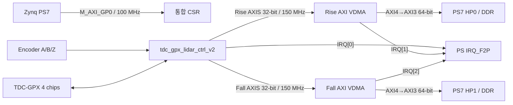

# TDC-GPX LiDAR V2 Stage L0 Parent 사용 및 Sign-off 가이드

## 1. 목적과 현재 판정

이 폴더는 `tdc_gpx_lidar_ctrl_v2:2.0` IP를 Zynq-7000
`xc7z020clg484-2` Parent에 실제로 배치하고, Rise/Fall AXI VDMA와 PS7 HP
포트까지 연결한 재생성 가능한 Vivado 프로젝트를 소유한다.

2026-08-09 4-chip Parent 최종 구현 판정은 다음과 같다.

- Parent Block Design 생성과 재개방 계약 검사: **PASS**
- 4-chip 합성, 배치·배선, DRC와 비트스트림 생성: **PASS**
- 물리 PCB의 TDC-GPX, 레이저, DDR cache 및 Ethernet 장시간 운용: **미검증**
- 따라서 이 결과는 **Parent 구현 Sign-off**이며 최종 보드 Release Sign-off는 아니다.

GUI 프로젝트:

```text
C:\Projects\my_sp\ALINX\Logic\project_4_lidar_v2_l0\project_4_lidar_v2_l0.xpr
```

## 2. Parent 데이터 흐름



VDMA의 입력 AXIS 폭은 합성 Generic `G_OUTPUT_WIDTH`와 같다. 현재 GUI
프로젝트는 32-bit이고, 각 VDMA의 DDR측 Master는 PS7 HP 포트 계약에 맞춰
64-bit로 변환한다. Rise는 HP0, Fall은 HP1을 사용하며 각 VDMA는 3개의 Frame
Buffer를 갖는다.

Rise/Fall VDMA의 메모리 Master는 AXI4이고 Zynq-7000 HP0/HP1은 AXI3이므로
각 1:1 경로에 전용 `AXI Protocol Converter`를 둔다. AXI Interconnect와
SmartConnect도 AXI4→AXI3 변환이 가능하지만, 현재처럼 Master 하나와 HP 포트
하나가 직접 대응할 때는 중재·라우팅 기능이 불필요하다. 여러 DMA Master가 한
HP 포트를 공유하게 되면 그때 SmartConnect로 전환하는 것이 합리적이다. 반면
`axi_control_interconnect`는 PS GP0 하나를 통합 CSR과 두 VDMA AXI-Lite 제어
포트로 분배하기 위해 계속 사용한다.

## 3. 고정 Build Profile

| 항목 | 현재 값 | 의미 |
|---|---:|---|
| FPGA | `xc7z020clg484-2` | ALINX AC7021B 계열 Parent 대상 |
| CSR clock | 100 MHz | PS FCLK0, AXI4-Lite 및 VDMA 제어 |
| Processing clock | 150 MHz | PS FCLK1 100 MHz를 Clock Wizard로 변환 |
| TDC clock | 200 MHz | PS FCLK2, TDC-GPX 버스/수집 도메인 |
| `G_STREAM_CLK_MODE` | `ASYNC` | Processing/TDC가 서로 다른 물리 clock |
| `G_OUTPUT_WIDTH` | 32 bit | VDMA S_AXIS 폭과 동일 |
| `G_NUM_CHIPS` | 4 | TDC0~TDC3 활성 |
| `G_STOPS_PER_CHIP` | 8 | Chip당 STOP 8개 |
| `G_MAX_RETURNS_PER_STOP` | 7 | STOP당 최대 Return 7개 |
| Rising capability | `0011` | TDC0/TDC1 Rising |
| Falling capability | `1100` | TDC2/TDC3 Falling |
| Echo receiver | 비활성 | 외부 TDC-GPX 수집 경로 사용 |
| OEN mode | `PULLUP_OR_NOT_CONNECTED` | PCB pull-up 또는 미연결 Parent 정책 |

## 4. 171개 PL 서비스 핀

PS DDR/FIXED_IO를 제외한 LiDAR 서비스 핀은 정확히 171개다. TDC0/1과 공통
서비스 핀은 `project4_vt_hrl2_tdc01_service.xdc`, TDC2/3은
`project4_vt_hrl2_tdc23_extension.xdc`가 소유한다. 두 XDC의 171개 PACKAGE_PIN과
171개 논리 포트는 모두 고유하며 중복이 없다.

| 그룹 | 수 | 포트 |
|---|---:|---|
| Encoder | 3 | `i_enc_a`, `i_enc_b`, `i_enc_z` |
| Laser feedback | 1 | `i_fire_done` |
| GPX 상태 입력 | 12 | `i_tdc_ef1[3:0]`, `i_tdc_ef2[3:0]`, `i_tdc_irflag[3:0]` |
| GPX 양방향 데이터 | 112 | `io_tdc_d[111:0]` |
| GPX 주소 | 16 | `o_tdc_adr[15:0]` |
| GPX Chip 제어 | 24 | Chip별 `CSN/RDN/WRN/STOPDIS/ALUTRIGGER/PURESN` |
| Laser/TDC 사건 출력 | 3 | `o_fire_pulse`, `o_start_tdc`, `o_stop_tdc` |

`OEN/LF/ERRFLAG`는 IP에서 제거하지 않았다. 이 Parent만 다음 정책을 사용한다.

- `o_tdc_oen`: `G_OEN_MODE=PULLUP_OR_NOT_CONNECTED`이므로 외부 핀으로 만들지 않는다.
- `i_tdc_lf1`, `i_tdc_lf2`: Parent 내부 상수 `0`에 연결한다.
- `i_tdc_errflag`: Parent 내부 상수 `0`에 연결한다.
- 동적 OEN과 LF/ERRFLAG 배선이 필요한 다른 PCB는 IP Generic과 Parent 배선/XDC를
  바꿔야 하며, IP 공개 포트는 그대로 재사용할 수 있다.

## 5. VDMA Profile 적용 절차

통합 IP가 Rise/Fall별 `HSIZE/VSIZE/STRIDE/enable` 후보값을 Processing
도메인에서 만들고, 통합 IP 내부 `lidar_vdma_profile_cdc`가 49-bit payload를
CSR 100 MHz 도메인으로 원자적으로 전달한다. Parent에는 별도 module-reference
bridge나 AXI GPIO가 없다.

1. PS가 통합 CSR `CTL25~CTL29`에서 pending profile을 읽는다.
2. 해당 VDMA가 정지된 것을 확인한다.
3. VDMA `HSIZE`, `VSIZE`, `STRIDE`와 Frame Buffer 주소를 기록한다.
4. Rise는 `CTL25[8]`, Fall은 `CTL25[9]`에 W1S ACK를 쓴다.
5. 통합 IP가 ACK를 확인한 뒤 다음 Face부터 새 계약을 사용한다.

오래된 ACK가 HIGH인 상태는 새 요청의 승인으로 인정하지 않는다. Reset 또는
profile 변경 중 VDMA를 계속 실행하면 안 된다.

`tb_lidar_vdma_profile_cdc`와 K0-3 통합 회귀는 49-bit payload 원자성, 지연
ACK, 오래된 HIGH ACK 거부 및 두 비동기 클럭 방향을 검증한다.

## 6. Reset과 CDC 계약

세 clock 전체를 `set_clock_groups -asynchronous`로 묶지 않는다. 그렇게 하면
설정 handshake, 진단 mailbox, XPM FIFO가 소유한 물리적 max-delay와 bus-skew
보호까지 사라진다.

| 교차 | 보호 방식 |
|---|---|
| 1-bit 상태/요청 | 명시적 2FF 이상 동기화, metastability 첫 단계만 false path |
| Encoder A/B/Z | 4단 동기화기 bit 0만 false path |
| 215-bit 설정 payload | 4-phase request/ACK + 5 ns datapath-only max delay |
| 16x28-bit GPX image | acknowledged activation + 5 ns datapath-only max delay |
| 8/33-bit 진단 mailbox | toggle handshake + 5 ns max delay + 5 ns bus skew |
| TDC→Processing event | `xpm_fifo_async`, 양쪽 Reset busy와 stale payload 폐기 |
| Processing→CSR VDMA profile | 49-bit XPM handshake, CTL25 W1S ACK |
| GPX D[27:0]/Chip | RDN 선행 후 IOB capture, 최소 25 ns Runtime 버스 유지시간 |

GPX 데이터 핀 112개에 대한 false path는 **포트에서 첫 IOB 입력 FF까지**로만
제한된다. 일반적인 2FF 동기화 데이터라고 주장하는 것이 아니다. 외부 GPX가
RDN 뒤 데이터를 안정화하고, Runtime TDC-GPX 버스 읽기 타이밍
(`BUS_CLK_DIV/BUS_TICKS`)이 최소 25 ns를 제공한다는 비동기 병렬 버스 계약이다.

별도 Reset 회귀는 200 MHz Source와 150 MHz Destination에서 다음을 검증한다.

- Source 또는 Destination Reset 중 `ready/valid` 누출 금지
- Reset 전에 FIFO에 보류된 payload 폐기
- Reset 해제 후 처음 수신한 payload가 새 값과 정확히 일치

최신 회귀 세션은 `260809190043_v2_stream_gateway_reset`이다.

## 7. 타이밍 계약과 4-chip 구현 결과

TDC 제어 출력은 반환 clock이 없는 외부 장치 인터페이스다. false path로 숨기지
않고 register-to-pad에 8 ns max-delay를 적용한다. 실제 TDC-GPX 버스 상태는
최소 25 ns 유지되므로 8 ns 안에 핀에 도달하면 최소 17 ns의 안정 구간이 남는다.

아래 값은 4-chip Parent 세션 `260809_l0_parent_4chip_synth02`와
`260809_l0_parent_4chip_impl01`의 최종 결과다.

| 항목 | 결과 |
|---|---:|
| Synthesis WNS/WHS | `+0.355 / +0.036 ns` |
| Route WNS/WHS | `+0.082 / +0.023 ns` |
| CSR 100 MHz 내부 WNS | `+0.747 ns` |
| Processing 150 MHz 내부 WNS | `+0.595 ns` |
| TDC 200 MHz 내부 WNS | `+0.082 ns` |
| 최악 TDC 내부 경로 | TDC0 `tick[2]` → IOB `WRN`, 2 LUT, 배선 85.252% |
| 최악 TDC 출력 | `o_tdc_stopdis[3]`, `7.717 ns` |
| 최소 핀 안정 여유 | `25 - 7.717 = 17.283 ns` |
| Active critical CDC | 0 |
| Bus-skew 위반 | 0 |
| Blocking DRC | 0 |
| Critical Warning | 0 |
| 비트스트림 | 4,045,708 bytes |

패키지 최종 세션 `260809_220426_k010_ip_package`는 32-bit 150/200 MHz,
128-bit 200/150 MHz Echo 비활성, 64-bit 150/150 MHz SYNC의 세 OOC profile을
`Critical Warning 0 / Error 0`으로 통과했다. 현재 패키지는 88개 RTL,
XGUI 1개, 한글 가이드 3개인 총 92개
package 자산의 source/XGUI/guide 동기화까지 같은 runner에서 검사했다.
또한 초기 IP 추론 및 OOC 최적화에서 허용한 Warning ID와 최대 수를
`WARNING_AUDIT.txt`에 기록하며, 새 ID 또는 발생 수 증가 시 Sign-off를 거부한다.

4-chip Parent는 GPX 데이터 112개, IOB capture FF 112개, TDC 출력 152개,
비동기 서비스 입력 16개와 보드 서비스 핀 171개를 모두 정적 검사한다.
합성/구현 세션 모두 Critical Warning 0, blocking DRC 0이며 구현 세션은
4,045,708-byte bitstream까지 생성했다.

TDC 200 MHz의 `+0.082 ns`는 도구 기준으로는 PASS지만 변경 여유가 큰 값은
아니다. 해당 최악 경로는 기능 조합 깊이보다 서로 떨어진 IOB까지의 물리 배선이
지배한다. 200 MHz는 상한 스트레스 프로파일로 유지하고, 실제 PCB 초도 검증은
150 MHz부터 시작해 Runtime TDC-GPX 버스 읽기 타이밍(`BUS_CLK_DIV/BUS_TICKS`),
Register readback 및 IFIFO Drain을 확인한 뒤 올린다.

## 8. 재생성과 Sign-off 실행

프로젝트를 다시 만들 때 기존 대상 폴더 삭제는 `-Recreate`를 명시한 경우에만
허용된다.

```powershell
powershell.exe -NoProfile -ExecutionPolicy Bypass `
  -File system_integration/v2/parent_l0/run_v2_l0_parent.ps1 `
  -OutputWidth 32 -Recreate
```

합성만 확인:

```powershell
powershell.exe -NoProfile -ExecutionPolicy Bypass `
  -File system_integration/v2/parent_l0/run_v2_l0_parent_signoff.ps1 `
  -Mode SYNTH -SessionTag <unique_session>
```

배치·배선과 비트스트림까지 확인:

```powershell
powershell.exe -NoProfile -ExecutionPolicy Bypass `
  -File system_integration/v2/parent_l0/run_v2_l0_parent_signoff.ps1 `
  -Mode IMPL -SessionTag <unique_session>
```

## 9. 아직 남은 보드 Sign-off

다음 항목은 현재 PASS에 포함되지 않는다.

1. 실제 PCB에서 40 MHz GPX 기준 clock과 TDC-GPX Register readback 확인
2. TDC0~TDC3 112-bit 데이터 버스 setup/hold 및 장기 IFIFO Drain
3. PS가 VDMA profile을 적용한 뒤 HP0/HP1 DDR byte를 읽는 실측
4. FreeRTOS/PetaLinux DMA cache invalidate/ownership API 검증
5. Rise/Fall Frame Buffer 주소, overflow, 장기 backpressure 검증
6. 실제 레이저 안전 인터록과 `fire_done` 응답시간 검증
7. DDR H-Line을 Viewer Ethernet ABI로 전송하는 지속 처리량 검증

현재 4-chip 200 MHz 구현은 timing을 통과했지만 setup 여유가 `+0.082 ns`다.
핀맵, bus PHY, 합성 전략 또는 주변 로직이 바뀌면 Parent 구현을 반드시 다시
판정한다. 200 MHz 여유가 음수가 되면 외부 버스 파형을 바꾸는 임의 파이프라인보다
먼저 bus PHY register 복제, IOB 인접 배치 및 150 MHz 운용 프로파일을 검토한다.
