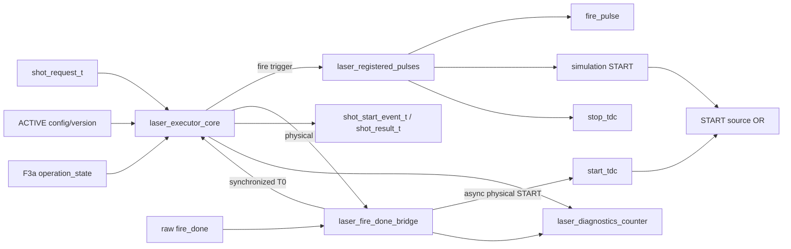
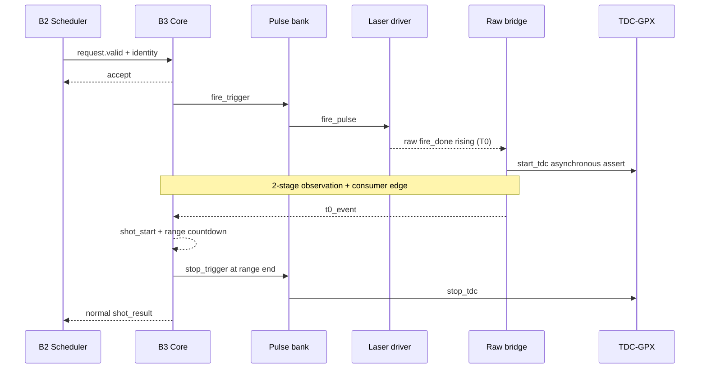
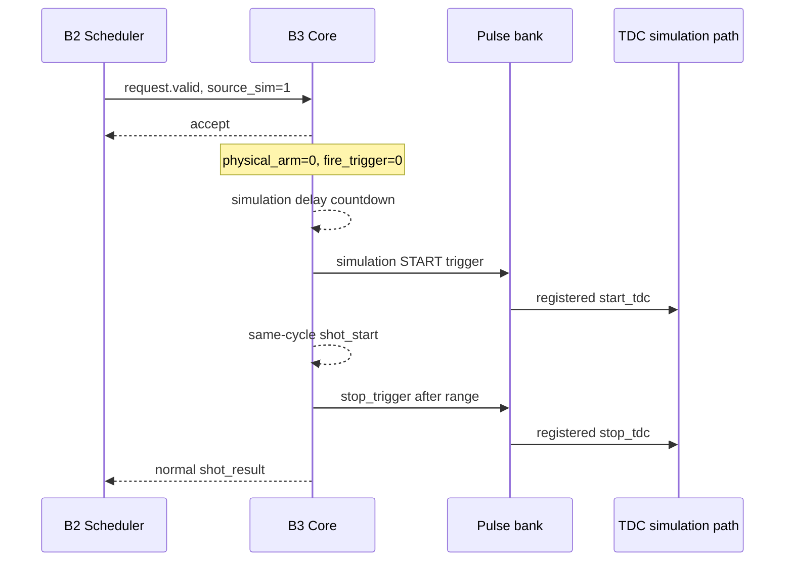

# v2 Checkpoint F4: Laser Executor

## 1. 판정

Checkpoint F4/B3의 독립 경계는 **완료**다.

- 물리 mode의 `fire_pulse -> raw fire_done -> start_tdc -> stop_tdc` 수명주기;
- simulation mode의 물리 fire 완전 차단과 등록형 START;
- timeout, abort, timeout-boundary T0 우선순위;
- stale/stuck-HIGH `fire_done` fail-safe;
- B2 request accept/drop과 shot identity 보존;
- 150/200 MHz 기능 및 `xc7z020clg484-2` OOC route;
- raw T0 비동기 캡처 구조의 합성 후 자동 감사;

가 모두 통과했다. 이 판정은 B3 블록 경계에 대한 것이며 production top,
TDC acquisition, VDMA와 HTML을 포함한 통합 IP sign-off는 아니다. 다음 단계는
F5 Processing production assembly다.

위 문장은 F4 완료 당시 gate 기록이다. F5 Processing assembly는 이후 완료됐고
현재 상태와 후속 무회귀는 Section 17 및
`V2_CHECKPOINT_F5_PROCESSING_SUBSYSTEM.md`를 따른다.

## 2. 구현 범위

### 2.1 추가한 RTL

| 파일 | 역할 |
|---|---|
| `laser_executor.vhd` | B3 assembly와 외부 typed-record 경계 |
| `laser_executor_core.vhd` | 한 accepted shot의 순차 lifecycle FSM |
| `laser_fire_done_bridge.vhd` | raw `fire_done` 저지연 물리 START와 동기 T0 event |
| `laser_registered_pulses.vhd` | fire, simulation START, STOP 등록 pulse bank |
| `laser_diagnostics_counter.vhd` | 관찰 전용 sticky 및 modulo-2^32 count |

`lidar_event_types_pkg.vhd`에는 다음 record를 추가했다.

| Record | 의미 |
|---|---|
| `shot_start_event_t` | 동기 T0에서 확정된 complete request와 fire-to-T0 측정값 |
| `shot_result_t` | 정상/timeout/abort terminal result와 같은 request identity |
| `laser_diagnostics_t` | drop, timeout, abort, unexpected-done 진단 |

### 2.2 의도적으로 포함하지 않은 범위

- CSR word 해석;
- Face 또는 angular due-point 계산;
- GPX bus readout;
- Echo STOP 생성;
- AXIS monitor packing/backpressure;
- TDC/Frame/VDMA identity 연결.

이 기능은 각각 기존 owner 또는 후속 F5~J 경계에 남긴다.

## 3. 블록 조립도



핵심 분리는 다음과 같다.

1. Core는 raw 비동기 핀을 직접 해석하지 않는다.
2. Bridge는 Face/shot 정책을 결정하지 않는다.
3. Pulse bank는 trigger 조건을 결정하지 않는다.
4. Diagnostic은 어떤 functional gate에도 되먹이지 않는다.

`laser_executor_core`의 clocked FSM은 164 lines로 style guide의 120-line
review trigger를 넘는다. 이를 검토했지만 state, accepted request, timeout,
range와 re-arm은 모두 한 shot lifecycle의 동일 소유 상태이므로 여러 process로
나누지 않았다. 분할하면 다중 register owner 또는 긴 combinational next-state
cone이 생긴다. Entity는 341 lines로 400-line 상한 안이며, 독립 책임인 CDC,
pulse와 diagnostics는 이미 별도 entity로 분리했다.

## 4. Shot identity 흐름

`shot_request_t` 전체를 accept 시 `current_request`에 저장한다. 이후 B3는
Face, position, direction, shot index, source mode, source latency와 active
version을 다시 계산하지 않는다.

```text
B2 shot_request
  -> B3 current_request snapshot
     -> shot_start.request
     -> shot_result.request
     -> F5 TDC acquisition/frame identity
```

`shot_start`와 `shot_result`는 별개의 sideband 신호를 나중에 조립하지 않고
complete request를 반복한다. 따라서 소비자는 `valid=1`인 clock에서 record
하나만 샘플하면 된다.

## 5. 물리 모드 데이터 흐름



물리 `start_tdc` 상승은 Processing clock을 기다리지 않는다. 그러나 bookkeeping,
range 시작과 `shot_start`는 동기화된 T0만 사용한다. 이것이 물리 거리 기준 edge와
순차 제어 FSM을 분리하는 핵심이다.

## 6. Simulation 모드 데이터 흐름



raw `fire_done`은 simulation START를 만들 수 없다. 반대로 simulation event는
physical arm이나 `fire_pulse`를 만들 수 없다. 두 START source의 동시 활성은
assertion failure다.

## 7. 순차 FSM

| 상태 | 의미 | 정상 다음 상태 |
|---|---|---|
| `EXEC_IDLE` | config/mode/bridge ready와 request context 확인 | physical/simulation wait |
| `EXEC_WAIT_PHYSICAL_T0` | fire-done timeout과 raw T0 관찰 | range 또는 resolve tail |
| `EXEC_WAIT_SIMULATION_T0` | simulation delay 관찰 | range |
| `EXEC_TIMEOUT_RESOLVE` | timeout edge 직전 캡처된 T0가 동기화될 시간을 보장 | range 또는 timeout result |
| `EXEC_ABORT_RESOLVE` | permit/operation 상실 직전 캡처된 T0를 동일하게 resolve | range 또는 abort result |
| `EXEC_RANGE_WINDOW` | synchronized T0부터 target range countdown | STOP/result |
| `EXEC_REARM` | 모든 pulse가 LOW인 뒤 고정 quiet margin | idle |

우선순위는 다음과 같다.

1. 이미 캡처된 T0;
2. operation/permit 상실;
3. fire-done timeout;
4. 다음 countdown.

따라서 timeout boundary와 T0가 겹치면 T0가 이기며, 한 번 물리 START가 시작된
shot은 안전 gate가 닫혀도 최소 START 폭과 range/STOP 수명주기를 완결한다.

## 8. Pulse와 시간 의미

| 항목 | 의미 |
|---|---|
| `fire_width_proc_clks` | 등록형 `fire_pulse`의 정확한 HIGH clock 수 |
| `start_width_proc_clks` physical | 비동기 상승부터 최소 완전 Processing clock 수 |
| `start_width_proc_clks` simulation | 등록형 START의 정확한 HIGH clock 수 |
| `stop_width_proc_clks` | 등록형 STOP의 정확한 HIGH clock 수 |
| `fire_done_timeout_proc_clks` | request accept부터 T0 대기 상한 |
| `target_range_proc_clks` | synchronized `shot_start`부터 STOP까지의 창 |
| `simulation_start_delay_proc_clks` | simulation request accept부터 T0까지의 지연 |

Processing period를 `Tproc`, physical START 설정값을 N이라고 하면 정상적인
비동기 위상에서 물리 START 폭은 다음 범위다.

```text
N * Tproc <= physical START width < (N + 1) * Tproc
```

하강을 clock에 맞추면서 N개의 완전한 clock 구간을 보장하기 때문에 생기는
의도적 보수성이다. 정확히 N clock인 등록 pulse와 같은 의미로 해석하면 안 된다.

고정 구현 시간은 CSR source가 아니다.

| Read-only 값 | 값 | 용도 |
|---|---:|---|
| fire-done observation budget | 3 Processing clocks | 2-stage synchronizer와 FSM 소비 edge를 포함한 resolve tail |
| re-arm margin | 2 Processing clocks | 모든 pulse LOW 후 quiet interval |

## 9. 물리 T0 비동기 예외

합성 후 raw path는 다음 두 endpoint만 가져야 한다.

```text
raw fire_done
  +-> FDPE.PRE -> physical START capture
  +-> raw_meta.D -> raw_sync -> LOW qualification
```

START 관찰은 별도의 `start_meta -> start_sync` 2-stage chain을 통과한다.
`ASYNC_REG` 4개와 `SHREG_EXTRACT=NO`로 두 chain을 보존한다.

일반 `report_cdc`는 source clock이 없는 비동기 top input을 완전히 증명하지
못한다. 따라서 F4 실행 스크립트는 routed netlist에서 다음을 직접 검사한다.

- `start_capture_r_reg`가 정확히 한 개의 `FDPE`인가;
- raw port가 `PRE`까지 LUT 없이 직접 연결되는가;
- raw endpoint가 `FDPE.PRE`와 `raw_meta.D` 두 개뿐인가;
- `ASYNC_REG` cell이 정확히 네 개인가.

## 10. Fail-safe 정책

| 조건 | 동작 |
|---|---|
| reset 또는 active config 무효 | request를 승인하지 않음 |
| physical permit 없음 | 최종 `fire_pulse` pin 즉시 LOW |
| raw `fire_done`가 arm 전 HIGH | bridge not-ready, request drop, START 금지 |
| raw `fire_done`가 arm 뒤 HIGH 고착 | START를 설정 최소 폭에서 종료, raw LOW 재검증 전 re-arm 금지 |
| fire-done timeout | START/STOP 없이 timeout result |
| operation 상실 직전 T0 캡처 | 3-clock resolve 뒤 정상 shot 완결 |
| busy 중 새 request | 명시적 drop, B2 ownership 종료 |
| simulation mode raw pulse | physical START 금지, unexpected 진단 가능 |

최종 physical fire gate만 조합 AND를 사용한다. 이는 permit 상실을 한 clock 늦게
반영하지 않기 위한 안전 예외다. 나머지 command, pulse와 lifecycle 상태는
Processing clock의 순차 논리로 관리한다.

## 11. 진단 계약

| 진단 | 발생 조건 |
|---|---|
| `request_drop` | busy, stale context, mode/bridge/config not-ready request |
| `fire_done_timeout` | 물리 request가 watchdog 내 T0를 얻지 못함 |
| `operation_abort` | T0 전 operation permission 상실 후 resolve 실패 |
| `unexpected_done` | unarmed 상태의 raw rising |

각 진단은 one-clock pulse, explicit-clear sticky, modulo-2^32 count를 가진다.
clear와 새 event가 같은 clock이면 새 event가 우선하여 count 1/sticky 1로 남는다.
진단은 observation-only이며 발사 허가 조건에 포함되지 않는다.

## 12. 검증 시나리오

| ID | 검증 내용 | 결과 |
|---|---|---|
| P30 | 물리 success, async START, identity, fire/STOP width | PASS 150/200 MHz |
| P31 | stale-HIGH admission 차단과 missing-done timeout | PASS 150/200 MHz |
| P32 | timeout boundary 직전 T0 우선 | PASS 150/200 MHz |
| P33 | simulation START와 physical path 완전 분리 | PASS 150/200 MHz |
| P34 | busy duplicate drop와 permit-loss final gate/abort | PASS 150/200 MHz |
| P35 | real F3a -> B1 -> B2 -> B3 physical/simulation chain | PASS 150/200 MHz |
| P36 | armed stuck-HIGH의 bounded START와 LOW 재검증 | PASS 150/200 MHz |

재현 명령:

```powershell
powershell.exe -NoProfile -ExecutionPolicy Bypass `
  -File system_integration/v2/scripts/run_v2_laser_executor.ps1
```

기준 세션:

```text
signoff_results/sessions/260804220300_v2_laser_executor
```

## 13. 구현 결과

대상 device는 `xc7z020clg484-2`, OOC top은 `laser_executor`다.

| Processing clock | WNS | Latch | ASYNC_REG | FDPE capture | Raw endpoint audit |
|---:|---:|---:|---:|---:|---|
| 150 MHz | +1.481 ns | 0 | 4 | 1 | PASS, exactly 2 |
| 200 MHz | +0.526 ns | 0 | 4 | 1 | PASS, exactly 2 |

| Resource | Count |
|---|---:|
| LUT | 851 |
| FF | 774 |
| LUTRAM/SRL | 0 |
| BRAM/DSP | 0 |

초기 F4의 200 MHz worst path는 range-end 판정에서 STOP pulse-bank enable까지의
5-LUT 경로였다. route 지연 비중이 약 73%였고 timing은 통과했다. 이후 F5
production placement에서 다시 확인한 결과와 필요한 무회귀 수정은 Section 17에
기록한다. latency contract를 바꾸는 padding은 추가하지 않았다.

OOC DRC의 `ZPS7-1`은 Zynq part를 PS7 없이 단독 합성한 경계 시험 경고다.
`HD.CLK_SRC`와 PARTPIN 위치도 parent가 없는 OOC 한계이므로 Stage L parent
implementation에서 최종 판정한다.

## 14. 선행 경계 무회귀

공용 event package 확장 후 다음 회귀를 다시 실행했다.

| 경계 | 세션 | 결과 |
|---|---|---|
| F1/B0 Motor | `260804215000_v2_motor_position` | PASS |
| F2/B1 Face | `260804215200_v2_face_tracker` | PASS |
| F3a Operation | `260804215600_v2_operation` | PASS |
| F3b/B2 Scheduler | `260804215900_v2_shot_scheduler` | PASS |

## 15. 코드 읽기 순서

1. `lidar_event_types_pkg.vhd`에서 request/start/result record를 읽는다.
2. `laser_executor.vhd`에서 네 하위 책임과 외부 연결을 본다.
3. `laser_executor_core.vhd`의 state와 우선순위를 읽는다.
4. `laser_fire_done_bridge.vhd`에서 유일한 비동기 예외를 읽는다.
5. `laser_registered_pulses.vhd`에서 정확한 등록 pulse 폭을 확인한다.
6. `laser_diagnostics_counter.vhd`가 기능 gate와 분리됐는지 확인한다.
7. `tb_laser_executor.vhd` P30..P36으로 corner case를 따라간다.
8. `tb_v2_laser_control_chain.vhd` P35로 블록 융합을 따라간다.

## 16. F5 인계 조건

F5는 다음 항목을 닫아야 한다.

1. B0 -> B1 -> B2 -> B3를 production subsystem으로 한 번만 조립;
2. F3a state와 active config version을 모든 블록에 같은 source로 배포;
3. B2/B3 idle을 Processing-local safe point에 포함;
4. `shot_start.request`를 Stage H가 소비할 typed TDC acquisition 경계로 노출;
5. AXIS monitor는 copy/drop 전용으로 두고 control backpressure 금지;
6. 150/200 및 200/150 Processing/TDC profile에서 full-chain 검증;
7. Stage L parent XDC에서 raw `fire_done` async exception과 synchronizer 배치 확인;
8. Encoder pin부터 physical fire/START까지 measured latency status 확정.

F4의 결론은 "B3가 독립적으로 sign-off 가능한 경계"다. 전체 LiDAR IP의
sign-off는 F5와 이후 TDC/frame/formatter/HTML 단계가 끝난 뒤에만 가능하다.

## 17. F5 후속 무회귀와 인계 종료

F5 통합 timing 감사에서 immediate physical START 값을 executor busy에 다시
조합 입력하던 불필요한 경로를 찾았다. executor는 busy를 이후 re-arm 상태에서만
소비하므로 `o_start_busy`를 등록 owner인 `hold_active_r`로 구동했다. raw
`fire_done -> FDPE PRE -> start_tdc` 저지연 출력은 바꾸지 않았다.

후속 세션:

```text
signoff_results/sessions/260804_f4_busy_opt_v2_laser_executor
```

| Processing clock | P30..P36/chain | WNS | Latch | Raw endpoint audit |
|---:|---|---:|---:|---|
| 150 MHz | PASS | `+1.477 ns` | 0 | PASS, exactly 2 |
| 200 MHz | PASS | `+0.422 ns` | 0 | PASS, exactly 2 |

F5 항목 1..6과 8은 `V2_CHECKPOINT_F5_PROCESSING_SUBSYSTEM.md`에서 닫혔다.
항목 4의 실제 TDC-domain 소비/CDC는 Stage H, 항목 7의 board constraint와 배치는
Stage L의 책임이다. 이 둘을 F5가 이미 완료한 것으로 확대 해석하지 않는다.
