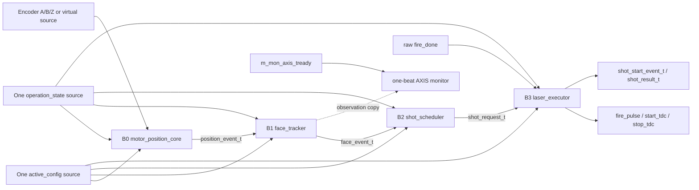
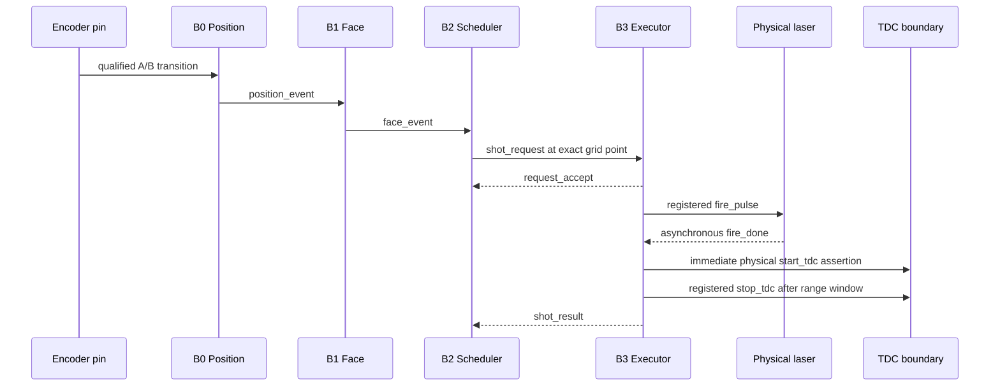
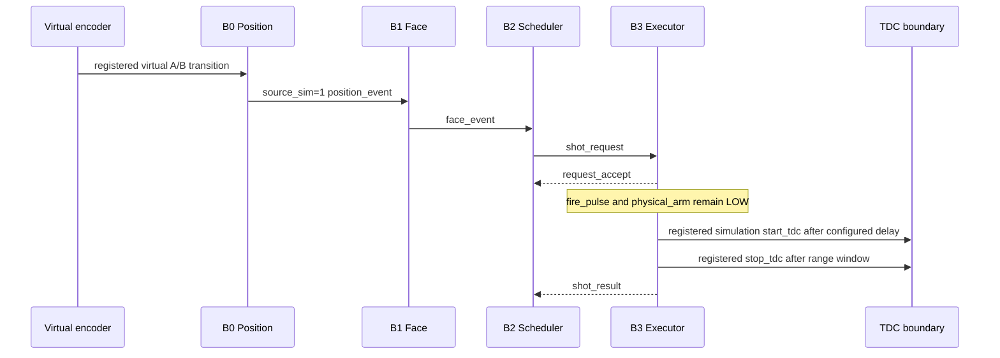

# v2 Checkpoint F5: Processing Subsystem Integration

## 1. 판정

Stage 3 / Checkpoint F의 마지막 단계인 F5를 완료했다. 개별 검증한 B0부터
B3까지를 `lidar_processing_subsystem`에서 한 번만 조립하고, 제어 경로와
분리된 read-only AXI4-Stream monitor를 추가했다.

**결론:** Checkpoint F와 Stage 3 Processing event pipeline은 완료다.
다음 허용 단계는 Stage 4 / Checkpoint G `echo_stop_frontend`다.

이 판정은 다음 범위만 의미한다.

- Encoder 또는 virtual source에서 Laser fire/START/STOP까지의 Processing 경로;
- 동일 active configuration과 operation state의 B0..B3 배포;
- Processing-local drain/idle과 monitor backpressure 격리;
- 물리/가상 source identity 및 shot identity 보존;
- 150/200 MHz와 200/150 MHz routine profile의 기능 및 OOC 구현.

아직 v2 TDC bus/acquisition, Hit/Cell/Frame, VDMA formatter, HTML 비교와 parent
보드 구현은 포함하지 않는다. 특히 F5의 TDC profile clock은 독립 위상의 외부
`fire_done` 응답 모델에 사용했다. Processing-to-TDC acquisition 명령 CDC를
구현했다는 뜻이 아니며 그 경계는 Stage 5 / Checkpoint H에 남아 있다.

## 2. Production 조립 구조



`lidar_processing_subsystem`은 CSR word를 해석하거나 operation state를 다시
만들지 않는다. 기존 `lidar_csr_config_subsystem`과
`lidar_operation_manager`가 생성한 typed record를 각각 한 source에서 받아
직접 배포한다. 따라서 기능 코어마다 config bit를 재해석하거나 서로 다른
version을 사용할 수 있는 병렬 owner가 없다.

## 3. 블록별 단일 책임

| 블록 | 입력 경계 | 단독 소유 책임 | 소유하지 않는 것 |
|---|---|---|---|
| B0 `motor_position_core` | A/B/Z, motor config | source 선택, x1/x2/x4 decode, 원형 position, direction, Z | Face, shot, laser 허가 |
| B1 `face_tracker` | `position_event_t`, derived bounds | inclusive Face 판정, enter/exit, overlap, Face index | shot 간격, laser timing |
| B2 `shot_scheduler` | `face_event_t`, executor result | angular lattice, geometric `shot_index`, busy-hole, one request in flight | 물리 fire, timeout, TDC |
| B3 `laser_executor` | `shot_request_t`, operation state, raw `fire_done` | accept/drop, 물리/가상 shot lifecycle, fire/start/stop, timeout/re-arm | Face 판정, angular due point |
| AXIS monitor | B1 `face_event_t` | 관찰 beat 보관, stall 시 drop 진단 | 제어 허가, idle, shot 순서 |

## 4. Identity와 레코드 계보

한 event의 의미는 이름이 비슷한 개별 신호로 재조립하지 않고 typed record로
전달한다.

| 의미 | B0 | B1 | B2 | B3 |
|---|---|---|---|---|
| position/direction | 생성 | 그대로 전달 | due 위치로 전달 | 그대로 보존 |
| physical/virtual source | active config로 결정 | 그대로 전달 | 그대로 전달 | 실행 경로 선택 및 보존 |
| source latency/valid | B0 실측 계약 부착 | 그대로 전달 | 그대로 전달 | 결과까지 보존 |
| active version | event 생성 시 부착 | 그대로 전달 | 그대로 전달 | accept부터 result까지 고정 |
| Face index | 없음 | B1 결정 | 그대로 전달 | 그대로 보존 |
| shot index/last | 없음 | 없음 | B2 결정 | 그대로 보존 |
| fire-to-T0/timeout/abort | 없음 | 없음 | 없음 | B3 측정 및 결정 |

`p_contract`는 Processing이 활성인데 active config가 없는 경우, scheduler가
B0/B1보다 먼저 활성인 경우, 물리와 simulation source가 동시에 열린 경우,
그리고 start/result의 request identity가 현재 accepted request와 다른 경우를
즉시 실패시킨다.

## 5. 물리 Shot 시퀀스



busy인 executor는 다음 각도에서 늦게 발사하지 않는다. 해당 due point는
geometric column을 소비한 채 hole로 남고 overrun을 기록한다. 이 규칙은
후속 formatter가 `shot_index`를 accepted-shot counter처럼 압축하지 못하게 한다.

물리 START 상승은 raw `fire_done`이 FDPE preset을 직접 구동하는 의도적 저지연
예외다. 하강과 재무장은 Processing clock으로 관리하며, raw 입력이 HIGH로
고착되면 설정 폭 뒤 START를 닫고 raw LOW가 다시 확인될 때까지 다음 물리 shot을
허용하지 않는다.

## 6. Virtual Shot 시퀀스



simulation mode에서는 물리 `fire_pulse`와 physical arm이 모두 비활성이다.
따라서 외부 `fire_done`은 simulation START source와 경쟁하지 않는다.

## 7. 측정 지연 계약

아래 값은 동작을 맞추기 위해 넣는 padding이나 runtime 설정이 아니다. RTL과
검증 결과가 공유하는 read-only 구현 계약이다.

| 값 | 시작 | 끝 | Processing clocks |
|---|---|---|---:|
| B0-to-executor accept | `position_event.valid` | matching request accept | 5 |
| Physical sample-to-fire | 비동기 핀의 안정값을 첫 FF가 샘플한 edge | physical `fire_pulse` 상승 | 9 |
| Virtual source-to-accept | 내부 virtual source A/B/Z 전이 | matching request accept | 7 |

물리 9 clocks는 B0 physical 4 clocks와 B0-to-accept/fire 5 clocks의 합이다.
비동기 핀의 실제 전이부터 첫 Processing sample까지의 0..1 clock 위상 구간은
포함하지 않는다. Virtual 7 clocks도 simulation START까지의 값이 아니다.
simulation START에는 accept 이후 사용자가 설정한 simulation delay가 별도로
적용된다.

F5는 이 값을 다음 출력으로 고정한다.

```text
o_b0_to_accept_clks       = 5
o_physical_to_fire_clks   = 9
o_virtual_to_accept_clks  = 7
```

`o_virtual_a/b/z`는 공통 1-clock 입력 경계를 지난 관찰 신호다. 따라서 이
관찰 포트의 전이부터 accept까지 직접 재면 6 clocks이며, 위 7 clocks는 그
앞단의 내부 Virtual source 전이부터 계산한 전체 계약이다.

## 8. Processing Monitor AXIS ABI

monitor는 B1의 모든 valid event를 관찰한다. Face 내부 event만이 아니라 외부,
enter, exit, reversal event도 포함한다.

### 8.1 TDATA 64 bits

| Bit | 이름 | 의미 |
|---:|---|---|
| 14:0 | POSITION | decoded modular position |
| 31:15 | SOURCE_LATENCY | B0 read-only latency, 17-bit zero extension |
| 47:32 | ACTIVE_VERSION | event를 만든 atomic config version |
| 48 | ENTER_EVENT | 현재 sample에서 Face 진입 |
| 49 | EXIT_EVENT | 현재 sample에서 Face 이탈 |
| 50 | Z_EVENT | qualified Z/index event |
| 63:51 | RESERVED | 0 |

### 8.2 TUSER, TKEEP와 TLAST

| 신호/Bit | 의미 |
|---|---|
| `TUSER[2:0]` | Face index |
| `TUSER[3]` | source, `0=physical`, `1=simulation` |
| `TUSER[4]` | overlapping Face windows detected |
| `TUSER[5]` | SOURCE_LATENCY가 승인된 측정값임 |
| `TUSER[6]` | direction, `0=CW`, `1=CCW` |
| `TUSER[7]` | current sample is inside a Face |
| `TKEEP[7:0]` | 항상 `0xFF`, 8 bytes 모두 유효 |
| `TLAST` | `EXIT_EVENT`의 관찰 marker |

`TLAST`는 데이터 프레임 전송 계약이 아니라 B1 traversal 경계 marker다.
in-Face reversal 또는 Face 직접 전환에서는 enter와 exit가 같은 beat에 함께 1일
수 있다.

### 8.3 Stall과 drop

monitor는 한 beat elastic register를 갖는다. retained beat가 stall되면
`TVALID/TDATA/TUSER/TLAST`는 승인될 때까지 안정적으로 유지된다. 그 사이 새
B1 event는 제어를 멈추지 않고 drop하며 pulse/sticky/modulo-2^32 count로
기록한다. diagnostic clear와 drop이 같은 clock에 오면 새 drop이 우선되어
count는 1이 된다.

구조 감사는 `m_mon_axis_tready`가 `fire_pulse`, `start_tdc`, `stop_tdc`의
fanin에 없음을 routed netlist에서 확인한다.

## 9. Idle과 설정 safe point

F5가 제공하는 Processing-local idle은 다음과 같다.

```text
pipeline_idle = scheduler_idle AND NOT executor_busy
```

- unresolved B2 request가 있으면 idle이 아니다;
- B3 shot lifecycle, pulse 또는 re-arm이 남아 있으면 idle이 아니다;
- monitor pending/stall은 기능 drain이 아니므로 idle 계산에서 제외한다.

P52는 monitor beat가 계속 stalled인 상태에서도 현재 shot이 끝나면 이 local
safe point가 올라오는 것을 검증한다. 전체 LiDAR commit safe point는 앞으로
이 값에 TDC acquisition idle과 output drain idle을 AND해야 한다. 따라서 F5의
`pipeline_idle`을 곧바로 전체 시스템 idle로 해석하면 안 된다.

## 10. 진단 소유권

`processing_diagnostics_t`는 각 owner의 결과를 한 aggregate driver로 조립한다.

| Owner | 진단 |
|---|---|
| B0 | invalid transition pulse/sticky/count, source switch, virtual Z fault |
| B1 | Face overlap sticky/count |
| B2 | schedule overrun pulse/sticky/count |
| B3 | request drop, fire-done timeout, operation abort, unexpected fire-done |
| Monitor | drop pulse/sticky/count |

레코드의 여러 필드를 서로 다른 모듈이 같은 output record에 부분 할당하지 않는다.
이 방식은 unresolved field가 `U` source로 남아 status CDC에서 0으로 뭉개지는
과거의 split-record owner 문제를 방지한다.

## 11. 검증 시나리오

| ID | 핵심 자극 | 닫힌 계약 | 결과 |
|---|---|---|---|
| P50 | physical pin -> B0..B3 -> async `fire_done` | 9-clock fire latency, shot identity, immediate START, normal result | PASS |
| P51 | monitor beat 장기 stall 중 연속 Face event | AXIS stability, drop count, TREADY control 격리 | PASS |
| P52 | active shot 중 STOP, monitor는 계속 stall | shot drain 전 safe 금지, drain 후 local safe 허용 | PASS |
| P53 | virtual source RUN/ARM | 7-clock internal-source accept, physical fire/arm 금지, simulation START/result | PASS |

두 profile 모두 동일한 P50..P53을 통과했다.

| Processing | TDC response model | 기능 | WNS | Latch | ASYNC_REG | Critical CDC |
|---:|---:|---|---:|---:|---:|---:|
| 150 MHz | 200 MHz | PASS | `+0.385 ns` | 0 | 16 | 0 |
| 200 MHz | 150 MHz | PASS | `+0.196 ns` | 0 | 16 | 0 |

TDC model clock은 Processing clock에 대해 731 ps 위상 offset을 두었다. 이는
raw `fire_done`의 고정 위상 가정을 제거하기 위한 시험 조건이다.

## 12. 합성 구조와 자원

대상은 `xc7z020clg484-2`, OOC top은
`lidar_processing_subsystem_impl`이다.

| 구조 검사 | 결과 |
|---|---:|
| Inferred latch | 0 |
| ASYNC_REG | 16 = encoder A/B/Z 12 + fire-done observer 4 |
| Physical START FDPE capture | 1 |
| raw `fire_done` endpoint | 정확히 2, FDPE PRE와 첫 observer D |
| raw preset direct | PASS |
| monitor TREADY in fire/start/stop control | 0 |
| Critical CDC | 0 |

200/150 MHz profile의 post-route 자원은 다음과 같다.

| Resource | Count |
|---|---:|
| LUT | 2160 |
| FF | 2589 |
| LUTRAM/SRL | 0 |
| BRAM/DSP | 0 |

200 MHz 최악 경로는 virtual source의 등록 threshold에서 accumulator까지이며
8 logic level, data-path delay `4.761 ns`, route 비중 약 53.7%다. B2/B3 request
ingress를 등록해 이전 scheduler/executor 경로를 제거했고, 물리 START capture에서
executor core로 되먹임되던 조합 busy도 F5 검토 중 제거했다.
`o_start_busy`는 START의 무지연 출력에는 관여하지 않고 이후 re-arm 상태에서만
소비되므로 등록 owner인 `hold_active_r`로 구동한다. F4 무회귀 결과는
150 MHz `+1.353 ns`, 200 MHz `+0.107 ns`이며 P30..P36과 raw endpoint 감사가
모두 다시 통과했다.

## 13. 재현 증거

F4 무회귀 세션:

```text
signoff_results/sessions/260807_k06_laser_terminal_flag_v2_laser_executor
```

F5 최종 세션:

```text
signoff_results/sessions/260807_k06_processing_margin_pipe_v2_processing_subsystem
```

재현 명령:

```powershell
powershell.exe -NoProfile -ExecutionPolicy Bypass `
  -File system_integration/v2/scripts/run_v2_processing_subsystem.ps1
```

최종 세션은 21개 simulation/synthesis source의 SHA-256 manifest를 포함하며,
문서 작성 직전 현재 source와 mismatch가 0임을 확인했다. 일시 work directory는
PASS archive를 만든 뒤 안전한 root 확인 후 자동 삭제한다.

## 14. 사람이 코드를 읽는 순서

1. `lidar_processing_pkg.vhd`: monitor ABI, read-only latency, aggregate diagnostic.
2. `lidar_processing_subsystem.vhd`: B0..B3 조립과 owner 배포, local idle.
3. `motor_position_core.vhd`: physical/virtual B0 생성.
4. `face_tracker.vhd`: B1 Face membership와 traversal.
5. `shot_scheduler.vhd`: B2 lattice, inflight와 busy-hole.
6. `laser_executor.vhd`: B3 하위 책임 조립.
7. `laser_fire_done_bridge.vhd`: 유일한 raw 비동기 저지연 예외.
8. `lidar_processing_axis_monitor.vhd`: observation-only 보관/drop.
9. `tb_lidar_processing_subsystem.vhd`: P50부터 P53까지 전체 시퀀스.
10. `run_v2_processing_subsystem.ps1`: 기능, 구조, CDC와 timing gate.

## 15. 다음 단계 인계

Checkpoint G는 Echo frontend만 이동한다. 다음 원칙을 유지한다.

1. 물리 LVDS-to-GPX STOP은 CSR/monitor ready에 의존하지 않는다.
2. simulation echo generator는 production generate와 분리한다.
3. F5 `shot_start_event_t` identity를 Echo/TDC context에서 재해석하지 않는다.
4. Processing-local idle과 Echo/TDC/output idle을 혼동하지 않는다.
5. Stage H 전에는 `shot_start`가 실제 GPX acquisition CDC를 통과했다고 판정하지
   않는다.
