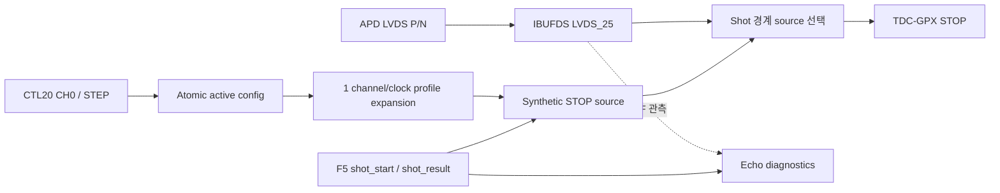

# Checkpoint G Echo Frontend Sign-off

## 1. 판정

Stage 4 / Checkpoint G는 **Complete**다. 이 단계는 B4 Echo 경계만 이동했으며
GPX bus read, I-Mode 28-bit decode, IFIFO drain, Hit/Cell/VDMA 처리는 Stage 5
이후 범위로 남겼다.

확정된 핵심 계약은 다음과 같다.

1. 물리 Echo는 `IBUFDS -> GPX STOP` 직접 경로다.
2. runtime CSR, shot window, 진단기 및 AXIS backpressure가 물리 STOP을 막거나
   지연하지 않는다.
3. synthetic Echo 지연은 CTL20 한 word의 `CH0 + channel * STEP`으로 최대
   32채널을 만든다.
4. `enable_echo_receiver=false`이면 Echo frontend 전체가 합성되지 않는다.
5. 16/32채널, Return 1..7 및 Processing/TDC 두 routine clock 관계가 모두
   검증되었다.

## 2. 모듈 역할

| 모듈 | 역할 | 물리 STOP 경로 영향 |
|---|---|---|
| `echo_stop_frontend` | 채널별 LVDS 입력 버퍼, 물리/가상 source 선택, 진단용 edge 관측 | 물리 모드에서 `IBUFDS -> STOP` 직접 연결 |
| `echo_delay_profile` | CTL20 두 source 값을 최대 32개 Processing-clock 지연으로 순차 전개 | 없음; simulation build에만 존재 |
| `echo_sim_source` | Shot별 synthetic STOP pulse 생성 | simulation mode에서만 선택 |
| `echo_diagnostics` | Shot window, 채널별 Rise/Fall 수, Return 합계 및 sticky 진단 | 관측 전용; STOP/GPX 완료를 제어하지 않음 |
| `lidar_echo_subsystem` | build generate, source 조립 및 typed interface 제공 | 직접 경로 계약을 보존 |

## 3. 데이터 흐름



물리 펄스는 Processing clock보다 짧아도 STOP에 전달된다. 진단기는 clock으로
표본화하므로 1.5 ns 펄스를 놓칠 수 있으며, 이 차이는 결함이 아니라 의도된
저지연/관측 분리다. 진단 count는 GPX IFIFO count가 아니다.

## 4. 채널 순서와 Return 의미

```text
channel = chip_index * STOPS_PER_CHIP + stop_index
```

- 2 chip x 8 STOP은 채널 0..15다.
- 4 chip x 8 STOP은 채널 0..31이다.
- Return 1..7은 같은 Shot window에서 같은 물리 STOP에 들어온 첫 번째부터
  일곱 번째 pulse다.
- Rise/Fall 측정 역할은 Echo가 결정하지 않는다. GPX register와 build slope
  capability가 결정한다.

## 5. CTL20 Compact Delay Profile

| Field | Bit | 단위 | 기본값 |
|---|---:|---|---:|
| `CHANNEL_0_DELAY` | 15:0 | 5 ns ticks | 0 |
| `CHANNEL_STEP` | 31:16 | 5 ns ticks/channel | 0 |

```text
delay_5ns[n] = CHANNEL_0_DELAY + n * CHANNEL_STEP
```

예를 들어 CH0=100, STEP=3이면 채널 0/1/2/31은 각각
100/103/106/193 ticks다. 채널별 CSR 32개와 INDEX/DATA/APPLY FSM은 필요 없다.

두 입력 field는 16 bit지만 전개 누산기와 local-clock count는 32 bit다.
따라서 최대 입력에서도 `65535 + 31 * 65535 = 2,097,120 ticks`를 보존한다.
변환은 지원 Processing 주파수 50/100/125/150/200 MHz에 대해 정확한 정수
shift/add와 올림으로 한 번만 수행한다.

새 active version을 받으면 채널 0부터 한 clock에 한 entry씩 전개한다. 최대
32 Processing clocks 뒤 profile이 ready가 된다. ready 전 synthetic Shot은
발생시키지 않고 `profile_not_ready` pulse/sticky/count로 기록한다.

## 6. Build Option Matrix

| Receiver | Simulation | 합성 결과 | 사용 가능 경로 |
|---:|---:|---|---|
| 0 | 0 | IBUFDS/observer/profile/source 제거, STOP/diagnostics=0, ready/idle=1 | 없음 |
| 1 | 0 | 물리 frontend와 진단기만 합성 | physical Echo |
| 1 | 1 | 물리 frontend, 진단기, compact profile, synthetic source 합성 | Shot별 physical/simulation 선택 |
| 0 | 1 | build validation error | 금지 |

`enable_echo_receiver`와 `enable_echo_simulation`은 generic이 포함된 build
profile이다. runtime CSR bit가 아니므로 운용 중 구조가 바뀌지 않는다.

## 7. Source 선택과 Shot 일관성

source mode는 승인된 `shot_start_event_t` 경계에서 latch되고 Shot이 끝날 때까지
바뀌지 않는다. 따라서 active configuration이 갱신되거나 software shadow가
변경되어도 한 Shot 안에서 physical/simulation source가 섞이지 않는다.

`shot_result_t`는 진단 snapshot의 identity와 timeout/abort 문맥만 제공한다.
진단 합계는 32채널 200 MHz timing을 위해 한 clock pipeline으로 마감하므로
snapshot valid는 result보다 한 Processing clock 늦다. 이 지연은 STOP과 GPX
acquisition 경로에 없다.

## 8. 기능 회귀

| Profile | 확인 내용 | 결과 |
|---|---|---|
| physical 16ch, PROC/TDC 150/200 | 16채널, 1.5 ns pulse, Return 1..7, Shot snapshot | PASS |
| physical 32ch, PROC/TDC 200/150 | 최대 채널 수와 reverse clock relation | PASS |
| simulation 16ch, PROC/TDC 150/200 | CH0/STEP 전개, version rebuild, ready interlock | PASS |
| simulation 16ch, PROC/TDC 200/150 | reverse clock relation synthetic source | PASS |
| receiver disabled 16ch | STOP/status inactive, frontend 제거 계약 | PASS |

최종 기능 로그에는 모든 profile의 `LIDAR_V2_ECHO_SUBSYSTEM_PASS` marker가
있다.

## 9. 구현 결과

Target은 `xc7z020clg484-2`, Vivado 2025.2.1이다.

| Build profile | IBUFDS | Profile cells | STOP 앞 register/latch | WNS |
|---|---:|---:|---:|---:|
| physical 16ch, PROC 150 MHz | 16 | 0 | 0 / 0 | +2.591 ns |
| physical 32ch, PROC 200 MHz | 32 | 0 | 0 / 0 | +0.404 ns |
| simulation 16ch, PROC 150 MHz | 16 | 784 | 17 / 0 | +1.012 ns |
| receiver disabled | 0 | 0 | 0 / 0 | timing path 없음 |

Simulation build의 STOP register fan-in은 synthetic source와 mode latch다.
Production physical build의 STOP 앞 register 수는 0이다. 32채널 진단 합계는
balanced popcount 뒤 한 clock pipeline을 사용해 최초 -1.784 ns 경로를
+0.404 ns로 닫았고, 물리 STOP latency는 바꾸지 않았다.

## 10. 증거와 다음 단계

- Echo 최종 session:
  `signoff_results/sessions/260805_stage4_g_echo_final_v2_echo`
- Unified CSR CTL20 session:
  `signoff_results/sessions/260805_stage4_g_ch0_step_csr_v2_unified_csr`
- 실행기: `system_integration/v2/scripts/run_v2_echo.ps1`
- TB: `system_integration/v2/tb/tb_lidar_echo_subsystem.vhd`

Checkpoint G 이후 허용되는 다음 작업은 Stage 5 / Checkpoint H다. 여기서 proven
v1 GPX bus engine을 typed request/result boundary로 감싸고 B5 bus word/order를
비교한다. Echo count를 IFIFO count나 GPX read completion으로 사용해서는 안 된다.
