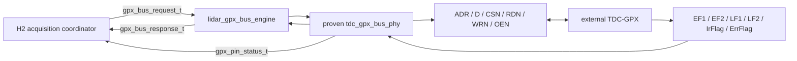

# Checkpoint H1 GPX Bus Engine

## 1. 판정

H1은 통과했다. v2의 typed request/response 경계가 검증된 v1
`tdc_gpx_bus_phy`를 변경 없이 소유하며, 허용된 두 OEN 배선 모드와
200/150 MHz TDC clock에서 cycle/pin 등가성을 만족한다.

이 결과는 Stage 5 전체 완료를 의미하지 않는다. H1은 외부 GPX 물리 bus
transaction만 닫는다. Shot별 IFIFO1/IFIFO2 drain 순서, per-chip acquisition
coordinator, Processing/TDC CDC와 B5 end-to-end identity는 H2/H3 범위다.

## 2. 역할과 경계



`lidar_gpx_bus_engine`은 다음 일만 수행한다.

1. typed request/timing record를 검증된 PHY의 scalar port로 변환한다.
2. 기존 AXIS 형태의 단일 bus response를 typed response로 해석한다.
3. 동기화된 상태 pin을 하나의 typed status record로 묶는다.
4. 실제 적용되는 locally clamped `BUS_TICKS`를 진단값으로 제공한다.

주소/데이터 snapshot, held-valid one-shot, read/write turnaround, IOB read
capture, burst tail과 response backpressure는 계속 `tdc_gpx_bus_phy`가
단독 소유한다.

## 3. Typed Contract

### 3.1 Request

| Field | Width | Contract |
|---|---:|---|
| `valid` | 1 | non-burst는 high 구간당 한 transaction |
| `write` | 1 | 0=read, 1=write |
| `address` | 4 | GPX register 0..15 |
| `write_data` | 28 | GPX write payload |
| `oen_permanent` | 1 | dynamic OEN drain burst 요청 |
| `burst` | 1 | live burst 지속/종료 조건 |

### 3.2 Response

| Field | Width | Contract |
|---|---:|---|
| `valid` | 1 | ready까지 payload 고정 |
| `write_ack` | 1 | 0=read result, 1=write acknowledge |
| `address` | 4 | accepted request address snapshot |
| `read_data` | 28 | external GPX read word |

### 3.3 Status

`EF1/EF2`만 IFIFO empty의 최종 권한이다. `LF1/LF2`는 burst 기회,
`IrFlag`는 measurement timer 완료, `ErrFlag`는 chip fault 진단이다. Echo
count는 IFIFO occupancy로 사용하지 않는다.

## 4. BUS_TICKS 폭 결함과 수정

통합 CSR의 `TDC_BUS_PROFILE.BUS_TICKS` 저장 필드는 6 bit지만 검증된 물리
PHY 입력은 3 bit다. 상위 3 bit를 조용히 절단하면 software가 쓴 값과 실제
bus timing이 달라진다.

H1에서 다음 계약으로 고정했다.

- `BUS_CLK_DIV`: commit 허용 범위 `1..63`;
- `BUS_TICKS`: commit 허용 범위 `1..7`;
- 요청값이 board-safe read capture 시간보다 짧으면 PHY가 locally clamp;
- `BUS_TICKS > 7`은 reference calculator와 sequential validator 모두
  `CFG_RUNTIME_BUS_TIMING`으로 거부;
- 거부된 commit은 현재 active configuration을 변경하지 않는다.

CSR bit 배치는 호환성을 위해 유지한다. 따라서 `TDC_BUS_PROFILE[11:9]`는
항상 0이어야 한다.

## 5. 기능 검증

`tb_lidar_gpx_bus_engine`은 새 wrapper와 direct v1 PHY를 같은 입력으로
동시에 구동하고 매 TDC clock마다 비교한다.

| Profile | Result |
|---|---|
| 200 MHz, `DYNAMIC_CONNECTED` | PASS |
| 150 MHz, `DYNAMIC_CONNECTED` | PASS |
| 200 MHz, `PULLUP_OR_NOT_CONNECTED` | PASS |
| 150 MHz, `PULLUP_OR_NOT_CONNECTED` | PASS |

검사 항목은 physical pins, busy/pending, synchronized status, read payload,
write acknowledge, held-valid one-shot, stalled response 안정성, illegal-short
timing clamp와 3-beat burst 종료다.

추가 구성 회귀 결과:

- `V2-CALC-118`: `BUS_TICKS=8` reference/sequential 계산기 거부 PASS;
- `V2-MGR-004B`: atomic manager 거부 및 active payload 보존 PASS;
- 두 검사는 routine 150/200 및 200/150 MHz profile에서 통과했다.

## 6. 구현 결과

Target device는 `xc7z020clg484-2`, Vivado는 2025.2.1이다.

| Profile | WNS | Latch | Proven PHY hierarchy |
|---|---:|---:|---:|
| 200 MHz, dynamic OEN | +1.783 ns | 0 | present |
| 150 MHz, pull-up/not-connected OEN | +3.269 ns | 0 | present |

OOC 구현의 외부 pin 위치 및 board I/O delay 경고는 parent XDC에서 닫아야
하며 H1 내부 논리 timing 결과와 구분한다.

## 7. 재현과 증적

재현 스크립트:

```powershell
powershell.exe -NoProfile -ExecutionPolicy Bypass `
  -File system_integration/v2/scripts/run_v2_gpx_bus.ps1
```

보존된 증적:

- `signoff_results/sessions/260805_stage5_h1_bus_equiv_r2_v2_gpx_bus`
- `signoff_results/sessions/260805_stage5_h0_bus_width_v2_commit_calculator_v2_commit_calculator`
- `signoff_results/sessions/260805_stage5_h0_bus_width_v2_config_manager_v2_config_manager`

## 8. 다음 단계

H2는 다음 순서로 진행한다.

1. Processing-domain Shot/acquisition command를 TDC domain으로 전달하는
   named gateway를 구현한다.
2. SYNC mode는 동일한 물리 clock일 때만 direct registered path를 사용한다.
3. ASYNC mode는 command/result payload를 handshake/FIFO로 원자적으로
   전달한다.
4. 검증된 `tdc_gpx_chip_run` drain 순서를 typed coordinator 뒤에 보존한다.
5. B5에서 `chip_index + IFIFO identity + raw_28 + shot identity`의 순서와
   backpressure 무결성을 비교한다.
