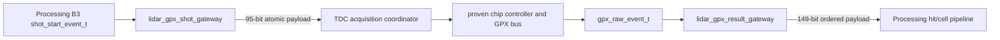

# Checkpoint H2A GPX Event Gateways

## 1. 판정

H2A는 통과했다. Processing domain의 Shot 시작 정보와 TDC domain의 GPX
원시 결과를 각각 하나의 원자적 ready/valid payload로 전달하며, 두 routine
비동기 clock 조합과 같은 clock을 사용하는 SYNC 조합에서 순서와 모든 field가
보존된다.

이 판정은 Stage 5 전체 완료가 아니다. H2A는 clock-domain 경계만 닫는다.
검증된 `tdc_gpx_chip_ctrl`/`tdc_gpx_chip_run`을 typed acquisition lane으로
연결하고 IFIFO1/IFIFO2 drain, timeout, cap 및 B5 identity를 비교하는 작업은
H2B/H3에 남아 있다.

## 2. 역할과 데이터 흐름



두 gateway는 field별 synchronizer를 만들지 않는다. payload 전체가 하나의
handshake 단위이며, destination이 stall하면 payload와 순서가 그대로 유지된다.

### 2.1 공통 전송기

`lidar_stream_gateway`는 build-time clock mode에 따라 한 구현만 합성한다.

| Mode | 합성 구조 | 사용 조건 |
|---|---|---|
| `STREAM_CLOCK_SYNC` | 1-entry registered elastic slot | 두 port가 같은 물리 clock net과 같은 reset을 사용 |
| `STREAM_CLOCK_ASYNC` | depth-16 XPM asynchronous FIFO | 독립 Processing/TDC clock |

같은 MHz라는 사실만으로 SYNC를 선택할 수 없다. 150 MHz/150 MHz라도 서로
다른 MMCM/FCLK 출력이면 ASYNC를 사용해야 한다.

## 3. Processing-to-TDC Shot Payload

외부 ready/valid의 `valid`를 제외한 payload 폭은 95 bit이다.

| Field | Width | 의미 |
|---|---:|---|
| request valid | 1 | B2에서 확정된 request identity |
| Face index | 3 | Shot을 소유한 Face |
| position | 15 | 발사 판단에 사용한 decoded state |
| direction | 1 | CW/CCW |
| shot index | 16 | Face 안의 기하학적 column 번호 |
| last in Face | 1 | 해당 Face의 마지막 예정 Shot |
| simulation source | 1 | physical/simulation 실행 구분 |
| source latency | 8 | 승인된 B0 latency metadata |
| source latency valid | 1 | latency metadata 유효성 |
| active version | 16 | 원자적으로 활성화된 설정 version |
| fire-to-T0 clocks | 32 | 실제 fire 기준 T0 측정값 |

합계는 63-bit request와 32-bit `fire_to_t0_clks`의 95 bit이다. TDC
coordinator는 이 정보를 재계산하지 않고 Shot context로 보존해야 한다.

## 4. TDC-to-Processing Raw Result Payload

외부 ready/valid의 `valid`를 제외한 payload 폭은 149 bit이다.

| Field | Width | 의미 |
|---|---:|---|
| event kind | 2 | DATA, IFIFO1_DONE, DRAIN_DONE, TIMEOUT |
| chip index | 2 | GPX chip 0..3 |
| IFIFO identity | 1 | IFIFO1/IFIFO2 |
| raw word | 28 | 외부 GPX I-Mode word 원본 |
| faulted | 1 | 해당 Shot/Chip 결과 fault 표시 |
| timeout cause | 3 | timeout 분류 |
| Shot context | 96 | 95-bit Shot payload와 Shot valid |
| chip Shot sequence | 16 | Chip-local Shot 순서 진단값 |

DATA와 control event를 별도 FIFO로 나누지 않는다. 하나의 ordered stream을
사용하므로 IFIFO1_DONE이 앞선 IFIFO1 DATA를 추월하거나 DRAIN_DONE이 마지막
IFIFO2 DATA보다 먼저 도착할 수 없다.

## 5. Reset 계약

- reset은 비동기로 assert하고 source clock에서 동기적으로 release한다.
- ASYNC FIFO reset은 source clock이 소유하며 destination reset도 source 쪽
  reset stretcher를 통해 FIFO 전체에 반영한다.
- reset 중에는 source ready와 destination valid가 모두 닫힌다.
- reset 경계의 in-flight payload 보존은 계약하지 않는다. 상위 operation
  owner가 acquisition을 abort하고 새 Shot sequence에서 다시 시작해야 한다.
- 정상 운용 중 Shot 경계나 backpressure는 reset 사유가 아니다.

## 6. 기능 검증

각 방향으로 64개 payload를 동시에 전송했다. destination ready를 반복적으로
내려 stall을 만들고 모든 record field와 수신 순서를 exact compare했다.

| Profile | Shot 64 | Result 64 | Backpressure | 결과 |
|---|---:|---:|---|---|
| Processing 150 / TDC 200 MHz, ASYNC | 보존 | 보존 | 양방향 | PASS |
| Processing 200 / TDC 150 MHz, ASYNC | 보존 | 보존 | 양방향 | PASS |
| Shared 150 MHz physical clock, SYNC | 보존 | 보존 | 양방향 | PASS |

## 7. 구현 및 CDC 결과

Target은 `xc7z020clg484-2`, tool은 Vivado 2025.2.1이다.

| Profile | WNS | Latch | Async FIFO hierarchy |
|---|---:|---:|---|
| Processing 150 / TDC 200 MHz | +0.903 ns | 0 | present |
| Processing 200 / TDC 150 MHz | +0.988 ns | 0 | present |
| Shared 150 MHz SYNC | +4.045 ns | 0 | absent |

비동기 `report_cdc`의 CDC-3 4건, CDC-6 8건, CDC-15 244건은 모두 두
XPM FIFO 내부 pointer synchronizer와 dual-clock memory 구조에 속한다. 보고서의
상세 endpoint를 XPM hierarchy 밖으로 필터링한 사용자 RTL CDC finding은 0건이다.
SYNC profile에는 CDC path와 async FIFO hierarchy가 없다.

OOC DRC의 `ZPS7-1`은 Zynq part를 PS7 없이 합성한 harness 경고이고,
비동기 profile의 `RTSTAT-10`은 외부 관찰용 reset-busy output의 OOC load
경고다. 둘 다 parent integration에서 다시 판정하며 H2A 기능 경로 결함은 아니다.

## 8. Echo 및 채널 지연 계약 유지

H2A는 Checkpoint G의 Echo 구조를 변경하지 않는다.

- `enable_echo_receiver=false`: physical/simulation Echo frontend와 관련 STOP 생성
  로직이 합성에서 제거된다.
- `enable_echo_receiver=true, enable_echo_simulation=false`: physical
  LVDS-to-STOP만 합성된다.
- `enable_echo_receiver=true, enable_echo_simulation=true`: physical path와 synthetic test
  source가 함께 합성된다.
- `enable_echo_receiver=false, enable_echo_simulation=true` 조합은 build validation에서
  거부한다.
- 32채널 simulation 지연은 32개 CSR table이 아니라 CTL20의 두 값만 사용한다.

```text
channel_delay[n] = CHANNEL_0_DELAY + n * CHANNEL_STEP,  n = 0..31
```

따라서 H2 이후에도 채널별 CSR 32개를 새로 만들지 않는다.

## 9. 재현 증적과 다음 단계

재현 명령:

```powershell
powershell.exe -NoProfile -ExecutionPolicy Bypass `
  -File system_integration/v2/scripts/run_v2_gpx_event_gateway.ps1
```

PASS marker는 `LIDAR_V2_GPX_EVENT_GATEWAY_PASS`이고 최종 증적은 다음에 있다.

- `signoff_results/sessions/260805_stage5_h2a_cdc_final_v2_gpx_event_gateway`

H2B는 다음 순서로 진행한다.

1. proven `tdc_gpx_chip_ctrl`과 `tdc_gpx_chip_run`의 현재 port/상태 ownership을
   다시 고정한다.
2. H1 bus engine과 H2A Shot/result gateway 사이에 typed per-chip acquisition
   lane을 둔다.
3. IFIFO1 DATA -> IFIFO1_DONE -> IFIFO2 DATA -> DRAIN_DONE 순서를 그대로
   보존한다.
4. 각 event에 동일한 Shot context와 chip sequence를 붙인다.
5. timeout, cap, output stall을 넣은 B5 exact comparison을 통과한 뒤 H3로
   넘어간다.
