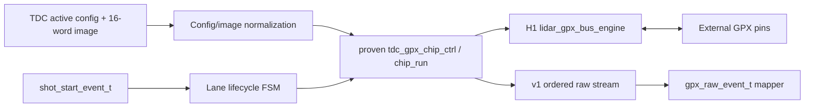

# Checkpoint H2B-1 GPX Acquisition Lane

## 1. 판정

H2B-1 단일-Chip acquisition lane은 통과했다. 새 RTL은 검증된
`tdc_gpx_chip_ctrl`, `tdc_gpx_chip_run` 및 H1 `lidar_gpx_bus_engine`을 그대로
재사용하고, v2 설정/이벤트 타입과의 경계만 담당한다.

이 판정은 단일 Chip lane에 한정된다. 다중 Chip Shot 원자성, 결과 merge,
통합 CSR의 GPX register-image portal 및 B5 v1 비교는 H2B-2/H3에 남아 있다.

## 2. 모듈 역할



`lidar_gpx_acquisition_lane`이 소유하는 기능은 다음과 같다.

- power-up 완료, config apply, run start/stop 및 Shot outstanding 상태;
- accepted Shot context와 Chip-local Shot sequence 보존;
- v2 runtime 설정을 검증된 v1 controller 입력 폭으로 변환;
- build topology에 맞는 GPX Reg0 START/STOP edge 정규화;
- v1 raw/control beat를 named v2 event로 변환;
- terminal event 수락과 Chip sequence 증가가 모두 확인된 뒤 재-arm.

Hit 17-bit 해석, 거리 계산, Cell/Frame 구성은 이 모듈의 책임이 아니다.

## 3. GPX Register Image 적용

v2 경계는 16 x 32-bit `gpx_register_image_t`를 받는다. H2B-1은 reset/default
값을 복제하지 않고 board-proven `c_GPX_DEFAULT_IMAGE`를 integration/test
계층에서 이 타입으로 변환한다.

Lane은 bus transaction 전 다음 항목만 정규화한다.

1. 모든 present Chip의 TStart는 rising=1, falling=0으로 고정한다.
2. runtime active mask와 derived rise/fall mask로 TStop1..8 edge를 선택한다.
3. build-time `stops_per_chip`보다 큰 STOP bit는 0으로 강제한다.
4. Reg5 StartOff1과 MasterAluTrig 정책을 active config에 맞춘다.
5. Reg7 등 나머지 값은 입력 image를 그대로 보존한다.

검증된 초기화 FSM은 image 16개를 무조건 쓰지 않는다. 필수 register
sequence 11개와 Reg4 master-reset write 1개를 수행한다. 나머지 image slot은
예약/미사용 상태로 유지된다.

## 4. Shot과 Event 순서

한 Shot의 정상 event 순서는 다음과 같다.

| 순서 | v1 raw beat | v2 event kind | 의미 |
|---:|---|---|---|
| 1 | IFIFO1 data | `GPX_RAW_DATA`, IFIFO=0 | GPX Reg8의 원본 28 bit |
| 2 | IFIFO1 control | `GPX_RAW_IFIFO1_DONE` | IFIFO1 data 종료 경계 |
| 3 | IFIFO2 data | `GPX_RAW_DATA`, IFIFO=1 | GPX Reg9의 원본 28 bit |
| 4 | final control | `GPX_RAW_DRAIN_DONE` | 정상 Shot/Chip 종료 |
| 4a | timeout final control | `GPX_RAW_TIMEOUT` | timeout cause와 fault를 포함한 종료 |

모든 event는 같은 `shot_start_event_t`, `chip_index` 및 Shot 시작 때 캡처한
`chip_shot_seq`를 가진다. output ready가 low이면 v1 raw FIFO와 보존된 Shot
문맥이 payload 전체를 안정적으로 유지한다.

Lane은 final control beat handshake만으로 다음 Shot을 받지 않는다. 검증된
controller가 ALU recovery를 끝내고 `chip_shot_seq`를 증가시킨 사실까지 함께
확인한 뒤 `o_shot_ready`를 다시 올린다. 따라서 느린 downstream과 GPX 내부
재-arm 중 어느 한쪽도 Shot 경계를 앞당길 수 없다.

## 5. 기능 검증

행동 GPX model로 다음을 exact compare했다.

- power-up mandatory register write와 Reg0 topology normalization;
- 4-word IFIFO1, IFIFO1_DONE, 3-word IFIFO2, DRAIN_DONE 순서;
- Chip/IFIFO/raw-28/Shot-context/sequence identity;
- 첫 data beat 5-clock backpressure 동안 전체 event 안정성;
- terminal event 후 Shot sequence 증가와 재-arm;
- run stop 후 safe 복귀;
- config apply 후 Reg5 StartOff1 갱신;
- empty IFIFO read 0건 및 예상치 못한 fault 0건.

| TDC clock | Simulation | Post-route WNS | Latch |
|---:|---|---:|---:|
| 150 MHz | PASS | +1.400 ns | 0 |
| 200 MHz | PASS | +0.736 ns | 0 |

최종 증적:

- `signoff_results/sessions/260805_stage5_h2b1_lane_r2_v2_gpx_acquisition_lane`
- H2A package 비회귀:
  `signoff_results/sessions/260805_stage5_h2b1_pkg_nonreg_v2_gpx_event_gateway`

OOC의 unconstrained pin/`HD.CLK_SRC` 경고는 parent XDC 전 단계의 harness
경고이며, routed net 0 failure와 positive WNS를 확인했다. 사용자 Tcl Store
catalog 손상 경고는 runner가 설치 영역의 Tcl package를 명시적으로 로드하여
회귀 결과에 영향을 주지 않도록 했다.

## 6. Echo와 32채널 지연 비회귀

H2B-1은 Echo RTL과 CSR을 변경하지 않았다.

- `enable_echo_receiver`와 `enable_echo_simulation` build option 유지;
- receiver=false/simulation=true 불법 조합은 build validation에서 계속 거부;
- 32채널 simulation delay는 CTL20의 두 값만 사용;
- `delay[n] = channel_0_delay + n * channel_step`;
- 채널별 32-word delay table은 추가하지 않음.

## 7. H2B-2로 넘기는 항목

1. active Chip 전체가 ready일 때만 하나의 Shot을 원자적으로 배포한다.
2. runtime active mask에서 제외된 lane은 run/Shot/pin activity를 정지한다.
3. per-Chip event를 deterministic order로 merge하고 backpressure를 전파한다.
4. 모든 활성 Chip의 terminal event를 모아 Shot completion을 결정한다.
5. unified CSR의 reserved word 중 두 word를 사용해 하나의 indexed GPX image
   portal을 구현하고, image와 active config가 같은 transaction으로 적용되게
   한다.
6. TDC-domain config gateway의 ACTIVATE/RELEASE가 외부 GPX programming 완료를
   기다리도록 acknowledgement 책임을 연결한다.
7. timeout, cap, status 변화 및 long backpressure를 H3 v1 oracle과 비교한다.

## 8. H3 후속 종료 기록

위 항목은 H2B-2A, H2B-2B와 H3에서 모두 완료되었다. H3에서 물리 drain cap은
runtime Hit 정책과 분리해 다음 합성 topology 식으로 고정했다.

```text
cap_words_per_ififo = stops_per_chip * max_returns_per_stop
cap_quads = ceil(cap_words_per_ififo / 4)
```

물리 cap 도달은 faulted terminal event뿐 아니라 `drain_cap_sticky`에도
기록한다. 상세 결과와 증적은
`V2_CHECKPOINT_H3_GPX_ACQUISITION_SUBSYSTEM.md`를 따른다.
