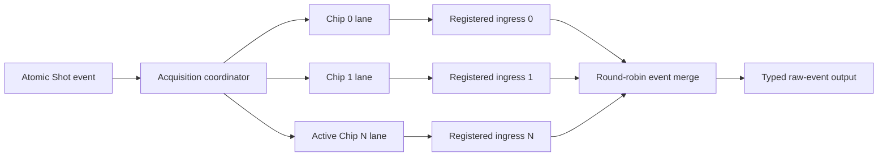

# Checkpoint H2B-2A: Multi-Chip GPX Acquisition Coordinator

## 1. 판정

H2B-2A는 **PASS**다. 이 판정은 다중 Chip Shot 분배, lane 결과 병합과
Shot 완료 조건까지의 범위이며, GPX register image의 CSR portal과 실제 Chip
programming 완료 연동은 H2B-2B에 남아 있다.

## 2. 구현 경계



- Shot은 모든 runtime-active lane이 ready일 때 한 번만 승인된다.
- 동일 Shot record가 같은 TDC clock에서 모든 active lane에 전달된다.
- runtime-inactive lane은 Shot, STOP 및 raw read를 수행하지 않는다.
- 설정 적용은 runtime mask와 무관하게 모든 build-time present Chip에 전달한다.
- 결과 identity는 `Shot + Chip + IFIFO + raw 28-bit + kind + sequence`로 보존한다.
- `DRAIN_DONE` 또는 `TIMEOUT`이 downstream에서 실제로 승인된 뒤에만 해당
  Chip을 terminal 완료로 표시한다.
- 모든 active Chip의 terminal event가 승인되어야 `o_shot_complete`가 한
  clock 발생한다.

## 3. Backpressure와 타이밍 수정

첫 구현은 lane valid를 조합 arbitration에 직접 넣어 다른 lane의 ready까지
되돌리는 경로가 있었다. 200 MHz 구현에서 다음 cross-lane 경로가
`WNS -0.105 ns`로 실패했다.

```text
Chip 3 raw valid/count
  -> combinational arbitration
  -> Chip 0 raw ready
  -> Chip 0 raw FIFO write enable
```

각 lane 앞에 독립적인 1-entry registered ingress를 추가했다. 그 결과 lane
ready는 자기 ingress의 empty 상태에만 의존하며, arbitration과 output
backpressure는 lane controller에서 한 register 경계 뒤로 분리된다. output
slot도 record 전체를 등록하므로 stall 중 모든 field가 유지된다.

## 4. 검증 결과

테스트 구성은 build-time 4 Chip, runtime active mask `1011`이다.

| 검증 항목 | 결과 |
|---|---|
| Chip 0/1/3 Shot 동시 수락 | PASS |
| 비활성 Chip 2 raw read/event 없음 | PASS |
| IFIFO1 DATA -> IFIFO1_DONE -> IFIFO2 DATA -> DRAIN_DONE | PASS |
| raw 28-bit, Chip, IFIFO, Shot context, sequence exact compare | PASS |
| 5-clock output backpressure 중 record 안정성 | PASS |
| 모든 active terminal 승인 후에만 Shot complete | PASS |
| runtime-inactive Chip을 포함한 4개 물리 Chip 설정 fan-out | PASS |
| empty read 및 lane fault | 0 |

| Profile | Simulation | Post-route WNS | Latch |
|---|---:|---:|---:|
| TDC 150 MHz | PASS | +0.882 ns | 0 |
| TDC 200 MHz | PASS | +0.324 ns | 0 |

증적:

- `signoff_results/sessions/260805_stage5_h2b2_coord_r2_v2_gpx_acquisition_coordinator`

## 5. Echo 비회귀 확인

H2B-2A는 Echo Receiver 구조나 CSR map을 변경하지 않는다.

- `enable_echo_receiver`와 `enable_echo_simulation` build option은 유지한다.
- Echo simulation delay는 unified CSR의 **CTL20 한 word**만 사용한다.
- `CTL20[15:0]`: Channel 0 delay
- `CTL20[31:16]`: 다음 채널마다 더할 delay step
- `delay[n] = delay[0] + n * step`, `n = 0..31`
- 32채널별 개별 delay register table은 추가하지 않는다.

## 6. 다음 단계 H2B-2B

1. reserved CTL 두 word로 16-entry GPX register image를 접근하는 indexed
   portal을 정의한다.
2. 한 configuration transaction에서 모든 물리 Chip에 같은 image를 적용한다.
3. TDC-domain ACTIVATE ACK를 모든 물리 Chip의 programming 완료까지 보류한다.
4. programming timeout/fault를 configuration 실패와 통합 진단으로 전달한다.

H2B-2B와 H3가 끝나기 전에는 Stage 5 / Checkpoint H 전체를 sign-off하지 않는다.
